# Novelty Evaluation: Generative Modeling via Drifting

## Run Metadata

**Run context**

| Field | Value |
|-------|-------|
| Timestamp (America/New_York) | 2026-03-25 13:03:14 -0400 America/New_York (UTC: 2026-03-25T17:03:14Z) |
| Branch | copilot/resolve-technical-debts |
| Commit | [`3eb8fa9`](https://github.com/yulinl2/Open-Idea-Sourcing/commit/3eb8fa9f588b8cad9283bafec735c1a1c8e4026f) |
| CI Run | [Run #23553584845](https://github.com/yulinl2/Open-Idea-Sourcing/actions/runs/23553584845) |

**Configuration**

| Field | Value |
|-------|-------|
| Model | gpt-4o |
| Input | https://arxiv.org/pdf/2602.04770 |
| Code version | 2.1.0 |

**Performance**

| Field | Value |
|-------|-------|
| Total runtime | 35.6s |
| └─ parsing | 3.7s |
| └─ ref_load | 0.0s |
| └─ online_search | 2.4s |
| └─ similarity | 0.0s |
| └─ domain_references | 9.3s |
| └─ evaluation | 19.9s |

## Pipeline Job Log

```mermaid
gantt
    title Pipeline Run — Generative Modeling via Drifting
    dateFormat x
    axisFormat %S.%Ls
    section PaperParser
    Parse paper :done, 0, 3660ms
    section ReferenceStore
    Load references :done, 3660, 1ms
    section SemanticScholar API
    Online reference search :done, 3660, 2360ms
    section SimilaritySearch
    Similarity search :done, 6020, 1ms
    section LLM (gpt-4o)
    Domain references :done, 6020, 9310ms
    Idea decomposition :done, 15692, 4822ms
    Duplication check :done, 20514, 2556ms
    Combination check :done, 23070, 3710ms
    Equivalence check :done, 26780, 4314ms
    Synthesis :done, 31094, 2288ms
    Reference annotation :done, 33382, 2241ms
```



**PaperParser**

| # | Job | Start (s) | Duration (s) | Input | Output |
|---|-----|----------:|-------------:|-------|--------|
| 1 | Parse paper | 0.00 | 3.66 | 2602.04770.pdf | "Generative Modeling via Drifting", 77815 chars |

<details>
<summary>📋 Parse paper — details</summary>

**Title:** Generative Modeling via Drifting

**Authors:** *(not extracted)*

**Abstract:** *(not extracted)*

**Sections (52):**
- Generative Modeling via Drifting
- GenerativeModelingviaDrifting
- RelatedWork
- Agrowingbodyofworkhasfocusedonreducingthesteps
- GenerativeModelingviaDrifting
- GenerativeModelingviaDrifting
- GenerativeModelingviaDrifting
- Thefeatureextractorplaysanimportantroleinthegenera-
- ImplementationforImageGeneration
- Wedescribeourimplementationforimagegenerationon
- GenerativeModelingviaDrifting
- GenerativeModelingviaDrifting
- Multi-stepDiffusion/Flows
- Single-stepDiffusion/Flows
- Largersamplesizesareexpectedtoimprovetheaccuracy
- GenerativeModelingviaDrifting
- DiffusionPolicy DriftingPolicy
- ToolHang
- DriftingModels
- Kitchen

</details>

**ReferenceStore**

| # | Job | Start (s) | Duration (s) | Input | Output |
|---|-----|----------:|-------------:|-------|--------|
| 2 | Load references | 3.66 | 0.00 | references.json, references.json | 1 bundled ref(s) |

<details>
<summary>📋 Load references — details</summary>

**Bundled corpus** (`references.json`): 1 ref(s)
**Custom file** (`references.json`): 0 new ref(s) (all duplicates)

**Total before online search:** 1 ref(s)

</details>

**SemanticScholar API**

| # | Job | Start (s) | Duration (s) | Input | Output |
|---|-----|----------:|-------------:|-------|--------|
| 3 | Online reference search | 3.66 | 2.36 | arXiv:2602.04770 + 5 LLM queries | 0 paper(s) fetched |

<details>
<summary>📋 Online reference search — details</summary>

**Queries used:**
1. efficient generative modeling
2. drifting models generative
3. diffusion models generative
4. normalizing flows generative
5. moment matching generative

**Fetched papers (0):**
*(none fetched)*

**Errors encountered:**
- ⚠️ references: HTTP Error 429: 
- ⚠️ query 'efficient generative modeling': HTTP Error 429: 
- ⚠️ query 'drifting models generative': HTTP Error 429: 
- ⚠️ query 'diffusion models generative': HTTP Error 429: 
- ⚠️ query 'normalizing flows generative': HTTP Error 429: 
- ⚠️ query 'moment matching generative': HTTP Error 429: 

</details>

**SimilaritySearch**

| # | Job | Start (s) | Duration (s) | Input | Output |
|---|-----|----------:|-------------:|-------|--------|
| 4 | Similarity search | 6.02 | 0.00 | TF-IDF cosine on 1 ref(s) | top-1: 0.17×Conformal Prediction Under Covariat… |

<details>
<summary>📋 Similarity search — details</summary>

**Query (key content excerpt):**
```
Title: Generative Modeling via Drifting

Generative Modeling via Drifting
MingyangDeng1 HeLi1 TianhongLi1 YilunDu2 KaimingHe1
Figure1.DriftingModel.Anetworkfperformsapushforwardoperation:q=f p ,mappingapriordistributionp (e.g.,Gaussian,
# prior prior
notshownhere)toapushforwarddistributionq(orange).…
```

**All matches (1):**
| Score | Title | Year |
|------:|-------|------|
| 0.171 | Conformal Prediction Under Covariate Shift | 2020 |

</details>

**LLM (gpt-4o)**

| # | Job | Start (s) | Duration (s) | Input | Output |
|---|-----|----------:|-------------:|-------|--------|
| 5 | Domain references | 6.02 | 9.31 | paper content + 1 similar paper(s) | 5 domain reference(s) |
| 6 | Idea decomposition | 15.69 | 4.82 | paper content | 3 sub-idea(s) |
| 7 | Duplication check | 20.51 | 2.56 | paper content + 1 reference paper(s) | verdict=LOW |
| 8 | Combination check | 23.07 | 3.71 | paper content + 1 reference paper(s) | verdict=MEDIUM |
| 9 | Equivalence check | 26.78 | 4.31 | paper content + 1 reference paper(s) | verdict=HIGH |
| 10 | Synthesis | 31.09 | 2.29 | 3 dimension results | verdict=MARGINAL, confidence=MEDIUM |
| 11 | Reference annotation | 33.38 | 2.24 | paper + 1 similar paper(s) | 1 annotation(s) |

## Idea Decomposition

**Core concept:** The paper introduces Drifting Models, a novel generative modeling paradigm that evolves the pushforward distribution during training, enabling high-quality one-step inference.

### Concept Tree

```
Generative Modeling via Drifting
├── Problem: Generative modeling with efficient one-step inference
│   ├── Gap: Existing models require iterative inference processes
│   └── Metric: Quality of generated samples measured by FID scores
├── Method: Drifting Models
│   ├── Drifting Field
│   │   ├── Governs sample movement
│   │   └── Achieves equilibrium when distributions match
│   ├── Training Objective
│   │   ├── Minimizes drift of generated samples
│   │   └── Evolves pushforward distribution through optimization
│   └── Neural Network Architecture
│       ├── Single-pass, non-iterative network
│       └── Captures data distribution in one step
└── Evidence
    ├── Empirical: State-of-the-art FID scores on ImageNet 256×256
    └── Theoretical: Conceptual framework for drifting field and equilibrium
```

**Sub-ideas:**

- Introduction of a drifting field that governs sample movement and achieves equilibrium when the generated distribution matches the data distribution.
- Development of a training objective that minimizes the drift of generated samples, evolving the pushforward distribution through iterative optimization.
- Implementation of a non-iterative, single-pass neural network for one-step generation, achieving state-of-the-art results on benchmark datasets.

**Assumptions:**

- The drifting field can effectively guide the generated distribution to match the data distribution.
- The proposed training objective is sufficient to evolve the pushforward distribution towards the data distribution.
- The single-pass neural network architecture can capture the complexity of the data distribution in one step.

**Limitations:**

- The approach may rely heavily on the design of the drifting field, which could be challenging to optimize for different data distributions.
- The method's performance might be dataset-dependent, potentially requiring adjustments for different types of data.
- The theoretical underpinnings of the drifting field's convergence to equilibrium are not fully explored.

**Overall verdict:** ⚠️ **MARGINAL** (confidence: MEDIUM)

## Summary

The paper "Generative Modeling via Drifting" presents a novel approach by introducing the concept of Drifting Models, which distinguishes itself from traditional diffusion and flow-based models through its unique formulation of a drifting field. However, while the approach is innovative in its specific implementation, it shares significant conceptual similarities with existing methodologies, such as diffusion models and moment-matching methods. The novelty is primarily in the integration and specific application of these ideas rather than in the introduction of fundamentally new concepts. Given the subtle equivalence to established paradigms, the paper's contribution is considered marginally novel.

## Detailed Analysis

### Direct Duplication

<details>
<summary><strong>Risk level:</strong> 🟢 LOW</summary>

The submitted paper, "Generative Modeling via Drifting," introduces a novel approach to generative modeling by proposing a new paradigm called Drifting Models. This approach focuses on evolving the pushforward distribution during training, which is distinct from traditional diffusion or flow-based models that typically involve iterative inference processes. The concept of a drifting field that governs sample movement and achieves equilibrium when distributions match is a unique contribution that differentiates it from existing methods. The paper does not appear to be a direct duplicate of any known or referenced work, as it presents a new methodology and training objective that are not found in the related works cited, such as diffusion models or moment matching methods.

</details>

### Simple Combination

<details>
<summary><strong>Risk level:</strong> 🟡 MEDIUM</summary>

The submitted paper "Generative Modeling via Drifting" introduces a new paradigm for generative modeling called Drifting Models. This approach builds upon existing methodologies in generative modeling, particularly diffusion and flow-based models, by focusing on the evolution of the pushforward distribution during training. The concept of a "drifting field" that governs sample movement is a novel addition, but it is conceptually related to existing techniques like diffusion models (Sohl-Dickstein et al., 2015) and flow-based models (Lipman et al., 2022), which also involve mapping distributions through iterative processes. The paper also draws parallels to moment-matching methods and contrastive learning, leveraging ideas of kernel functions and positive/negative samples. While the combination of these elements into a single-step generative model is interesting, the novelty primarily lies in the specific formulation of the drifting field and its application to achieve equilibrium between distributions. The paper does not appear to be a simple combination of existing works, but rather an extension that integrates and builds upon them to propose a potentially valuable new approach.

</details>

### Methodological Equivalence

<details>
<summary><strong>Risk level:</strong> 🔴 HIGH</summary>

The proposed "Drifting Models" in the submitted paper appear to be a re-derivation of existing diffusion and flow-based generative models, specifically those that involve iterative transformation of a distribution towards a target data distribution. The concept of evolving a pushforward distribution during training and achieving equilibrium when the generated distribution matches the data distribution is conceptually similar to the iterative refinement process seen in diffusion models (e.g., Sohl-Dickstein et al., 2015) and flow-based models (e.g., Lipman et al., 2022). The "drifting field" introduced in the paper, which governs sample movement and achieves equilibrium when distributions match, is analogous to the differential equations (SDEs or ODEs) used in diffusion models to guide the transformation of noise to data. Additionally, the emphasis on a single-step inference process aligns with the goals of normalizing flows, which aim to perform one-step transformations using invertible architectures. The paper's approach of minimizing the drift of generated samples through iterative optimization also shares similarities with moment-matching methods that minimize discrepancies between distributions. Overall, the methods proposed in the paper are subtly equivalent to these well-established generative modeling paradigms, despite differences in terminology and framing.

**Cited references:** `Sohl-Dickstein et al.`, `2015`, `Lipman et al.`, `2022`, `Rezende & Mohamed`, `2015`, `Dinh et al.`, `2016`

</details>

## Most Similar Reference Papers

> **Scoring method:** TF-IDF cosine similarity (0–1). Higher scores indicate greater textual overlap between the paper's key content and the reference.

| Score | Title | Year |
|-------|-------|------|
| 0.17 | [Conformal Prediction Under Covariate Shift](https://arxiv.org/abs/1904.06019) | 2020 |

### Reference Annotations

**[0.17] [Conformal Prediction Under Covariate Shift](https://arxiv.org/abs/1904.06019) (2020)**

| Dimension | Notes |
|-----------|-------|
| **Overlap** | Both the submitted paper and this reference address the challenge of distributional shifts, albeit in different contexts. The submitted paper focuses on evolving the pushforward distribution to match the data distribution, while the reference paper deals with covariate shift in conformal prediction. |
| **Differences** | The submitted paper introduces a novel generative modeling approach using a drifting field to achieve distribution matching, whereas the reference paper extends conformal prediction techniques to handle covariate shift by utilizing a weighted conformal score. |
| **Derivation** | None identified. |

## Main Domain References

1. **[Deep Unsupervised Learning using Nonequilibrium Thermodynamics](https://www.semanticscholar.org/search?q=Deep+Unsupervised+Learning+using+Nonequilibrium+Thermodynamics&sort=Relevance)**, 2015
   *Jascha Sohl-Dickstein, Eric A. Weiss, Niru Maheswaranathan, Surya Ganguli*
   <details>
   <summary>Why this matters</summary>

   This paper introduces diffusion probabilistic models, which are foundational for understanding the iterative noise-to-data mapping that the submitted paper builds upon in its generative modeling approach.

   </details>

2. **[Denoising Diffusion Probabilistic Models](https://www.semanticscholar.org/search?q=Denoising+Diffusion+Probabilistic+Models&sort=Relevance)**, 2020
   *Jonathan Ho, Ajay Jain, Pieter Abbeel*
   <details>
   <summary>Why this matters</summary>

   This work significantly advanced the field of diffusion models by improving the efficiency and quality of generative models, providing a basis for the iterative inference methods that the submitted paper seeks to improve upon with its one-step generation approach.

   </details>

3. **[Flow Matching for Generative Modeling](https://www.semanticscholar.org/search?q=Flow+Matching+for+Generative+Modeling&sort=Relevance)**, 2022
   *Yaron Lipman, Yilun Du, Igor Mordatch*
   <details>
   <summary>Why this matters</summary>

   Flow-based models are closely related to the concept of pushforward distributions discussed in the submitted paper. This work provides insights into flow matching, which is a key component of the generative modeling landscape that the submitted paper addresses.

   </details>

4. **[Variational Inference with Normalizing Flows](https://www.semanticscholar.org/search?q=Variational+Inference+with+Normalizing+Flows&sort=Relevance)**, 2015
   *Danilo Jimenez Rezende, Shakir Mohamed*
   <details>
   <summary>Why this matters</summary>

   Normalizing flows are a type of generative model that learns mappings from data to noise, similar to the pushforward mappings discussed in the submitted paper. Understanding this concept is crucial for grasping the broader context of generative modeling techniques.

   </details>

5. **[Maximum Mean Discrepancy for Generative Modeling](https://www.semanticscholar.org/search?q=Maximum+Mean+Discrepancy+for+Generative+Modeling&sort=Relevance)**, 2015
   *Krzysztof Dziugaite, Daniel M. Roy, Zoubin Ghahramani*
   <details>
   <summary>Why this matters</summary>

   This paper discusses moment-matching methods, which are relevant to the submitted paper's approach of using a drifting field to match distributions. The concept of Maximum Mean Discrepancy (MMD) is a foundational idea in evaluating generative models.

   </details>
