# Novelty Evaluation: Generative Modeling via Drifting

## Run Metadata

**Run context**

| Field | Value |
|-------|-------|
| Timestamp (America/New_York) | 2026-03-25 13:03:36 -0400 America/New_York (UTC: 2026-03-25T17:03:36Z) |
| Branch | copilot/v2-0-0-kick-off-again |
| Commit | [`a4dbbab`](https://github.com/yulinl2/Open-Idea-Sourcing/commit/a4dbbab297ac867b9354beda484f07e2f639bcd5) |
| CI Run | [Run #23553594708](https://github.com/yulinl2/Open-Idea-Sourcing/actions/runs/23553594708) |

**Configuration**

| Field | Value |
|-------|-------|
| Model | gpt-4o |
| Input | https://arxiv.org/pdf/2602.04770 |
| Code version | 2.1.0 |

**Performance**

| Field | Value |
|-------|-------|
| Total runtime | 51.9s |
| └─ parsing | 3.8s |
| └─ online_search | 4.6s |
| └─ similarity | 0.0s |
| └─ domain_references | 14.4s |
| └─ evaluation | 28.7s |

## Pipeline Job Log

```mermaid
gantt
    title Pipeline Run — Generative Modeling via Drifting
    dateFormat x
    axisFormat %S.%Ls
    section PaperParser
    Parse paper :done, 0, 3750ms
    section SemanticScholar API
    Online reference search :done, 3750, 4560ms
    section SimilaritySearch
    Similarity search :done, 8310, 10ms
    section LLM (gpt-4o)
    Domain references :done, 8320, 14410ms
    Idea decomposition :done, 23222, 6827ms
    Reference annotation :done, 30049, 9156ms
    Duplication check :done, 39205, 2139ms
    Combination check :done, 41344, 3847ms
    Equivalence check :done, 45191, 3885ms
    Synthesis :done, 49076, 2842ms
```



**PaperParser**

| # | Job | Start (s) | Duration (s) | Input | Output |
|---|-----|----------:|-------------:|-------|--------|
| 1 | Parse paper | 0.00 | 3.75 | 2602.04770.pdf | "Generative Modeling via Drifting", 77815 chars |

<details>
<summary>📋 Parse paper — details</summary>

**Title:** Generative Modeling via Drifting

**Authors:** *(not extracted)*

**Abstract:** *(not extracted)*

**Sections (52):**
- Generative Modeling via Drifting
- GenerativeModelingviaDrifting
- RelatedWork
- Agrowingbodyofworkhasfocusedonreducingthesteps
- GenerativeModelingviaDrifting
- GenerativeModelingviaDrifting
- GenerativeModelingviaDrifting
- Thefeatureextractorplaysanimportantroleinthegenera-
- ImplementationforImageGeneration
- Wedescribeourimplementationforimagegenerationon
- GenerativeModelingviaDrifting
- GenerativeModelingviaDrifting
- Multi-stepDiffusion/Flows
- Single-stepDiffusion/Flows
- Largersamplesizesareexpectedtoimprovetheaccuracy
- GenerativeModelingviaDrifting
- DiffusionPolicy DriftingPolicy
- ToolHang
- DriftingModels
- Kitchen

</details>

**SemanticScholar API**

| # | Job | Start (s) | Duration (s) | Input | Output |
|---|-----|----------:|-------------:|-------|--------|
| 2 | Online reference search | 3.75 | 4.56 | arXiv:2602.04770 + 5 LLM queries | 10 paper(s) fetched |

<details>
<summary>📋 Online reference search — details</summary>

**Queries used:**
1. efficient generative modeling
2. drifting models generative
3. diffusion model generative
4. normalizing flows generative
5. moment matching generative

**Fetched papers (10):**
1. **Improved Generative Steganography Based on Diffusion Model** (2025)
2. **WyckoffDiff - A Generative Diffusion Model for Crystal Symmetry** (2025)
3. **Elucidating the Design Space of Diffusion-Based Generative Models** (2022)
4. **RadioDiff: An Effective Generative Diffusion Model for Sampling-Free Dynamic Radio Map Construction** (2024)
5. **Multi-Objective Aerial Collaborative Secure Communication Optimization via Generative Diffusion Model-Enabled Deep Reinforcement Learning** (2024)
6. **BrepGen: A B-rep Generative Diffusion Model with Structured Latent Geometry** (2024)
7. **TEXGen: a Generative Diffusion Model for Mesh Textures** (2024)
8. **MOFA-Video: Controllable Image Animation via Generative Motion Field Adaptions in Frozen Image-to-Video Diffusion Model** (2024)
9. **Stable Virtual Camera: Generative View Synthesis with Diffusion Models** (2025)
10. **DiffSG: A Generative Solver for Network Optimization with Diffusion Model** (2024)

**Errors encountered:**
- ⚠️ references: HTTP Error 429: 
- ⚠️ query 'efficient generative modeling': HTTP Error 429: 
- ⚠️ query 'drifting models generative': HTTP Error 429: 
- ⚠️ query 'normalizing flows generative': HTTP Error 429: 
- ⚠️ query 'moment matching generative': HTTP Error 429: 

</details>

**SimilaritySearch**

| # | Job | Start (s) | Duration (s) | Input | Output |
|---|-----|----------:|-------------:|-------|--------|
| 3 | Similarity search | 8.31 | 0.01 | TF-IDF cosine on 11 ref(s) | top-5: 0.17×Elucidating the Design Space of Dif…; 0.17×DiffSG: A Generative Solver for Net…; 0.10×Improved Generative Steganography B…; +2 more |

<details>
<summary>📋 Similarity search — details</summary>

**Query (key content excerpt):**
```
Title: Generative Modeling via Drifting

Generative Modeling via Drifting
MingyangDeng1 HeLi1 TianhongLi1 YilunDu2 KaimingHe1
Figure1.DriftingModel.Anetworkfperformsapushforwardoperation:q=f p ,mappingapriordistributionp (e.g.,Gaussian,
# prior prior
notshownhere)toapushforwarddistributionq(orange).…
```

**All matches (5) — retrieval score = TF-IDF cosine similarity:**
| Retrieval score | Title | Year |
|----------------:|-------|------|
| 0.169 | Elucidating the Design Space of Diffusion-Based Generative Models | 2022 |
| 0.168 | DiffSG: A Generative Solver for Network Optimization with Diffusion Model | 2024 |
| 0.100 | Improved Generative Steganography Based on Diffusion Model | 2025 |
| 0.098 | RadioDiff: An Effective Generative Diffusion Model for Sampling-Free Dynamic Radio Map Construction | 2024 |
| 0.093 | TEXGen: a Generative Diffusion Model for Mesh Textures | 2024 |

</details>

**LLM (gpt-4o)**

| # | Job | Start (s) | Duration (s) | Input | Output |
|---|-----|----------:|-------------:|-------|--------|
| 4 | Domain references | 8.32 | 14.41 | paper content + 5 similar paper(s) | 5 domain reference(s) |
| 5 | Idea decomposition | 23.22 | 6.83 | paper content | 3 sub-idea(s) |
| 6 | Reference annotation | 30.05 | 9.16 | paper + 5 similar paper(s) | 5 annotation(s) |
| 7 | Duplication check | 39.20 | 2.14 | paper content + 5 reference paper(s) + decomposition | verdict=LOW |
| 8 | Combination check | 41.34 | 3.85 | paper content + 5 reference paper(s) + decomposition | verdict=LOW** |
| 9 | Equivalence check | 45.19 | 3.88 | paper content + 5 reference paper(s) + decomposition | verdict=MEDIUM |
| 10 | Synthesis | 49.08 | 2.84 | 3 dimension results | verdict=MARGINAL, confidence=MEDIUM |

## Idea Decomposition

**Core concept:** The paper introduces Drifting Models, a novel generative modeling paradigm that evolves the pushforward distribution during training to achieve high-quality one-step generation.

### Concept Tree

```
Generative Modeling via Drifting
├── Problem: Challenges in generative modeling
│   ├── Gap: Existing models often require iterative inference procedures
│   └── Goal: Develop a method for efficient, high-quality one-step generative modeling
├── Method: Drifting Models
│   ├── Pushforward Mapping: Learn a mapping that evolves during training
│   │   └── Drifting Field: Governs sample movement to achieve distribution matching
│   │       └── Equilibrium: Achieved when generated and data distributions match
│   ├── Training Objective: Minimize drift of generated samples
│   │   └── Iterative Optimization: Uses SGD to evolve the pushforward distribution
│   └── Implementation: Single-pass, non-iterative network for generation
├── Theory: Theoretical foundation of Drifting Models
│   ├── Assumption: Drifting field becomes zero when distributions match
│   └── Guarantee: Equilibrium state ensures high-quality generation
├── Evidence: Empirical validation of Drifting Models
│   ├── Benchmark: ImageNet 256×256
│   └── Result: Achieves state-of-the-art FID scores of 1.54 in latent space and 1.61 in pixel space
└── Limitation: Potential constraints and open questions
    ├── Limitation 1: Specifics of drifting field design and its generalizability
    └── Limitation 2: Scalability to other datasets or domains
```

**Overall verdict:** ⚠️ **MARGINAL** (confidence: MEDIUM)

## Summary

The paper "Generative Modeling via Drifting" presents a novel approach to generative modeling by introducing Drifting Models, which emphasize a non-iterative, one-step inference process. While the methodology and objectives are distinct from existing literature, the conceptual similarities to diffusion-based models, particularly in evolving distributions, suggest that the novelty is more incremental than groundbreaking. The unique integration of a drifting field offers some innovative insights, but the core idea aligns with established paradigms, warranting a verdict of marginal novelty with medium confidence.

## Detailed Analysis

### Direct Duplication

<details>
<summary><strong>Risk level:</strong> 🟢 LOW</summary>

The submitted paper "Generative Modeling via Drifting" introduces a novel concept called Drifting Models, which focuses on evolving the pushforward distribution during training to achieve high-quality one-step generation. This approach is distinct from the referenced works, which primarily focus on diffusion-based generative models and their applications across various domains. While there are thematic overlaps in the use of generative models and the transformation of distributions, the core methodology and objectives of the submitted paper are unique. The Drifting Models paradigm emphasizes a non-iterative, single-step inference process, which is not directly duplicated in the referenced works. The methodological innovations and specific focus on one-step generation set this paper apart from existing literature.

</details>

### Simple Combination

<details>
<summary><strong>Risk level:</strong> ❓ LOW**</summary>

The submitted paper, "Generative Modeling via Drifting," introduces a novel concept called Drifting Models, which represents a significant departure from existing generative modeling paradigms. While it shares some foundational elements with diffusion-based models, such as the use of pushforward mappings and the evolution of distributions during training, the paper proposes a unique approach by focusing on a non-iterative, one-step inference process. This is achieved through the introduction of a drifting field that governs sample movement, a concept not found in the reference papers. The combination of these elements results in a new paradigm that offers high-quality, efficient generative modeling, as evidenced by state-of-the-art FID scores on ImageNet. The paper's approach is not a simple combination of existing works but rather an innovative integration that provides genuine insights and advancements in the field of generative modeling.

</details>

### Methodological Equivalence

<details>
<summary><strong>Risk level:</strong> 🟡 MEDIUM</summary>

The submitted paper introduces Drifting Models, which focus on evolving the pushforward distribution during training to achieve high-quality one-step generation. This approach bears conceptual similarities to diffusion-based generative models, which also involve transforming distributions iteratively to match a target distribution. The key novelty claimed by the authors is the one-step inference capability, achieved through a drifting field that governs sample movement. However, the underlying mechanism of evolving distributions during training is reminiscent of existing diffusion and flow-based models, where the distribution transformation is iteratively refined. The notion of a drifting field that becomes zero when distributions match is conceptually similar to the equilibrium state in diffusion models, where the noise-to-data mapping reaches a steady state. While the framing and terminology differ, the core idea of evolving distributions to achieve generative modeling goals aligns with established methodologies in diffusion models.

**Cited references:** `2f4c451922e227cbbd4f090b74298445bbd900d0`, `4619368cfa628865e6b233f6ea356d981313451a`

</details>

## Most Similar Reference Papers

> **Retrieval method:** TF-IDF cosine similarity (0–1) used to retrieve candidate references — a higher score means greater keyword overlap.  See the **Methodological Analysis** below for an LLM-based assessment of genuine methodological connections, which may differ from the retrieval order.

| Retrieval score | Title | Year |
|-----------------|-------|------|
| 0.17 | [Elucidating the Design Space of Diffusion-Based Generative Models](https://www.semanticscholar.org/paper/2f4c451922e227cbbd4f090b74298445bbd900d0) | 2022 |
| 0.17 | [DiffSG: A Generative Solver for Network Optimization with Diffusion Model](https://www.semanticscholar.org/paper/4619368cfa628865e6b233f6ea356d981313451a) | 2024 |
| 0.10 | [Improved Generative Steganography Based on Diffusion Model](https://www.semanticscholar.org/paper/f98e24794fa440ca3e7be4eb4293d6aa38c79a5b) | 2025 |
| 0.10 | [RadioDiff: An Effective Generative Diffusion Model for Sampling-Free Dynamic Radio Map Construction](https://www.semanticscholar.org/paper/6b0020c4094b18b5886bce5506d2bce461805ed8) | 2024 |
| 0.09 | [TEXGen: a Generative Diffusion Model for Mesh Textures](https://www.semanticscholar.org/paper/a441b5956aa8ce524f86297afee032baa2fb9a8f) | 2024 |

### Methodological Analysis

**[Elucidating the Design Space of Diffusion-Based Generative Models](https://www.semanticscholar.org/paper/2f4c451922e227cbbd4f090b74298445bbd900d0) (2022)**

| Dimension | Notes |
|-----------|-------|
| **Methodological overlap** | Both the submitted paper and this reference explore the design space of diffusion-based generative models, focusing on the evolution of distributions during training. They share a common interest in optimizing the generative process to achieve high-quality outputs. |
| **Differences** | The submitted paper introduces a novel concept called Drifting Models, which emphasizes a non-iterative, one-step inference process, whereas the reference paper focuses on clarifying and optimizing existing diffusion-based models through design choices. |
| **Derivation** | None identified. |

**[DiffSG: A Generative Solver for Network Optimization with Diffusion Model](https://www.semanticscholar.org/paper/4619368cfa628865e6b233f6ea356d981313451a) (2024)**

| Dimension | Notes |
|-----------|-------|
| **Methodological overlap** | Both papers utilize diffusion models as a core component of their generative modeling approach, highlighting the flexibility and applicability of these models across different domains. |
| **Differences** | The submitted paper proposes a new paradigm with Drifting Models for efficient one-step generation, while the reference paper applies diffusion models to network optimization, showcasing a different application domain and problem focus. |
| **Derivation** | None identified. |

**[Improved Generative Steganography Based on Diffusion Model](https://www.semanticscholar.org/paper/f98e24794fa440ca3e7be4eb4293d6aa38c79a5b) (2025)**

| Dimension | Notes |
|-----------|-------|
| **Methodological overlap** | The submitted paper and this reference both leverage generative models to transform distributions, albeit for different purposes—image generation in the former and steganography in the latter. |
| **Differences** | The submitted paper introduces Drifting Models for high-quality one-step generation, whereas the reference paper focuses on generative steganography using diffusion models, which involves embedding messages within generated images. |
| **Derivation** | None identified. |

**[RadioDiff: An Effective Generative Diffusion Model for Sampling-Free Dynamic Radio Map Construction](https://www.semanticscholar.org/paper/6b0020c4094b18b5886bce5506d2bce461805ed8) (2024)**

| Dimension | Notes |
|-----------|-------|
| **Methodological overlap** | Both papers employ generative diffusion models to address complex distribution transformation tasks, emphasizing the efficiency and effectiveness of these models in their respective applications. |
| **Differences** | The submitted paper focuses on Drifting Models for one-step image generation, while the reference paper applies diffusion models to construct dynamic radio maps, highlighting a distinct application in communication technology. |
| **Derivation** | None identified. |

**[TEXGen: a Generative Diffusion Model for Mesh Textures](https://www.semanticscholar.org/paper/a441b5956aa8ce524f86297afee032baa2fb9a8f) (2024)**

| Dimension | Notes |
|-----------|-------|
| **Methodological overlap** | Both the submitted paper and this reference utilize diffusion models to enhance generative processes, with a shared interest in improving the quality of the generated outputs. |
| **Differences** | The submitted paper introduces Drifting Models for efficient one-step generation, whereas the reference paper focuses on generating high-quality mesh textures using diffusion models, indicating a different application focus and domain. |
| **Derivation** | None identified. |

## Main Domain References

1. **[Deep Unsupervised Learning using Nonequilibrium Thermodynamics](https://www.semanticscholar.org/search?q=Deep+Unsupervised+Learning+using+Nonequilibrium+Thermodynamics&sort=Relevance)**, 2015
   *Jascha Sohl-Dickstein, Eric A. Weiss, Niru Maheswaranathan, Surya Ganguli*
   <details>
   <summary>Why this matters</summary>

   This paper introduces diffusion models, a foundational concept for generative modeling that involves mapping noise to data through differential equations, which is closely related to the drifting models proposed in the submitted paper.

   </details>

2. **[Denoising Diffusion Probabilistic Models](https://www.semanticscholar.org/search?q=Denoising+Diffusion+Probabilistic+Models&sort=Relevance)**, 2020
   *Jonathan Ho, Ajay Jain, Pieter Abbeel*
   <details>
   <summary>Why this matters</summary>

   This work presents a significant advancement in diffusion models, providing a framework for generating high-quality samples. It is a key reference for understanding the iterative inference process that the submitted paper aims to improve upon with its one-step generation approach.

   </details>

3. **[Variational Inference with Normalizing Flows](https://www.semanticscholar.org/search?q=Variational+Inference+with+Normalizing+Flows&sort=Relevance)**, 2015
   *Danilo Jimenez Rezende, Shakir Mohamed*
   <details>
   <summary>Why this matters</summary>

   This paper introduces normalizing flows, a method for learning complex distributions through invertible transformations. The concept of pushforward distributions in normalizing flows is relevant to the mapping approach discussed in the submitted paper.

   </details>

4. **[Flow Matching for Generative Modeling](https://www.semanticscholar.org/search?q=Flow+Matching+for+Generative+Modeling&sort=Relevance)**, 2022
   *Yaron Lipman, Ronen Eldan, Yuval Kluger*
   <details>
   <summary>Why this matters</summary>

   This paper discusses flow-based generative models, which are closely related to the concept of pushforward distributions and iterative transformations, both of which are central to the drifting models proposed in the submitted paper.

   </details>

5. **[Maximum Mean Discrepancy for Generative Modeling](https://www.semanticscholar.org/search?q=Maximum+Mean+Discrepancy+for+Generative+Modeling&sort=Relevance)**, 2015
   *Gintare Karolina Dziugaite, Daniel M. Roy, Zoubin Ghahramani*
   <details>
   <summary>Why this matters</summary>

   This work explores moment-matching methods using Maximum Mean Discrepancy (MMD), which is related to the sample movement and distribution matching objectives in the submitted paper's drifting field approach.

   </details>
