# Novelty Evaluation: Generative Modeling via Drifting

## Run Metadata

**Run context**

| Field | Value |
|-------|-------|
| Timestamp (America/New_York) | 2026-03-25 18:21:59 -0400 America/New_York (UTC: 2026-03-25T22:21:59Z) |
| Branch | copilot/rebuild-project-from-scratch |
| Commit | [`dfb89b0`](https://github.com/yulinl2/Open-Idea-Sourcing/commit/dfb89b09c9fbfdca91c0065b60a9c414b3591da6) |
| CI Run | [Run #23566865892](https://github.com/yulinl2/Open-Idea-Sourcing/actions/runs/23566865892) |

**Configuration**

| Field | Value |
|-------|-------|
| Model | gpt-4o |
| Input | https://arxiv.org/pdf/2602.04770 |
| Code version | 2.1.0 |

**Performance**

| Field | Value |
|-------|-------|
| Total runtime | 69.5s |
| └─ parsing | 3.8s |
| └─ decomposition | 7.6s |
| └─ online_search | 27.9s |
| └─ similarity | 0.0s |
| └─ domain_references | 9.6s |
| └─ evaluation | 20.0s |

## Pipeline Job Log

```mermaid
gantt
    title Pipeline Run — Generative Modeling via Drifting
    dateFormat x
    axisFormat %S.%Ls
    section PaperParser
    Parse paper :done, 0, 3820ms
    section LLM (gpt-4o)
    Idea decomposition :done, 3820, 7630ms
    section SemanticScholar API
    Online reference search :done, 11450, 27940ms
    section SimilaritySearch
    Similarity search :done, 39390, 10ms
    section LLM (gpt-4o)
    Domain references :done, 39400, 9600ms
    Duplication check :done, 49519, 2914ms
    Combination check :done, 52433, 2663ms
    Equivalence check :done, 55096, 4703ms
    Synthesis :done, 59799, 1984ms
    Reference annotation :done, 61783, 7726ms
```



**PaperParser**

| # | Job | Start (s) | Duration (s) | Input | Output |
|---|-----|----------:|-------------:|-------|--------|
| 1 | Parse paper | 0.00 | 3.82 | 2602.04770.pdf | "Generative Modeling via Drifting", 77815 chars |

<details>
<summary>📋 Parse paper — details</summary>

**Title:** Generative Modeling via Drifting

**Authors:** *(not extracted)*

**Abstract:** *(not extracted)*

**Sections (52):**
- Generative Modeling via Drifting
- GenerativeModelingviaDrifting
- RelatedWork
- Agrowingbodyofworkhasfocusedonreducingthesteps
- GenerativeModelingviaDrifting
- GenerativeModelingviaDrifting
- GenerativeModelingviaDrifting
- Thefeatureextractorplaysanimportantroleinthegenera-
- ImplementationforImageGeneration
- Wedescribeourimplementationforimagegenerationon
- GenerativeModelingviaDrifting
- GenerativeModelingviaDrifting
- Multi-stepDiffusion/Flows
- Single-stepDiffusion/Flows
- Largersamplesizesareexpectedtoimprovetheaccuracy
- GenerativeModelingviaDrifting
- DiffusionPolicy DriftingPolicy
- ToolHang
- DriftingModels
- Kitchen

</details>

**LLM (gpt-4o)**

| # | Job | Start (s) | Duration (s) | Input | Output |
|---|-----|----------:|-------------:|-------|--------|
| 2 | Idea decomposition | 3.82 | 7.63 | paper content | concept tree, 8 step(s) |

**SemanticScholar API**

| # | Job | Start (s) | Duration (s) | Input | Output |
|---|-----|----------:|-------------:|-------|--------|
| 3 | Online reference search | 11.45 | 27.94 | arXiv:2602.04770 + 4 LLM queries | 40 paper(s) fetched |

<details>
<summary>📋 Online reference search — details</summary>

**Queries used:**
1. one-step generative modeling
2. drifting models generative
3. diffusion models iterative inference
4. normalizing flows invertible architectures

**Fetched papers (40):**
1. **Improved Mean Flows: On the Challenges of Fastforward Generative Models** (2025)
2. **Adversarial Flow Models** (2025)
3. **PixelDiT: Pixel Diffusion Transformers for Image Generation** (2025)
4. **There is No VAE: End-to-End Pixel-Space Generative Modeling via Self-Supervised Pre-training** (2025)
5. **Contrastive Flow Matching** (2025)
6. **Mean Flows for One-step Generative Modeling** (2025)
7. **Inductive Moment Matching** (2025)
8. **Reconstruction vs. Generation: Taming Optimization Dilemma in Latent Diffusion Models** (2025)
9. **Normalizing Flows are Capable Generative Models** (2024)
10. **Simpler Diffusion (SiD2): 1.5 FID on ImageNet512 with pixel-space diffusion** (2024)
11. **One Step Diffusion via Shortcut Models** (2024)
12. **Representation Alignment for Generation: Training Diffusion Transformers Is Easier Than You Think** (2024)
13. **Flow map matching with stochastic interpolants: A mathematical framework for consistency models** (2024)
14. **Score identity Distillation: Exponentially Fast Distillation of Pretrained Diffusion Models for One-Step Generation** (2024)
15. **One-Step Diffusion with Distribution Matching Distillation** (2023)
16. **Improved Techniques for Training Consistency Models** (2023)
17. **Diff-Instruct: A Universal Approach for Transferring Knowledge From Pre-trained Diffusion Models** (2023)
18. **Stochastic Interpolants: A Unifying Framework for Flows and Diffusions** (2023)
19. **Scaling up GANs for Text-to-Image Synthesis** (2023)
20. **Diffusion policy: Visuomotor policy learning via action diffusion** (2023)
21. **Understanding Diffusion Objectives as the ELBO with Simple Data Augmentation** (2023)
22. **simple diffusion: End-to-end diffusion for high resolution images** (2023)
23. **ConvNeXt V2: Co-designing and Scaling ConvNets with Masked Autoencoders** (2023)
24. **Scalable Diffusion Models with Transformers** (2022)
25. **Flow Matching for Generative Modeling** (2022)
26. **Flow Straight and Fast: Learning to Generate and Transfer Data with Rectified Flow** (2022)
27. **Classifier-Free Diffusion Guidance** (2022)
28. **StyleGAN-XL: Scaling StyleGAN to Large Diverse Datasets** (2022)
29. **High-Resolution Image Synthesis with Latent Diffusion Models** (2021)
30. **Masked Autoencoders Are Scalable Vision Learners** (2021)
31. **Diffusion Models Beat GANs on Image Synthesis** (2021)
32. **RoFormer: Enhanced Transformer with Rotary Position Embedding** (2021)
33. **Learning Transferable Visual Models From Natural Language Supervision** (2021)
34. **Taming Transformers for High-Resolution Image Synthesis** (2020)
35. **Score-Based Generative Modeling through Stochastic Differential Equations** (2020)
36. **Exploring Simple Siamese Representation Learning** (2020)
37. **An Image is Worth 16x16 Words: Transformers for Image Recognition at Scale** (2020)
38. **Query-Key Normalization for Transformers** (2020)
39. **ContraGAN: Contrastive Learning for Conditional Image Generation** (2020)
40. **Denoising Diffusion Probabilistic Models** (2020)

**Errors encountered:**
- ⚠️ query('normalizing flows invertible architectur'): HTTP 429 

</details>

**SimilaritySearch**

| # | Job | Start (s) | Duration (s) | Input | Output |
|---|-----|----------:|-------------:|-------|--------|
| 4 | Similarity search | 39.39 | 0.01 | TF-IDF cosine on 41 ref(s) | top-20: 0.16×There is No VAE: End-to-End Pixel-S…; 0.15×Normalizing Flows are Capable Gener…; 0.12×Score-Based Generative Modeling thr…; +17 more |

<details>
<summary>📋 Similarity search — details</summary>

**Query (key content excerpt):**
```
Title: Generative Modeling via Drifting

Generative Modeling via Drifting
MingyangDeng1 HeLi1 TianhongLi1 YilunDu2 KaimingHe1
Figure1.DriftingModel.Anetworkfperformsapushforwardoperation:q=f p ,mappingapriordistributionp (e.g.,Gaussian,
# prior prior
notshownhere)toapushforwarddistributionq(orange).…
```

**All matches (20):**
| Score | Title | Year |
|------:|-------|------|
| 0.162 | There is No VAE: End-to-End Pixel-Space Generative Modeling via Self-Supervised Pre-training | 2025 |
| 0.145 | Normalizing Flows are Capable Generative Models | 2024 |
| 0.122 | Score-Based Generative Modeling through Stochastic Differential Equations | 2020 |
| 0.120 | Improved Mean Flows: On the Challenges of Fastforward Generative Models | 2025 |
| 0.118 | Inductive Moment Matching | 2025 |
| 0.115 | Mean Flows for One-step Generative Modeling | 2025 |
| 0.114 | Scalable Diffusion Models with Transformers | 2022 |
| 0.094 | Diffusion Models Beat GANs on Image Synthesis | 2021 |
| 0.093 | Denoising Diffusion Probabilistic Models | 2020 |
| 0.091 | Diff-Instruct: A Universal Approach for Transferring Knowledge From Pre-trained Diffusion Models | 2023 |
| 0.090 | Flow Matching for Generative Modeling | 2022 |
| 0.089 | Contrastive Flow Matching | 2025 |
| 0.088 | One Step Diffusion via Shortcut Models | 2024 |
| 0.088 | Flow map matching with stochastic interpolants: A mathematical framework for consistency models | 2024 |
| 0.086 | PixelDiT: Pixel Diffusion Transformers for Image Generation | 2025 |
| 0.086 | Adversarial Flow Models | 2025 |
| 0.084 | Reconstruction vs. Generation: Taming Optimization Dilemma in Latent Diffusion Models | 2025 |
| 0.079 | Simpler Diffusion (SiD2): 1.5 FID on ImageNet512 with pixel-space diffusion | 2024 |
| 0.078 | Stochastic Interpolants: A Unifying Framework for Flows and Diffusions | 2023 |
| 0.077 | Flow Straight and Fast: Learning to Generate and Transfer Data with Rectified Flow | 2022 |

</details>

**LLM (gpt-4o)**

| # | Job | Start (s) | Duration (s) | Input | Output |
|---|-----|----------:|-------------:|-------|--------|
| 5 | Domain references | 39.40 | 9.60 | paper content + 20 similar paper(s) | 5 domain reference(s) |
| 6 | Duplication check | 49.52 | 2.91 | paper content + 7 reference paper(s) | verdict=LOW |
| 7 | Combination check | 52.43 | 2.66 | paper content + 7 reference paper(s) | verdict=LOW** |
| 8 | Equivalence check | 55.10 | 4.70 | paper content + 7 reference paper(s) | verdict=MEDIUM |
| 9 | Synthesis | 59.80 | 1.98 | 3 dimension results | verdict=MARGINAL, confidence=MEDIUM |
| 10 | Reference annotation | 61.78 | 7.73 | paper + 7 similar paper(s) | 7 annotation(s) |

## Idea Decomposition

**Core concept:** The paper introduces "Drifting Models," a novel generative modeling paradigm that evolves the pushforward distribution during training using a drifting field, enabling high-quality one-step inference without iterative procedures.

### Concept Tree

```
├── - Generative Modeling via Drifting  
│   ├── - Pushforward Distribution  
│   │   ├── - Mapping from a prior distribution to the data distribution  
│   │   └── - Iterative evolution during training  
│   ├── - Drifting Field  
│   │   ├── - Governs sample movement  
│   │   └── - Achieves equilibrium when generated and data distributions match  
│   └── - One-Step Inference  
│       ├── - Removes need for iterative inference procedures  
│       └── - Achieves state-of-the-art results on ImageNet  
└── - Training Objective  
    ├── - Minimizes drift of generated samples  
    └── - Evolves pushforward distribution through iterative optimization
```

**Implementation roadmap:**

1. Define a prior distribution \( p_{\text{prior}} \) (e.g., Gaussian) and a data distribution \( p_{\text{data}} \).
2. Initialize a neural network \( f \) to perform the pushforward operation \( q = f \# p_{\text{prior}} \).
3. Introduce a drifting field that governs the movement of samples from the generated distribution \( q \) towards \( p_{\text{data}} \).
4. Formulate a training objective that minimizes the drift of generated samples, using the drifting field.
5. Train the neural network \( f \) iteratively using optimization techniques (e.g., SGD) to evolve the pushforward distribution.
6. Monitor the drifting field to ensure it approaches zero, indicating equilibrium between \( q \) and \( p_{\text{data}} \).
7. Validate the model's performance using metrics like FID on datasets such as ImageNet.
8. Deploy the trained model for one-step inference, generating samples directly from the evolved pushforward distribution.

**Assumptions:**

- The prior distribution \( p_{\text{prior}} \) is sufficiently expressive to approximate the data distribution \( p_{\text{data}} \).
- The neural network \( f \) can effectively learn the mapping required for the pushforward operation.
- The drifting field accurately represents the discrepancy between the generated and data distributions.
- The optimization process can adequately minimize the drift to achieve equilibrium.

**Limitations:**

- The approach may require careful tuning of the drifting field to ensure convergence.
- The model's performance might be sensitive to the choice of prior distribution.
- The method assumes that the neural network can capture complex distribution mappings in a single pass.
- The approach may not generalize well to all types of data distributions without further adaptation.

**Overall verdict:** ⚠️ **MARGINAL** (confidence: MEDIUM)

## Summary

The paper "Generative Modeling via Drifting" introduces a novel concept of a drifting field for evolving pushforward distributions, which is distinct from existing generative modeling approaches. While the idea of achieving one-step inference through this method is innovative, the paper shares conceptual similarities with existing models like diffusion and flow-based models, which also involve distribution transformation and equilibrium-seeking. The novelty lies in the specific implementation and training objective, but the foundational principles are not entirely new, leading to a verdict of marginal novelty with medium confidence.

## Detailed Analysis

### Direct Duplication

<details>
<summary><strong>Risk level:</strong> 🟢 LOW</summary>

The submitted paper, "Generative Modeling via Drifting," introduces a novel approach to generative modeling by evolving the pushforward distribution during training using a drifting field. This concept of a drifting field that governs sample movement and achieves equilibrium when the generated and data distributions match is not found in the referenced papers. While the paper shares some thematic similarities with existing works on generative modeling, such as diffusion models and normalizing flows, it presents a distinct methodology that focuses on one-step inference without iterative procedures. The referenced papers discuss different approaches and do not cover the specific idea of a drifting field or the unique training objective proposed in this paper.

</details>

### Simple Combination

<details>
<summary><strong>Risk level:</strong> ❓ LOW**</summary>

The submitted paper introduces a novel concept called "Drifting Models," which presents a unique approach to generative modeling by evolving the pushforward distribution during training through a drifting field. While the paper builds upon existing concepts such as pushforward distributions and generative modeling paradigms like diffusion and flow-based models, the introduction of a drifting field that governs sample movement and achieves equilibrium is a novel contribution. This approach allows for high-quality one-step inference, which is a significant advancement over traditional iterative methods. The combination of these elements results in a new paradigm that offers genuine insights and improvements in generative modeling, particularly in terms of efficiency and performance.

</details>

### Methodological Equivalence

<details>
<summary><strong>Risk level:</strong> 🟡 MEDIUM</summary>

The proposed "Drifting Models" in the paper share conceptual similarities with existing generative modeling approaches, particularly those involving the evolution of distributions over time, such as diffusion models and flow-based models. The notion of evolving a pushforward distribution during training and using a drifting field to guide sample movement towards equilibrium is reminiscent of the iterative refinement processes found in diffusion models (REF-3) and flow-based models (REF-2). These models also involve transforming a prior distribution into a data distribution through a series of steps, albeit typically during inference rather than training. The paper's emphasis on achieving one-step inference aligns with recent efforts in the field to develop efficient generative models that bypass iterative inference, as seen in Mean Flows (REF-6) and Inductive Moment Matching (REF-5). While the specific implementation details and terminology differ, the underlying principles of distribution transformation and equilibrium-seeking are shared across these methodologies.

**Cited references:** `REF-2`, `REF-3`, `REF-5`, `REF-6`

</details>

## Most Similar Reference Papers

> **Scoring method:** TF-IDF cosine similarity (0–1). Higher scores indicate greater textual overlap between the paper's key content and the reference.

| Score | Title | Year |
|-------|-------|------|
| 0.16 | [There is No VAE: End-to-End Pixel-Space Generative Modeling via Self-Supervised Pre-training](https://www.semanticscholar.org/paper/c3e4ff6e7fb7e65cec814c454cc42412a356f101) | 2025 |
| 0.15 | [Normalizing Flows are Capable Generative Models](https://www.semanticscholar.org/paper/f06c6995371d5490ee40b1d4226657e0834e34e6) | 2024 |
| 0.12 | [Score-Based Generative Modeling through Stochastic Differential Equations](https://www.semanticscholar.org/paper/633e2fbfc0b21e959a244100937c5853afca4853) | 2020 |
| 0.12 | [Improved Mean Flows: On the Challenges of Fastforward Generative Models](https://www.semanticscholar.org/paper/2cc9d6d644ef0169a767c5cc76a7eeec77333ff1) | 2025 |
| 0.12 | [Inductive Moment Matching](https://www.semanticscholar.org/paper/b50e850a58b6fc41bbbbf05d199aa43dc581c163) | 2025 |
| 0.12 | [Mean Flows for One-step Generative Modeling](https://www.semanticscholar.org/paper/19df654b0d0f634a451564346a09af8bd348dac0) | 2025 |
| 0.11 | [Scalable Diffusion Models with Transformers](https://www.semanticscholar.org/paper/736973165f98105fec3729b7db414ae4d80fcbeb) | 2022 |

### Reference Annotations

**[0.16] [There is No VAE: End-to-End Pixel-Space Generative Modeling via Self-Supervised Pre-training](https://www.semanticscholar.org/paper/c3e4ff6e7fb7e65cec814c454cc42412a356f101) (2025)**

| Dimension | Notes |
|-----------|-------|
| **Overlap** | Both the submitted paper and this reference focus on improving generative modeling in pixel space, addressing challenges related to training efficiency and performance. |
| **Differences** | The submitted paper introduces a novel "Drifting Models" paradigm with a drifting field for one-step inference, whereas the reference employs a two-stage training framework for pixel-space diffusion models. |
| **Derivation** | None identified. |

**[0.15] [Normalizing Flows are Capable Generative Models](https://www.semanticscholar.org/paper/f06c6995371d5490ee40b1d4226657e0834e34e6) (2024)**

| Dimension | Notes |
|-----------|-------|
| **Overlap** | Both papers discuss generative modeling techniques that involve mapping from a prior distribution to a data distribution. |
| **Differences** | The submitted paper focuses on a drifting field to evolve the pushforward distribution during training, while the reference emphasizes the capabilities of Normalizing Flows in density estimation and generative tasks. |
| **Derivation** | None identified. |

**[0.12] [Score-Based Generative Modeling through Stochastic Differential Equations](https://www.semanticscholar.org/paper/633e2fbfc0b21e959a244100937c5853afca4853) (2020)**

| Dimension | Notes |
|-----------|-------|
| **Overlap** | Both papers explore generative modeling through transformations between data and noise distributions, with a focus on efficient inference. |
| **Differences** | The submitted paper introduces a drifting field for one-step inference, while the reference uses stochastic differential equations to achieve transformations. |
| **Derivation** | None identified. |

**[0.12] [Improved Mean Flows: On the Challenges of Fastforward Generative Models](https://www.semanticscholar.org/paper/2cc9d6d644ef0169a767c5cc76a7eeec77333ff1) (2025)**

| Dimension | Notes |
|-----------|-------|
| **Overlap** | Both papers propose frameworks for one-step generative modeling, aiming to improve efficiency and performance. |
| **Differences** | The submitted paper uses a drifting field to guide sample movement during training, whereas the reference addresses challenges in the training objective and guidance mechanism of MeanFlow. |
| **Derivation** | None identified. |

**[0.12] [Inductive Moment Matching](https://www.semanticscholar.org/paper/b50e850a58b6fc41bbbbf05d199aa43dc581c163) (2025)**

| Dimension | Notes |
|-----------|-------|
| **Overlap** | Both papers aim to improve generative modeling efficiency by reducing inference steps, with a focus on high-quality sample generation. |
| **Differences** | The submitted paper introduces a drifting field for evolving the pushforward distribution, while the reference proposes Inductive Moment Matching for few-step models. |
| **Derivation** | None identified. |

**[0.12] [Mean Flows for One-step Generative Modeling](https://www.semanticscholar.org/paper/19df654b0d0f634a451564346a09af8bd348dac0) (2025)**

| Dimension | Notes |
|-----------|-------|
| **Overlap** | Both papers propose frameworks for one-step generative modeling, focusing on efficient sample generation. |
| **Differences** | The submitted paper introduces a drifting field to achieve equilibrium between distributions, whereas the reference uses average velocity to characterize flow fields in Mean Flows. |
| **Derivation** | None identified. |

**[0.11] [Scalable Diffusion Models with Transformers](https://www.semanticscholar.org/paper/736973165f98105fec3729b7db414ae4d80fcbeb) (2022)**

| Dimension | Notes |
|-----------|-------|
| **Overlap** | Both papers explore generative modeling techniques that aim to improve scalability and efficiency. |
| **Differences** | The submitted paper introduces a drifting field for one-step inference, while the reference focuses on using transformers in scalable diffusion models. |
| **Derivation** | None identified. |

## Main Domain References

1. **[Denoising Diffusion Probabilistic Models](https://www.semanticscholar.org/search?q=Denoising+Diffusion+Probabilistic+Models&sort=Relevance)**, 2020
   *Jonathan Ho, Ajay Jain, Pieter Abbeel*
   <details>
   <summary>Why this matters</summary>

   This paper is foundational in the field of diffusion models, which are closely related to the concept of evolving distributions over time, as seen in the Drifting Models paradigm. It introduces a class of generative models that inspired subsequent work in diffusion-based generative modeling.

   </details>

2. **[Flow Matching for Generative Modeling](https://www.semanticscholar.org/search?q=Flow+Matching+for+Generative+Modeling&sort=Relevance)**, 2022
   *Yilun Du, Shuang Li, Igor Mordatch*
   <details>
   <summary>Why this matters</summary>

   This work introduces the concept of Flow Matching, which is relevant to the Drifting Models' approach of evolving distributions. It provides a framework for training continuous normalizing flows, which are a key component in understanding the pushforward mapping in generative models.

   </details>

3. **[Variational Inference with Normalizing Flows](https://www.semanticscholar.org/search?q=Variational+Inference+with+Normalizing+Flows&sort=Relevance)**, 2015
   *Danilo Jimenez Rezende, Shakir Mohamed*
   <details>
   <summary>Why this matters</summary>

   This paper is seminal in the development of normalizing flows, a method for transforming distributions that is closely related to the pushforward operations discussed in the Drifting Models paper. It provides foundational techniques for transforming simple distributions into complex ones.

   </details>

4. **[Score-Based Generative Modeling through Stochastic Differential Equations](https://www.semanticscholar.org/search?q=Score-Based+Generative+Modeling+through+Stochastic+Differential+Equations&sort=Relevance)**, 2020
   *Yang Song, Stefano Ermon*
   <details>
   <summary>Why this matters</summary>

   This paper presents a method for generative modeling using stochastic differential equations, which is conceptually similar to the differential equations used in diffusion models. It provides a mathematical framework that underpins the evolution of distributions, akin to the Drifting Models' approach.

   </details>

5. **[There is No VAE: End-to-End Pixel-Space Generative Modeling via Self-Supervised Pre-training](https://www.semanticscholar.org/search?q=There+is+No+VAE%3A+End-to-End+Pixel-Space+Generative+Modeling+via+Self-Supervised+Pre-training&sort=Relevance)**, 2025
   *Anonymous*
   <details>
   <summary>Why this matters</summary>

   Although a recent work, it addresses challenges in pixel-space generative modeling, which is relevant to the Drifting Models' achievement of state-of-the-art results in pixel-space generation. It highlights the ongoing evolution and challenges in generative modeling techniques.

   </details>
