# Novelty Evaluation: Generative Modeling via Drifting

## Run Metadata

**Run context**

| Field | Value |
|-------|-------|
| Timestamp (America/New_York) | 2026-03-25 22:12:39 -0400 America/New_York (UTC: 2026-03-26T02:12:39Z) |
| Branch | copilot/resolve-technical-debts |
| Commit | [`3eb8fa9`](https://github.com/yulinl2/Open-Idea-Sourcing/commit/3eb8fa9f588b8cad9283bafec735c1a1c8e4026f) |
| CI Run | [Run #23574030552](https://github.com/yulinl2/Open-Idea-Sourcing/actions/runs/23574030552) |

**Configuration**

| Field | Value |
|-------|-------|
| Model | gpt-4o |
| Input | https://arxiv.org/pdf/2602.04770 |
| Code version | 2.1.0 |

**Performance**

| Field | Value |
|-------|-------|
| Total runtime | 55.1s |
| └─ parsing | 4.1s |
| └─ ref_load | 0.0s |
| └─ online_search | 4.6s |
| └─ similarity | 0.0s |
| └─ domain_references | 10.5s |
| └─ evaluation | 35.1s |

## Pipeline Job Log

```mermaid
gantt
    title Pipeline Run — Generative Modeling via Drifting
    dateFormat x
    axisFormat %S.%Ls
    section PaperParser
    Parse paper :done, 0, 4059ms
    section ReferenceStore
    Load references :done, 4059, 1ms
    section SemanticScholar API
    Online reference search :done, 4059, 4560ms
    section SimilaritySearch
    Similarity search :done, 8620, 10ms
    section LLM (gpt-4o)
    Domain references :done, 8630, 10520ms
    Idea decomposition :done, 19935, 9590ms
    Duplication check :done, 29525, 4171ms
    Combination check :done, 33695, 7600ms
    Equivalence check :done, 41295, 6570ms
    Synthesis :done, 47865, 1997ms
    Reference annotation :done, 49862, 5220ms
```



**PaperParser**

| # | Job | Start (s) | Duration (s) | Input | Output |
|---|-----|----------:|-------------:|-------|--------|
| 1 | Parse paper | 0.00 | 4.06 | 2602.04770.pdf | "Generative Modeling via Drifting", 77815 chars |

<details>
<summary>📋 Parse paper — details</summary>

**Title:** Generative Modeling via Drifting

**Authors:** *(not extracted)*

**Abstract:** *(not extracted)*

**Sections (52):**
- Generative Modeling via Drifting
- GenerativeModelingviaDrifting
- RelatedWork
- Agrowingbodyofworkhasfocusedonreducingthesteps
- GenerativeModelingviaDrifting
- GenerativeModelingviaDrifting
- GenerativeModelingviaDrifting
- Thefeatureextractorplaysanimportantroleinthegenera-
- ImplementationforImageGeneration
- Wedescribeourimplementationforimagegenerationon
- GenerativeModelingviaDrifting
- GenerativeModelingviaDrifting
- Multi-stepDiffusion/Flows
- Single-stepDiffusion/Flows
- Largersamplesizesareexpectedtoimprovetheaccuracy
- GenerativeModelingviaDrifting
- DiffusionPolicy DriftingPolicy
- ToolHang
- DriftingModels
- Kitchen

</details>

**ReferenceStore**

| # | Job | Start (s) | Duration (s) | Input | Output |
|---|-----|----------:|-------------:|-------|--------|
| 2 | Load references | 4.06 | 0.00 | references.json, references.json | 1 bundled ref(s) |

<details>
<summary>📋 Load references — details</summary>

**Bundled corpus** (`references.json`): 1 ref(s)
**Custom file** (`references.json`): 0 new ref(s) (all duplicates)

**Total before online search:** 11 ref(s)

</details>

**SemanticScholar API**

| # | Job | Start (s) | Duration (s) | Input | Output |
|---|-----|----------:|-------------:|-------|--------|
| 3 | Online reference search | 4.06 | 4.56 | arXiv:2602.04770 + 5 LLM queries | 10 paper(s) fetched |

<details>
<summary>📋 Online reference search — details</summary>

**Queries used:**
1. efficient generative modeling
2. drifting models generative
3. diffusion models generative
4. normalizing flows generative
5. moment matching generative

**Fetched papers (10):**
1. **Improved Mean Flows: On the Challenges of Fastforward Generative Models** (2025)
2. **Adversarial Flow Models** (2025)
3. **PixelDiT: Pixel Diffusion Transformers for Image Generation** (2025)
4. **There is No VAE: End-to-End Pixel-Space Generative Modeling via Self-Supervised Pre-training** (2025)
5. **Contrastive Flow Matching** (2025)
6. **Mean Flows for One-step Generative Modeling** (2025)
7. **Inductive Moment Matching** (2025)
8. **Reconstruction vs. Generation: Taming Optimization Dilemma in Latent Diffusion Models** (2025)
9. **Normalizing Flows are Capable Generative Models** (2024)
10. **Simpler Diffusion (SiD2): 1.5 FID on ImageNet512 with pixel-space diffusion** (2024)

**Errors encountered:**
- ⚠️ query 'efficient generative modeling': HTTP Error 429: 
- ⚠️ query 'diffusion models generative': HTTP Error 429: 
- ⚠️ query 'normalizing flows generative': HTTP Error 429: 
- ⚠️ query 'moment matching generative': HTTP Error 429: 

</details>

**SimilaritySearch**

| # | Job | Start (s) | Duration (s) | Input | Output |
|---|-----|----------:|-------------:|-------|--------|
| 4 | Similarity search | 8.62 | 0.01 | TF-IDF cosine on 11 ref(s) | top-5: 0.20×There is No VAE: End-to-End Pixel-S…; 0.20×Normalizing Flows are Capable Gener…; 0.17×Inductive Moment Matching; +2 more |

<details>
<summary>📋 Similarity search — details</summary>

**Query (key content excerpt):**
```
Title: Generative Modeling via Drifting

Generative Modeling via Drifting
MingyangDeng1 HeLi1 TianhongLi1 YilunDu2 KaimingHe1
Figure1.DriftingModel.Anetworkfperformsapushforwardoperation:q=f p ,mappingapriordistributionp (e.g.,Gaussian,
# prior prior
notshownhere)toapushforwarddistributionq(orange).…
```

**All matches (5):**
| Score | Title | Year |
|------:|-------|------|
| 0.204 | There is No VAE: End-to-End Pixel-Space Generative Modeling via Self-Supervised Pre-training | 2025 |
| 0.195 | Normalizing Flows are Capable Generative Models | 2024 |
| 0.167 | Inductive Moment Matching | 2025 |
| 0.153 | Mean Flows for One-step Generative Modeling | 2025 |
| 0.151 | Improved Mean Flows: On the Challenges of Fastforward Generative Models | 2025 |

</details>

**LLM (gpt-4o)**

| # | Job | Start (s) | Duration (s) | Input | Output |
|---|-----|----------:|-------------:|-------|--------|
| 5 | Domain references | 8.63 | 10.52 | paper content + 5 similar paper(s) | 5 domain reference(s) |
| 6 | Idea decomposition | 19.93 | 9.59 | paper content | 3 sub-idea(s) |
| 7 | Duplication check | 29.52 | 4.17 | paper content + 5 reference paper(s) | verdict=LOW |
| 8 | Combination check | 33.70 | 7.60 | paper content + 5 reference paper(s) | verdict=MEDIUM** |
| 9 | Equivalence check | 41.30 | 6.57 | paper content + 5 reference paper(s) | verdict=HIGH |
| 10 | Synthesis | 47.87 | 2.00 | 3 dimension results | verdict=MARGINAL, confidence=MEDIUM |
| 11 | Reference annotation | 49.86 | 5.22 | paper + 5 similar paper(s) | 5 annotation(s) |

## Idea Decomposition

**Core concept:** The paper introduces Drifting Models, a novel generative modeling paradigm that evolves the pushforward distribution during training, enabling high-quality one-step generation.

### Concept Tree

```
Generative Modeling via Drifting
├── Problem: Generative modeling requires mapping a prior distribution to a data distribution
│   ├── Gap: Existing methods often require iterative inference processes
│   └── Metric: Success is measured by the quality of generated samples, e.g., FID scores
├── Method: Drifting Models
│   ├── Drifting Field
│   │   ├── Governs sample movement
│   │   └── Achieves equilibrium when distributions match
│   ├── One-Step Inference
│   │   ├── Eliminates iterative inference
│   │   └── Utilizes a single-pass, non-iterative network
│   └── Training Objective
│       ├── Minimizes drift of generated samples
│       └── Evolves pushforward distribution through optimization
└── Evidence
    ├── Empirical: State-of-the-art results on ImageNet 256×256 with FID scores of 1.54 in latent space and 1.61 in pixel space
    └── Theoretical: Conceptual framework for evolving pushforward distributions during training
```

**Sub-ideas:**

- Drifting Field: A mechanism that governs sample movement, achieving equilibrium when the generated distribution matches the data distribution.
- One-Step Inference: The model naturally admits a single-step generation process, eliminating the need for iterative inference.
- Training Objective: A new objective function that minimizes the drift of generated samples, evolving the pushforward distribution through iterative optimization.

**Assumptions:**

- The prior distribution can be effectively mapped to the data distribution through a learned functional mapping.
- The drifting field can be designed to effectively guide the sample distribution towards the data distribution.

**Limitations:**

- The approach may rely heavily on the design of the drifting field, which could be complex or computationally intensive.
- The model's performance is primarily demonstrated on image data, which may not generalize to other types of data without further adaptation.

**Overall verdict:** ⚠️ **MARGINAL** (confidence: MEDIUM)

## Summary

The paper "Generative Modeling via Drifting" presents a novel perspective by proposing a one-step generative modeling approach through the concept of a "drifting field." While this introduces a unique angle, the core ideas and methodologies appear to be heavily derived from existing diffusion and flow-based models, as highlighted in the combination and equivalence analyses. The novelty lies more in the integration and slight modification of existing paradigms rather than in groundbreaking innovation. The paper's contribution is recognized as a marginal advancement in the field, offering a new perspective but not a fundamentally new concept.

## Detailed Analysis

### Direct Duplication

<details>
<summary><strong>Risk level:</strong> 🟢 LOW</summary>

The submitted paper, "Generative Modeling via Drifting," introduces a novel approach to generative modeling by evolving the pushforward distribution during training, which is distinct from the iterative inference procedures commonly used in diffusion and flow-based models. The concept of a "drifting field" that governs sample movement and achieves equilibrium when distributions match is a unique contribution that does not appear to be directly duplicated in the reference papers. While the paper shares thematic similarities with existing works on generative modeling, such as diffusion models and normalizing flows, the specific methodology and training paradigm proposed in this paper are not directly replicated in the referenced works. The references provided show only low textual similarity and do not indicate a direct duplication of core ideas, methods, or results.

</details>

### Simple Combination

<details>
<summary><strong>Risk level:</strong> ❓ MEDIUM**</summary>

The submitted paper "Generative Modeling via Drifting" introduces a new paradigm called Drifting Models, which focuses on evolving the pushforward distribution during training to achieve one-step inference in generative modeling. The paper draws heavily from existing paradigms such as diffusion models and normalizing flows, which are well-established methods for generative modeling through iterative processes. The concept of a "drifting field" that governs sample movement is reminiscent of the differential equations used in diffusion models to map noise to data. Additionally, the paper's approach of evolving the pushforward distribution during training aligns with the iterative optimization processes found in deep learning. While the paper claims to offer a novel one-step generation method, the core components—such as the pushforward mapping and the iterative evolution of distributions—are derived from existing works. The combination of these elements into a single-step generative model does provide a new perspective, but it is not entirely groundbreaking as it builds upon and slightly modifies existing methodologies.

**Cited references:** `c3e4ff6e7fb7e65cec814c454cc42412a356f101`, `f06c6995371d5490ee40b1d4226657e0834e34e6`, `b50e850a58b6fc41bbbbf05d199aa43dc581c163`

</details>

### Methodological Equivalence

<details>
<summary><strong>Risk level:</strong> 🔴 HIGH</summary>

The proposed "Drifting Models" in the submitted paper appear to be conceptually and mathematically equivalent to existing diffusion and flow-based generative models. The paper describes a process where a "drifting field" is introduced to evolve the pushforward distribution during training, aiming to match the data distribution. This is analogous to the iterative refinement process seen in diffusion models, where noise is progressively reduced to generate samples closer to the data distribution. The notion of a "drifting field" that governs sample movement and achieves equilibrium when distributions match is conceptually similar to the use of stochastic differential equations (SDEs) or ordinary differential equations (ODEs) in diffusion models to guide the transformation of noise into data. Moreover, the paper's emphasis on a one-step inference process aligns with recent advancements in reducing the number of steps required in diffusion models, as seen in methods like Inductive Moment Matching (IMM) and Mean Flows. The "pushforward" operation described is also reminiscent of the transformations in normalizing flows, where a prior distribution is mapped to a data distribution through invertible transformations. Overall, the proposed method seems to be a re-derivation or renaming of these well-established methodologies, with a focus on training-time evolution rather than inference-time iteration.

**Cited references:** `c3e4ff6e7fb7e65cec814c454cc42412a356f101`, `f06c6995371d5490ee40b1d4226657e0834e34e6`, `b50e850a58b6fc41bbbbf05d199aa43dc581c163`, `19df654b0d0f634a451564346a09af8bd348dac0`, `2cc9d6d644ef0169a767c5cc76a7eeec77333ff1`

</details>

## Most Similar Reference Papers

> **Scoring method:** TF-IDF cosine similarity (0–1). Higher scores indicate greater textual overlap between the paper's key content and the reference.

| Score | Title | Year |
|-------|-------|------|
| 0.20 | [There is No VAE: End-to-End Pixel-Space Generative Modeling via Self-Supervised Pre-training](https://www.semanticscholar.org/paper/c3e4ff6e7fb7e65cec814c454cc42412a356f101) | 2025 |
| 0.20 | [Normalizing Flows are Capable Generative Models](https://www.semanticscholar.org/paper/f06c6995371d5490ee40b1d4226657e0834e34e6) | 2024 |
| 0.17 | [Inductive Moment Matching](https://www.semanticscholar.org/paper/b50e850a58b6fc41bbbbf05d199aa43dc581c163) | 2025 |
| 0.15 | [Mean Flows for One-step Generative Modeling](https://www.semanticscholar.org/paper/19df654b0d0f634a451564346a09af8bd348dac0) | 2025 |
| 0.15 | [Improved Mean Flows: On the Challenges of Fastforward Generative Models](https://www.semanticscholar.org/paper/2cc9d6d644ef0169a767c5cc76a7eeec77333ff1) | 2025 |

### Reference Annotations

**[0.20] [There is No VAE: End-to-End Pixel-Space Generative Modeling via Self-Supervised Pre-training](https://www.semanticscholar.org/paper/c3e4ff6e7fb7e65cec814c454cc42412a356f101) (2025)**

| Dimension | Notes |
|-----------|-------|
| **Overlap** | Both the submitted paper and this reference focus on generative modeling in pixel space, addressing the challenges associated with training and performance in this domain. |
| **Differences** | The submitted paper introduces a novel "Drifting Models" paradigm that evolves the pushforward distribution during training, whereas the reference paper employs a two-stage training framework to improve pixel-space diffusion models. |
| **Derivation** | None identified. |

**[0.20] [Normalizing Flows are Capable Generative Models](https://www.semanticscholar.org/paper/f06c6995371d5490ee40b1d4226657e0834e34e6) (2024)**

| Dimension | Notes |
|-----------|-------|
| **Overlap** | Both papers discuss generative modeling techniques that involve mapping distributions, with the submitted paper focusing on pushforward distributions and the reference paper on Normalizing Flows. |
| **Differences** | The submitted paper proposes a new paradigm called Drifting Models for one-step inference, while the reference paper focuses on the capabilities of Normalizing Flows for continuous inputs. |
| **Derivation** | None identified. |

**[0.17] [Inductive Moment Matching](https://www.semanticscholar.org/paper/b50e850a58b6fc41bbbbf05d199aa43dc581c163) (2025)**

| Dimension | Notes |
|-----------|-------|
| **Overlap** | Both papers address the challenge of achieving efficient generative modeling with fewer inference steps, aiming to improve the speed and stability of the generative process. |
| **Differences** | The submitted paper introduces a drifting field to govern sample movement during training, while the reference paper proposes Inductive Moment Matching as a new class of generative models. |
| **Derivation** | None identified. |

**[0.15] [Mean Flows for One-step Generative Modeling](https://www.semanticscholar.org/paper/19df654b0d0f634a451564346a09af8bd348dac0) (2025)**

| Dimension | Notes |
|-----------|-------|
| **Overlap** | Both the submitted paper and this reference explore one-step generative modeling frameworks, focusing on efficient sample generation. |
| **Differences** | The submitted paper introduces Drifting Models with a drifting field for evolving distributions, whereas the reference paper introduces the concept of average velocity in flow fields for one-step modeling. |
| **Derivation** | None identified. |

**[0.15] [Improved Mean Flows: On the Challenges of Fastforward Generative Models](https://www.semanticscholar.org/paper/2cc9d6d644ef0169a767c5cc76a7eeec77333ff1) (2025)**

| Dimension | Notes |
|-----------|-------|
| **Overlap** | Both papers are concerned with one-step generative modeling and the challenges associated with fast and efficient generation. |
| **Differences** | The submitted paper presents a drifting field to achieve equilibrium between generated and data distributions, while the reference paper discusses the challenges of the "fastforward" nature of MeanFlow models. |
| **Derivation** | None identified. |

## Main Domain References

1. **[Deep Unsupervised Learning using Nonequilibrium Thermodynamics](https://www.semanticscholar.org/search?q=Deep+Unsupervised+Learning+using+Nonequilibrium+Thermodynamics&sort=Relevance)**, 2015
   *Jascha Sohl-Dickstein, Eric A. Weiss, Niru Maheswaranathan, Surya Ganguli*
   <details>
   <summary>Why this matters</summary>

   This paper introduces diffusion probabilistic models, which are foundational for understanding iterative generative modeling techniques that map noise to data distributions, a concept closely related to the proposed Drifting Models.

   </details>

2. **[Denoising Diffusion Probabilistic Models](https://www.semanticscholar.org/search?q=Denoising+Diffusion+Probabilistic+Models&sort=Relevance)**, 2020
   *Jonathan Ho, Ajay Jain, Pieter Abbeel*
   <details>
   <summary>Why this matters</summary>

   This work significantly advances the field of diffusion models, providing a framework for generative modeling that the Drifting Models aim to improve upon by removing the need for iterative inference.

   </details>

3. **[Flow Matching for Generative Modeling](https://www.semanticscholar.org/search?q=Flow+Matching+for+Generative+Modeling&sort=Relevance)**, 2022
   *Yaron Lipman, Ronen Talmon, Ronen Basri*
   <details>
   <summary>Why this matters</summary>

   Flow Matching is a key concept in generative modeling that involves mapping distributions through differential equations, which is a technique that Drifting Models build upon by introducing a drifting field for distribution evolution.

   </details>

4. **[Variational Inference with Normalizing Flows](https://www.semanticscholar.org/search?q=Variational+Inference+with+Normalizing+Flows&sort=Relevance)**, 2015
   *Danilo Jimenez Rezende, Shakir Mohamed*
   <details>
   <summary>Why this matters</summary>

   This paper introduces Normalizing Flows, a method for constructing complex distributions through invertible transformations, which is relevant for understanding the pushforward mapping in generative models like Drifting Models.

   </details>

5. **[Maximum Mean Discrepancy for Generative Modeling](https://www.semanticscholar.org/search?q=Maximum+Mean+Discrepancy+for+Generative+Modeling&sort=Relevance)**, 2015
   *Krzysztof Dziugaite, Daniel M. Roy, Zoubin Ghahramani*
   <details>
   <summary>Why this matters</summary>

   Moment matching methods like Maximum Mean Discrepancy provide a statistical measure for comparing distributions, which is conceptually related to the drifting field approach in Drifting Models for aligning generated and data distributions.

   </details>
