# Novelty Evaluation: Generative Modeling via Drifting

## Run Metadata

**Run context**

| Field | Value |
|-------|-------|
| Timestamp (America/New_York) | 2026-03-25 20:11:51 -0400 America/New_York (UTC: 2026-03-26T00:11:51Z) |
| Branch | copilot/rebuild-project-from-scratch |
| Commit | [`d5db704`](https://github.com/yulinl2/Open-Idea-Sourcing/commit/d5db704dbba80dc61b947b3f8f0e65905e722ea8) |
| CI Run | [Run #23570531538](https://github.com/yulinl2/Open-Idea-Sourcing/actions/runs/23570531538) |

**Configuration**

| Field | Value |
|-------|-------|
| Model | gpt-4o |
| Input | https://arxiv.org/pdf/2602.04770 |
| Code version | 2.2.0 |

**Performance**

| Field | Value |
|-------|-------|
| Total runtime | 68.4s |
| └─ parsing | 3.8s |
| └─ decomposition | 10.2s |
| └─ online_search | 27.2s |
| └─ similarity | 0.0s |
| └─ domain_references | 5.8s |
| └─ evaluation | 20.7s |

## Pipeline Job Log

```mermaid
gantt
    title Pipeline Run — Generative Modeling via Drifting
    dateFormat x
    axisFormat %S.%Ls
    section PaperParser
    Parse paper :done, 0, 3810ms
    section LLM (gpt-4o)
    Idea decomposition :done, 3810, 10220ms
    section SemanticScholar API
    Online reference search :done, 14030, 27210ms
    section SimilaritySearch
    Similarity search :done, 41240, 10ms
    section LLM (gpt-4o)
    Domain references :done, 41250, 5830ms
    Duplication check :done, 0, 2837ms
    Combination check :done, 2837, 2623ms
    Equivalence check :done, 5460, 3809ms
    Synthesis :done, 9268, 3324ms
    Reference annotation :done, 12592, 8106ms
```



**PaperParser**

| # | Job | Start (s) | Duration (s) | Input | Output |
|---|-----|----------:|-------------:|-------|--------|
| 1 | Parse paper | 0.00 | 3.81 | 2602.04770.pdf | "Generative Modeling via Drifting", 77815 chars |

<details>
<summary>📋 Parse paper — details</summary>

**Title:** Generative Modeling via Drifting

**Authors:** *(not extracted)*

**Abstract:** *(not extracted)*

**Sections (52):**
- Generative Modeling via Drifting
- GenerativeModelingviaDrifting
- RelatedWork
- Agrowingbodyofworkhasfocusedonreducingthesteps
- GenerativeModelingviaDrifting
- GenerativeModelingviaDrifting
- GenerativeModelingviaDrifting
- Thefeatureextractorplaysanimportantroleinthegenera-
- ImplementationforImageGeneration
- Wedescribeourimplementationforimagegenerationon
- GenerativeModelingviaDrifting
- GenerativeModelingviaDrifting
- Multi-stepDiffusion/Flows
- Single-stepDiffusion/Flows
- Largersamplesizesareexpectedtoimprovetheaccuracy
- GenerativeModelingviaDrifting
- DiffusionPolicy DriftingPolicy
- ToolHang
- DriftingModels
- Kitchen

</details>

**LLM (gpt-4o)**

| # | Job | Start (s) | Duration (s) | Input | Output |
|---|-----|----------:|-------------:|-------|--------|
| 2 | Idea decomposition | 3.81 | 10.22 | paper content | concept tree, 7 step(s) |

**SemanticScholar API**

| # | Job | Start (s) | Duration (s) | Input | Output |
|---|-----|----------:|-------------:|-------|--------|
| 3 | Online reference search | 14.03 | 27.21 | arXiv:2602.04770 + 4 LLM queries | 40 paper(s) fetched |

<details>
<summary>📋 Online reference search — details</summary>

**Queries used:**
1. one-step generative modeling
2. drifting models generative
3. diffusion models generative
4. normalizing flows generative

**Fetched papers (40):**
1. **Improved Mean Flows: On the Challenges of Fastforward Generative Models** (2025)
2. **Adversarial Flow Models** (2025)
3. **PixelDiT: Pixel Diffusion Transformers for Image Generation** (2025)
4. **There is No VAE: End-to-End Pixel-Space Generative Modeling via Self-Supervised Pre-training** (2025)
5. **Contrastive Flow Matching** (2025)
6. **Mean Flows for One-step Generative Modeling** (2025)
7. **Inductive Moment Matching** (2025)
8. **Reconstruction vs. Generation: Taming Optimization Dilemma in Latent Diffusion Models** (2025)
9. **Normalizing Flows are Capable Generative Models** (2024)
10. **Simpler Diffusion (SiD2): 1.5 FID on ImageNet512 with pixel-space diffusion** (2024)
11. **One Step Diffusion via Shortcut Models** (2024)
12. **Representation Alignment for Generation: Training Diffusion Transformers Is Easier Than You Think** (2024)
13. **Flow map matching with stochastic interpolants: A mathematical framework for consistency models** (2024)
14. **Score identity Distillation: Exponentially Fast Distillation of Pretrained Diffusion Models for One-Step Generation** (2024)
15. **One-Step Diffusion with Distribution Matching Distillation** (2023)
16. **Improved Techniques for Training Consistency Models** (2023)
17. **Diff-Instruct: A Universal Approach for Transferring Knowledge From Pre-trained Diffusion Models** (2023)
18. **Stochastic Interpolants: A Unifying Framework for Flows and Diffusions** (2023)
19. **Scaling up GANs for Text-to-Image Synthesis** (2023)
20. **Diffusion policy: Visuomotor policy learning via action diffusion** (2023)
21. **Understanding Diffusion Objectives as the ELBO with Simple Data Augmentation** (2023)
22. **simple diffusion: End-to-end diffusion for high resolution images** (2023)
23. **ConvNeXt V2: Co-designing and Scaling ConvNets with Masked Autoencoders** (2023)
24. **Scalable Diffusion Models with Transformers** (2022)
25. **Flow Matching for Generative Modeling** (2022)
26. **Flow Straight and Fast: Learning to Generate and Transfer Data with Rectified Flow** (2022)
27. **Classifier-Free Diffusion Guidance** (2022)
28. **StyleGAN-XL: Scaling StyleGAN to Large Diverse Datasets** (2022)
29. **High-Resolution Image Synthesis with Latent Diffusion Models** (2021)
30. **Masked Autoencoders Are Scalable Vision Learners** (2021)
31. **Diffusion Models Beat GANs on Image Synthesis** (2021)
32. **RoFormer: Enhanced Transformer with Rotary Position Embedding** (2021)
33. **Learning Transferable Visual Models From Natural Language Supervision** (2021)
34. **Taming Transformers for High-Resolution Image Synthesis** (2020)
35. **Score-Based Generative Modeling through Stochastic Differential Equations** (2020)
36. **Exploring Simple Siamese Representation Learning** (2020)
37. **An Image is Worth 16x16 Words: Transformers for Image Recognition at Scale** (2020)
38. **Query-Key Normalization for Transformers** (2020)
39. **ContraGAN: Contrastive Learning for Conditional Image Generation** (2020)
40. **Denoising Diffusion Probabilistic Models** (2020)

**Errors encountered:**
- ⚠️ query('one-step generative modeling'): HTTP 429 
- ⚠️ query('drifting models generative'): HTTP 429 
- ⚠️ query('normalizing flows generative'): HTTP 429 

</details>

**SimilaritySearch**

| # | Job | Start (s) | Duration (s) | Input | Output |
|---|-----|----------:|-------------:|-------|--------|
| 4 | Similarity search | 41.24 | 0.01 | TF-IDF cosine on 41 ref(s) | top-20: 0.16×There is No VAE: End-to-End Pixel-S…; 0.15×Normalizing Flows are Capable Gener…; 0.12×Score-Based Generative Modeling thr…; +17 more |

<details>
<summary>📋 Similarity search — details</summary>

**Query (key content excerpt):**
```
Title: Generative Modeling via Drifting

Generative Modeling via Drifting
MingyangDeng1 HeLi1 TianhongLi1 YilunDu2 KaimingHe1
Figure1.DriftingModel.Anetworkfperformsapushforwardoperation:q=f p ,mappingapriordistributionp (e.g.,Gaussian,
# prior prior
notshownhere)toapushforwarddistributionq(orange).…
```

### All loaded references

| Source | Count |
|--------|-------|
| Online search | 40 |
| User-provided | 1 |

**All matches (20):**
| Score | Title | Year | Source |
|------:|-------|------|--------|
| 0.162 | There is No VAE: End-to-End Pixel-Space Generative Modeling via Self-Supervised Pre-training | 2025 | online |
| 0.145 | Normalizing Flows are Capable Generative Models | 2024 | online |
| 0.122 | Score-Based Generative Modeling through Stochastic Differential Equations | 2020 | online |
| 0.120 | Improved Mean Flows: On the Challenges of Fastforward Generative Models | 2025 | online |
| 0.118 | Inductive Moment Matching | 2025 | online |
| 0.115 | Mean Flows for One-step Generative Modeling | 2025 | online |
| 0.114 | Scalable Diffusion Models with Transformers | 2022 | online |
| 0.094 | Diffusion Models Beat GANs on Image Synthesis | 2021 | online |
| 0.093 | Denoising Diffusion Probabilistic Models | 2020 | online |
| 0.091 | Diff-Instruct: A Universal Approach for Transferring Knowledge From Pre-trained Diffusion Models | 2023 | online |
| 0.090 | Flow Matching for Generative Modeling | 2022 | online |
| 0.089 | Contrastive Flow Matching | 2025 | online |
| 0.088 | One Step Diffusion via Shortcut Models | 2024 | online |
| 0.088 | Flow map matching with stochastic interpolants: A mathematical framework for consistency models | 2024 | online |
| 0.086 | PixelDiT: Pixel Diffusion Transformers for Image Generation | 2025 | online |
| 0.086 | Adversarial Flow Models | 2025 | online |
| 0.084 | Reconstruction vs. Generation: Taming Optimization Dilemma in Latent Diffusion Models | 2025 | online |
| 0.079 | Simpler Diffusion (SiD2): 1.5 FID on ImageNet512 with pixel-space diffusion | 2024 | online |
| 0.078 | Stochastic Interpolants: A Unifying Framework for Flows and Diffusions | 2023 | online |
| 0.077 | Flow Straight and Fast: Learning to Generate and Transfer Data with Rectified Flow | 2022 | online |

</details>

**LLM (gpt-4o)**

| # | Job | Start (s) | Duration (s) | Input | Output |
|---|-----|----------:|-------------:|-------|--------|
| 5 | Domain references | 41.25 | 5.83 | paper content + 20 similar paper(s) | 5 domain reference(s) |
| 6 | Duplication check | 0.00 | 2.84 | paper content + 7 reference paper(s) | verdict=LOW |
| 7 | Combination check | 2.84 | 2.62 | paper content + 7 reference paper(s) | verdict=LOW** |
| 8 | Equivalence check | 5.46 | 3.81 | paper content + 7 reference paper(s) | verdict=MEDIUM |
| 9 | Synthesis | 9.27 | 3.32 | 3 dimension results | verdict=MARGINAL, confidence=MEDIUM |
| 10 | Reference annotation | 12.59 | 8.11 | paper + 7 similar paper(s) | 7 annotation(s) |

## Idea Decomposition

**Core concept:** The paper introduces "Drifting Models," a novel generative modeling paradigm that evolves the pushforward distribution during training using a drifting field, enabling high-quality one-step generation without iterative inference.

### Concept Tree

```
├── Generative modeling challenge  
│   └── Mapping from one distribution to another  
│       ├── Pushforward distribution  
│       └── Matching data distribution  
├── Drifting Models  
│   ├── Evolution of pushforward distribution during training  
│   │   ├── Drifting field governs sample movement  
│   │   └── Equilibrium when distributions match  
│   ├── One-step inference capability  
│   │   └── Single-pass, non-iterative network  
│   └── Training objective  
│       ├── Minimizes drift of generated samples  
│       └── Iterative optimization (e.g., SGD)  
└── Empirical performance  
    └── State-of-the-art results on ImageNet 256×256  
        ├── FID 1.54 in latent space  
        └── FID 1.61 in pixel space
```

**Implementation roadmap:**

1. Define a prior distribution \( p_{\text{prior}} \) (e.g., Gaussian) and a data distribution \( p_{\text{data}} \).
2. Design a neural network \( f \) to perform the pushforward operation, mapping \( p_{\text{prior}} \) to a pushforward distribution \( q \).
3. Introduce a drifting field that governs the movement of samples, ensuring it approaches zero when \( q \) matches \( p_{\text{data}} \).
4. Develop a training objective that minimizes the drift of the generated samples, using iterative optimization techniques like SGD.
5. Train the neural network \( f \) iteratively, evolving the pushforward distribution \( f \# p_{\text{prior}} \) through updates to \( f \).
6. Validate the model's performance on benchmark datasets (e.g., ImageNet 256×256) to ensure state-of-the-art results in both latent and pixel spaces.
7. Evaluate the one-step generation capability of the model, ensuring it achieves competitive FID scores compared to multi-step models.

**Assumptions:**

- The prior distribution \( p_{\text{prior}} \) is sufficiently expressive to approximate the data distribution \( p_{\text{data}} \).
- The drifting field can effectively guide the sample movement to achieve distribution matching.
- The neural network \( f \) can be optimized to perform the desired pushforward operation.
- Iterative optimization techniques like SGD are suitable for evolving the pushforward distribution.

**Limitations:**

- The approach may rely heavily on the design and effectiveness of the drifting field.
- The method's performance is contingent on the choice of prior distribution and network architecture.
- The paper may not address scalability or computational efficiency in large-scale applications.
- The generalization of the approach to other types of data or distributions beyond those tested may be limited.

**Overall verdict:** ⚠️ **MARGINAL** (confidence: MEDIUM)

## Summary

The paper "Generative Modeling via Drifting" introduces a novel approach with its concept of "Drifting Models," which is distinct in its use of a drifting field to achieve equilibrium between generated and data distributions. However, while the specific implementation and framing are unique, the underlying principles share similarities with existing generative modeling frameworks, such as diffusion models and flow-based models. The novelty is somewhat diminished by these conceptual overlaps, although the paper does contribute a new perspective and demonstrates promising empirical results. The overall contribution is therefore considered marginally novel, with a medium level of confidence due to the balance between unique insights and existing similarities.

## Detailed Analysis

### Direct Duplication

<details>
<summary><strong>Risk level:</strong> 🟢 LOW</summary>

The submitted paper "Generative Modeling via Drifting" presents a novel approach to generative modeling by introducing "Drifting Models," which evolve the pushforward distribution during training using a drifting field. This concept is distinct from the referenced works, which primarily focus on different methodologies such as pixel-space diffusion, normalizing flows, and stochastic differential equations for generative modeling. The core idea of using a drifting field to achieve equilibrium between the generated and data distributions, enabling one-step inference, is not directly duplicated in the referenced papers. The closest related works involve generative models that utilize iterative processes or different mechanisms for distribution matching, but none employ the specific drifting field approach described in the submitted paper.

</details>

### Simple Combination

<details>
<summary><strong>Risk level:</strong> ❓ LOW**</summary>

The submitted paper introduces "Drifting Models," which appear to be a novel approach to generative modeling. The core concept of evolving the pushforward distribution during training using a drifting field is not directly derived from existing works. While the paper does draw on established concepts such as pushforward distributions and iterative optimization, these are foundational elements in many generative models and do not detract from the novelty of the proposed approach. The idea of a drifting field that governs sample movement and achieves equilibrium when distributions match is a unique contribution that distinguishes this work from existing paradigms like diffusion models or normalizing flows. The paper's emphasis on one-step inference capability and the empirical results demonstrating state-of-the-art performance further support the novelty of the approach. The combination of these elements results in a genuine insight that advances the field of generative modeling.

</details>

### Methodological Equivalence

<details>
<summary><strong>Risk level:</strong> 🟡 MEDIUM</summary>

The proposed "Drifting Models" in the submitted paper share conceptual similarities with existing generative modeling frameworks, particularly diffusion models and flow-based models. The core idea of evolving a pushforward distribution during training and achieving equilibrium when the generated distribution matches the data distribution is reminiscent of the iterative refinement process in diffusion models, where noise is progressively reduced to match the data distribution. The introduction of a "drifting field" that governs sample movement is conceptually similar to the use of differential equations in diffusion models to guide the transformation of noise into data. Additionally, the focus on one-step inference aligns with recent efforts in generative modeling to reduce the number of steps required for high-quality sample generation, as seen in methods like Mean Flows and Inductive Moment Matching. While the paper presents a novel framing and specific implementation details, the underlying principles and goals are not entirely new to the field.

**Cited references:** `REF-3`, `REF-5`, `REF-6`

</details>

## Most Similar Reference Papers

> **Scoring method:** TF-IDF cosine similarity (0–1). Higher scores indicate greater textual overlap between the paper's key content and the reference.

| Score | Title | Year |
|-------|-------|------|
| 0.16 | [There is No VAE: End-to-End Pixel-Space Generative Modeling via Self-Supervised Pre-training](https://www.semanticscholar.org/paper/c3e4ff6e7fb7e65cec814c454cc42412a356f101) | 2025 |
| 0.15 | [Normalizing Flows are Capable Generative Models](https://www.semanticscholar.org/paper/f06c6995371d5490ee40b1d4226657e0834e34e6) | 2024 |
| 0.12 | [Score-Based Generative Modeling through Stochastic Differential Equations](https://www.semanticscholar.org/paper/633e2fbfc0b21e959a244100937c5853afca4853) | 2020 |
| 0.12 | [Improved Mean Flows: On the Challenges of Fastforward Generative Models](https://www.semanticscholar.org/paper/2cc9d6d644ef0169a767c5cc76a7eeec77333ff1) | 2025 |
| 0.12 | [Inductive Moment Matching](https://www.semanticscholar.org/paper/b50e850a58b6fc41bbbbf05d199aa43dc581c163) | 2025 |
| 0.12 | [Mean Flows for One-step Generative Modeling](https://www.semanticscholar.org/paper/19df654b0d0f634a451564346a09af8bd348dac0) | 2025 |
| 0.11 | [Scalable Diffusion Models with Transformers](https://www.semanticscholar.org/paper/736973165f98105fec3729b7db414ae4d80fcbeb) | 2022 |

### Reference Annotations

**[0.16] [There is No VAE: End-to-End Pixel-Space Generative Modeling via Self-Supervised Pre-training](https://www.semanticscholar.org/paper/c3e4ff6e7fb7e65cec814c454cc42412a356f101) (2025)**

| Dimension | Notes |
|-----------|-------|
| **Overlap** | Both the submitted paper and this reference focus on improving generative modeling in pixel space, aiming to close the performance gap between pixel-space and latent-space models. |
| **Differences** | The submitted paper introduces a novel "Drifting Models" paradigm for one-step generation, whereas the reference paper employs a two-stage training framework for pixel-space diffusion. |
| **Derivation** | None identified. |

**[0.15] [Normalizing Flows are Capable Generative Models](https://www.semanticscholar.org/paper/f06c6995371d5490ee40b1d4226657e0834e34e6) (2024)**

| Dimension | Notes |
|-----------|-------|
| **Overlap** | Both papers discuss generative modeling techniques that involve mapping from a prior distribution to a data distribution, with a focus on efficient generation. |
| **Differences** | The submitted paper proposes a drifting field for evolving the pushforward distribution during training, while the reference paper focuses on normalizing flows and their capabilities in generative modeling. |
| **Derivation** | None identified. |

**[0.12] [Score-Based Generative Modeling through Stochastic Differential Equations](https://www.semanticscholar.org/paper/633e2fbfc0b21e959a244100937c5853afca4853) (2020)**

| Dimension | Notes |
|-----------|-------|
| **Overlap** | Both papers explore the transformation of distributions in generative modeling, with the submitted paper focusing on pushforward distributions and the reference using stochastic differential equations. |
| **Differences** | The submitted paper introduces a drifting field for one-step inference, whereas the reference paper employs stochastic differential equations for iterative transformation. |
| **Derivation** | None identified. |

**[0.12] [Improved Mean Flows: On the Challenges of Fastforward Generative Models](https://www.semanticscholar.org/paper/2cc9d6d644ef0169a767c5cc76a7eeec77333ff1) (2025)**

| Dimension | Notes |
|-----------|-------|
| **Overlap** | Both papers address challenges in one-step generative modeling and propose frameworks to improve efficiency and performance. |
| **Differences** | The submitted paper uses a drifting field to govern sample movement, while the reference paper discusses the challenges of the "fastforward" nature of MeanFlow. |
| **Derivation** | None identified. |

**[0.12] [Inductive Moment Matching](https://www.semanticscholar.org/paper/b50e850a58b6fc41bbbbf05d199aa43dc581c163) (2025)**

| Dimension | Notes |
|-----------|-------|
| **Overlap** | Both papers aim to improve the efficiency of generative models by reducing the number of steps required for inference. |
| **Differences** | The submitted paper introduces a drifting field for evolving distributions during training, whereas the reference paper proposes Inductive Moment Matching for one- or few-step models. |
| **Derivation** | None identified. |

**[0.12] [Mean Flows for One-step Generative Modeling](https://www.semanticscholar.org/paper/19df654b0d0f634a451564346a09af8bd348dac0) (2025)**

| Dimension | Notes |
|-----------|-------|
| **Overlap** | Both papers propose frameworks for one-step generative modeling, focusing on efficient transformation of distributions. |
| **Differences** | The submitted paper introduces a drifting field to achieve equilibrium between distributions, while the reference paper uses average velocity to characterize flow fields. |
| **Derivation** | None identified. |

**[0.11] [Scalable Diffusion Models with Transformers](https://www.semanticscholar.org/paper/736973165f98105fec3729b7db414ae4d80fcbeb) (2022)**

| Dimension | Notes |
|-----------|-------|
| **Overlap** | Both papers explore generative modeling techniques that aim to improve scalability and efficiency, with the submitted paper focusing on one-step generation and the reference on scalable diffusion models. |
| **Differences** | The submitted paper introduces a drifting field for evolving distributions, whereas the reference paper employs transformers in diffusion models. |
| **Derivation** | None identified. |

## Main Domain References

1. **[Denoising Diffusion Probabilistic Models](https://www.semanticscholar.org/search?q=Denoising+Diffusion+Probabilistic+Models&sort=Relevance)**, 2020
   *Jonathan Ho, Ajay Jain, Pieter Abbeel*
   <details>
   <summary>Why this matters</summary>

   This paper introduced diffusion probabilistic models, which are foundational for understanding the iterative noise-to-data mapping process that the submitted paper builds upon.

   </details>

2. **[Flow Matching for Generative Modeling](https://www.semanticscholar.org/search?q=Flow+Matching+for+Generative+Modeling&sort=Relevance)**, 2022
   *Yilun Du, Igor Mordatch*
   <details>
   <summary>Why this matters</summary>

   This work presents the concept of Flow Matching, a key component in generative modeling that relates to the pushforward mapping discussed in the submitted paper.

   </details>

3. **[Variational Inference with Normalizing Flows](https://www.semanticscholar.org/search?q=Variational+Inference+with+Normalizing+Flows&sort=Relevance)**, 2015
   *Danilo Jimenez Rezende, Shakir Mohamed*
   <details>
   <summary>Why this matters</summary>

   This seminal paper on normalizing flows provides the foundational understanding of invertible mappings and likelihood-based generative models, which are relevant to the pushforward distribution concept.

   </details>

4. **[Score-Based Generative Modeling through Stochastic Differential Equations](https://www.semanticscholar.org/search?q=Score-Based+Generative+Modeling+through+Stochastic+Differential+Equations&sort=Relevance)**, 2020
   *Yang Song, Stefano Ermon*
   <details>
   <summary>Why this matters</summary>

   This paper introduces score-based generative models using stochastic differential equations, which are closely related to the differential equations used in diffusion models discussed in the submitted paper.

   </details>

5. **[There is No VAE: End-to-End Pixel-Space Generative Modeling via Self-Supervised Pre-training](https://www.semanticscholar.org/search?q=There+is+No+VAE%3A+End-to-End+Pixel-Space+Generative+Modeling+via+Self-Supervised+Pre-training&sort=Relevance)**, 2025
   *Anonymous*
   <details>
   <summary>Why this matters</summary>

   This recent work addresses challenges in pixel-space generative modeling, providing context for the advancements and challenges the submitted paper aims to overcome with its one-step generation approach.

   </details>
