# Novelty Evaluation: Generative Modeling via Drifting

## Run Metadata

**Run context**

| Field | Value |
|-------|-------|
| Timestamp (America/New_York) | 2026-03-25 20:36:06 -0400 America/New_York (UTC: 2026-03-26T00:36:06Z) |
| Branch | copilot/rebuild-project-from-scratch |
| Commit | [`3cd1ca6`](https://github.com/yulinl2/Open-Idea-Sourcing/commit/3cd1ca69e667c64fc965be4b9cc8781946b8700d) |
| CI Run | [Run #23571241156](https://github.com/yulinl2/Open-Idea-Sourcing/actions/runs/23571241156) |

**Configuration**

| Field | Value |
|-------|-------|
| Model | gpt-4o |
| Input | https://arxiv.org/pdf/2602.04770 |
| Code version | 2.3.0 |

**Performance**

| Field | Value |
|-------|-------|
| Total runtime | 77.1s |
| └─ parsing | 3.8s |
| └─ decomposition | 6.1s |
| └─ online_search | 29.8s |
| └─ similarity | 0.0s |
| └─ domain_references | 6.4s |
| └─ evaluation | 30.5s |

## Pipeline Job Log

```mermaid
gantt
    title Pipeline Run — Generative Modeling via Drifting
    dateFormat x
    axisFormat %S.%Ls
    section PaperParser
    Parse paper :done, 0, 3760ms
    section LLM (gpt-4o)
    Idea decomposition :done, 3760, 6130ms
    section SemanticScholar API
    Online reference search :done, 9890, 29830ms
    section SimilaritySearch
    Similarity search :done, 39720, 10ms
    section LLM (gpt-4o)
    Domain references :done, 39730, 6400ms
    Duplication check :done, 0, 5579ms
    Combination check :done, 5579, 4515ms
    Equivalence check :done, 10095, 7102ms
    Synthesis :done, 17197, 2516ms
    Reference annotation :done, 19713, 10767ms
```



**PaperParser**

| # | Job | Start (s) | Duration (s) | Input | Output |
|---|-----|----------:|-------------:|-------|--------|
| 1 | Parse paper | 0.00 | 3.76 | 2602.04770.pdf | "Generative Modeling via Drifting", 77815 chars |

<details>
<summary>📋 Parse paper — details</summary>

**Title:** Generative Modeling via Drifting

**Authors:** *(not extracted)*

**Abstract:** *(not extracted)*

**Sections (52):**
- Generative Modeling via Drifting
- GenerativeModelingviaDrifting
- RelatedWork
- Agrowingbodyofworkhasfocusedonreducingthesteps
- GenerativeModelingviaDrifting
- GenerativeModelingviaDrifting
- GenerativeModelingviaDrifting
- Thefeatureextractorplaysanimportantroleinthegenera-
- ImplementationforImageGeneration
- Wedescribeourimplementationforimagegenerationon
- GenerativeModelingviaDrifting
- GenerativeModelingviaDrifting
- Multi-stepDiffusion/Flows
- Single-stepDiffusion/Flows
- Largersamplesizesareexpectedtoimprovetheaccuracy
- GenerativeModelingviaDrifting
- DiffusionPolicy DriftingPolicy
- ToolHang
- DriftingModels
- Kitchen

</details>

**LLM (gpt-4o)**

| # | Job | Start (s) | Duration (s) | Input | Output |
|---|-----|----------:|-------------:|-------|--------|
| 2 | Idea decomposition | 3.76 | 6.13 | paper content | concept tree, 7 step(s) |

**SemanticScholar API**

| # | Job | Start (s) | Duration (s) | Input | Output |
|---|-----|----------:|-------------:|-------|--------|
| 3 | Online reference search | 9.89 | 29.83 | arXiv:2602.04770 + 4 LLM queries | 40 paper(s) fetched |

<details>
<summary>📋 Online reference search — details</summary>

**Queries used:**
1. one-step generative modeling
2. Drifting Models generative
3. diffusion models generative
4. normalizing flows generative

**Fetched papers (40):**
1. **Improved Mean Flows: On the Challenges of Fastforward Generative Models** (2025)
2. **Adversarial Flow Models** (2025)
3. **PixelDiT: Pixel Diffusion Transformers for Image Generation** (2025)
4. **There is No VAE: End-to-End Pixel-Space Generative Modeling via Self-Supervised Pre-training** (2025)
5. **Contrastive Flow Matching** (2025)
6. **Mean Flows for One-step Generative Modeling** (2025)
7. **Inductive Moment Matching** (2025)
8. **Reconstruction vs. Generation: Taming Optimization Dilemma in Latent Diffusion Models** (2025)
9. **Normalizing Flows are Capable Generative Models** (2024)
10. **Simpler Diffusion (SiD2): 1.5 FID on ImageNet512 with pixel-space diffusion** (2024)
11. **One Step Diffusion via Shortcut Models** (2024)
12. **Representation Alignment for Generation: Training Diffusion Transformers Is Easier Than You Think** (2024)
13. **Flow map matching with stochastic interpolants: A mathematical framework for consistency models** (2024)
14. **Score identity Distillation: Exponentially Fast Distillation of Pretrained Diffusion Models for One-Step Generation** (2024)
15. **One-Step Diffusion with Distribution Matching Distillation** (2023)
16. **Improved Techniques for Training Consistency Models** (2023)
17. **Diff-Instruct: A Universal Approach for Transferring Knowledge From Pre-trained Diffusion Models** (2023)
18. **Stochastic Interpolants: A Unifying Framework for Flows and Diffusions** (2023)
19. **Scaling up GANs for Text-to-Image Synthesis** (2023)
20. **Diffusion policy: Visuomotor policy learning via action diffusion** (2023)
21. **Understanding Diffusion Objectives as the ELBO with Simple Data Augmentation** (2023)
22. **simple diffusion: End-to-end diffusion for high resolution images** (2023)
23. **ConvNeXt V2: Co-designing and Scaling ConvNets with Masked Autoencoders** (2023)
24. **Scalable Diffusion Models with Transformers** (2022)
25. **Flow Matching for Generative Modeling** (2022)
26. **Flow Straight and Fast: Learning to Generate and Transfer Data with Rectified Flow** (2022)
27. **Classifier-Free Diffusion Guidance** (2022)
28. **StyleGAN-XL: Scaling StyleGAN to Large Diverse Datasets** (2022)
29. **High-Resolution Image Synthesis with Latent Diffusion Models** (2021)
30. **Masked Autoencoders Are Scalable Vision Learners** (2021)
31. **Diffusion Models Beat GANs on Image Synthesis** (2021)
32. **RoFormer: Enhanced Transformer with Rotary Position Embedding** (2021)
33. **Learning Transferable Visual Models From Natural Language Supervision** (2021)
34. **Taming Transformers for High-Resolution Image Synthesis** (2020)
35. **Score-Based Generative Modeling through Stochastic Differential Equations** (2020)
36. **Exploring Simple Siamese Representation Learning** (2020)
37. **An Image is Worth 16x16 Words: Transformers for Image Recognition at Scale** (2020)
38. **Query-Key Normalization for Transformers** (2020)
39. **ContraGAN: Contrastive Learning for Conditional Image Generation** (2020)
40. **Denoising Diffusion Probabilistic Models** (2020)

**Errors encountered:**
- ⚠️ query('Drifting Models generative'): HTTP 429 
- ⚠️ query('diffusion models generative'): HTTP 429 
- ⚠️ query('normalizing flows generative'): HTTP 429 

</details>

**SimilaritySearch**

| # | Job | Start (s) | Duration (s) | Input | Output |
|---|-----|----------:|-------------:|-------|--------|
| 4 | Similarity search | 39.72 | 0.01 | TF-IDF cosine on 41 ref(s) | top-20: 0.16×There is No VAE: End-to-End Pixel-S…; 0.15×Normalizing Flows are Capable Gener…; 0.12×Score-Based Generative Modeling thr…; +17 more |

<details>
<summary>📋 Similarity search — details</summary>

**Query (key content excerpt):**
```
Title: Generative Modeling via Drifting

Generative Modeling via Drifting
MingyangDeng1 HeLi1 TianhongLi1 YilunDu2 KaimingHe1
Figure1.DriftingModel.Anetworkfperformsapushforwardoperation:q=f p ,mappingapriordistributionp (e.g.,Gaussian,
# prior prior
notshownhere)toapushforwarddistributionq(orange).…
```

### All loaded references

| Source | Count |
|--------|-------|
| Online search | 40 |
| User-provided | 1 |

**All matches (20):**
| Score | Title | Year | Source |
|------:|-------|------|--------|
| 0.162 | There is No VAE: End-to-End Pixel-Space Generative Modeling via Self-Supervised Pre-training | 2025 | online |
| 0.145 | Normalizing Flows are Capable Generative Models | 2024 | online |
| 0.122 | Score-Based Generative Modeling through Stochastic Differential Equations | 2020 | online |
| 0.120 | Improved Mean Flows: On the Challenges of Fastforward Generative Models | 2025 | online |
| 0.118 | Inductive Moment Matching | 2025 | online |
| 0.115 | Mean Flows for One-step Generative Modeling | 2025 | online |
| 0.114 | Scalable Diffusion Models with Transformers | 2022 | online |
| 0.094 | Diffusion Models Beat GANs on Image Synthesis | 2021 | online |
| 0.093 | Denoising Diffusion Probabilistic Models | 2020 | online |
| 0.091 | Diff-Instruct: A Universal Approach for Transferring Knowledge From Pre-trained Diffusion Models | 2023 | online |
| 0.090 | Flow Matching for Generative Modeling | 2022 | online |
| 0.089 | Contrastive Flow Matching | 2025 | online |
| 0.088 | One Step Diffusion via Shortcut Models | 2024 | online |
| 0.088 | Flow map matching with stochastic interpolants: A mathematical framework for consistency models | 2024 | online |
| 0.086 | PixelDiT: Pixel Diffusion Transformers for Image Generation | 2025 | online |
| 0.086 | Adversarial Flow Models | 2025 | online |
| 0.084 | Reconstruction vs. Generation: Taming Optimization Dilemma in Latent Diffusion Models | 2025 | online |
| 0.079 | Simpler Diffusion (SiD2): 1.5 FID on ImageNet512 with pixel-space diffusion | 2024 | online |
| 0.078 | Stochastic Interpolants: A Unifying Framework for Flows and Diffusions | 2023 | online |
| 0.077 | Flow Straight and Fast: Learning to Generate and Transfer Data with Rectified Flow | 2022 | online |

</details>

**LLM (gpt-4o)**

| # | Job | Start (s) | Duration (s) | Input | Output |
|---|-----|----------:|-------------:|-------|--------|
| 5 | Domain references | 39.73 | 6.40 | paper content + 20 similar paper(s) | 5 domain reference(s) |
| 6 | Duplication check | 0.00 | 5.58 | paper content + 7 reference paper(s) | verdict=LOW |
| 7 | Combination check | 5.58 | 4.51 | paper content + 7 reference paper(s) | verdict=LOW** |
| 8 | Equivalence check | 10.10 | 7.10 | paper content + 7 reference paper(s) | verdict=MEDIUM** |
| 9 | Synthesis | 17.20 | 2.52 | 3 dimension results | verdict=MARGINAL, confidence=MEDIUM |
| 10 | Reference annotation | 19.71 | 10.77 | paper + 7 similar paper(s) | 7 annotation(s) |

## Idea Decomposition

**Core concept:** The paper introduces "Drifting Models," a novel generative modeling paradigm that evolves the pushforward distribution during training using a drifting field, enabling high-quality one-step generation without iterative inference.

### Concept Tree

```
├── - Drifting Models: A new paradigm for generative modeling  
│   ├── - Pushforward distribution evolution during training  
│   │   ├── - Removes need for iterative inference  
│   │   └── - Achieves equilibrium when generated and data distributions match  
│   └── - Drifting field  
│       ├── - Governs sample movement  
│       └── - Provides a loss function for training  
└── - Empirical performance  
    ├── - State-of-the-art results on ImageNet 256×256  
    └── - Competitive with multi-step models in both latent and pixel spaces
```

**Implementation roadmap:**

1. Define a prior distribution (e.g., Gaussian) to serve as the starting point for the generative process.
2. Design a neural network to represent the mapping function \( f \) that evolves the pushforward distribution.
3. Introduce a drifting field that adjusts the sample movement based on the difference between the generated and data distributions.
4. Develop a loss function based on the drifting field that minimizes the drift of generated samples.
5. Train the neural network using iterative optimization techniques (e.g., SGD) to evolve the pushforward distribution.
6. Validate the model's performance using metrics like FID on benchmark datasets such as ImageNet.
7. Fine-tune the model and drifting field parameters to achieve optimal one-step generation results.

**Assumptions:**

- The prior distribution can be effectively mapped to the data distribution through the learned function \( f \).
- The drifting field can accurately guide the sample movement to achieve distribution matching.
- The training process is capable of evolving the pushforward distribution to closely approximate the data distribution.
- The neural network architecture is sufficiently expressive to capture the necessary transformations.

**Limitations:**

- The approach may rely heavily on the design and tuning of the drifting field for optimal performance.
- The method's effectiveness might be limited to specific types of data distributions or datasets.
- The computational cost of training could be high due to the iterative nature of the optimization process.
- The model's performance in real-world applications may vary depending on the complexity of the data distribution.

**Overall verdict:** ⚠️ **MARGINAL** (confidence: MEDIUM)

## Summary

The paper "Generative Modeling via Drifting" presents a novel approach by introducing the concept of Drifting Models, which offers a unique perspective on generative modeling through the evolution of pushforward distributions without iterative inference. While the approach is distinct in its implementation and offers potential improvements in efficiency, there are subtle equivalences to existing methodologies such as diffusion models and normalizing flows. The novelty lies primarily in the specific framing and application of the drifting field, but the underlying principles share similarities with established concepts. Thus, the contribution is recognized as marginally novel, with a medium level of confidence due to the innovative yet conceptually related nature of the work.

## Detailed Analysis

### Direct Duplication

<details>
<summary><strong>Risk level:</strong> 🟢 LOW</summary>

The submitted paper, "Generative Modeling via Drifting," presents a novel approach to generative modeling by introducing the concept of Drifting Models. This approach focuses on evolving the pushforward distribution during training using a drifting field, which is distinct from existing methods like diffusion models and normalizing flows. The core idea of removing the need for iterative inference and achieving high-quality one-step generation is not directly duplicated in any of the referenced works. While there are similarities in the general domain of generative modeling, such as the use of pushforward distributions and optimization techniques, the specific implementation and conceptual framework of Drifting Models are unique. The references provided show some thematic overlap but do not indicate direct duplication of the core ideas, methods, or results.

</details>

### Simple Combination

<details>
<summary><strong>Risk level:</strong> ❓ LOW**</summary>

The submitted paper, "Generative Modeling via Drifting," introduces a novel approach to generative modeling by focusing on the evolution of the pushforward distribution during training through a drifting field. This concept is distinct from existing methods such as diffusion models and normalizing flows, which typically rely on iterative inference processes. The paper's emphasis on achieving high-quality one-step generation without iterative inference is a unique contribution that sets it apart from prior works. While the paper draws on existing concepts like pushforward distributions and optimization techniques, the specific implementation of Drifting Models and the introduction of a drifting field as a governing mechanism for sample movement are innovative. The combination of these elements provides a new perspective on generative modeling, offering potential improvements in efficiency and performance that are not directly addressed by the referenced works.

**Cited references:** `REF-1`, `REF-2`, `REF-3`, `REF-4`, `REF-5`, `REF-6`, `REF-7`

</details>

### Methodological Equivalence

<details>
<summary><strong>Risk level:</strong> ❓ MEDIUM**</summary>

The submitted paper, "Generative Modeling via Drifting," introduces a novel approach to generative modeling by evolving the pushforward distribution during training using a drifting field. While this concept is presented as unique, there are subtle equivalences to existing methodologies, particularly in the realm of diffusion models and normalizing flows. The idea of evolving distributions and achieving equilibrium when generated and data distributions match is conceptually similar to the iterative refinement seen in diffusion models (REF-3). Additionally, the use of a drifting field to govern sample movement and provide a loss function bears resemblance to the mechanisms in normalizing flows (REF-2), where transformations are applied to map data to noise and vice versa. The paper's emphasis on one-step generation without iterative inference is a distinguishing feature, yet the underlying principles of distribution transformation and optimization are not entirely novel. The drifting field can be seen as a re-derivation of existing concepts in generative modeling, albeit with a different framing and application.

**Cited references:** `REF-2`, `REF-3`

</details>

## Most Similar Reference Papers

> **Scoring method:** TF-IDF cosine similarity (0–1). Higher scores indicate greater textual overlap between the paper's key content and the reference.

| Score | Title | Year |
|-------|-------|------|
| 0.16 | [There is No VAE: End-to-End Pixel-Space Generative Modeling via Self-Supervised Pre-training](https://www.semanticscholar.org/paper/c3e4ff6e7fb7e65cec814c454cc42412a356f101) | 2025 |
| 0.15 | [Normalizing Flows are Capable Generative Models](https://www.semanticscholar.org/paper/f06c6995371d5490ee40b1d4226657e0834e34e6) | 2024 |
| 0.12 | [Score-Based Generative Modeling through Stochastic Differential Equations](https://www.semanticscholar.org/paper/633e2fbfc0b21e959a244100937c5853afca4853) | 2020 |
| 0.12 | [Improved Mean Flows: On the Challenges of Fastforward Generative Models](https://www.semanticscholar.org/paper/2cc9d6d644ef0169a767c5cc76a7eeec77333ff1) | 2025 |
| 0.12 | [Inductive Moment Matching](https://www.semanticscholar.org/paper/b50e850a58b6fc41bbbbf05d199aa43dc581c163) | 2025 |
| 0.12 | [Mean Flows for One-step Generative Modeling](https://www.semanticscholar.org/paper/19df654b0d0f634a451564346a09af8bd348dac0) | 2025 |
| 0.11 | [Scalable Diffusion Models with Transformers](https://www.semanticscholar.org/paper/736973165f98105fec3729b7db414ae4d80fcbeb) | 2022 |

### Reference Annotations

**[0.16] [There is No VAE: End-to-End Pixel-Space Generative Modeling via Self-Supervised Pre-training](https://www.semanticscholar.org/paper/c3e4ff6e7fb7e65cec814c454cc42412a356f101) (2025)**

| Dimension | Notes |
|-----------|-------|
| **Overlap** | Both the submitted paper and this reference focus on generative modeling in pixel space, addressing the challenges associated with training and performance in this domain. |
| **Differences** | The submitted paper introduces a novel "Drifting Models" paradigm that evolves the pushforward distribution during training, whereas the reference paper employs a two-stage training framework to enhance pixel-space diffusion models. |
| **Derivation** | None identified. |

**[0.15] [Normalizing Flows are Capable Generative Models](https://www.semanticscholar.org/paper/f06c6995371d5490ee40b1d4226657e0834e34e6) (2024)**

| Dimension | Notes |
|-----------|-------|
| **Overlap** | Both papers discuss generative models that involve mapping from a prior distribution to a data distribution, with a focus on improving generative modeling tasks. |
| **Differences** | The submitted paper proposes a one-step generation approach using a drifting field, while the reference paper focuses on Normalizing Flows, which require invertible architectures and are primarily likelihood-based. |
| **Derivation** | None identified. |

**[0.12] [Score-Based Generative Modeling through Stochastic Differential Equations](https://www.semanticscholar.org/paper/633e2fbfc0b21e959a244100937c5853afca4853) (2020)**

| Dimension | Notes |
|-----------|-------|
| **Overlap** | Both papers explore the transformation of distributions in generative modeling, with the submitted paper using a drifting field and the reference using stochastic differential equations (SDEs). |
| **Differences** | The submitted paper emphasizes a one-step generation process, whereas the reference paper relies on a reverse-time SDE for iterative inference. |
| **Derivation** | None identified. |

**[0.12] [Improved Mean Flows: On the Challenges of Fastforward Generative Models](https://www.semanticscholar.org/paper/2cc9d6d644ef0169a767c5cc76a7eeec77333ff1) (2025)**

| Dimension | Notes |
|-----------|-------|
| **Overlap** | Both papers address the challenges of one-step generative modeling and propose frameworks to overcome these challenges. |
| **Differences** | The submitted paper introduces a drifting field to govern sample movement, while the reference paper discusses the "fastforward" nature of MeanFlow and its associated challenges. |
| **Derivation** | None identified. |

**[0.12] [Inductive Moment Matching](https://www.semanticscholar.org/paper/b50e850a58b6fc41bbbbf05d199aa43dc581c163) (2025)**

| Dimension | Notes |
|-----------|-------|
| **Overlap** | Both papers aim to improve the efficiency of generative models by reducing the number of inference steps required. |
| **Differences** | The submitted paper uses a drifting field for one-step generation, whereas the reference paper proposes Inductive Moment Matching for few-step generative modeling. |
| **Derivation** | None identified. |

**[0.12] [Mean Flows for One-step Generative Modeling](https://www.semanticscholar.org/paper/19df654b0d0f634a451564346a09af8bd348dac0) (2025)**

| Dimension | Notes |
|-----------|-------|
| **Overlap** | Both papers propose frameworks for one-step generative modeling, focusing on efficient sample generation. |
| **Differences** | The submitted paper introduces a drifting field to evolve the pushforward distribution, while the reference paper uses the concept of average velocity in flow fields. |
| **Derivation** | None identified. |

**[0.11] [Scalable Diffusion Models with Transformers](https://www.semanticscholar.org/paper/736973165f98105fec3729b7db414ae4d80fcbeb) (2022)**

| Dimension | Notes |
|-----------|-------|
| **Overlap** | Both papers explore diffusion models, with a focus on improving scalability and efficiency in generative modeling. |
| **Differences** | The submitted paper introduces a drifting field for one-step generation, whereas the reference paper employs transformers to enhance the scalability of diffusion models. |
| **Derivation** | None identified. |

## Main Domain References

1. **[Denoising Diffusion Probabilistic Models](https://www.semanticscholar.org/search?q=Denoising+Diffusion+Probabilistic+Models&sort=Relevance)**, 2020
   *Jonathan Ho, Ajay Jain, Pieter Abbeel*
   <details>
   <summary>Why this matters</summary>

   This paper introduces diffusion probabilistic models, a foundational approach in generative modeling that uses a series of denoising steps to transform noise into data. It is crucial for understanding the iterative inference process in diffusion models, which the submitted paper seeks to improve upon with a one-step generation approach.

   </details>

2. **[Flow Matching for Generative Modeling](https://www.semanticscholar.org/search?q=Flow+Matching+for+Generative+Modeling&sort=Relevance)**, 2022
   *Yilun Du, Kwang Moo Yi, Igor Mordatch*
   <details>
   <summary>Why this matters</summary>

   This work presents the concept of flow matching, which is relevant to the submitted paper's focus on pushforward distributions and the evolution of these distributions during training. It provides a basis for understanding the continuous transformation of distributions in generative models.

   </details>

3. **[Variational Autoencoders](https://www.semanticscholar.org/search?q=Variational+Autoencoders&sort=Relevance)**, 2014
   *Diederik P. Kingma, Max Welling*
   <details>
   <summary>Why this matters</summary>

   Variational Autoencoders (VAEs) are a seminal work in generative modeling, introducing the concept of learning latent variable models for generating data. The submitted paper's approach to one-step generation can be seen as an evolution of ideas from VAEs, particularly in the context of using prior distributions.

   </details>

4. **[Normalizing Flows for Probabilistic Modeling and Inference](https://www.semanticscholar.org/search?q=Normalizing+Flows+for+Probabilistic+Modeling+and+Inference&sort=Relevance)**, 2015
   *Danilo Jimenez Rezende, Shakir Mohamed*
   <details>
   <summary>Why this matters</summary>

   This paper introduces normalizing flows, which are essential for understanding the transformation of simple distributions into complex data distributions. The concept of invertible mappings in normalizing flows is relevant to the pushforward operations discussed in the submitted paper.

   </details>

5. **[Score-Based Generative Modeling through Stochastic Differential Equations](https://www.semanticscholar.org/search?q=Score-Based+Generative+Modeling+through+Stochastic+Differential+Equations&sort=Relevance)**, 2020
   *Yang Song, Stefano Ermon*
   <details>
   <summary>Why this matters</summary>

   This work presents a method for generative modeling using stochastic differential equations, which is closely related to the diffusion models mentioned in the submitted paper. It provides a mathematical framework for understanding the transformation of distributions over time.

   </details>
