# Novelty Evaluation: Generative Modeling via Drifting

## Run Metadata

**Run context**

| Field | Value |
|-------|-------|
| Timestamp (America/New_York) | 2026-03-26 03:39:08 -0400 America/New_York (UTC: 2026-03-26T07:39:08Z) |
| Branch | copilot/rebuild-project-from-scratch |
| Commit | [`1a2aaa5`](https://github.com/yulinl2/Open-Idea-Sourcing/commit/1a2aaa5c0d7321184bc2e4baf0ff55f73a5ae0b9) |
| CI Run | [Run #23582604321](https://github.com/yulinl2/Open-Idea-Sourcing/actions/runs/23582604321) |

**Configuration**

| Field | Value |
|-------|-------|
| Model | gpt-4o |
| Input | https://arxiv.org/pdf/2602.04770 |
| Code version | 2.4.0 |

**Performance**

| Field | Value |
|-------|-------|
| Total runtime | 90.5s |
| └─ parsing | 7.2s |
| └─ decomposition | 3.4s |
| └─ online_search | 32.1s |
| └─ similarity | 0.0s |
| └─ domain_references | 5.4s |
| └─ evaluation | 18.2s |

## Pipeline Job Log

```mermaid
gantt
    title Pipeline Run — Generative Modeling via Drifting
    dateFormat x
    axisFormat %S.%Ls
    section PaperParser
    Parse paper :done, 0, 7230ms
    section LLM (gpt-4o)
    Idea decomposition :done, 7230, 3440ms
    section SemanticScholar API
    Online reference search :done, 10670, 32140ms
    section SimilaritySearch
    Similarity search :done, 42810, 10ms
    section LLM (gpt-4o)
    Domain references :done, 42820, 5430ms
    Duplication check :done, 0, 2795ms
    Combination check :done, 2795, 5710ms
    Equivalence check :done, 8505, 3342ms
    Synthesis :done, 11847, 2507ms
    Reference annotation :done, 14354, 3845ms
```



**PaperParser**

| # | Job | Start (s) | Duration (s) | Input | Output |
|---|-----|----------:|-------------:|-------|--------|
| 1 | Parse paper | 0.00 | 7.23 | 2602.04770.pdf | "Generative Modeling via Drifting", 77815 chars |

<details>
<summary>📋 Parse paper — details</summary>

**Title:** Generative Modeling via Drifting

**Authors:** Mingyang Deng, He Li, Tianhong Li, Yilun Du, Kaiming He

**Abstract:** Generative modeling can be formulated as learning a mapping f such that its pushforward distribution matches the data distribution. The pushforward behavior can be carried out iteratively at inference time, e.g., in diffusion/flow-based models. In this paper, we propose a new paradigm called Drifting Models, which evolve the pushforward distribution during training and naturally admit one-step inference. We introduce a drifting field that governs the sample movement and achieves equilibrium when…

**Sections (4):**
- Introduction
- Related Work
- Drifting Models for Generation
- 1. Pushforward at Training Time

</details>

**LLM (gpt-4o)**

| # | Job | Start (s) | Duration (s) | Input | Output |
|---|-----|----------:|-------------:|-------|--------|
| 2 | Idea decomposition | 7.23 | 3.44 | paper content | concept tree |

**SemanticScholar API**

| # | Job | Start (s) | Duration (s) | Input | Output |
|---|-----|----------:|-------------:|-------|--------|
| 3 | Online reference search | 10.67 | 32.14 | arXiv:2602.04770 + 4 LLM queries | 40 paper(s) fetched |

<details>
<summary>📋 Online reference search — details</summary>

**Queries used:**
1. one-step generative modeling
2. drifting models generative
3. diffusion models generative
4. normalizing flows generative

**Fetched papers (40):**
1. **Improved Mean Flows: On the Challenges of Fastforward Generative Models** (2025)
2. **Adversarial Flow Models** (2025)
3. **PixelDiT: Pixel Diffusion Transformers for Image Generation** (2025)
4. **There is No VAE: End-to-End Pixel-Space Generative Modeling via Self-Supervised Pre-training** (2025)
5. **Contrastive Flow Matching** (2025)
6. **Mean Flows for One-step Generative Modeling** (2025)
7. **Inductive Moment Matching** (2025)
8. **Reconstruction vs. Generation: Taming Optimization Dilemma in Latent Diffusion Models** (2025)
9. **Normalizing Flows are Capable Generative Models** (2024)
10. **Simpler Diffusion (SiD2): 1.5 FID on ImageNet512 with pixel-space diffusion** (2024)
11. **One Step Diffusion via Shortcut Models** (2024)
12. **Representation Alignment for Generation: Training Diffusion Transformers Is Easier Than You Think** (2024)
13. **Flow map matching with stochastic interpolants: A mathematical framework for consistency models** (2024)
14. **Score identity Distillation: Exponentially Fast Distillation of Pretrained Diffusion Models for One-Step Generation** (2024)
15. **One-Step Diffusion with Distribution Matching Distillation** (2023)
16. **Improved Techniques for Training Consistency Models** (2023)
17. **Diff-Instruct: A Universal Approach for Transferring Knowledge From Pre-trained Diffusion Models** (2023)
18. **Stochastic Interpolants: A Unifying Framework for Flows and Diffusions** (2023)
19. **Scaling up GANs for Text-to-Image Synthesis** (2023)
20. **Diffusion policy: Visuomotor policy learning via action diffusion** (2023)
21. **Understanding Diffusion Objectives as the ELBO with Simple Data Augmentation** (2023)
22. **simple diffusion: End-to-end diffusion for high resolution images** (2023)
23. **ConvNeXt V2: Co-designing and Scaling ConvNets with Masked Autoencoders** (2023)
24. **Scalable Diffusion Models with Transformers** (2022)
25. **Flow Matching for Generative Modeling** (2022)
26. **Flow Straight and Fast: Learning to Generate and Transfer Data with Rectified Flow** (2022)
27. **Classifier-Free Diffusion Guidance** (2022)
28. **StyleGAN-XL: Scaling StyleGAN to Large Diverse Datasets** (2022)
29. **High-Resolution Image Synthesis with Latent Diffusion Models** (2021)
30. **Masked Autoencoders Are Scalable Vision Learners** (2021)
31. **Diffusion Models Beat GANs on Image Synthesis** (2021)
32. **RoFormer: Enhanced Transformer with Rotary Position Embedding** (2021)
33. **Learning Transferable Visual Models From Natural Language Supervision** (2021)
34. **Taming Transformers for High-Resolution Image Synthesis** (2020)
35. **Score-Based Generative Modeling through Stochastic Differential Equations** (2020)
36. **Exploring Simple Siamese Representation Learning** (2020)
37. **An Image is Worth 16x16 Words: Transformers for Image Recognition at Scale** (2020)
38. **Query-Key Normalization for Transformers** (2020)
39. **ContraGAN: Contrastive Learning for Conditional Image Generation** (2020)
40. **Denoising Diffusion Probabilistic Models** (2020)

**Errors encountered:**
- ⚠️ query('one-step generative modeling'): HTTP 429 
- ⚠️ query('drifting models generative'): HTTP 429 
- ⚠️ query('normalizing flows generative'): HTTP 429 

</details>

**SimilaritySearch**

| # | Job | Start (s) | Duration (s) | Input | Output |
|---|-----|----------:|-------------:|-------|--------|
| 4 | Similarity search | 42.81 | 0.01 | TF-IDF cosine on 41 ref(s) | top-12: 0.18×There is No VAE: End-to-End Pixel-S…; 0.14×Improved Mean Flows: On the Challen…; 0.14×Mean Flows for One-step Generative …; +9 more |

<details>
<summary>📋 Similarity search — details</summary>

**Query (key content excerpt):**
```
Title: Generative Modeling via Drifting

Abstract: Generative modeling can be formulated as learning a mapping f such that its pushforward distribution matches the data distribution. The pushforward behavior can be carried out iteratively at inference time, e.g., in diffusion/flow-based models. In t…
```

### All loaded references

| Source | Count |
|--------|-------|
| Online search | 40 |
| User corpus | 1 |

**All matches (12):**
| Score | Title | Year | Source |
|------:|-------|------|--------|
| 0.182 | There is No VAE: End-to-End Pixel-Space Generative Modeling via Self-Supervised Pre-training | 2025 | online |
| 0.143 | Improved Mean Flows: On the Challenges of Fastforward Generative Models | 2025 | online |
| 0.136 | Mean Flows for One-step Generative Modeling | 2025 | online |
| 0.133 | Normalizing Flows are Capable Generative Models | 2024 | online |
| 0.128 | Inductive Moment Matching | 2025 | online |
| 0.123 | Score-Based Generative Modeling through Stochastic Differential Equations | 2020 | online |
| 0.108 | PixelDiT: Pixel Diffusion Transformers for Image Generation | 2025 | online |
| 0.108 | Flow Matching for Generative Modeling | 2022 | online |
| 0.106 | Adversarial Flow Models | 2025 | online |
| 0.105 | Denoising Diffusion Probabilistic Models | 2020 | online |
| 0.103 | Scalable Diffusion Models with Transformers | 2022 | online |
| 0.100 | Flow map matching with stochastic interpolants: A mathematical framework for consistency models | 2024 | online |

</details>

**LLM (gpt-4o)**

| # | Job | Start (s) | Duration (s) | Input | Output |
|---|-----|----------:|-------------:|-------|--------|
| 5 | Domain references | 42.82 | 5.43 | paper content + 12 similar paper(s) | 5 domain reference(s) |
| 6 | Duplication check | 0.00 | 2.79 | paper content + 12 reference paper(s) | verdict=LOW** |
| 7 | Combination check | 2.79 | 5.71 | paper content + 12 reference paper(s) | verdict=LOW** |
| 8 | Equivalence check | 8.51 | 3.34 | paper content + 12 reference paper(s) | verdict=MEDIUM** |
| 9 | Synthesis | 11.85 | 2.51 | 3 dimension results | verdict=NOVEL, confidence=MEDIUM |
| 10 | Reference annotation | 14.35 | 3.85 | paper + 12 similar paper(s) | 1 annotation(s) |

## Idea Decomposition

**Core concept:** The paper introduces Drifting Models, a novel generative modeling paradigm that evolves the pushforward distribution during training to enable high-quality one-step inference, achieving state-of-the-art results on ImageNet 256×256.

### Concept Tree

```
├── - Introduction of Drifting Models
│   ├── - New paradigm for generative modeling
│   ├── - Focus on evolving the pushforward distribution during training
│   └── - Eliminates the need for iterative inference procedures
├── - Drifting Field
│   ├── - Governs sample movement
│   ├── - Achieves equilibrium when generated and data distributions match
│   └── - Provides a loss function for training
├── - Training Objective
│   ├── - Minimizes the drift of generated samples
│   └── - Evolves the pushforward distribution through iterative optimization
├── - Empirical Performance
│   ├── - One-step generator achieves state-of-the-art results on ImageNet 256×256
│   ├── - FID of 1.54 in latent space and 1.61 in pixel space
│   └── - Competitive with multi-step diffusion/flow-based models
└── - Implications and Opportunities
    ├── - Opens new opportunities for high-quality one-step generation
    └── - Promising new paradigm for generative modeling
```

**Overall verdict:** ✅ **NOVEL** (confidence: MEDIUM)

## Summary

The paper "Generative Modeling via Drifting" introduces a novel approach to generative modeling by evolving the pushforward distribution during training and introducing a drifting field, which are not directly duplicated in existing works. While there are conceptual similarities to flow-based models and one-step generation techniques, the specific mechanism and training objective of Drifting Models are distinct and innovative. The uniqueness of the approach, particularly in how it governs sample movement and achieves equilibrium, supports a verdict of novelty, though the conceptual overlap with existing methodologies suggests a medium level of confidence.

## Detailed Analysis

### Direct Duplication

<details>
<summary><strong>Risk level:</strong> ❓ LOW**</summary>

The submitted paper on "Generative Modeling via Drifting" introduces a novel approach to generative modeling by evolving the pushforward distribution during training, which allows for high-quality one-step inference. This concept of Drifting Models, characterized by the introduction of a drifting field to govern sample movement and achieve equilibrium, is distinct from existing paradigms. While there are similarities in the general domain of generative modeling, such as the use of pushforward distributions and one-step generation, the specific mechanism of evolving the distribution during training and the introduction of a drifting field are not directly duplicated in the referenced works. The closest related works, such as those on Mean Flows and Normalizing Flows, do not employ the same training-time evolution of the pushforward distribution or the concept of a drifting field as described in this paper.

</details>

### Simple Combination

<details>
<summary><strong>Risk level:</strong> ❓ LOW**</summary>

The submitted paper presents a novel approach to generative modeling through the introduction of Drifting Models, which evolve the pushforward distribution during training to enable high-quality one-step inference. This approach is distinct from existing methods in the field. While the concept of pushforward distributions is common in generative modeling, as seen in diffusion and flow-based models, the specific mechanism of evolving the distribution during training and the introduction of a drifting field are unique contributions of this paper. The drifting field, which governs sample movement and achieves equilibrium when the generated and data distributions match, provides a new training objective that is not found in the referenced works. This innovative approach offers a promising new paradigm for generative modeling, distinct from existing methods such as Mean Flows, Normalizing Flows, and other one-step generative models.

**Cited references:** `REF-3`, `REF-4`, `REF-8`, `REF-9`

</details>

### Methodological Equivalence

<details>
<summary><strong>Risk level:</strong> ❓ MEDIUM**</summary>

The submitted paper on "Generative Modeling via Drifting" introduces a novel approach by evolving the pushforward distribution during training, which allows for high-quality one-step inference. This concept is distinct in its specific mechanism of evolving the distribution during training and the introduction of a drifting field. However, there are conceptual similarities to existing methodologies in generative modeling, particularly in the realm of flow-based models and one-step generation techniques. The idea of using a field to guide sample movement towards equilibrium resembles the vector field approaches used in Flow Matching (REF-8) and Mean Flows (REF-3). These methods also focus on transforming distributions through learned mappings, albeit with different mechanisms and objectives. The drifting field's role in achieving equilibrium when distributions match is akin to the objectives in normalizing flows and moment-matching methods, which also aim to align generated and data distributions. While the specific implementation and framing of Drifting Models are unique, the underlying principles share some equivalence with these established methods.

**Cited references:** `REF-3`, `REF-4`, `REF-8`

</details>

## Most Similar Reference Papers

> **Scoring method:** TF-IDF cosine similarity (0–1). Higher scores indicate greater textual overlap between the paper's key content and the reference.

| Ref | Score | Title | Year |
|-----|-------|-------|------|
| REF-1 | 0.18 | [There is No VAE: End-to-End Pixel-Space Generative Modeling via Self-Supervised Pre-training](https://www.semanticscholar.org/paper/c3e4ff6e7fb7e65cec814c454cc42412a356f101) | 2025 |
| REF-2 | 0.14 | [Improved Mean Flows: On the Challenges of Fastforward Generative Models](https://www.semanticscholar.org/paper/2cc9d6d644ef0169a767c5cc76a7eeec77333ff1) | 2025 |
| REF-3 | 0.14 | [Mean Flows for One-step Generative Modeling](https://www.semanticscholar.org/paper/19df654b0d0f634a451564346a09af8bd348dac0) | 2025 |
| REF-4 | 0.13 | [Normalizing Flows are Capable Generative Models](https://www.semanticscholar.org/paper/f06c6995371d5490ee40b1d4226657e0834e34e6) | 2024 |
| REF-5 | 0.13 | [Inductive Moment Matching](https://www.semanticscholar.org/paper/b50e850a58b6fc41bbbbf05d199aa43dc581c163) | 2025 |
| REF-6 | 0.12 | [Score-Based Generative Modeling through Stochastic Differential Equations](https://www.semanticscholar.org/paper/633e2fbfc0b21e959a244100937c5853afca4853) | 2020 |
| REF-7 | 0.11 | [PixelDiT: Pixel Diffusion Transformers for Image Generation](https://www.semanticscholar.org/paper/3c3245547a4f24eabb3aae6d90c2744a7a0cde41) | 2025 |
| REF-8 | 0.11 | [Flow Matching for Generative Modeling](https://www.semanticscholar.org/paper/af68f10ab5078bfc519caae377c90ee6d9c504e9) | 2022 |
| REF-9 | 0.11 | [Adversarial Flow Models](https://www.semanticscholar.org/paper/8ff65a3262d34c0ef3aa2239cfb36455bf93d4a4) | 2025 |
| REF-10 | 0.10 | [Denoising Diffusion Probabilistic Models](https://www.semanticscholar.org/paper/5c126ae3421f05768d8edd97ecd44b1364e2c99a) | 2020 |
| REF-11 | 0.10 | [Scalable Diffusion Models with Transformers](https://www.semanticscholar.org/paper/736973165f98105fec3729b7db414ae4d80fcbeb) | 2022 |
| REF-12 | 0.10 | [Flow map matching with stochastic interpolants: A mathematical framework for consistency models](https://www.semanticscholar.org/paper/38c3acbe4531a123acde40c9d93abc63d804c3f9) | 2024 |

### Derivation Analysis

**Derivation map:**

- **Introduction of Drifting Models**: REF-2, REF-3, REF-5
- **Drifting Field**: "appears novel"
- **Training Objective**: REF-2, REF-3, REF-5
- **Empirical Performance**: REF-1, REF-4, REF-5
- **Implications and Opportunities**: "appears novel"

**Combination analysis:**

The submitted paper appears to be a combination of ideas from references related to one-step generative modeling and flow-based methods, specifically REF-2, REF-3, and REF-5, which discuss frameworks for one-step generative modeling and challenges associated with them. Additionally, the empirical performance aspect draws from the state-of-the-art results discussed in REF-1 and REF-4. If the derived parts were removed, the novel concept of the drifting field and its implications for generative modeling would remain, as these elements do not appear to be directly derivable from the listed references.

**Novel elements:**

- The concept of a drifting field that governs sample movement and achieves equilibrium when generated and data distributions match.
- The specific training objective that minimizes the drift of generated samples through iterative optimization.
- The implications and opportunities for high-quality one-step generation opened by the introduction of Drifting Models.

### Reference Index

**REF-1**: [There is No VAE: End-to-End Pixel-Space Generative Modeling via Self-Supervised Pre-training](https://www.semanticscholar.org/paper/c3e4ff6e7fb7e65cec814c454cc42412a356f101) (2025) — Jiachen Lei, Keli Liu, Julius Berner et al.
**REF-2**: [Improved Mean Flows: On the Challenges of Fastforward Generative Models](https://www.semanticscholar.org/paper/2cc9d6d644ef0169a767c5cc76a7eeec77333ff1) (2025) — Zhengyang Geng, Yiyang Lu, Zongze Wu et al.
**REF-3**: [Mean Flows for One-step Generative Modeling](https://www.semanticscholar.org/paper/19df654b0d0f634a451564346a09af8bd348dac0) (2025) — Zhengyang Geng, Mingyang Deng, Xingjian Bai et al.
**REF-4**: [Normalizing Flows are Capable Generative Models](https://www.semanticscholar.org/paper/f06c6995371d5490ee40b1d4226657e0834e34e6) (2024) — Shuangfei Zhai, Ruixiang Zhang, Preetum Nakkiran et al.
**REF-5**: [Inductive Moment Matching](https://www.semanticscholar.org/paper/b50e850a58b6fc41bbbbf05d199aa43dc581c163) (2025) — Linqi Zhou, Stefano Ermon, Jiaming Song
**REF-6**: [Score-Based Generative Modeling through Stochastic Differential Equations](https://www.semanticscholar.org/paper/633e2fbfc0b21e959a244100937c5853afca4853) (2020) — Yang Song, Jascha Narain Sohl-Dickstein, Diederik P. Kingma et al.
**REF-7**: [PixelDiT: Pixel Diffusion Transformers for Image Generation](https://www.semanticscholar.org/paper/3c3245547a4f24eabb3aae6d90c2744a7a0cde41) (2025) — Yongsheng Yu, Wei Xiong, Weili Nie et al.
**REF-8**: [Flow Matching for Generative Modeling](https://www.semanticscholar.org/paper/af68f10ab5078bfc519caae377c90ee6d9c504e9) (2022) — Y. Lipman, Ricky T. Q. Chen, Heli Ben-Hamu et al.
**REF-9**: [Adversarial Flow Models](https://www.semanticscholar.org/paper/8ff65a3262d34c0ef3aa2239cfb36455bf93d4a4) (2025) — Shanchuan Lin, Ceyuan Yang, Zhijie Lin et al.
**REF-10**: [Denoising Diffusion Probabilistic Models](https://www.semanticscholar.org/paper/5c126ae3421f05768d8edd97ecd44b1364e2c99a) (2020) — Jonathan Ho, Ajay Jain, P. Abbeel
**REF-11**: [Scalable Diffusion Models with Transformers](https://www.semanticscholar.org/paper/736973165f98105fec3729b7db414ae4d80fcbeb) (2022) — William S. Peebles, Saining Xie
**REF-12**: [Flow map matching with stochastic interpolants: A mathematical framework for consistency models](https://www.semanticscholar.org/paper/38c3acbe4531a123acde40c9d93abc63d804c3f9) (2024) — N. Boffi, M. S. Albergo, Eric Vanden-Eijnden

## Main Domain References

1. **[Denoising Diffusion Probabilistic Models](https://www.semanticscholar.org/search?q=Denoising+Diffusion+Probabilistic+Models&sort=Relevance)**, 2020
   *Jonathan Ho, Ajay Jain, Pieter Abbeel*
   <details>
   <summary>Why this matters</summary>

   This paper introduces diffusion probabilistic models, which are foundational for understanding iterative generative modeling techniques that progressively refine samples, a concept that the submitted paper builds upon with its drifting models.

   </details>

2. **[Variational Inference with Normalizing Flows](https://www.semanticscholar.org/search?q=Variational+Inference+with+Normalizing+Flows&sort=Relevance)**, 2015
   *Danilo Jimenez Rezende, Shakir Mohamed*
   <details>
   <summary>Why this matters</summary>

   This seminal work on normalizing flows provides the basis for understanding flow-based generative models, which are closely related to the pushforward distribution concept discussed in the submitted paper.

   </details>

3. **[Flow Matching for Generative Modeling](https://www.semanticscholar.org/search?q=Flow+Matching+for+Generative+Modeling&sort=Relevance)**, 2022
   *Ricky T. Q. Chen, Yulia Rubanova, Jesse Bettencourt, David Duvenaud*
   <details>
   <summary>Why this matters</summary>

   This paper introduces flow matching, a method for training continuous normalizing flows, which relates to the iterative transformation of distributions, a key aspect of the drifting models proposed in the submitted paper.

   </details>

4. **[Score-Based Generative Modeling through Stochastic Differential Equations](https://www.semanticscholar.org/search?q=Score-Based+Generative+Modeling+through+Stochastic+Differential+Equations&sort=Relevance)**, 2020
   *Yang Song, Stefano Ermon*
   <details>
   <summary>Why this matters</summary>

   This work presents a framework for generative modeling using stochastic differential equations, which is relevant for understanding the mathematical underpinnings of distribution evolution in generative models, similar to the drifting field concept.

   </details>

5. **[There is No VAE: End-to-End Pixel-Space Generative Modeling via Self-Supervised Pre-training](https://www.semanticscholar.org/search?q=There+is+No+VAE%3A+End-to-End+Pixel-Space+Generative+Modeling+via+Self-Supervised+Pre-training&sort=Relevance)**, 2025
   *Anonymous*
   <details>
   <summary>Why this matters</summary>

   This recent paper addresses challenges in pixel-space generative modeling, which is directly relevant to the pixel-space generation results discussed in the submitted paper.

   </details>
