# Novelty Evaluation: Generative Modeling via Drifting

## Run Metadata

**Run context**

| Field | Value |
|-------|-------|
| Timestamp (America/New_York) | 2026-03-27 05:51:00 -0400 America/New_York (UTC: 2026-03-27T09:51:00Z) |
| Branch | copilot/rebuild-project-from-scratch |
| Commit | [`0f075fd`](https://github.com/yulinl2/Open-Idea-Sourcing/commit/0f075fd5cd7947ee2e02380e0129e6e3544f44bd) |
| CI Run | [Run #23640219601](https://github.com/yulinl2/Open-Idea-Sourcing/actions/runs/23640219601) |

**Configuration**

| Field | Value |
|-------|-------|
| Model | gpt-4o |
| Input | https://arxiv.org/pdf/2602.04770 |
| Code version | 2.6.0 |

**Performance**

| Field | Value |
|-------|-------|
| Total runtime | 95.7s |
| └─ parsing | 6.8s |
| └─ decomposition | 3.8s |
| └─ online_search | 32.5s |
| └─ similarity | 0.0s |
| └─ domain_references | 5.2s |
| └─ evaluation | 20.7s |

## Pipeline Job Log

```mermaid
gantt
    title Pipeline Run — Generative Modeling via Drifting
    dateFormat x
    axisFormat %S.%Ls
    section PaperParser
    Parse paper :done, 0, 6780ms
    section LLM (gpt-4o)
    Idea decomposition :done, 6780, 3780ms
    section ReferenceStore
    Load user references :done, 6780, 1ms
    section SemanticScholar API
    Load paper-cited references :done, 10560, 1ms
    Online reference search :done, 10560, 32509ms
    section SimilaritySearch
    Similarity search :done, 43070, 10ms
    section LLM (gpt-4o)
    Domain references :done, 43080, 5160ms
    Duplication check :done, 0, 3870ms
    Combination check :done, 3870, 3007ms
    Equivalence check :done, 6877, 4263ms
    Synthesis :done, 11140, 1674ms
    Reference annotation :done, 12814, 7859ms
```



**PaperParser**

| # | Job | Start (s) | Duration (s) | Input | Output |
|---|-----|----------:|-------------:|-------|--------|
| 1 | Parse paper | 0.00 | 6.78 | 2602.04770.pdf | "Generative Modeling via Drifting", 77815 chars |

<details>
<summary>📋 Parse paper — details</summary>

**Title:** Generative Modeling via Drifting

**Authors:** Mingyang Deng, He Li, Tianhong Li, Yilun Du, Kaiming He

**Abstract:** Generative modeling can be formulated as learning a mapping f such that its pushforward distribution matches the data distribution. The pushforward behavior can be carried out iteratively at inference time, e.g., in diffusion/flow-based models. In this paper, we propose a new paradigm called Drifting Models, which evolve the pushforward distribution during training and naturally admit one-step inference. We introduce a drifting field that governs the sample movement and achieves equilibrium when…

**Sections (4):**
- Introduction
- Related Work
- Drifting Models for Generation
- 1. Pushforward at Training Time

</details>

**LLM (gpt-4o)**

| # | Job | Start (s) | Duration (s) | Input | Output |
|---|-----|----------:|-------------:|-------|--------|
| 2 | Idea decomposition | 6.78 | 3.78 | paper content | concept tree |

<details>
<summary>📋 Idea decomposition — details</summary>

**Core concept:** The paper introduces Drifting Models, a new paradigm in generative modeling that evolves the pushforward distribution during training to enable high-quality one-step inference, achieving state-of-the-art results on ImageNet 256×256.
**Concept tree:** 19 node(s), depth 3

</details>

**ReferenceStore**

| # | Job | Start (s) | Duration (s) | Input | Output |
|---|-----|----------:|-------------:|-------|--------|
| 3 | Load user references | 6.78 | 0.00 | data/references.json | 1 ref(s) loaded |

**SemanticScholar API**

| # | Job | Start (s) | Duration (s) | Input | Output |
|---|-----|----------:|-------------:|-------|--------|
| 4 | Load paper-cited references | 10.56 | 0.00 | arXiv:2602.04770 | 40 ref(s) loaded |
| 5 | Online reference search | 10.56 | 32.51 | 4 LLM queries | 0 keyword paper(s) fetched |

<details>
<summary>📋 Online reference search — details</summary>

**Queries used:**
1. one-step generative modeling
2. drifting models generative
3. diffusion models generative
4. normalizing flows generative

**Keyword-matched papers (0):**
*(none fetched)*

**Errors encountered:**
- ⚠️ query('one-step generative modeling'): HTTP 429 
- ⚠️ query('drifting models generative'): HTTP 429 
- ⚠️ query('diffusion models generative'): HTTP 429 
- ⚠️ query('normalizing flows generative'): HTTP 429 

</details>

**SimilaritySearch**

| # | Job | Start (s) | Duration (s) | Input | Output |
|---|-----|----------:|-------------:|-------|--------|
| 6 | Similarity search | 43.07 | 0.01 | TF-IDF cosine on 41 ref(s) | top-12: 0.18×There is No VAE: End-to-End Pixel-S…; 0.14×Improved Mean Flows: On the Challen…; 0.14×Mean Flows for One-step Generative …; +9 more |

<details>
<summary>📋 Similarity search — details</summary>

**Query (key content excerpt):**
```
Title: Generative Modeling via Drifting

Abstract: Generative modeling can be formulated as learning a mapping f such that its pushforward distribution matches the data distribution. The pushforward behavior can be carried out iteratively at inference time, e.g., in diffusion/flow-based models. In t…
```

### All loaded references

| Source | Count |
|--------|-------|
| Paper citations | 40 |
| User corpus | 1 |

**All matches (12):**
| Score | Title | Year | Source |
|------:|-------|------|--------|
| 0.182 | There is No VAE: End-to-End Pixel-Space Generative Modeling via Self-Supervised Pre-training | 2025 | paper-cited |
| 0.143 | Improved Mean Flows: On the Challenges of Fastforward Generative Models | 2025 | paper-cited |
| 0.136 | Mean Flows for One-step Generative Modeling | 2025 | paper-cited |
| 0.133 | Normalizing Flows are Capable Generative Models | 2024 | paper-cited |
| 0.128 | Inductive Moment Matching | 2025 | paper-cited |
| 0.123 | Score-Based Generative Modeling through Stochastic Differential Equations | 2020 | paper-cited |
| 0.108 | PixelDiT: Pixel Diffusion Transformers for Image Generation | 2025 | paper-cited |
| 0.108 | Flow Matching for Generative Modeling | 2022 | paper-cited |
| 0.106 | Adversarial Flow Models | 2025 | paper-cited |
| 0.105 | Denoising Diffusion Probabilistic Models | 2020 | paper-cited |
| 0.103 | Scalable Diffusion Models with Transformers | 2022 | paper-cited |
| 0.100 | Flow map matching with stochastic interpolants: A mathematical framework for consistency models | 2024 | paper-cited |

</details>

**LLM (gpt-4o)**

| # | Job | Start (s) | Duration (s) | Input | Output |
|---|-----|----------:|-------------:|-------|--------|
| 7 | Domain references | 43.08 | 5.16 | paper content + 12 similar paper(s) | 5 domain reference(s) |
| 8 | Duplication check | 0.00 | 3.87 | paper content + 12 reference paper(s) | verdict=LOW |
| 9 | Combination check | 3.87 | 3.01 | paper content + 12 reference paper(s) | verdict=LOW** |
| 10 | Equivalence check | 6.88 | 4.26 | paper content + 12 reference paper(s) | verdict=MEDIUM** |
| 11 | Synthesis | 11.14 | 1.67 | 3 dimension results | verdict=MARGINAL, confidence=MEDIUM |
| 12 | Reference annotation | 12.81 | 7.86 | paper + 12 similar paper(s) | 1 annotation(s) |

## Idea Decomposition

**Core concept:** The paper introduces Drifting Models, a new paradigm in generative modeling that evolves the pushforward distribution during training to enable high-quality one-step inference, achieving state-of-the-art results on ImageNet 256×256.

### Concept Tree

```
├── - Introduction of Drifting Models
│   ├── - New paradigm in generative modeling
│   ├── - Focus on evolving the pushforward distribution during training
│   └── - Enables one-step inference, contrasting with iterative methods like diffusion and flow-based models
├── - Drifting Field
│   ├── - Governs sample movement during training
│   ├── - Achieves equilibrium when the generated distribution matches the data distribution
│   └── - Provides a loss function for training
├── - Training Objective
│   ├── - Minimizes the drift of generated samples
│   └── - Evolves the pushforward distribution through iterative optimization
├── - Empirical Results
│   ├── - State-of-the-art performance on ImageNet 256×256
│   ├── - Achieves FID 1.54 in latent space and 1.61 in pixel space
│   └── - Competitive with multi-step diffusion/flow-based models
└── - Implications and Opportunities
    ├── - Opens new opportunities for high-quality one-step generation
    └── - Potential to simplify generative modeling by removing iterative inference procedures
```

**Overall verdict:** ⚠️ **MARGINAL** (confidence: MEDIUM)

## Summary

The paper introduces Drifting Models, which present a novel approach to generative modeling by evolving the pushforward distribution for one-step inference. While the methodology and implementation appear unique, there are conceptual similarities with existing methods like Normalizing Flows and Mean Flows, particularly in the use of vector fields for distribution transformation. The novelty lies in the specific framing and application of the drifting field, but the underlying principles share common ground with established techniques, leading to a verdict of marginal novelty.

## Detailed Analysis

### Direct Duplication

<details>
<summary><strong>Risk level:</strong> 🟢 LOW</summary>

The submitted paper introduces a novel concept called Drifting Models, which focuses on evolving the pushforward distribution during training to enable high-quality one-step inference. This approach contrasts with traditional iterative methods like diffusion and flow-based models. The paper's core idea of using a drifting field to govern sample movement and achieve equilibrium is not directly duplicated in the referenced works. While there are similarities in the general domain of generative modeling, such as the focus on one-step generation and evolving distributions, the specific methodology and implementation of Drifting Models appear to be unique. The referenced papers discuss different approaches and frameworks, such as Mean Flows, Normalizing Flows, and diffusion models, but none of them directly duplicate the core ideas, methods, or results of the submitted paper.

</details>

### Simple Combination

<details>
<summary><strong>Risk level:</strong> ❓ LOW**</summary>

The submitted paper introduces a novel concept in generative modeling called Drifting Models, which focuses on evolving the pushforward distribution during training to enable high-quality one-step inference. This approach is distinct from traditional iterative methods like diffusion and flow-based models. The core innovation lies in the introduction of a drifting field that governs sample movement and achieves equilibrium when the generated distribution matches the data distribution. While the paper operates within the broader domain of generative modeling, the specific methodology and implementation of Drifting Models, including the drifting field and its associated training objective, appear to be unique. The referenced works discuss various approaches to generative modeling, such as Mean Flows, Normalizing Flows, and diffusion models, but none directly replicate the core ideas or methods of the submitted paper. The combination of evolving pushforward distributions with a drifting field provides a new perspective and potential advancements in the field of generative modeling.

**Cited references:** `REF-1`, `REF-2`, `REF-3`, `REF-4`, `REF-5`, `REF-8`

</details>

### Methodological Equivalence

<details>
<summary><strong>Risk level:</strong> ❓ MEDIUM**</summary>

The submitted paper introduces Drifting Models, which focus on evolving the pushforward distribution during training to enable one-step inference. This concept is presented as a novel approach in generative modeling. However, upon closer examination, there are conceptual similarities with existing methodologies, particularly in the realm of Normalizing Flows (NFs) and Mean Flows. Both NFs and Mean Flows involve learning mappings that transform distributions, and they can be designed to perform one-step generation. The idea of evolving a distribution during training is not entirely new, as it aligns with the principles of continuous transformation of distributions found in Normalizing Flows and the average velocity characterization in Mean Flows. The drifting field introduced in the paper, which governs sample movement and achieves equilibrium, can be seen as a re-derivation of the vector field concepts used in Flow Matching and Mean Flows, where the flow field guides the transformation of samples. Although the specific implementation details and framing differ, the underlying mathematical equivalences suggest that the proposed Drifting Models share conceptual ground with these established methods.

**Cited references:** `REF-3`, `REF-4`, `REF-8`

</details>

## Reference Papers

> **Score:** TF-IDF cosine similarity (0–1). Higher = more textual overlap with the submitted paper.

| Ref | Score | Source | Title | Year | Authors |
|-----|-------|--------|-------|------|---------|
| REF-1 | 0.18 | `paper-cited` | [There is No VAE: End-to-End Pixel-Space Generative Modeling via Self-Supervised Pre-training](https://www.semanticscholar.org/paper/c3e4ff6e7fb7e65cec814c454cc42412a356f101) | 2025 | Jiachen Lei, Keli Liu et al. |
| REF-2 | 0.14 | `paper-cited` | [Improved Mean Flows: On the Challenges of Fastforward Generative Models](https://www.semanticscholar.org/paper/2cc9d6d644ef0169a767c5cc76a7eeec77333ff1) | 2025 | Zhengyang Geng, Yiyang Lu et al. |
| REF-3 | 0.14 | `paper-cited` | [Mean Flows for One-step Generative Modeling](https://www.semanticscholar.org/paper/19df654b0d0f634a451564346a09af8bd348dac0) | 2025 | Zhengyang Geng, Mingyang Deng et al. |
| REF-4 | 0.13 | `paper-cited` | [Normalizing Flows are Capable Generative Models](https://www.semanticscholar.org/paper/f06c6995371d5490ee40b1d4226657e0834e34e6) | 2024 | Shuangfei Zhai, Ruixiang Zhang et al. |
| REF-5 | 0.13 | `paper-cited` | [Inductive Moment Matching](https://www.semanticscholar.org/paper/b50e850a58b6fc41bbbbf05d199aa43dc581c163) | 2025 | Linqi Zhou, Stefano Ermon et al. |
| REF-6 | 0.12 | `paper-cited` | [Score-Based Generative Modeling through Stochastic Differential Equations](https://www.semanticscholar.org/paper/633e2fbfc0b21e959a244100937c5853afca4853) | 2020 | Yang Song, Jascha Narain Sohl-Dickstein et al. |
| REF-7 | 0.11 | `paper-cited` | [PixelDiT: Pixel Diffusion Transformers for Image Generation](https://www.semanticscholar.org/paper/3c3245547a4f24eabb3aae6d90c2744a7a0cde41) | 2025 | Yongsheng Yu, Wei Xiong et al. |
| REF-8 | 0.11 | `paper-cited` | [Flow Matching for Generative Modeling](https://www.semanticscholar.org/paper/af68f10ab5078bfc519caae377c90ee6d9c504e9) | 2022 | Y. Lipman, Ricky T. Q. Chen et al. |
| REF-9 | 0.11 | `paper-cited` | [Adversarial Flow Models](https://www.semanticscholar.org/paper/8ff65a3262d34c0ef3aa2239cfb36455bf93d4a4) | 2025 | Shanchuan Lin, Ceyuan Yang et al. |
| REF-10 | 0.10 | `paper-cited` | [Denoising Diffusion Probabilistic Models](https://www.semanticscholar.org/paper/5c126ae3421f05768d8edd97ecd44b1364e2c99a) | 2020 | Jonathan Ho, Ajay Jain et al. |
| REF-11 | 0.10 | `paper-cited` | [Scalable Diffusion Models with Transformers](https://www.semanticscholar.org/paper/736973165f98105fec3729b7db414ae4d80fcbeb) | 2022 | William S. Peebles, Saining Xie |
| REF-12 | 0.10 | `paper-cited` | [Flow map matching with stochastic interpolants: A mathematical framework for consistency models](https://www.semanticscholar.org/paper/38c3acbe4531a123acde40c9d93abc63d804c3f9) | 2024 | N. Boffi, M. S. Albergo et al. |

### Derivation Analysis

**Derivation map:**

- **Introduction of Drifting Models**: REF-2, REF-3, REF-5
- **Drifting Field**: appears novel
- **Training Objective**: REF-2, REF-3, REF-5
- **Empirical Results**: REF-1, REF-4, REF-5
- **Implications and Opportunities**: appears novel

**Combination analysis:**

The submitted paper appears to be a combination of ideas from one-step generative modeling frameworks like those discussed in REF-2, REF-3, and REF-5, which focus on evolving distributions during training. The empirical results and performance metrics are reminiscent of discussions in REF-1 and REF-4, which address state-of-the-art performance in generative models. If the derived parts were removed, the novel elements such as the drifting field and the broader implications and opportunities for generative modeling would remain, suggesting a new direction for simplifying generative modeling processes.

**Novel elements:**

- The concept of a drifting field that governs sample movement and achieves equilibrium when the generated distribution matches the data distribution.
- The implications and opportunities for high-quality one-step generation, potentially simplifying generative modeling by removing iterative inference procedures.

## Main Domain References

1. **[Denoising Diffusion Probabilistic Models](https://www.semanticscholar.org/search?q=Denoising+Diffusion+Probabilistic+Models&sort=Relevance)**, 2020
   *Jonathan Ho, Ajay Jain, Pieter Abbeel*
   <details>
   <summary>Why this matters</summary>

   This paper introduces diffusion probabilistic models, which are foundational for understanding iterative generative modeling techniques that the submitted paper seeks to improve upon with its one-step generation approach.

   </details>

2. **[Variational Inference with Normalizing Flows](https://www.semanticscholar.org/search?q=Variational+Inference+with+Normalizing+Flows&sort=Relevance)**, 2015
   *Danilo Jimenez Rezende, Shakir Mohamed*
   <details>
   <summary>Why this matters</summary>

   This work is seminal in the development of normalizing flows, a key concept in generative modeling that relates to the pushforward distribution approach discussed in the submitted paper.

   </details>

3. **[Score-Based Generative Modeling through Stochastic Differential Equations](https://www.semanticscholar.org/search?q=Score-Based+Generative+Modeling+through+Stochastic+Differential+Equations&sort=Relevance)**, 2020
   *Yang Song, Stefano Ermon*
   <details>
   <summary>Why this matters</summary>

   This paper presents a method for generative modeling using stochastic differential equations, which is closely related to the iterative transformation of distributions, a concept that the submitted paper aims to evolve.

   </details>

4. **[Flow Matching for Generative Modeling](https://www.semanticscholar.org/search?q=Flow+Matching+for+Generative+Modeling&sort=Relevance)**, 2022
   *Ricky T. Q. Chen, Yulia Rubanova, Jesse Bettencourt, David Duvenaud*
   <details>
   <summary>Why this matters</summary>

   This paper introduces the concept of flow matching, which is directly relevant to the idea of evolving pushforward distributions, as explored in the submitted paper.

   </details>

5. **[There is No VAE: End-to-End Pixel-Space Generative Modeling via Self-Supervised Pre-training](https://www.semanticscholar.org/search?q=There+is+No+VAE%3A+End-to-End+Pixel-Space+Generative+Modeling+via+Self-Supervised+Pre-training&sort=Relevance)**, 2025
   *Anonymous*
   <details>
   <summary>Why this matters</summary>

   This recent work addresses challenges in pixel-space generative models, providing context for the improvements proposed by the submitted paper in one-step generation in pixel space.

   </details>
