# Novelty Evaluation: Generative Modeling via Drifting

## Run Metadata

**Run context**

| Field | Value |
|-------|-------|
| Timestamp (America/New_York) | 2026-03-27 20:15:18 -0400 America/New_York (UTC: 2026-03-28T00:15:18Z) |
| Branch | main |
| Commit | [`ca42261`](https://github.com/yulinl2/Open-Idea-Sourcing/commit/ca4226118ccc61cee2a82c04faeb2222db6ff6ee) |
| CI Run | [Run #23672706882](https://github.com/yulinl2/Open-Idea-Sourcing/actions/runs/23672706882) |

**Configuration**

| Field | Value |
|-------|-------|
| Model | gpt-4o |
| Input | https://arxiv.org/pdf/2602.04770 |
| Code version | 2.6.0 |

**Performance**

| Field | Value |
|-------|-------|
| Total runtime | 73.8s |
| └─ parsing | 6.3s |
| └─ decomposition | 2.6s |
| └─ online_search | 25.8s |
| └─ similarity | 0.0s |
| └─ domain_references | 5.4s |
| └─ evaluation | 12.3s |

## Pipeline Job Log

```mermaid
gantt
    title Pipeline Run — Generative Modeling via Drifting
    dateFormat x
    axisFormat %S.%Ls
    section PaperParser
    Parse paper :done, 0, 6260ms
    section LLM (gpt-4o)
    Idea decomposition :done, 6260, 2610ms
    section ReferenceStore
    Load user references :done, 6260, 1ms
    section SemanticScholar API
    Load paper-cited references :done, 8870, 1ms
    Online reference search :done, 8870, 25780ms
    section SimilaritySearch
    Similarity search :done, 34650, 30ms
    section LLM (gpt-4o)
    Domain references :done, 34680, 5390ms
    Duplication check :done, 0, 2429ms
    Combination check :done, 2429, 2419ms
    Equivalence check :done, 4848, 2210ms
    Synthesis :done, 7058, 1814ms
    Reference annotation :done, 8872, 3394ms
```



**PaperParser**

| # | Job | Start (s) | Duration (s) | Input | Output |
|---|-----|----------:|-------------:|-------|--------|
| 1 | Parse paper | 0.00 | 6.26 | 2602.04770.pdf | "Generative Modeling via Drifting", 77815 chars |

<details>
<summary>📋 Parse paper — details</summary>

**Title:** Generative Modeling via Drifting

**Authors:** Mingyang Deng, He Li, Tianhong Li, Yilun Du, Kaiming He

**Abstract:** Generative modeling can be formulated as learning a mapping f such that its pushforward distribution matches the data distribution. The pushforward behavior can be carried out iteratively at inference time, e.g., in diffusion/flow-based models. In this paper, we propose a new paradigm called Drifting Models, which evolve the pushforward distribution during training and naturally admit one-step inference. We introduce a drifting field that governs the sample movement and achieves equilibrium when…

**Sections (4):**
- Introduction
- Related Work
- Drifting Models for Generation
- 1. Pushforward at Training Time

</details>

**LLM (gpt-4o)**

| # | Job | Start (s) | Duration (s) | Input | Output |
|---|-----|----------:|-------------:|-------|--------|
| 2 | Idea decomposition | 6.26 | 2.61 | paper content | concept tree |

<details>
<summary>📋 Idea decomposition — details</summary>

**Core concept:** The paper introduces Drifting Models, a novel generative modeling paradigm that evolves the pushforward distribution during training to enable high-quality one-step inference, achieving state-of-the-art results on ImageNet 256×256.
**Concept tree:** 20 node(s), depth 4

</details>

**ReferenceStore**

| # | Job | Start (s) | Duration (s) | Input | Output |
|---|-----|----------:|-------------:|-------|--------|
| 3 | Load user references | 6.26 | 0.00 | data/references.json | 1 ref(s) loaded |

**SemanticScholar API**

| # | Job | Start (s) | Duration (s) | Input | Output |
|---|-----|----------:|-------------:|-------|--------|
| 4 | Load paper-cited references | 8.87 | 0.00 | arXiv:2602.04770 | 40 ref(s) loaded |
| 5 | Online reference search | 8.87 | 25.78 | 4 LLM queries | 40 keyword paper(s) fetched |

<details>
<summary>📋 Online reference search — details</summary>

**Queries used:**
1. generative modeling one-step inference
2. drifting models generative
3. diffusion models generative
4. normalizing flows generative

**Keyword-matched papers (40):**
1. **Preconditioned One-Step Generative Modeling for Bayesian Inverse Problems in Function Spaces** (2026)
2. **Di[M]O: Distilling Masked Diffusion Models into One-step Generator** (2025)
3. **Optimal Flow Matching: Learning Straight Trajectories in Just One Step** (2024)
4. **VividFace: High-Quality and Efficient One-Step Diffusion For Video Face Enhancement** (2025)
5. **Di$\mathtt{[M]}$O: Distilling Masked Diffusion Models into One-step Generator** (2025)
6. **Scalable, Explainable and Provably Robust Anomaly Detection with One-Step Flow Matching** (2025)
7. **From Diffusion to One-Step Generation: A Comparative Study of Flow-Based Models with Application to Image Inpainting** (2025)
8. **One-Step Generation in Traffic Forecasting with Flow-Based Models** (2025)
9. **Generative Modeling via Drifting** (2026)
10. **Latent Plan Transformer for Trajectory Abstraction: Planning as Latent Space Inference** (2024)
11. **Generative Branching for Mixed-Integer Linear Programming** (2026)
12. **MoSa: Motion Generation with Scalable Autoregressive Modeling** (2025)
13. **One-Way Ticket: Time-Independent Unified Encoder for Distilling Text-to-Image Diffusion Models** (2025)
14. **Notice of Removal March 3, 2026: Joint Inference of Diffusion and Structure in Partially Observed Social Networks Using Coupled Matrix Factorization** (2020)
15. **AdaFlow: Imitation Learning with Variance-Adaptive Flow-Based Policies** (2024)
16. **FreqPolicy: Efficient Flow-based Visuomotor Policy via Frequency Consistency** (2025)
17. **Semisupervised mixture modeling with fine-grained component-conditional class labeling and transductive inference** (2009)
18. **Improved Training Technique for Shortcut Models** (2025)
19. **Imbalance-Robust and Sampling-Efficient Continuous Conditional GANs via Adaptive Vicinity and Auxiliary Regularization** (2025)
20. **Image Rotation Correction via Diffusion and Consistency Models** (2025)
21. **FideDiff: Efficient Diffusion Model for High-Fidelity Image Motion Deblurring** (2025)
22. **Momentum Guidance: Plug-and-Play Guidance for Flow Models** (2026)
23. **Riemannian MeanFlow** (2026)
24. **CoLA-Flow Policy: Temporally Coherent Imitation Learning via Continuous Latent Action Flow Matching for Robotic Manipulation** (2026)
25. **Temporally Coherent Imitation Learning via Latent Action Flow Matching for Robotic Manipulation** (2026)
26. **Using Denoising Diffusion Model for Predicting Global Style Tokens in an Expressive Text-to-Speech System** (2025)
27. **Joint Inference of Structure and Diffusion in Partially Observed Social Networks** (2020)
28. **DDIL: Diversity Enhancing Diffusion Distillation With Imitation Learning** (2024)
29. **Emotion Reinforced Visual Storytelling** (2019)
30. **Variational Auto-Decoder** (2019)
31. **Modeling Natural Sounds with Gaussian Modulation Cascade Processes** (2006)
32. **Mean Flows for One-step Generative Modeling** (2025)
33. **Modular MeanFlow: Towards Stable and Scalable One-Step Generative Modeling** (2025)
34. **SoFlow: Solution Flow Models for One-Step Generative Modeling** (2025)
35. **OS2CR-Diff: A Self-Refining Diffusion Framework for CD8 Imputation from One-Step Inference to Conditional Representation** (2025)
36. **SplitMeanFlow: Interval Splitting Consistency in Few-Step Generative Modeling** (2025)
37. **Consistency Trajectory Matching for One-Step Generative Super-Resolution** (2025)
38. **Seek-CAD: A Self-refined Generative Modeling for 3D Parametric CAD Using Local Inference via DeepSeek** (2025)
39. **One-Step Generative Policies with Q-Learning: A Reformulation of MeanFlow** (2025)
40. **MeanFlow-TSE: One-Step Generative Target Speaker Extraction with Mean Flow** (2025)

**Errors encountered:**
- ⚠️ query('drifting models generative'): HTTP 429 

</details>

**SimilaritySearch**

| # | Job | Start (s) | Duration (s) | Input | Output |
|---|-----|----------:|-------------:|-------|--------|
| 6 | Similarity search | 34.65 | 0.03 | TF-IDF cosine on 82 ref(s) | top-2: 0.85×Generative Modeling via Drifting; 0.12×There is No VAE: End-to-End Pixel-S… |

<details>
<summary>📋 Similarity search — details</summary>

**Query (key content excerpt):**
```
Title: Generative Modeling via Drifting

Abstract: Generative modeling can be formulated as learning a mapping f such that its pushforward distribution matches the data distribution. The pushforward behavior can be carried out iteratively at inference time, e.g., in diffusion/flow-based models. In t…
```

### All loaded references

| Source | Count |
|--------|-------|
| Domain refs | 2 |
| Online search | 39 |
| Paper citations | 40 |
| User corpus | 1 |

**All matches (2):**
| Score | Title | Year | Source |
|------:|-------|------|--------|
| 0.849 | Generative Modeling via Drifting | 2026 | online |
| 0.120 | There is No VAE: End-to-End Pixel-Space Generative Modeling via Self-Supervised Pre-training | 2025 | paper-cited |

</details>

**LLM (gpt-4o)**

| # | Job | Start (s) | Duration (s) | Input | Output |
|---|-----|----------:|-------------:|-------|--------|
| 7 | Domain references | 34.68 | 5.39 | paper content + 2 similar paper(s) | 5 domain reference(s) |
| 8 | Duplication check | 0.00 | 2.43 | paper content + 2 reference paper(s) | verdict=HIGH |
| 9 | Combination check | 2.43 | 2.42 | paper content + 2 reference paper(s) | verdict=HIGH |
| 10 | Equivalence check | 4.85 | 2.21 | paper content + 2 reference paper(s) | verdict=HIGH |
| 11 | Synthesis | 7.06 | 1.81 | 3 dimension results | verdict=NOT_NOVEL, confidence=HIGH |
| 12 | Reference annotation | 8.87 | 3.39 | paper + 2 similar paper(s) | 1 annotation(s) |

## Idea Decomposition

**Core concept:** The paper introduces Drifting Models, a novel generative modeling paradigm that evolves the pushforward distribution during training to enable high-quality one-step inference, achieving state-of-the-art results on ImageNet 256×256.

### Concept Tree

```
- Generative Modeling
├── - Traditional Approach
│   ├── - Iterative inference in diffusion/flow-based models
│   └── - Mapping a prior distribution to match the data distribution
├── - Drifting Models: New Paradigm
│   ├── - Evolve pushforward distribution during training
│   ├── - Enable one-step inference
│   ├── - Introduce a drifting field
│   │   ├── - Governs sample movement
│   │   └── - Achieves equilibrium when distributions match
│   └── - Training Objective
│       ├── - Minimizes drift of generated samples
│       └── - Evolves pushforward distribution through iterative optimization
├── - Empirical Results
│   ├── - State-of-the-art performance on ImageNet 256×256
│   ├── - FID 1.54 in latent space
│   └── - FID 1.61 in pixel space
└── - Implications
    ├── - Opens new opportunities for high-quality one-step generation
    └── - Competitive with multi-step diffusion/flow-based models
```

**Overall verdict:** ❌ **NOT_NOVEL** (confidence: HIGH)

## Summary

The submitted paper is a direct duplicate of the referenced work, REF-1, titled "Generative Modeling via Drifting." All analyses indicate that the core concepts, methods, and results are identical to those in REF-1, with no additional insights or novel contributions. The high similarity score and verbatim repetition of empirical results further confirm the lack of novelty.

## Detailed Analysis

### Direct Duplication

<details>
<summary><strong>Risk level:</strong> 🔴 HIGH</summary>

The submitted paper appears to be a direct duplicate of the referenced work, REF-1, titled "Generative Modeling via Drifting." The core concept, methods, and results presented in the submitted paper are essentially identical to those in REF-1. Both papers introduce the concept of Drifting Models as a novel generative modeling paradigm, describe the evolution of the pushforward distribution during training, and highlight the achievement of state-of-the-art results on ImageNet 256×256. The similarity score of 0.85 further supports the conclusion that the submitted paper is not only similar in content but also potentially a verbatim or near-verbatim reproduction of REF-1.

**Cited references:** `REF-1`

</details>

### Simple Combination

<details>
<summary><strong>Risk level:</strong> 🔴 HIGH</summary>

The submitted paper is essentially a duplicate of the referenced work, REF-1, titled "Generative Modeling via Drifting." The core concept of Drifting Models, which involves evolving the pushforward distribution during training to enable one-step inference, is directly taken from REF-1. The methods, including the introduction of a drifting field and the training objective to minimize sample drift, are also identical. The empirical results, such as achieving state-of-the-art performance on ImageNet 256×256 with specific FID scores, are repeated verbatim. There is no indication of additional insights or novel contributions beyond what is already presented in REF-1. Therefore, the paper does not constitute a genuine insight or a novel combination of existing works.

**Cited references:** `REF-1`

</details>

### Methodological Equivalence

<details>
<summary><strong>Risk level:</strong> 🔴 HIGH</summary>

The submitted paper's proposed method, Drifting Models, is essentially equivalent to the methodology presented in the referenced work, REF-1, titled "Generative Modeling via Drifting." Both papers describe a generative modeling approach that evolves the pushforward distribution during training to facilitate one-step inference. The introduction of a drifting field to govern sample movement and achieve distributional equilibrium is a central concept in both works. The training objective, which minimizes the drift of generated samples through iterative optimization, is also identical. Furthermore, the empirical results, including state-of-the-art performance on ImageNet 256×256 with specific FID scores, are repeated in both papers. There is no indication of novel contributions or insights beyond what is already established in REF-1.

**Cited references:** `REF-1`

</details>

## Reference Papers

> **Score:** TF-IDF cosine similarity (0–1). Higher = more textual overlap with the submitted paper.

| Ref | Score | Source | Title | Year | Authors |
|-----|-------|--------|-------|------|---------|
| REF-1 | 0.85 | `online` | [Generative Modeling via Drifting](https://www.semanticscholar.org/paper/da71d49479a34fa6f6e317cc477a9f8d8bb9f664) | 2026 | Mingyang Deng, He Li et al. |
| REF-2 | 0.12 | `paper-cited` | [There is No VAE: End-to-End Pixel-Space Generative Modeling via Self-Supervised Pre-training](https://www.semanticscholar.org/paper/c3e4ff6e7fb7e65cec814c454cc42412a356f101) | 2025 | Jiachen Lei, Keli Liu et al. |

### Derivation Analysis

**Derivation map:**

- **Iterative inference in diffusion/flow-based models**: REF-1
- **Mapping a prior distribution to match the data distribution**: REF-1
- **Drifting Models**: New Paradigm
- **Evolve pushforward distribution during training**: appears novel
- **Enable one-step inference**: appears novel
- **Governs sample movement**: appears novel
- **Achieves equilibrium when distributions match**: appears novel
- **Minimizes drift of generated samples**: appears novel
- **Evolves pushforward distribution through iterative optimization**: appears novel
- **State-of-the-art performance on ImageNet 256×256**: REF-1
- **FID 1.54 in latent space**: REF-1
- **FID 1.61 in pixel space**: REF-1
- **Opens new opportunities for high-quality one-step generation**: appears novel
- **Competitive with multi-step diffusion/flow-based models**: REF-1

**Combination analysis:**

The submitted paper primarily builds upon the concepts outlined in REF-1, which also discusses generative modeling through the lens of pushforward distributions and iterative inference. However, the submitted paper introduces a novel paradigm with Drifting Models, which is not directly derived from REF-1 or any other references. The core innovation lies in evolving the pushforward distribution during training and enabling one-step inference, which is not present in the reference papers. After removing the derived parts from REF-1, the novel aspects of Drifting Models, such as the drifting field and the specific training objective, remain as unique contributions.

**Novel elements:**

- The concept of evolving the pushforward distribution during training to enable one-step inference.
- The introduction of a drifting field that governs sample movement and achieves equilibrium when distributions match.
- A training objective that minimizes the drift of generated samples and evolves the pushforward distribution through iterative optimization.
- The implications of opening new opportunities for high-quality one-step generation.

## Main Domain References

1. **[Deep Unsupervised Learning using Nonequilibrium Thermodynamics](https://www.semanticscholar.org/search?q=%22Deep+Unsupervised+Learning+using+Nonequilibrium+Thermodynamics%22&sort=Relevance)**, 2015
   *Jascha Sohl-Dickstein, Eric A. Weiss, Niru Maheswaranathan, Surya Ganguli*
   <details>
   <summary>Why this matters</summary>

   This paper introduces diffusion probabilistic models, which are foundational for understanding iterative generative modeling techniques that the submitted paper seeks to improve upon with a one-step inference approach.

   </details>

2. **[Variational Inference with Normalizing Flows](https://www.semanticscholar.org/search?q=%22Variational+Inference+with+Normalizing+Flows%22&sort=Relevance)**, 2015
   *Danilo Jimenez Rezende, Shakir Mohamed*
   <details>
   <summary>Why this matters</summary>

   This work is seminal in the development of normalizing flows, a class of generative models that the submitted paper references as part of the iterative inference paradigm it aims to evolve beyond.

   </details>

3. **[Density Estimation using Real NVP](https://www.semanticscholar.org/search?q=%22Density+Estimation+using+Real+NVP%22&sort=Relevance)**, 2016
   *Laurent Dinh, Jascha Sohl-Dickstein, Samy Bengio*
   <details>
   <summary>Why this matters</summary>

   This paper presents Real NVP, a specific type of normalizing flow model, which is crucial for understanding the mechanics of flow-based generative models that the submitted paper contrasts with its proposed Drifting Models.

   </details>

4. **[Auto-Encoding Variational Bayes](https://www.semanticscholar.org/search?q=%22Auto-Encoding+Variational+Bayes%22&sort=Relevance)**, 2013
   *Diederik P. Kingma, Max Welling*
   <details>
   <summary>Why this matters</summary>

   The introduction of Variational Autoencoders (VAEs) is a key development in generative modeling, providing a basis for understanding latent variable models, which are relevant to the latent space generation discussed in the submitted paper.

   </details>

5. **[Flow Matching for Generative Modeling](https://www.semanticscholar.org/search?q=%22Flow+Matching+for+Generative+Modeling%22&sort=Relevance)**, 2022
   *Ricky T. Q. Chen, Yulia Rubanova, Jesse Bettencourt, David Duvenaud*
   <details>
   <summary>Why this matters</summary>

   This recent work on flow matching provides insights into the iterative transformation of distributions, which is a concept the submitted paper builds upon with its drifting field approach for evolving distributions during training.

   </details>
