# Novelty Evaluation: Generative Modeling via Drifting

## Run Metadata

**Run context**

| Field | Value |
|-------|-------|
| Timestamp (America/New_York) | 2026-03-31 21:58:53 -0400 America/New_York (UTC: 2026-04-01T01:58:53Z) |
| Branch | copilot/fix-llm-entries-openai-api-call |
| Commit | [`6e8afe8`](https://github.com/yulinl2/Open-Idea-Sourcing/commit/6e8afe87249fea0e7f75b59ba6f4ebdcc7e6a50c) |
| CI Run | [Run #23827995672](https://github.com/yulinl2/Open-Idea-Sourcing/actions/runs/23827995672) |

**Configuration**

| Field | Value |
|-------|-------|
| Model | gpt-5.4 |
| Input | https://arxiv.org/pdf/2602.04770 |
| Code version | 2.6.1 |

**Performance**

| Field | Value |
|-------|-------|
| Total runtime | 150.6s |
| └─ parsing | 6.0s |
| └─ decomposition | 10.4s |
| └─ online_search | 39.8s |
| └─ similarity | 0.0s |
| └─ domain_references | 10.7s |
| └─ evaluation | 48.6s |

## Pipeline Job Log

```mermaid
gantt
    title Pipeline Run — Generative Modeling via Drifting
    dateFormat x
    axisFormat %S.%Ls
    section PaperParser
    Parse paper :done, 0, 5970ms
    section LLM (gpt-5.4)
    Idea decomposition :done, 5970, 10430ms
    section ReferenceStore
    Load user references :done, 5970, 1ms
    section SemanticScholar API
    Load paper-cited references :done, 16400, 1ms
    Online reference search :done, 16400, 39750ms
    section SimilaritySearch
    Similarity search :done, 56150, 30ms
    section LLM (gpt-5.4)
    Domain references :done, 56180, 10700ms
    Duplication check :done, 0, 6747ms
    Combination check :done, 6747, 8838ms
    Equivalence check :done, 15585, 16420ms
    Synthesis :done, 32003, 2610ms
    Reference annotation :done, 34614, 14006ms
```



**PaperParser**

| # | Job | Start (s) | Duration (s) | Input | Output |
|---|-----|----------:|-------------:|-------|--------|
| 1 | Parse paper | 0.00 | 5.97 | 2602.04770.pdf | "Generative Modeling via Drifting", 77815 chars |

<details>
<summary>📋 Parse paper — details</summary>

**Title:** Generative Modeling via Drifting

**Authors:** Mingyang Deng, He Li, Tianhong Li, Yilun Du, Kaiming He

**Abstract:** Generative modeling can be formulated as learning a mapping f such that its pushforward distribution matches the data distribution. The pushforward behavior can be carried out iteratively at inference time, e.g., in diffusion/flow-based models. In this paper, we propose a new paradigm called Drifting Models, which evolve the pushforward distribution during training and naturally admit one-step inference. We introduce a drifting field that governs the sample movement and achieves equilibrium when…

**Sections (4):**
- Introduction
- Related Work
- Drifting Models for Generation
- 1. Pushforward at Training Time

</details>

**LLM (gpt-5.4)**

| # | Job | Start (s) | Duration (s) | Input | Output |
|---|-----|----------:|-------------:|-------|--------|
| 2 | Idea decomposition | 5.97 | 10.43 | paper content | concept tree |

<details>
<summary>📋 Idea decomposition — details</summary>

**Core concept:** The paper’s core contribution is a new generative modeling paradigm—Drifting Models—that treats training itself as the mechanism for evolving a model’s pushforward distribution toward the data distribution via a learned drifting field that vanishes at distributional match, enabling high-quality one-step generation.
**Concept tree:** 43 node(s), depth 3

</details>

**ReferenceStore**

| # | Job | Start (s) | Duration (s) | Input | Output |
|---|-----|----------:|-------------:|-------|--------|
| 3 | Load user references | 5.97 | 0.00 | data/references.json | 1 ref(s) loaded |

**SemanticScholar API**

| # | Job | Start (s) | Duration (s) | Input | Output |
|---|-----|----------:|-------------:|-------|--------|
| 4 | Load paper-cited references | 16.40 | 0.00 | arXiv:2602.04770 | 40 ref(s) loaded |
| 5 | Online reference search | 16.40 | 39.75 | 6 LLM queries | 40 keyword paper(s) fetched |

<details>
<summary>📋 Online reference search — details</summary>

**Queries used:**
1. one-step generative modeling
2. single-step image generation
3. pushforward distribution matching
4. drift equilibrium generative model
5. normalizing flows generation
6. MMD generative networks

**Keyword-matched papers (40):**
1. **Z-Image: An Efficient Image Generation Foundation Model with Single-Stream Diffusion Transformer** (2025)
2. **AnyStory: Towards Unified Single and Multiple Subject Personalization in Text-to-Image Generation** (2025)
3. **SinSR: Diffusion-Based Image Super-Resolution in a Single Step** (2023)
4. **Single-Step Bidirectional Unpaired Image Translation Using Implicit Bridge Consistency Distillation** (2025)
5. **Single-Step Latent Diffusion for Underwater Image Restoration** (2025)
6. **Soft-Di[M]O: Improving One-Step Discrete Image Generation with Soft Embeddings** (2025)
7. **Chain-of-Jailbreak Attack for Image Generation Models via Step by Step Editing** (2024)
8. **Controllable Shadow Generation with Single-Step Diffusion Models from Synthetic Data** (2024)
9. **PPFM: Image Denoising in Photon-Counting CT Using Single-Step Posterior Sampling Poisson Flow Generative Models** (2023)
10. **Recurrent Diffusion for 3D Point Cloud Generation From a Single Image** (2025)
11. **MIDI: Multi-Instance Diffusion for Single Image to 3D Scene Generation** (2024)
12. **GenArtist: Multimodal LLM as an Agent for Unified Image Generation and Editing** (2024)
13. **Diffusion Time-step Curriculum for One Image to 3D Generation** (2024)
14. **Diffusion Adversarial Post-Training for One-Step Video Generation** (2025)
15. **Talk2Image: A Multi-Agent System for Multi-Turn Image Generation and Editing** (2025)
16. **ORIGEN: Zero-Shot 3D Orientation Grounding in Text-to-Image Generation** (2025)
17. **AR-RAG: Autoregressive Retrieval Augmentation for Image Generation** (2025)
18. **Symmetrical Flow Matching: Unified Image Generation, Segmentation, and Classification with Score-Based Generative Models** (2025)
19. **Is One GPU Enough? Pushing Image Generation at Higher-Resolutions with Foundation Models** (2024)
20. **Single-Step Sampling Approach for Unsupervised Anomaly Detection of Brain MRI Using Denoising Diffusion Models** (2024)
21. **UFOGen: You Forward Once Large Scale Text-to-Image Generation via Diffusion GANs** (2023)
22. **Mechanisms and control of single-step microfluidic generation of multi-core double emulsion droplets** (2017)
23. **GEBench: Benchmarking Image Generation Models as GUI Environments** (2026)
24. **SnapGen++: Unleashing Diffusion Transformers for Efficient High-Fidelity Image Generation on Edge Devices** (2026)
25. **Image Generation with a Sphere Encoder** (2026)
26. **TiVGAN: Text to Image to Video Generation With Step-by-Step Evolutionary Generator** (2020)
27. **CoT-lized Diffusion: Let's Reinforce T2I Generation Step-by-step** (2025)
28. **SDXS: Real-Time One-Step Latent Diffusion Models with Image Conditions** (2024)
29. **Arc2Avatar: Generating Expressive 3D Avatars from a Single Image via ID Guidance** (2025)
30. **SyncDreamer: Generating Multiview-consistent Images from a Single-view Image** (2023)
31. **Continuous-Multiple Image Outpainting in One-Step via Positional Query and A Diffusion-based Approach** (2024)
32. **RegionE: Adaptive Region-Aware Generation for Efficient Image Editing** (2025)
33. **Real-time One-Step Diffusion-based Expressive Portrait Videos Generation** (2024)
34. **GAS: Generative Avatar Synthesis from a Single Image** (2025)
35. **SwiftBrush: One-Step Text-to-Image Diffusion Model with Variational Score Distillation** (2023)
36. **Pano2RSSI: Generation of RSSI maps for a room environment from a single panoramic image** (2020)
37. **Zero-Shot Image Restoration Using Few-Step Guidance of Consistency Models (and Beyond)** (2024)
38. **RMFlow: Refined Mean Flow by a Noise-Injection Step for Multimodal Generation** (2026)
39. **RenderDiffusion: Image Diffusion for 3D Reconstruction, Inpainting and Generation** (2022)
40. **Residual Diffusion Deblurring Model for Single Image Defocus Deblurring** (2025)

**Errors encountered:**
- ⚠️ query('one-step generative modeling'): HTTP 429 
- ⚠️ query('drift equilibrium generative model'): HTTP 429 
- ⚠️ query('normalizing flows generation'): HTTP 429 
- ⚠️ query('MMD generative networks'): HTTP 429 

</details>

**SimilaritySearch**

| # | Job | Start (s) | Duration (s) | Input | Output |
|---|-----|----------:|-------------:|-------|--------|
| 6 | Similarity search | 56.15 | 0.03 | TF-IDF cosine on 81 ref(s) | top-9: 0.17×There is No VAE: End-to-End Pixel-S…; 0.13×Improved Mean Flows: On the Challen…; 0.13×Normalizing Flows are Capable Gener…; +6 more |

<details>
<summary>📋 Similarity search — details</summary>

**Query (key content excerpt):**
```
Title: Generative Modeling via Drifting

Abstract: Generative modeling can be formulated as learning a mapping f such that its pushforward distribution matches the data distribution. The pushforward behavior can be carried out iteratively at inference time, e.g., in diffusion/flow-based models. In t…
```

### All loaded references

| Source | Count |
|--------|-------|
| Online search | 40 |
| Paper citations | 40 |
| User corpus | 1 |

**All matches (9):**
| Score | Title | Year | Source |
|------:|-------|------|--------|
| 0.174 | There is No VAE: End-to-End Pixel-Space Generative Modeling via Self-Supervised Pre-training | 2025 | paper-cited |
| 0.130 | Improved Mean Flows: On the Challenges of Fastforward Generative Models | 2025 | paper-cited |
| 0.126 | Normalizing Flows are Capable Generative Models | 2024 | paper-cited |
| 0.118 | Score-Based Generative Modeling through Stochastic Differential Equations | 2020 | paper-cited |
| 0.114 | Mean Flows for One-step Generative Modeling | 2025 | paper-cited |
| 0.108 | Inductive Moment Matching | 2025 | paper-cited |
| 0.105 | Flow Matching for Generative Modeling | 2022 | paper-cited |
| 0.102 | PixelDiT: Pixel Diffusion Transformers for Image Generation | 2025 | paper-cited |
| 0.101 | Symmetrical Flow Matching: Unified Image Generation, Segmentation, and Classification with Score-Based Generative Models | 2025 | online |

</details>

**LLM (gpt-5.4)**

| # | Job | Start (s) | Duration (s) | Input | Output |
|---|-----|----------:|-------------:|-------|--------|
| 7 | Domain references | 56.18 | 10.70 | paper content + 9 similar paper(s) | 6 domain reference(s) |
| 8 | Duplication check | 0.00 | 6.75 | paper content + 9 reference paper(s) | verdict=LOW |
| 9 | Combination check | 6.75 | 8.84 | paper content + 9 reference paper(s) | verdict=MEDIUM |
| 10 | Equivalence check | 15.59 | 16.42 | paper content + 9 reference paper(s) | verdict=MEDIUM |
| 11 | Synthesis | 32.00 | 2.61 | 3 dimension results | verdict=MARGINAL, confidence=MEDIUM |
| 12 | Reference annotation | 34.61 | 14.01 | paper + 9 similar paper(s) | 1 annotation(s) |

## Idea Decomposition

**Core concept:** The paper’s core contribution is a new generative modeling paradigm—Drifting Models—that treats training itself as the mechanism for evolving a model’s pushforward distribution toward the data distribution via a learned drifting field that vanishes at distributional match, enabling high-quality one-step generation.

### Concept Tree

```
├── Generative modeling is reframed around the evolution of a pushforward distribution during training
│   ├── Standard view
│   ├── Learn a map f such that pushing a simple prior through f yields the data distribution
│   ├── In diffusion/flow-style methods, this pushforward is realized through many small inference-time transformations
│   ├── Paper’s shift in viewpoint
│   ├── The iterative process need not happen at inference time
│   ├── Because neural network training is already iterative, the pushforward distribution can instead be evolved across optimization steps
│   └── This makes one-step generation compatible with gradual distributional refinement
├── The key new object is a drifting field defined over generated samples
│   ├── Purpose
│   ├── Specify how samples from the current generated distribution should move so that the generated distribution approaches the data distribution
│   ├── Equilibrium principle
│   ├── The drifting field is constructed to become zero when generated and data distributions match
│   ├── Distribution matching is therefore characterized as a dynamical equilibrium condition
│   ├── Intellectual leap
│   └── Replace explicit multi-step generative transport at test time with a training-time dynamical system over distributions
├── This yields a training objective that lets the optimizer perform distribution evolution
│   ├── Mechanism
│   ├── Train a single-pass generator to minimize the drift experienced by its generated samples
│   ├── As parameters are updated, the generator’s pushforward distribution changes accordingly
│   ├── Consequence
│   ├── SGD/optimization becomes the engine that incrementally transports the model distribution toward the data distribution
│   └── The final trained model can sample in one forward pass because the iterative work has been absorbed into training
├── The contribution is not just a one-step generator, but a new paradigm for how to allocate complexity in generative modeling
│   ├── Prior paradigms
│   ├── Diffusion and flow matching distribute complexity over many inference steps
│   ├── VAEs and normalizing flows allow one-step generation but rely on different principles and constraints
│   ├── Moment-matching methods compare distributions directly but do not formulate training as a drift-to-equilibrium process
│   ├── New paradigm
│   ├── Complexity is shifted from inference-time trajectory simulation to training-time distribution evolution
│   └── The model remains non-iterative at test time while still benefiting from gradual refinement during learning
└── Practical instantiation turns the paradigm into a competitive generator
    ├── Components introduced
    ├── Design of the drifting field
    ├── Neural network parameterization of the one-step pushforward map
    ├── Training algorithm based on minimizing sample drift
    ├── Empirical claim
    ├── Achieves state-of-the-art one-step ImageNet 256×256 generation
    ├── Strong results in both latent-space and pixel-space settings
    ├── Scientific significance
    ├── Demonstrates that high-fidelity generation does not require iterative denoising/sampling at inference
    └── Opens a credible alternative route to high-quality single-step generative models
```

**Overall verdict:** ⚠️ **MARGINAL** (confidence: MEDIUM)

## Summary

The paper does not look like a direct duplicate, and its main contribution is a somewhat fresh reframing: treating optimization itself as the process that transports the generator’s pushforward distribution, with a “drifting field” that vanishes at equilibrium. However, the underlying mechanics appear closely connected to existing distribution-matching and transport-based methods, especially moment-matching/kernel gradient-flow views and recent one-step generation frameworks. Overall, the work seems to offer an interesting synthesis and perspective shift rather than a clearly new generative paradigm.

## Detailed Analysis

### Direct Duplication

<details>
<summary><strong>Risk level:</strong> 🟢 LOW</summary>

The submitted paper does not appear to be a direct duplicate of any referenced work. Its central framing is distinctive: instead of performing iterative distribution transport at inference time as in diffusion, score-based, or flow-matching methods, it proposes to view optimization itself as the mechanism that evolves the generator’s pushforward distribution during training. The key object—a drifting field that vanishes at equilibrium when model and data distributions match—also differs in emphasis and role from the vector fields in Flow Matching or the reverse-time dynamics in score/SDE models. While the broad themes overlap with prior work on one-step generation and distribution matching, the specific formulation of “training-time distribution evolution” via drift minimization is not essentially identical to the cited references.

The closest conceptual neighbors are the one-step generative modeling papers on Mean Flows and related fast-forward methods (REF-2, REF-5), as well as moment-matching approaches (REF-6) and Flow Matching (REF-7). However, based on the provided abstract and decomposition, the submitted work is not merely a rewording of those methods: Mean Flows centers on average velocity identities for one-step generation, Flow Matching trains continuous-time transport fields, and moment-matching methods optimize discrepancy measures directly. None of the references, as described here, match the submitted paper’s core paradigm closely enough to qualify as a direct duplication of ideas, methods, and results.

</details>

### Simple Combination

<details>
<summary><strong>Risk level:</strong> 🟡 MEDIUM</summary>

The paper appears to assemble several recognizable ingredients from prior generative-modeling lines rather than introducing an entirely new technical primitive. First, the basic setup “learn a map \(f\) whose pushforward of a simple prior matches the data distribution” is standard across normalizing flows and implicit generators, and the contrast with iterative inference-time transport is inherited from diffusion/SDE and Flow Matching formulations (REF-4, REF-7). Second, the proposed “drifting field” is conceptually very close to a transport/vector field that moves samples so the model distribution approaches the data distribution; this is the core language of flow-based transport methods, and the equilibrium idea “field vanishes when distributions match” is also a familiar property of discrepancy-driven dynamics and moment-matching objectives (REF-6, REF-7). Third, the practical goal—high-quality one-step generation by shifting complexity away from inference—is exactly the problem targeted by recent one-step frameworks such as Mean Flows and related fast-forward models (REF-2, REF-5).

What may be genuinely new is the paper’s unifying interpretation: instead of learning an inference-time dynamical system, it treats *training itself* as the iterative evolution of the pushforward distribution, with SGD updates serving as the mechanism that realizes transport. That is more than a cosmetic restatement if the paper really derives a principled drift objective from this viewpoint and shows it leads to a distinct, effective training rule. However, based on the provided material, the technical novelty still looks somewhat incremental: it reads like a synthesis of pushforward generative modeling + transport/drift fields + one-step generation + distribution matching, with the main insight being a reframing of where the iterative process lives (training rather than sampling). So this is not merely a trivial collage, but neither does it yet look like a deeply new paradigm unless the full paper demonstrates that the drift construction yields non-obvious theory or behavior unavailable from existing one-step transport/moment-matching methods.

**Cited references:** `REF-2`, `REF-4`, `REF-5`, `REF-6`, `REF-7`

</details>

### Methodological Equivalence

<details>
<summary><strong>Risk level:</strong> 🟡 MEDIUM</summary>

The paper’s framing is novel-sounding, but the core method appears substantially reducible to established families of distribution-matching generators, especially **moment matching / kernel gradient flow**, with secondary overlap to **flow/velocity-field formulations for one-step generation**.

1. **“Drifting field” is likely a renaming of a discrepancy-induced transport field**
   - The paper defines a field over generated samples that:
     1) depends on both model and data distributions,
     2) moves samples so the model distribution approaches the data distribution,
     3) vanishes when the two distributions match.
   - This is mathematically the standard structure of a **gradient flow of a distributional discrepancy**. If the discrepancy is MMD or a kernelized energy, then the induced particle dynamics are exactly of the form “samples drift under a field that is zero at equilibrium.”
   - The paper itself mentions moment matching, which is a strong clue: many MMD-based generative methods already define sample updates through the functional gradient of the discrepancy. In that sense, “drifting” is not a new primitive, but a dynamical interpretation of minimizing a discrepancy between distributions.

2. **Training-time evolution of the pushforward distribution is not fundamentally new**
   - The claimed conceptual shift is that the pushforward distribution evolves during **optimization**, rather than through an explicit iterative sampler at inference.
   - But this is already the default interpretation of **implicit generative models** and **moment-matching generators**: as parameters are updated, the pushforward \(q_\theta = f_\theta \# p\) changes over training, and the optimizer gradually transports \(q_\theta\) toward \(p_{\text{data}}\).
   - So the statement “SGD evolves the distribution” is more a reframing of standard generator training than a distinct methodology. The novelty would need to come from the exact drift functional, not from the training-time evolution viewpoint itself.

3. **Possible equivalence to MMD particle dynamics / witness-function descent**
   - If the drifting field is computed from expectations over data and generated samples and minimized by reducing sample drift magnitude, then this is very close to:
     - MMD minimization,
     - kernel witness function descent,
     - Stein-like particle transport without explicit likelihoods.
   - In these methods, the field is zero iff the discrepancy is zero (under suitable kernels), exactly matching the paper’s equilibrium story.
   - Thus the paper may be re-deriving a known discrepancy gradient as a “drifting field,” then using a neural generator to amortize the particle updates into a one-step map.

4. **Overlap with one-step flow-style methods**
   - The paper contrasts itself with diffusion/flow methods by moving the iterative process from inference to training, but algorithmically it still seems to learn a map by regressing toward a transport direction.
   - That is close in spirit to **Flow Matching** and especially **Mean Flows / fast-forward one-step generation**, where one learns a single-step transport using velocity information derived from distributional evolution.
   - The difference is where the trajectory is emphasized: inference-time in FM/CNFs versus optimization-time here. But if the actual objective is “predict a displacement/velocity field that would move generated samples toward data,” then this is a close cousin, not a wholly new class.

5. **Most likely underlying equivalence**
   - The strongest equivalence is:
     \[
     \text{Drifting Models} \approx \text{amortized discrepancy-gradient descent on } q_\theta
     \]
     where the discrepancy is likely kernel-based or moment-based.
   - In other words, the method seems less like a new generative paradigm and more like a **dynamical reinterpretation of moment matching / distributional gradient flow**, implemented with a neural generator and marketed against diffusion-style iterative samplers.

6. **What prevents a HIGH verdict**
   - The available text does not expose the exact formula for the drifting field. Without that, one cannot prove strict identity to MMD gradient flow, Stein variational transport, or Mean Flow objectives.
   - So the safest conclusion is not “directly identical,” but “subtly equivalent in core mechanics unless the field has a genuinely new derivation.”

**Cited references:** `REF-6`, `REF-5`, `REF-2`, `REF-7`

</details>

## Reference Papers

> **Score:** TF-IDF cosine similarity (0–1). Higher = more textual overlap with the submitted paper.

| Ref | Score | Source | Title | Year | Authors |
|-----|-------|--------|-------|------|---------|
| REF-1 | 0.17 | `paper-cited` | [There is No VAE: End-to-End Pixel-Space Generative Modeling via Self-Supervised Pre-training](https://www.semanticscholar.org/paper/c3e4ff6e7fb7e65cec814c454cc42412a356f101) | 2025 | Jiachen Lei, Keli Liu et al. |
| REF-2 | 0.13 | `paper-cited` | [Improved Mean Flows: On the Challenges of Fastforward Generative Models](https://www.semanticscholar.org/paper/2cc9d6d644ef0169a767c5cc76a7eeec77333ff1) | 2025 | Zhengyang Geng, Yiyang Lu et al. |
| REF-3 | 0.13 | `paper-cited` | [Normalizing Flows are Capable Generative Models](https://www.semanticscholar.org/paper/f06c6995371d5490ee40b1d4226657e0834e34e6) | 2024 | Shuangfei Zhai, Ruixiang Zhang et al. |
| REF-4 | 0.12 | `paper-cited` | [Score-Based Generative Modeling through Stochastic Differential Equations](https://www.semanticscholar.org/paper/633e2fbfc0b21e959a244100937c5853afca4853) | 2020 | Yang Song, Jascha Narain Sohl-Dickstein et al. |
| REF-5 | 0.11 | `paper-cited` | [Mean Flows for One-step Generative Modeling](https://www.semanticscholar.org/paper/19df654b0d0f634a451564346a09af8bd348dac0) | 2025 | Zhengyang Geng, Mingyang Deng et al. |
| REF-6 | 0.11 | `paper-cited` | [Inductive Moment Matching](https://www.semanticscholar.org/paper/b50e850a58b6fc41bbbbf05d199aa43dc581c163) | 2025 | Linqi Zhou, Stefano Ermon et al. |
| REF-7 | 0.10 | `paper-cited` | [Flow Matching for Generative Modeling](https://www.semanticscholar.org/paper/af68f10ab5078bfc519caae377c90ee6d9c504e9) | 2022 | Y. Lipman, Ricky T. Q. Chen et al. |
| REF-8 | 0.10 | `paper-cited` | [PixelDiT: Pixel Diffusion Transformers for Image Generation](https://www.semanticscholar.org/paper/3c3245547a4f24eabb3aae6d90c2744a7a0cde41) | 2025 | Yongsheng Yu, Wei Xiong et al. |
| REF-9 | 0.10 | `online` | [Symmetrical Flow Matching: Unified Image Generation, Segmentation, and Classification with Score-Based Generative Models](https://www.semanticscholar.org/paper/1aea48ad7de39babaa35992a53a67fe20bd6b0d7) | 2025 | Francisco Caetano, Christiaan G. A. Viviers et al. |

### Derivation Analysis

**Derivation map:**

- **Generative modeling is reframed around the evolution of a pushforward distribution during training**: REF-4, REF-7, REF-5, REF-2
- **Standard view — learn a map \(f\) whose pushforward of a simple prior matches the data distribution**: REF-3, REF-4, REF-7
- **In diffusion/flow-style methods, this pushforward is realized through many small inference-time transformations**: REF-4, REF-7
- **Paper’s shift in viewpoint — the iterative process need not happen at inference time because training is already iterative**: appears novel
- **This makes one-step generation compatible with gradual distributional refinement**: REF-5, REF-2, REF-6
- **The key new object is a drifting field defined over generated samples**: appears novel
- **Purpose — specify how samples from the current generated distribution should move so that the generated distribution approaches the data distribution**: REF-4, REF-7, REF-5
- **Equilibrium principle — the drifting field becomes zero when generated and data distributions match**: REF-6 (distribution matching / moment discrepancy vanishing), otherwise appears novel in this dynamical-field form
- **Distribution matching is characterized as a dynamical equilibrium condition**: appears novel
- **Replace explicit multi-step generative transport at test time with a training-time dynamical system over distributions**: appears novel
- **This yields a training objective that lets the optimizer perform distribution evolution**: REF-6, REF-5, REF-2, with the optimizer-as-transport mechanism appearing novel
- **Train a single-pass generator to minimize the drift experienced by its generated samples**: appears novel
- **As parameters are updated, the generator’s pushforward distribution changes accordingly**: broadly implicit in all generator training, but as the central modeling mechanism appears novel
- **SGD/optimization becomes the engine that incrementally transports the model distribution toward the data distribution**: appears novel
- **The final trained model can sample in one forward pass because the iterative work has been absorbed into training**: REF-5, REF-2, REF-6
- **The contribution is not just a one-step generator, but a new paradigm for how to allocate complexity in generative modeling**: REF-4, REF-7, REF-5, REF-2, with the specific training-vs-inference allocation framing appearing novel
- **Prior paradigms — diffusion and flow matching distribute complexity over many inference steps**: REF-4, REF-7
- **VAEs and normalizing flows allow one-step generation but rely on different principles and constraints**: REF-3
- **Moment-matching methods compare distributions directly but do not formulate training as a drift-to-equilibrium process**: REF-6
- **New paradigm — complexity is shifted from inference-time trajectory simulation to training-time distribution evolution**: appears novel
- **The model remains non-iterative at test time while still benefiting from gradual refinement during learning**: REF-5, REF-2, with the specific rationale appearing novel
- **Practical instantiation — design of the drifting field**: appears novel
- **Practical instantiation — neural network parameterization of the one-step pushforward map**: REF-5, REF-2, REF-6
- **Practical instantiation — training algorithm based on minimizing sample drift**: appears novel
- **Empirical claim — state-of-the-art one-step ImageNet 256×256 generation**: not derivable from references
- **Strong results in both latent-space and pixel-space settings**: REF-1, REF-8 for pixel-space context; the actual achievement is not derivable
- **Scientific significance — high-fidelity generation need not require iterative denoising/sampling at inference**: REF-5, REF-2, REF-6
- **Opens an alternative route to high-quality single-step generative models**: REF-5, REF-2, REF-6, with the specific route appearing novel

**Combination analysis:**

The paper looks most like a synthesis of two clusters: (i) diffusion/flow-based transport views of generation from REF-4 and REF-7, and (ii) recent one-step generative modeling efforts from REF-5, REF-2, and REF-6. What seems to remain after removing those inherited ingredients is the central conceptual move: relocating the iterative evolution from inference-time sample trajectories to training-time evolution of the generator’s pushforward distribution, via a newly introduced drift field and equilibrium-based objective.

**Novel elements:**

- The explicit paradigm shift that treats training itself as the iterative mechanism for evolving the pushforward distribution, instead of using iterative inference.
- The notion of a drifting field over generated samples as the primary modeling object for one-step generation.
- The equilibrium formulation in which the drift vanishes exactly when model and data distributions match.
- The interpretation of SGD/optimizer updates as performing distribution transport.
- A training objective based on minimizing sample drift rather than regressing instantaneous/average flow fields or matching moments directly.
- The broader “allocate complexity to training, not inference” formulation as a generative modeling principle.
- The specific empirical realization achieving very strong one-step ImageNet results, especially in pixel space.

## Main Domain References

1. **[Generative Adversarial Nets](https://www.semanticscholar.org/search?q=Generative+Adversarial+Nets&sort=Relevance)**, 2014
   *Ian Goodfellow, Jean Pouget-Abadie, Mehdi Mirza, Bing Xu, David Warde-Farley, Sherjil Ozair, Aaron Courville, Yoshua Bengio*
   <details>
   <summary>Why this matters</summary>

   Foundational one-step generative modeling paradigm based on matching the model distribution to the data distribution through a learned critic. Drifting Models also target direct distribution matching with single-pass inference, so GANs are essential context for understanding prior approaches to high-quality one-step generation.

   </details>

2. **[Auto-Encoding Variational Bayes](https://www.semanticscholar.org/search?q=Auto-Encoding+Variational+Bayes&sort=Relevance)**, 2013
   *Diederik P. Kingma, Max Welling*
   <details>
   <summary>Why this matters</summary>

   Canonical latent-variable framework for learning a pushforward map from a simple prior to data via a decoder. The submitted paper explicitly frames generation as learning a map whose pushforward matches the data distribution, making VAEs a core conceptual predecessor even though the training principle differs.

   </details>

3. **[Variational Inference with Normalizing Flows](https://www.semanticscholar.org/search?q=Variational+Inference+with+Normalizing+Flows&sort=Relevance)**, 2015
   *Danilo Jimenez Rezende, Shakir Mohamed*
   <details>
   <summary>Why this matters</summary>

   Established normalizing flows as learned transformations of simple distributions into complex ones, directly formalizing generative modeling as pushforward transport. This is one of the clearest foundational references for the paper’s “learn a mapping f such that f♯p_prior ≈ p_data” viewpoint and for one-step generation via an invertible map.

   </details>

4. **[Deep Unsupervised Learning using Nonequilibrium Thermodynamics](https://www.semanticscholar.org/search?q=Deep+Unsupervised+Learning+using+Nonequilibrium+Thermodynamics&sort=Relevance)**, 2015
   *Jascha Sohl-Dickstein, Eric Weiss, Niru Maheswaranathan, Surya Ganguli*
   <details>
   <summary>Why this matters</summary>

   Seminal diffusion-model paper introducing iterative distribution evolution between noise and data. The submitted work positions itself against the dominant paradigm where pushforward behavior is realized iteratively at inference time, so this paper is a key baseline for the training-vs-inference tradeoff Drifting Models aim to change.

   </details>

5. **[Score-Based Generative Modeling through Stochastic Differential Equations](https://www.semanticscholar.org/search?q=Score-Based+Generative+Modeling+through+Stochastic+Differential+Equations&sort=Relevance)**, 2020
   *Yang Song, Jascha Sohl-Dickstein, Diederik P. Kingma, Abhishek Kumar, Stefano Ermon, Ben Poole*
   <details>
   <summary>Why this matters</summary>

   Unified and generalized modern diffusion/score-based generation as continuous-time stochastic dynamics. Important for understanding the current state of iterative generative transport methods that Drifting Models conceptually contrast with by evolving distributions during training rather than through many inference-time steps.

   </details>

6. **[Flow Matching for Generative Modeling](https://www.semanticscholar.org/search?q=Flow+Matching+for+Generative+Modeling&sort=Relevance)**, 2022
   *Yaron Lipman, Ricky T. Q. Chen, Heli Ben-Hamu, Maximilian Nickel, Matthew Le*
   <details>
   <summary>Why this matters</summary>

   A central recent framework for training continuous normalizing flows by learning vector fields that transport one distribution to another. Drifting Models are closely related in spirit through their use of a field governing sample movement and distribution evolution, but shift the evolution to training time and target natural one-step inference.

   </details>
