# Novelty Evaluation: Generative Modeling via Drifting

## Run Metadata

**Run context**

| Field | Value |
|-------|-------|
| Timestamp (America/New_York) | 2026-04-01 00:59:38 -0400 America/New_York (UTC: 2026-04-01T04:59:38Z) |
| Branch | main |
| Commit | [`33e1bed`](https://github.com/yulinl2/Open-Idea-Sourcing/commit/33e1beda00892f57492bc25a24737272631719d3) |
| CI Run | [Run #23832648851](https://github.com/yulinl2/Open-Idea-Sourcing/actions/runs/23832648851) |

**Configuration**

| Field | Value |
|-------|-------|
| Model | gpt-5.4 |
| Input | https://arxiv.org/pdf/2602.04770 |
| Code version | 2.6.1 |

**Performance**

| Field | Value |
|-------|-------|
| Total runtime | 159.0s |
| └─ parsing | 6.4s |
| └─ decomposition | 10.3s |
| └─ online_search | 55.3s |
| └─ similarity | 0.0s |
| └─ domain_references | 10.6s |
| └─ evaluation | 41.9s |

## Pipeline Job Log

```mermaid
gantt
    title Pipeline Run — Generative Modeling via Drifting
    dateFormat x
    axisFormat %S.%Ls
    section PaperParser
    Parse paper :done, 0, 6370ms
    section LLM (gpt-5.4)
    Idea decomposition :done, 6370, 10260ms
    section ReferenceStore
    Load user references :done, 6370, 1ms
    section SemanticScholar API
    Load paper-cited references :done, 16630, 1ms
    Online reference search :done, 16630, 55290ms
    section SimilaritySearch
    Similarity search :done, 71920, 1ms
    section LLM (gpt-5.4)
    Domain references :done, 71920, 10550ms
    Duplication check :done, 0, 4392ms
    Combination check :done, 4392, 8508ms
    Equivalence check :done, 12900, 16658ms
    Synthesis :done, 29558, 2687ms
    Reference annotation :done, 32244, 9629ms
```



**PaperParser**

| # | Job | Start (s) | Duration (s) | Input | Output |
|---|-----|----------:|-------------:|-------|--------|
| 1 | Parse paper | 0.00 | 6.37 | 2602.04770.pdf | "Generative Modeling via Drifting", 77815 chars |

<details>
<summary>📋 Parse paper — details</summary>

**Title:** Generative Modeling via Drifting

**Authors:** Mingyang Deng, He Li, Tianhong Li, Yilun Du, Kaiming He

**Abstract:** Generative modeling can be formulated as learning a mapping f such that its pushforward distribution matches the data distribution. The pushforward behavior can be carried out iteratively at inference time, e.g., in diffusion/flow-based models. In this paper, we propose a new paradigm called Drifting Models, which evolve the pushforward distribution during training and naturally admit one-step inference. We introduce a drifting field that governs the sample movement and achieves equilibrium when…

**Sections (4):**
- Introduction
- Related Work
- Drifting Models for Generation
- 1. Pushforward at Training Time

</details>

**LLM (gpt-5.4)**

| # | Job | Start (s) | Duration (s) | Input | Output |
|---|-----|----------:|-------------:|-------|--------|
| 2 | Idea decomposition | 6.37 | 10.26 | paper content | concept tree |

<details>
<summary>📋 Idea decomposition — details</summary>

**Core concept:** Generative Modeling via Drifting proposes training a one-step generator by defining a distribution-dependent drifting field whose equilibrium is zero exactly when the generator’s pushforward matches the data distribution, so that standard optimizer updates evolve the generated distribution toward the target during training rather than requiring iterative refinement at inference.
**Concept tree:** 45 node(s), depth 4

</details>

**ReferenceStore**

| # | Job | Start (s) | Duration (s) | Input | Output |
|---|-----|----------:|-------------:|-------|--------|
| 3 | Load user references | 6.37 | 0.00 | data/references.json | 1 ref(s) loaded |

**SemanticScholar API**

| # | Job | Start (s) | Duration (s) | Input | Output |
|---|-----|----------:|-------------:|-------|--------|
| 4 | Load paper-cited references | 16.63 | 0.00 | arXiv:2602.04770 | 0 ref(s) loaded |
| 5 | Online reference search | 16.63 | 55.29 | 6 LLM queries | 0 keyword paper(s) fetched |

<details>
<summary>📋 Online reference search — details</summary>

**Queries used:**
1. one-step generative modeling
2. single-step image generation
3. drift-based generative model
4. pushforward distribution matching
5. normalizing flow generation
6. MMD generative networks

**Keyword-matched papers (0):**
*(none fetched)*

**Errors encountered:**
- ⚠️ query('one-step generative modeling'): HTTP 429 
- ⚠️ query('single-step image generation'): HTTP 429 
- ⚠️ query('drift-based generative model'): HTTP 429 
- ⚠️ query('pushforward distribution matching'): HTTP 429 
- ⚠️ query('normalizing flow generation'): HTTP 429 
- ⚠️ query('MMD generative networks'): HTTP 429 
- ⚠️ query('Generative modeling can be formulated as'): HTTP 429 

</details>

**SimilaritySearch**

| # | Job | Start (s) | Duration (s) | Input | Output |
|---|-----|----------:|-------------:|-------|--------|
| 6 | Similarity search | 71.92 | 0.00 | TF-IDF cosine on 2 ref(s) | top-1: 0.18×Conformal Prediction Under Covariat… |

<details>
<summary>📋 Similarity search — details</summary>

**Query (key content excerpt):**
```
Title: Generative Modeling via Drifting

Abstract: Generative modeling can be formulated as learning a mapping f such that its pushforward distribution matches the data distribution. The pushforward behavior can be carried out iteratively at inference time, e.g., in diffusion/flow-based models. In t…
```

### All loaded references

| Source | Count |
|--------|-------|
| Domain refs | 1 |
| User corpus | 1 |

**All matches (1):**
| Score | Title | Year | Source |
|------:|-------|------|--------|
| 0.184 | Conformal Prediction Under Covariate Shift | 2020 | user |

</details>

**LLM (gpt-5.4)**

| # | Job | Start (s) | Duration (s) | Input | Output |
|---|-----|----------:|-------------:|-------|--------|
| 7 | Domain references | 71.92 | 10.55 | paper content + 1 similar paper(s) | 6 domain reference(s) |
| 8 | Duplication check | 0.00 | 4.39 | paper content + 1 reference paper(s) | verdict=LOW |
| 9 | Combination check | 4.39 | 8.51 | paper content + 1 reference paper(s) | verdict=MEDIUM |
| 10 | Equivalence check | 12.90 | 16.66 | paper content + 1 reference paper(s) | verdict=MEDIUM |
| 11 | Synthesis | 29.56 | 2.69 | 3 dimension results | verdict=MARGINAL, confidence=MEDIUM |
| 12 | Reference annotation | 32.24 | 9.63 | paper + 1 similar paper(s) | 1 annotation(s) |

## Idea Decomposition

**Core concept:** Generative Modeling via Drifting proposes training a one-step generator by defining a distribution-dependent drifting field whose equilibrium is zero exactly when the generator’s pushforward matches the data distribution, so that standard optimizer updates evolve the generated distribution toward the target during training rather than requiring iterative refinement at inference.

### Concept Tree

```
├── - Core problem setup
│   ├── - Goal: learn a mapping f that pushes a simple prior distribution p_prior to the data distribution p_data
│   │   ├── - Generated distribution is q = f# p_prior
│   │   └── - Desired condition is q ≈ p_data
│   ├── - Standard paradigm
│   │   ├── - Diffusion/flow-style methods realize the pushforward through many small transformations at inference time
│   │   └── - This yields iterative generation with multiple function evaluations
│   └── - Targeted alternative
│       ├── - Achieve high-quality generation with a single-pass, one-step generator
│       └── - Shift the iterative evolution from inference time to training time
├── - Proposed methodology
│   ├── - Drifting Models
│   │   ├── - Represent the generator as a non-iterative network f
│   │   ├── - View training as producing a sequence of models {f_i} and thus a sequence of pushforward distributions {q_i}
│   │   └── - Explicitly model and control the evolution of q_i during optimization
│   ├── - Drifting field
│   │   ├── - Introduce a field that specifies how generated samples should move relative to the current generated and data distributions
│   │   ├── - The field is constructed so it becomes zero at equilibrium, i.e., when q matches p_data
│   │   └── - Minimizing drift induces movement of generated samples and therefore moves the pushforward distribution toward the data distribution
│   └── - Training principle
│       ├── - Define a loss from the drifting field
│       ├── - Use standard neural network optimization (e.g., SGD) to update f so that the generated distribution evolves toward equilibrium
│       └── - Result: iterative distribution matching happens during training, enabling one-step inference after training
└── - Key technical elements in implementation
    ├── - Generator parameterization
    │   ├── - Single-pass neural network implementing the pushforward map from prior samples to generated samples
    │   └── - Naturally supports 1-NFE sampling
    ├── - Distribution-evolution formulation
    │   ├── - Track the generator through training as a time-indexed sequence of pushforward distributions
    │   └── - Interpret optimizer updates as the mechanism that transports the generated distribution
    ├── - Drift-based objective
    │   ├── - Compute a training signal from the drifting field acting on generated samples
    │   ├── - Optimize to reduce sample drift magnitude toward zero
    │   └── - Zero drift corresponds to matched generated and data distributions
    ├── - Drifting field design
    │   ├── - Depends jointly on generated samples/distribution and data samples/distribution
    │   ├── - Governs sample movement direction and magnitude
    │   └── - Serves as the central bridge between distribution mismatch and trainable sample-wise loss
    ├── - Training algorithm
    │   ├── - Sample from the prior, map through f, evaluate drift-based loss against data, update network parameters
    │   └── - Repeating this over training iterations progressively refines the pushforward distribution
    └── - Inference behavior
        ├── - No iterative denoising or flow integration at test time
        └── - Generation is a single forward pass from prior to sample
```

**Overall verdict:** ⚠️ **MARGINAL** (confidence: MEDIUM)

## Summary

The paper does not look like a direct duplicate of prior work, but its core ingredients appear to be largely assembled from existing ideas in discrepancy-based distribution matching, kernel/MMD transport, gradient-flow views of measure evolution, and amortized one-step generation. The main potentially original aspect is the specific training-time “drifting” interpretation and its unification into a practical one-step generative framework. Overall, this seems more like a meaningful reframing or instantiation of known principles than a clearly new methodological class.

## Detailed Analysis

### Direct Duplication

<details>
<summary><strong>Risk level:</strong> 🟢 LOW</summary>

The submitted paper does not appear to be a direct duplicate of any referenced work provided here. The only listed reference, REF-1, is on conformal prediction under covariate shift, which is unrelated in core problem, method, and results to one-step generative modeling. The submitted paper’s central idea is to train a generator by defining a distribution-dependent drifting field whose equilibrium corresponds to matching the data distribution, thereby shifting iterative evolution from inference time to training time. Nothing in REF-1 overlaps with this generative modeling formulation.

More broadly, while the paper clearly sits in a known neighborhood of prior art—one-step generative modeling, pushforward learning, distribution matching, flow/diffusion-inspired training dynamics, and possibly connections to MMD, Wasserstein gradient flows, or particle-based transport—the specific framing here is not essentially identical to the cited reference set. Based on the materials provided, there is no evidence of direct duplication of core ideas, methods, or results.

</details>

### Simple Combination

<details>
<summary><strong>Risk level:</strong> 🟡 MEDIUM</summary>

The paper appears to assemble several recognizable ingredients from existing generative-modeling traditions rather than introducing an entirely new primitive. The first component is the standard pushforward view of generation, where a network maps a simple prior to the data distribution; this is foundational in GANs, VAEs, normalizing flows, and modern transport-based formulations. The second component is the idea of distribution evolution via a vector field or transport dynamics, which strongly echoes diffusion/flow matching, probability flow ODEs, Wasserstein gradient-flow perspectives, and particle-based variational inference or kernel transport methods. The third component is the use of a discrepancy-induced field that vanishes at equilibrium, which resembles moment matching / MMD-style distribution matching and broader energy or score-based training signals where zero field corresponds to matched distributions. Finally, the “move iteration from inference to training” message is conceptually close to amortizing an iterative transport or denoising process into a one-step generator, a theme already present in distillation, consistency-style models, and one-step generative training.

That said, the submission is not obviously a trivial juxtaposition of these parts. The potentially unifying contribution is the explicit reframing of training itself as the time axis along which the pushforward distribution evolves, with a “drifting field” serving as the bridge between distribution mismatch and a trainable one-step objective. If the paper makes this field precise, proves that its equilibrium is exactly distribution matching, and shows that ordinary optimizer updates reliably realize this evolution, then the work has a genuine conceptual synthesis beyond “flow ideas + one-step generator + MMD-like loss.” The novelty is therefore moderate rather than high: the ingredients are mostly familiar, but the training-time transport interpretation may be a real organizing insight rather than a mere bundle of borrowed techniques. The key question is whether the drifting field yields a principled new objective/analysis, or whether it is just a rebranding of existing distribution-matching dynamics in one-step form.

</details>

### Methodological Equivalence

<details>
<summary><strong>Risk level:</strong> 🟡 MEDIUM</summary>

The paper’s claimed novelty appears vulnerable to a “conceptual renaming” critique more than to direct duplication. The central mechanism—define a distribution-dependent vector/drift field that is zero iff the model distribution matches the data, then train a generator so its samples move along that field—looks subtly equivalent to several well-established families of methods.

1. **Kernel/MMD gradient flow equivalence**
   The strongest likely equivalence is to **MMD-based generative training and kernel transport / particle gradient flow methods**. If the drifting field is constructed from interactions between generated and data samples through a kernel, then minimizing the drift norm is mathematically very close to:
   - minimizing an **MMD discrepancy**, and/or
   - following the **functional gradient of MMD** in sample space.

   In that case, the “drifting field” is not a new primitive; it is the witness-function gradient / kernel-induced transport direction already used in:
   - MMD GAN / GMMN-style moment matching,
   - Stein variational gradient descent–like particle transport,
   - kernel Sobolev descent / witness-point transport methods.

   The paper’s equilibrium condition “drift = 0 iff q = p_data” is exactly the standard property of a characteristic-kernel discrepancy: the discrepancy-induced field vanishes only at distribution match. So the proposed training may be a reparameterized **amortized particle transport under an MMD-like discrepancy**.

2. **Wasserstein / continuity-equation gradient-flow reframing**
   The idea that the model distribution evolves during training under a field that transports samples toward the target is also very close to the classical **gradient flow of probability measures** viewpoint. The paper’s framing “move the iterative evolution from inference time to training time” does not create a new algorithmic object if the actual update is:
   - define a discrepancy between q and p_data,
   - derive a velocity field from that discrepancy,
   - update particles / generator outputs accordingly.

   That is the standard structure of **measure transport**, **Wasserstein gradient flows**, and **particle variational inference**. The novelty may therefore be mostly in amortizing this transport into a neural generator, not in the transport principle itself.

3. **Amortized transport / distilled iterative refinement**
   The paper contrasts itself with diffusion/flow methods by saying that iterative evolution happens in training rather than inference. But this is conceptually close to **distillation / amortization**:
   - iterative denoising or transport is replaced by a one-step network,
   - training uses a signal derived from how samples should move,
   - inference is a single forward pass.

   This is not identical to diffusion distillation, but the high-level mechanism is similar: **learn a one-step map that internalizes an iterative distribution-matching process**. So the “training-time evolution, one-step inference” message is not fundamentally new.

4. **Potential equivalence to score/witness matching depending on field definition**
   If the drift field is of the form “difference between smoothed score fields” or “gradient of a discrepancy potential,” then the method may reduce to one of:
   - **score matching on smoothed distributions**,
   - **denoising/consistency-style vector field learning**,
   - **witness-function matching**.

   In such cases, the paper’s terminology obscures that it is learning a vector field whose zero set characterizes distribution equality, which is a standard construction.

5. **What seems less equivalent**
   The paper may still have some originality in:
   - explicitly parameterizing the generator and letting ordinary SGD induce the distribution evolution,
   - packaging the transport view into a practical one-step ImageNet generator,
   - possibly deriving a specific drift objective with favorable optimization properties.

   But these are better interpreted as a **new instantiation of known discrepancy-induced transport training**, not a fundamentally new generative paradigm.

Overall, the most plausible novelty-reducing interpretation is:
**Drifting Models = amortized one-step generator training via a discrepancy-induced transport field, likely equivalent or very close to MMD/kernel transport or broader gradient-flow-based distribution matching methods.**
So the paper’s contribution seems more like a reframing/re-derivation than a genuinely new methodological class.

</details>

## Reference Papers

> **Score:** TF-IDF cosine similarity (0–1). Higher = more textual overlap with the submitted paper.

| Ref | Score | Source | Title | Year | Authors |
|-----|-------|--------|-------|------|---------|
| REF-1 | 0.18 | `user` | [Conformal Prediction Under Covariate Shift](https://arxiv.org/abs/1904.06019) | 2020 | Ryan J. Tibshirani, Rina Foygel Barber et al. |

### Derivation Analysis

**Derivation map:**

- **Goal**: learn a mapping f that pushes a simple prior distribution p_prior to the data distribution p_data: appears novel
- **Generated distribution is q = f# p_prior**: appears novel
- **Desired condition is q ≈ p_data**: appears novel
- **Standard paradigm**: diffusion/flow-style methods realize the pushforward through many small transformations at inference time: appears novel
- **This yields iterative generation with multiple function evaluations**: appears novel
- **Achieve high-quality generation with a single-pass, one-step generator**: appears novel
- **Shift the iterative evolution from inference time to training time**: appears novel
- **Drifting Models**: appears novel
- **Represent the generator as a non-iterative network f**: appears novel
- **View training as producing a sequence of models {f_i} and thus a sequence of pushforward distributions {q_i}**: appears novel
- **Explicitly model and control the evolution of q_i during optimization**: appears novel
- **Introduce a field that specifies how generated samples should move relative to the current generated and data distributions**: appears novel
- **The field is constructed so it becomes zero at equilibrium, i.e., when q matches p_data**: appears novel
- **Minimizing drift induces movement of generated samples and therefore moves the pushforward distribution toward the data distribution**: appears novel
- **Define a loss from the drifting field**: appears novel
- **Use standard neural network optimization (e.g., SGD) to update f so that the generated distribution evolves toward equilibrium**: appears novel
- **Result**: iterative distribution matching happens during training, enabling one-step inference after training: appears novel
- **Single-pass neural network implementing the pushforward map from prior samples to generated samples**: appears novel
- **Naturally supports 1-NFE sampling**: appears novel
- **Track the generator through training as a time-indexed sequence of pushforward distributions**: appears novel
- **Interpret optimizer updates as the mechanism that transports the generated distribution**: appears novel
- **Compute a training signal from the drifting field acting on generated samples**: appears novel
- **Optimize to reduce sample drift magnitude toward zero**: appears novel
- **Zero drift corresponds to matched generated and data distributions**: appears novel
- **Drifting field depends jointly on generated samples/distribution and data samples/distribution**: appears novel
- **Governs sample movement direction and magnitude**: appears novel
- **Serves as the central bridge between distribution mismatch and trainable sample-wise loss**: appears novel
- **Sample from the prior, map through f, evaluate drift-based loss against data, update network parameters**: appears novel
- **Repeating this over training iterations progressively refines the pushforward distribution**: appears novel
- **No iterative denoising or flow integration at test time**: appears novel
- **Generation is a single forward pass from prior to sample**: appears novel

**Combination analysis:**

Given the provided reference pool contains only REF-1, a paper on conformal prediction under covariate shift, there is effectively no meaningful intellectual lineage connecting the submitted generative-modeling paper to the listed references. The submitted work does not appear to be assembled from subsets of the provided pool; after removing anything plausibly related to REF-1, essentially the entire contribution remains.

**Novel elements:**

- The formulation of generative modeling as training-time evolution of a pushforward distribution rather than inference-time iterative refinement.
- The notion of a drifting field over generated samples/distributions whose equilibrium is zero exactly at distribution match.
- A drift-minimization objective that uses standard optimizer updates to transport the generator distribution during training.
- The explicit reinterpretation of SGD training as the mechanism that performs distribution evolution.
- The combination of one-step generation with a distribution-dependent drift field designed for high-fidelity image synthesis.
- The claimed empirical state-of-the-art 1-NFE ImageNet 256×256 results in both latent-space and pixel-space settings.

## Main Domain References

1. **[Deep Unsupervised Learning using Nonequilibrium Thermodynamics](https://www.semanticscholar.org/search?q=Deep+Unsupervised+Learning+using+Nonequilibrium+Thermodynamics&sort=Relevance)**, 2015
   *Jascha Sohl-Dickstein, Eric Weiss, Niru Maheswaranathan, Surya Ganguli*
   <details>
   <summary>Why this matters</summary>

   Foundational diffusion-model paper. It established generative modeling as an iterative distribution-evolution process from noise to data, which the submitted paper explicitly contrasts with by moving the evolution to training time rather than inference time.

   </details>

2. **[Flow Matching for Generative Modeling](https://www.semanticscholar.org/search?q=Flow+Matching+for+Generative+Modeling&sort=Relevance)**, 2022
   *Yaron Lipman, Ricky T. Q. Chen, Heli Ben-Hamu, Maximilian Nickel, Matt Le*
   <details>
   <summary>Why this matters</summary>

   A key modern framework for learning continuous probability flows via vector fields and ODE-style transport. The submitted paper positions itself against inference-time flow evolution, so Flow Matching is essential context for understanding the shift to a one-step generator with training-time distribution drift.

   </details>

3. **[Auto-Encoding Variational Bayes](https://www.semanticscholar.org/search?q=Auto-Encoding+Variational+Bayes&sort=Relevance)**, 2013
   *Diederik P. Kingma, Max Welling*
   <details>
   <summary>Why this matters</summary>

   Canonical one-step latent-variable generator. It is foundational for the “single-pass generator from a prior” paradigm and provides the basic pushforward-distribution view that Drifting Models revisit, albeit with a very different training principle.

   </details>

4. **[Variational Inference with Normalizing Flows](https://www.semanticscholar.org/search?q=Variational+Inference+with+Normalizing+Flows&sort=Relevance)**, 2015
   *Danilo Jimenez Rezende, Shakir Mohamed*
   <details>
   <summary>Why this matters</summary>

   Seminal normalizing-flows paper introducing learned invertible transformations of simple priors into complex distributions. Important because Drifting Models also learn a pushforward map from prior to data, but without the invertibility/Jacobian constraints of flows.

   </details>

5. **[Unsupervised and Semi-supervised Learning with Categorical Generative Adversarial Networks](https://www.semanticscholar.org/search?q=Unsupervised+and+Semi-supervised+Learning+with+Categorical+Generative+Adversarial+Networks&sort=Relevance)**, 2015
   *Gintare Karolina Dziugaite, Daniel M. Roy, Zoubin Ghahramani*
   <details>
   <summary>Why this matters</summary>

   Early representative moment-matching/generative-distribution-matching work connected to MMD-style objectives. This is relevant because the submitted paper’s drifting field is another mechanism for matching generated and data distributions without likelihood-based training.

   </details>

6. **[Generative Adversarial Nets](https://www.semanticscholar.org/search?q=Generative+Adversarial+Nets&sort=Relevance)**, 2014
   *Ian J. Goodfellow, Jean Pouget-Abadie, Mehdi Mirza, Bing Xu, David Warde-Farley, Sherjil Ozair, Aaron Courville, Yoshua Bengio*
   <details>
   <summary>Why this matters</summary>

   Seminal one-step implicit generative modeling framework based on distribution matching. Even if not foregrounded in the excerpt, GANs are the most important historical baseline for high-quality single-step generation and are necessary context for evaluating the significance of a new one-step paradigm.

   </details>
