# Novelty Evaluation: Generative Modeling via Drifting

## Run Metadata

**Run context**

| Field | Value |
|-------|-------|
| Timestamp (America/New_York) | 2026-04-01 01:01:25 -0400 America/New_York (UTC: 2026-04-01T05:01:25Z) |
| Branch | main |
| Commit | [`33e1bed`](https://github.com/yulinl2/Open-Idea-Sourcing/commit/33e1beda00892f57492bc25a24737272631719d3) |
| CI Run | [Run #23832686427](https://github.com/yulinl2/Open-Idea-Sourcing/actions/runs/23832686427) |

**Configuration**

| Field | Value |
|-------|-------|
| Model | gpt-5.4 |
| Input | https://arxiv.org/pdf/2602.04770 |
| Code version | 2.6.1 |

**Performance**

| Field | Value |
|-------|-------|
| Total runtime | 146.1s |
| └─ parsing | 7.1s |
| └─ decomposition | 13.4s |
| └─ online_search | 37.9s |
| └─ similarity | 0.0s |
| └─ domain_references | 9.8s |
| └─ evaluation | 46.7s |

## Pipeline Job Log

```mermaid
gantt
    title Pipeline Run — Generative Modeling via Drifting
    dateFormat x
    axisFormat %S.%Ls
    section PaperParser
    Parse paper :done, 0, 7070ms
    section LLM (gpt-5.4)
    Idea decomposition :done, 7070, 13420ms
    section ReferenceStore
    Load user references :done, 7070, 1ms
    section SemanticScholar API
    Load paper-cited references :done, 20490, 1ms
    Online reference search :done, 20490, 37870ms
    section SimilaritySearch
    Similarity search :done, 58360, 30ms
    section LLM (gpt-5.4)
    Domain references :done, 58390, 9850ms
    Duplication check :done, 0, 5013ms
    Combination check :done, 5013, 9619ms
    Equivalence check :done, 14632, 17707ms
    Synthesis :done, 32339, 2732ms
    Reference annotation :done, 35071, 11649ms
```



**PaperParser**

| # | Job | Start (s) | Duration (s) | Input | Output |
|---|-----|----------:|-------------:|-------|--------|
| 1 | Parse paper | 0.00 | 7.07 | 2602.04770.pdf | "Generative Modeling via Drifting", 77815 chars |

<details>
<summary>📋 Parse paper — details</summary>

**Title:** Generative Modeling via Drifting

**Authors:** Mingyang Deng, He Li, Tianhong Li, Yilun Du, Kaiming He

**Abstract:** Generative modeling can be formulated as learning a mapping f such that its pushforward distribution matches the data distribution. The pushforward behavior can be carried out iteratively at inference time, e.g., in diffusion/flow-based models. In this paper, we propose a new paradigm called Drifting Models, which evolve the pushforward distribution during training and naturally admit one-step inference. We introduce a drifting field that governs the sample movement and achieves equilibrium when…

**Sections (4):**
- Introduction
- Related Work
- Drifting Models for Generation
- 1. Pushforward at Training Time

</details>

**LLM (gpt-5.4)**

| # | Job | Start (s) | Duration (s) | Input | Output |
|---|-----|----------:|-------------:|-------|--------|
| 2 | Idea decomposition | 7.07 | 13.42 | paper content | concept tree |

<details>
<summary>📋 Idea decomposition — details</summary>

**Core concept:** Generative Modeling via Drifting proposes training a one-step generator by defining a distribution-dependent drifting field whose equilibrium is reached when the model pushforward matches the data distribution, so that standard optimizer updates evolve the generated distribution toward the target without iterative inference.
**Concept tree:** 42 node(s), depth 4

</details>

**ReferenceStore**

| # | Job | Start (s) | Duration (s) | Input | Output |
|---|-----|----------:|-------------:|-------|--------|
| 3 | Load user references | 7.07 | 0.00 | data/references.json | 1 ref(s) loaded |

**SemanticScholar API**

| # | Job | Start (s) | Duration (s) | Input | Output |
|---|-----|----------:|-------------:|-------|--------|
| 4 | Load paper-cited references | 20.49 | 0.00 | arXiv:2602.04770 | 40 ref(s) loaded |
| 5 | Online reference search | 20.49 | 37.87 | 6 LLM queries | 40 keyword paper(s) fetched |

<details>
<summary>📋 Online reference search — details</summary>

**Queries used:**
1. one-step generative modeling
2. pushforward distribution matching
3. drifting field generation
4. single-step image generator
5. adversarial generative modeling
6. optimal transport generative models

**Keyword-matched papers (40):**
1. **Achieving High-Quality Text and Audio-to-Image Generation in a Single Step** (2024)
2. **One-Step Image Translation with Text-to-Image Models** (2024)
3. **A Novel Hybrid Dual Ramp Generator for Two-Step Single-Slope ADCs in CMOS Image Sensors** (2024)
4. **PPFM: Image Denoising in Photon-Counting CT Using Single-Step Posterior Sampling Poisson Flow Generative Models** (2023)
5. **Low Power CMOS Image Sensors Using Two Step Single Slope ADC With Bandwidth-Limited Comparators & Voltage Range Extended Ramp Generator for Battery-Limited Application** (2020)
6. **CMOS Image Sensor With Two-Step Single-Slope ADC Using Differential Ramp Generator** (2021)
7. **Two-Step Single-Slope ADC Utilizing Differential Ramps for CMOS Image Sensors** (2024)
8. **PaGoDA: Progressive Growing of a One-Step Generator from a Low-Resolution Diffusion Teacher** (2024)
9. **Seed Optimization With Frozen Generator for Superior Zero-Shot Low-Light Image Enhancement** (2025)
10. **TiVGAN: Text to Image to Video Generation With Step-by-Step Evolutionary Generator** (2020)
11. **Two-Step Single-Slope ADC with Three-Stage Bandwidth-Limited Comparator for CMOS Image Sensors** (2022)
12. **A 12-Bit Column-Parallel Two-Step Single-Slope ADC With a Foreground Calibration for CMOS Image Sensors** (2020)
13. **Soft-Di[M]O: Improving One-Step Discrete Image Generation with Soft Embeddings** (2025)
14. **Research on electronic speed control system of single-cylinder diesel engine for generator set based on CPO-PID algorithm** (2024)
15. **High Frame-Rate VGA CMOS Image Sensor Using Non-Memory Capacitor Two-Step Single-Slope ADCs** (2015)
16. **A CMOS image sensor with non-memory capacitor two-step single slope ADC for high frame rate** (2015)
17. **A 10-Bit Column-Parallel Single Slope ADC Based on Two-Step TDC with Error Calibration for CMOS Image Sensors** (2015)
18. **Adversarial Score identity Distillation: Rapidly Surpassing the Teacher in One Step** (2024)
19. **High Frame Rate VGA CMOS Image Sensor using Three Step Single Slope Column-Parallel ADCs** (2015)
20. **A 12-Bit High-Speed Column-Parallel Two-Step Single-Slope Analog-to-Digital Converter (ADC) for CMOS Image Sensors** (2014)
21. **POSE: Phased One-Step Adversarial Equilibrium for Video Diffusion Models** (2025)
22. **One Small Step in Latent, One Giant Leap for Pixels: Fast Latent Upscale Adapter for Your Diffusion Models** (2025)
23. **Single Image Snow Removal via Composition Generative Adversarial Networks** (2019)
24. **LATTE: Latent Trajectory Embedding for Diffusion-Generated Image Detection** (2025)
25. **NP-Hand: Novel Perspective Hand Image Synthesis Guided by Normals** (2025)
26. **Diffusion-Driven Image Generation with Residual and Multi-Scale Feature Fusion** (2025)
27. **Scalable Surrogate Verification of Image-based Neural Network Control Systems using Composition and Unrolling** (2024)
28. **Automated Chest X-Ray Report Generator Using Multi-Model Deep Learning Approach** (2023)
29. **Multiphysics Analysis of Electroporation and Electrodeformation of Plasma Membrane of Realistic 3D Cervical Cells Under Nanopulse Using DSRD Based Generator** (2023)
30. **A FHD 1080, 120 fps CMOS image sensor with two step SS-ADC** (2018)
31. **Image Processor and RISC MCU Embedded Single Chip Fingerprint Sensor** (2020)
32. **Learning Adaptive Patch Generators for Mask-Robust Image Inpainting** (2023)
33. **Attention-Based GAN for Single Image Super-Resolution** (2019)
34. **Soft Rasterizer: Differentiable Rendering for Unsupervised Single-View Mesh Reconstruction** (2019)
35. **One-Step Enhancer: Deblurring and Denoising of OCT Images** (2022)
36. **Image Generation Method Based on Improved Generative Adversarial Network** (2023)
37. **A two-stage and two-branch generative adversarial network-based underwater image enhancement** (2022)
38. **Distilling Diffusion Models into Conditional GANs** (2024)
39. **Cryptanalysis of image encryption scheme based on a new 1D chaotic system** (2018)
40. **A Structure-Guided Diffusion Model for Large-Hole Image Completion** (2022)

**Errors encountered:**
- ⚠️ query('one-step generative modeling'): HTTP 429 
- ⚠️ query('pushforward distribution matching'): HTTP 429 
- ⚠️ query('drifting field generation'): HTTP 429 
- ⚠️ query('adversarial generative modeling'): HTTP 429 

</details>

**SimilaritySearch**

| # | Job | Start (s) | Duration (s) | Input | Output |
|---|-----|----------:|-------------:|-------|--------|
| 6 | Similarity search | 58.36 | 0.03 | TF-IDF cosine on 82 ref(s) | top-12: 0.18×There is No VAE: End-to-End Pixel-S…; 0.14×Improved Mean Flows: On the Challen…; 0.13×Normalizing Flows are Capable Gener…; +9 more |

<details>
<summary>📋 Similarity search — details</summary>

**Query (key content excerpt):**
```
Title: Generative Modeling via Drifting

Abstract: Generative modeling can be formulated as learning a mapping f such that its pushforward distribution matches the data distribution. The pushforward behavior can be carried out iteratively at inference time, e.g., in diffusion/flow-based models. In t…
```

### All loaded references

| Source | Count |
|--------|-------|
| Domain refs | 1 |
| Online search | 40 |
| Paper citations | 40 |
| User corpus | 1 |

**All matches (12):**
| Score | Title | Year | Source |
|------:|-------|------|--------|
| 0.181 | There is No VAE: End-to-End Pixel-Space Generative Modeling via Self-Supervised Pre-training | 2025 | paper-cited |
| 0.139 | Improved Mean Flows: On the Challenges of Fastforward Generative Models | 2025 | paper-cited |
| 0.134 | Normalizing Flows are Capable Generative Models | 2024 | paper-cited |
| 0.127 | Score-Based Generative Modeling through Stochastic Differential Equations | 2020 | paper-cited |
| 0.126 | Mean Flows for One-step Generative Modeling | 2025 | paper-cited |
| 0.120 | Inductive Moment Matching | 2025 | paper-cited |
| 0.111 | Flow Matching for Generative Modeling | 2022 | paper-cited |
| 0.107 | Denoising Diffusion Probabilistic Models | 2020 | paper-cited |
| 0.104 | Scalable Diffusion Models with Transformers | 2022 | paper-cited |
| 0.103 | Diffusion Models Beat GANs on Image Synthesis | 2021 | paper-cited |
| 0.102 | PixelDiT: Pixel Diffusion Transformers for Image Generation | 2025 | paper-cited |
| 0.100 | Diffusion policy: Visuomotor policy learning via action diffusion | 2023 | paper-cited |

</details>

**LLM (gpt-5.4)**

| # | Job | Start (s) | Duration (s) | Input | Output |
|---|-----|----------:|-------------:|-------|--------|
| 7 | Domain references | 58.39 | 9.85 | paper content + 12 similar paper(s) | 6 domain reference(s) |
| 8 | Duplication check | 0.00 | 5.01 | paper content + 12 reference paper(s) | verdict=LOW |
| 9 | Combination check | 5.01 | 9.62 | paper content + 12 reference paper(s) | verdict=MEDIUM |
| 10 | Equivalence check | 14.63 | 17.71 | paper content + 12 reference paper(s) | verdict=MEDIUM |
| 11 | Synthesis | 32.34 | 2.73 | 3 dimension results | verdict=MARGINAL, confidence=MEDIUM |
| 12 | Reference annotation | 35.07 | 11.65 | paper + 12 similar paper(s) | 1 annotation(s) |

## Idea Decomposition

**Core concept:** Generative Modeling via Drifting proposes training a one-step generator by defining a distribution-dependent drifting field whose equilibrium is reached when the model pushforward matches the data distribution, so that standard optimizer updates evolve the generated distribution toward the target without iterative inference.

### Concept Tree

```
├── - Core problem setup
│   ├── - Goal: learn a mapping f that pushes a simple prior distribution p_prior to the data distribution p_data
│   │   ├── - Generated distribution is the pushforward q = f# p_prior
│   │   └── - Desired condition: q ≈ p_data
│   ├── - Contrast with prevailing paradigms
│   │   ├── - Diffusion/flow-style methods realize the pushforward through many small inference-time transformations
│   │   └── - This paper asks whether the distribution evolution can instead happen during training, enabling one-step generation at test time
│   └── - Training-time viewpoint
│       ├── - As network parameters are updated over optimization steps, the induced pushforward distribution q changes over training
│       └── - This evolving q is treated as the main object to control
├── - Proposed methodology
│   ├── - Drifting Models
│   │   ├── - Use a single-pass, non-iterative generator f for inference
│   │   └── - Shift the iterative process from inference time to training time
│   ├── - Drifting field
│   │   ├── - Define a field that governs how generated samples should move based on the current generated distribution and the data distribution
│   │   └── - The field is constructed so it becomes zero at equilibrium, i.e., when q matches p_data
│   ├── - Training principle
│   │   ├── - Train the generator to minimize the drift of generated samples under this field
│   │   └── - Neural network optimization then induces movement of samples and thus evolution of q toward p_data
│   └── - Resulting claim
│       └── - Matching distributions is achieved by driving the drifting field to equilibrium during training, yielding natural one-step generation
└── - Key technical elements in implementation
    ├── - Generator parameterization
    │   ├── - A neural network f maps prior samples directly to output samples in one pass
    │   └── - No iterative denoising or ODE/SDE solving is needed at inference
    ├── - Distribution-evolution mechanism
    │   ├── - Each parameter update changes f and therefore the pushforward distribution q
    │   └── - The loss is designed to align these updates with the desired drift-induced movement toward p_data
    ├── - Drift-based objective
    │   ├── - Objective minimizes sample drift magnitude or equivalent discrepancy induced by the drifting field
    │   └── - Zero loss corresponds to equilibrium where generated and data distributions match
    ├── - Field design considerations
    │   ├── - The drifting field depends jointly on generated samples/distribution and data samples/distribution
    │   └── - It must provide meaningful directions for sample movement away from equilibrium and vanish at equilibrium
    ├── - Training algorithm
    │   ├── - Sample from the prior, generate outputs with f, evaluate the drift-based loss against data, and update parameters with standard optimization such as SGD
    │   └── - Repeating this process iteratively evolves the pushforward distribution over training
    └── - Inference property
        ├── - After training, generation is a single network evaluation from prior to sample
        └── - The method is therefore a one-step (1-NFE) generator
```

**Overall verdict:** ⚠️ **MARGINAL** (confidence: MEDIUM)

## Summary

The paper does not look like a direct duplicate, and its training-time perspective—viewing the generator’s pushforward distribution as evolving under optimizer updates via a vanishing “drifting field”—is a moderately original framing. However, the core ingredients appear closely connected to existing one-step generative modeling, transport/flow-based training, and especially moment-matching or MMD-style discrepancy-gradient methods. Overall, the work seems best characterized as a nontrivial synthesis with some fresh interpretation, but with a meaningful risk that the main mechanism is mathematically close to known discrepancy-driven transport formulations rather than a fundamentally new generative principle.

## Detailed Analysis

### Direct Duplication

<details>
<summary><strong>Risk level:</strong> 🟢 LOW</summary>

The submitted paper does not appear to be a direct duplicate of any referenced work. Its central framing is distinctive: instead of performing distribution evolution at inference time as in diffusion or flow-based models, it explicitly treats the generator’s pushforward distribution as evolving during training under optimizer updates, guided by a distribution-dependent “drifting field” that vanishes at equilibrium. That training-time distribution-evolution viewpoint, together with the claim of a one-step generator trained by minimizing drift, is not essentially identical to the referenced diffusion/SDE/flow-matching papers (REF-4, REF-7, REF-8), which focus on iterative inference-time transport or vector-field learning along prescribed time paths.

The closest conceptual overlap is with recent one-step generative modeling works such as Mean Flows and related fastforward methods (REF-2, REF-5), as well as moment-matching-style approaches (REF-6). These share the broad goal of one-step generation and distribution alignment, and some may also use transport/velocity/field-based language. However, based on the provided summaries, none is clearly the same method: Mean Flows centers on average velocity identities relative to flow matching, while the submitted paper emphasizes optimizer-driven evolution of the pushforward distribution during training via a drifting field with equilibrium semantics. This is overlap in problem area and high-level motivation, not evidence of direct duplication.

</details>

### Simple Combination

<details>
<summary><strong>Risk level:</strong> 🟡 MEDIUM</summary>

The paper appears to assemble several recognizable ingredients from existing lines of work rather than introducing an entirely new generative principle. The first component is the standard pushforward formulation of generative modeling, long central to normalizing flows and implicit generators, and explicitly foregrounded in flow-based literature such as Flow Matching (REF-7) and score/SDE formulations (REF-4). The second component is the idea of evolving a distribution via a vector field or velocity field until it matches data, which is the core language of continuous transport methods, again strongly associated with Flow Matching (REF-7), score-based SDEs (REF-4), and diffusion models (REF-8). The third component is one-step generation as the target regime, which is directly shared with recent one-step frameworks such as Mean Flows (REF-5), its follow-up critique/improvement paper (REF-2), and Inductive Moment Matching (REF-6). The fourth component is the equilibrium/vanishing-field intuition—designing a discrepancy signal that is zero when model and data distributions match—which is conceptually close to moment-matching and kernel discrepancy methods, especially MMD-style approaches alluded to in the paper and represented here most closely by REF-6. In that sense, “drifting field + one-step generator + optimizer-induced distribution evolution” reads partly as a reframing of transport-field training and discrepancy minimization for the one-step setting.

That said, the combination is not obviously trivial. The potentially unifying contribution is the shift of the iterative process from inference time to training time: instead of learning an inference-time trajectory, the paper treats SGD updates of a single-pass generator as the mechanism by which the pushforward distribution evolves. If technically realized in a principled way, that is more than a mere juxtaposition of diffusion/flow language with one-step generation. The novelty therefore depends on whether the drifting field is mathematically new and whether the loss genuinely exploits optimizer-driven distribution evolution, rather than simply repackaging a discrepancy objective in dynamical terminology. Based on the provided material alone, the work looks less like a direct copy and more like a synthesis of transport-based generative modeling, one-step generation, and moment-matching ideas with a moderately original training-time interpretation. So it is not “just” a simple combination, but neither does the abstracted contribution yet read as a clearly deep conceptual break from prior one-step/field-based methods.

**Cited references:** `REF-2`, `REF-4`, `REF-5`, `REF-6`, `REF-7`, `REF-8`

</details>

### Methodological Equivalence

<details>
<summary><strong>Risk level:</strong> 🟡 MEDIUM</summary>

The paper’s framing appears more novel than its likely mathematical core. The strongest concern is that “drifting” may be a re-expression of established discrepancy-minimization and transport ideas, especially if the proposed drifting field is instantiated as a kernel-smoothed interaction field between generated and data samples.

Most plausible equivalences:

1. **Moment matching / MMD gradient flow in disguise**
   - The paper defines a distribution-dependent field that:
     - depends on both \(q\) and \(p_{\text{data}}\),
     - moves generated samples,
     - vanishes exactly when the distributions match.
   - This is structurally very close to **MMD-based generative training**, where one defines a witness function or kernel-induced discrepancy whose gradient gives a particle update direction. If the “drifting field” is of the form
     \[
     v(x) \propto \mathbb{E}_{y\sim p_{\text{data}}}[\nabla_x k(x,y)] - \mathbb{E}_{x'\sim q}[\nabla_x k(x,x')],
     \]
     or any close variant, then the method is essentially **kernel MMD witness-function descent / particle transport under MMD**, with the generator trained to realize those particle motions.
   - In that case, the claimed novelty is mostly a reframing: instead of explicitly updating particles, SGD updates the generator so that its pushforward distribution follows the same discrepancy-reducing flow.
   - The paper itself reportedly discusses “Moment Matching,” which further suggests the drift objective may be a dynamical reinterpretation of that literature rather than a new principle.

2. **Distributional gradient flow / Wasserstein-style transport reinterpretation**
   - The language of a field that drives samples until an equilibrium where \(q=p_{\text{data}}\) is reached is conceptually the standard setup of **gradient flow on probability measures**.
   - If the drift is the first variation of some divergence \(D(q,p_{\text{data}})\), then “drifting” is not a new paradigm so much as **learning a generator whose pushforward follows the gradient flow of a discrepancy functional**.
   - The paper’s claimed distinction—moving the iterative process from inference time to training time—may therefore be largely interpretive. In many implicit generative methods, the model distribution already evolves over training under a discrepancy objective; calling this evolution a “drift” does not by itself create a new algorithmic class.

3. **One-step transport model closely aligned with recent one-step flow methods**
   - Relative to **Mean Flows / fast one-step flow models**, the paper seems to differ more in parameterization and training interpretation than in underlying mechanism.
   - If Mean Flows learns an average velocity or transport map from prior to data in one shot, and Drifting learns a one-step generator whose training updates induce the desired distributional movement, then both are variants of **single-step transport learning**.
   - The distinction may reduce to whether the transport field is modeled explicitly at inference time (Mean Flows) or implicitly through training-time generator updates (Drifting). That is a meaningful presentation difference, but not necessarily a fundamentally new mathematical object.

4. **Flow-matching / CNF language repurposed to training dynamics**
   - The paper’s “field governs sample movement” language echoes **Flow Matching / CNF** methodology, except the trajectory is shifted from inference-time state evolution to training-time model evolution.
   - If the drift field is effectively a vector field whose zero set corresponds to distribution matching, then this is conceptually a **transport-field re-derivation** rather than a clean break from flow-based thinking.
   - The novelty would then depend on whether the field admits a genuinely new closed-form target or optimization identity. From the description provided, that is not yet evident.

Bottom line:
- I do **not** see evidence of direct duplication.
- But I do see a substantial risk that the method is **subtly equivalent to MMD/moment-matching particle transport or discrepancy gradient flow**, wrapped in a training-dynamics interpretation and connected to one-step generation.
- If the drifting field is kernel-based or derives from a discrepancy functional whose gradient induces sample motion, then the paper’s core contribution is likely a **repackaging of established moment-matching/transport methodology** rather than a fundamentally new generative principle.

**Cited references:** `REF-6`, `REF-5`, `REF-2`, `REF-7`

</details>

## Reference Papers

> **Score:** TF-IDF cosine similarity (0–1). Higher = more textual overlap with the submitted paper.

| Ref | Score | Source | Title | Year | Authors |
|-----|-------|--------|-------|------|---------|
| REF-1 | 0.18 | `paper-cited` | [There is No VAE: End-to-End Pixel-Space Generative Modeling via Self-Supervised Pre-training](https://www.semanticscholar.org/paper/c3e4ff6e7fb7e65cec814c454cc42412a356f101) | 2025 | Jiachen Lei, Keli Liu et al. |
| REF-2 | 0.14 | `paper-cited` | [Improved Mean Flows: On the Challenges of Fastforward Generative Models](https://www.semanticscholar.org/paper/2cc9d6d644ef0169a767c5cc76a7eeec77333ff1) | 2025 | Zhengyang Geng, Yiyang Lu et al. |
| REF-3 | 0.13 | `paper-cited` | [Normalizing Flows are Capable Generative Models](https://www.semanticscholar.org/paper/f06c6995371d5490ee40b1d4226657e0834e34e6) | 2024 | Shuangfei Zhai, Ruixiang Zhang et al. |
| REF-4 | 0.13 | `paper-cited` | [Score-Based Generative Modeling through Stochastic Differential Equations](https://www.semanticscholar.org/paper/633e2fbfc0b21e959a244100937c5853afca4853) | 2020 | Yang Song, Jascha Narain Sohl-Dickstein et al. |
| REF-5 | 0.13 | `paper-cited` | [Mean Flows for One-step Generative Modeling](https://www.semanticscholar.org/paper/19df654b0d0f634a451564346a09af8bd348dac0) | 2025 | Zhengyang Geng, Mingyang Deng et al. |
| REF-6 | 0.12 | `paper-cited` | [Inductive Moment Matching](https://www.semanticscholar.org/paper/b50e850a58b6fc41bbbbf05d199aa43dc581c163) | 2025 | Linqi Zhou, Stefano Ermon et al. |
| REF-7 | 0.11 | `paper-cited` | [Flow Matching for Generative Modeling](https://www.semanticscholar.org/paper/af68f10ab5078bfc519caae377c90ee6d9c504e9) | 2022 | Y. Lipman, Ricky T. Q. Chen et al. |
| REF-8 | 0.11 | `paper-cited` | [Denoising Diffusion Probabilistic Models](https://www.semanticscholar.org/paper/5c126ae3421f05768d8edd97ecd44b1364e2c99a) | 2020 | Jonathan Ho, Ajay Jain et al. |
| REF-9 | 0.10 | `paper-cited` | [Scalable Diffusion Models with Transformers](https://www.semanticscholar.org/paper/736973165f98105fec3729b7db414ae4d80fcbeb) | 2022 | William S. Peebles, Saining Xie |
| REF-10 | 0.10 | `paper-cited` | [Diffusion Models Beat GANs on Image Synthesis](https://www.semanticscholar.org/paper/64ea8f180d0682e6c18d1eb688afdb2027c02794) | 2021 | Prafulla Dhariwal, Alex Nichol |
| REF-11 | 0.10 | `paper-cited` | [PixelDiT: Pixel Diffusion Transformers for Image Generation](https://www.semanticscholar.org/paper/3c3245547a4f24eabb3aae6d90c2744a7a0cde41) | 2025 | Yongsheng Yu, Wei Xiong et al. |
| REF-12 | 0.10 | `paper-cited` | [Diffusion policy: Visuomotor policy learning via action diffusion](https://www.semanticscholar.org/paper/bdba3bd30a49ea4c5b20b43dbd8f0eb59e9d80e2) | 2023 | Cheng Chi, S. Feng et al. |

### Derivation Analysis

**Derivation map:**

- **Goal**: learn a mapping f that pushes a simple prior distribution p_prior to the data distribution p_data: REF-3, REF-7, REF-8
- **Generated distribution is the pushforward q = f# p_prior**: REF-3, REF-7
- **Desired condition**: q ≈ p_data: REF-3, REF-7, REF-8
- **Contrast with prevailing paradigms**: diffusion/flow-style methods realize the pushforward through many small inference-time transformations: REF-4, REF-7, REF-8
- **This paper asks whether the distribution evolution can instead happen during training, enabling one-step generation at test time**: REF-5, REF-6
- **As network parameters are updated over optimization steps, the induced pushforward distribution q changes over training**: appears novel
- **This evolving q is treated as the main object to control**: REF-5, REF-6
- **Use a single-pass, non-iterative generator f for inference**: REF-3, REF-5, REF-6
- **Shift the iterative process from inference time to training time**: REF-5, REF-6
- **Define a field that governs how generated samples should move based on the current generated distribution and the data distribution**: REF-5, REF-6, REF-7
- **The field is constructed so it becomes zero at equilibrium, i.e., when q matches p_data**: REF-5, REF-6
- **Train the generator to minimize the drift of generated samples under this field**: REF-5, REF-6
- **Neural network optimization then induces movement of samples and thus evolution of q toward p_data**: appears novel
- **Matching distributions is achieved by driving the drifting field to equilibrium during training, yielding natural one-step generation**: REF-5, REF-6
- **A neural network f maps prior samples directly to output samples in one pass**: REF-3, REF-5, REF-6
- **No iterative denoising or ODE/SDE solving is needed at inference**: REF-3, REF-5, REF-6
- **Each parameter update changes f and therefore the pushforward distribution q**: appears novel
- **The loss is designed to align these updates with the desired drift-induced movement toward p_data**: REF-5, REF-6
- **Objective minimizes sample drift magnitude or equivalent discrepancy induced by the drifting field**: REF-5, REF-6
- **Zero loss corresponds to equilibrium where generated and data distributions match**: REF-5, REF-6
- **The drifting field depends jointly on generated samples/distribution and data samples/distribution**: REF-5, REF-6, REF-7
- **It must provide meaningful directions for sample movement away from equilibrium and vanish at equilibrium**: REF-5, REF-6
- **Sample from the prior, generate outputs with f, evaluate the drift-based loss against data, and update parameters with standard optimization such as SGD**: REF-5, REF-6
- **Repeating this process iteratively evolves the pushforward distribution over training**: REF-5, REF-6 plus novel framing
- **After training, generation is a single network evaluation from prior to sample**: REF-3, REF-5, REF-6
- **The method is therefore a one-step (1-NFE) generator**: REF-5, REF-6

**Combination analysis:**

The submission looks primarily like a synthesis of the one-step generative modeling line in REF-5 and REF-6 with the distribution-transport / vector-field framing of REF-7, positioned explicitly against the iterative inference paradigm of diffusion and score-based models in REF-4 and REF-8. The main residue after removing those inherited parts is the specific “drifting” reinterpretation: treating optimizer-driven training dynamics themselves as the mechanism that evolves the pushforward distribution, and defining the learning objective around a drift field whose equilibrium corresponds to distribution matching.

**Novel elements:**

- The explicit training-time viewpoint that the sequence of model updates {f_i} induces a sequence of pushforward distributions {q_i}, and that this optimizer trajectory itself is the generative transport process.
- The “drifting field” terminology and formulation centered on equilibrium of training dynamics rather than inference-time flow/denoising dynamics.
- The conceptual relocation of iterative distribution evolution from inference time to training time as the primary modeling principle, rather than as distillation or approximation of a pre-existing multi-step generator.
- The specific claim that minimizing drift of generated samples provides a loss that lets standard neural network optimization evolve the distribution toward the data distribution.

## Main Domain References

1. **[Denoising Diffusion Probabilistic Models](https://www.semanticscholar.org/search?q=Denoising+Diffusion+Probabilistic+Models&sort=Relevance)**, 2020
   *Jonathan Ho, Ajay Jain, Pieter Abbeel*
   <details>
   <summary>Why this matters</summary>

   Core modern reference for iterative pushforward generative modeling; establishes the diffusion paradigm that the submitted paper explicitly contrasts with by moving distribution evolution from inference time to training time and targeting one-step generation.

   </details>

2. **[Score-Based Generative Modeling through Stochastic Differential Equations](https://www.semanticscholar.org/search?q=Score-Based+Generative+Modeling+through+Stochastic+Differential+Equations&sort=Relevance)**, 2021
   *Yang Song, Jascha Sohl-Dickstein, Diederik P. Kingma, Abhishek Kumar, Stefano Ermon, Ben Poole*
   <details>
   <summary>Why this matters</summary>

   Unifies diffusion models with continuous-time stochastic dynamics and reverse-time transport; foundational for understanding distribution evolution via fields/dynamics, which is conceptually close to the submitted paper’s “drifting field.”

   </details>

3. **[Flow Matching for Generative Modeling](https://www.semanticscholar.org/search?q=Flow+Matching+for+Generative+Modeling&sort=Relevance)**, 2023
   *Yaron Lipman, Ricky T. Q. Chen, Heli Ben-Hamu, Maximilian Nickel, Matt Le*
   <details>
   <summary>Why this matters</summary>

   Seminal recent work on learning continuous transport/vector fields for generative modeling without simulation-based training; highly relevant because the submitted paper positions itself against flow-based iterative inference and also introduces a field governing sample movement.

   </details>

4. **[Variational Inference with Normalizing Flows](https://www.semanticscholar.org/search?q=Variational+Inference+with+Normalizing+Flows&sort=Relevance)**, 2015
   *Danilo Jimenez Rezende, Shakir Mohamed*
   <details>
   <summary>Why this matters</summary>

   Foundational paper for normalizing flows as learned pushforward maps from simple priors to complex distributions; important background for the paper’s framing of generative modeling as learning a map whose pushforward matches the data distribution, especially in the one-step setting.

   </details>

5. **[Auto-Encoding Variational Bayes](https://www.semanticscholar.org/search?q=Auto-Encoding+Variational+Bayes&sort=Relevance)**, 2014
   *Diederik P. Kingma, Max Welling*
   <details>
   <summary>Why this matters</summary>

   Canonical one-step latent-variable generator and a foundational baseline for direct prior-to-data mapping; useful context because the submitted work revisits one-step generation but with a new training-time distribution-evolution mechanism rather than likelihood/ELBO training.

   </details>

6. **[Generative Moment Matching Networks](https://www.semanticscholar.org/search?q=Generative+Moment+Matching+Networks&sort=Relevance)**, 2015
   *Yujia Li, Kevin Swersky, Richard Zemel*
   <details>
   <summary>Why this matters</summary>

   Classic one-step implicit generative modeling approach based on matching generated and data distributions directly via MMD; closely related because the submitted paper also trains a one-step generator through a distribution-matching objective rather than iterative sampling.

   </details>
