# Novelty Evaluation: Generative Modeling via Drifting

## Run Metadata

**Run context**

| Field | Value |
|-------|-------|
| Timestamp (America/New_York) | 2026-04-01 08:21:58 -0400 America/New_York (UTC: 2026-04-01T12:21:58Z) |
| Branch | main |
| Commit | [`f7b5f6a`](https://github.com/yulinl2/Open-Idea-Sourcing/commit/f7b5f6a75fcd0bd7c2e67a0153ce2600cc221a17) |
| CI Run | [Run #23848179503](https://github.com/yulinl2/Open-Idea-Sourcing/actions/runs/23848179503) |

**Configuration**

| Field | Value |
|-------|-------|
| Model | gpt-5.4 |
| Input | https://arxiv.org/pdf/2602.04770 |
| Code version | 2.6.1 |

**Performance**

| Field | Value |
|-------|-------|
| Total runtime | 152.5s |
| └─ parsing | 7.7s |
| └─ decomposition | 9.2s |
| └─ online_search | 51.6s |
| └─ similarity | 0.0s |
| └─ domain_references | 8.9s |
| └─ evaluation | 44.8s |

## Pipeline Job Log

```mermaid
gantt
    title Pipeline Run — Generative Modeling via Drifting
    dateFormat x
    axisFormat %S.%Ls
    section PaperParser
    Parse paper :done, 0, 7670ms
    section LLM (gpt-5.4)
    Idea decomposition :done, 7670, 9160ms
    section ReferenceStore
    Load user references :done, 7670, 1ms
    section SemanticScholar API
    Load paper-cited references :done, 16830, 1ms
    Online reference search :done, 16830, 51580ms
    section SimilaritySearch
    Similarity search :done, 68410, 10ms
    section LLM (gpt-5.4)
    Domain references :done, 68420, 8950ms
    Duplication check :done, 0, 4678ms
    Combination check :done, 4678, 11321ms
    Equivalence check :done, 15999, 15511ms
    Synthesis :done, 31510, 2727ms
    Reference annotation :done, 34237, 10567ms
```



**PaperParser**

| # | Job | Start (s) | Duration (s) | Input | Output |
|---|-----|----------:|-------------:|-------|--------|
| 1 | Parse paper | 0.00 | 7.67 | 2602.04770.pdf | "Generative Modeling via Drifting", 77815 chars |

<details>
<summary>📋 Parse paper — details</summary>

**Title:** Generative Modeling via Drifting

**Authors:** Mingyang Deng, He Li, Tianhong Li, Yilun Du, Kaiming He

**Abstract:** Generative modeling can be formulated as learning a mapping f such that its pushforward distribution matches the data distribution. The pushforward behavior can be carried out iteratively at inference time, e.g., in diffusion/flow-based models. In this paper, we propose a new paradigm called Drifting Models, which evolve the pushforward distribution during training and naturally admit one-step inference. We introduce a drifting field that governs the sample movement and achieves equilibrium when…

**Sections (4):**
- Introduction
- Related Work
- Drifting Models for Generation
- 1. Pushforward at Training Time

</details>

**LLM (gpt-5.4)**

| # | Job | Start (s) | Duration (s) | Input | Output |
|---|-----|----------:|-------------:|-------|--------|
| 2 | Idea decomposition | 7.67 | 9.16 | paper content | concept tree |

<details>
<summary>📋 Idea decomposition — details</summary>

**Core concept:** Generative Modeling via Drifting introduces a one-step generative modeling paradigm that trains a single-pass generator by defining a distribution-dependent drifting field whose equilibrium is zero exactly when the generator’s pushforward distribution matches the data distribution, so optimization evolves the generated distribution during training instead of requiring iterative refinement at inference.
**Concept tree:** 41 node(s), depth 4

</details>

**ReferenceStore**

| # | Job | Start (s) | Duration (s) | Input | Output |
|---|-----|----------:|-------------:|-------|--------|
| 3 | Load user references | 7.67 | 0.00 | data/references.json | 1 ref(s) loaded |

**SemanticScholar API**

| # | Job | Start (s) | Duration (s) | Input | Output |
|---|-----|----------:|-------------:|-------|--------|
| 4 | Load paper-cited references | 16.83 | 0.00 | arXiv:2602.04770 | 40 ref(s) loaded |
| 5 | Online reference search | 16.83 | 51.58 | 6 LLM queries | 0 keyword paper(s) fetched |

<details>
<summary>📋 Online reference search — details</summary>

**Queries used:**
1. one-step generative modeling
2. distribution matching generator
3. drift-based generative model
4. normalizing flow generation
5. MMD generative networks
6. flow matching generative model

**Keyword-matched papers (0):**
*(none fetched)*

**Errors encountered:**
- ⚠️ query('one-step generative modeling'): HTTP 429 
- ⚠️ query('distribution matching generator'): HTTP 429 
- ⚠️ query('drift-based generative model'): HTTP 429 
- ⚠️ query('normalizing flow generation'): HTTP 429 
- ⚠️ query('MMD generative networks'): HTTP 429 
- ⚠️ query('flow matching generative model'): HTTP 429 

</details>

**SimilaritySearch**

| # | Job | Start (s) | Duration (s) | Input | Output |
|---|-----|----------:|-------------:|-------|--------|
| 6 | Similarity search | 68.41 | 0.01 | TF-IDF cosine on 42 ref(s) | top-12: 0.18×There is No VAE: End-to-End Pixel-S…; 0.14×Improved Mean Flows: On the Challen…; 0.14×Mean Flows for One-step Generative …; +9 more |

<details>
<summary>📋 Similarity search — details</summary>

**Query (key content excerpt):**
```
Title: Generative Modeling via Drifting

Abstract: Generative modeling can be formulated as learning a mapping f such that its pushforward distribution matches the data distribution. The pushforward behavior can be carried out iteratively at inference time, e.g., in diffusion/flow-based models. In t…
```

### All loaded references

| Source | Count |
|--------|-------|
| Domain refs | 1 |
| Paper citations | 40 |
| User corpus | 1 |

**All matches (12):**
| Score | Title | Year | Source |
|------:|-------|------|--------|
| 0.182 | There is No VAE: End-to-End Pixel-Space Generative Modeling via Self-Supervised Pre-training | 2025 | paper-cited |
| 0.143 | Improved Mean Flows: On the Challenges of Fastforward Generative Models | 2025 | paper-cited |
| 0.136 | Mean Flows for One-step Generative Modeling | 2025 | paper-cited |
| 0.133 | Normalizing Flows are Capable Generative Models | 2024 | paper-cited |
| 0.128 | Inductive Moment Matching | 2025 | paper-cited |
| 0.123 | Score-Based Generative Modeling through Stochastic Differential Equations | 2020 | paper-cited |
| 0.108 | PixelDiT: Pixel Diffusion Transformers for Image Generation | 2025 | paper-cited |
| 0.108 | Flow Matching for Generative Modeling | 2022 | paper-cited |
| 0.106 | Adversarial Flow Models | 2025 | paper-cited |
| 0.105 | Denoising Diffusion Probabilistic Models | 2020 | paper-cited |
| 0.103 | Scalable Diffusion Models with Transformers | 2022 | paper-cited |
| 0.100 | Flow map matching with stochastic interpolants: A mathematical framework for consistency models | 2024 | paper-cited |

</details>

**LLM (gpt-5.4)**

| # | Job | Start (s) | Duration (s) | Input | Output |
|---|-----|----------:|-------------:|-------|--------|
| 7 | Domain references | 68.42 | 8.95 | paper content + 12 similar paper(s) | 6 domain reference(s) |
| 8 | Duplication check | 0.00 | 4.68 | paper content + 12 reference paper(s) | verdict=LOW |
| 9 | Combination check | 4.68 | 11.32 | paper content + 12 reference paper(s) | verdict=MEDIUM |
| 10 | Equivalence check | 16.00 | 15.51 | paper content + 12 reference paper(s) | verdict=MEDIUM |
| 11 | Synthesis | 31.51 | 2.73 | 3 dimension results | verdict=MARGINAL, confidence=MEDIUM |
| 12 | Reference annotation | 34.24 | 10.57 | paper + 12 similar paper(s) | 1 annotation(s) |

## Idea Decomposition

**Core concept:** Generative Modeling via Drifting introduces a one-step generative modeling paradigm that trains a single-pass generator by defining a distribution-dependent drifting field whose equilibrium is zero exactly when the generator’s pushforward distribution matches the data distribution, so optimization evolves the generated distribution during training instead of requiring iterative refinement at inference.

### Concept Tree

```
├── - Core problem setup
│   ├── - Goal: learn a mapping f that pushes a simple prior distribution p_prior to the data distribution p_data
│   │   ├── - Generated distribution is q = f# p_prior
│   │   └── - Desired condition is q ≈ p_data
│   ├── - Standard iterative generative paradigms
│   │   ├── - Diffusion and flow-matching models realize the pushforward through many small transformations at inference time
│   │   └── - This shifts distribution evolution to sampling time, requiring multi-step generation
│   └── - Targeted alternative
│       ├── - Use training-time optimization itself to evolve the pushforward distribution
│       └── - Enable one-step inference with a single-pass generator
├── - Proposed methodology
│   ├── - Drifting Models
│   │   ├── - Represent f as a non-iterative neural network for direct one-step generation
│   │   └── - View the sequence of training updates to f as inducing a sequence of generated distributions {q_i}
│   ├── - Drifting field
│   │   ├── - Define a field that governs how generated samples should move relative to the data distribution
│   │   ├── - The field depends on both the current generated distribution q and the data distribution p_data
│   │   └── - Equilibrium property: the drifting field becomes zero when q matches p_data
│   └── - Training principle
│       ├── - Construct a loss that minimizes the drift of generated samples
│       ├── - By reducing drift, SGD updates to the network move samples and thereby evolve q toward p_data
│       └── - Thus the distribution-matching dynamics occur during training rather than during inference
└── - Key technical elements in implementation
    ├── - Generator parameterization
    │   ├── - Single-pass neural network f mapping prior samples directly to output samples
    │   └── - Naturally supports 1-NFE generation
    ├── - Distribution-evolution view
    │   ├── - Training iterations are interpreted as successive pushforward distributions produced by updated network parameters
    │   └── - The optimizer acts as the mechanism that advances the generated distribution toward equilibrium
    ├── - Drift-based objective
    │   ├── - Loss is derived from the magnitude/effect of the drifting field on generated samples
    │   └── - Zero drift corresponds to matched generated and data distributions
    ├── - Drifting field design
    │   ├── - Requires a practical construction of the field from generated and real samples/distributions
    │   └── - Must provide usable sample movement signals for optimization
    ├── - Training algorithm
    │   ├── - Alternate sampling from the prior, generating outputs, evaluating drift, and updating network parameters
    │   └── - No iterative denoising or flow integration is needed at test time
    └── - Practical scope
        └── - Applied as a high-quality one-step generator in both latent-space and pixel-space image generation settings
```

**Overall verdict:** ⚠️ **MARGINAL** (confidence: MEDIUM)

## Summary

The paper does not look like a direct duplicate of prior work, and its main contribution is a distinctive training-time perspective: modeling the evolution of the generator’s pushforward distribution under optimization via a “drifting field,” rather than using iterative inference-time dynamics. However, much of the underlying machinery appears closely related in spirit—and possibly in mathematical substance—to existing discrepancy/moment-matching, gradient-flow, and one-step transport/velocity-based generative methods. Overall, the novelty seems to lie more in the reframing and possibly the specific practical formulation than in a clearly new core principle, so the contribution is best characterized as marginal rather than fully novel.

## Detailed Analysis

### Direct Duplication

<details>
<summary><strong>Risk level:</strong> 🟢 LOW</summary>

The submitted paper does not appear to be a direct duplicate of any referenced work. Its central framing is distinctive: instead of modeling iterative sample evolution at inference time (as in diffusion, flow matching, or consistency-style methods), it treats the sequence of generator updates during training as the mechanism by which the pushforward distribution evolves toward the data distribution. The key object is a distribution-dependent “drifting field” whose equilibrium is zero when the generated and data distributions match, and the training objective is built around minimizing this drift for a single-pass generator. That training-time distribution-evolution viewpoint is not essentially identical to the cited diffusion/flow papers.

The closest references are the one-step generation works on Mean Flows and related fastforward models (REF-2, REF-3), since they also target high-quality one-step generation. However, those papers are described as based on average velocity / flow-field formulations, whereas the present submission emphasizes optimizer-driven evolution of the pushforward distribution during training via a drift-equilibrium objective. This is conceptually adjacent but not the same core method. Likewise, moment matching and flow-matching references are relevant prior art, but not duplicates. So while the paper may overlap in problem setting and motivation with recent one-step generative modeling literature, it is not a direct duplication of any listed reference.

</details>

### Simple Combination

<details>
<summary><strong>Risk level:</strong> 🟡 MEDIUM</summary>

The paper appears to assemble several recognizable ingredients from existing one-step and distribution-matching literatures, but with a somewhat new organizing interpretation. The first component is entirely standard: learning a map \(f\) whose pushforward of a simple prior matches the data distribution, which is the common formulation behind normalizing flows and many implicit generators (REF-4), and is also the conceptual backdrop for diffusion/flow-based methods when viewed as transport from noise to data (REF-6, REF-8, REF-10). The second component is the contrast between iterative inference-time evolution and single-step generation; that motivation is already central in recent one-step generative modeling papers such as Mean Flows and related fast-forward models (REF-2, REF-3), as well as consistency/flow-map perspectives (REF-12). The third component is the actual training signal: a distribution-dependent field that vanishes at equilibrium and whose minimization drives the model distribution toward the data distribution. At a high level, this is very close in spirit to moment-matching / discrepancy-minimization methods, where one defines a witness function or discrepancy-induced direction that is zero exactly when distributions match (REF-5), and also adjacent to flow/velocity-field formulations where generation is governed by a learned transport field (REF-3, REF-8). Thus, many of the paper’s building blocks have clear precedents.

What is less obviously inherited is the paper’s unifying viewpoint: instead of evolving samples at inference time, it treats SGD updates of a single-pass generator as the mechanism by which the pushforward distribution itself evolves, and defines a “drifting field” to supervise that training-time evolution. That is not merely a cosmetic restatement of diffusion or Mean Flows; it is a different placement of the dynamics. Still, based on the provided description, the novelty seems more conceptual/reframing than fundamentally methodological unless the drifting field has a mathematically distinctive construction beyond generic discrepancy or velocity matching. If the field is essentially an MMD-/critic-/transport-style signal wrapped in a training-dynamics narrative, then the work risks being a clean synthesis rather than a deep new principle. If, however, the field yields a nontrivial equilibrium characterization and a practically superior one-step objective not reducible to prior discrepancy matching, then the combination does add value. So this is not a trivial collage, but neither is the unifying contribution unmistakably strong from the abstract-level description alone.

**Cited references:** `REF-2`, `REF-3`, `REF-4`, `REF-5`, `REF-6`, `REF-8`, `REF-10`, `REF-12`

</details>

### Methodological Equivalence

<details>
<summary><strong>Risk level:</strong> 🟡 MEDIUM</summary>

The submission’s main novelty claim appears vulnerable to a “renaming/reframing” critique more than a direct duplication critique. The strongest equivalence is not to diffusion itself, but to older and recent distribution-matching generators where a one-step map \(f\) is trained by a discrepancy-induced signal that vanishes iff \(q=f_\#p_{\text{prior}}=p_{\text{data}}\).

1. **Drifting field is plausibly a discrepancy witness field in disguise.**  
   From the description, the drifting field:
   - depends on \(q\) and \(p_{\text{data}}\),
   - is zero at equilibrium when \(q=p_{\text{data}}\),
   - induces sample movement,
   - yields a loss by minimizing drift magnitude.

   This is mathematically very close to **moment matching / MMD witness-function training**: one defines a functional discrepancy between distributions, whose first variation gives a direction in sample space; equilibrium is exactly zero discrepancy. If their field is derived from kernel-smoothed density differences or a critic-induced potential, then “drifting” is essentially the gradient flow / witness-function view of MMD-style generative training, with SGD on generator parameters implementing the transport. In that case, the paper is largely a re-derivation of discrepancy minimization as a sample-motion field.

2. **Training-time evolution of \(q_t\) is not itself a new generative mechanism.**  
   The paper emphasizes that the optimizer evolves the pushforward distribution during training, rather than evolving samples during inference. But this is already the standard interpretation of **implicit generative model training**: GANs, MMD nets, and other one-step generators all produce a sequence of pushforward distributions \(\{q_t\}\) under SGD. Recasting this as “distribution evolution during training” is conceptually neat, but not by itself methodologically new unless the drift field introduces a genuinely new objective not reducible to known discrepancies.

3. **Possible equivalence to flow/velocity formulations under time relocation.**  
   The paper contrasts itself with diffusion/flow matching because those evolve samples at inference time. However, if the proposed drift field specifies a velocity on generated samples and training minimizes mismatch to that velocity, then this resembles **flow matching / mean-flow style velocity supervision**, except the “time” variable is effectively shifted from inference-time trajectory parameter to training iteration. That is a change in where dynamics occur, but not necessarily a new mathematical object. If the field is an average transport direction from current \(q\) toward \(p_{\text{data}}\), the method may be subtly equivalent to one-step transport/mean-flow training with a different narrative.

4. **If the field comes from a potential, the method may reduce to Wasserstein/MMD gradient flow on distributions.**  
   The phrase “drifting field governs sample movement and reaches equilibrium at distribution match” strongly suggests a **gradient flow in probability space** viewpoint: define an energy/discrepancy \(D(q,p_{\text{data}})\), then move samples along a field derived from \(-\nabla \delta D/\delta q\). If so, the method is not a new paradigm so much as a parameterized approximation to known distributional gradient flows, implemented through a generator network.

5. **Most likely novelty is implementation/performance, not core principle.**  
   Based on the abstract-level description, the paper’s substantive contribution seems to be:
   - a practical field construction,
   - a stable one-step training recipe,
   - strong empirical scaling.

   But the underlying principle—train a one-step generator using a distribution-dependent field/discrepancy that is zero at match—is closely aligned with established methodologies rather than clearly new.

So the likely academic-novelty assessment is: **not directly equivalent to diffusion or CNF inference procedures, but substantially equivalent in spirit and possibly in mathematics to moment-matching / discrepancy-minimization generators, and adjacent to flow/mean-velocity formulations if the drift field is a transport direction derived from distribution mismatch.** The “drifting” terminology may therefore be a conceptual renaming unless the paper proves a field construction that cannot be reduced to MMD/critic/transport gradient formulations.

**Cited references:** `REF-5`, `REF-3`, `REF-2`, `REF-8`

</details>

## Reference Papers

> **Score:** TF-IDF cosine similarity (0–1). Higher = more textual overlap with the submitted paper.

| Ref | Score | Source | Title | Year | Authors |
|-----|-------|--------|-------|------|---------|
| REF-1 | 0.18 | `paper-cited` | [There is No VAE: End-to-End Pixel-Space Generative Modeling via Self-Supervised Pre-training](https://www.semanticscholar.org/paper/c3e4ff6e7fb7e65cec814c454cc42412a356f101) | 2025 | Jiachen Lei, Keli Liu et al. |
| REF-2 | 0.14 | `paper-cited` | [Improved Mean Flows: On the Challenges of Fastforward Generative Models](https://www.semanticscholar.org/paper/2cc9d6d644ef0169a767c5cc76a7eeec77333ff1) | 2025 | Zhengyang Geng, Yiyang Lu et al. |
| REF-3 | 0.14 | `paper-cited` | [Mean Flows for One-step Generative Modeling](https://www.semanticscholar.org/paper/19df654b0d0f634a451564346a09af8bd348dac0) | 2025 | Zhengyang Geng, Mingyang Deng et al. |
| REF-4 | 0.13 | `paper-cited` | [Normalizing Flows are Capable Generative Models](https://www.semanticscholar.org/paper/f06c6995371d5490ee40b1d4226657e0834e34e6) | 2024 | Shuangfei Zhai, Ruixiang Zhang et al. |
| REF-5 | 0.13 | `paper-cited` | [Inductive Moment Matching](https://www.semanticscholar.org/paper/b50e850a58b6fc41bbbbf05d199aa43dc581c163) | 2025 | Linqi Zhou, Stefano Ermon et al. |
| REF-6 | 0.12 | `paper-cited` | [Score-Based Generative Modeling through Stochastic Differential Equations](https://www.semanticscholar.org/paper/633e2fbfc0b21e959a244100937c5853afca4853) | 2020 | Yang Song, Jascha Narain Sohl-Dickstein et al. |
| REF-7 | 0.11 | `paper-cited` | [PixelDiT: Pixel Diffusion Transformers for Image Generation](https://www.semanticscholar.org/paper/3c3245547a4f24eabb3aae6d90c2744a7a0cde41) | 2025 | Yongsheng Yu, Wei Xiong et al. |
| REF-8 | 0.11 | `paper-cited` | [Flow Matching for Generative Modeling](https://www.semanticscholar.org/paper/af68f10ab5078bfc519caae377c90ee6d9c504e9) | 2022 | Y. Lipman, Ricky T. Q. Chen et al. |
| REF-9 | 0.11 | `paper-cited` | [Adversarial Flow Models](https://www.semanticscholar.org/paper/8ff65a3262d34c0ef3aa2239cfb36455bf93d4a4) | 2025 | Shanchuan Lin, Ceyuan Yang et al. |
| REF-10 | 0.10 | `paper-cited` | [Denoising Diffusion Probabilistic Models](https://www.semanticscholar.org/paper/5c126ae3421f05768d8edd97ecd44b1364e2c99a) | 2020 | Jonathan Ho, Ajay Jain et al. |
| REF-11 | 0.10 | `paper-cited` | [Scalable Diffusion Models with Transformers](https://www.semanticscholar.org/paper/736973165f98105fec3729b7db414ae4d80fcbeb) | 2022 | William S. Peebles, Saining Xie |
| REF-12 | 0.10 | `paper-cited` | [Flow map matching with stochastic interpolants: A mathematical framework for consistency models](https://www.semanticscholar.org/paper/38c3acbe4531a123acde40c9d93abc63d804c3f9) | 2024 | N. Boffi, M. S. Albergo et al. |

### Derivation Analysis

**Derivation map:**

- **Goal**: learn a mapping f that pushes a simple prior distribution p_prior to the data distribution p_data: REF-4, REF-8, REF-10, REF-6
- **Generated distribution is q = f# p_prior**: REF-4, REF-8
- **Desired condition is q ≈ p_data**: REF-4, REF-8, REF-5
- **Diffusion and flow-matching models realize the pushforward through many small transformations at inference time**: REF-10, REF-6, REF-8
- **This shifts distribution evolution to sampling time, requiring multi-step generation**: REF-10, REF-6, REF-8, REF-12
- **Use training-time optimization itself to evolve the pushforward distribution**: appears novel
- **Enable one-step inference with a single-pass generator**: REF-3, REF-5, REF-12, REF-9
- **Represent f as a non-iterative neural network for direct one-step generation**: REF-3, REF-5, REF-9
- **View the sequence of training updates to f as inducing a sequence of generated distributions {q_i}**: appears novel
- **Define a field that governs how generated samples should move relative to the data distribution**: REF-3, REF-8, REF-5
- **The field depends on both the current generated distribution q and the data distribution p_data**: REF-5, REF-9
- **Equilibrium property**: the drifting field becomes zero when q matches p_data: REF-5, REF-8, REF-12
- **Construct a loss that minimizes the drift of generated samples**: REF-3, REF-5
- **By reducing drift, SGD updates to the network move samples and thereby evolve q toward p_data**: appears novel
- **Thus the distribution-matching dynamics occur during training rather than during inference**: appears novel
- **Single-pass neural network f mapping prior samples directly to output samples**: REF-3, REF-5, REF-9
- **Naturally supports 1-NFE generation**: REF-3, REF-5, REF-12, REF-9
- **Training iterations are interpreted as successive pushforward distributions produced by updated network parameters**: appears novel
- **The optimizer acts as the mechanism that advances the generated distribution toward equilibrium**: appears novel
- **Loss is derived from the magnitude/effect of the drifting field on generated samples**: REF-3, REF-5
- **Zero drift corresponds to matched generated and data distributions**: REF-5, REF-12
- **Requires a practical construction of the field from generated and real samples/distributions**: REF-5, REF-9
- **Must provide usable sample movement signals for optimization**: REF-3, REF-5, REF-8
- **Alternate sampling from the prior, generating outputs, evaluating drift, and updating network parameters**: REF-3, REF-5, REF-9
- **No iterative denoising or flow integration is needed at test time**: REF-3, REF-5, REF-12
- **Applied as a high-quality one-step generator in both latent-space and pixel-space image generation settings**: REF-1, REF-3, REF-5, REF-7

**Combination analysis:**

The paper looks most like a synthesis of the one-step generative agenda from Mean Flows / Inductive Moment Matching / consistency-style work (REF-3, REF-5, REF-12) with the transport-field language of flow matching and diffusion (REF-8, REF-10, REF-6), plus practical benchmarking in latent- and pixel-space image generation (REF-1, REF-7). What seems to remain after removing those inherited parts is the specific reframing that the generator distribution should be evolved by the optimizer during training via a distribution-dependent “drifting field,” rather than by an explicit dynamical process at inference.

**Novel elements:**

- The central training-time/inference-time inversion: moving the distribution-evolution process from sampling-time dynamics into optimizer-driven training dynamics.
- The explicit interpretation of SGD updates as inducing a trajectory of pushforward distributions {q_i}.
- The notion of a “drifting field” whose role is not to define an inference-time ODE/SDE/flow, but to define an equilibrium-seeking training signal for a one-step generator.
- The optimizer-as-distribution-evolver viewpoint: training itself is treated as the mechanism that transports samples toward the data distribution.
- The particular equilibrium framing where zero drift is achieved through training updates of a single-pass generator, rather than through iterative denoising/integration or teacher-distillation.

## Main Domain References

1. **[Generative Adversarial Nets](https://www.semanticscholar.org/search?q=Generative+Adversarial+Nets&sort=Relevance)**, 2014
   *Ian Goodfellow, Jean Pouget-Abadie, Mehdi Mirza, Bing Xu, David Warde-Farley, Sherjil Ozair, Aaron Courville, Yoshua Bengio*
   <details>
   <summary>Why this matters</summary>

   The foundational one-step neural generator paradigm. Drifting Models also learn a direct pushforward map from a simple prior to data, so GANs are the key historical baseline for single-step generation without iterative inference.

   </details>

2. **[Auto-Encoding Variational Bayes](https://www.semanticscholar.org/search?q=Auto-Encoding+Variational+Bayes&sort=Relevance)**, 2013
   *Diederik P. Kingma, Max Welling*
   <details>
   <summary>Why this matters</summary>

   Established the modern latent-variable view of generative modeling with a learned decoder that pushes a simple prior to the data distribution in one step. Important context because the submitted paper explicitly frames generation as learning a pushforward map.

   </details>

3. **[Variational Inference with Normalizing Flows](https://www.semanticscholar.org/search?q=Variational+Inference+with+Normalizing+Flows&sort=Relevance)**, 2015
   *Danilo Jimenez Rezende, Shakir Mohamed*
   <details>
   <summary>Why this matters</summary>

   A seminal flow-based formulation of learned transport maps between distributions. It is central background for understanding pushforward distributions, invertible mappings, and how Drifting differs from likelihood-based flow models while retaining a transport perspective.

   </details>

4. **[Denoising Diffusion Probabilistic Models](https://www.semanticscholar.org/search?q=Denoising+Diffusion+Probabilistic+Models&sort=Relevance)**, 2020
   *Jonathan Ho, Ajay Jain, Pieter Abbeel*
   <details>
   <summary>Why this matters</summary>

   The breakthrough modern iterative generative modeling framework. The submitted paper explicitly contrasts its training-time evolution and one-step inference with diffusion’s inference-time evolution, so this is essential context.

   </details>

5. **[Score-Based Generative Modeling through Stochastic Differential Equations](https://www.semanticscholar.org/search?q=Score-Based+Generative+Modeling+through+Stochastic+Differential+Equations&sort=Relevance)**, 2021
   *Yang Song, Jascha Sohl-Dickstein, Diederik P. Kingma, Abhishek Kumar, Stefano Ermon, Ben Poole*
   <details>
   <summary>Why this matters</summary>

   Unified diffusion and score-based generative modeling as continuous-time stochastic dynamics. This is foundational for the idea of evolving distributions via vector fields/dynamics, which is closely related to the paper’s “drifting field” viewpoint.

   </details>

6. **[Flow Matching for Generative Modeling](https://www.semanticscholar.org/search?q=Flow+Matching+for+Generative+Modeling&sort=Relevance)**, 2022
   *Yaron Lipman, Ricky T. Q. Chen, Heli Ben-Hamu, Maximilian Nickel, Matthew Le*
   <details>
   <summary>Why this matters</summary>

   A core recent reference for training continuous normalizing flows by regressing vector fields along probability paths. It is likely the closest conceptual precursor among modern methods, since Drifting also centers on learned fields governing distributional transport, but shifts the evolution from inference time to training time.

   </details>
