# Novelty Evaluation: Generative Modeling via Drifting

## Run Metadata

**Run context**

| Field | Value |
|-------|-------|
| Timestamp (America/New_York) | 2026-04-01 08:33:38 -0400 America/New_York (UTC: 2026-04-01T12:33:38Z) |
| Branch | copilot/fix-run-errors |
| Commit | [`801a585`](https://github.com/yulinl2/Open-Idea-Sourcing/commit/801a585e12ae704cf0d0a8acc7e2c34b4a990c13) |
| CI Run | [Run #23848698708](https://github.com/yulinl2/Open-Idea-Sourcing/actions/runs/23848698708) |

**Configuration**

| Field | Value |
|-------|-------|
| Model | gpt-5.4 |
| Input | https://arxiv.org/pdf/2602.04770 |
| Code version | 2.6.1 |

**Performance**

| Field | Value |
|-------|-------|
| Total runtime | 67.5s |
| └─ parsing | 6.9s |
| └─ decomposition | 8.9s |
| └─ similarity | 0.0s |
| └─ domain_references | 10.6s |
| └─ evaluation | 40.6s |

## Pipeline Job Log

```mermaid
gantt
    title Pipeline Run — Generative Modeling via Drifting
    dateFormat x
    axisFormat %S.%Ls
    section PaperParser
    Parse paper :done, 0, 6900ms
    section LLM (gpt-5.4)
    Idea decomposition :done, 6900, 8900ms
    section ReferenceStore
    Load user references :done, 6900, 1ms
    section SimilaritySearch
    Similarity search :done, 15800, 1ms
    section LLM (gpt-5.4)
    Domain references :done, 15800, 10580ms
    Duplication check :done, 0, 5770ms
    Combination check :done, 5770, 7899ms
    Equivalence check :done, 13668, 16097ms
    Synthesis :done, 29765, 2342ms
    Reference annotation :done, 32107, 8522ms
```



**PaperParser**

| # | Job | Start (s) | Duration (s) | Input | Output |
|---|-----|----------:|-------------:|-------|--------|
| 1 | Parse paper | 0.00 | 6.90 | 2602.04770.pdf | "Generative Modeling via Drifting", 77815 chars |

<details>
<summary>📋 Parse paper — details</summary>

**Title:** Generative Modeling via Drifting

**Authors:** Mingyang Deng, He Li, Tianhong Li, Yilun Du, Kaiming He

**Abstract:** Generative modeling can be formulated as learning a mapping f such that its pushforward distribution matches the data distribution. The pushforward behavior can be carried out iteratively at inference time, e.g., in diffusion/flow-based models. In this paper, we propose a new paradigm called Drifting Models, which evolve the pushforward distribution during training and naturally admit one-step inference. We introduce a drifting field that governs the sample movement and achieves equilibrium when…

**Sections (4):**
- Introduction
- Related Work
- Drifting Models for Generation
- 1. Pushforward at Training Time

</details>

**LLM (gpt-5.4)**

| # | Job | Start (s) | Duration (s) | Input | Output |
|---|-----|----------:|-------------:|-------|--------|
| 2 | Idea decomposition | 6.90 | 8.90 | paper content | concept tree |

<details>
<summary>📋 Idea decomposition — details</summary>

**Core concept:** A generative model can be trained as a one-step pushforward network whose output distribution is evolved during optimization by minimizing a distribution-dependent drifting field that vanishes at data-distribution equilibrium.
**Concept tree:** 39 node(s), depth 4

</details>

**ReferenceStore**

| # | Job | Start (s) | Duration (s) | Input | Output |
|---|-----|----------:|-------------:|-------|--------|
| 3 | Load user references | 6.90 | 0.00 | data/references.json | 1 ref(s) loaded |

**SimilaritySearch**

| # | Job | Start (s) | Duration (s) | Input | Output |
|---|-----|----------:|-------------:|-------|--------|
| 4 | Similarity search | 15.80 | 0.00 | TF-IDF cosine on 1 ref(s) | top-1: 0.18×Conformal Prediction Under Covariat… |

<details>
<summary>📋 Similarity search — details</summary>

**Query (key content excerpt):**
```
Title: Generative Modeling via Drifting

Abstract: Generative modeling can be formulated as learning a mapping f such that its pushforward distribution matches the data distribution. The pushforward behavior can be carried out iteratively at inference time, e.g., in diffusion/flow-based models. In t…
```

### All loaded references

| Source | Count |
|--------|-------|
| User corpus | 1 |

**All matches (1):**
| Score | Title | Year | Source |
|------:|-------|------|--------|
| 0.184 | Conformal Prediction Under Covariate Shift | 2020 | user |

</details>

**LLM (gpt-5.4)**

| # | Job | Start (s) | Duration (s) | Input | Output |
|---|-----|----------:|-------------:|-------|--------|
| 5 | Domain references | 15.80 | 10.58 | paper content + 1 similar paper(s) | 6 domain reference(s) |
| 6 | Duplication check | 0.00 | 5.77 | paper content + 1 reference paper(s) | verdict=LOW |
| 7 | Combination check | 5.77 | 7.90 | paper content + 1 reference paper(s) | verdict=MEDIUM |
| 8 | Equivalence check | 13.67 | 16.10 | paper content + 1 reference paper(s) | verdict=MEDIUM |
| 9 | Synthesis | 29.77 | 2.34 | 3 dimension results | verdict=MARGINAL, confidence=MEDIUM |
| 10 | Reference annotation | 32.11 | 8.52 | paper + 1 similar paper(s) | 1 annotation(s) |

## Idea Decomposition

**Core concept:** A generative model can be trained as a one-step pushforward network whose output distribution is evolved during optimization by minimizing a distribution-dependent drifting field that vanishes at data-distribution equilibrium.

### Concept Tree

```
├── - Core problem setup
│   ├── - Generative modeling is framed as learning a mapping \(f\) whose pushforward of a prior distribution matches the data distribution.
│   │   ├── - Prior samples are transformed by a generator into a model distribution.
│   │   └── - The target is distribution matching between generated samples and real data.
│   ├── - Existing iterative generative paradigms realize this pushforward through multiple inference-time steps.
│   │   ├── - Diffusion/flow-style methods progressively evolve samples at inference.
│   │   └── - This improves tractability but requires multi-step generation.
│   └── - The paper targets high-quality one-step generation.
│       ├── - Shift the burden of iterative evolution from inference time to training time.
│       └── - Use the natural iteration of neural network optimization to evolve the generated distribution.
├── - Proposed methodology
│   ├── - Introduce Drifting Models as a new generative modeling paradigm.
│   │   ├── - Represent the generator as a single-pass, non-iterative network.
│   │   └── - View the sequence of model parameters during training as inducing a sequence of pushforward distributions.
│   ├── - Define a drifting field that governs how generated samples should move relative to the data distribution.
│   │   ├── - The field depends on both the generated distribution and the data distribution.
│   │   ├── - It is constructed so that it becomes zero when the two distributions match.
│   │   └── - Zero drift corresponds to an equilibrium condition for successful generation.
│   └── - Train by minimizing the drift of generated samples.
│       ├── - The loss is derived from the drifting field.
│       ├── - Optimizer updates to the network cause the pushforward distribution to evolve toward equilibrium.
│       └── - This yields one-step inference because the distribution evolution happens during training rather than sampling.
└── - Key technical elements in implementation
    ├── - Generator parameterization
    │   ├── - A one-step neural network maps prior noise directly to samples or latent codes.
    │   └── - No iterative denoising or ODE/SDE integration is used at inference.
    ├── - Training-time distribution evolution
    │   ├── - Each optimization step updates the generator and thereby changes the induced pushforward distribution.
    │   └── - The method explicitly leverages this sequence of distributions as the mechanism of generative transport.
    ├── - Drifting-field-based objective
    │   ├── - Compute a drift signal on generated samples from the relation between model and data distributions.
    │   ├── - Optimize the network to reduce this drift magnitude.
    │   └── - Equilibrium of the objective corresponds to matched distributions.
    ├── - Practical design components
    │   ├── - Specific design choices are introduced for the drifting field, neural network architecture, and training algorithm.
    │   └── - The framework is applied in both latent-space and pixel-space generation settings.
    └── - Resulting property
        └── - The trained model naturally supports single-step generation while remaining competitive with or surpassing prior one-step methods.
```

**Overall verdict:** ⚠️ **MARGINAL** (confidence: MEDIUM)

## Summary

The paper does not appear to be a direct duplicate, but its core idea seems largely to reframe established one-step distribution-matching generative modeling through the language of a “drifting field” and training-time distribution evolution. The closest prior conceptual neighbors are MMD/IPM-based generator training, particle-transport and Wasserstein gradient-flow views, and standard pushforward-model optimization, all of which already induce distributional evolution toward equilibrium. The work may still offer a useful synthesis or implementation perspective, but based on the provided analyses it does not clearly establish a fundamentally new generative principle.

## Detailed Analysis

### Direct Duplication

<details>
<summary><strong>Risk level:</strong> 🟢 LOW</summary>

Based on the provided submission and the reference list, there is no evidence that this paper is a direct duplicate of any known or referenced work. The only listed reference match, REF-1, is on conformal prediction under covariate shift and is clearly unrelated in problem domain, methodology, and results. The submitted paper is about one-step generative modeling via a training-time evolution of the pushforward distribution using a “drifting field,” whereas REF-1 concerns uncertainty quantification and distribution shift in supervised prediction.

The paper does draw on broad preexisting themes in generative modeling—pushforward maps, distribution matching, iterative transport, diffusion/flow paradigms, and equilibrium-style training objectives—but these are generic ingredients rather than evidence of direct duplication. The specific framing of moving the distribution evolution from inference time to optimizer-driven training time, together with a drift field that vanishes at distributional equilibrium, does not appear identical to the cited reference and is not shown here to reproduce another known paper’s core method or results verbatim. At most, this may require a broader novelty check against related one-step generative modeling, flow matching, MMD/moment matching, or Wasserstein-gradient-flow literature, but from the materials given it is not a direct duplicate.

</details>

### Simple Combination

<details>
<summary><strong>Risk level:</strong> 🟡 MEDIUM</summary>

The paper appears to assemble several well-established ideas rather than introducing an entirely new conceptual primitive. First, the basic setup—learning a map \(f\) whose pushforward of a simple prior matches the data distribution—is standard in GANs, VAEs, normalizing flows, and modern transport-based generative modeling. Second, the emphasis on evolving distributions toward equilibrium using a field that vanishes when model and data match is strongly reminiscent of classical distribution-matching and gradient-flow viewpoints: MMD-based generative modeling, Wasserstein gradient flows, score/diffusion dynamics, and continuity-equation formulations all already treat generation as moving a model distribution under a vector field until equilibrium. Third, the specific “one-step generator trained by a distributional discrepancy objective” is also not new in spirit; it overlaps with GAN-style adversarial training, MMD generators, and recent one-step distillation/consistency-style methods that shift computational burden from inference to training.

That said, the paper’s contribution is not obviously a trivial juxtaposition. The potentially unifying idea is the reframing: instead of using iterative transport at inference time, it interprets the optimizer-induced sequence of generators during training as the mechanism by which the pushforward distribution evolves. If the “drifting field” is technically instantiated in a way that is principled, stable, and distinct from existing discrepancy minimization objectives, then this is more than a slogan. The novelty therefore hinges on whether the drift field is genuinely new or merely a repackaged MMD/OT/score-based force, and whether the training-time evolution perspective yields nontrivial algorithmic consequences beyond standard one-step distribution matching. Based on the provided material, the work looks like a synthesis of pushforward modeling + distributional drift/equilibrium + one-step generation, with some unifying value, but not a clearly deep conceptual break from prior paradigms.

</details>

### Methodological Equivalence

<details>
<summary><strong>Risk level:</strong> 🟡 MEDIUM</summary>

The paper’s claimed novelty appears to rest more on reframing than on introducing a fundamentally new generative principle. The central mechanism—train a one-step generator \(f_\theta\) so that its pushforward \(q_\theta = f_\theta \# p_{\text{prior}}\) matches \(p_{\text{data}}\), using a distribution-dependent vector field that vanishes at equilibrium—is subtly equivalent in spirit, and likely in mathematics, to several established families of methods:

1. **Moment-matching / MMD generators**
   The strongest likely equivalence is to **MMD-based generative modeling**. In those methods, one trains a one-step generator by minimizing a discrepancy \(D(q_\theta, p_{\text{data}})\), often MMD, between generated and real distributions. The functional derivative of such a discrepancy induces a **particle drift / witness-function gradient field** on samples; equilibrium is exactly the condition \(q_\theta = p_{\text{data}}\), where the field vanishes.  
   If the paper’s “drifting field” is computed from the relation between \(q\) and \(p_{\text{data}}\) and training minimizes drift magnitude, then this is very close to the standard interpretation of MMD descent as moving generated particles under a discrepancy-induced force field. The paper’s emphasis that “the optimizer evolves the pushforward distribution during training” does not materially distinguish it from ordinary generator training under MMD or other integral probability metrics: that is already what such training does.

2. **Wasserstein gradient flow / particle transport formulations**
   The “distribution evolves under a field until equilibrium” language is also highly aligned with **gradient-flow views of distribution matching**. In Wasserstein gradient flows, one defines an energy functional over distributions and evolves the distribution by a continuity equation under a velocity field derived from the first variation of that energy. The field is zero at equilibrium.  
   The submitted paper appears to replace explicit inference-time transport with **training-time parameter evolution**, but conceptually this is just a parameterized approximation to particle transport under a discrepancy-induced vector field. Unless the drift field has a genuinely new form, this is best seen as a neuralized/implicit re-derivation of classical distributional gradient flow rather than a new paradigm.

3. **GAN / IPM training in pushforward form**
   At a broader level, the method is also equivalent to standard **one-step implicit generative modeling**: choose a generator \(f_\theta\), define a discrepancy between \(q_\theta\) and \(p_{\text{data}}\), and optimize \(\theta\). GANs, Wasserstein GANs, and MMD-GAN-style methods all fit this template.  
   The paper’s distinction that iterative evolution happens “during training rather than inference” is not a sharp novelty boundary, because this is already true for all one-step generators. The fact that the sequence \(\{\theta_t\}\) induces a sequence of pushforward distributions \(\{q_t\}\) is mathematically true but not methodologically new by itself.

4. **Conceptual renaming of discrepancy-induced sample updates**
   The term “drifting field” may be largely a renaming of a familiar object:
   - gradient of a witness function in MMD/IPM methods,
   - transport velocity field in continuity-equation / OT formulations,
   - particle interaction field in variational particle methods.  
   The equilibrium condition “field becomes zero when distributions match” is exactly the standard stationarity condition for these methods.

What seems less likely to be equivalent, based only on the excerpt, is a direct reduction to diffusion or flow matching. Those methods usually define an explicit time-indexed inference trajectory. Here the trajectory is shifted to parameter optimization. So the paper is not merely “diffusion in disguise.” The closer equivalence is to **distribution-matching one-step generators interpreted through particle drift / gradient flow**.

Bottom line: the submission may package known ideas in a compelling way for high-performance one-step generation, but the core method appears substantially equivalent to established discrepancy-minimization and transport/gradient-flow viewpoints, especially MMD-style generator training and Wasserstein-style distribution evolution.

</details>

## Reference Papers

> **Score:** TF-IDF cosine similarity (0–1). Higher = more textual overlap with the submitted paper.

| Ref | Score | Source | Title | Year | Authors |
|-----|-------|--------|-------|------|---------|
| REF-1 | 0.18 | `user` | [Conformal Prediction Under Covariate Shift](https://arxiv.org/abs/1904.06019) | 2020 | Ryan J. Tibshirani, Rina Foygel Barber et al. |

### Derivation Analysis

**Derivation map:**

- **Generative modeling is framed as learning a mapping \(f\) whose pushforward of a prior distribution matches the data distribution**: appears novel
- **Prior samples are transformed by a generator into a model distribution**: appears novel
- **The target is distribution matching between generated samples and real data**: appears novel
- **Existing iterative generative paradigms realize this pushforward through multiple inference-time steps**: appears novel
- **Diffusion/flow-style methods progressively evolve samples at inference**: appears novel
- **The paper targets high-quality one-step generation**: appears novel
- **Shift the burden of iterative evolution from inference time to training time**: appears novel
- **Use the natural iteration of neural network optimization to evolve the generated distribution**: appears novel
- **Introduce Drifting Models as a new generative modeling paradigm**: appears novel
- **Represent the generator as a single-pass, non-iterative network**: appears novel
- **View the sequence of model parameters during training as inducing a sequence of pushforward distributions**: appears novel
- **Define a drifting field that governs how generated samples should move relative to the data distribution**: appears novel
- **The field depends on both the generated distribution and the data distribution**: appears novel
- **It is constructed so that it becomes zero when the two distributions match**: appears novel
- **Zero drift corresponds to an equilibrium condition for successful generation**: appears novel
- **Train by minimizing the drift of generated samples**: appears novel
- **The loss is derived from the drifting field**: appears novel
- **Optimizer updates to the network cause the pushforward distribution to evolve toward equilibrium**: appears novel
- **This yields one-step inference because the distribution evolution happens during training rather than sampling**: appears novel
- **A one-step neural network maps prior noise directly to samples or latent codes**: appears novel
- **No iterative denoising or ODE/SDE integration is used at inference**: appears novel
- **Each optimization step updates the generator and thereby changes the induced pushforward distribution**: appears novel
- **The method explicitly leverages this sequence of distributions as the mechanism of generative transport**: appears novel
- **Compute a drift signal on generated samples from the relation between model and data distributions**: appears novel
- **Optimize the network to reduce this drift magnitude**: appears novel
- **Equilibrium of the objective corresponds to matched distributions**: appears novel
- **Specific design choices are introduced for the drifting field, neural network architecture, and training algorithm**: appears novel
- **The framework is applied in both latent-space and pixel-space generation settings**: appears novel
- **The trained model naturally supports single-step generation while remaining competitive with or surpassing prior one-step methods**: appears novel

**Combination analysis:**

Given the provided reference pool, there is effectively no meaningful intellectual lineage to trace: REF-1 is about conformal prediction under covariate shift and does not cover generative modeling, pushforward training, diffusion/flow generation, or one-step generators. So the submitted paper does not appear to be assembled from subsets of the listed references; relative to this pool, essentially the entire contribution remains unexplained and therefore novel.

**Novel elements:**

- The central idea of moving distribution evolution from inference time to training time.
- The formulation of a one-step generator as a training-evolving pushforward distribution.
- The drifting field as a distribution-dependent vector field that vanishes at data-model equilibrium.
- The associated drift-minimization training objective.
- The interpretation of SGD/optimizer dynamics as the mechanism that transports the model distribution.
- The equilibrium-based view of generative learning for one-step inference.
- The specific practical realization for high-quality one-step image generation in latent and pixel space.
- The empirical claim of state-of-the-art one-step ImageNet 256×256 performance.

## Main Domain References

1. **[Auto-Encoding Variational Bayes](https://www.semanticscholar.org/search?q=Auto-Encoding+Variational+Bayes&sort=Relevance)**, 2013
   *Diederik P. Kingma, Max Welling*
   <details>
   <summary>Why this matters</summary>

   Foundational one-step latent-variable generative model; establishes the paradigm of learning a direct map from a simple prior to data through a decoder, which is the closest classical precursor to one-step generation discussed in the submitted paper.

   </details>

2. **[Generative Adversarial Nets](https://www.semanticscholar.org/search?q=Generative+Adversarial+Nets&sort=Relevance)**, 2014
   *Ian J. Goodfellow, Jean Pouget-Abadie, Mehdi Mirza, Bing Xu, David Warde-Farley, Sherjil Ozair, Aaron Courville, Yoshua Bengio*
   <details>
   <summary>Why this matters</summary>

   Seminal framework for training implicit generators by matching generated and data distributions without likelihoods; highly relevant because Drifting Models also learn a pushforward generator and optimize distributional alignment through training dynamics rather than iterative inference.

   </details>

3. **[A Kernel Two-Sample Test](https://www.semanticscholar.org/search?q=A+Kernel+Two-Sample+Test&sort=Relevance)**, 2012
   *Arthur Gretton, Karsten M. Borgwardt, Malte J. Rasch, Bernhard Schölkopf, Alexander Smola*
   <details>
   <summary>Why this matters</summary>

   Introduces Maximum Mean Discrepancy (MMD), a core distribution-matching principle behind moment-matching generative methods; important for understanding non-adversarial objectives that compare generated and target distributions, which is closely related to the “drifting field” equilibrium idea.

   </details>

4. **[Unsupervised and Semi-supervised Learning with Categorical Generative Adversarial Networks using Kernel Maximum Mean Discrepancy](https://www.semanticscholar.org/search?q=Unsupervised+and+Semi-supervised+Learning+with+Categorical+Generative+Adversarial+Networks+using+Kernel+Maximum+Mean+Discrepancy&sort=Relevance)**, 2015
   *Gintare Karolina Dziugaite, Daniel M. Roy, Zoubin Ghahramani*
   <details>
   <summary>Why this matters</summary>

   Early neural generative modeling work using MMD/moment matching instead of adversarial discrimination; a direct antecedent for training generators via distribution discrepancy objectives rather than likelihood or reverse-time simulation.

   </details>

5. **[Deep Unsupervised Learning using Nonequilibrium Thermodynamics](https://www.semanticscholar.org/search?q=Deep+Unsupervised+Learning+using+Nonequilibrium+Thermodynamics&sort=Relevance)**, 2015
   *Jascha Sohl-Dickstein, Eric Weiss, Niru Maheswaranathan, Surya Ganguli*
   <details>
   <summary>Why this matters</summary>

   Foundational diffusion-model paper; crucial context because the submitted work explicitly contrasts its training-time evolution of the pushforward distribution with diffusion’s inference-time iterative evolution from noise to data.

   </details>

6. **[Flow Matching for Generative Modeling](https://www.semanticscholar.org/search?q=Flow+Matching+for+Generative+Modeling&sort=Relevance)**, 2022
   *Yaron Lipman, Ricky T. Q. Chen, Heli Ben-Hamu, Maximilian Nickel, Matt Le*
   <details>
   <summary>Why this matters</summary>

   Key modern continuous-time generative framework that learns transport/velocity fields for probability flows; especially relevant because Drifting Models also formulate generation in terms of fields governing sample movement, but shift the evolution from inference-time trajectories to training-time distribution drift.

   </details>
