# Novelty Evaluation: Generative Modeling via Drifting

## Run Metadata

**Run context**

| Field | Value |
|-------|-------|
| Timestamp (America/New_York) | 2026-04-01 09:19:42 -0400 America/New_York (UTC: 2026-04-01T13:19:42Z) |
| Branch | copilot/fix-run-errors |
| Commit | [`801a585`](https://github.com/yulinl2/Open-Idea-Sourcing/commit/801a585e12ae704cf0d0a8acc7e2c34b4a990c13) |
| CI Run | [Run #23848966656](https://github.com/yulinl2/Open-Idea-Sourcing/actions/runs/23848966656) |

**Configuration**

| Field | Value |
|-------|-------|
| Model | gpt-5.4 |
| Input | https://arxiv.org/pdf/2602.04770 |
| Code version | 2.6.1 |

**Performance**

| Field | Value |
|-------|-------|
| Total runtime | 2131.7s |
| └─ parsing | 7.4s |
| └─ decomposition | 8.8s |
| └─ online_search | 973.5s |
| └─ similarity | 0.0s |
| └─ domain_references | 10.4s |
| └─ evaluation | 44.6s |

## Pipeline Job Log

```mermaid
gantt
    title Pipeline Run — Generative Modeling via Drifting
    dateFormat x
    axisFormat %S.%Ls
    section PaperParser
    Parse paper :done, 0, 7380ms
    section LLM (gpt-5.4)
    Idea decomposition :done, 7380, 8800ms
    section ReferenceStore
    Load user references :done, 7380, 1ms
    section SemanticScholar API
    Load paper-cited references :done, 16180, 1ms
    Online reference search :done, 16180, 973450ms
    section SimilaritySearch
    Similarity search :done, 989630, 30ms
    section LLM (gpt-5.4)
    Domain references :done, 989660, 10410ms
    Duplication check :done, 0, 4554ms
    Combination check :done, 4554, 8359ms
    Equivalence check :done, 12913, 17076ms
    Synthesis :done, 29989, 2868ms
    Reference annotation :done, 32857, 11797ms
```



**PaperParser**

| # | Job | Start (s) | Duration (s) | Input | Output |
|---|-----|----------:|-------------:|-------|--------|
| 1 | Parse paper | 0.00 | 7.38 | 2602.04770.pdf | "Generative Modeling via Drifting", 77815 chars |

<details>
<summary>📋 Parse paper — details</summary>

**Title:** Generative Modeling via Drifting

**Authors:** Mingyang Deng, He Li, Tianhong Li, Yilun Du, Kaiming He

**Abstract:** Generative modeling can be formulated as learning a mapping f such that its pushforward distribution matches the data distribution. The pushforward behavior can be carried out iteratively at inference time, e.g., in diffusion/flow-based models. In this paper, we propose a new paradigm called Drifting Models, which evolve the pushforward distribution during training and naturally admit one-step inference. We introduce a drifting field that governs the sample movement and achieves equilibrium when…

**Sections (4):**
- Introduction
- Related Work
- Drifting Models for Generation
- 1. Pushforward at Training Time

</details>

**LLM (gpt-5.4)**

| # | Job | Start (s) | Duration (s) | Input | Output |
|---|-----|----------:|-------------:|-------|--------|
| 2 | Idea decomposition | 7.38 | 8.80 | paper content | concept tree |

<details>
<summary>📋 Idea decomposition — details</summary>

**Core concept:** Generative Modeling via Drifting proposes training a single-pass generator by defining a distribution-dependent drifting field whose equilibrium is zero exactly when the generator’s pushforward matches the data distribution, so that standard optimizer updates evolve the generated distribution during training and yield one-step inference.
**Concept tree:** 36 node(s), depth 4

</details>

**ReferenceStore**

| # | Job | Start (s) | Duration (s) | Input | Output |
|---|-----|----------:|-------------:|-------|--------|
| 3 | Load user references | 7.38 | 0.00 | data/references.json | 1 ref(s) loaded |

**SemanticScholar API**

| # | Job | Start (s) | Duration (s) | Input | Output |
|---|-----|----------:|-------------:|-------|--------|
| 4 | Load paper-cited references | 16.18 | 0.00 | arXiv:2602.04770 | 40 ref(s) loaded |
| 5 | Online reference search | 16.18 | 973.45 | 6 LLM queries | 40 keyword paper(s) fetched |

<details>
<summary>📋 Online reference search — details</summary>

**Queries used:**
1. one-step generative modeling
2. single-step image generation
3. distribution matching generator
4. drift field generative model
5. flow matching generation
6. moment matching generator

**Keyword-matched papers (40):**
1. **Z-Image: An Efficient Image Generation Foundation Model with Single-Stream Diffusion Transformer** (2025)
2. **AnyStory: Towards Unified Single and Multiple Subject Personalization in Text-to-Image Generation** (2025)
3. **SinSR: Diffusion-Based Image Super-Resolution in a Single Step** (2023)
4. **Single-Step Bidirectional Unpaired Image Translation Using Implicit Bridge Consistency Distillation** (2025)
5. **Single-Step Latent Diffusion for Underwater Image Restoration** (2025)
6. **Soft-Di[M]O: Improving One-Step Discrete Image Generation with Soft Embeddings** (2025)
7. **Chain-of-Jailbreak Attack for Image Generation Models via Step by Step Editing** (2024)
8. **Controllable Shadow Generation with Single-Step Diffusion Models from Synthetic Data** (2024)
9. **PPFM: Image Denoising in Photon-Counting CT Using Single-Step Posterior Sampling Poisson Flow Generative Models** (2023)
10. **Recurrent Diffusion for 3D Point Cloud Generation From a Single Image** (2025)
11. **MIDI: Multi-Instance Diffusion for Single Image to 3D Scene Generation** (2024)
12. **GenArtist: Multimodal LLM as an Agent for Unified Image Generation and Editing** (2024)
13. **Diffusion Time-step Curriculum for One Image to 3D Generation** (2024)
14. **Diffusion Adversarial Post-Training for One-Step Video Generation** (2025)
15. **Talk2Image: A Multi-Agent System for Multi-Turn Image Generation and Editing** (2025)
16. **ORIGEN: Zero-Shot 3D Orientation Grounding in Text-to-Image Generation** (2025)
17. **Symmetrical Flow Matching: Unified Image Generation, Segmentation, and Classification with Score-Based Generative Models** (2025)
18. **AR-RAG: Autoregressive Retrieval Augmentation for Image Generation** (2025)
19. **Is One GPU Enough? Pushing Image Generation at Higher-Resolutions with Foundation Models** (2024)
20. **Single-Step Sampling Approach for Unsupervised Anomaly Detection of Brain MRI Using Denoising Diffusion Models** (2024)
21. **UFOGen: You Forward Once Large Scale Text-to-Image Generation via Diffusion GANs** (2023)
22. **Mechanisms and control of single-step microfluidic generation of multi-core double emulsion droplets** (2017)
23. **GEBench: Benchmarking Image Generation Models as GUI Environments** (2026)
24. **SnapGen++: Unleashing Diffusion Transformers for Efficient High-Fidelity Image Generation on Edge Devices** (2026)
25. **Image Generation with a Sphere Encoder** (2026)
26. **TiVGAN: Text to Image to Video Generation With Step-by-Step Evolutionary Generator** (2020)
27. **CoT-lized Diffusion: Let's Reinforce T2I Generation Step-by-step** (2025)
28. **SDXS: Real-Time One-Step Latent Diffusion Models with Image Conditions** (2024)
29. **Arc2Avatar: Generating Expressive 3D Avatars from a Single Image via ID Guidance** (2025)
30. **SyncDreamer: Generating Multiview-consistent Images from a Single-view Image** (2023)
31. **Continuous-Multiple Image Outpainting in One-Step via Positional Query and A Diffusion-based Approach** (2024)
32. **RegionE: Adaptive Region-Aware Generation for Efficient Image Editing** (2025)
33. **SkinDualGen: Prompt-Driven Diffusion for Simultaneous Image-Mask Generation in Skin Lesions** (2025)
34. **Real-time One-Step Diffusion-based Expressive Portrait Videos Generation** (2024)
35. **GAS: Generative Avatar Synthesis from a Single Image** (2025)
36. **SwiftBrush: One-Step Text-to-Image Diffusion Model with Variational Score Distillation** (2023)
37. **Pano2RSSI: Generation of RSSI maps for a room environment from a single panoramic image** (2020)
38. **Zero-Shot Image Restoration Using Few-Step Guidance of Consistency Models (and Beyond)** (2024)
39. **RMFlow: Refined Mean Flow by a Noise-Injection Step for Multimodal Generation** (2026)
40. **RenderDiffusion: Image Diffusion for 3D Reconstruction, Inpainting and Generation** (2022)

**Errors encountered:**
- ⚠️ query('one-step generative modeling'): HTTP 429 
- ⚠️ query('distribution matching generator'): HTTP 429 
- ⚠️ query('drift field generative model'): HTTP 429 
- ⚠️ query('flow matching generation'): HTTP 429 
- ⚠️ query('moment matching generator'): HTTP 429 

</details>

**SimilaritySearch**

| # | Job | Start (s) | Duration (s) | Input | Output |
|---|-----|----------:|-------------:|-------|--------|
| 6 | Similarity search | 989.63 | 0.03 | TF-IDF cosine on 81 ref(s) | top-9: 0.17×There is No VAE: End-to-End Pixel-S…; 0.13×Improved Mean Flows: On the Challen…; 0.13×Normalizing Flows are Capable Gener…; +6 more |

<details>
<summary>📋 Similarity search — details</summary>

**Query (key content excerpt):**
```
Title: Generative Modeling via Drifting

Abstract: Generative modeling can be formulated as learning a mapping f such that its pushforward distribution matches the data distribution. The pushforward behavior can be carried out iteratively at inference time, e.g., in diffusion/flow-based models. In t…
```

### All loaded references

| Source | Count |
|--------|-------|
| Online search | 40 |
| Paper citations | 40 |
| User corpus | 1 |

**All matches (9):**
| Score | Title | Year | Source |
|------:|-------|------|--------|
| 0.174 | There is No VAE: End-to-End Pixel-Space Generative Modeling via Self-Supervised Pre-training | 2025 | paper-cited |
| 0.129 | Improved Mean Flows: On the Challenges of Fastforward Generative Models | 2025 | paper-cited |
| 0.126 | Normalizing Flows are Capable Generative Models | 2024 | paper-cited |
| 0.118 | Score-Based Generative Modeling through Stochastic Differential Equations | 2020 | paper-cited |
| 0.114 | Mean Flows for One-step Generative Modeling | 2025 | paper-cited |
| 0.107 | Inductive Moment Matching | 2025 | paper-cited |
| 0.104 | Flow Matching for Generative Modeling | 2022 | paper-cited |
| 0.102 | PixelDiT: Pixel Diffusion Transformers for Image Generation | 2025 | paper-cited |
| 0.101 | Symmetrical Flow Matching: Unified Image Generation, Segmentation, and Classification with Score-Based Generative Models | 2025 | online |

</details>

**LLM (gpt-5.4)**

| # | Job | Start (s) | Duration (s) | Input | Output |
|---|-----|----------:|-------------:|-------|--------|
| 7 | Domain references | 989.66 | 10.41 | paper content + 9 similar paper(s) | 6 domain reference(s) |
| 8 | Duplication check | 0.00 | 4.55 | paper content + 9 reference paper(s) | verdict=LOW |
| 9 | Combination check | 4.55 | 8.36 | paper content + 9 reference paper(s) | verdict=MEDIUM |
| 10 | Equivalence check | 12.91 | 17.08 | paper content + 9 reference paper(s) | verdict=MEDIUM |
| 11 | Synthesis | 29.99 | 2.87 | 3 dimension results | verdict=MARGINAL, confidence=MEDIUM |
| 12 | Reference annotation | 32.86 | 11.80 | paper + 9 similar paper(s) | 1 annotation(s) |

## Idea Decomposition

**Core concept:** Generative Modeling via Drifting proposes training a single-pass generator by defining a distribution-dependent drifting field whose equilibrium is zero exactly when the generator’s pushforward matches the data distribution, so that standard optimizer updates evolve the generated distribution during training and yield one-step inference.

### Concept Tree

```
├── - Core problem setup
│   ├── - Goal: learn a mapping f that pushes a simple prior distribution p_prior to the data distribution p_data.
│   ├── - Standard view: many modern generative models realize this pushforward through iterative transformations at inference time (e.g., diffusion/flow-style generation).
│   ├── - Targeted alternative: achieve high-quality generation with a non-iterative, one-step generator.
│   └── - Key reframing: instead of evolving samples through many inference-time steps, evolve the generator’s pushforward distribution across training iterations.
├── - Proposed methodology
│   ├── - Drifting Models
│   │   ├── - Represent the generator as a single-pass neural network f.
│   │   ├── - Consider the sequence of pushforward distributions q_i induced by the evolving network parameters during optimization.
│   │   ├── - Introduce a drifting field that specifies how generated samples should move relative to the mismatch between q and p_data.
│   │   ├── - Define equilibrium so that the drifting field becomes zero when q = p_data.
│   │   └── - Train by minimizing sample drift, causing optimizer updates to move the pushforward distribution toward equilibrium.
│   └── - Conceptual contribution
│       ├── - Shift iterative distribution evolution from inference time to training time.
│       ├── - Use the neural network optimizer itself as the mechanism that transports the generated distribution.
│       └── - Naturally obtain one-step generation at test time because the learned map is already a direct prior-to-data transport.
└── - Key technical elements in implementation
    ├── - Pushforward-distribution formulation
    │   ├── - q = f# p_prior is the generated distribution induced by the current generator.
    │   └── - Training tracks how q changes as f is updated.
    ├── - Drifting field design
    │   ├── - Depends on both generated distribution q and data distribution p_data.
    │   ├── - Governs sample movement direction/magnitude.
    │   └── - Vanishes at distributional match, providing the fixed-point condition.
    ├── - Training objective
    │   ├── - Loss is constructed from the drift of generated samples.
    │   ├── - Minimizing this loss encourages generated samples to move according to the drifting field.
    │   └── - Through repeated SGD/optimizer steps, this induces evolution of q toward p_data.
    ├── - Model/inference characteristics
    │   ├── - Generator is non-iterative and single-step at inference.
    │   └── - No multi-step denoising or flow integration is required at test time.
    └── - Practical system components
        ├── - Specific choices for drifting-field parameterization.
        ├── - Neural network architecture for the one-step generator.
        └── - Training algorithm that couples generated samples, drift computation, and parameter updates.
```

**Overall verdict:** ⚠️ **MARGINAL** (confidence: MEDIUM)

## Summary

The paper does not appear to be a direct duplicate of prior work, and its main framing—treating optimizer-driven training dynamics as the locus of distribution transport, with one-step inference—is a recognizable conceptual twist. However, the underlying ingredients seem heavily connected to existing transport-field, discrepancy-minimization, and one-step generative modeling ideas, and may be largely a reframing unless the technical derivation proves genuinely non-reducible to MMD/Stein/flow-matching style objectives. Overall, the work seems to offer a moderately interesting synthesis and perspective shift rather than a clearly new generative paradigm.

## Detailed Analysis

### Direct Duplication

<details>
<summary><strong>Risk level:</strong> 🟢 LOW</summary>

The submitted paper does not appear to be a direct duplicate of any referenced work. Its central framing is distinctive: instead of performing iterative transport at inference time as in diffusion, score-based, or flow-matching models, it proposes to let the generator’s pushforward distribution evolve across training iterations via optimizer updates, guided by a distribution-dependent “drifting field” that vanishes at equilibrium. That training-time evolution viewpoint, coupled with a one-step generator at test time, is not essentially identical to the cited diffusion/SDE or flow-matching formulations.

There are partial thematic overlaps with recent one-step generation papers, especially Mean Flows and related fast one-step transport methods, as well as older moment-matching ideas. However, based on the provided summaries, those works focus on average velocity / flow-field formulations or explicit discrepancy minimization, not the same core mechanism of defining a drift field over the generated distribution and using standard network optimization to evolve the pushforward toward equilibrium during training. So while the paper sits in a crowded conceptual neighborhood, it is not a direct duplication of the listed references.

</details>

### Simple Combination

<details>
<summary><strong>Risk level:</strong> 🟡 MEDIUM</summary>

The paper is not a trivial copy of a single prior work, but much of its machinery appears to be a recombination of established ideas from several lines of generative modeling. The first component is the standard pushforward view of generation, where a map sends a simple prior to the data distribution; this is foundational and explicit in normalizing flows and also implicit in diffusion/score-based and flow-matching formulations (REF-3, REF-4, REF-7). The second component is the idea of evolving distributions via a velocity/drift field with an equilibrium or matching condition; this is strongly reminiscent of score-based SDEs and flow matching, where a learned vector field transports one distribution into another (REF-4, REF-7). The third component is one-step generation as a target paradigm, which is directly aligned with recent Mean Flows / fastforward one-step models and related work on few-step or one-step transport (REF-2, REF-5, REF-6). The fourth component is discrepancy minimization between generated and data distributions through a field or moment-based objective, which overlaps conceptually with moment matching / MMD-style training (REF-6 and the paper’s own related-work discussion of older moment-matching methods).

What seems more distinctive is the paper’s unifying reframing: instead of using an explicit inference-time transport process, it treats the optimizer-driven evolution of the generator parameters during training as the mechanism by which the pushforward distribution moves toward the data distribution. That “shift the iterative dynamics from inference time to training time” perspective is the main candidate contribution. Whether this is a genuine insight depends on technical substance not fully visible in the excerpt. If the drifting field and loss reduce to a standard discrepancy surrogate dressed in dynamical language, then the work risks being mostly a conceptual repackaging of flow-field transport plus one-step generation. But if the field is derived in a principled way, yields a nontrivial equilibrium characterization, and explains why ordinary SGD on a single-pass generator can emulate distribution transport better than prior one-step methods, then the combination does add value. So the novelty is moderate: there is a real unifying angle, but many ingredients are inherited, and the paper’s contribution may be more in synthesis and formulation than in introducing fundamentally new primitives.

**Cited references:** `REF-2`, `REF-3`, `REF-4`, `REF-5`, `REF-6`, `REF-7`

</details>

### Methodological Equivalence

<details>
<summary><strong>Risk level:</strong> 🟡 MEDIUM</summary>

The paper’s main novelty claim—“move the distribution iteratively during training rather than at inference”—is conceptually fresh in wording, but much of the underlying machinery appears subtly equivalent to established families of methods.

1. **Drifting field ≈ transport / velocity field in flow-based generative modeling**
   The proposed “drifting field” is, at a mathematical level, very close to the vector fields used in continuous transport methods. In Flow Matching and CNF-style formulations, one defines a velocity field whose zero-residual or correct-regression condition implies that the model distribution follows the desired transport from prior to data. Here, the field “governs sample movement” and vanishes at equilibrium when \(q=p_{\text{data}}\). That is essentially the same fixed-point logic as transport-field learning, only shifted from explicit inference-time integration to optimizer-induced parameter evolution. So the paper may be reinterpreting a learned transport field as an implicit training-time flow over pushforward distributions.

2. **Training by minimizing drift ≈ discrepancy minimization / moment matching**
   If the loss is “minimize the drift of generated samples,” and the drift is constructed from both generated and data distributions and becomes zero exactly at equality, then this is structurally very close to integral probability metric minimization, especially MMD-style moment matching. In such methods, one defines a witness function or discrepancy field derived from the mismatch between distributions, and training pushes generated samples to reduce that discrepancy. The “drifting field” may therefore be a dynamical re-expression of a witness-function gradient or kernel-induced transport direction. If so, the method is less a new generative principle than a transport interpretation of moment matching.

3. **Optimizer-driven evolution of \(f_\# p\) ≈ standard parameterized distributional gradient flow**
   The paper emphasizes that SGD updates on the generator induce a sequence of pushforward distributions \(\{q_i\}\). This is true for essentially all implicit generative models. Framing this sequence as the primary distributional evolution is reminiscent of Wasserstein gradient flow / particle transport viewpoints, where one does not simulate a test-time flow but instead updates parameters so that the model distribution moves toward the target. The distinction may therefore be mostly one of perspective: replacing explicit sample-time ODE/SDE evolution with parameter-space optimization that induces distribution-space motion.

4. **One-step generation objective aligns closely with recent one-step transport models**
   Relative to recent one-step methods such as Mean Flows and related fast transport approaches, the paper seems to occupy the same algorithmic niche: learn a single-pass map from prior to data by supervising some notion of average or desired movement. The difference is that Mean Flows talks about average velocity, while this paper talks about drift during training. But both can be seen as learning a direct transport map using a field derived from distribution mismatch rather than running many denoising/integration steps at inference.

5. **Potential equivalence to score / Stein-style particle transport**
   The equilibrium condition “field is zero iff distributions match” also resembles score-based or Stein variational constructions, where a discrepancy-induced vector field transports particles toward the target and vanishes at the target distribution. If the drifting field is computed from sample interactions or density-ratio/score-like quantities, then the method may be mathematically closer to Stein variational gradient descent or score-induced transport than the paper’s framing suggests. The excerpt does not provide enough detail to confirm full equivalence, but the conceptual pattern is strongly aligned.

6. **What may still be genuinely new**
   The strongest candidate novelty is not the transport mathematics itself, but the explicit identification of **training-time optimizer dynamics** as the mechanism that realizes distribution evolution, thereby justifying one-step inference without distillation from a multi-step teacher. If the paper derives a specific drift objective that is not reducible to standard MMD / Stein / flow-matching regression, then there may be real methodological substance. But from the provided description, the core idea looks more like a re-derivation or reframing of known transport/discrepancy-minimization principles than a fundamentally new class of generative model.

Overall, the paper does not look directly identical to one prior work, but it does appear **subtly equivalent in core mechanics** to a combination of:
- transport-field learning from flow matching / CNFs,
- discrepancy-driven sample movement from moment matching,
- and recent one-step direct transport models.

**Cited references:** `REF-2`, `REF-5`, `REF-6`, `REF-7`, `REF-4`

</details>

## Reference Papers

> **Score:** TF-IDF cosine similarity (0–1). Higher = more textual overlap with the submitted paper.

| Ref | Score | Source | Title | Year | Authors |
|-----|-------|--------|-------|------|---------|
| REF-1 | 0.17 | `paper-cited` | [There is No VAE: End-to-End Pixel-Space Generative Modeling via Self-Supervised Pre-training](https://www.semanticscholar.org/paper/c3e4ff6e7fb7e65cec814c454cc42412a356f101) | 2025 | Jiachen Lei, Keli Liu et al. |
| REF-2 | 0.13 | `paper-cited` | [Improved Mean Flows: On the Challenges of Fastforward Generative Models](https://www.semanticscholar.org/paper/2cc9d6d644ef0169a767c5cc76a7eeec77333ff1) | 2025 | Zhengyang Geng, Yiyang Lu et al. |
| REF-3 | 0.13 | `paper-cited` | [Normalizing Flows are Capable Generative Models](https://www.semanticscholar.org/paper/f06c6995371d5490ee40b1d4226657e0834e34e6) | 2024 | Shuangfei Zhai, Ruixiang Zhang et al. |
| REF-4 | 0.12 | `paper-cited` | [Score-Based Generative Modeling through Stochastic Differential Equations](https://www.semanticscholar.org/paper/633e2fbfc0b21e959a244100937c5853afca4853) | 2020 | Yang Song, Jascha Narain Sohl-Dickstein et al. |
| REF-5 | 0.11 | `paper-cited` | [Mean Flows for One-step Generative Modeling](https://www.semanticscholar.org/paper/19df654b0d0f634a451564346a09af8bd348dac0) | 2025 | Zhengyang Geng, Mingyang Deng et al. |
| REF-6 | 0.11 | `paper-cited` | [Inductive Moment Matching](https://www.semanticscholar.org/paper/b50e850a58b6fc41bbbbf05d199aa43dc581c163) | 2025 | Linqi Zhou, Stefano Ermon et al. |
| REF-7 | 0.10 | `paper-cited` | [Flow Matching for Generative Modeling](https://www.semanticscholar.org/paper/af68f10ab5078bfc519caae377c90ee6d9c504e9) | 2022 | Y. Lipman, Ricky T. Q. Chen et al. |
| REF-8 | 0.10 | `paper-cited` | [PixelDiT: Pixel Diffusion Transformers for Image Generation](https://www.semanticscholar.org/paper/3c3245547a4f24eabb3aae6d90c2744a7a0cde41) | 2025 | Yongsheng Yu, Wei Xiong et al. |
| REF-9 | 0.10 | `online` | [Symmetrical Flow Matching: Unified Image Generation, Segmentation, and Classification with Score-Based Generative Models](https://www.semanticscholar.org/paper/1aea48ad7de39babaa35992a53a67fe20bd6b0d7) | 2025 | Francisco Caetano, Christiaan G. A. Viviers et al. |

### Derivation Analysis

**Derivation map:**

- **Goal**: learn a mapping f that pushes a simple prior distribution p_prior to the data distribution p_data: REF-3, REF-7, REF-4
- **Standard view**: many modern generative models realize this pushforward through iterative transformations at inference time (e.g., diffusion/flow-style generation): REF-4, REF-7
- **Targeted alternative**: achieve high-quality generation with a non-iterative, one-step generator: REF-5, REF-2, REF-6, REF-3
- **Key reframing**: instead of evolving samples through many inference-time steps, evolve the generator’s pushforward distribution across training iterations: appears novel
- **Represent the generator as a single-pass neural network f**: REF-5, REF-6, REF-3
- **Consider the sequence of pushforward distributions q_i induced by the evolving network parameters during optimization**: appears novel
- **Introduce a drifting field that specifies how generated samples should move relative to the mismatch between q and p_data**: REF-5, REF-7, REF-4
- **Define equilibrium so that the drifting field becomes zero when q = p_data**: REF-5, REF-6
- **Train by minimizing sample drift, causing optimizer updates to move the pushforward distribution toward equilibrium**: appears novel
- **Shift iterative distribution evolution from inference time to training time**: appears novel
- **Use the neural network optimizer itself as the mechanism that transports the generated distribution**: appears novel
- **Naturally obtain one-step generation at test time because the learned map is already a direct prior-to-data transport**: REF-5, REF-6, REF-3
- **q = f# p_prior is the generated distribution induced by the current generator**: REF-3, REF-7
- **Training tracks how q changes as f is updated**: appears novel
- **Drifting field depends on both generated distribution q and data distribution p_data**: REF-5, REF-6, REF-7
- **Drifting field governs sample movement direction/magnitude**: REF-5, REF-7, REF-4
- **Drifting field vanishes at distributional match, providing the fixed-point condition**: REF-5, REF-6
- **Loss is constructed from the drift of generated samples**: REF-5, REF-6
- **Minimizing this loss encourages generated samples to move according to the drifting field**: REF-5, REF-7
- **Through repeated SGD/optimizer steps, this induces evolution of q toward p_data**: appears novel
- **Generator is non-iterative and single-step at inference**: REF-5, REF-2, REF-6, REF-3
- **No multi-step denoising or flow integration is required at test time**: REF-5, REF-6, REF-3
- **Specific choices for drifting-field parameterization**: appears novel
- **Neural network architecture for the one-step generator**: likely REF-5, REF-2
- **Training algorithm that couples generated samples, drift computation, and parameter updates**: appears novel

**Combination analysis:**

The paper looks primarily like a synthesis of the one-step generative modeling line (REF-5 Mean Flows, REF-2 Improved Mean Flows, REF-6 Inductive Moment Matching) with the distribution-transport language of flow/diffusion models (REF-7 Flow Matching, REF-4 score/SDE framing), plus the basic pushforward-map perspective familiar from normalizing flows (REF-3). What seems to remain after removing those inherited ingredients is the central reframing: generation is not performed by an explicit inference-time dynamical system, but by a training-time evolution of the generator’s pushforward distribution, with optimizer updates interpreted as the transport mechanism via a “drifting field.”

**Novel elements:**

- The explicit training-time/inference-time inversion: moving the iterative distribution evolution from test-time sampling into parameter optimization during training.
- Modeling a sequence of pushforward distributions {q_i} induced by SGD updates to a single-pass generator, and treating that sequence itself as the generative evolution.
- The idea that the optimizer, rather than an explicit sampler/integrator, realizes the transport toward the data distribution.
- A drifting-field formulation whose role is to supervise parameter updates through sample drift while still yielding one-step inference.
- The equilibrium interpretation tied specifically to optimizer-driven evolution of the pushforward distribution, rather than to a conventional continuous-time flow, diffusion, or distilled teacher model.

## Main Domain References

1. **[Deep Unsupervised Learning using Nonequilibrium Thermodynamics](https://www.semanticscholar.org/search?q=Deep+Unsupervised+Learning+using+Nonequilibrium+Thermodynamics&sort=Relevance)**, 2015
   *Jascha Sohl-Dickstein, Eric Weiss, Niru Maheswaranathan, Surya Ganguli*
   <details>
   <summary>Why this matters</summary>

   Foundational diffusion paper. It established iterative distribution transformation from noise to data via a learned reverse process, which is the main inference-time paradigm that Drifting Models explicitly contrasts with by shifting the evolution of the pushforward distribution to training time.

   </details>

2. **[Score-Based Generative Modeling through Stochastic Differential Equations](https://www.semanticscholar.org/search?q=Score-Based+Generative+Modeling+through+Stochastic+Differential+Equations&sort=Relevance)**, 2020
   *Yang Song, Jascha Sohl-Dickstein, Diederik P. Kingma, Abhishek Kumar, Stefano Ermon, Ben Poole*
   <details>
   <summary>Why this matters</summary>

   Seminal unification of score-based and diffusion modeling through continuous-time dynamics. Important for understanding modern generative modeling as transport/evolution of distributions, the continuous-time viewpoint, and why one-step alternatives are notable.

   </details>

3. **[Flow Matching for Generative Modeling](https://www.semanticscholar.org/search?q=Flow+Matching+for+Generative+Modeling&sort=Relevance)**, 2022
   *Yaron Lipman, Ricky T. Q. Chen, Heli Ben-Hamu, Maximilian Nickel, Matthew Le*
   <details>
   <summary>Why this matters</summary>

   Core reference for modern flow-based transport training. It formulates generative modeling as learning vector fields that move a source distribution to data, closely related to the submitted paper’s language of pushforwards, fields, and distribution evolution, though Flow Matching performs the evolution at inference time rather than through training dynamics.

   </details>

4. **[Auto-Encoding Variational Bayes](https://www.semanticscholar.org/search?q=Auto-Encoding+Variational+Bayes&sort=Relevance)**, 2013
   *Diederik P. Kingma, Max Welling*
   <details>
   <summary>Why this matters</summary>

   Canonical one-step latent-variable generator. Drifting Models aim for high-quality one-step generation, so VAEs are a key historical baseline for single-pass generative mapping from a simple prior to data, even though they optimize likelihood through latent-variable inference rather than transport/drift.

   </details>

5. **[Variational Inference with Normalizing Flows](https://www.semanticscholar.org/search?q=Variational+Inference+with+Normalizing+Flows&sort=Relevance)**, 2015
   *Danilo Jimenez Rezende, Shakir Mohamed*
   <details>
   <summary>Why this matters</summary>

   Foundational normalizing-flow paper introducing learned invertible transformations of simple distributions. It is essential background for the pushforward-map perspective emphasized in the submitted paper and for understanding one-step generation via explicit transport maps.

   </details>

6. **[Generative Moment Matching Networks](https://www.semanticscholar.org/search?q=Generative+Moment+Matching+Networks&sort=Relevance)**, 2015
   *Yujia Li, Kevin Swersky, Richard Zemel*
   <details>
   <summary>Why this matters</summary>

   Seminal one-step implicit generative model trained by matching generated and data distributions directly via MMD. This is especially relevant because Drifting Models also optimize a distribution-matching objective without requiring iterative inference, making GMMN a key closely related precursor.

   </details>
