# Novelty Evaluation: Generative Modeling via Drifting

## Run Metadata

**Run context**

| Field | Value |
|-------|-------|
| Timestamp (America/New_York) | 2026-04-01 09:44:11 -0400 America/New_York (UTC: 2026-04-01T13:44:11Z) |
| Branch | copilot/fix-serious-dedup-issue |
| Commit | [`a4b2de4`](https://github.com/yulinl2/Open-Idea-Sourcing/commit/a4b2de422fd34f2ec2631156dbd6010768b69f21) |
| CI Run | [Run #23851699349](https://github.com/yulinl2/Open-Idea-Sourcing/actions/runs/23851699349) |

**Configuration**

| Field | Value |
|-------|-------|
| Model | gpt-5.4 |
| Input | https://arxiv.org/pdf/2602.04770 |
| Code version | 2.6.1 |

**Performance**

| Field | Value |
|-------|-------|
| Total runtime | 70.5s |
| └─ parsing | 6.2s |
| └─ decomposition | 9.9s |
| └─ similarity | 0.0s |
| └─ domain_references | 9.8s |
| └─ evaluation | 44.1s |

## Pipeline Job Log

```mermaid
gantt
    title Pipeline Run — Generative Modeling via Drifting
    dateFormat x
    axisFormat %S.%Ls
    section PaperParser
    Parse paper :done, 0, 6250ms
    section LLM (gpt-5.4)
    Idea decomposition :done, 6250, 9870ms
    section ReferenceStore
    Load user references :done, 6250, 1ms
    section SimilaritySearch
    Similarity search :done, 16120, 1ms
    section LLM (gpt-5.4)
    Domain references :done, 16120, 9810ms
    Duplication check :done, 0, 3822ms
    Combination check :done, 3822, 10599ms
    Equivalence check :done, 14422, 15526ms
    Synthesis :done, 29948, 3583ms
    Reference annotation :done, 33531, 10573ms
```



**PaperParser**

| # | Job | Start (s) | Duration (s) | Input | Output |
|---|-----|----------:|-------------:|-------|--------|
| 1 | Parse paper | 0.00 | 6.25 | 2602.04770.pdf | "Generative Modeling via Drifting", 77815 chars |

<details>
<summary>📋 Parse paper — details</summary>

**Title:** Generative Modeling via Drifting

**Authors:** Mingyang Deng, He Li, Tianhong Li, Yilun Du, Kaiming He

**Abstract:** Generative modeling can be formulated as learning a mapping f such that its pushforward distribution matches the data distribution. The pushforward behavior can be carried out iteratively at inference time, e.g., in diffusion/flow-based models. In this paper, we propose a new paradigm called Drifting Models, which evolve the pushforward distribution during training and naturally admit one-step inference. We introduce a drifting field that governs the sample movement and achieves equilibrium when…

**Sections (4):**
- Introduction
- Related Work
- Drifting Models for Generation
- 1. Pushforward at Training Time

</details>

**LLM (gpt-5.4)**

| # | Job | Start (s) | Duration (s) | Input | Output |
|---|-----|----------:|-------------:|-------|--------|
| 2 | Idea decomposition | 6.25 | 9.87 | paper content | concept tree |

<details>
<summary>📋 Idea decomposition — details</summary>

**Core concept:** A generative model can be trained as a one-step pushforward network by defining a distribution-dependent drifting field whose equilibrium is reached when the generated distribution matches the data distribution, so that ordinary iterative parameter optimization itself evolves the model distribution instead of requiring iterative inference-time transport.
**Concept tree:** 34 node(s), depth 4

</details>

**ReferenceStore**

| # | Job | Start (s) | Duration (s) | Input | Output |
|---|-----|----------:|-------------:|-------|--------|
| 3 | Load user references | 6.25 | 0.00 | data/references.json | 1 ref(s) loaded |

**SimilaritySearch**

| # | Job | Start (s) | Duration (s) | Input | Output |
|---|-----|----------:|-------------:|-------|--------|
| 4 | Similarity search | 16.12 | 0.00 | TF-IDF cosine on 1 ref(s) | top-1: 0.18×Conformal Prediction Under Covariat… |

<details>
<summary>📋 Similarity search — details</summary>

**Query (key content excerpt):**
```
Title: Generative Modeling via Drifting

Abstract: Generative modeling can be formulated as learning a mapping f such that its pushforward distribution matches the data distribution. The pushforward behavior can be carried out iteratively at inference time, e.g., in diffusion/flow-based models. In t…
```

### All loaded references

| Source | Count |
|--------|-------|
| User corpus | 1 |

**All matches (1):**
| Score | Title | Year | Source |
|------:|-------|------|--------|
| 0.184 | Conformal Prediction Under Covariate Shift | 2020 | user |

</details>

**LLM (gpt-5.4)**

| # | Job | Start (s) | Duration (s) | Input | Output |
|---|-----|----------:|-------------:|-------|--------|
| 5 | Domain references | 16.12 | 9.81 | paper content + 1 similar paper(s) | 6 domain reference(s) |
| 6 | Duplication check | 0.00 | 3.82 | paper content + 1 reference paper(s) | verdict=LOW |
| 7 | Combination check | 3.82 | 10.60 | paper content + 1 reference paper(s) | verdict=MEDIUM |
| 8 | Equivalence check | 14.42 | 15.53 | paper content + 1 reference paper(s) | verdict=MEDIUM |
| 9 | Synthesis | 29.95 | 3.58 | 3 dimension results | verdict=MARGINAL, confidence=MEDIUM |
| 10 | Reference annotation | 33.53 | 10.57 | paper + 1 similar paper(s) | 1 annotation(s) |

## Idea Decomposition

**Core concept:** A generative model can be trained as a one-step pushforward network by defining a distribution-dependent drifting field whose equilibrium is reached when the generated distribution matches the data distribution, so that ordinary iterative parameter optimization itself evolves the model distribution instead of requiring iterative inference-time transport.

### Concept Tree

```
├── - Core problem setup
│   ├── - Goal: learn a mapping \(f\) that pushes a simple prior distribution \(p_{\text{prior}}\) to the data distribution \(p_{\text{data}}\).
│   ├── - Standard paradigm: iterative generative models (e.g., diffusion/flow matching) realize distribution evolution at inference time through many transport steps.
│   ├── - Targeted shift in formulation: move the distribution-evolution process from inference time to training time, enabling one-step generation at test time.
│   └── - Desired condition: training should drive the pushforward distribution \(q = f_{\#} p_{\text{prior}}\) toward \(p_{\text{data}}\), with a criterion that is zero at distributional match.
├── - Proposed methodology
│   ├── - Drifting Models
│   │   ├── - Represent the generator as a single-pass, non-iterative network \(f\).
│   │   ├── - View training as producing a sequence of generators \(\{f_i\}\), hence a sequence of pushforward distributions \(\{q_i\}\).
│   │   ├── - Introduce a drifting field that specifies how generated samples should move given the current generated distribution and the data distribution.
│   │   ├── - Define equilibrium so that the drifting field vanishes when \(q = p_{\text{data}}\).
│   │   └── - Train by minimizing sample drift, so optimizer updates to network parameters indirectly evolve the pushforward distribution toward equilibrium.
│   └── - Conceptual novelty
│       ├── - Distribution transport is not executed by repeated inference-time denoising/flow steps.
│       └── - Instead, the neural network optimizer performs the iterative evolution during training, while inference remains one-step.
└── - Key technical elements in implementation
    ├── - Pushforward-distribution viewpoint
    │   ├── - Samples are generated by drawing \(z \sim p_{\text{prior}}\) and outputting \(x = f(z)\).
    │   └── - The model tracks and improves the induced distribution \(q\) over training iterations.
    ├── - Drifting field design
    │   ├── - A field over generated samples governs their movement direction/magnitude.
    │   ├── - The field depends on both generated and real data distributions.
    │   └── - It is constructed so that zero drift corresponds to matched distributions.
    ├── - Training objective
    │   ├── - Loss minimizes the drift assigned to generated samples.
    │   ├── - This loss provides a scalar optimization target for standard deep-learning training (e.g., SGD/Adam).
    │   └── - Minimizing the loss causes parameter updates that move the generated distribution toward the data distribution.
    ├── - Generator architecture/inference regime
    │   ├── - Use a one-step neural generator rather than a multi-step sampler.
    │   └── - No iterative solver or denoising chain is needed at test time.
    └── - Training dynamics interpretation
        ├── - The sequence of parameter updates is treated as the mechanism that realizes distribution evolution.
        └── - Sample movement under the drifting field is the bridge between distribution-level matching and parameter optimization.
```

**Overall verdict:** ⚠️ **MARGINAL** (confidence: MEDIUM)

## Summary

The paper does not appear to be a direct duplicate of prior work, and the “drifting” perspective may offer a useful unifying interpretation of one-step generative modeling. However, the core ingredients—pushforward generators, distribution matching, discrepancy-induced vector fields, and equilibrium/transport viewpoints—are all well established, and the current description leaves a real possibility that the method is largely a reformulation of existing GAN/MMD/Stein/transport-style training. Overall, the work seems to contain some novelty in framing and possibly in the specific field construction, but not enough evidence is visible here to support a clearly strong novelty claim.

## Detailed Analysis

### Direct Duplication

<details>
<summary><strong>Risk level:</strong> 🟢 LOW</summary>

The submitted paper does not appear to be a direct duplicate of any referenced work provided here. The only listed reference, REF-1, is on conformal prediction under covariate shift and is clearly unrelated in problem domain, method, and results. The submitted work is about one-step generative modeling via a distribution-dependent drifting field that evolves the pushforward distribution during training, whereas REF-1 concerns uncertainty quantification under distribution shift in supervised prediction.

More broadly, the paper’s framing overlaps with known generative-modeling themes—pushforward maps, distribution matching, transport dynamics, equilibrium conditions, and one-step generation—but those are broad conceptual ingredients rather than evidence of direct duplication. Based on the materials given, there is no prior referenced paper with essentially identical core ideas, methods, and claims. At most, this looks like a potentially novel recombination of existing generative modeling concepts, not a verbatim or near-verbatim duplication of a known cited work.

</details>

### Simple Combination

<details>
<summary><strong>Risk level:</strong> 🟡 MEDIUM</summary>

The paper is not a direct rehash of a single prior work, but its main ingredients are largely assembled from well-established lines of generative modeling rather than arising from a sharply new principle. The first component is the standard pushforward-map view of generation, used throughout GANs, VAEs, normalizing flows, and modern transport-based models: learn a map \(f\) sending a simple prior to the data distribution. The second component is the idea of distribution evolution via transport or dynamics, central to diffusion models, score-based models, flow matching, probability flow ODEs, and Wasserstein-gradient-flow perspectives. The third component is to define a vector field or discrepancy that vanishes at distributional equality; this is conceptually close to score/velocity fields in diffusion and flow matching, critic-induced transport directions in GANs/Wasserstein GANs, and kernel or moment-matching objectives such as MMD where equilibrium corresponds to matched distributions. The fourth component is one-step generation with all iterative work shifted into training, which is already the operating mode of GANs, VAEs, and normalizing flows. So at the level of ingredients, the paper appears to combine: (i) one-shot generator training, (ii) distribution-matching losses, and (iii) transport-field language borrowed from iterative generative modeling.

What determines novelty, then, is whether “drifting” provides a unifying mechanism beyond relabeling ordinary generator training in dynamical terms. Based on the submission text, the conceptual move is: instead of evolving samples at inference time, let optimizer updates evolve the pushforward distribution during training, using a distribution-dependent drifting field whose equilibrium is \(q=p_{\text{data}}\). This is a meaningful reframing, but it risks being more interpretive than foundational unless the drifting field yields a genuinely new objective, theory, or optimization behavior not reducible to existing adversarial, MMD, or transport-matching methods. If the field construction and loss are mathematically distinctive and explain the strong one-step results, then the combination has some real value. But from the abstract/introduction-level description alone, the work looks closer to a sophisticated synthesis of known ideas—pushforward generators + equilibrium-seeking distribution matching + transport dynamics language—than to a fundamentally new paradigm. Hence the novelty concern is moderate rather than fatal.

</details>

### Methodological Equivalence

<details>
<summary><strong>Risk level:</strong> 🟡 MEDIUM</summary>

The paper does not look equivalent to the provided reference paper, but its claimed “new paradigm” appears substantially reducible to several well-established generative modeling formulations once the rhetoric is stripped away.

1. **“Training-time distribution evolution” is largely a reframing of ordinary generator training**
   - The paper’s central contrast is: diffusion/flow models evolve distributions at inference time, whereas Drifting Models evolve the pushforward distribution during training.
   - But this is already how standard **one-step generators** behave: GANs, MMD generators, VAEs, and normalizing flows all define a map \(f\) from a prior to samples, and SGD updates induce a sequence of pushforward distributions \(q_t = (f_t)_\# p_{\text{prior}}\).
   - So the statement that “the optimizer evolves the distribution” is not, by itself, a new methodology; it is an interpretation of standard generator learning.

2. **The “drifting field” sounds mathematically close to a discrepancy-induced transport field**
   - A field over generated samples that:
     - depends on both \(q\) and \(p_{\text{data}}\),
     - vanishes when \(q=p_{\text{data}}\),
     - and is minimized to train a generator,
     is structurally very close to existing distribution-matching machinery.
   - In particular, this resembles:
     - **MMD / kernel moment matching**: the witness function is zero iff distributions match, and generator training moves samples to reduce this discrepancy.
     - **Wasserstein GAN / critic-induced transport**: the critic defines directions in sample space that move generated samples toward the data distribution.
     - **Stein variational / functional gradient views**: particles are moved by a distribution-dependent vector field that is zero at equilibrium.
   - Unless the paper’s field has a genuinely new mathematical form, this is likely a re-derivation of “learn a generator by minimizing a discrepancy whose functional gradient induces sample motion.”

3. **The equilibrium language is standard in distribution matching**
   - The paper emphasizes that the field reaches equilibrium when the generated and data distributions match.
   - This is conceptually standard:
     - in **MMD**, discrepancy is zero iff distributions match;
     - in **adversarial IPM/f-divergence training**, the optimal discrepancy is zero at equality;
     - in **gradient flow / continuity equation** formulations, stationary points correspond to matched distributions.
   - So “equilibrium under a drift field” may be mostly a dynamical restatement of minimizing a statistical distance or IPM.

4. **Possible hidden equivalence to functional gradient descent in distribution space**
   - The strongest novelty concern is that the method may be equivalent to:
     1. define a distributional objective \(D(q, p_{\text{data}})\),
     2. compute or approximate its first variation / witness / critic field,
     3. update generator parameters so generated samples move along that field.
   - That template is already well established across:
     - MMD generators,
     - adversarial training,
     - Wasserstein gradient-flow interpretations,
     - Stein methods.
   - If the paper’s “drifting loss” is just the norm or projection of such a field, then the method is not a new paradigm so much as a new parameterization or optimization view of discrepancy minimization.

5. **One-step inference is not evidence of methodological novelty**
   - The paper presents one-step generation as a consequence of shifting iterative transport from inference to training.
   - But one-step inference is already the default for GANs, VAEs, and many direct generators.
   - Thus the novelty cannot rest on “single-pass generation” alone; it would have to come from a new training objective. From the description given, that objective still appears close to known discrepancy/transport objectives.

6. **What would determine whether this is merely a renaming**
   - The key unresolved issue is whether the drifting field is mathematically distinct from:
     - an MMD witness function,
     - a critic gradient in adversarial transport,
     - a Stein variational field,
     - or a Wasserstein/continuity-equation velocity field.
   - If yes, novelty may survive.
   - If not, then “Drifting Models” is mostly a conceptual relabeling of established generator training as distribution evolution under a discrepancy-induced field.

Overall, I do not see equivalence to the supplied REF-1, but I do see a substantial risk that the paper’s core method is a reformulation of standard one-step generator training with a distribution-dependent discrepancy field, especially in the style of MMD / critic-gradient / functional-gradient transport methods.

</details>

## Reference Papers

> **Score:** TF-IDF cosine similarity (0–1). Higher = more textual overlap with the submitted paper.

| Ref | Score | Source | Title | Year | Authors |
|-----|-------|--------|-------|------|---------|
| REF-1 | 0.18 | `user` | [Conformal Prediction Under Covariate Shift](https://arxiv.org/abs/1904.06019) | 2020 | Ryan J. Tibshirani, Rina Foygel Barber et al. |

### Derivation Analysis

**Derivation map:**

- **Goal**: learn a mapping \(f\) that pushes a simple prior distribution \(p_{\text{prior}}\) to the data distribution \(p_{\text{data}}\): appears novel
- **Standard paradigm**: iterative generative models realize distribution evolution at inference time through many transport steps: appears novel
- **Targeted shift in formulation**: move the distribution-evolution process from inference time to training time, enabling one-step generation at test time: appears novel
- **Desired condition**: training should drive the pushforward distribution \(q = f_{\#} p_{\text{prior}}\) toward \(p_{\text{data}}\), with a criterion that is zero at distributional match: appears novel
- **Represent the generator as a single-pass, non-iterative network \(f\)**: appears novel
- **View training as producing a sequence of generators \(\{f_i\}\), hence a sequence of pushforward distributions \(\{q_i\}\)**: appears novel
- **Introduce a drifting field that specifies how generated samples should move given the current generated distribution and the data distribution**: appears novel
- **Define equilibrium so that the drifting field vanishes when \(q = p_{\text{data}}\)**: appears novel
- **Train by minimizing sample drift, so optimizer updates to network parameters indirectly evolve the pushforward distribution toward equilibrium**: appears novel
- **Distribution transport is not executed by repeated inference-time denoising/flow steps**: appears novel
- **Instead, the neural network optimizer performs the iterative evolution during training, while inference remains one-step**: appears novel
- **Samples are generated by drawing \(z \sim p_{\text{prior}}\) and outputting \(x = f(z)\)**: appears novel
- **The model tracks and improves the induced distribution \(q\) over training iterations**: appears novel
- **A field over generated samples governs their movement direction/magnitude**: appears novel
- **The field depends on both generated and real data distributions**: appears novel
- **It is constructed so that zero drift corresponds to matched distributions**: appears novel
- **Loss minimizes the drift assigned to generated samples**: appears novel
- **This loss provides a scalar optimization target for standard deep-learning training (e.g., SGD/Adam)**: appears novel
- **Minimizing the loss causes parameter updates that move the generated distribution toward the data distribution**: appears novel
- **Use a one-step neural generator rather than a multi-step sampler**: appears novel
- **No iterative solver or denoising chain is needed at test time**: appears novel
- **The sequence of parameter updates is treated as the mechanism that realizes distribution evolution**: appears novel
- **Sample movement under the drifting field is the bridge between distribution-level matching and parameter optimization**: appears novel

**Combination analysis:**

Given the provided reference pool contains only REF-1, a paper on conformal prediction under covariate shift, the submitted paper does not appear to be assembled from any meaningful subset of the listed references. REF-1 is from a different problem area and does not account for the pushforward-generator formulation, drifting field, or training-time distribution evolution; after removing anything plausibly related to generic “distribution shift” language, essentially the full technical contribution remains.

**Novel elements:**

- Recasting generative modeling so that distribution evolution happens during training rather than inference.
- The notion of a “drifting model” with a distribution-dependent drifting field over generated samples.
- The equilibrium condition that the drifting field vanishes exactly when generated and data distributions match.
- A training objective based on minimizing sample drift to let standard optimizer updates realize distribution transport.
- Interpreting the sequence of parameter updates as the iterative mechanism that evolves the pushforward distribution.
- A one-step generator framework positioned as an alternative to diffusion/flow-style multi-step inference.
- The specific synthesis of pushforward generative modeling, equilibrium drift dynamics, and one-step inference.

## Main Domain References

1. **[Generative Adversarial Nets](https://www.semanticscholar.org/search?q=Generative+Adversarial+Nets&sort=Relevance)**, 2014
   *Ian Goodfellow, Jean Pouget-Abadie, Mehdi Mirza, Bing Xu, David Warde-Farley, Sherjil Ozair, Aaron Courville, Yoshua Bengio*
   <details>
   <summary>Why this matters</summary>

   Foundational one-step implicit generative modeling paper. It established learning a generator by matching the generated distribution to the data distribution without explicit likelihoods, providing core context for any new one-step generator that evolves a pushforward distribution.

   </details>

2. **[Auto-Encoding Variational Bayes](https://www.semanticscholar.org/search?q=Auto-Encoding+Variational+Bayes&sort=Relevance)**, 2013
   *Diederik P. Kingma, Max Welling*
   <details>
   <summary>Why this matters</summary>

   Seminal latent-variable generative modeling framework. VAEs are a canonical one-step generator from a simple prior, and the submitted paper explicitly situates itself against prior one-step paradigms; this paper is essential background on pushforward generation from latent noise.

   </details>

3. **[Variational Inference with Normalizing Flows](https://www.semanticscholar.org/search?q=Variational+Inference+with+Normalizing+Flows&sort=Relevance)**, 2015
   *Danilo Jimenez Rezende, Shakir Mohamed*
   <details>
   <summary>Why this matters</summary>

   Foundational work on normalizing flows as learned transport maps between simple and complex distributions. It is directly relevant because the submitted paper frames generative modeling as learning a pushforward map and contrasts its approach with flow-based one-step generation.

   </details>

4. **[Deep Unsupervised Learning using Nonequilibrium Thermodynamics](https://www.semanticscholar.org/search?q=Deep+Unsupervised+Learning+using+Nonequilibrium+Thermodynamics&sort=Relevance)**, 2015
   *Jascha Sohl-Dickstein, Eric Weiss, Niru Maheswaranathan, Surya Ganguli*
   <details>
   <summary>Why this matters</summary>

   Original diffusion-model paper. The submission explicitly contrasts drifting-at-training with iterative pushforward evolution at inference time in diffusion models, so this is a key foundational reference for the dominant iterative paradigm it aims to replace.

   </details>

5. **[Flow Matching for Generative Modeling](https://www.semanticscholar.org/search?q=Flow+Matching+for+Generative+Modeling&sort=Relevance)**, 2022
   *Yaron Lipman, Ricky T. Q. Chen, Heli Ben-Hamu, Maximilian Nickel, Matthew Le*
   <details>
   <summary>Why this matters</summary>

   Core modern framework for learning continuous-time transport/flow fields for generation. It is especially close conceptually because the submitted paper discusses evolving distributions via a field and positions itself relative to inference-time flow evolution.

   </details>

6. **[Generative Moment Matching Networks](https://www.semanticscholar.org/search?q=Generative+Moment+Matching+Networks&sort=Relevance)**, 2015
   *Yujia Li, Kevin Swersky, Richard Zemel*
   <details>
   <summary>Why this matters</summary>

   Seminal distribution-matching approach using MMD rather than adversarial or likelihood objectives. This is closely related because the submitted paper also trains a one-step generator by driving the generated distribution toward the data distribution through a discrepancy-induced field rather than explicit likelihood.

   </details>
