# Novelty Evaluation: Generative Modeling via Drifting

## Run Metadata

**Run context**

| Field | Value |
|-------|-------|
| Timestamp (America/New_York) | 2026-04-01 10:16:30 -0400 America/New_York (UTC: 2026-04-01T14:16:30Z) |
| Branch | copilot/fix-serious-dedup-issue |
| Commit | [`a4b2de4`](https://github.com/yulinl2/Open-Idea-Sourcing/commit/a4b2de422fd34f2ec2631156dbd6010768b69f21) |
| CI Run | [Run #23851691686](https://github.com/yulinl2/Open-Idea-Sourcing/actions/runs/23851691686) |

**Configuration**

| Field | Value |
|-------|-------|
| Model | gpt-5.4 |
| Input | https://arxiv.org/pdf/2602.04770 |
| Code version | 2.6.1 |

**Performance**

| Field | Value |
|-------|-------|
| Total runtime | 1831.8s |
| └─ parsing | 6.4s |
| └─ decomposition | 10.6s |
| └─ online_search | 791.6s |
| └─ similarity | 0.0s |
| └─ domain_references | 11.2s |
| └─ evaluation | 48.2s |

## Pipeline Job Log

```mermaid
gantt
    title Pipeline Run — Generative Modeling via Drifting
    dateFormat x
    axisFormat %S.%Ls
    section PaperParser
    Parse paper :done, 0, 6410ms
    section LLM (gpt-5.4)
    Idea decomposition :done, 6410, 10620ms
    section ReferenceStore
    Load user references :done, 6410, 1ms
    section SemanticScholar API
    Load paper-cited references :done, 17030, 1ms
    Online reference search :done, 17030, 791610ms
    section SimilaritySearch
    Similarity search :done, 808640, 30ms
    section LLM (gpt-5.4)
    Domain references :done, 808670, 11200ms
    Duplication check :done, 0, 5269ms
    Combination check :done, 5269, 8752ms
    Equivalence check :done, 14021, 17629ms
    Synthesis :done, 31650, 3593ms
    Reference annotation :done, 35243, 12997ms
```



**PaperParser**

| # | Job | Start (s) | Duration (s) | Input | Output |
|---|-----|----------:|-------------:|-------|--------|
| 1 | Parse paper | 0.00 | 6.41 | 2602.04770.pdf | "Generative Modeling via Drifting", 77815 chars |

<details>
<summary>📋 Parse paper — details</summary>

**Title:** Generative Modeling via Drifting

**Authors:** Mingyang Deng, He Li, Tianhong Li, Yilun Du, Kaiming He

**Abstract:** Generative modeling can be formulated as learning a mapping f such that its pushforward distribution matches the data distribution. The pushforward behavior can be carried out iteratively at inference time, e.g., in diffusion/flow-based models. In this paper, we propose a new paradigm called Drifting Models, which evolve the pushforward distribution during training and naturally admit one-step inference. We introduce a drifting field that governs the sample movement and achieves equilibrium when…

**Sections (4):**
- Introduction
- Related Work
- Drifting Models for Generation
- 1. Pushforward at Training Time

</details>

**LLM (gpt-5.4)**

| # | Job | Start (s) | Duration (s) | Input | Output |
|---|-----|----------:|-------------:|-------|--------|
| 2 | Idea decomposition | 6.41 | 10.62 | paper content | concept tree |

<details>
<summary>📋 Idea decomposition — details</summary>

**Core concept:** Generative Modeling via Drifting proposes training a one-step generator by defining a distribution-dependent drifting field whose equilibrium is zero exactly when the model pushforward matches the data distribution, so that standard optimizer updates evolve the generated distribution toward the target during training rather than via iterative inference.
**Concept tree:** 44 node(s), depth 4

</details>

**ReferenceStore**

| # | Job | Start (s) | Duration (s) | Input | Output |
|---|-----|----------:|-------------:|-------|--------|
| 3 | Load user references | 6.41 | 0.00 | data/references.json | 1 ref(s) loaded |

**SemanticScholar API**

| # | Job | Start (s) | Duration (s) | Input | Output |
|---|-----|----------:|-------------:|-------|--------|
| 4 | Load paper-cited references | 17.03 | 0.00 | arXiv:2602.04770 | 63 ref(s) loaded |
| 5 | Online reference search | 17.03 | 791.61 | 6 LLM queries | 40 keyword paper(s) fetched |

<details>
<summary>📋 Online reference search — details</summary>

**Queries used:**
1. one-step generative modeling
2. single-step image generation
3. distribution matching generator
4. normalizing flow generation
5. GAN image synthesis
6. MMD generative models

**Keyword-matched papers (40):**
1. **Z-Image: An Efficient Image Generation Foundation Model with Single-Stream Diffusion Transformer** (2025)
2. **AnyStory: Towards Unified Single and Multiple Subject Personalization in Text-to-Image Generation** (2025)
3. **SinSR: Diffusion-Based Image Super-Resolution in a Single Step** (2023)
4. **Single-Step Bidirectional Unpaired Image Translation Using Implicit Bridge Consistency Distillation** (2025)
5. **Single-Step Latent Diffusion for Underwater Image Restoration** (2025)
6. **Soft-Di[M]O: Improving One-Step Discrete Image Generation with Soft Embeddings** (2025)
7. **Chain-of-Jailbreak Attack for Image Generation Models via Step by Step Editing** (2024)
8. **Controllable Shadow Generation with Single-Step Diffusion Models from Synthetic Data** (2024)
9. **PPFM: Image Denoising in Photon-Counting CT Using Single-Step Posterior Sampling Poisson Flow Generative Models** (2023)
10. **Recurrent Diffusion for 3D Point Cloud Generation From a Single Image** (2025)
11. **MIDI: Multi-Instance Diffusion for Single Image to 3D Scene Generation** (2024)
12. **GenArtist: Multimodal LLM as an Agent for Unified Image Generation and Editing** (2024)
13. **Diffusion Time-step Curriculum for One Image to 3D Generation** (2024)
14. **Diffusion Adversarial Post-Training for One-Step Video Generation** (2025)
15. **Talk2Image: A Multi-Agent System for Multi-Turn Image Generation and Editing** (2025)
16. **ORIGEN: Zero-Shot 3D Orientation Grounding in Text-to-Image Generation** (2025)
17. **Symmetrical Flow Matching: Unified Image Generation, Segmentation, and Classification with Score-Based Generative Models** (2025)
18. **AR-RAG: Autoregressive Retrieval Augmentation for Image Generation** (2025)
19. **Is One GPU Enough? Pushing Image Generation at Higher-Resolutions with Foundation Models** (2024)
20. **Single-Step Sampling Approach for Unsupervised Anomaly Detection of Brain MRI Using Denoising Diffusion Models** (2024)
21. **UFOGen: You Forward Once Large Scale Text-to-Image Generation via Diffusion GANs** (2023)
22. **Mechanisms and control of single-step microfluidic generation of multi-core double emulsion droplets** (2017)
23. **GEBench: Benchmarking Image Generation Models as GUI Environments** (2026)
24. **SnapGen++: Unleashing Diffusion Transformers for Efficient High-Fidelity Image Generation on Edge Devices** (2026)
25. **Image Generation with a Sphere Encoder** (2026)
26. **TiVGAN: Text to Image to Video Generation With Step-by-Step Evolutionary Generator** (2020)
27. **CoT-lized Diffusion: Let's Reinforce T2I Generation Step-by-step** (2025)
28. **SDXS: Real-Time One-Step Latent Diffusion Models with Image Conditions** (2024)
29. **Arc2Avatar: Generating Expressive 3D Avatars from a Single Image via ID Guidance** (2025)
30. **SyncDreamer: Generating Multiview-consistent Images from a Single-view Image** (2023)
31. **Continuous-Multiple Image Outpainting in One-Step via Positional Query and A Diffusion-based Approach** (2024)
32. **RegionE: Adaptive Region-Aware Generation for Efficient Image Editing** (2025)
33. **SkinDualGen: Prompt-Driven Diffusion for Simultaneous Image-Mask Generation in Skin Lesions** (2025)
34. **Real-time One-Step Diffusion-based Expressive Portrait Videos Generation** (2024)
35. **GAS: Generative Avatar Synthesis from a Single Image** (2025)
36. **SwiftBrush: One-Step Text-to-Image Diffusion Model with Variational Score Distillation** (2023)
37. **Pano2RSSI: Generation of RSSI maps for a room environment from a single panoramic image** (2020)
38. **Zero-Shot Image Restoration Using Few-Step Guidance of Consistency Models (and Beyond)** (2024)
39. **RMFlow: Refined Mean Flow by a Noise-Injection Step for Multimodal Generation** (2026)
40. **RenderDiffusion: Image Diffusion for 3D Reconstruction, Inpainting and Generation** (2022)

**Errors encountered:**
- ⚠️ query('one-step generative modeling'): HTTP 429 
- ⚠️ query('normalizing flow generation'): HTTP 429 
- ⚠️ query('GAN image synthesis'): HTTP 429 

</details>

**SimilaritySearch**

| # | Job | Start (s) | Duration (s) | Input | Output |
|---|-----|----------:|-------------:|-------|--------|
| 6 | Similarity search | 808.64 | 0.03 | TF-IDF cosine on 104 ref(s) | top-6: 0.17×There is No VAE: End-to-End Pixel-S…; 0.13×Improved Mean Flows: On the Challen…; 0.12×Normalizing Flows are Capable Gener…; +3 more |

<details>
<summary>📋 Similarity search — details</summary>

**Query (key content excerpt):**
```
Title: Generative Modeling via Drifting

Abstract: Generative modeling can be formulated as learning a mapping f such that its pushforward distribution matches the data distribution. The pushforward behavior can be carried out iteratively at inference time, e.g., in diffusion/flow-based models. In t…
```

### All loaded references

| Source | Count |
|--------|-------|
| Online search | 40 |
| Paper citations | 63 |
| User corpus | 1 |

**All matches (6):**
| Score | Title | Year | Source |
|------:|-------|------|--------|
| 0.167 | There is No VAE: End-to-End Pixel-Space Generative Modeling via Self-Supervised Pre-training | 2025 | paper-cited |
| 0.125 | Improved Mean Flows: On the Challenges of Fastforward Generative Models | 2025 | paper-cited |
| 0.120 | Normalizing Flows are Capable Generative Models | 2024 | paper-cited |
| 0.112 | Mean Flows for One-step Generative Modeling | 2025 | paper-cited |
| 0.111 | Score-Based Generative Modeling through Stochastic Differential Equations | 2020 | paper-cited |
| 0.102 | Inductive Moment Matching | 2025 | paper-cited |

</details>

**LLM (gpt-5.4)**

| # | Job | Start (s) | Duration (s) | Input | Output |
|---|-----|----------:|-------------:|-------|--------|
| 7 | Domain references | 808.67 | 11.20 | paper content + 6 similar paper(s) | 6 domain reference(s) |
| 8 | Duplication check | 0.00 | 5.27 | paper content + 6 reference paper(s) | verdict=LOW |
| 9 | Combination check | 5.27 | 8.75 | paper content + 6 reference paper(s) | verdict=MEDIUM |
| 10 | Equivalence check | 14.02 | 17.63 | paper content + 6 reference paper(s) | verdict=MEDIUM |
| 11 | Synthesis | 31.65 | 3.59 | 3 dimension results | verdict=MARGINAL, confidence=MEDIUM |
| 12 | Reference annotation | 35.24 | 13.00 | paper + 6 similar paper(s) | 1 annotation(s) |

## Idea Decomposition

**Core concept:** Generative Modeling via Drifting proposes training a one-step generator by defining a distribution-dependent drifting field whose equilibrium is zero exactly when the model pushforward matches the data distribution, so that standard optimizer updates evolve the generated distribution toward the target during training rather than via iterative inference.

### Concept Tree

```
├── - Core problem setup
│   ├── - Goal: learn a mapping \(f\) that pushes a simple prior distribution \(p_{\text{prior}}\) to the data distribution \(p_{\text{data}}\)
│   │   ├── - Generated distribution is the pushforward \(q = f_{\#} p_{\text{prior}}\)
│   │   └── - Desired condition: \(q \approx p_{\text{data}}\)
│   ├── - Standard paradigm in modern generative modeling
│   │   ├── - Diffusion/flow-style methods realize the pushforward through many small transformations at inference time
│   │   └── - This yields high-quality generation but requires iterative sampling
│   └── - Targeted problem
│       ├── - Achieve high-quality generative modeling with one-step inference
│       └── - Shift the burden of distribution evolution from inference-time dynamics to training-time dynamics
├── - Proposed methodology
│   ├── - Drifting Models
│   │   ├── - Represent the generator as a single-pass, non-iterative network \(f\)
│   │   ├── - View training as producing a sequence of generators \(\{f_i\}\) and thus a sequence of pushforward distributions \(\{q_i\}\)
│   │   └── - Make this training-time evolution the central mechanism for matching \(q\) to \(p_{\text{data}}\)
│   ├── - Drifting field
│   │   ├── - Introduce a field that governs how generated samples should move relative to the current generated and data distributions
│   │   ├── - Design property: the drifting field becomes zero at equilibrium, i.e., when \(q = p_{\text{data}}\)
│   │   └── - Therefore minimizing drift provides a criterion for distribution matching
│   └── - Training principle
│       ├── - Define a loss that minimizes the drift of generated samples
│       ├── - Let neural network optimization (e.g., SGD) update \(f\), thereby evolving the pushforward distribution toward equilibrium
│       └── - Result: iterative computation is used in training, while inference remains one-step
└── - Key technical elements in implementation
    ├── - Generator parameterization
    │   ├── - A single-step neural network maps prior samples directly to generated samples
    │   └── - No iterative denoising/integration procedure is needed at test time
    ├── - Distribution-evolution formulation
    │   ├── - Track the generated distribution implicitly through successive parameter updates of the generator
    │   └── - Interpret optimizer-induced changes in \(f\) as transporting the pushforward distribution
    ├── - Drift-based objective
    │   ├── - Compute a drift signal from the relationship between generated samples and the data distribution
    │   ├── - Train by reducing this drift magnitude
    │   └── - Zero drift serves as the stopping/equilibrium condition corresponding to matched distributions
    ├── - Drifting field design
    │   ├── - Requires a concrete construction of the field so it is informative away from equilibrium and vanishes at match
    │   └── - Governs sample movement under the proposed training dynamics
    ├── - Training algorithm
    │   ├── - Sample from the prior, push through the generator, evaluate drift-based loss, and update parameters with standard optimization
    │   └── - Repeating this process progressively improves the pushforward distribution
    └── - Practical outcome
        ├── - Naturally supports one-step generation (1-NFE)
        └── - Empirically demonstrated at high fidelity on ImageNet in both latent-space and pixel-space settings
```

**Overall verdict:** ⚠️ **MARGINAL** (confidence: MEDIUM)

## Summary

The paper does not look like a direct duplicate of prior work, and its training-time “distribution drifting” perspective gives it some distinctiveness in framing and presentation. However, the underlying method appears to substantially overlap with existing distribution-matching, transport/witness-field, and recent one-step flow-style approaches, especially moment-matching and Mean Flows–type ideas. Overall, the contribution seems best characterized as a coherent and potentially useful synthesis with some new formulation details, rather than a clearly new generative modeling paradigm.

## Detailed Analysis

### Direct Duplication

<details>
<summary><strong>Risk level:</strong> 🟢 LOW</summary>

The submitted paper does not appear to be a direct duplicate of any referenced work. Its central framing is distinctive: instead of performing distribution evolution at inference time as in diffusion/flow methods, it explicitly treats the sequence of generator updates during training as the mechanism by which the pushforward distribution evolves, and introduces a distribution-dependent “drifting field” whose equilibrium is zero when the generated and data distributions match. That training-time dynamical viewpoint, together with the specific equilibrium/drift formulation, is not essentially identical to the abstracts of the listed references.

The closest references are REF-4 and REF-2 on Mean Flows and improved Mean Flows, since they also target one-step generative modeling via flow-inspired ideas. However, those works are described as modeling average velocity / mean flow fields for one-step generation, which is conceptually related but not the same as defining a drift field over the evolving training-time pushforward distribution and using optimizer dynamics as the transport mechanism. REF-6 on moment matching is also adjacent in spirit because it matches distributions without iterative inference, but the submitted paper’s core method and narrative are different. Overall, there is overlap in problem setting and neighboring concepts, but not identity of core ideas, methods, and results sufficient to call it a direct duplicate.

</details>

### Simple Combination

<details>
<summary><strong>Risk level:</strong> 🟡 MEDIUM</summary>

The paper is not a direct rebranding of a single prior method, but much of its machinery appears to be assembled from familiar ingredients. The problem setup—learning a pushforward \(f_{\#}p_{\text{prior}}\approx p_{\text{data}}\)—is standard across VAEs, normalizing flows, diffusion, and flow matching. The emphasis on shifting iterative distribution evolution away from inference and into training is closest in spirit to recent one-step generative modeling work, especially Mean Flows and its follow-up (REF-4, REF-2), which already frame one-step generation through flow-inspired transport quantities rather than explicit multi-step sampling. The use of a distribution-dependent field that vanishes at equilibrium also strongly overlaps with classical transport / gradient-flow / moment-matching logic: define a discrepancy-induced vector field or witness function whose null point corresponds to matched distributions, then optimize a generator against it. That aspect is conceptually adjacent to MMD-style moment matching and newer one-step matching approaches (REF-6), even if the paper packages it in the language of “drifting.”

The main question is whether the training-time evolution viewpoint is a genuine unifying insight or just a narrative wrapper around known generator training dynamics. Interpreting SGD updates to a one-step generator as evolving the pushforward distribution is mathematically natural, but by itself not a deep conceptual leap; many generative methods can be described this way after the fact. The novelty therefore hinges on whether the specific drifting field yields a new, principled objective with nontrivial advantages over average-velocity/mean-flow formulations and moment-matching objectives. Based on the provided material, the contribution looks more like a synthesis of: (i) one-step generator training, (ii) flow/transport-inspired vector fields, and (iii) equilibrium-based distribution matching. That synthesis is not vacuous—it does provide a coherent training principle and apparently strong empirical results—but the unifying idea seems moderate rather than fundamental. So this is not merely a trivial combination, yet neither does it read as a sharply new conceptual breakthrough.

**Cited references:** `REF-2`, `REF-4`, `REF-6`, `REF-5`, `REF-3`

</details>

### Methodological Equivalence

<details>
<summary><strong>Risk level:</strong> 🟡 MEDIUM</summary>

The paper’s framing is new-sounding, but the core method appears substantially equivalent to a class of already-established distribution-matching generator-training methods, especially moment matching / witness-function training and recent one-step flow-style methods.

1. **“Drifting field” is likely a renamed discrepancy-induced witness field**
   - The paper defines a distribution-dependent field that:
     1) depends on generated and data distributions,
     2) moves samples,
     3) vanishes when \(q = p_{\text{data}}\).
   - This is structurally the same template used in **MMD / moment-matching** methods: construct a witness function or discrepancy signal whose zero set corresponds to matched distributions, then train the generator to reduce that signal.
   - If the drift is computed from kernel-smoothed interactions between generated and real samples, then mathematically this is very close to **kernel witness functions / Stein-like transport fields / gradient flows of an IPM**, just expressed as “sample drifting.”
   - In that case, minimizing drift magnitude is not a new generative principle; it is a reparameterization of minimizing a distribution discrepancy through sample-space vector fields.

2. **Training-time evolution of the pushforward is mostly an interpretation, not a new algorithmic primitive**
   - The paper emphasizes that the generated distribution evolves during training, rather than during inference.
   - But any generator \(f_\theta\) trained by SGD induces a sequence of pushforward distributions \(q_{\theta_t} = (f_{\theta_t})_{\#}p_{\text{prior}}\). This is already the standard view in GANs, MMD generators, and other implicit models.
   - So the “distribution evolution during training” perspective is largely a **conceptual reframing of ordinary generator optimization** unless the paper proves a genuinely new transport law for parameter updates. From the provided description, it sounds more like a narrative shift than a distinct methodology.

3. **Close conceptual overlap with one-step flow-style methods**
   - The nearest modern equivalence is to **Mean Flows / average-velocity one-step generation**.
   - Those methods also replace iterative inference-time transport with a learned one-step map trained using flow-inspired quantities derived from distributional transport.
   - The submitted paper’s “drifting field” seems to play the same role as an average or effective transport field: a vector signal telling generated samples how they should move so that the model distribution approaches the data distribution.
   - The main difference appears to be whether this field is described as governing training-time distribution evolution versus directly parameterizing a one-step transport target. That is a difference in derivation and interpretation, but not obviously in underlying mathematics.

4. **Likely equivalence to gradient-flow / transport formulations**
   - A field that is zero at equilibrium and otherwise pushes samples toward the target distribution is the standard structure of **continuity-equation / Wasserstein-gradient-flow / particle-transport** methods.
   - If the generator is updated so that its outputs follow this field, then the method is effectively a **particle transport approximation to distributional gradient descent**.
   - This is not inherently new; many methods in optimal transport, Stein variational methods, and kernel transport use exactly this logic.

5. **What may still be novel**
   - The exact field design, parameterization, stabilization tricks, and empirical scaling to ImageNet may be new and important.
   - But at the level of methodological novelty, the paper seems less like a new paradigm and more like a **re-derivation of one-step generator training as transport under a discrepancy field**.
   - So the strongest novelty claim—“new paradigm called Drifting Models”—looks overstated unless the paper proves that its drift objective is not reducible to known IPM/MMD/mean-flow objectives.

In short: the method appears subtly equivalent to **distribution discrepancy minimization via a transport/witness field**, with especially strong overlap to **moment matching** and **Mean Flows**. The “drifting” terminology and training-time dynamical story seem more like a reframing than a fundamentally new algorithmic family.

**Cited references:** `REF-2`, `REF-4`, `REF-6`

</details>

## Reference Papers

> **Score:** TF-IDF cosine similarity (0–1). Higher = more textual overlap with the submitted paper.

| Ref | Score | Source | Title | Year | Authors |
|-----|-------|--------|-------|------|---------|
| REF-1 | 0.17 | `paper-cited` | [There is No VAE: End-to-End Pixel-Space Generative Modeling via Self-Supervised Pre-training](https://www.semanticscholar.org/paper/c3e4ff6e7fb7e65cec814c454cc42412a356f101) | 2025 | Jiachen Lei, Keli Liu et al. |
| REF-2 | 0.13 | `paper-cited` | [Improved Mean Flows: On the Challenges of Fastforward Generative Models](https://www.semanticscholar.org/paper/2cc9d6d644ef0169a767c5cc76a7eeec77333ff1) | 2025 | Zhengyang Geng, Yiyang Lu et al. |
| REF-3 | 0.12 | `paper-cited` | [Normalizing Flows are Capable Generative Models](https://www.semanticscholar.org/paper/f06c6995371d5490ee40b1d4226657e0834e34e6) | 2024 | Shuangfei Zhai, Ruixiang Zhang et al. |
| REF-4 | 0.11 | `paper-cited` | [Mean Flows for One-step Generative Modeling](https://www.semanticscholar.org/paper/19df654b0d0f634a451564346a09af8bd348dac0) | 2025 | Zhengyang Geng, Mingyang Deng et al. |
| REF-5 | 0.11 | `paper-cited` | [Score-Based Generative Modeling through Stochastic Differential Equations](https://www.semanticscholar.org/paper/633e2fbfc0b21e959a244100937c5853afca4853) | 2020 | Yang Song, Jascha Narain Sohl-Dickstein et al. |
| REF-6 | 0.10 | `paper-cited` | [Inductive Moment Matching](https://www.semanticscholar.org/paper/b50e850a58b6fc41bbbbf05d199aa43dc581c163) | 2025 | Linqi Zhou, Stefano Ermon et al. |

### Derivation Analysis

**Derivation map:**

- **Goal**: learn a mapping \(f\) that pushes a simple prior distribution to the data distribution: REF-3, REF-5
- **Generated distribution as pushforward \(q=f_{\#}p_{\text{prior}}\)**: REF-3, REF-5
- **Desired condition \(q \approx p_{\text{data}}\)**: REF-3, REF-5, REF-6
- **Diffusion/flow-style methods realize the pushforward through many small transformations at inference time**: REF-5, REF-4
- **Motivation to achieve high-quality one-step generative modeling**: REF-4, REF-2, REF-6
- **Shift the burden of distribution evolution from inference-time dynamics to training-time dynamics**: appears novel
- **Drifting Models as a single-pass, non-iterative generator**: REF-4, REF-2, REF-6
- **View training as a sequence of generators \(\{f_i\}\) inducing a sequence of pushforward distributions \(\{q_i\}\)**: appears novel
- **Make training-time evolution itself the central mechanism for matching distributions**: appears novel
- **Introduce a distribution-dependent drifting field governing how generated samples should move**: REF-4, REF-5
- **Design property that the drifting field is zero exactly at equilibrium \(q=p_{\text{data}}\)**: REF-6, REF-4
- **Therefore minimizing drift provides a criterion for distribution matching**: REF-6
- **Define a loss that minimizes drift of generated samples**: REF-6, REF-4
- **Let standard optimizer updates evolve the pushforward distribution toward equilibrium**: appears novel
- **Use iterative computation only in training while inference remains one-step**: REF-4, REF-2, REF-6
- **Single-step neural network maps prior samples directly to generated samples**: REF-4, REF-2, REF-6, REF-3
- **No iterative denoising/integration at test time**: REF-4, REF-2, REF-6, REF-3
- **Track generated distribution implicitly through successive parameter updates**: appears novel
- **Interpret optimizer-induced changes in \(f\) as transporting the pushforward distribution**: appears novel
- **Compute a drift signal from the relationship between generated and data distributions**: REF-6, REF-4
- **Train by reducing drift magnitude**: REF-6, REF-4
- **Zero drift as stopping/equilibrium condition for matched distributions**: REF-6
- **Concrete drifting-field construction informative away from equilibrium and vanishing at match**: partially REF-4, REF-6; exact construction appears novel
- **Training algorithm of prior sampling, pushforward, drift loss, SGD updates**: REF-4, REF-6
- **Naturally supports one-step generation (1-NFE)**: REF-4, REF-2, REF-6
- **Empirical emphasis on strong ImageNet latent-space and pixel-space one-step results**: REF-1, REF-2, REF-4, REF-6

**Combination analysis:**

The paper looks primarily like a synthesis of the one-step generative modeling agenda in REF-4/REF-2/REF-6 with the pushforward/transport framing of REF-3/REF-5. Its main recombination is to replace inference-time flow evolution with a training-time distribution-evolution view, using a drift-based objective reminiscent of equilibrium or moment-matching criteria. After removing those inherited ingredients, the main residue is the specific “drifting” interpretation: treating optimizer-driven changes of a one-step generator as the transport process itself, together with the particular drift field and equilibrium-based training formulation.

**Novel elements:**

- The central reframing that distribution evolution happens across training iterations rather than across inference steps.
- The explicit interpretation of the optimizer trajectory \(\{f_i\}\) as inducing a trajectory of pushforward distributions \(\{q_i\}\) that performs generative transport.
- The notion of a “drifting field” tied to training-time sample movement, rather than standard instantaneous flow fields or reverse-time diffusion dynamics.
- Using zero-drift equilibrium as the governing condition for a one-step generator whose evolution is delegated to SGD.
- The specific field construction and loss instantiation, to the extent they are not present in the listed one-step flow/moment-matching references.
- The particular empirical realization achieving very strong one-step ImageNet results, especially in pixel space.

## Main Domain References

1. **[Generative Adversarial Nets](https://www.semanticscholar.org/search?q=Generative+Adversarial+Nets&sort=Relevance)**, 2014
   *Ian Goodfellow, Jean Pouget-Abadie, Mehdi Mirza, Bing Xu, David Warde-Farley, Sherjil Ozair, Aaron Courville, Yoshua Bengio*
   <details>
   <summary>Why this matters</summary>

   Foundational one-step implicit generative modeling paper. It established the paradigm of learning a direct map from noise to data without likelihood evaluation, which is the closest classical precursor to any high-quality single-step generator such as the proposed drifting model.

   </details>

2. **[Auto-Encoding Variational Bayes](https://www.semanticscholar.org/search?q=Auto-Encoding+Variational+Bayes&sort=Relevance)**, 2013
   *Diederik P. Kingma, Max Welling*
   <details>
   <summary>Why this matters</summary>

   Canonical formulation of latent-variable generative modeling with a one-shot decoder from a simple prior. The submitted paper explicitly situates itself against prior one-step generators; VAEs are the most important foundational example of this family, even though their sample quality historically lagged behind newer methods.

   </details>

3. **[Variational Inference with Normalizing Flows](https://www.semanticscholar.org/search?q=Variational+Inference+with+Normalizing+Flows&sort=Relevance)**, 2015
   *Danilo Jimenez Rezende, Shakir Mohamed*
   <details>
   <summary>Why this matters</summary>

   A core reference for pushforward-based generative modeling. Normalizing flows formalize generation as transporting a prior through a learned map, directly matching the submitted paper’s language of pushforward distributions and learned transformations.

   </details>

4. **[Deep Unsupervised Learning using Nonequilibrium Thermodynamics](https://www.semanticscholar.org/search?q=Deep+Unsupervised+Learning+using+Nonequilibrium+Thermodynamics&sort=Relevance)**, 2015
   *Jascha Sohl-Dickstein, Eric Weiss, Niru Maheswaranathan, Surya Ganguli*
   <details>
   <summary>Why this matters</summary>

   Seminal diffusion-model paper. The submitted paper explicitly contrasts its training-time evolution with diffusion’s inference-time iterative pushforward, so this is essential context for understanding the shift from many-step generation to one-step generation.

   </details>

5. **[Score-Based Generative Modeling through Stochastic Differential Equations](https://www.semanticscholar.org/search?q=Score-Based+Generative+Modeling+through+Stochastic+Differential+Equations&sort=Relevance)**, 2020
   *Yang Song, Jascha Sohl-Dickstein, Diederik P. Kingma, Abhishek Kumar, Stefano Ermon, Ben Poole*
   <details>
   <summary>Why this matters</summary>

   Established the modern score/diffusion framework and unified discrete diffusion with continuous-time stochastic dynamics. Important for situating the paper’s “drifting field” against score fields and distribution-evolving generative dynamics.

   </details>

6. **[Flow Matching for Generative Modeling](https://www.semanticscholar.org/search?q=Flow+Matching+for+Generative+Modeling&sort=Relevance)**, 2022
   *Yaron Lipman, Ricky T. Q. Chen, Heli Ben-Hamu, Maximilian Nickel, Matt Le*
   <details>
   <summary>Why this matters</summary>

   Key closely related work on learning continuous transport/flow fields for generative modeling. The submitted paper explicitly mentions flow-based iterative pushforward and proposes an alternative where the distribution evolves during training rather than inference, making Flow Matching one of the most direct conceptual neighbors.

   </details>
