# Novelty Evaluation: Generative Modeling via Drifting

## Run Metadata

**Run context**

| Field | Value |
|-------|-------|
| Timestamp (America/New_York) | 2026-04-01 10:18:17 -0400 America/New_York (UTC: 2026-04-01T14:18:17Z) |
| Branch | main |
| Commit | [`f413a1c`](https://github.com/yulinl2/Open-Idea-Sourcing/commit/f413a1cd79d4f96a39a9912a454f85d01cf24961) |
| CI Run | [Run #23853167401](https://github.com/yulinl2/Open-Idea-Sourcing/actions/runs/23853167401) |

**Configuration**

| Field | Value |
|-------|-------|
| Model | gpt-5.4 |
| Input | https://arxiv.org/pdf/2602.04770 |
| Code version | 2.6.1 |

**Performance**

| Field | Value |
|-------|-------|
| Total runtime | 146.2s |
| └─ parsing | 7.0s |
| └─ decomposition | 10.1s |
| └─ online_search | 38.3s |
| └─ similarity | 0.0s |
| └─ domain_references | 10.6s |
| └─ evaluation | 40.3s |

## Pipeline Job Log

```mermaid
gantt
    title Pipeline Run — Generative Modeling via Drifting
    dateFormat x
    axisFormat %S.%Ls
    section PaperParser
    Parse paper :done, 0, 7010ms
    section LLM (gpt-5.4)
    Idea decomposition :done, 7010, 10090ms
    section ReferenceStore
    Load user references :done, 7010, 1ms
    section SemanticScholar API
    Load paper-cited references :done, 17100, 1ms
    Online reference search :done, 17100, 38270ms
    section SimilaritySearch
    Similarity search :done, 55370, 30ms
    section LLM (gpt-5.4)
    Domain references :done, 55400, 10640ms
    Duplication check :done, 0, 4330ms
    Combination check :done, 4330, 8557ms
    Equivalence check :done, 12887, 13060ms
    Synthesis :done, 25948, 2370ms
    Reference annotation :done, 28318, 11980ms
```



**PaperParser**

| # | Job | Start (s) | Duration (s) | Input | Output |
|---|-----|----------:|-------------:|-------|--------|
| 1 | Parse paper | 0.00 | 7.01 | 2602.04770.pdf | "Generative Modeling via Drifting", 77815 chars |

<details>
<summary>📋 Parse paper — details</summary>

**Title:** Generative Modeling via Drifting

**Authors:** Mingyang Deng, He Li, Tianhong Li, Yilun Du, Kaiming He

**Abstract:** Generative modeling can be formulated as learning a mapping f such that its pushforward distribution matches the data distribution. The pushforward behavior can be carried out iteratively at inference time, e.g., in diffusion/flow-based models. In this paper, we propose a new paradigm called Drifting Models, which evolve the pushforward distribution during training and naturally admit one-step inference. We introduce a drifting field that governs the sample movement and achieves equilibrium when…

**Sections (4):**
- Introduction
- Related Work
- Drifting Models for Generation
- 1. Pushforward at Training Time

</details>

**LLM (gpt-5.4)**

| # | Job | Start (s) | Duration (s) | Input | Output |
|---|-----|----------:|-------------:|-------|--------|
| 2 | Idea decomposition | 7.01 | 10.09 | paper content | concept tree |

<details>
<summary>📋 Idea decomposition — details</summary>

**Core concept:** A generative model can be trained as a one-step pushforward map by defining a distribution-dependent drifting field whose equilibrium is reached when the generated and data distributions match, so that ordinary network optimization evolves the model distribution during training instead of requiring iterative refinement at inference.
**Concept tree:** 37 node(s), depth 4

</details>

**ReferenceStore**

| # | Job | Start (s) | Duration (s) | Input | Output |
|---|-----|----------:|-------------:|-------|--------|
| 3 | Load user references | 7.01 | 0.00 | data/references.json | 1 ref(s) loaded |

**SemanticScholar API**

| # | Job | Start (s) | Duration (s) | Input | Output |
|---|-----|----------:|-------------:|-------|--------|
| 4 | Load paper-cited references | 17.10 | 0.00 | arXiv:2602.04770 | 40 ref(s) loaded |
| 5 | Online reference search | 17.10 | 38.27 | 6 LLM queries | 40 keyword paper(s) fetched |

<details>
<summary>📋 Online reference search — details</summary>

**Queries used:**
1. one-step generative modeling
2. single-step image generation
3. distribution matching generator
4. drift-based generative model
5. normalizing flows image generation
6. MMD generative networks

**Keyword-matched papers (40):**
1. **Enhancing Diffusion Policies with Distribution-Matching Generator in Offline Reinforcement Learning** (2026)
2. **One-step Diffusion Models with f-Divergence Distribution Matching** (2025)
3. **One-Step Diffusion with Distribution Matching Distillation** (2023)
4. **Adversarial Distribution Matching for Diffusion Distillation Towards Efficient Image and Video Synthesis** (2025)
5. **SenseFlow: Scaling Distribution Matching for Flow-based Text-to-Image Distillation** (2025)
6. **Accelerating Video Diffusion Models via Distribution Matching** (2024)
7. **Generator Matching: Generative modeling with arbitrary Markov processes** (2024)
8. **Error Analysis of Discrete Flow with Generator Matching** (2025)
9. **Diversity-Preserved Distribution Matching Distillation for Fast Visual Synthesis** (2026)
10. **Cross-Resolution Distribution Matching for Diffusion Distillation** (2026)
11. **Impulse Voltage Generator Settings Matching Steepness According to IEC 62217 for the Tension and Suspension MV Polymer Insulators Testing** (2024)
12. **Semi-Supervised Generative Learning with Extended Distribution Matching for Class-Conditional Image Synthesis** (2022)
13. **Effective Visual Domain Adaptation via Generative Adversarial Distribution Matching** (2020)
14. **PSIGAN: Joint Probabilistic Segmentation and Image Distribution Matching for Unpaired Cross-Modality Adaptation-Based MRI Segmentation** (2020)
15. **A Generative Adversarial Distribution Matching Framework for Visual Domain Adaptation** (2019)
16. **Influence of the asymmetry of the metal mask arrangement on the matching of the lower electrode with a high-frequency displacement generator during reactive-ion etching of massive substrates** (2022)
17. **Di[M]O: Distilling Masked Diffusion Models into One-step Generator** (2025)
18. **Energy Matching: Unifying Flow Matching and Energy-Based Models for Generative Modeling** (2025)
19. **Grid-Connection Collaborative Power Distribution Strategy for Aircraft Multi-Generator Systems** (2022)
20. **Di$\mathtt{[M]}$O: Distilling Masked Diffusion Models into One-step Generator** (2025)
21. **DUAL-GDFQ: A Dual-Generator, Dual-Phase Learning Approach for Data-Free Quantization** (2025)
22. **An event generator for neutrino-induced deep inelastic scattering and applications to neutrino astronomy** (2024)
23. **ADEL: Adaptive Distribution Effective-Matching Method for Guiding Generators of GANs** (2022)
24. **EVE: A Generator-Verifier System for Generative Policies** (2025)
25. **Asymptotic FDR Control with Model-X Knockoffs: Is Moments Matching Sufficient?** (2025)
26. **Overvoltage ride through control strategy for improving voltage support capability of virtual synchronous generator** (2024)
27. **Flow-Matching Based Refiner for Molecular Conformer Generation** (2025)
28. **Adversarial training for dynamics matching in coarse-grained models.** (2025)
29. **Progressive Feature-Attribute Matching via Bi-Directional Generation for Transductive Zero-Shot Learning** (2025)
30. **PeriodWave: Multi-Period Flow Matching for High-Fidelity Waveform Generation** (2024)
31. **Iterated Energy-based Flow Matching for Sampling from Boltzmann Densities** (2024)
32. **Experimental Identification and Evaluating the Effect of Various Oil Supply Sources on Friction in the Power Unit of a Diesel-Electric Generator Set** (2024)
33. **Distribution network topology identification method based on matching loop power** (2020)
34. **Operator-informed score matching for Markov diffusion models** (2024)
35. **Generative Data Free Model Quantization With Knowledge Matching for Classification** (2023)
36. **A Novel Method for Multistage Degradation Predicting the Remaining Useful Life of Wind Turbine Generator Bearings Based on Domain Adaptation** (2023)
37. **Vortex phase matching of a self-propelled model of fish with autonomous fin motion** (2023)
38. **MMNet: a medical image-to-image translation network based on manifold-value correction and manifold matching** (2023)
39. **Fit Like You Sample: Sample-Efficient Generalized Score Matching from Fast Mixing Diffusions** (2023)
40. **Probabilistic matching of real and generated data statistics in generative adversarial networks** (2023)

**Errors encountered:**
- ⚠️ query('one-step generative modeling'): HTTP 429 
- ⚠️ query('single-step image generation'): HTTP 429 
- ⚠️ query('drift-based generative model'): HTTP 429 

</details>

**SimilaritySearch**

| # | Job | Start (s) | Duration (s) | Input | Output |
|---|-----|----------:|-------------:|-------|--------|
| 6 | Similarity search | 55.37 | 0.03 | TF-IDF cosine on 80 ref(s) | top-10: 0.18×There is No VAE: End-to-End Pixel-S…; 0.14×Improved Mean Flows: On the Challen…; 0.12×Mean Flows for One-step Generative …; +7 more |

<details>
<summary>📋 Similarity search — details</summary>

**Query (key content excerpt):**
```
Title: Generative Modeling via Drifting

Abstract: Generative modeling can be formulated as learning a mapping f such that its pushforward distribution matches the data distribution. The pushforward behavior can be carried out iteratively at inference time, e.g., in diffusion/flow-based models. In t…
```

### All loaded references

| Source | Count |
|--------|-------|
| Online search | 39 |
| Paper citations | 40 |
| User corpus | 1 |

**All matches (10):**
| Score | Title | Year | Source |
|------:|-------|------|--------|
| 0.178 | There is No VAE: End-to-End Pixel-Space Generative Modeling via Self-Supervised Pre-training | 2025 | paper-cited |
| 0.137 | Improved Mean Flows: On the Challenges of Fastforward Generative Models | 2025 | paper-cited |
| 0.124 | Mean Flows for One-step Generative Modeling | 2025 | paper-cited |
| 0.123 | Normalizing Flows are Capable Generative Models | 2024 | paper-cited |
| 0.118 | Inductive Moment Matching | 2025 | paper-cited |
| 0.109 | PixelDiT: Pixel Diffusion Transformers for Image Generation | 2025 | paper-cited |
| 0.107 | Scalable Diffusion Models with Transformers | 2022 | paper-cited |
| 0.107 | Energy Matching: Unifying Flow Matching and Energy-Based Models for Generative Modeling | 2025 | online |
| 0.102 | Denoising Diffusion Probabilistic Models | 2020 | paper-cited |
| 0.100 | Flow Matching for Generative Modeling | 2022 | paper-cited |

</details>

**LLM (gpt-5.4)**

| # | Job | Start (s) | Duration (s) | Input | Output |
|---|-----|----------:|-------------:|-------|--------|
| 7 | Domain references | 55.40 | 10.64 | paper content + 10 similar paper(s) | 6 domain reference(s) |
| 8 | Duplication check | 0.00 | 4.33 | paper content + 10 reference paper(s) | verdict=LOW |
| 9 | Combination check | 4.33 | 8.56 | paper content + 10 reference paper(s) | verdict=LOW |
| 10 | Equivalence check | 12.89 | 13.06 | paper content + 10 reference paper(s) | verdict=MEDIUM |
| 11 | Synthesis | 25.95 | 2.37 | 3 dimension results | verdict=MARGINAL, confidence=MEDIUM |
| 12 | Reference annotation | 28.32 | 11.98 | paper + 10 similar paper(s) | 1 annotation(s) |

## Idea Decomposition

**Core concept:** A generative model can be trained as a one-step pushforward map by defining a distribution-dependent drifting field whose equilibrium is reached when the generated and data distributions match, so that ordinary network optimization evolves the model distribution during training instead of requiring iterative refinement at inference.

### Concept Tree

```
├── - Core problem setup
│   ├── - Goal: learn a mapping \(f\) that pushes a simple prior distribution \(p_{\text{prior}}\) to the data distribution \(p_{\text{data}}\).
│   ├── - Standard paradigm
│   │   ├── - Diffusion/flow-style methods realize this pushforward through many small iterative transformations at inference time.
│   │   └── - This trades simple training targets for expensive multi-step sampling.
│   └── - Targeted alternative
│       ├── - Seek a generator that performs the full pushforward in a single network pass at inference.
│       └── - Use the inherently iterative nature of training, rather than inference, to evolve the generated distribution toward the data distribution.
├── - Proposed methodology
│   ├── - Drifting Models
│   │   ├── - Represent the generator as a single-pass neural network \(f\).
│   │   ├── - View training as producing a sequence of generators \(\{f_i\}\) and corresponding pushforward distributions \(\{q_i\}\).
│   │   └── - Focus on how \(q_i\) evolves over training time.
│   ├── - Drifting field
│   │   ├── - Introduce a field defined from the current generated distribution and the data distribution.
│   │   ├── - This field specifies how generated samples should move so that the generated distribution approaches the data distribution.
│   │   └── - The field is constructed so that it becomes zero at equilibrium, i.e., when \(q = p_{\text{data}}\).
│   └── - Training principle
│       ├── - Define a loss that minimizes the drift of generated samples under this field.
│       ├── - Optimizing the network with SGD updates the generator so that its pushforward distribution follows the desired drift dynamics.
│       └── - Result: iterative evolution happens during training, enabling one-step generation at test time.
└── - Key technical elements in implementation
    ├── - Generator parameterization
    │   ├── - A non-iterative neural network maps prior samples directly to output samples.
    │   └── - The model is trained through repeated parameter updates, not repeated denoising/refinement steps.
    ├── - Distribution-evolution viewpoint
    │   ├── - Each training iteration induces a new pushforward distribution.
    │   └── - The method explicitly models and supervises this training-time distribution trajectory.
    ├── - Drift-based objective
    │   ├── - Compute a drift signal on generated samples from the relation between generated and real distributions.
    │   ├── - Minimize this signal so generated samples move toward equilibrium.
    │   └── - Zero drift serves as the matching condition between generated and data distributions.
    └── - Practical design components
        ├── - Specific design of the drifting field.
        ├── - Neural network architecture for the one-step generator.
        └── - Training algorithm that couples sample drift minimization with standard optimizer updates.
```

**Overall verdict:** ⚠️ **MARGINAL** (confidence: MEDIUM)

## Summary

The paper does not look like a direct duplicate, and it does present a coherent training-time dynamical perspective in which optimization induces distribution evolution toward an equilibrium. However, the core mechanism appears substantially adjacent to, and possibly mathematically reducible to, existing discrepancy-gradient approaches such as MMD/kernel transport and related one-step flow-style methods. Overall, the work seems to offer an interesting reframing and potentially useful synthesis, but the novelty is not yet strong enough to clearly separate it from prior distribution-matching generator formulations.

## Detailed Analysis

### Direct Duplication

<details>
<summary><strong>Risk level:</strong> 🟢 LOW</summary>

The submitted paper does not appear to be a direct duplicate of any referenced work. Its central framing is distinctive: instead of modeling iterative sample evolution at inference time (as in diffusion or flow matching), it treats the *training-time sequence of generators* as inducing a sequence of pushforward distributions and introduces a *distribution-dependent drifting field* whose equilibrium corresponds to matching the data distribution. That “optimize the generator so the generated distribution drifts toward equilibrium during training, enabling one-step inference” perspective is not essentially identical to the cited references.

The closest references are REF-2 and REF-3, which also target one-step generative modeling via flow-like ideas. However, those works are described around MeanFlow / average-velocity formulations, whereas the submitted paper’s core mechanism is a training-time drift field over the evolving pushforward distribution, with zero drift as the matching condition. This is conceptually adjacent but not the same method or formulation. Other references (diffusion, flow matching, normalizing flows, moment matching) are broader prior art categories that overlap in motivation or problem setting, not in an essentially identical core idea/method/result package. So this is best judged as related but not a direct duplication.

</details>

### Simple Combination

<details>
<summary><strong>Risk level:</strong> 🟢 LOW</summary>

The paper is built from recognizable ingredients, but it is not merely a loose collage of them. The first component is the standard **pushforward-map view of generative modeling**, which is foundational and explicit in normalizing flows and also implicit in diffusion/flow-matching formulations (REF-4, REF-9, REF-10). The second component is the contrast between **iterative inference-time transport** and **single-step generation**, which is central to recent one-step generative modeling work such as Mean Flows and related fast-forward models (REF-2, REF-3). The third component is the use of a **distribution discrepancy / equilibrium condition** to drive learning, which has clear ancestry in moment matching and kernel-based distribution alignment methods (REF-5, and older MMD-style work cited by the paper itself). So at the component level, nothing is ex nihilo: pushforward learning, one-step generation, and distribution-matching objectives are all established.

What prevents this from being a simple combination is the paper’s **unifying training-time dynamical viewpoint**. Its main conceptual move is to treat the *sequence of generators produced by optimization* as inducing a *sequence of model distributions*, and then to define a **drifting field on that evolving model distribution** whose zero point corresponds to distributional match. That is different from simply borrowing diffusion’s transport intuition plus MMD’s discrepancy plus a one-step generator. In diffusion/flow matching, the dynamics are primarily on samples at inference; in moment matching, the discrepancy is usually a static training criterion; in one-step models like Mean Flows, the emphasis is on average/instantaneous velocity parameterization. Here, the claimed novelty is that the *optimizer itself becomes the mechanism that realizes distribution evolution*, with the drift field supervising that evolution. Whether this is ultimately a major advance depends on technical details not shown here, but at the level of novelty structure, there is a coherent insight tying the borrowed parts together rather than an arbitrary aggregation.

**Cited references:** `REF-2`, `REF-3`, `REF-4`, `REF-5`, `REF-9`, `REF-10`

</details>

### Methodological Equivalence

<details>
<summary><strong>Risk level:</strong> 🟡 MEDIUM</summary>

The paper’s framing is novel-sounding, but the core method appears at least partially equivalent to established distribution-matching generators, especially moment-matching / kernel-gradient methods, with some conceptual overlap to one-step flow-style transport.

The key reason is this: the proposed “drifting field” is described as

1. a vector field on generated samples,
2. computed from the current generated distribution and the data distribution,
3. zero iff the two distributions match,
4. used as a training signal so SGD updates the generator and thereby evolves the pushforward distribution.

That structure is not fundamentally new by itself. It is very close to the standard recipe:
- define a discrepancy \(D(q, p_{\text{data}})\) between model and data distributions,
- compute the functional/sample-space gradient of that discrepancy with respect to generated particles,
- train a generator so its outputs move along that gradient field.

This is the classical logic behind MMD-based generative modeling and related particle-transport / variational-gradient methods. In those methods, generated samples are moved by a distribution-dependent field induced by the discrepancy; equilibrium occurs when the discrepancy gradient vanishes; and the generator parameters are optimized so the pushforward distribution follows that motion. Renaming this field a “drifting field” and emphasizing that the optimizer evolves the distribution during training does not obviously change the underlying mathematics.

Most likely equivalence:
- If the drifting field is derived from a kernel discrepancy between \(q\) and \(p_{\text{data}}\), then the method is essentially a re-expression of MMD gradient flow / witness-function descent, but parameterized by a neural generator rather than explicit particles.
- The “zero drift at distribution match” condition is exactly the standard stationarity condition of such discrepancy minimization.
- The claim that training-time optimization replaces inference-time iterative transport is then mainly a reframing of amortized transport: instead of integrating a flow at test time, one learns a direct map whose parameters are updated using the discrepancy-induced transport signal during training.

There is also a secondary equivalence to recent one-step flow methods:
- Mean Flows and related one-step transport models also reinterpret generative modeling through velocity/transport fields while targeting single-step inference.
- The submitted paper’s distinction is that the transport is said to occur across training iterations rather than inference steps, but algorithmically this can reduce to learning a one-step generator from a field-induced target. If the field supervision is an averaged transport direction, then the difference from “average velocity” formulations may be more notational than substantive.

So the strongest novelty concern is not direct duplication, but hidden equivalence to:
- MMD / moment-matching generators and kernel transport methods, if the drift is a discrepancy gradient;
- one-step average-flow methods, if the drift is effectively a learned transport direction from current model distribution to data.

What would determine whether the paper is truly new is the exact mathematical form of the drifting field. If it is just the sample gradient of a known discrepancy functional, then the contribution is largely a conceptual repackaging of established gradient-flow distribution matching. If instead the field has a genuinely new derivation not reducible to MMD witness gradients, Stein variational transport, or average-velocity flow objectives, then novelty would be stronger. Based on the provided description alone, the former seems more plausible.

**Cited references:** `REF-5`, `REF-2`, `REF-3`

</details>

## Reference Papers

> **Score:** TF-IDF cosine similarity (0–1). Higher = more textual overlap with the submitted paper.

| Ref | Score | Source | Title | Year | Authors |
|-----|-------|--------|-------|------|---------|
| REF-1 | 0.18 | `paper-cited` | [There is No VAE: End-to-End Pixel-Space Generative Modeling via Self-Supervised Pre-training](https://www.semanticscholar.org/paper/c3e4ff6e7fb7e65cec814c454cc42412a356f101) | 2025 | Jiachen Lei, Keli Liu et al. |
| REF-2 | 0.14 | `paper-cited` | [Improved Mean Flows: On the Challenges of Fastforward Generative Models](https://www.semanticscholar.org/paper/2cc9d6d644ef0169a767c5cc76a7eeec77333ff1) | 2025 | Zhengyang Geng, Yiyang Lu et al. |
| REF-3 | 0.12 | `paper-cited` | [Mean Flows for One-step Generative Modeling](https://www.semanticscholar.org/paper/19df654b0d0f634a451564346a09af8bd348dac0) | 2025 | Zhengyang Geng, Mingyang Deng et al. |
| REF-4 | 0.12 | `paper-cited` | [Normalizing Flows are Capable Generative Models](https://www.semanticscholar.org/paper/f06c6995371d5490ee40b1d4226657e0834e34e6) | 2024 | Shuangfei Zhai, Ruixiang Zhang et al. |
| REF-5 | 0.12 | `paper-cited` | [Inductive Moment Matching](https://www.semanticscholar.org/paper/b50e850a58b6fc41bbbbf05d199aa43dc581c163) | 2025 | Linqi Zhou, Stefano Ermon et al. |
| REF-6 | 0.11 | `paper-cited` | [PixelDiT: Pixel Diffusion Transformers for Image Generation](https://www.semanticscholar.org/paper/3c3245547a4f24eabb3aae6d90c2744a7a0cde41) | 2025 | Yongsheng Yu, Wei Xiong et al. |
| REF-7 | 0.11 | `paper-cited` | [Scalable Diffusion Models with Transformers](https://www.semanticscholar.org/paper/736973165f98105fec3729b7db414ae4d80fcbeb) | 2022 | William S. Peebles, Saining Xie |
| REF-8 | 0.11 | `online` | [Energy Matching: Unifying Flow Matching and Energy-Based Models for Generative Modeling](https://www.semanticscholar.org/paper/8d6431627bc3e34ff27118b4f6efc399c9ce6225) | 2025 | M. Balcerak, Tamaz Amiranashvili et al. |
| REF-9 | 0.10 | `paper-cited` | [Denoising Diffusion Probabilistic Models](https://www.semanticscholar.org/paper/5c126ae3421f05768d8edd97ecd44b1364e2c99a) | 2020 | Jonathan Ho, Ajay Jain et al. |
| REF-10 | 0.10 | `paper-cited` | [Flow Matching for Generative Modeling](https://www.semanticscholar.org/paper/af68f10ab5078bfc519caae377c90ee6d9c504e9) | 2022 | Y. Lipman, Ricky T. Q. Chen et al. |

### Derivation Analysis

**Derivation map:**

- **Goal**: learn a mapping \(f\) that pushes a simple prior distribution \(p_{\text{prior}}\) to the data distribution \(p_{\text{data}}\): REF-4, REF-10, REF-9
- **Diffusion/flow-style methods realize this pushforward through many small iterative transformations at inference time**: REF-9, REF-10
- **This trades simple training targets for expensive multi-step sampling**: REF-9, REF-10
- **Seek a generator that performs the full pushforward in a single network pass at inference**: REF-3, REF-5, REF-4
- **Use the inherently iterative nature of training, rather than inference, to evolve the generated distribution toward the data distribution**: appears novel
- **Represent the generator as a single-pass neural network \(f\)**: REF-3, REF-5
- **View training as producing a sequence of generators \(\{f_i\}\) and corresponding pushforward distributions \(\{q_i\}\)**: appears novel
- **Focus on how \(q_i\) evolves over training time**: appears novel
- **Introduce a field defined from the current generated distribution and the data distribution**: REF-5, REF-8
- **This field specifies how generated samples should move so that the generated distribution approaches the data distribution**: REF-10, REF-3, REF-8
- **The field is constructed so that it becomes zero at equilibrium, i.e., when \(q = p_{\text{data}}\)**: REF-8, REF-5
- **Define a loss that minimizes the drift of generated samples under this field**: REF-5, REF-8
- **Optimizing the network with SGD updates the generator so that its pushforward distribution follows the desired drift dynamics**: appears novel
- **Result**: iterative evolution happens during training, enabling one-step generation at test time: REF-3, REF-5 plus appears novel framing
- **A non-iterative neural network maps prior samples directly to output samples**: REF-3, REF-4, REF-5
- **The model is trained through repeated parameter updates, not repeated denoising/refinement steps**: appears novel
- **Each training iteration induces a new pushforward distribution**: appears novel
- **The method explicitly models and supervises this training-time distribution trajectory**: appears novel
- **Compute a drift signal on generated samples from the relation between generated and real distributions**: REF-5, REF-8
- **Minimize this signal so generated samples move toward equilibrium**: REF-5, REF-8
- **Zero drift serves as the matching condition between generated and data distributions**: REF-8, REF-5
- **Specific design of the drifting field**: appears novel
- **Neural network architecture for the one-step generator**: likely REF-7 for DiT-style backbone, with one-step usage closer to REF-3/REF-5
- **Training algorithm that couples sample drift minimization with standard optimizer updates**: appears novel

**Combination analysis:**

The paper looks primarily like a synthesis of the one-step generation agenda from Mean Flows / related fast one-step models (REF-3, REF-5) with distribution-dependent field or equilibrium ideas closer to Energy Matching (REF-8), all positioned against the standard diffusion/flow pushforward framing of REF-9 and REF-10. What seems to remain after removing those inherited ingredients is the central reframing: instead of learning an inference-time trajectory, the paper makes the training trajectory of the generator distribution itself the object being evolved and supervised via a drifting field.

**Novel elements:**

- The core training-time/inference-time inversion: moving the iterative distribution evolution from sampling-time into optimization-time.
- The explicit viewpoint that SGD over a one-step generator induces a sequence of pushforward distributions \(\{q_i\}\), and that this sequence should follow prescribed drift dynamics.
- A drifting field defined to supervise the evolution of the model distribution across training iterations, rather than an inference-time ODE/SDE trajectory.
- The equilibrium interpretation in which zero drift is used as a training-time stopping/matching condition for the generator distribution.
- The specific loss/training algorithm that uses ordinary neural network optimization to realize distribution transport over training, while preserving one-step inference.

## Main Domain References

1. **[Auto-Encoding Variational Bayes](https://www.semanticscholar.org/search?q=Auto-Encoding+Variational+Bayes&sort=Relevance)**, 2013
   *Diederik P. Kingma, Max Welling*
   <details>
   <summary>Why this matters</summary>

   Foundational one-step latent-variable generative model. The submitted paper explicitly positions itself against prior one-step generators; VAEs are the classic baseline for learning a direct map from a simple prior to data (or data latents), making them essential context for understanding what is new in “drifting” training-time distribution evolution.

   </details>

2. **[Generative Adversarial Nets](https://www.semanticscholar.org/search?q=Generative+Adversarial+Nets&sort=Relevance)**, 2014
   *Ian Goodfellow, Jean Pouget-Abadie, Mehdi Mirza, Bing Xu, David Warde-Farley, Sherjil Ozair, Aaron Courville, Yoshua Bengio*
   <details>
   <summary>Why this matters</summary>

   Seminal framework for implicit generative modeling via a neural network pushforward from noise to data. Drifting Models also learn a one-step generator without likelihood-based inversion, so GANs are a core antecedent for direct sample generation and distribution matching.

   </details>

3. **[Generative Moment Matching Networks](https://www.semanticscholar.org/search?q=Generative+Moment+Matching+Networks&sort=Relevance)**, 2015
   *Yujia Li, Kevin Swersky, Richard Zemel*
   <details>
   <summary>Why this matters</summary>

   Early and influential one-step generator trained by matching generated and data distributions through MMD rather than adversarial training. This is especially relevant because the submitted paper discusses moment matching and similarly frames generation as pushforward distribution alignment.

   </details>

4. **[Deep Unsupervised Learning using Nonequilibrium Thermodynamics](https://www.semanticscholar.org/search?q=Deep+Unsupervised+Learning+using+Nonequilibrium+Thermodynamics&sort=Relevance)**, 2015
   *Jascha Sohl-Dickstein, Eric Weiss, Niru Maheswaranathan, Surya Ganguli*
   <details>
   <summary>Why this matters</summary>

   Foundational diffusion-model paper. The submission explicitly contrasts its training-time evolution with diffusion’s inference-time iterative pushforward, so this paper is key for understanding the dominant iterative generative paradigm that Drifting Models aim to bypass.

   </details>

5. **[Denoising Diffusion Probabilistic Models](https://www.semanticscholar.org/search?q=Denoising+Diffusion+Probabilistic+Models&sort=Relevance)**, 2020
   *Jonathan Ho, Ajay Jain, Pieter Abbeel*
   <details>
   <summary>Why this matters</summary>

   The modern breakthrough that made diffusion models the leading high-fidelity generative framework. Since the submitted work claims competitive or superior one-step performance relative to diffusion-style methods, this paper is indispensable context for the current state of the field.

   </details>

6. **[Flow Matching for Generative Modeling](https://www.semanticscholar.org/search?q=Flow+Matching+for+Generative+Modeling&sort=Relevance)**, 2022
   *Yaron Lipman, Ricky T. Q. Chen, Heli Ben-Hamu, Maximilian Nickel, Matthew Le*
   <details>
   <summary>Why this matters</summary>

   Core recent framework for learning continuous transport/flow fields between prior and data distributions. The submitted paper explicitly references flow matching and shares the language of evolving distributions via vector fields, making this one of the closest conceptual predecessors.

   </details>
