# Novelty Evaluation: Generative Modeling via Drifting

## Run Metadata

**Run context**

| Field | Value |
|-------|-------|
| Timestamp (America/New_York) | 2026-04-01 10:26:42 -0400 America/New_York (UTC: 2026-04-01T14:26:42Z) |
| Branch | copilot/fix-serious-dedup-issue |
| Commit | [`75d8ac4`](https://github.com/yulinl2/Open-Idea-Sourcing/commit/75d8ac45b961ec5826eef2173a1b32d333d30677) |
| CI Run | [Run #23853642391](https://github.com/yulinl2/Open-Idea-Sourcing/actions/runs/23853642391) |

**Configuration**

| Field | Value |
|-------|-------|
| Model | gpt-5.4 |
| Input | https://arxiv.org/pdf/2602.04770 |
| Code version | 2.6.1 |

**Performance**

| Field | Value |
|-------|-------|
| Total runtime | 51.8s |
| └─ parsing | 6.7s |
| └─ decomposition | 9.5s |
| └─ similarity | 0.0s |
| └─ domain_references | 11.4s |
| └─ evaluation | 23.3s |

## Pipeline Job Log

```mermaid
gantt
    title Pipeline Run — Generative Modeling via Drifting
    dateFormat x
    axisFormat %S.%Ls
    section PaperParser
    Parse paper :done, 0, 6690ms
    section LLM (gpt-5.4)
    Idea decomposition :done, 6690, 9490ms
    section ReferenceStore
    Load user references :done, 6690, 1ms
    section SimilaritySearch
    Similarity search :done, 16180, 1ms
    section LLM (gpt-5.4)
    Domain references :done, 16180, 11380ms
    Duplication check :done, 0, 3739ms
    Combination check :done, 3739, 4895ms
    Equivalence check :done, 8634, 4744ms
    Synthesis :done, 13379, 2344ms
    Reference annotation :done, 15722, 7623ms
```



**PaperParser**

| # | Job | Start (s) | Duration (s) | Input | Output |
|---|-----|----------:|-------------:|-------|--------|
| 1 | Parse paper | 0.00 | 6.69 | 2602.04770.pdf | "Generative Modeling via Drifting", 77815 chars |

<details>
<summary>📋 Parse paper — details</summary>

**Title:** Generative Modeling via Drifting

**Authors:** Mingyang Deng, He Li, Tianhong Li, Yilun Du, Kaiming He

**Abstract:** Generative modeling can be formulated as learning a mapping f such that its pushforward distribution matches the data distribution. The pushforward behavior can be carried out iteratively at inference time, e.g., in diffusion/flow-based models. In this paper, we propose a new paradigm called Drifting Models, which evolve the pushforward distribution during training and naturally admit one-step inference. We introduce a drifting field that governs the sample movement and achieves equilibrium when…

**Sections (4):**
- Introduction
- Related Work
- Drifting Models for Generation
- 1. Pushforward at Training Time

</details>

**LLM (gpt-5.4)**

| # | Job | Start (s) | Duration (s) | Input | Output |
|---|-----|----------:|-------------:|-------|--------|
| 2 | Idea decomposition | 6.69 | 9.49 | paper content | concept tree |

<details>
<summary>📋 Idea decomposition — details</summary>

**Core concept:** A generative model can be trained as a one-step pushforward network by defining a distribution-dependent drifting field whose equilibrium is zero when generated and data distributions match, so that standard optimizer updates evolve the model distribution during training instead of requiring iterative refinement at inference.
**Concept tree:** 41 node(s), depth 4

</details>

**ReferenceStore**

| # | Job | Start (s) | Duration (s) | Input | Output |
|---|-----|----------:|-------------:|-------|--------|
| 3 | Load user references | 6.69 | 0.00 | data/references.json | 1 ref(s) loaded |

**SimilaritySearch**

| # | Job | Start (s) | Duration (s) | Input | Output |
|---|-----|----------:|-------------:|-------|--------|
| 4 | Similarity search | 16.18 | 0.00 | TF-IDF cosine on 1 ref(s) | top-1: 0.18×Conformal Prediction Under Covariat… |

<details>
<summary>📋 Similarity search — details</summary>

**Query (key content excerpt):**
```
Title: Generative Modeling via Drifting

Abstract: Generative modeling can be formulated as learning a mapping f such that its pushforward distribution matches the data distribution. The pushforward behavior can be carried out iteratively at inference time, e.g., in diffusion/flow-based models. In t…
```

### All loaded references

| Source | Count |
|--------|-------|
| User corpus | 1 |

**All matches (1):**
| Score | Title | Year | Source |
|------:|-------|------|--------|
| 0.184 | Conformal Prediction Under Covariate Shift | 2020 | user |

</details>

**LLM (gpt-5.4)**

| # | Job | Start (s) | Duration (s) | Input | Output |
|---|-----|----------:|-------------:|-------|--------|
| 5 | Domain references | 16.18 | 11.38 | paper content + 1 similar paper(s) | 6 domain reference(s) |
| 6 | Duplication check | 0.00 | 3.74 | paper content + 1 reference paper(s) | verdict=LOW |
| 7 | Combination check | 3.74 | 4.89 | paper content + 1 reference paper(s) | verdict=LOW |
| 8 | Equivalence check | 8.63 | 4.74 | paper content + 1 reference paper(s) | verdict=LOW |
| 9 | Synthesis | 13.38 | 2.34 | 3 dimension results | verdict=NOVEL, confidence=HIGH |
| 10 | Reference annotation | 15.72 | 7.62 | paper + 1 similar paper(s) | 1 annotation(s) |

## Idea Decomposition

**Core concept:** A generative model can be trained as a one-step pushforward network by defining a distribution-dependent drifting field whose equilibrium is zero when generated and data distributions match, so that standard optimizer updates evolve the model distribution during training instead of requiring iterative refinement at inference.

### Concept Tree

```
├── - Core problem setup
│   ├── - Goal: learn a mapping \(f\) whose pushforward of a prior distribution \(p_{\text{prior}}\) matches the data distribution \(p_{\text{data}}\).
│   ├── - Standard paradigm
│   │   ├── - Diffusion and flow-matching methods realize this pushforward through many small iterative transformations at inference time.
│   │   └── - This shifts distribution evolution to sampling time, causing multi-step generation.
│   └── - Targeted alternative
│       ├── - Use a single-pass generator for one-step inference.
│       └── - Let the generated distribution evolve across training iterations as the network parameters are optimized.
├── - Proposed methodology
│   ├── - Drifting Models
│   │   ├── - Represent the generator as a non-iterative network \(f\).
│   │   └── - View training as producing a sequence of generators \(\{f_i\}\) and thus a sequence of pushforward distributions \(\{q_i\}\).
│   ├── - Drifting field
│   │   ├── - Define a field that governs how generated samples should move relative to the data distribution.
│   │   ├── - Construct it so the field is zero at equilibrium, i.e., when \(q = p_{\text{data}}\).
│   │   └── - Interpret nonzero drift as a signal that the generated distribution should continue evolving.
│   └── - Training principle
│       ├── - Minimize the drift of generated samples.
│       ├── - Use neural network optimization (e.g., SGD) to realize this movement indirectly by updating \(f\).
│       └── - Therefore, distribution refinement happens during training, enabling one-step generation at test time.
└── - Key technical elements in implementation
    ├── - Pushforward formulation
    │   ├── - Sample latent/noise \(z \sim p_{\text{prior}}\).
    │   └── - Generate \(x = f(z)\), inducing generated distribution \(q = f_{\#} p_{\text{prior}}\).
    ├── - Distribution-evolution viewpoint
    │   ├── - Track how \(q\) changes over optimization steps rather than over inference steps.
    │   └── - Treat optimizer-driven parameter updates as the mechanism that transports the generated distribution.
    ├── - Drift-based objective
    │   ├── - Build a loss from the magnitude/effect of the drifting field on generated samples.
    │   └── - Design the objective so minimizing it drives \(q\) toward \(p_{\text{data}}\).
    ├── - Equilibrium condition
    │   ├── - Matching generated and data distributions implies zero drift.
    │   └── - Zero drift serves as the stopping/fixed-point condition of the learning dynamics.
    ├── - Model/inference design
    │   ├── - Single-pass neural generator architecture.
    │   └── - Natural 1-NFE inference because no iterative denoising or transport is needed at test time.
    └── - Practical system components mentioned
        ├── - Specific designs of the drifting field.
        ├── - Neural network model design.
        └── - Training algorithm implementing drift minimization through standard optimization.
```

**Overall verdict:** ✅ **NOVEL** (confidence: HIGH)

## Summary

Based on the provided analyses, there is no evidence that the paper is a duplicate of, a simple combination of, or equivalent to the listed prior work. The only reference supplied is from a different area—conformal prediction under covariate shift—and does not overlap meaningfully with the paper’s core ideas on one-step generative modeling, pushforward distributions, and drifting-field-based training dynamics. Therefore, within the restricted reference set, the submission appears clearly novel.

## Detailed Analysis

### Direct Duplication

<details>
<summary><strong>Risk level:</strong> 🟢 LOW</summary>

Based only on the provided reference list, the submitted paper is not a direct duplicate of any listed reference. The submission is about one-step generative modeling via a training-time “drifting field” that evolves the pushforward distribution during optimization, with equilibrium at distribution matching. In contrast, REF-1 is about conformal prediction under covariate shift, a topic in uncertainty quantification/statistical prediction rather than generative modeling. The problem setting, technical machinery, objectives, and claimed results are entirely different.

There is no meaningful overlap in core ideas, methods, or results between the submission and REF-1 beyond very generic statistical language about distributions and shift. Since the only provided reference is unrelated in subject matter, there is no basis to judge the submission as a direct duplicate of any listed reference.

</details>

### Simple Combination

<details>
<summary><strong>Risk level:</strong> 🟢 LOW</summary>

The only reference provided, REF-1, is not in the same research area as the submission. REF-1 studies conformal prediction under covariate shift, using weighted conformal scores to maintain predictive validity when train and test distributions differ. By contrast, the submitted paper is about generative modeling with a one-step pushforward network, a training-time evolution view of the generated distribution, and a distribution-dependent drifting field whose equilibrium corresponds to matching the data distribution. None of the submission’s identifiable components—the pushforward generator formulation, optimizer-driven evolution of model distributions during training, drift-field-based objective, or one-step generation framing—can be traced to REF-1 from the information given.

Because there is no relevant prior work in the supplied reference set from which these components could be assembled, there is no basis here to characterize the paper as a mere combination of existing listed works. On the restricted evidence allowed, the submission appears conceptually distinct rather than a recombination of REF-1. That does not prove the paper is globally novel, but under the provided references it does present a unifying contribution not derivable as a simple merge of the cited material.

</details>

### Methodological Equivalence

<details>
<summary><strong>Risk level:</strong> 🟢 LOW</summary>

Given the provided reference set, there is no substantive evidence that the submitted paper’s method is equivalent, even in a disguised or reframed form, to any listed reference.

The submission is centered on:
- one-step generative modeling,
- a pushforward generator \(f_\# p_{\text{prior}}\),
- a training-time evolution view of the generated distribution,
- a distribution-dependent drifting field whose equilibrium is zero when \(q = p_{\text{data}}\),
- and an optimization objective derived from minimizing this drift.

By contrast, REF-1 concerns conformal prediction under covariate shift. Its core problem is predictive uncertainty calibration under train/test distribution mismatch, using weighted conformal scores to preserve validity. That is a different mathematical object and goal from the submitted paper’s generative pushforward learning setup.

I do not see any hidden equivalence at the level of:
- objective function,
- optimization dynamics,
- fixed-point/equilibrium interpretation,
- sample transport mechanism,
- or inference procedure.

At most, both works mention distributions and shift, but that overlap is purely generic and does not amount to methodological equivalence. There is no basis, from REF-1 alone, to reinterpret the submitted drifting-field training scheme as a re-derivation or renaming of weighted conformal prediction under covariate shift.

</details>

## Reference Papers

> **Score:** TF-IDF cosine similarity (0–1). Higher = more textual overlap with the submitted paper.

| Ref | Score | Source | Title | Year | Authors |
|-----|-------|--------|-------|------|---------|
| REF-1 | 0.18 | `user` | [Conformal Prediction Under Covariate Shift](https://arxiv.org/abs/1904.06019) | 2020 | Ryan J. Tibshirani, Rina Foygel Barber et al. |

### Derivation Analysis

**Derivation map:**

- **Goal**: learn a mapping \(f\) whose pushforward of a prior distribution matches the data distribution: appears novel
- **Standard paradigm**: diffusion and flow-matching methods realize this pushforward through many small iterative transformations at inference time: appears novel
- **Use a single-pass generator for one-step inference**: appears novel
- **Let the generated distribution evolve across training iterations as the network parameters are optimized**: appears novel
- **Represent the generator as a non-iterative network \(f\)**: appears novel
- **View training as producing a sequence of generators \(\{f_i\}\) and thus a sequence of pushforward distributions \(\{q_i\}\)**: appears novel
- **Define a field that governs how generated samples should move relative to the data distribution**: appears novel
- **Construct it so the field is zero at equilibrium, i.e., when \(q = p_{\text{data}}\)**: appears novel
- **Minimize the drift of generated samples**: appears novel
- **Use neural network optimization (e.g., SGD) to realize this movement indirectly by updating \(f\)**: appears novel
- **Distribution-evolution viewpoint across optimization steps rather than inference steps**: appears novel
- **Build a loss from the magnitude/effect of the drifting field on generated samples**: appears novel
- **Zero drift as the stopping/fixed-point condition of the learning dynamics**: appears novel
- **Single-pass neural generator architecture with natural 1-NFE inference**: appears novel
- **Specific drifting-field / training-algorithm design**: appears novel

**Combination analysis:**

Given the provided reference pool, there is effectively no meaningful intellectual lineage to trace: REF-1 is about conformal prediction under covariate shift and is unrelated to generative modeling, pushforward training, diffusion, flow matching, or one-step generation. So the submitted paper does not appear to be assembled from subsets of the listed references; relative to this pool, essentially the entire contribution remains unsupported and therefore appears novel.

**Novel elements:**

- Reframing generative modeling so that distribution evolution happens during training rather than during inference.
- The notion of a “drifting model” with a distribution-dependent drifting field.
- The equilibrium condition that the drifting field vanishes exactly when generated and data distributions match.
- A drift-minimization training objective that uses ordinary optimizer updates to transport the pushforward distribution.
- The interpretation of SGD over generator parameters as inducing distributional transport over generated samples.
- The specific one-step generative paradigm claimed to achieve diffusion/flow-level quality without iterative sampling.

## Main Domain References

1. **[Deep Unsupervised Learning using Nonequilibrium Thermodynamics](https://www.semanticscholar.org/search?q=Deep+Unsupervised+Learning+using+Nonequilibrium+Thermodynamics&sort=Relevance)**, 2015
   *Jascha Sohl-Dickstein, Eric Weiss, Niru Maheswaranathan, Surya Ganguli*
   <details>
   <summary>Why this matters</summary>

   Foundational diffusion-model paper. It established generative modeling as gradual distribution transformation via a forward/reverse stochastic process, the main iterative-inference paradigm that Drifting Models explicitly contrasts with by shifting the evolution to training time.

   </details>

2. **[Denoising Diffusion Probabilistic Models](https://www.semanticscholar.org/search?q=Denoising+Diffusion+Probabilistic+Models&sort=Relevance)**, 2020
   *Jonathan Ho, Ajay Jain, Pieter Abbeel*
   <details>
   <summary>Why this matters</summary>

   The modern breakthrough that made diffusion models practical and dominant. Essential context for understanding why one-step generation is difficult and why a method matching or surpassing diffusion-style quality with 1-NFE inference is significant.

   </details>

3. **[Flow Matching for Generative Modeling](https://www.semanticscholar.org/search?q=Flow+Matching+for+Generative+Modeling&sort=Relevance)**, 2022
   *Yaron Lipman, Ricky T. Q. Chen, Heli Ben-Hamu, Maximilian Nickel, Matt Le*
   <details>
   <summary>Why this matters</summary>

   A key closely related framework for learning continuous probability paths and vector fields between prior and data distributions. Drifting Models also center on distribution evolution and fields governing sample motion, making Flow Matching one of the most relevant immediate precursors.

   </details>

4. **[Variational Inference with Normalizing Flows](https://www.semanticscholar.org/search?q=Variational+Inference+with+Normalizing+Flows&sort=Relevance)**, 2015
   *Danilo Jimenez Rezende, Shakir Mohamed*
   <details>
   <summary>Why this matters</summary>

   Seminal normalizing-flow paper introducing learned pushforward transformations from simple priors to complex distributions. The submitted paper’s formulation of generative modeling as learning a map whose pushforward matches data is directly rooted in this perspective.

   </details>

5. **[NICE: Non-linear Independent Components Estimation](https://www.semanticscholar.org/search?q=NICE%3A+Non-linear+Independent+Components+Estimation&sort=Relevance)**, 2014
   *Laurent Dinh, David Krueger, Yoshua Bengio*
   <details>
   <summary>Why this matters</summary>

   One of the earliest influential exact-likelihood flow models and a foundational one-step generative paradigm. Important for situating Drifting Models among prior approaches that also aim for single-pass generation, but through invertible architectures rather than training-time distribution evolution.

   </details>

6. **[Generative Moment Matching Networks](https://www.semanticscholar.org/search?q=Generative+Moment+Matching+Networks&sort=Relevance)**, 2015
   *Yujia Li, Kevin Swersky, Richard Zemel*
   <details>
   <summary>Why this matters</summary>

   Classic moment-matching approach that trains a generator by directly aligning generated and data distributions without adversarial training or iterative inference. It is especially relevant because Drifting Models also optimize a distribution-matching objective through generator updates, and the paper itself cites moment matching as related background.

   </details>
