# Novelty Evaluation: Generative Modeling via Drifting

## Run Metadata

**Run context**

| Field | Value |
|-------|-------|
| Timestamp (America/New_York) | 2026-04-01 14:08:10 -0400 America/New_York (UTC: 2026-04-01T18:08:10Z) |
| Branch | main |
| Commit | [`e83ff81`](https://github.com/yulinl2/Open-Idea-Sourcing/commit/e83ff81d90ce285547e0196c237f75d8ca087283) |
| CI Run | [Run #23863379815](https://github.com/yulinl2/Open-Idea-Sourcing/actions/runs/23863379815) |

**Configuration**

| Field | Value |
|-------|-------|
| Model | gpt-5.4 |
| Input | https://arxiv.org/pdf/2602.04770 |
| Code version | 2.6.1 |

**Performance**

| Field | Value |
|-------|-------|
| Total runtime | 159.0s |
| └─ parsing | 6.4s |
| └─ decomposition | 10.6s |
| └─ online_search | 38.0s |
| └─ similarity | 0.0s |
| └─ domain_references | 11.6s |
| └─ evaluation | 45.1s |

## Pipeline Job Log

```mermaid
gantt
    title Pipeline Run — Generative Modeling via Drifting
    dateFormat x
    axisFormat %S.%Ls
    section PaperParser
    Parse paper :done, 0, 6380ms
    section LLM (gpt-5.4)
    Idea decomposition :done, 6380, 10560ms
    section ReferenceStore
    Load user references :done, 6380, 1ms
    section SemanticScholar API
    Load paper-cited references :done, 16940, 1ms
    Online reference search :done, 16940, 38050ms
    section SimilaritySearch
    Similarity search :done, 54990, 30ms
    section LLM (gpt-5.4)
    Domain references :done, 55020, 11590ms
    Duplication check :done, 0, 5668ms
    Combination check :done, 5668, 8117ms
    Equivalence check :done, 13785, 16070ms
    Synthesis :done, 29855, 2570ms
    Reference annotation :done, 32424, 12636ms
```



**PaperParser**

| # | Job | Start (s) | Duration (s) | Input | Output |
|---|-----|----------:|-------------:|-------|--------|
| 1 | Parse paper | 0.00 | 6.38 | 2602.04770.pdf | "Generative Modeling via Drifting", 77815 chars |

<details>
<summary>📋 Parse paper — details</summary>

**Title:** Generative Modeling via Drifting

**Authors:** Mingyang Deng, He Li, Tianhong Li, Yilun Du, Kaiming He

**Abstract:** Generative modeling can be formulated as learning a mapping f such that its pushforward distribution matches the data distribution. The pushforward behavior can be carried out iteratively at inference time, e.g., in diffusion/flow-based models. In this paper, we propose a new paradigm called Drifting Models, which evolve the pushforward distribution during training and naturally admit one-step inference. We introduce a drifting field that governs the sample movement and achieves equilibrium when…

**Sections (4):**
- Introduction
- Related Work
- Drifting Models for Generation
- 1. Pushforward at Training Time

</details>

**LLM (gpt-5.4)**

| # | Job | Start (s) | Duration (s) | Input | Output |
|---|-----|----------:|-------------:|-------|--------|
| 2 | Idea decomposition | 6.38 | 10.56 | paper content | concept tree |

<details>
<summary>📋 Idea decomposition — details</summary>

**Core concept:** A generative model can be trained as a one-step pushforward map by defining a distribution-dependent drifting field whose equilibrium is zero exactly when the generated and data distributions match, so that standard network optimization evolves the model distribution toward the target during training rather than requiring iterative refinement at inference.
**Concept tree:** 43 node(s), depth 4

</details>

**ReferenceStore**

| # | Job | Start (s) | Duration (s) | Input | Output |
|---|-----|----------:|-------------:|-------|--------|
| 3 | Load user references | 6.38 | 0.00 | data/references.json | 1 ref(s) loaded |

**SemanticScholar API**

| # | Job | Start (s) | Duration (s) | Input | Output |
|---|-----|----------:|-------------:|-------|--------|
| 4 | Load paper-cited references | 16.94 | 0.00 | arXiv:2602.04770 | 40 ref(s) loaded |
| 5 | Online reference search | 16.94 | 38.05 | 6 LLM queries | 40 keyword paper(s) fetched |

<details>
<summary>📋 Online reference search — details</summary>

**Queries used:**
1. one-step generative modeling
2. single-step image generation
3. drift-based generative model
4. pushforward distribution matching
5. normalizing flows generation
6. MMD generative models

**Keyword-matched papers (40):**
1. **Z-Image: An Efficient Image Generation Foundation Model with Single-Stream Diffusion Transformer** (2025)
2. **AnyStory: Towards Unified Single and Multiple Subject Personalization in Text-to-Image Generation** (2025)
3. **SinSR: Diffusion-Based Image Super-Resolution in a Single Step** (2023)
4. **Single-Step Bidirectional Unpaired Image Translation Using Implicit Bridge Consistency Distillation** (2025)
5. **Single-Step Latent Diffusion for Underwater Image Restoration** (2025)
6. **Soft-Di[M]O: Improving One-Step Discrete Image Generation with Soft Embeddings** (2025)
7. **Chain-of-Jailbreak Attack for Image Generation Models via Step by Step Editing** (2024)
8. **Controllable Shadow Generation with Single-Step Diffusion Models from Synthetic Data** (2024)
9. **PPFM: Image Denoising in Photon-Counting CT Using Single-Step Posterior Sampling Poisson Flow Generative Models** (2023)
10. **Recurrent Diffusion for 3D Point Cloud Generation From a Single Image** (2025)
11. **MIDI: Multi-Instance Diffusion for Single Image to 3D Scene Generation** (2024)
12. **GenArtist: Multimodal LLM as an Agent for Unified Image Generation and Editing** (2024)
13. **Diffusion Time-step Curriculum for One Image to 3D Generation** (2024)
14. **Diffusion Adversarial Post-Training for One-Step Video Generation** (2025)
15. **Talk2Image: A Multi-Agent System for Multi-Turn Image Generation and Editing** (2025)
16. **ORIGEN: Zero-Shot 3D Orientation Grounding in Text-to-Image Generation** (2025)
17. **AR-RAG: Autoregressive Retrieval Augmentation for Image Generation** (2025)
18. **Symmetrical Flow Matching: Unified Image Generation, Segmentation, and Classification with Score-Based Generative Models** (2025)
19. **Is One GPU Enough? Pushing Image Generation at Higher-Resolutions with Foundation Models** (2024)
20. **Single-Step Sampling Approach for Unsupervised Anomaly Detection of Brain MRI Using Denoising Diffusion Models** (2024)
21. **UFOGen: You Forward Once Large Scale Text-to-Image Generation via Diffusion GANs** (2023)
22. **Mechanisms and control of single-step microfluidic generation of multi-core double emulsion droplets** (2017)
23. **GEBench: Benchmarking Image Generation Models as GUI Environments** (2026)
24. **SnapGen++: Unleashing Diffusion Transformers for Efficient High-Fidelity Image Generation on Edge Devices** (2026)
25. **Image Generation with a Sphere Encoder** (2026)
26. **TiVGAN: Text to Image to Video Generation With Step-by-Step Evolutionary Generator** (2020)
27. **CoT-lized Diffusion: Let's Reinforce T2I Generation Step-by-step** (2025)
28. **SDXS: Real-Time One-Step Latent Diffusion Models with Image Conditions** (2024)
29. **Arc2Avatar: Generating Expressive 3D Avatars from a Single Image via ID Guidance** (2025)
30. **SyncDreamer: Generating Multiview-consistent Images from a Single-view Image** (2023)
31. **Continuous-Multiple Image Outpainting in One-Step via Positional Query and A Diffusion-based Approach** (2024)
32. **RegionE: Adaptive Region-Aware Generation for Efficient Image Editing** (2025)
33. **SkinDualGen: Prompt-Driven Diffusion for Simultaneous Image-Mask Generation in Skin Lesions** (2025)
34. **Real-time One-Step Diffusion-based Expressive Portrait Videos Generation** (2024)
35. **GAS: Generative Avatar Synthesis from a Single Image** (2025)
36. **SwiftBrush: One-Step Text-to-Image Diffusion Model with Variational Score Distillation** (2023)
37. **Pano2RSSI: Generation of RSSI maps for a room environment from a single panoramic image** (2020)
38. **Zero-Shot Image Restoration Using Few-Step Guidance of Consistency Models (and Beyond)** (2024)
39. **RMFlow: Refined Mean Flow by a Noise-Injection Step for Multimodal Generation** (2026)
40. **RenderDiffusion: Image Diffusion for 3D Reconstruction, Inpainting and Generation** (2022)

**Errors encountered:**
- ⚠️ query('one-step generative modeling'): HTTP 429 
- ⚠️ query('drift-based generative model'): HTTP 429 
- ⚠️ query('normalizing flows generation'): HTTP 429 

</details>

**SimilaritySearch**

| # | Job | Start (s) | Duration (s) | Input | Output |
|---|-----|----------:|-------------:|-------|--------|
| 6 | Similarity search | 54.99 | 0.03 | TF-IDF cosine on 82 ref(s) | top-9: 0.17×There is No VAE: End-to-End Pixel-S…; 0.13×Improved Mean Flows: On the Challen…; 0.13×Normalizing Flows are Capable Gener…; +6 more |

<details>
<summary>📋 Similarity search — details</summary>

**Query (key content excerpt):**
```
Title: Generative Modeling via Drifting

Abstract: Generative modeling can be formulated as learning a mapping f such that its pushforward distribution matches the data distribution. The pushforward behavior can be carried out iteratively at inference time, e.g., in diffusion/flow-based models. In t…
```

### All loaded references

| Source | Count |
|--------|-------|
| Domain refs | 1 |
| Online search | 40 |
| Paper citations | 40 |
| User corpus | 1 |

**All matches (9):**
| Score | Title | Year | Source |
|------:|-------|------|--------|
| 0.174 | There is No VAE: End-to-End Pixel-Space Generative Modeling via Self-Supervised Pre-training | 2025 | paper-cited |
| 0.129 | Improved Mean Flows: On the Challenges of Fastforward Generative Models | 2025 | paper-cited |
| 0.126 | Normalizing Flows are Capable Generative Models | 2024 | paper-cited |
| 0.118 | Score-Based Generative Modeling through Stochastic Differential Equations | 2020 | paper-cited |
| 0.114 | Mean Flows for One-step Generative Modeling | 2025 | paper-cited |
| 0.107 | Inductive Moment Matching | 2025 | paper-cited |
| 0.104 | Flow Matching for Generative Modeling | 2022 | paper-cited |
| 0.102 | PixelDiT: Pixel Diffusion Transformers for Image Generation | 2025 | paper-cited |
| 0.101 | Symmetrical Flow Matching: Unified Image Generation, Segmentation, and Classification with Score-Based Generative Models | 2025 | online |

</details>

**LLM (gpt-5.4)**

| # | Job | Start (s) | Duration (s) | Input | Output |
|---|-----|----------:|-------------:|-------|--------|
| 7 | Domain references | 55.02 | 11.59 | paper content + 9 similar paper(s) | 6 domain reference(s) |
| 8 | Duplication check | 0.00 | 5.67 | paper content + 9 reference paper(s) | verdict=LOW |
| 9 | Combination check | 5.67 | 8.12 | paper content + 9 reference paper(s) | verdict=MEDIUM |
| 10 | Equivalence check | 13.79 | 16.07 | paper content + 9 reference paper(s) | verdict=MEDIUM |
| 11 | Synthesis | 29.86 | 2.57 | 3 dimension results | verdict=MARGINAL, confidence=MEDIUM |
| 12 | Reference annotation | 32.42 | 12.64 | paper + 9 similar paper(s) | 1 annotation(s) |

## Idea Decomposition

**Core concept:** A generative model can be trained as a one-step pushforward map by defining a distribution-dependent drifting field whose equilibrium is zero exactly when the generated and data distributions match, so that standard network optimization evolves the model distribution toward the target during training rather than requiring iterative refinement at inference.

### Concept Tree

```
├── - Core problem setup
│   ├── - Goal: learn a mapping \(f\) that pushes a simple prior distribution \(p_{\text{prior}}\) to the data distribution \(p_{\text{data}}\)
│   │   ├── - Generated distribution is the pushforward \(q = f_{\#} p_{\text{prior}}\)
│   │   └── - Desired condition: \(q \approx p_{\text{data}}\)
│   ├── - Contrast with prevailing paradigms
│   │   ├── - Diffusion/flow-style methods realize the pushforward through many small iterative transformations at inference time
│   │   └── - This paper asks whether the distribution evolution can instead happen during training, enabling one-step generation at test time
│   └── - Reframing
│       ├── - Training itself is iterative because optimizer updates change \(f\)
│       └── - Therefore the sequence of models \(\{f_i\}\) induces a sequence of generated distributions \(\{q_i\}\), which can be explicitly guided
├── - Proposed methodology
│   ├── - Drifting Models
│   │   ├── - Represent the generator as a single-pass, non-iterative network
│   │   └── - Use training-time evolution of the pushforward distribution as the main mechanism for matching data
│   ├── - Drifting field
│   │   ├── - Introduce a field that specifies how generated samples should move based on the mismatch between generated and data distributions
│   │   ├── - The field is constructed so that it becomes zero at equilibrium, i.e., when \(q = p_{\text{data}}\)
│   │   └── - Minimizing sample drift therefore drives the generated distribution toward the data distribution
│   ├── - Training principle
│   │   ├── - Define a loss from the drifting field
│   │   ├── - Optimize the generator so that its samples experience reduced drift under this field
│   │   └── - Through repeated optimizer steps, the generator distribution evolves toward equilibrium
│   └── - Inference implication
│       └── - Because the distribution matching is achieved during training, generation at test time is naturally one-step (1-NFE)
└── - Key technical elements in implementation
    ├── - Generator parameterization
    │   ├── - A neural network \(f\) maps prior samples directly to generated samples in one pass
    │   └── - No iterative denoising or ODE/SDE integration is needed at inference
    ├── - Distribution-evolution view
    │   ├── - Each training iteration updates \(f\), thereby updating the pushforward distribution \(q\)
    │   └── - The method explicitly treats this optimizer-induced evolution as the generative transport process
    ├── - Drift-based objective
    │   ├── - Compute a drifting signal from generated samples relative to the data distribution
    │   ├── - Use this signal as the training loss/objective for updating network parameters
    │   └── - Equilibrium criterion: zero drift corresponds to matched distributions
    ├── - Sample movement mechanism
    │   ├── - The drifting field governs how generated samples should move in sample space
    │   └── - Network updates are chosen so that future pushforward samples align with these desired movements
    └── - Practical design components
        ├── - Specific design of the drifting field
        ├── - Neural network architecture for the one-step generator
        └── - Training algorithm that couples drift estimation with standard deep-learning optimization
```

**Overall verdict:** ⚠️ **MARGINAL** (confidence: MEDIUM)

## Summary

The paper does not appear to be a direct duplicate of prior work, and its emphasis on optimizer-driven, training-time distribution evolution for a one-step generator is a recognizable reframing that gives it some originality. However, the core ingredients seem closely connected to existing distribution-matching, MMD/IPM-style transport, and one-step flow/velocity-matching methods, with the “drifting field” likely falling into a known discrepancy-induced transport perspective. Overall, this looks more like a meaningful but incremental synthesis and reinterpretation than a clearly new generative paradigm.

## Detailed Analysis

### Direct Duplication

<details>
<summary><strong>Risk level:</strong> 🟢 LOW</summary>

The submitted paper does not appear to be a direct duplicate of any referenced work. Its central framing is distinctive: instead of performing distribution evolution through iterative inference-time transport (as in diffusion, score-based SDEs, or flow matching), it treats the optimizer-driven evolution of a one-step generator’s pushforward distribution during training as the primary transport mechanism. The key object is a distribution-dependent “drifting field” that vanishes at equilibrium when the generated distribution matches the data distribution, and the training objective is built around minimizing this drift. That combination of ideas—training-time distribution evolution, equilibrium via zero drift, and native one-step inference—does not match the core formulation of the cited references.

Several references are clearly related in topic but not identical in method. REF-4 and REF-7 are iterative transport paradigms at inference time, not training-time drift of a one-shot generator. REF-5 and REF-2 are the closest conceptually because they also target one-step generative modeling via flow-like quantities, but they are described in terms of average velocity / mean flows rather than optimizer-induced pushforward evolution with a zero-equilibrium drifting field. REF-6 is also adjacent through one-/few-step distribution matching, but again the mechanism and formulation differ. Based on the provided abstract and decomposition, this looks like a novel neighboring approach rather than a direct duplication.

</details>

### Simple Combination

<details>
<summary><strong>Risk level:</strong> 🟡 MEDIUM</summary>

The paper is not a direct rebranding of a single prior method, but much of its machinery appears to be assembled from recognizable existing ingredients. The first component is the standard pushforward formulation of generative modeling, long established in normalizing flows and related transport views (REF-3, REF-7). The second is the idea of evolving distributions via a vector field or velocity field toward a target distribution, central to score-based SDEs and flow matching (REF-4, REF-7). The third is the explicit focus on one-step generation, which is already the main goal of recent Mean Flows / fast-forward generative modeling work (REF-5, REF-2) and also related to newer one-/few-step distribution-matching approaches (REF-6). Finally, the use of a discrepancy signal that vanishes when model and data distributions match is conceptually close to moment-matching / distribution-matching objectives, where equilibrium is likewise characterized by zero discrepancy.

What the submission seems to add is a reframing: instead of performing the transport at inference time through iterative denoising or ODE/SDE integration, it treats optimizer-driven training dynamics of a one-step generator as the locus where distribution evolution happens. That is a coherent synthesis, and it is more than a trivial juxtaposition at the level of narrative. However, based on the provided material, the unifying contribution still looks somewhat thin conceptually: “distribution evolution during training” may be more of an interpretation of standard generator optimization plus a drift-based matching loss than a fundamentally new principle. So the work does appear to combine prior strands—transport fields, equilibrium matching, and one-step generation—in a sensible way, but whether this rises to a deep conceptual insight depends on the technical specifics of the drifting field and objective. From the abstract-level evidence alone, it looks like a meaningful but incremental synthesis rather than a clearly independent new paradigm.

**Cited references:** `REF-2`, `REF-3`, `REF-4`, `REF-5`, `REF-6`, `REF-7`

</details>

### Methodological Equivalence

<details>
<summary><strong>Risk level:</strong> 🟡 MEDIUM</summary>

The submission does not look like a direct duplicate, but its core method appears substantially equivalent to a familiar class of distribution-matching generator training methods, especially moment matching / kernel-gradient transport, with additional reframing in dynamical language.

1. **“Drifting field” is very close to a discrepancy-induced transport field**
   - The paper defines a field on sample space that depends on both the generated distribution \(q\) and the data distribution \(p_{\text{data}}\), and is zero iff the two distributions match.
   - That is the standard structure of many **integral probability metric (IPM)** or **MMD-based** methods: define a witness/discrepancy function or vector field whose vanishing characterizes \(q=p\), then update generator samples/parameters to reduce that discrepancy.
   - If the drifting field is derived from kernel-smoothed interactions between generated and data samples—as the description strongly suggests—then mathematically this is not a new generative principle but a **gradient flow / particle transport view of MMD minimization**. The “samples drift until equilibrium” language is then just the continuity-equation interpretation of minimizing a discrepancy functional.

2. **Training-time evolution of the pushforward is not a new mechanism, but a reinterpretation of ordinary generator optimization**
   - The claimed novelty is that the distribution evolves during training rather than at inference.
   - But this is already exactly what happens in **GANs, MMD generators, Wasserstein gradient flows, and score/distillation-style one-step generators**: a parametric map \(f_\theta\) induces \(q_\theta=f_{\theta\#}p_{\text{prior}}\), and SGD on \(\theta\) induces a trajectory \(q_{\theta_t}\) in distribution space.
   - So the paper’s “optimizer evolves the distribution” viewpoint is conceptually valid, but not methodologically distinct unless the drift field yields a genuinely new objective. At the abstract/decomposition level, it reads as a **distribution-space interpretation of standard parametric generator training**.

3. **Likely equivalence to MMD / witness-function descent**
   - The paper itself cites moment matching, which is telling. In MMD-based generative modeling, one minimizes a discrepancy \(D(q,p)\) that is zero iff \(q=p\). The functional derivative of this discrepancy induces a witness function; moving particles along the negative gradient of that witness decreases the discrepancy.
   - If the proposed drift is of the form “generated samples are repelled by generated samples and attracted to data samples” through a kernelized field, then this is essentially **Stein/MMD-style particle transport** specialized to a pushforward generator.
   - The paper’s equilibrium condition, sample movement, and one-step generator training all fit this template. The main difference is presentation: “drifting field” instead of “witness gradient,” and “training-time transport” instead of “minimizing an IPM over generator parameters.”

4. **Relation to one-step flow formulations**
   - Relative to recent one-step methods like Mean Flows, the paper may differ in parameterization, but conceptually it still learns a **single-step transport map by matching a distribution-induced velocity/drift signal**.
   - So even if not identical to Mean Flows, it seems to be in the same equivalence class: replace inference-time ODE integration by a direct generator, and train it using a field derived from mismatch between \(q\) and \(p\).
   - The distinction is more in whether the field is called “average velocity,” “mean flow,” or “drift,” than in the underlying algorithmic role.

5. **What seems genuinely new vs. what seems renamed**
   - Potentially new: a particular drift-field construction, stabilization trick, or architecture/training recipe that scales unusually well.
   - Not obviously new: the central mathematical idea that a generator can be trained by a discrepancy-dependent field that vanishes at distributional equilibrium and whose induced optimization trajectory moves \(q\) toward \(p\). That is a well-established pattern.

Overall, the strongest subtle equivalence is:
- **Drifting Models ≈ MMD / moment-matching generator training viewed as particle drift or gradient flow in sample space**, with
- some conceptual overlap with **one-step flow/velocity matching methods**.

So the paper’s “new paradigm” claim seems overstated unless the full technical details reveal a drift field not reducible to known discrepancy-gradient constructions.

**Cited references:** `REF-6`, `REF-5`, `REF-2`, `REF-7`

</details>

## Reference Papers

> **Score:** TF-IDF cosine similarity (0–1). Higher = more textual overlap with the submitted paper.

| Ref | Score | Source | Title | Year | Authors |
|-----|-------|--------|-------|------|---------|
| REF-1 | 0.17 | `paper-cited` | [There is No VAE: End-to-End Pixel-Space Generative Modeling via Self-Supervised Pre-training](https://www.semanticscholar.org/paper/c3e4ff6e7fb7e65cec814c454cc42412a356f101) | 2025 | Jiachen Lei, Keli Liu et al. |
| REF-2 | 0.13 | `paper-cited` | [Improved Mean Flows: On the Challenges of Fastforward Generative Models](https://www.semanticscholar.org/paper/2cc9d6d644ef0169a767c5cc76a7eeec77333ff1) | 2025 | Zhengyang Geng, Yiyang Lu et al. |
| REF-3 | 0.13 | `paper-cited` | [Normalizing Flows are Capable Generative Models](https://www.semanticscholar.org/paper/f06c6995371d5490ee40b1d4226657e0834e34e6) | 2024 | Shuangfei Zhai, Ruixiang Zhang et al. |
| REF-4 | 0.12 | `paper-cited` | [Score-Based Generative Modeling through Stochastic Differential Equations](https://www.semanticscholar.org/paper/633e2fbfc0b21e959a244100937c5853afca4853) | 2020 | Yang Song, Jascha Narain Sohl-Dickstein et al. |
| REF-5 | 0.11 | `paper-cited` | [Mean Flows for One-step Generative Modeling](https://www.semanticscholar.org/paper/19df654b0d0f634a451564346a09af8bd348dac0) | 2025 | Zhengyang Geng, Mingyang Deng et al. |
| REF-6 | 0.11 | `paper-cited` | [Inductive Moment Matching](https://www.semanticscholar.org/paper/b50e850a58b6fc41bbbbf05d199aa43dc581c163) | 2025 | Linqi Zhou, Stefano Ermon et al. |
| REF-7 | 0.10 | `paper-cited` | [Flow Matching for Generative Modeling](https://www.semanticscholar.org/paper/af68f10ab5078bfc519caae377c90ee6d9c504e9) | 2022 | Y. Lipman, Ricky T. Q. Chen et al. |
| REF-8 | 0.10 | `paper-cited` | [PixelDiT: Pixel Diffusion Transformers for Image Generation](https://www.semanticscholar.org/paper/3c3245547a4f24eabb3aae6d90c2744a7a0cde41) | 2025 | Yongsheng Yu, Wei Xiong et al. |
| REF-9 | 0.10 | `online` | [Symmetrical Flow Matching: Unified Image Generation, Segmentation, and Classification with Score-Based Generative Models](https://www.semanticscholar.org/paper/1aea48ad7de39babaa35992a53a67fe20bd6b0d7) | 2025 | Francisco Caetano, Christiaan G. A. Viviers et al. |

### Derivation Analysis

**Derivation map:**

- **Goal**: learn a mapping \(f\) that pushes a simple prior distribution to the data distribution: REF-3, REF-7, REF-4
- **Generated distribution as pushforward \(q = f_{\#} p_{\text{prior}}\)**: REF-3, REF-7
- **Desired condition \(q \approx p_{\text{data}}\)**: REF-3, REF-7, REF-4
- **Diffusion/flow-style methods realize the pushforward through many small iterative transformations at inference time**: REF-4, REF-7
- **Question of shifting distribution evolution from inference-time iteration to training-time evolution for one-step generation**: REF-5, REF-2, REF-6
- **Reframing training as inducing a sequence of models \(\{f_i\}\) and thus generated distributions \(\{q_i\}\)**: appears novel
- **Represent the generator as a single-pass, non-iterative network**: REF-5, REF-6, REF-3
- **Use training-time evolution of the pushforward distribution as the main mechanism for matching data**: REF-5, REF-2, REF-6, with the optimizer-induced evolution framing appearing novel
- **Introduce a drifting field that specifies how generated samples should move based on mismatch between generated and data distributions**: REF-7, REF-4, REF-5
- **Field constructed to become zero at equilibrium when \(q = p_{\text{data}}\)**: REF-6, REF-5
- **Minimizing sample drift drives the generated distribution toward the data distribution**: REF-5, REF-6, REF-7
- **Define a loss from the drifting field**: REF-5, REF-6, REF-7
- **Optimize the generator so that its samples experience reduced drift under this field**: REF-5, REF-2, REF-6
- **Through repeated optimizer steps, the generator distribution evolves toward equilibrium**: appears novel
- **Because matching is achieved during training, generation at test time is naturally one-step**: REF-5, REF-6, REF-3
- **Neural network \(f\) maps prior samples directly to generated samples in one pass**: REF-5, REF-6, REF-3
- **No iterative denoising or ODE/SDE integration at inference**: REF-5, REF-6
- **Each training iteration updates \(f\), thereby updating the pushforward distribution \(q\)**: trivial consequence of optimization, but explicit use as modeling principle appears novel
- **Method explicitly treats optimizer-induced evolution as the generative transport process**: appears novel
- **Compute a drifting signal from generated samples relative to the data distribution**: REF-6, REF-5, REF-7
- **Use this signal as the training loss/objective for updating network parameters**: REF-5, REF-6
- **Equilibrium criterion**: zero drift corresponds to matched distributions: REF-6, REF-5
- **Drifting field governs how generated samples should move in sample space**: REF-7, REF-4, REF-5
- **Network updates chosen so that future pushforward samples align with these desired movements**: REF-5, REF-2, with optimizer-mediated alignment appearing novel
- **Specific design of the drifting field**: appears novel
- **Neural network architecture for the one-step generator**: likely REF-5, REF-2, REF-1
- **Training algorithm coupling drift estimation with standard deep-learning optimization**: REF-5, REF-2, with the exact coupling appearing novel

**Combination analysis:**

The paper looks primarily like a synthesis of three lines: continuous transport/velocity-field generative modeling from Flow Matching and score-SDEs (REF-7, REF-4), one-step generative modeling from Mean Flows and related fastforward methods (REF-5, REF-2, REF-6), and the classical pushforward-map view from normalizing flows (REF-3). What seems to remain after removing those inherited ingredients is mainly the paper’s central reframing: treating optimizer-driven training dynamics themselves as the mechanism that evolves the model distribution, together with the specific “drifting field” objective designed around equilibrium at distribution match.

**Novel elements:**

- The explicit conceptual shift from inference-time transport to training-time transport, where SGD/optimizer updates are treated as the evolution operator on the pushforward distribution.
- The formulation of a “drifting field” over generated samples whose equilibrium is zero exactly when generated and data distributions match, in the specific training-time sense claimed here.
- The idea of supervising not an instantaneous flow trajectory at inference, but the desired movement of the model distribution across training iterations.
- The particular loss/training construction that minimizes sample drift so that future versions of the generator realize the transport.
- The optimizer-mediated distribution-evolution interpretation of one-step generation as a standalone generative paradigm, rather than as distillation or direct regression of a one-step map.

## Main Domain References

1. **[Generative Adversarial Nets](https://www.semanticscholar.org/search?q=Generative+Adversarial+Nets&sort=Relevance)**, 2014
   *Ian Goodfellow, Jean Pouget-Abadie, Mehdi Mirza, Bing Xu, David Warde-Farley, Sherjil Ozair, Aaron Courville, Yoshua Bengio*
   <details>
   <summary>Why this matters</summary>

   Foundational one-step implicit generative modeling paper. It established the paradigm of learning a generator whose pushforward of a simple prior matches the data distribution, which is the core formulation that Drifting Models revisits from a new training-time dynamical perspective.

   </details>

2. **[Auto-Encoding Variational Bayes](https://www.semanticscholar.org/search?q=Auto-Encoding+Variational+Bayes&sort=Relevance)**, 2013
   *Diederik P. Kingma, Max Welling*
   <details>
   <summary>Why this matters</summary>

   Canonical latent-variable framework for one-step generation from a simple prior. Even though Drifting is not a VAE, this paper is essential context for understanding prior-to-data mappings, amortized generation, and the broader landscape of single-pass generators contrasted against iterative samplers.

   </details>

3. **[Variational Inference with Normalizing Flows](https://www.semanticscholar.org/search?q=Variational+Inference+with+Normalizing+Flows&sort=Relevance)**, 2015
   *Danilo Jimenez Rezende, Shakir Mohamed*
   <details>
   <summary>Why this matters</summary>

   Seminal work on learned transport maps via invertible transformations. It is directly relevant because Drifting also studies pushforward distributions under learned maps, but without requiring invertibility or likelihood tractability; this makes flows a key neighboring baseline and conceptual ancestor.

   </details>

4. **[Deep Unsupervised Learning using Nonequilibrium Thermodynamics](https://www.semanticscholar.org/search?q=Deep+Unsupervised+Learning+using+Nonequilibrium+Thermodynamics&sort=Relevance)**, 2015
   *Jascha Sohl-Dickstein, Eric Weiss, Niru Maheswaranathan, Surya Ganguli*
   <details>
   <summary>Why this matters</summary>

   Original diffusion-model paper. Drifting explicitly positions itself against iterative inference-time evolution as used in diffusion, so this is a foundational reference for the dominant paradigm of gradually transforming distributions through many steps.

   </details>

5. **[Score-Based Generative Modeling through Stochastic Differential Equations](https://www.semanticscholar.org/search?q=Score-Based+Generative+Modeling+through+Stochastic+Differential+Equations&sort=Relevance)**, 2020
   *Yang Song, Jascha Sohl-Dickstein, Diederik P. Kingma, Abhishek Kumar, Stefano Ermon, Ben Poole*
   <details>
   <summary>Why this matters</summary>

   Unified modern formulation of diffusion/score models as continuous-time distribution evolution. Important for understanding the contrast between inference-time distribution dynamics in score-based models and training-time distribution evolution in Drifting Models.

   </details>

6. **[Flow Matching for Generative Modeling](https://www.semanticscholar.org/search?q=Flow+Matching+for+Generative+Modeling&sort=Relevance)**, 2022
   *Yaron Lipman, Ricky T. Q. Chen, Heli Ben-Hamu, Maximilian Nickel, Matt Le*
   <details>
   <summary>Why this matters</summary>

   Closest modern precursor among transport-based generative methods. Flow Matching trains continuous vector fields that move samples from prior to data through ODE trajectories at inference; Drifting can be read as a neighboring paradigm that shifts the evolution from inference-time trajectories to optimization-time evolution of a one-step generator.

   </details>
