# Novelty Evaluation: Generative Modeling via Drifting

## Run Metadata

**Run context**

| Field | Value |
|-------|-------|
| Timestamp (America/New_York) | 2026-04-01 16:17:48 -0400 America/New_York (UTC: 2026-04-01T20:17:48Z) |
| Branch | main |
| Commit | [`5c4d07b`](https://github.com/yulinl2/Open-Idea-Sourcing/commit/5c4d07b7e8ea684b36f74ad4304955ba620e8659) |
| CI Run | [Run #23868728413](https://github.com/yulinl2/Open-Idea-Sourcing/actions/runs/23868728413) |

**Configuration**

| Field | Value |
|-------|-------|
| Model | gpt-5.4 |
| Input | https://arxiv.org/pdf/2602.04770 |
| Code version | 2.6.1 |

**Performance**

| Field | Value |
|-------|-------|
| Total runtime | 144.3s |
| └─ parsing | 6.2s |
| └─ decomposition | 10.1s |
| └─ online_search | 48.3s |
| └─ similarity | 0.0s |
| └─ domain_references | 10.9s |
| └─ evaluation | 44.9s |

## Pipeline Job Log

```mermaid
gantt
    title Pipeline Run — Generative Modeling via Drifting
    dateFormat x
    axisFormat %S.%Ls
    section PaperParser
    Parse paper :done, 0, 6170ms
    section LLM (gpt-5.4)
    Idea decomposition :done, 6170, 10060ms
    section ReferenceStore
    Load user references :done, 6170, 1ms
    section SemanticScholar API
    Load paper-cited references :done, 16230, 1ms
    Online reference search :done, 16230, 48300ms
    section SimilaritySearch
    Similarity search :done, 64530, 10ms
    section LLM (gpt-5.4)
    Domain references :done, 64540, 10950ms
    Duplication check :done, 0, 5742ms
    Combination check :done, 5742, 8410ms
    Equivalence check :done, 14152, 14570ms
    Synthesis :done, 28722, 2756ms
    Reference annotation :done, 31478, 13434ms
```



**PaperParser**

| # | Job | Start (s) | Duration (s) | Input | Output |
|---|-----|----------:|-------------:|-------|--------|
| 1 | Parse paper | 0.00 | 6.17 | 2602.04770.pdf | "Generative Modeling via Drifting", 77815 chars |

<details>
<summary>📋 Parse paper — details</summary>

**Title:** Generative Modeling via Drifting

**Authors:** Mingyang Deng, He Li, Tianhong Li, Yilun Du, Kaiming He

**Abstract:** Generative modeling can be formulated as learning a mapping f such that its pushforward distribution matches the data distribution. The pushforward behavior can be carried out iteratively at inference time, e.g., in diffusion/flow-based models. In this paper, we propose a new paradigm called Drifting Models, which evolve the pushforward distribution during training and naturally admit one-step inference. We introduce a drifting field that governs the sample movement and achieves equilibrium when…

**Sections (4):**
- Introduction
- Related Work
- Drifting Models for Generation
- 1. Pushforward at Training Time

</details>

**LLM (gpt-5.4)**

| # | Job | Start (s) | Duration (s) | Input | Output |
|---|-----|----------:|-------------:|-------|--------|
| 2 | Idea decomposition | 6.17 | 10.06 | paper content | concept tree |

<details>
<summary>📋 Idea decomposition — details</summary>

**Core concept:** Generative Modeling via Drifting proposes training a single-pass generator by defining a distribution-dependent drifting field whose equilibrium is zero exactly when the generator’s pushforward distribution matches the data distribution, so that standard optimizer updates evolve the generated distribution during training and enable one-step inference.
**Concept tree:** 45 node(s), depth 4

</details>

**ReferenceStore**

| # | Job | Start (s) | Duration (s) | Input | Output |
|---|-----|----------:|-------------:|-------|--------|
| 3 | Load user references | 6.17 | 0.00 | data/references.json | 1 ref(s) loaded |

**SemanticScholar API**

| # | Job | Start (s) | Duration (s) | Input | Output |
|---|-----|----------:|-------------:|-------|--------|
| 4 | Load paper-cited references | 16.23 | 0.00 | arXiv:2602.04770 | 40 ref(s) loaded |
| 5 | Online reference search | 16.23 | 48.30 | 6 LLM queries | 0 keyword paper(s) fetched |

<details>
<summary>📋 Online reference search — details</summary>

**Queries used:**
1. one-step generative modeling
2. pushforward distribution matching
3. drifting field generator
4. normalizing flow generation
5. GAN direct generation
6. moment matching generative models

**Keyword-matched papers (0):**
*(none fetched)*

**Errors encountered:**
- ⚠️ query('one-step generative modeling'): HTTP 429 
- ⚠️ query('pushforward distribution matching'): HTTP 429 
- ⚠️ query('drifting field generator'): HTTP 429 
- ⚠️ query('normalizing flow generation'): HTTP 429 
- ⚠️ query('GAN direct generation'): HTTP 429 
- ⚠️ query('moment matching generative models'): HTTP 429 
- ⚠️ query('Generative modeling can be formulated as'): HTTP 429 

</details>

**SimilaritySearch**

| # | Job | Start (s) | Duration (s) | Input | Output |
|---|-----|----------:|-------------:|-------|--------|
| 6 | Similarity search | 64.53 | 0.01 | TF-IDF cosine on 43 ref(s) | top-12: 0.18×There is No VAE: End-to-End Pixel-S…; 0.14×Improved Mean Flows: On the Challen…; 0.14×Mean Flows for One-step Generative …; +9 more |

<details>
<summary>📋 Similarity search — details</summary>

**Query (key content excerpt):**
```
Title: Generative Modeling via Drifting

Abstract: Generative modeling can be formulated as learning a mapping f such that its pushforward distribution matches the data distribution. The pushforward behavior can be carried out iteratively at inference time, e.g., in diffusion/flow-based models. In t…
```

### All loaded references

| Source | Count |
|--------|-------|
| Domain refs | 2 |
| Paper citations | 40 |
| User corpus | 1 |

**All matches (12):**
| Score | Title | Year | Source |
|------:|-------|------|--------|
| 0.182 | There is No VAE: End-to-End Pixel-Space Generative Modeling via Self-Supervised Pre-training | 2025 | paper-cited |
| 0.143 | Improved Mean Flows: On the Challenges of Fastforward Generative Models | 2025 | paper-cited |
| 0.136 | Mean Flows for One-step Generative Modeling | 2025 | paper-cited |
| 0.133 | Normalizing Flows are Capable Generative Models | 2024 | paper-cited |
| 0.128 | Inductive Moment Matching | 2025 | paper-cited |
| 0.123 | Score-Based Generative Modeling through Stochastic Differential Equations | 2020 | paper-cited |
| 0.108 | PixelDiT: Pixel Diffusion Transformers for Image Generation | 2025 | paper-cited |
| 0.108 | Flow Matching for Generative Modeling | 2022 | paper-cited |
| 0.106 | Adversarial Flow Models | 2025 | paper-cited |
| 0.105 | Denoising Diffusion Probabilistic Models | 2020 | paper-cited |
| 0.103 | Scalable Diffusion Models with Transformers | 2022 | paper-cited |
| 0.100 | Flow map matching with stochastic interpolants: A mathematical framework for consistency models | 2024 | paper-cited |

</details>

**LLM (gpt-5.4)**

| # | Job | Start (s) | Duration (s) | Input | Output |
|---|-----|----------:|-------------:|-------|--------|
| 7 | Domain references | 64.54 | 10.95 | paper content + 12 similar paper(s) | 6 domain reference(s) |
| 8 | Duplication check | 0.00 | 5.74 | paper content + 12 reference paper(s) | verdict=LOW |
| 9 | Combination check | 5.74 | 8.41 | paper content + 12 reference paper(s) | verdict=MEDIUM |
| 10 | Equivalence check | 14.15 | 14.57 | paper content + 12 reference paper(s) | verdict=MEDIUM |
| 11 | Synthesis | 28.72 | 2.76 | 3 dimension results | verdict=MARGINAL, confidence=MEDIUM |
| 12 | Reference annotation | 31.48 | 13.43 | paper + 12 similar paper(s) | 1 annotation(s) |

## Idea Decomposition

**Core concept:** Generative Modeling via Drifting proposes training a single-pass generator by defining a distribution-dependent drifting field whose equilibrium is zero exactly when the generator’s pushforward distribution matches the data distribution, so that standard optimizer updates evolve the generated distribution during training and enable one-step inference.

### Concept Tree

```
├── - Core problem setup
│   ├── - Goal: learn a mapping f that pushes a simple prior distribution p_prior to the data distribution p_data
│   │   ├── - Generated distribution is q = f# p_prior
│   │   └── - Desired condition is q ≈ p_data
│   ├── - Contrast with prevailing paradigms
│   │   ├── - Diffusion/flow-style methods realize the pushforward through many iterative transformations at inference time
│   │   └── - This work instead shifts the distribution-evolution process to training time
│   └── - Target outcome
│       └── - A non-iterative, one-step generator that still achieves high-fidelity distribution matching
├── - Proposed methodology
│   ├── - Drifting Models
│   │   ├── - Represent the generator as a single-pass neural network f
│   │   ├── - View training as producing a sequence of generators {f_i}, hence a sequence of pushforward distributions {q_i}
│   │   └── - Use optimization over training iterations to evolve q_i toward p_data
│   ├── - Drifting field
│   │   ├── - Define a field that governs how generated samples should move
│   │   ├── - The field depends on both the current generated distribution q and the data distribution p_data
│   │   └── - It is constructed so that the field becomes zero at equilibrium, i.e., when q matches p_data
│   ├── - Training principle
│   │   ├── - Minimize the drift of generated samples induced by the drifting field
│   │   ├── - This loss causes network updates to move samples in directions that reduce distribution mismatch
│   │   └── - Thus, the neural network optimizer itself serves as the mechanism that evolves the pushforward distribution during training
│   └── - Inference implication
│       └── - Because the evolution happens during training rather than test-time rollout, generation requires only one network evaluation
└── - Key technical elements in implementation
    ├── - Pushforward-based formulation
    │   ├── - Explicitly model generative learning as matching q = f# p_prior to p_data
    │   └── - Track the evolution of q through successive parameter updates
    ├── - Drift-based objective
    │   ├── - Construct a loss from the magnitude/effect of the drifting field on generated samples
    │   └── - Zero drift corresponds to matched distributions
    ├── - Sample movement mechanism
    │   ├── - Generated samples are conceptually moved according to the drifting field
    │   └── - Parameter updates to f realize these movements indirectly by changing the pushforward map
    ├── - Model design
    │   ├── - Use a single-pass, non-iterative neural generator architecture
    │   └── - No iterative denoising or flow integration is needed at inference
    ├── - Training algorithm
    │   ├── - Alternate sampling from the prior and evaluating the drift relative to data samples/distribution
    │   ├── - Optimize f with standard iterative deep-learning optimization (e.g., SGD-like updates)
    │   └── - The sequence of optimizer steps is the distribution-evolution process
    └── - Equilibrium criterion
        ├── - The method is anchored by the fixed-point condition: generated samples stop drifting when q = p_data
        └── - This equilibrium interpretation provides the conceptual basis for the loss and convergence target
```

**Overall verdict:** ⚠️ **MARGINAL** (confidence: MEDIUM)

## Summary

The paper does not look like a direct duplicate of prior work, and its emphasis on using the generator’s training trajectory as the locus of distribution evolution gives it a recognizable conceptual twist. However, the core ingredients appear to substantially overlap with existing transport/velocity-field, MMD-style discrepancy minimization, and one-step generation ideas, so the contribution seems more like a coherent reframing and recombination than a fundamentally new paradigm. Overall, the novelty is real but limited: interesting and nontrivial, yet best characterized as incremental rather than strongly original.

## Detailed Analysis

### Direct Duplication

<details>
<summary><strong>Risk level:</strong> 🟢 LOW</summary>

The submitted paper does not appear to be a direct duplicate of any referenced work. Its central framing is distinctive: instead of performing distribution evolution at inference time (as in diffusion, flow matching, or consistency-style methods), it explicitly treats the sequence of generator updates during training as the mechanism by which the pushforward distribution evolves toward the data distribution. The key object is a distribution-dependent “drifting field” that vanishes at equilibrium and induces a loss for training a single-pass generator. That training-time evolution viewpoint is not essentially identical, in the provided references, to the standard test-time iterative transport of diffusion/flow models.

The closest references are the one-step generation papers REF-2 and REF-3, especially Mean Flows, since they also target one-step generative modeling via transport/velocity-field ideas. However, based on the summaries provided, those works are centered on average velocity / mean flow formulations, whereas the submitted paper’s novelty claim is the optimizer-driven evolution of the pushforward distribution through a drift field defined over generated and data distributions. This is conceptually adjacent but not obviously the same core method or result. Likewise, MMD/moment-matching and consistency/flow-map papers are related in spirit, but none of the listed references match the submitted paper closely enough to call it an essential duplicate.

</details>

### Simple Combination

<details>
<summary><strong>Risk level:</strong> 🟡 MEDIUM</summary>

The paper appears to assemble several recognizable ingredients from prior generative-modeling lines rather than introducing an entirely new primitive. First, the basic formulation of generation as learning a pushforward map \(q=f_\# p_{\text{prior}}\) is standard in normalizing flows and broader transport-based generative modeling; this is not new by itself (REF-4, REF-8). Second, the idea of describing distribution evolution through a vector/drift/velocity field that vanishes at the target distribution is strongly reminiscent of flow matching, score/SDE formulations, and more recent one-step transport formulations such as Mean Flows (REF-6, REF-8, REF-3, REF-2). Third, the actual training signal seems closely tied to distribution discrepancy minimization via sample movement, which overlaps conceptually with moment matching / MMD-style training of one-step generators (REF-5, and the paper itself cites older MMD work). Finally, the goal of shifting complexity from iterative inference to training in order to obtain one-step generation is exactly the central motivation of recent one-step/few-step generative-model papers, especially Mean Flows and related fast-forward methods (REF-2, REF-3).

That said, the submission is not merely a trivial juxtaposition of these parts. Its main unifying idea is to reinterpret the *optimizer trajectory during training* as the mechanism that evolves the pushforward distribution, rather than learning an explicit multi-step inference-time dynamical system. This “training-time evolution, one-step inference” viewpoint is more than a slogan if the drifting field and objective are derived in a coherent way and not just rebranded moment matching. So the novelty is real at the level of conceptual framing and possibly objective design, but it looks incremental/compositional rather than foundational: pushforward transport + drift field + one-step generation + discrepancy minimization. The key question is whether the drifting field yields a genuinely new learning principle beyond existing velocity-field or moment-matching objectives. From the provided material, the answer seems only partially yes. Hence this is best characterized as a meaningful but moderately synthetic combination, not a purely simple mashup, yet not a sharply new paradigm either.

**Cited references:** `REF-2`, `REF-3`, `REF-4`, `REF-5`, `REF-6`, `REF-8`

</details>

### Methodological Equivalence

<details>
<summary><strong>Risk level:</strong> 🟡 MEDIUM</summary>

The submission’s main conceptual move—“let the generator’s distribution evolve during training rather than at inference”—is rhetorically distinctive, but much of the underlying machinery appears to reduce to established distribution-matching and transport formulations.

1. **Likely equivalence to kernel/MMD-style moment matching**
   - The paper’s key object is a **distribution-dependent drifting field** that is zero iff \(q=p_{\text{data}}\), and training minimizes the drift magnitude on generated samples.
   - This is very close in structure to **MMD / kernel mean embedding** methods, where one defines a witness function or discrepancy field derived from the difference between kernel embeddings of \(q\) and \(p_{\text{data}}\). That witness vanishes exactly when the distributions match (under characteristic kernels), and moving samples along it corresponds to steepest-descent-style distribution alignment.
   - If their drift is implemented from pairwise interactions between generated and real samples through a kernel or smoothed potential, then the method is not a new generative principle so much as a **reparameterized MMD generator trained by backprop through sample locations**.
   - The “optimizer evolves the pushforward distribution” statement is then just the standard fact that updating generator parameters changes \(q=f_\#p\); this is true for GANs, MMD nets, and Wasserstein gradient-flow-inspired generators as well.

2. **Strong overlap with flow/velocity-field formulations, especially one-step transport**
   - The paper describes a field that “governs sample movement” and reaches equilibrium at distribution match. This is mathematically the same template as **velocity-field learning** in flow matching / CNF language, except the field is used during training updates rather than integrated at test time.
   - In particular, recent one-step methods like **Mean Flows** already reinterpret generation through an averaged transport/velocity object rather than explicit multi-step simulation. The submitted “drifting field” may be a renaming of a transport vector field whose fixed point is the target distribution.
   - So while the paper contrasts itself with diffusion/flow methods on *when* the evolution happens, the actual mathematical object—a vector field over samples induced by distribution mismatch—is not new.

3. **Connection to Wasserstein gradient flow / particle transport**
   - The phrase “samples drift until equilibrium” is also highly reminiscent of **gradient flow in distribution space** and interacting-particle transport methods.
   - If the drift is the gradient of a discrepancy functional \( \nabla_x \delta(q,p_{\text{data}})\), then the method is essentially a **particle descent / variational transport** procedure, with the neural generator amortizing the particle updates.
   - In that case, the novelty is mostly in amortizing a known distributional descent process into a one-step generator, not in introducing a fundamentally new training law.

4. **What seems genuinely different**
   - The paper’s strongest nontrivial aspect is not the drift field itself, but the **training-time reinterpretation**: instead of learning an explicit inference-time dynamical system, it lets SGD on generator parameters realize the distribution evolution.
   - That is a meaningful framing shift, but not enough to avoid equivalence if the drift objective itself is just an established discrepancy-induced vector field.

Overall, the method looks less like a new paradigm than a **rederivation of moment-matching / transport-field training for a one-step generator**, with emphasis on the optimizer trajectory as the evolution mechanism. The likely hidden equivalence is:
- **drifting field** ≈ MMD witness / discrepancy gradient / transport vector field,
- **zero-drift equilibrium** ≈ standard distribution-matching fixed point,
- **training-time evolution of \(f_\#p\)** ≈ ordinary amortized particle transport under generator parameter updates.

**Cited references:** `REF-3`, `REF-5`, `REF-8`, `REF-12`

</details>

## Reference Papers

> **Score:** TF-IDF cosine similarity (0–1). Higher = more textual overlap with the submitted paper.

| Ref | Score | Source | Title | Year | Authors |
|-----|-------|--------|-------|------|---------|
| REF-1 | 0.18 | `paper-cited` | [There is No VAE: End-to-End Pixel-Space Generative Modeling via Self-Supervised Pre-training](https://www.semanticscholar.org/paper/c3e4ff6e7fb7e65cec814c454cc42412a356f101) | 2025 | Jiachen Lei, Keli Liu et al. |
| REF-2 | 0.14 | `paper-cited` | [Improved Mean Flows: On the Challenges of Fastforward Generative Models](https://www.semanticscholar.org/paper/2cc9d6d644ef0169a767c5cc76a7eeec77333ff1) | 2025 | Zhengyang Geng, Yiyang Lu et al. |
| REF-3 | 0.14 | `paper-cited` | [Mean Flows for One-step Generative Modeling](https://www.semanticscholar.org/paper/19df654b0d0f634a451564346a09af8bd348dac0) | 2025 | Zhengyang Geng, Mingyang Deng et al. |
| REF-4 | 0.13 | `paper-cited` | [Normalizing Flows are Capable Generative Models](https://www.semanticscholar.org/paper/f06c6995371d5490ee40b1d4226657e0834e34e6) | 2024 | Shuangfei Zhai, Ruixiang Zhang et al. |
| REF-5 | 0.13 | `paper-cited` | [Inductive Moment Matching](https://www.semanticscholar.org/paper/b50e850a58b6fc41bbbbf05d199aa43dc581c163) | 2025 | Linqi Zhou, Stefano Ermon et al. |
| REF-6 | 0.12 | `paper-cited` | [Score-Based Generative Modeling through Stochastic Differential Equations](https://www.semanticscholar.org/paper/633e2fbfc0b21e959a244100937c5853afca4853) | 2020 | Yang Song, Jascha Narain Sohl-Dickstein et al. |
| REF-7 | 0.11 | `paper-cited` | [PixelDiT: Pixel Diffusion Transformers for Image Generation](https://www.semanticscholar.org/paper/3c3245547a4f24eabb3aae6d90c2744a7a0cde41) | 2025 | Yongsheng Yu, Wei Xiong et al. |
| REF-8 | 0.11 | `paper-cited` | [Flow Matching for Generative Modeling](https://www.semanticscholar.org/paper/af68f10ab5078bfc519caae377c90ee6d9c504e9) | 2022 | Y. Lipman, Ricky T. Q. Chen et al. |
| REF-9 | 0.11 | `paper-cited` | [Adversarial Flow Models](https://www.semanticscholar.org/paper/8ff65a3262d34c0ef3aa2239cfb36455bf93d4a4) | 2025 | Shanchuan Lin, Ceyuan Yang et al. |
| REF-10 | 0.10 | `paper-cited` | [Denoising Diffusion Probabilistic Models](https://www.semanticscholar.org/paper/5c126ae3421f05768d8edd97ecd44b1364e2c99a) | 2020 | Jonathan Ho, Ajay Jain et al. |
| REF-11 | 0.10 | `paper-cited` | [Scalable Diffusion Models with Transformers](https://www.semanticscholar.org/paper/736973165f98105fec3729b7db414ae4d80fcbeb) | 2022 | William S. Peebles, Saining Xie |
| REF-12 | 0.10 | `paper-cited` | [Flow map matching with stochastic interpolants: A mathematical framework for consistency models](https://www.semanticscholar.org/paper/38c3acbe4531a123acde40c9d93abc63d804c3f9) | 2024 | N. Boffi, M. S. Albergo et al. |

### Derivation Analysis

**Derivation map:**

- **Goal**: learn a mapping f that pushes a simple prior distribution p_prior to the data distribution p_data: REF-4, REF-8, REF-6, REF-10
- **Generated distribution is q = f# p_prior**: REF-4, REF-8
- **Desired condition is q ≈ p_data**: REF-4, REF-8, REF-5
- **Diffusion/flow-style methods realize the pushforward through many iterative transformations at inference time**: REF-6, REF-10, REF-8, REF-12
- **This work instead shifts the distribution-evolution process to training time**: appears novel
- **A non-iterative, one-step generator that still achieves high-fidelity distribution matching**: REF-3, REF-2, REF-5, REF-12, REF-9
- **Represent the generator as a single-pass neural network f**: REF-3, REF-5, REF-9
- **View training as producing a sequence of generators {f_i}, hence a sequence of pushforward distributions {q_i}**: appears novel
- **Use optimization over training iterations to evolve q_i toward p_data**: appears novel
- **Introduce a field that governs how generated samples should move**: REF-8, REF-3, REF-12
- **The field depends on both the current generated distribution q and the data distribution p_data**: REF-5, REF-9, REF-12
- **It is constructed so that the field becomes zero at equilibrium, i.e., when q matches p_data**: REF-12, REF-5, REF-3
- **Minimize the drift of generated samples induced by the drifting field**: appears novel
- **This loss causes network updates to move samples in directions that reduce distribution mismatch**: REF-5, REF-8, REF-9
- **Thus, the neural network optimizer itself serves as the mechanism that evolves the pushforward distribution during training**: appears novel
- **Because the evolution happens during training rather than test-time rollout, generation requires only one network evaluation**: REF-3, REF-5, REF-12, with the training-time-evolution rationale appearing novel
- **Explicitly model generative learning as matching q = f# p_prior to p_data**: REF-4, REF-8, REF-5
- **Track the evolution of q through successive parameter updates**: appears novel
- **Construct a loss from the magnitude/effect of the drifting field on generated samples**: partially REF-5, REF-12; specific drift-magnitude formulation appears novel
- **Zero drift corresponds to matched distributions**: REF-12, REF-5
- **Generated samples are conceptually moved according to the drifting field**: REF-8, REF-3, REF-12
- **Parameter updates to f realize these movements indirectly by changing the pushforward map**: appears novel
- **Use a single-pass, non-iterative neural generator architecture**: REF-3, REF-5, REF-9
- **No iterative denoising or flow integration is needed at inference**: REF-3, REF-5, REF-12, REF-9
- **Alternate sampling from the prior and evaluating the drift relative to data samples/distribution**: REF-5, REF-9
- **Optimize f with standard iterative deep-learning optimization (e.g., SGD-like updates)**: generic/common; not specifically attributable
- **The sequence of optimizer steps is the distribution-evolution process**: appears novel
- **The method is anchored by the fixed-point condition**: generated samples stop drifting when q = p_data: REF-12, REF-5
- **This equilibrium interpretation provides the conceptual basis for the loss and convergence target**: REF-12, with the specific training-time pushforward equilibrium framing appearing novel

**Combination analysis:**

The paper looks primarily like a synthesis of two clusters: (1) flow/diffusion/vector-field generative modeling ideas from REF-8, REF-6, REF-10, and REF-12, and (2) recent one-step generation objectives from REF-3, REF-2, REF-5, and partly REF-9. Its main assembly move is to reinterpret distribution transport not as an inference-time trajectory but as a training-time trajectory of the generator’s pushforward distribution.

If the derived parts are removed, the main residue is the specific “drifting” viewpoint: defining a distribution-dependent field whose vanishing characterizes matching, and using ordinary optimizer updates on a one-step generator as the mechanism that realizes this distribution evolution across training iterations rather than across inference steps.

**Novel elements:**

- The central relocation of transport/dynamics from inference time to training time: the generated distribution evolves across optimizer iterations rather than sample-time integration steps.
- The explicit interpretation of the training process as a sequence of pushforward distributions {q_i} induced by {f_i}.
- The idea that SGD/optimizer updates themselves implement the distribution-evolution mechanism.
- The specific “drifting field” framing tied to generated-sample motion during training, distinct from standard flow-matching or consistency-map formulations.
- A training objective based on minimizing sample drift under that field, rather than regressing an instantaneous/average velocity field or distilling a pretrained multi-step model.
- The equilibrium interpretation specialized to training-time pushforward evolution of a one-step generator.

## Main Domain References

1. **[Denoising Diffusion Probabilistic Models](https://www.semanticscholar.org/search?q=Denoising+Diffusion+Probabilistic+Models&sort=Relevance)**, 2020
   *Jonathan Ho, Ajay Jain, Pieter Abbeel*
   <details>
   <summary>Why this matters</summary>

   Canonical modern diffusion paper; establishes the iterative inference paradigm that the submitted work explicitly contrasts with by moving distribution evolution to training time and enabling one-step generation.

   </details>

2. **[Score-Based Generative Modeling through Stochastic Differential Equations](https://www.semanticscholar.org/search?q=Score-Based+Generative+Modeling+through+Stochastic+Differential+Equations&sort=Relevance)**, 2021
   *Yang Song, Jascha Sohl-Dickstein, Diederik P. Kingma, Abhishek Kumar, Stefano Ermon, Ben Poole*
   <details>
   <summary>Why this matters</summary>

   Unifies diffusion models with continuous-time stochastic dynamics and reverse-time generation; foundational for understanding distribution evolution via fields/dynamics, which is central context for “drifting” formulations.

   </details>

3. **[Flow Matching for Generative Modeling](https://www.semanticscholar.org/search?q=Flow+Matching+for+Generative+Modeling&sort=Relevance)**, 2023
   *Yaron Lipman, Ricky T. Q. Chen, Heli Ben-Hamu, Maximilian Nickel, Matt Le*
   <details>
   <summary>Why this matters</summary>

   Core reference for training continuous transport/flow-based generators by learning vector fields without simulation; especially relevant because the submitted paper positions itself against inference-time flow evolution and instead proposes training-time evolution.

   </details>

4. **[Improved Techniques for Training GANs](https://www.semanticscholar.org/search?q=Improved+Techniques+for+Training+GANs&sort=Relevance)**, 2016
   *Tim Salimans, Ian Goodfellow, Wojciech Zaremba, Vicki Cheung, Alec Radford, Xi Chen*
   <details>
   <summary>Why this matters</summary>

   Introduced feature matching and popularized Maximum Mean Discrepancy–adjacent moment-matching ideas in deep generative modeling practice; important historical context for one-step generators trained by distribution-matching objectives rather than likelihood or iterative denoising.

   </details>

5. **[Generative Moment Matching Networks](https://www.semanticscholar.org/search?q=Generative+Moment+Matching+Networks&sort=Relevance)**, 2015
   *Karol Gregor, Ivo Danihelka, Alex Graves, Danilo Jimenez Rezende, Daan Wierstra*
   <details>
   <summary>Why this matters</summary>

   Seminal one-step generative model trained by directly matching generated and data distributions via MMD; likely one of the closest foundational antecedents to the submitted paper’s pushforward-and-distribution-matching perspective.

   </details>

6. **[Variational Inference with Normalizing Flows](https://www.semanticscholar.org/search?q=Variational+Inference+with+Normalizing+Flows&sort=Relevance)**, 2015
   *Danilo Jimenez Rezende, Shakir Mohamed*
   <details>
   <summary>Why this matters</summary>

   Foundational normalizing-flow paper establishing learned pushforward maps from simple priors to complex distributions; essential background for the submitted paper’s framing of generative modeling as learning a pushforward map.

   </details>
