# Novelty Evaluation: Generative Modeling via Drifting

## Run Metadata

**Run context**

| Field | Value |
|-------|-------|
| Timestamp (America/New_York) | 2026-04-01 16:40:01 -0400 America/New_York (UTC: 2026-04-01T20:40:01Z) |
| Branch | main |
| Commit | [`50df98e`](https://github.com/yulinl2/Open-Idea-Sourcing/commit/50df98e95717cb8b20e03c6eb7e8b24c4d4ecca0) |
| CI Run | [Run #23869663718](https://github.com/yulinl2/Open-Idea-Sourcing/actions/runs/23869663718) |

**Configuration**

| Field | Value |
|-------|-------|
| Model | gpt-5.4 |
| Input | https://arxiv.org/pdf/2602.04770 |
| Code version | 2.6.1 |

**Performance**

| Field | Value |
|-------|-------|
| Total runtime | 136.9s |
| └─ parsing | 6.8s |
| └─ decomposition | 9.1s |
| └─ online_search | 33.2s |
| └─ similarity | 0.0s |
| └─ domain_references | 9.4s |
| └─ evaluation | 47.1s |

## Pipeline Job Log

```mermaid
gantt
    title Pipeline Run — Generative Modeling via Drifting
    dateFormat x
    axisFormat %S.%Ls
    section PaperParser
    Parse paper :done, 0, 6840ms
    section LLM (gpt-5.4)
    Idea decomposition :done, 6840, 9100ms
    section ReferenceStore
    Load user references :done, 6840, 1ms
    section SemanticScholar API
    Load paper-cited references :done, 15940, 1ms
    Online reference search :done, 15940, 33240ms
    section SimilaritySearch
    Similarity search :done, 49180, 30ms
    section LLM (gpt-5.4)
    Domain references :done, 49210, 9430ms
    Duplication check :done, 0, 9641ms
    Combination check :done, 9641, 6969ms
    Equivalence check :done, 16609, 15393ms
    Synthesis :done, 32002, 2291ms
    Reference annotation :done, 34293, 12776ms
```



**PaperParser**

| # | Job | Start (s) | Duration (s) | Input | Output |
|---|-----|----------:|-------------:|-------|--------|
| 1 | Parse paper | 0.00 | 6.84 | 2602.04770.pdf | "Generative Modeling via Drifting", 77815 chars |

<details>
<summary>📋 Parse paper — details</summary>

**Title:** Generative Modeling via Drifting

**Authors:** Mingyang Deng, He Li, Tianhong Li, Yilun Du, Kaiming He

**Abstract:** Generative modeling can be formulated as learning a mapping f such that its pushforward distribution matches the data distribution. The pushforward behavior can be carried out iteratively at inference time, e.g., in diffusion/flow-based models. In this paper, we propose a new paradigm called Drifting Models, which evolve the pushforward distribution during training and naturally admit one-step inference. We introduce a drifting field that governs the sample movement and achieves equilibrium when…

**Sections (4):**
- Introduction
- Related Work
- Drifting Models for Generation
- 1. Pushforward at Training Time

</details>

**LLM (gpt-5.4)**

| # | Job | Start (s) | Duration (s) | Input | Output |
|---|-----|----------:|-------------:|-------|--------|
| 2 | Idea decomposition | 6.84 | 9.10 | paper content | concept tree |

<details>
<summary>📋 Idea decomposition — details</summary>

**Core concept:** Generative Modeling via Drifting proposes training a one-step generator by defining a distribution-dependent drifting field whose equilibrium is zero exactly when the model pushforward matches the data distribution, and using minimization of this drift during optimization to evolve the generated distribution toward the target.
**Concept tree:** 42 node(s), depth 4

</details>

**ReferenceStore**

| # | Job | Start (s) | Duration (s) | Input | Output |
|---|-----|----------:|-------------:|-------|--------|
| 3 | Load user references | 6.84 | 0.00 | data/references.json | 1 ref(s) loaded |

**SemanticScholar API**

| # | Job | Start (s) | Duration (s) | Input | Output |
|---|-----|----------:|-------------:|-------|--------|
| 4 | Load paper-cited references | 15.94 | 0.00 | arXiv:2602.04770 | 40 ref(s) loaded |
| 5 | Online reference search | 15.94 | 33.24 | 6 LLM queries | 40 keyword paper(s) fetched |

<details>
<summary>📋 Online reference search — details</summary>

**Queries used:**
1. one-step generative modeling
2. single-step image generation
3. pushforward distribution matching
4. drift-based generative model
5. GAN image generation
6. MMD generative modeling

**Keyword-matched papers (40):**
1. **Z-Image: An Efficient Image Generation Foundation Model with Single-Stream Diffusion Transformer** (2025)
2. **AnyStory: Towards Unified Single and Multiple Subject Personalization in Text-to-Image Generation** (2025)
3. **SinSR: Diffusion-Based Image Super-Resolution in a Single Step** (2023)
4. **Single-Step Bidirectional Unpaired Image Translation Using Implicit Bridge Consistency Distillation** (2025)
5. **Single-Step Latent Diffusion for Underwater Image Restoration** (2025)
6. **Soft-Di[M]O: Improving One-Step Discrete Image Generation with Soft Embeddings** (2025)
7. **Chain-of-Jailbreak Attack for Image Generation Models via Step by Step Editing** (2024)
8. **Controllable Shadow Generation with Single-Step Diffusion Models from Synthetic Data** (2024)
9. **PPFM: Image Denoising in Photon-Counting CT Using Single-Step Posterior Sampling Poisson Flow Generative Models** (2023)
10. **Recurrent Diffusion for 3D Point Cloud Generation From a Single Image** (2025)
11. **MIDI: Multi-Instance Diffusion for Single Image to 3D Scene Generation** (2024)
12. **GenArtist: Multimodal LLM as an Agent for Unified Image Generation and Editing** (2024)
13. **Diffusion Time-step Curriculum for One Image to 3D Generation** (2024)
14. **Diffusion Adversarial Post-Training for One-Step Video Generation** (2025)
15. **Talk2Image: A Multi-Agent System for Multi-Turn Image Generation and Editing** (2025)
16. **ORIGEN: Zero-Shot 3D Orientation Grounding in Text-to-Image Generation** (2025)
17. **AR-RAG: Autoregressive Retrieval Augmentation for Image Generation** (2025)
18. **Symmetrical Flow Matching: Unified Image Generation, Segmentation, and Classification with Score-Based Generative Models** (2025)
19. **Is One GPU Enough? Pushing Image Generation at Higher-Resolutions with Foundation Models** (2024)
20. **Single-Step Sampling Approach for Unsupervised Anomaly Detection of Brain MRI Using Denoising Diffusion Models** (2024)
21. **UFOGen: You Forward Once Large Scale Text-to-Image Generation via Diffusion GANs** (2023)
22. **Mechanisms and control of single-step microfluidic generation of multi-core double emulsion droplets** (2017)
23. **GEBench: Benchmarking Image Generation Models as GUI Environments** (2026)
24. **SnapGen++: Unleashing Diffusion Transformers for Efficient High-Fidelity Image Generation on Edge Devices** (2026)
25. **Image Generation with a Sphere Encoder** (2026)
26. **TiVGAN: Text to Image to Video Generation With Step-by-Step Evolutionary Generator** (2020)
27. **CoT-lized Diffusion: Let's Reinforce T2I Generation Step-by-step** (2025)
28. **SDXS: Real-Time One-Step Latent Diffusion Models with Image Conditions** (2024)
29. **Arc2Avatar: Generating Expressive 3D Avatars from a Single Image via ID Guidance** (2025)
30. **SyncDreamer: Generating Multiview-consistent Images from a Single-view Image** (2023)
31. **Continuous-Multiple Image Outpainting in One-Step via Positional Query and A Diffusion-based Approach** (2024)
32. **RegionE: Adaptive Region-Aware Generation for Efficient Image Editing** (2025)
33. **SkinDualGen: Prompt-Driven Diffusion for Simultaneous Image-Mask Generation in Skin Lesions** (2025)
34. **Real-time One-Step Diffusion-based Expressive Portrait Videos Generation** (2024)
35. **GAS: Generative Avatar Synthesis from a Single Image** (2025)
36. **SwiftBrush: One-Step Text-to-Image Diffusion Model with Variational Score Distillation** (2023)
37. **Pano2RSSI: Generation of RSSI maps for a room environment from a single panoramic image** (2020)
38. **Zero-Shot Image Restoration Using Few-Step Guidance of Consistency Models (and Beyond)** (2024)
39. **RMFlow: Refined Mean Flow by a Noise-Injection Step for Multimodal Generation** (2026)
40. **RenderDiffusion: Image Diffusion for 3D Reconstruction, Inpainting and Generation** (2022)

**Errors encountered:**
- ⚠️ query('one-step generative modeling'): HTTP 429 
- ⚠️ query('drift-based generative model'): HTTP 429 
- ⚠️ query('MMD generative modeling'): HTTP 429 

</details>

**SimilaritySearch**

| # | Job | Start (s) | Duration (s) | Input | Output |
|---|-----|----------:|-------------:|-------|--------|
| 6 | Similarity search | 49.18 | 0.03 | TF-IDF cosine on 85 ref(s) | top-9: 0.17×There is No VAE: End-to-End Pixel-S…; 0.13×Improved Mean Flows: On the Challen…; 0.13×Normalizing Flows are Capable Gener…; +6 more |

<details>
<summary>📋 Similarity search — details</summary>

**Query (key content excerpt):**
```
Title: Generative Modeling via Drifting

Abstract: Generative modeling can be formulated as learning a mapping f such that its pushforward distribution matches the data distribution. The pushforward behavior can be carried out iteratively at inference time, e.g., in diffusion/flow-based models. In t…
```

### All loaded references

| Source | Count |
|--------|-------|
| Domain refs | 4 |
| Online search | 40 |
| Paper citations | 40 |
| User corpus | 1 |

**All matches (9):**
| Score | Title | Year | Source |
|------:|-------|------|--------|
| 0.174 | There is No VAE: End-to-End Pixel-Space Generative Modeling via Self-Supervised Pre-training | 2025 | paper-cited |
| 0.129 | Improved Mean Flows: On the Challenges of Fastforward Generative Models | 2025 | paper-cited |
| 0.126 | Normalizing Flows are Capable Generative Models | 2024 | paper-cited |
| 0.118 | Score-Based Generative Modeling through Stochastic Differential Equations | 2020 | paper-cited |
| 0.114 | Mean Flows for One-step Generative Modeling | 2025 | paper-cited |
| 0.107 | Inductive Moment Matching | 2025 | paper-cited |
| 0.104 | Flow Matching for Generative Modeling | 2022 | paper-cited |
| 0.102 | PixelDiT: Pixel Diffusion Transformers for Image Generation | 2025 | paper-cited |
| 0.101 | Symmetrical Flow Matching: Unified Image Generation, Segmentation, and Classification with Score-Based Generative Models | 2025 | online |

</details>

**LLM (gpt-5.4)**

| # | Job | Start (s) | Duration (s) | Input | Output |
|---|-----|----------:|-------------:|-------|--------|
| 7 | Domain references | 49.21 | 9.43 | paper content + 9 similar paper(s) | 6 domain reference(s) |
| 8 | Duplication check | 0.00 | 9.64 | paper content + 9 reference paper(s) | verdict=LOW |
| 9 | Combination check | 9.64 | 6.97 | paper content + 9 reference paper(s) | verdict=MEDIUM |
| 10 | Equivalence check | 16.61 | 15.39 | paper content + 9 reference paper(s) | verdict=MEDIUM |
| 11 | Synthesis | 32.00 | 2.29 | 3 dimension results | verdict=MARGINAL, confidence=MEDIUM |
| 12 | Reference annotation | 34.29 | 12.78 | paper + 9 similar paper(s) | 1 annotation(s) |

## Idea Decomposition

**Core concept:** Generative Modeling via Drifting proposes training a one-step generator by defining a distribution-dependent drifting field whose equilibrium is zero exactly when the model pushforward matches the data distribution, and using minimization of this drift during optimization to evolve the generated distribution toward the target.

### Concept Tree

```
├── - Core problem setup
│   ├── - Goal: learn a mapping f that pushes a simple prior distribution p_prior to the data distribution p_data
│   │   ├── - Generated distribution is q = f# p_prior
│   │   └── - Desired condition is q ≈ p_data
│   ├── - Standard iterative generative paradigms
│   │   ├── - Diffusion/flow-style methods realize the pushforward through many inference-time steps
│   │   └── - This trades easier incremental transformations for expensive multi-step sampling
│   └── - Targeted alternative
│       ├── - Achieve high-quality generation with a single-pass, one-step generator
│       └── - Shift the burden of distribution evolution from inference time to training time
├── - Proposed methodology
│   ├── - Drifting Models paradigm
│   │   ├── - Represent f as a non-iterative neural network used once at inference
│   │   ├── - View training as producing a sequence of models {f_i} and thus a sequence of pushforward distributions {q_i}
│   │   └── - Use optimization updates to evolve q_i toward p_data
│   ├── - Drifting field
│   │   ├── - Define a field that governs how generated samples should move given the current generated distribution and the data distribution
│   │   ├── - Construct it so the field becomes zero at equilibrium, i.e., when q = p_data
│   │   └── - Interpret nonzero drift as a signal that generated samples/distribution should continue moving
│   └── - Training principle
│       ├── - Build a loss that minimizes the drift of generated samples
│       ├── - By reducing drift through SGD, the network parameters change so that the pushforward distribution evolves toward the data distribution
│       └── - This yields a one-step generator without iterative inference dynamics
└── - Key technical elements in implementation
    ├── - Pushforward-based formulation
    │   ├── - Sample z ~ p_prior
    │   ├── - Generate x = f(z)
    │   └── - Treat the induced distribution over x as the object being matched to p_data
    ├── - Distribution-evolution-through-optimization view
    │   ├── - Training iterations are interpreted as the temporal evolution mechanism for the generated distribution
    │   └── - The optimizer, rather than an inference-time sampler, performs the iterative refinement
    ├── - Drift-based objective design
    │   ├── - Define sample-wise drift from the drifting field
    │   ├── - Minimize the magnitude of this drift as the training loss
    │   └── - Zero drift serves as the stopping/equilibrium condition corresponding to distribution match
    ├── - Model design
    │   ├── - Single-pass neural generator architecture
    │   └── - Naturally supports 1-NFE inference
    └── - Training algorithm
        ├── - Alternate between sampling from the prior, evaluating the drifting field relative to data, and updating network parameters
        └── - The repeated updates induce the desired movement of generated samples and the overall pushforward distribution
```

**Overall verdict:** ⚠️ **MARGINAL** (confidence: MEDIUM)

## Summary

The paper does not look like a direct duplicate of prior work, and its training-time “drifting” perspective gives it a distinct presentation relative to diffusion, flow-matching, and recent one-step generation methods. However, the core ingredients appear to be a recombination of familiar ideas: standard pushforward generator training, discrepancy- or witness-function-based distribution matching, and transport/velocity-field formulations. Overall, the contribution seems moderately novel as a coherent reframing and integration, but not a fundamentally new generative modeling principle.

## Detailed Analysis

### Direct Duplication

<details>
<summary><strong>Risk level:</strong> 🟢 LOW</summary>

The submitted paper does not appear to be a direct duplicate of any referenced work. Its central framing is distinct: instead of performing iterative distribution evolution at inference time (as in diffusion, score-based, or flow-matching methods), it explicitly shifts that evolution to training time and introduces a distribution-dependent “drifting field” whose equilibrium is zero when the generator pushforward matches the data distribution. That training-time-evolution viewpoint, coupled with a one-step generator optimized by minimizing drift magnitude, is not essentially identical to the cited references based on the provided summaries.

The closest conceptual neighbors are the recent one-step generation papers such as Mean Flows and related fast one-step methods (REF-2, REF-5, REF-6), since they also target high-quality single-step generation. However, those works are described in terms of average velocity, flow-field identities, or moment matching, not the specific equilibrium drift-field formulation and optimizer-driven pushforward evolution claimed here. Older references like score-based SDEs and Flow Matching (REF-4, REF-7) are even further away, as they rely on inference-time trajectories rather than the submitted paper’s training-time drift paradigm. So while the paper clearly sits in an active line of related work, it is not a direct duplicate based on the available evidence.

</details>

### Simple Combination

<details>
<summary><strong>Risk level:</strong> 🟡 MEDIUM</summary>

The paper appears to assemble several recognizable ingredients from prior generative-modeling lines rather than introducing an entirely new primitive. First, the basic setup—learning a map \(f\) whose pushforward of a simple prior matches the data distribution—is standard in normalizing flows and broad implicit generative modeling, and the contrast with iterative inference-time transport is inherited from diffusion / score-SDE / flow-matching work. Second, the idea of describing generation through a vector field or velocity field that vanishes at the target distribution is conceptually very close to continuous transport formulations in score-based modeling and Flow Matching, even if this paper relocates the “evolution” from inference time to training time. Third, the actual training signal—minimizing a discrepancy-induced field so that generated samples move toward data—strongly overlaps with moment-matching / kernel-discrepancy traditions, where one defines a distribution-dependent witness function or force field whose zero set corresponds to distributional equality. Finally, the one-step-generation goal and the claim that optimization itself can absorb the burden of iterative refinement place the work near recent one-step frameworks such as Mean Flows and related fast-forward methods.

That said, the combination is not entirely superficial. The main unifying move is to reinterpret SGD over a single-pass generator as the mechanism that evolves the pushforward distribution, and to build the objective around a “drifting field” defined on the current generated distribution rather than around an explicit inference-time trajectory. This is a coherent synthesis, but based on the provided description it looks more like a reframing and recombination of transport-field ideas, moment-matching-style equilibrium conditions, and one-step generator ambitions than a fundamentally new modeling principle. So the contribution is best viewed as a moderately novel integration with potentially strong empirical value, rather than a deep conceptual break from prior art.

**Cited references:** `REF-4`, `REF-5`, `REF-6`, `REF-7`

</details>

### Methodological Equivalence

<details>
<summary><strong>Risk level:</strong> 🟡 MEDIUM</summary>

The paper’s claimed novelty appears to rest more on a reframing of existing distribution-matching dynamics than on a fundamentally new mathematical mechanism.

1. **Drifting field is very close to witness-function / gradient-flow distribution matching**
   - The core object is a distribution-dependent field that is zero iff \(q=p_{\text{data}}\), and training minimizes the magnitude of this field so generated samples “move” toward data.
   - This is conceptually and often mathematically equivalent to **moment matching / MMD-style witness functions**, where one defines a discrepancy-induced function or force field whose vanishing characterizes equality of distributions.
   - If the drift is derived from a kernel discrepancy or critic-induced discrepancy, then the method is essentially a **gradient flow of an IPM/MMD objective in sample space**, with the generator parameters updated so that its pushforward follows that descent direction.
   - In that sense, “drifting” looks like a renaming of distributional discrepancy minimization expressed as a vector field.

2. **Training-time evolution of the pushforward is not a new dynamical principle**
   - The paper emphasizes that the generated distribution evolves across SGD iterations, rather than across inference-time steps.
   - But any generator trained by minimizing a distributional discrepancy already induces exactly such a sequence \(q_t = f_t{}_\# p_{\text{prior}}\).
   - So the statement that optimization “evolves the distribution” is largely a reinterpretation of standard generator training, not a distinct algorithmic primitive.
   - The novelty would require the drift objective to define a genuinely new discrepancy or update law; otherwise this is just ordinary iterative optimization of a one-step generator, described in transport language.

3. **Strong equivalence to one-step flow/velocity formulations**
   - The paper’s “drifting field” plays the same structural role as the **velocity field** in flow-based generative formulations.
   - The difference is that flow matching and related methods evolve samples at inference time, while this work evolves the generator itself during training. But mathematically, both are based on prescribing a field that transports one distribution toward another.
   - This makes the method closely related to **Mean Flows / average-velocity one-step generation**: both seek a one-step generator by learning a transport direction summarized into a single mapping rather than simulating many steps.
   - So the paper may be best understood as a one-step transport model trained via a discrepancy-induced field, rather than a new generative paradigm.

4. **Possible equivalence to Stein-style transport if the drift uses score-like repulsion/attraction**
   - Although not explicit in the excerpt, a distribution-dependent field that moves particles toward data and vanishes at equilibrium is also the hallmark of **Stein variational / particle transport** methods.
   - If the drift contains attraction to data plus repulsion among generated samples, then the method is especially close to Stein variational gradient descent or kernelized particle descent, except parameterized through a neural generator.
   - In that case, “drifting models” would amount to amortized particle transport.

5. **Relation to normalizing-flow / pushforward training is mostly terminological**
   - The paper starts from the standard pushforward formulation \(q=f_\# p_{\text{prior}}\), which is not new.
   - Its main distinction from normalizing flows is dropping invertibility and exact likelihood, not introducing a new target object.
   - Thus the conceptual core is still standard implicit generative modeling: learn a one-shot map whose induced distribution matches data.

Overall, the most plausible reading is:
- **conceptually**: a repackaging of discrepancy minimization as a distribution-dependent drift field;
- **algorithmically**: a one-step generator trained so its pushforward follows a transport/witness direction;
- **mathematically**: close to MMD/moment-matching gradient flows, and adjacent to one-step flow/mean-velocity methods.

So while the framing is polished and possibly useful, the underlying method seems substantially equivalent to established distribution-matching and transport-field methodologies unless the full paper proves that the drift field has a genuinely new form not reducible to those objectives.

**Cited references:** `REF-2`, `REF-5`, `REF-6`, `REF-7`

</details>

## Reference Papers

> **Score:** TF-IDF cosine similarity (0–1). Higher = more textual overlap with the submitted paper.

| Ref | Score | Source | Title | Year | Authors |
|-----|-------|--------|-------|------|---------|
| REF-1 | 0.17 | `paper-cited` | [There is No VAE: End-to-End Pixel-Space Generative Modeling via Self-Supervised Pre-training](https://www.semanticscholar.org/paper/c3e4ff6e7fb7e65cec814c454cc42412a356f101) | 2025 | Jiachen Lei, Keli Liu et al. |
| REF-2 | 0.13 | `paper-cited` | [Improved Mean Flows: On the Challenges of Fastforward Generative Models](https://www.semanticscholar.org/paper/2cc9d6d644ef0169a767c5cc76a7eeec77333ff1) | 2025 | Zhengyang Geng, Yiyang Lu et al. |
| REF-3 | 0.13 | `paper-cited` | [Normalizing Flows are Capable Generative Models](https://www.semanticscholar.org/paper/f06c6995371d5490ee40b1d4226657e0834e34e6) | 2024 | Shuangfei Zhai, Ruixiang Zhang et al. |
| REF-4 | 0.12 | `paper-cited` | [Score-Based Generative Modeling through Stochastic Differential Equations](https://www.semanticscholar.org/paper/633e2fbfc0b21e959a244100937c5853afca4853) | 2020 | Yang Song, Jascha Narain Sohl-Dickstein et al. |
| REF-5 | 0.11 | `paper-cited` | [Mean Flows for One-step Generative Modeling](https://www.semanticscholar.org/paper/19df654b0d0f634a451564346a09af8bd348dac0) | 2025 | Zhengyang Geng, Mingyang Deng et al. |
| REF-6 | 0.11 | `paper-cited` | [Inductive Moment Matching](https://www.semanticscholar.org/paper/b50e850a58b6fc41bbbbf05d199aa43dc581c163) | 2025 | Linqi Zhou, Stefano Ermon et al. |
| REF-7 | 0.10 | `paper-cited` | [Flow Matching for Generative Modeling](https://www.semanticscholar.org/paper/af68f10ab5078bfc519caae377c90ee6d9c504e9) | 2022 | Y. Lipman, Ricky T. Q. Chen et al. |
| REF-8 | 0.10 | `paper-cited` | [PixelDiT: Pixel Diffusion Transformers for Image Generation](https://www.semanticscholar.org/paper/3c3245547a4f24eabb3aae6d90c2744a7a0cde41) | 2025 | Yongsheng Yu, Wei Xiong et al. |
| REF-9 | 0.10 | `online` | [Symmetrical Flow Matching: Unified Image Generation, Segmentation, and Classification with Score-Based Generative Models](https://www.semanticscholar.org/paper/1aea48ad7de39babaa35992a53a67fe20bd6b0d7) | 2025 | Francisco Caetano, Christiaan G. A. Viviers et al. |

### Derivation Analysis

**Derivation map:**

- **Goal**: learn a mapping f that pushes a simple prior distribution p_prior to the data distribution p_data: REF-3, REF-7, REF-4
- **Generated distribution is q = f# p_prior**: REF-3, REF-7
- **Desired condition is q ≈ p_data**: REF-3, REF-7, REF-6
- **Diffusion/flow-style methods realize the pushforward through many inference-time steps**: REF-4, REF-7
- **This trades easier incremental transformations for expensive multi-step sampling**: REF-4, REF-7
- **Achieve high-quality generation with a single-pass, one-step generator**: REF-5, REF-6, REF-2
- **Shift the burden of distribution evolution from inference time to training time**: REF-5, REF-6, appears novel
- **Represent f as a non-iterative neural network used once at inference**: REF-5, REF-6, REF-3
- **View training as producing a sequence of models {f_i} and thus a sequence of pushforward distributions {q_i}**: appears novel
- **Use optimization updates to evolve q_i toward p_data**: REF-6, REF-5, appears novel
- **Define a field that governs how generated samples should move given the current generated distribution and the data distribution**: REF-7, REF-5, REF-4
- **Construct it so the field becomes zero at equilibrium, i.e., when q = p_data**: REF-6, REF-5, appears novel
- **Interpret nonzero drift as a signal that generated samples/distribution should continue moving**: REF-5, REF-7
- **Build a loss that minimizes the drift of generated samples**: REF-5, REF-6
- **By reducing drift through SGD, the network parameters change so that the pushforward distribution evolves toward the data distribution**: REF-6, REF-5, appears novel
- **This yields a one-step generator without iterative inference dynamics**: REF-5, REF-6
- **Sample z ~ p_prior**: REF-3, REF-5, REF-6, REF-7
- **Generate x = f(z)**: REF-3, REF-5, REF-6
- **Treat the induced distribution over x as the object being matched to p_data**: REF-6, REF-7, REF-3
- **Training iterations are interpreted as the temporal evolution mechanism for the generated distribution**: appears novel
- **The optimizer, rather than an inference-time sampler, performs the iterative refinement**: appears novel
- **Define sample-wise drift from the drifting field**: REF-5, REF-7, appears novel
- **Minimize the magnitude of this drift as the training loss**: REF-5, REF-6
- **Zero drift serves as the stopping/equilibrium condition corresponding to distribution match**: REF-6, REF-5, appears novel
- **Single-pass neural generator architecture**: REF-5, REF-6
- **Naturally supports 1-NFE inference**: REF-5, REF-6
- **Alternate between sampling from the prior, evaluating the drifting field relative to data, and updating network parameters**: REF-5, REF-6, REF-7
- **The repeated updates induce the desired movement of generated samples and the overall pushforward distribution**: REF-5, REF-6, appears novel

**Combination analysis:**

The paper looks primarily like a synthesis of the one-step generative modeling line in REF-5/REF-2/REF-6 with the vector-field / distribution-transport viewpoint of REF-7 and REF-4, plus the standard pushforward framing from REF-3. The main assembly is: take flow-style field-based distribution matching, but relocate the iterative evolution from inference-time trajectories to optimizer-time updates of a one-shot generator. After removing those inherited ingredients, the main residue is the specific “drifting” formulation: treating SGD-induced model evolution itself as the transport process, with a drift field designed to vanish at distributional equilibrium.

**Novel elements:**

- The central reinterpretation that the generated distribution evolves across training iterations, and that this optimizer-time evolution is the primary generative transport mechanism.
- The “drifting model” paradigm that replaces inference-time iterative denoising/flow integration with training-time distribution evolution while keeping inference strictly one-step.
- A drifting field explicitly defined over the current generated distribution and data distribution whose equilibrium condition is zero drift when q = p_data.
- The use of drift minimization as a training objective for a one-step generator, where the optimizer is conceptually responsible for moving samples/distributions.
- The equilibrium-based framing of generative training in which convergence of the field to zero, rather than trajectory simulation, is the core matching principle.

## Main Domain References

1. **[Generative Adversarial Nets](https://www.semanticscholar.org/search?q=Generative+Adversarial+Nets&sort=Relevance)**, 2014
   *Ian Goodfellow, Jean Pouget-Abadie, Mehdi Mirza, Bing Xu, David Warde-Farley, Sherjil Ozair, Aaron Courville, Yoshua Bengio*
   <details>
   <summary>Why this matters</summary>

   Foundational one-step implicit generative modeling paper. Drifting also learns a direct map from a simple prior to the data distribution, so GANs are essential context for understanding prior approaches to single-pass generation without explicit likelihoods.

   </details>

2. **[Auto-Encoding Variational Bayes](https://www.semanticscholar.org/search?q=Auto-Encoding+Variational+Bayes&sort=Relevance)**, 2013
   *Diederik P. Kingma, Max Welling*
   <details>
   <summary>Why this matters</summary>

   Established the modern latent-variable framework for one-step generation from a simple prior through a neural decoder. The submitted paper explicitly positions itself against prior one-step paradigms, and VAEs are a core baseline in that lineage.

   </details>

3. **[Variational Inference with Normalizing Flows](https://www.semanticscholar.org/search?q=Variational+Inference+with+Normalizing+Flows&sort=Relevance)**, 2015
   *Danilo Jimenez Rezende, Shakir Mohamed*
   <details>
   <summary>Why this matters</summary>

   A seminal flow-based work showing how learned transformations push forward simple distributions into complex ones. The paper’s central language of pushforwards and learned mappings directly connects to the normalizing-flow perspective.

   </details>

4. **[Deep Unsupervised Learning using Nonequilibrium Thermodynamics](https://www.semanticscholar.org/search?q=Deep+Unsupervised+Learning+using+Nonequilibrium+Thermodynamics&sort=Relevance)**, 2015
   *Jascha Sohl-Dickstein, Eric Weiss, Niru Maheswaranathan, Surya Ganguli*
   <details>
   <summary>Why this matters</summary>

   Originating diffusion-model paper. Drifting is framed partly in contrast to diffusion’s iterative inference-time evolution of distributions, so this is a key historical reference for the dominant iterative generative paradigm.

   </details>

5. **[Score-Based Generative Modeling through Stochastic Differential Equations](https://www.semanticscholar.org/search?q=Score-Based+Generative+Modeling+through+Stochastic+Differential+Equations&sort=Relevance)**, 2020
   *Yang Song, Jascha Sohl-Dickstein, Diederik P. Kingma, Abhishek Kumar, Stefano Ermon, Ben Poole*
   <details>
   <summary>Why this matters</summary>

   Unified score-based and diffusion modeling in continuous time and cemented the view of generation as transporting distributions via learned dynamics. Important for understanding the training-time/inference-time dynamical perspective that Drifting rethinks.

   </details>

6. **[Flow Matching for Generative Modeling](https://www.semanticscholar.org/search?q=Flow+Matching+for+Generative+Modeling&sort=Relevance)**, 2022
   *Yaron Lipman, Ricky T. Q. Chen, Heli Ben-Hamu, Maximilian Nickel, Matthew Le*
   <details>
   <summary>Why this matters</summary>

   A closely related modern framework for learning continuous transport/flow fields between prior and data distributions. Since Drifting explicitly contrasts itself with flow-based iterative inference while retaining a pushforward-evolution viewpoint, this is one of the most directly relevant neighboring works.

   </details>
