# Novelty Evaluation: Generative Modeling via Drifting

## Run Metadata

**Run context**

| Field | Value |
|-------|-------|
| Timestamp (America/New_York) | 2026-04-01 20:59:46 -0400 America/New_York (UTC: 2026-04-02T00:59:46Z) |
| Branch | main |
| Commit | [`e8f7d45`](https://github.com/yulinl2/Open-Idea-Sourcing/commit/e8f7d45ad2a02eacc95749c66f00d86931eeb876) |
| CI Run | [Run #23878347952](https://github.com/yulinl2/Open-Idea-Sourcing/actions/runs/23878347952) |

**Configuration**

| Field | Value |
|-------|-------|
| Model | gpt-5.4 |
| Input | https://arxiv.org/pdf/2602.04770 |
| Code version | 2.6.1 |

**Performance**

| Field | Value |
|-------|-------|
| Total runtime | 147.2s |
| └─ parsing | 6.2s |
| └─ decomposition | 10.3s |
| └─ online_search | 44.1s |
| └─ similarity | 0.0s |
| └─ domain_references | 11.1s |
| └─ evaluation | 36.9s |

## Pipeline Job Log

```mermaid
gantt
    title Pipeline Run — Generative Modeling via Drifting
    dateFormat x
    axisFormat %S.%Ls
    section PaperParser
    Parse paper :done, 0, 6180ms
    section LLM (gpt-5.4)
    Idea decomposition :done, 6180, 10270ms
    section ReferenceStore
    Load user references :done, 6180, 1ms
    section SemanticScholar API
    Load paper-cited references :done, 16450, 1ms
    Online reference search :done, 16450, 44120ms
    section SimilaritySearch
    Similarity search :done, 60570, 20ms
    section LLM (gpt-5.4)
    Domain references :done, 60590, 11090ms
    Duplication check :done, 0, 4599ms
    Combination check :done, 4599, 6653ms
    Equivalence check :done, 11252, 10644ms
    Synthesis :done, 21896, 2358ms
    Reference annotation :done, 24254, 12601ms
```



**PaperParser**

| # | Job | Start (s) | Duration (s) | Input | Output |
|---|-----|----------:|-------------:|-------|--------|
| 1 | Parse paper | 0.00 | 6.18 | 2602.04770.pdf | "Generative Modeling via Drifting", 77815 chars |

<details>
<summary>📋 Parse paper — details</summary>

**Title:** Generative Modeling via Drifting

**Authors:** Mingyang Deng, He Li, Tianhong Li, Yilun Du, Kaiming He

**Abstract:** Generative modeling can be formulated as learning a mapping f such that its pushforward distribution matches the data distribution. The pushforward behavior can be carried out iteratively at inference time, e.g., in diffusion/flow-based models. In this paper, we propose a new paradigm called Drifting Models, which evolve the pushforward distribution during training and naturally admit one-step inference. We introduce a drifting field that governs the sample movement and achieves equilibrium when…

**Sections (4):**
- Introduction
- Related Work
- Drifting Models for Generation
- 1. Pushforward at Training Time

</details>

**LLM (gpt-5.4)**

| # | Job | Start (s) | Duration (s) | Input | Output |
|---|-----|----------:|-------------:|-------|--------|
| 2 | Idea decomposition | 6.18 | 10.27 | paper content | concept tree |

<details>
<summary>📋 Idea decomposition — details</summary>

**Core concept:** A generative model can be trained as a one-step pushforward network by defining a distribution-dependent drifting field whose equilibrium is zero when generated and data distributions match, so that standard iterative parameter optimization evolves the model distribution toward the data distribution during training instead of requiring iterative refinement at inference.
**Concept tree:** 44 node(s), depth 4

</details>

**ReferenceStore**

| # | Job | Start (s) | Duration (s) | Input | Output |
|---|-----|----------:|-------------:|-------|--------|
| 3 | Load user references | 6.18 | 0.00 | data/references.json | 1 ref(s) loaded |

**SemanticScholar API**

| # | Job | Start (s) | Duration (s) | Input | Output |
|---|-----|----------:|-------------:|-------|--------|
| 4 | Load paper-cited references | 16.45 | 0.00 | arXiv:2602.04770 | 40 ref(s) loaded |
| 5 | Online reference search | 16.45 | 44.12 | 6 LLM queries | 40 keyword paper(s) fetched |

<details>
<summary>📋 Online reference search — details</summary>

**Queries used:**
1. one-step generative modeling
2. single-step image generation
3. pushforward distribution matching
4. drift-based generative model
5. adversarial one-step generator
6. MMD Wasserstein generator

**Keyword-matched papers (40):**
1. **Mean Flows for One-step Generative Modeling** (2025)
2. **Modular MeanFlow: Towards Stable and Scalable One-Step Generative Modeling** (2025)
3. **SoFlow: Solution Flow Models for One-Step Generative Modeling** (2025)
4. **Preconditioned One-Step Generative Modeling for Bayesian Inverse Problems in Function Spaces** (2026)
5. **SplitMeanFlow: Interval Splitting Consistency in Few-Step Generative Modeling** (2025)
6. **ArbitraryFlow: Towards One Step Generative Biomedical Image Segmentation** (2025)
7. **One-Step Offline Distillation of Diffusion-based Models via Koopman Modeling** (2025)
8. **High-Order Matching for One-Step Shortcut Diffusion Models** (2025)
9. **Di[M]O: Distilling Masked Diffusion Models into One-step Generator** (2025)
10. **Score Distillation Beyond Acceleration: Generative Modeling from Corrupted Data** (2025)
11. **Partition Generative Modeling: Masked Modeling Without Masks** (2025)
12. **Optimal Flow Matching: Learning Straight Trajectories in Just One Step** (2024)
13. **VividFace: High-Quality and Efficient One-Step Diffusion For Video Face Enhancement** (2025)
14. **HexaGen3D: StableDiffusion is just one step away from Fast and Diverse Text-to-3D Generation** (2024)
15. **Di$\mathtt{[M]}$O: Distilling Masked Diffusion Models into One-step Generator** (2025)
16. **Deep Generative Modeling for Financial Time Series with Application in VaR: A Comparative Review** (2024)
17. **HexaGen3D: StableDiffusion is One Step Away from Fast and Diverse Text-to-3D Generation** (2025)
18. **Compose Yourself: Average-Velocity Flow Matching for One-Step Speech Enhancement** (2025)
19. **Scalable, Explainable and Provably Robust Anomaly Detection with One-Step Flow Matching** (2025)
20. **VAE for Modified 1-Hot Generative Materials Modeling, A Step Towards Inverse Material Design** (2023)
21. **One-Step Generation in Traffic Forecasting with Flow-Based Models** (2025)
22. **Generative Modeling via Drifting** (2026)
23. **Score Mismatching for Generative Modeling** (2023)
24. **Mean Flow Policy with Instantaneous Velocity Constraint for One-step Action Generation** (2026)
25. **MeanFuser: Fast One-Step Multi-Modal Trajectory Generation and Adaptive Reconstruction via MeanFlow for End-to-End Autonomous Driving** (2026)
26. **Accelerating Diffusion Decoders via Multi-Scale Sampling and One-Step Distillation** (2026)
27. **Probabilistic generative modeling and reinforcement learning extract the intrinsic features of animal behavior** (2021)
28. **Improved Mean Flows: On the Challenges of Fastforward Generative Models** (2025)
29. **Evaluation of Generative Modeling Techniques for Frequency Responses** (2020)
30. **Symmetrical Flow Matching: Unified Image Generation, Segmentation, and Classification with Score-Based Generative Models** (2025)
31. **Unfolding Generative Flows with Koopman Operators: Fast and Interpretable Sampling** (2025)
32. **One-Pass Generation of Multivariate Time Series through Conditional Multivariate Modeling** (2024)
33. **Generative Learning for Slow Manifolds and Bifurcation Diagrams** (2025)
34. **Exploring STEM Career Competencies with the Assistance of Generative AI** (2024)
35. **FlowGrad: Controlling the Output of Generative ODEs with Gradients** (2023)
36. **Idempotent Generative Network** (2023)
37. **MoSa: Motion Generation with Scalable Autoregressive Modeling** (2025)
38. **GAN-enhanced machine learning and metabolic modeling identify reprogramming in pancreatic cancer** (2025)
39. **A Systematic Survey on Deep Generative Models for Graph Generation** (2020)
40. **Single-Step Sampling Approach for Unsupervised Anomaly Detection of Brain MRI Using Denoising Diffusion Models** (2024)

**Errors encountered:**
- ⚠️ query('single-step image generation'): HTTP 429 
- ⚠️ query('pushforward distribution matching'): HTTP 429 
- ⚠️ query('adversarial one-step generator'): HTTP 429 
- ⚠️ query('MMD Wasserstein generator'): HTTP 429 

</details>

**SimilaritySearch**

| # | Job | Start (s) | Duration (s) | Input | Output |
|---|-----|----------:|-------------:|-------|--------|
| 6 | Similarity search | 60.57 | 0.02 | TF-IDF cosine on 79 ref(s) | top-2: 0.84×Generative Modeling via Drifting; 0.12×There is No VAE: End-to-End Pixel-S… |

<details>
<summary>📋 Similarity search — details</summary>

**Query (key content excerpt):**
```
Title: Generative Modeling via Drifting

Abstract: Generative modeling can be formulated as learning a mapping f such that its pushforward distribution matches the data distribution. The pushforward behavior can be carried out iteratively at inference time, e.g., in diffusion/flow-based models. In t…
```

### All loaded references

| Source | Count |
|--------|-------|
| Online search | 38 |
| Paper citations | 40 |
| User corpus | 1 |

**All matches (2):**
| Score | Title | Year | Source |
|------:|-------|------|--------|
| 0.843 | Generative Modeling via Drifting | 2026 | online |
| 0.118 | There is No VAE: End-to-End Pixel-Space Generative Modeling via Self-Supervised Pre-training | 2025 | paper-cited |

</details>

**LLM (gpt-5.4)**

| # | Job | Start (s) | Duration (s) | Input | Output |
|---|-----|----------:|-------------:|-------|--------|
| 7 | Domain references | 60.59 | 11.09 | paper content + 2 similar paper(s) | 6 domain reference(s) |
| 8 | Duplication check | 0.00 | 4.60 | paper content + 2 reference paper(s) | verdict=HIGH |
| 9 | Combination check | 4.60 | 6.65 | paper content + 2 reference paper(s) | verdict=HIGH |
| 10 | Equivalence check | 11.25 | 10.64 | paper content + 2 reference paper(s) | verdict=HIGH |
| 11 | Synthesis | 21.90 | 2.36 | 3 dimension results | verdict=NOT_NOVEL, confidence=HIGH |
| 12 | Reference annotation | 24.25 | 12.60 | paper + 2 similar paper(s) | 1 annotation(s) |

## Idea Decomposition

**Core concept:** A generative model can be trained as a one-step pushforward network by defining a distribution-dependent drifting field whose equilibrium is zero when generated and data distributions match, so that standard iterative parameter optimization evolves the model distribution toward the data distribution during training instead of requiring iterative refinement at inference.

### Concept Tree

```
├── - Core problem setup
│   ├── - Generative modeling is posed as learning a mapping \(f\) whose pushforward of a prior distribution \(p_{\text{prior}}\) matches the data distribution \(p_{\text{data}}\).
│   ├── - Existing diffusion/flow-style paradigms realize this pushforward through iterative sample evolution at inference time.
│   ├── - The paper targets a different regime
│   │   ├── - keep inference one-step / single-pass
│   │   └── - shift the distribution-evolution process from inference time to training time
│   └── - Training is viewed as producing a sequence of models \(\{f_i\}\), hence a sequence of generated distributions \(\{q_i\}\), that can be explicitly steered toward \(p_{\text{data}}\).
├── - Proposed methodology
│   ├── - Drifting Models
│   │   ├── - Represent the generator as a non-iterative neural network \(f\).
│   │   └── - Interpret optimization updates to \(f\) as evolving the pushforward distribution over training.
│   ├── - Introduce a drifting field
│   │   ├── - a field defined using the generated distribution and the data distribution
│   │   ├── - governs how generated samples should move
│   │   └── - is constructed so that it becomes zero at equilibrium, i.e., when generated and data distributions match
│   ├── - Define training through drift minimization
│   │   ├── - use the drifting field to build a loss/objective
│   │   ├── - minimizing this objective causes generated samples to drift in directions that reduce distribution mismatch
│   │   └── - iterative neural network optimization (e.g., SGD) implements the distribution evolution
│   └── - Resulting paradigm
│       ├── - iterative process occurs during training, not generation
│       └── - inference is naturally one-step because the learned \(f\) is applied once to prior samples
└── - Key technical elements in implementation
    ├── - Pushforward generator
    │   ├── - sample \(z \sim p_{\text{prior}}\)
    │   ├── - generate \(x = f(z)\)
    │   └── - induced model distribution is \(q = f_{\#} p_{\text{prior}}\)
    ├── - Training-time distribution dynamics
    │   ├── - each parameter update changes \(f\), thereby changing \(q\)
    │   └── - the method explicitly models and exploits this evolution rather than treating it as incidental
    ├── - Drifting-field-based objective
    │   ├── - computed from relations between generated samples/distribution and data samples/distribution
    │   ├── - designed so lower drift corresponds to closer distributional alignment
    │   └── - zero drift is the fixed point / equilibrium condition
    ├── - Sample movement interpretation
    │   ├── - the field specifies movement directions for generated samples
    │   └── - these movements are not executed by iterative inference steps, but are realized indirectly through parameter updates to the generator
    ├── - Architecture/inference property
    │   ├── - single-pass, non-iterative network
    │   └── - 1-NFE generation by construction
    └── - Practical training algorithm
        ├── - optimize the generator with standard deep learning optimization under the drift loss
        └── - the optimizer serves as the mechanism that evolves the generated distribution toward equilibrium
```

**Overall verdict:** ❌ **NOT_NOVEL** (confidence: HIGH)

## Summary

The submission appears to be a direct duplicate of REF-1 rather than a new contribution. The title, core framing, central “drifting field” mechanism, equilibrium condition, training-time-versus-inference-time interpretation, one-step generation claim, and even the reported ImageNet 256×256 FID results all align essentially exactly with the prior work. Given this level of overlap, there is no meaningful evidence of independent novelty, substantive extension, or distinct methodological contribution.

## Detailed Analysis

### Direct Duplication

<details>
<summary><strong>Risk level:</strong> 🔴 HIGH</summary>

The submitted paper is a direct duplicate of REF-1. The title is identical (“Generative Modeling via Drifting”), and the abstract matches essentially verbatim in its core wording, structure, and claims: learning a pushforward map, shifting iterative distribution evolution from inference time to training time, introducing a “drifting field” that vanishes at equilibrium when generated and data distributions match, and reporting the same ImageNet 256×256 results (FID 1.54 latent, 1.61 pixel). Beyond the abstract, the provided body text and concept decomposition also align exactly with the same methodological framing and contributions.

This is not merely overlap in topic or inspiration; the core ideas, terminology, training formulation, equilibrium condition, one-step inference claim, and headline empirical results are the same. There is no meaningful indication of a distinct method, extension, or reframing that would separate the submission from the referenced prior work. Therefore, this should be classified as a direct duplicate.

**Cited references:** `REF-1`

</details>

### Simple Combination

<details>
<summary><strong>Risk level:</strong> 🔴 HIGH</summary>

The submission does not read like a new synthesis of multiple prior ideas; it appears to be the same work as an already existing paper. The main components all align with REF-1 at the level of title, framing, terminology, mechanism, and reported results: (i) the standard pushforward view of generative modeling \(q=f_{\#}p_{\text{prior}}\); (ii) the contrast with diffusion/flow models as iterative inference-time distribution evolution; (iii) the central move of shifting that evolution to training time; (iv) the introduction of a distribution-dependent “drifting field” that vanishes at equilibrium when \(q=p_{\text{data}}\); (v) the interpretation of SGD updates as the mechanism that evolves the generated distribution; and (vi) the one-step generation claim with the same ImageNet 256×256 FID numbers. These are not generic shared motifs but the exact conceptual package of REF-1.

If one nevertheless asks whether the paper is “just a combination” of older ingredients, the answer is still unfavorable: the ingredients are mostly standard background ideas already unified inside REF-1 itself. The pushforward formulation is classical in generative modeling; iterative sample evolution is standard in diffusion/flow matching; one-step generation is standard in VAEs/flows/GAN-style generators; and training-time distribution matching objectives are longstanding. The only potentially unifying contribution here would be the specific “drifting field” formulation and the claim that optimizer-driven parameter updates realize distribution evolution during training—but that exact unifying insight is already the contribution of REF-1, not something newly created by this submission. So the issue is not merely weak novelty by combination; it is effective duplication of an existing contribution.

**Cited references:** `REF-1`

</details>

### Methodological Equivalence

<details>
<summary><strong>Risk level:</strong> 🔴 HIGH</summary>

The submission is not merely subtly equivalent to an established methodology; it appears to be the same methodological contribution as REF-1.

The strongest evidence is exact alignment at all levels of the contribution:
- identical title,
- same abstract-level thesis,
- same central object (“drifting field”),
- same equilibrium condition (field vanishes when generated and data distributions match),
- same training-time-vs-inference-time reframing,
- same one-step generation claim,
- same benchmark setting and headline FID numbers.

From a novelty-review perspective, there is no meaningful mathematical or algorithmic separation between the submitted method and REF-1. The paper’s claimed novelty is the idea that instead of evolving samples/distributions through iterative inference-time dynamics, one can let the generator’s pushforward distribution evolve across optimization steps during training, guided by a distribution-dependent field whose zero set corresponds to \(q = p_{\text{data}}\). That is precisely the contribution already embodied in REF-1.

At a finer methodological level, the equivalence is complete:
1. **Same pushforward formulation**  
   Both formulate generation as learning \(f\) such that \(q = f_{\#}p_{\text{prior}}\) matches \(p_{\text{data}}\).

2. **Same relocation of dynamics**  
   Both contrast with diffusion/flow-style iterative inference and instead place the distribution-evolution process in training, via the sequence of models \(\{f_i\}\) induced by SGD.

3. **Same drift-field mechanism**  
   Both introduce a field defined from generated and data distributions that governs sample movement and is zero at distributional match.

4. **Same optimization interpretation**  
   Both interpret standard neural network optimization as the mechanism that realizes the distribution evolution, rather than explicitly simulating a multi-step sampler at test time.

5. **Same practical consequence**  
   Both claim natural one-step inference from a single-pass generator trained under this drift objective.

So the relevant conclusion is not just “conceptually similar” or “a renaming of known ideas”; it is direct duplication/equivalence to REF-1.

If one asks whether the method also reduces to older broad families such as MMD/moment matching, Wasserstein gradient-flow views, or GAN-style one-step pushforward learning, there may be partial conceptual overlap. But that is secondary here. The immediate and decisive novelty issue is that the exact “Drifting Models” formulation, terminology, and empirical claims are already present in REF-1.

**Cited references:** `REF-1`

</details>

## Reference Papers

> **Score:** TF-IDF cosine similarity (0–1). Higher = more textual overlap with the submitted paper.

| Ref | Score | Source | Title | Year | Authors |
|-----|-------|--------|-------|------|---------|
| REF-1 | 0.84 | `online` | [Generative Modeling via Drifting](https://www.semanticscholar.org/paper/da71d49479a34fa6f6e317cc477a9f8d8bb9f664) | 2026 | Mingyang Deng, He Li et al. |
| REF-2 | 0.12 | `paper-cited` | [There is No VAE: End-to-End Pixel-Space Generative Modeling via Self-Supervised Pre-training](https://www.semanticscholar.org/paper/c3e4ff6e7fb7e65cec814c454cc42412a356f101) | 2025 | Jiachen Lei, Keli Liu et al. |

### Derivation Analysis

**Derivation map:**

- **Core problem setup**: REF-1
- **Generative modeling is posed as learning a mapping \(f\) whose pushforward of a prior distribution \(p_{\text{prior}}\) matches the data distribution \(p_{\text{data}}\)**: REF-1
- **Existing diffusion/flow-style paradigms realize this pushforward through iterative sample evolution at inference time**: REF-1
- **The paper targets a different regime**: REF-1
- **keep inference one-step / single-pass**: REF-1
- **shift the distribution-evolution process from inference time to training time**: REF-1
- **Training is viewed as producing a sequence of models \(\{f_i\}\), hence a sequence of generated distributions \(\{q_i\}\), that can be explicitly steered toward \(p_{\text{data}}\)**: REF-1
- **Proposed methodology**: REF-1
- **Drifting Models**: REF-1
- **Represent the generator as a non-iterative neural network \(f\)**: REF-1
- **Interpret optimization updates to \(f\) as evolving the pushforward distribution over training**: REF-1
- **Introduce a drifting field**: REF-1
- **a field defined using the generated distribution and the data distribution**: REF-1
- **governs how generated samples should move**: REF-1
- **is constructed so that it becomes zero at equilibrium, i.e., when generated and data distributions match**: REF-1
- **Define training through drift minimization**: REF-1
- **use the drifting field to build a loss/objective**: REF-1
- **minimizing this objective causes generated samples to drift in directions that reduce distribution mismatch**: REF-1
- **iterative neural network optimization (e.g., SGD) implements the distribution evolution**: REF-1
- **Resulting paradigm**: REF-1
- **iterative process occurs during training, not generation**: REF-1
- **inference is naturally one-step because the learned \(f\) is applied once to prior samples**: REF-1
- **Key technical elements in implementation**: REF-1
- **Pushforward generator**: REF-1
- **sample \(z \sim p_{\text{prior}}\)**: REF-1
- **generate \(x = f(z)\)**: REF-1
- **induced model distribution is \(q = f_{\#} p_{\text{prior}}\)**: REF-1
- **Training-time distribution dynamics**: REF-1
- **each parameter update changes \(f\), thereby changing \(q\)**: REF-1
- **the method explicitly models and exploits this evolution rather than treating it as incidental**: REF-1
- **Drifting-field-based objective**: REF-1
- **computed from relations between generated samples/distribution and data samples/distribution**: REF-1
- **designed so lower drift corresponds to closer distributional alignment**: REF-1
- **zero drift is the fixed point / equilibrium condition**: REF-1
- **Sample movement interpretation**: REF-1
- **the field specifies movement directions for generated samples**: REF-1
- **these movements are not executed by iterative inference steps, but are realized indirectly through parameter updates to the generator**: REF-1
- **Architecture/inference property**: REF-1
- **single-pass, non-iterative network**: REF-1
- **1-NFE generation by construction**: REF-1
- **Practical training algorithm**: REF-1
- **optimize the generator with standard deep learning optimization under the drift loss**: REF-1
- **the optimizer serves as the mechanism that evolves the generated distribution toward equilibrium**: REF-1
- **ImageNet 256×256 one-step latent-space and pixel-space performance framing**: REF-1, with REF-2 only loosely relevant to the emphasis on pixel-space generative modeling
- **Pixel-space generation as a highlighted evaluation regime**: REF-1, REF-2

**Combination analysis:**

The submitted paper is overwhelmingly identical in contribution structure to REF-1; nearly every conceptual and methodological component is directly derived from that reference. REF-2 only provides weak contextual overlap around pixel-space generative modeling, not the core drifting formulation. After removing the parts derived from REF-1, essentially nothing substantive remains beyond at most a general emphasis on reporting pixel-space results.

**Novel elements:**

- No clear novel methodological element is identifiable relative to the provided reference pool, because the core paradigm, drifting field, equilibrium condition, training-time distribution evolution, and one-step inference framing all appear in REF-1.
- At most, any exact experimental numbers, implementation details, or benchmark instantiations not explicitly present in REF-1 could be new, but these are not supported here as conceptually novel contributions.
- Relative to the listed references, only the broad contextual linkage to pixel-space evaluation is weakly adjacent to REF-2, but this does not amount to a distinct new idea.

## Main Domain References

1. **[Generative Adversarial Nets](https://www.semanticscholar.org/search?q=Generative+Adversarial+Nets&sort=Relevance)**, 2014
   *Ian Goodfellow, Jean Pouget-Abadie, Mehdi Mirza, Bing Xu, David Warde-Farley, Sherjil Ozair, Aaron Courville, Yoshua Bengio*
   <details>
   <summary>Why this matters</summary>

   Foundational one-step implicit generative modeling framework that learns a pushforward from noise to data via distribution matching. Drifting models are best understood partly as a new way to train a one-step generator without adversarial min-max optimization.

   </details>

2. **[Auto-Encoding Variational Bayes](https://www.semanticscholar.org/search?q=Auto-Encoding+Variational+Bayes&sort=Relevance)**, 2013
   *Diederik P. Kingma, Max Welling*
   <details>
   <summary>Why this matters</summary>

   Canonical latent-variable generative model with a one-shot decoder from a simple prior. Important baseline context because the submitted paper explicitly positions itself against prior one-step generators and discusses VAEs as a classical one-step generation paradigm.

   </details>

3. **[Deep Unsupervised Learning using Nonequilibrium Thermodynamics](https://www.semanticscholar.org/search?q=Deep+Unsupervised+Learning+using+Nonequilibrium+Thermodynamics&sort=Relevance)**, 2015
   *Jascha Sohl-Dickstein, Eric Weiss, Niru Maheswaranathan, Surya Ganguli*
   <details>
   <summary>Why this matters</summary>

   Original diffusion-model paper. Essential for understanding the contrast the submitted work draws between iterative inference-time distribution evolution in diffusion and its own training-time evolution of the pushforward distribution.

   </details>

4. **[Flow Matching for Generative Modeling](https://www.semanticscholar.org/search?q=Flow+Matching+for+Generative+Modeling&sort=Relevance)**, 2022
   *Yaron Lipman, Ricky T. Q. Chen, Heli Ben-Hamu, Maximilian Nickel, Matt Le*
   <details>
   <summary>Why this matters</summary>

   Core modern framework for continuous-time transport/flow-based generative modeling, explicitly about learning vector fields that move distributions. The submitted paper directly contrasts its “drifting field” and training-time evolution with flow-based iterative transport at inference time.

   </details>

5. **[A Kernel Two-Sample Test](https://www.semanticscholar.org/search?q=A+Kernel+Two-Sample+Test&sort=Relevance)**, 2012
   *Arthur Gretton, Karsten M. Borgwardt, Malte J. Rasch, Bernhard Schölkopf, Alexander Smola*
   <details>
   <summary>Why this matters</summary>

   Seminal reference for Maximum Mean Discrepancy, the key statistical distance underlying moment-matching generative methods. Relevant because drifting models are framed around matching generated and data distributions without likelihoods or adversarial training, and the paper discusses moment matching as related work.

   </details>

6. **[Generative Moment Matching Networks](https://www.semanticscholar.org/search?q=Generative+Moment+Matching+Networks&sort=Relevance)**, 2015
   *Gintare Karolina Dziugaite, Daniel M. Roy, Zoubin Ghahramani*
   <details>
   <summary>Why this matters</summary>

   Early neural one-step generator trained by direct distribution matching via MMD. This is one of the closest historical precedents for the submitted paper’s goal of learning a single-pass generator through a non-adversarial distribution-matching objective.

   </details>
