# Novelty Evaluation: Generative Modeling via Drifting

## Run Metadata

**Run context**

| Field | Value |
|-------|-------|
| Timestamp (America/New_York) | 2026-04-02 00:27:54 -0400 America/New_York (UTC: 2026-04-02T04:27:54Z) |
| Branch | main |
| Commit | [`23e7d13`](https://github.com/yulinl2/Open-Idea-Sourcing/commit/23e7d1354f6ae4dd45980f5f53247f2ba5cfa3fd) |
| CI Run | [Run #23883739629](https://github.com/yulinl2/Open-Idea-Sourcing/actions/runs/23883739629) |

**Configuration**

| Field | Value |
|-------|-------|
| Model | gpt-5.4 |
| Input | https://arxiv.org/pdf/2602.04770 |
| Code version | 2.6.1 |

**Performance**

| Field | Value |
|-------|-------|
| Total runtime | 137.8s |
| └─ parsing | 6.6s |
| └─ decomposition | 10.2s |
| └─ online_search | 60.9s |
| └─ similarity | 0.0s |
| └─ domain_references | 10.5s |
| └─ evaluation | 49.0s |

## Pipeline Job Log

```mermaid
gantt
    title Pipeline Run — Generative Modeling via Drifting
    dateFormat x
    axisFormat %S.%Ls
    section PaperParser
    Parse paper :done, 0, 6590ms
    section LLM (gpt-5.4)
    Idea decomposition :done, 6590, 10200ms
    section ReferenceStore
    Load user references :done, 6590, 1ms
    section SemanticScholar API
    Load paper-cited references :done, 16790, 1ms
    section SimilaritySearch
    Similarity search :done, 77730, 20ms
    section LLM (gpt-5.4)
    Domain references :done, 77750, 10460ms
    Duplication check :done, 0, 4776ms
    Combination check :done, 4776, 9124ms
    Equivalence check :done, 13900, 16273ms
    Synthesis :done, 30173, 2905ms
    Reference annotation :done, 33078, 15960ms
```



**PaperParser**

| # | Job | Start (s) | Duration (s) | Input | Output |
|---|-----|----------:|-------------:|-------|--------|
| 1 | Parse paper | 0.00 | 6.59 | 2602.04770.pdf | "Generative Modeling via Drifting", 77815 chars |

<details>
<summary>📋 Parse paper — details</summary>

**Title:** Generative Modeling via Drifting

**Authors:** Mingyang Deng, He Li, Tianhong Li, Yilun Du, Kaiming He

**Abstract:** Generative modeling can be formulated as learning a mapping f such that its pushforward distribution matches the data distribution. The pushforward behavior can be carried out iteratively at inference time, e.g., in diffusion/flow-based models. In this paper, we propose a new paradigm called Drifting Models, which evolve the pushforward distribution during training and naturally admit one-step inference. We introduce a drifting field that governs the sample movement and achieves equilibrium when…

**Sections (4):**
- Introduction
- Related Work
- Drifting Models for Generation
- 1. Pushforward at Training Time

</details>

**LLM (gpt-5.4)**

| # | Job | Start (s) | Duration (s) | Input | Output |
|---|-----|----------:|-------------:|-------|--------|
| 2 | Idea decomposition | 6.59 | 10.20 | paper content | concept tree |

<details>
<summary>📋 Idea decomposition — details</summary>

**Core concept:** Generative modeling can be trained as a training-time distribution-evolution process by introducing a distribution-dependent drifting field whose equilibrium is zero when the model pushforward matches the data distribution, enabling a single-pass generator with one-step inference.
**Concept tree:** 36 node(s), depth 4

</details>

**ReferenceStore**

| # | Job | Start (s) | Duration (s) | Input | Output |
|---|-----|----------:|-------------:|-------|--------|
| 3 | Load user references | 6.59 | 0.00 | data/references.json | 1 ref(s) loaded |

**SemanticScholar API**

| # | Job | Start (s) | Duration (s) | Input | Output |
|---|-----|----------:|-------------:|-------|--------|
| 4 | Load paper-cited references | 16.79 | 0.00 | arXiv:2602.04770 | 63 ref(s) loaded |

**SimilaritySearch**

| # | Job | Start (s) | Duration (s) | Input | Output |
|---|-----|----------:|-------------:|-------|--------|
| 5 | Similarity search | 77.73 | 0.02 | TF-IDF cosine on 64 ref(s) | top-11: 0.18×There is No VAE: End-to-End Pixel-S…; 0.14×Improved Mean Flows: On the Challen…; 0.13×Mean Flows for One-step Generative …; +8 more |

<details>
<summary>📋 Similarity search — details</summary>

**Query (key content excerpt):**
```
Title: Generative Modeling via Drifting

Abstract: Generative modeling can be formulated as learning a mapping f such that its pushforward distribution matches the data distribution. The pushforward behavior can be carried out iteratively at inference time, e.g., in diffusion/flow-based models. In t…
```

### All loaded references

| Source | Count |
|--------|-------|
| Paper citations | 63 |
| User corpus | 1 |

**All matches (11):**
| Score | Title | Year | Source |
|------:|-------|------|--------|
| 0.177 | There is No VAE: End-to-End Pixel-Space Generative Modeling via Self-Supervised Pre-training | 2025 | paper-cited |
| 0.140 | Improved Mean Flows: On the Challenges of Fastforward Generative Models | 2025 | paper-cited |
| 0.135 | Mean Flows for One-step Generative Modeling | 2025 | paper-cited |
| 0.128 | Normalizing Flows are Capable Generative Models | 2024 | paper-cited |
| 0.124 | Inductive Moment Matching | 2025 | paper-cited |
| 0.116 | Score-Based Generative Modeling through Stochastic Differential Equations | 2020 | paper-cited |
| 0.106 | PixelDiT: Pixel Diffusion Transformers for Image Generation | 2025 | paper-cited |
| 0.105 | Flow Matching for Generative Modeling | 2022 | paper-cited |
| 0.104 | Scalable Diffusion Models with Transformers | 2022 | paper-cited |
| 0.104 | Adversarial Flow Models | 2025 | paper-cited |
| 0.103 | Denoising Diffusion Probabilistic Models | 2020 | paper-cited |

</details>

**LLM (gpt-5.4)**

| # | Job | Start (s) | Duration (s) | Input | Output |
|---|-----|----------:|-------------:|-------|--------|
| 6 | Domain references | 77.75 | 10.46 | paper content + 11 similar paper(s) | 6 domain reference(s) |
| 7 | Duplication check | 0.00 | 4.78 | paper content + 11 reference paper(s) | verdict=LOW |
| 8 | Combination check | 4.78 | 9.12 | paper content + 11 reference paper(s) | verdict=MEDIUM |
| 9 | Equivalence check | 13.90 | 16.27 | paper content + 11 reference paper(s) | verdict=MEDIUM |
| 10 | Synthesis | 30.17 | 2.90 | 3 dimension results | verdict=MARGINAL, confidence=MEDIUM |
| 11 | Reference annotation | 33.08 | 15.96 | paper + 11 similar paper(s) | 1 annotation(s) |

## Idea Decomposition

**Core concept:** Generative modeling can be trained as a training-time distribution-evolution process by introducing a distribution-dependent drifting field whose equilibrium is zero when the model pushforward matches the data distribution, enabling a single-pass generator with one-step inference.

### Concept Tree

```
├── - Core problem setup
│   ├── - Learn a generator \(f\) such that the pushforward of a prior distribution \(p_{\text{prior}}\) matches the data distribution \(p_{\text{data}}\).
│   ├── - Standard iterative generative paradigms realize distribution evolution at inference time through many transformation steps.
│   └── - Target alternative: shift the iterative evolution from inference time to training time so that generation uses a single non-iterative forward pass.
├── - Proposed methodology
│   ├── - Drifting Models
│   │   ├── - Represent the generator as a one-step neural network \(f\).
│   │   ├── - View optimization over training iterations as producing a sequence of generators \(\{f_i\}\) and thus a sequence of pushforward distributions \(\{q_i\}\).
│   │   ├── - Introduce a drifting field defined from the generated distribution and the data distribution.
│   │   ├── - Use the drifting field to govern how generated samples should move during training.
│   │   ├── - Define equilibrium by zero drift, which occurs when the generated distribution matches the data distribution.
│   │   └── - Train by minimizing sample drift so that optimizer updates to \(f\) evolve the pushforward distribution toward the data distribution.
│   └── - Resulting modeling paradigm
│       ├── - Distribution transport is performed implicitly by SGD/training dynamics rather than explicit iterative denoising/flow steps at inference.
│       └── - The learned model naturally admits one-step generation.
└── - Key technical elements in implementation
    ├── - Pushforward formulation
    │   ├── - Sample latent/noise \(z \sim p_{\text{prior}}\).
    │   ├── - Generate sample \(x = f(z)\).
    │   └── - Treat the induced distribution \(q = f_{\#} p_{\text{prior}}\) as the object being evolved during training.
    ├── - Drifting field design
    │   ├── - A field over sample space that depends on both \(q\) and \(p_{\text{data}}\).
    │   ├── - Constructed so that its magnitude/direction indicates mismatch between generated and data distributions.
    │   └── - Vanishes at distributional match, providing a principled stopping/equilibrium condition.
    ├── - Training objective
    │   ├── - Loss minimizes the drift assigned to generated samples.
    │   ├── - This loss supplies gradients for updating the generator parameters.
    │   └── - Repeated optimizer steps progressively move the pushforward distribution toward equilibrium.
    ├── - Model/inference structure
    │   ├── - Generator is single-pass and non-iterative.
    │   └── - No multi-step sampler is needed at test time; one network evaluation produces a sample.
    └── - Practical system components
        ├── - Specific choices for drifting field parameterization/design.
        ├── - Neural network architecture for the one-step generator.
        └── - Training algorithm that couples generated samples, drift computation, and parameter updates.
```

**Overall verdict:** ⚠️ **MARGINAL** (confidence: MEDIUM)

## Summary

The paper does not appear to be a direct duplicate of prior work, and its main contribution is a potentially interesting reframing: treating SGD-driven training dynamics as the mechanism by which the generator’s pushforward distribution evolves, rather than relying on an explicit inference-time transport process. However, the core ingredients and likely mathematical machinery seem substantially overlapping with recent one-step generative modeling and transport-field methods, especially Mean Flows / Improved Mean Flows, Flow Matching, and discrepancy-gradient or moment-matching perspectives. As a result, the novelty seems to lie more in the training-time dynamical interpretation and unification than in a clearly new underlying objective or algorithmic principle.

## Detailed Analysis

### Direct Duplication

<details>
<summary><strong>Risk level:</strong> 🟢 LOW</summary>

The submitted paper does not appear to be a direct duplicate of any listed reference. Its central claim is a distinct training-time perspective: instead of performing iterative distribution transport at inference time as in diffusion or flow-based models, it proposes to let the model’s pushforward distribution evolve across optimization steps during training, guided by a distribution-dependent “drifting field” that vanishes at equilibrium when generated and data distributions match. This framing—training-time distribution evolution with a zero-equilibrium drift objective for a one-step generator—is not essentially identical to the abstracts of the listed references.

The closest references are REF-3 and REF-2 on Mean Flows / Improved Mean Flows, and more broadly REF-5 on one-step generative modeling and REF-8 on Flow Matching. However, those works are described in terms of average velocity, flow fields, or moment-matching style one-/few-step generation, not the specific idea of using SGD-driven evolution of the generator’s pushforward distribution as the primary transport mechanism during training. REF-6, REF-11, and REF-8 are iterative inference-time paradigms rather than this training-time drift formulation. Thus, while the paper is clearly in the same problem area and shares high-level themes with one-step generative modeling and flow-based methods, it is not a direct duplicate of any reference listed.

</details>

### Simple Combination

<details>
<summary><strong>Risk level:</strong> 🟡 MEDIUM</summary>

The submission appears to assemble several recognizable ingredients from the cited literature, but not in a purely mechanical way. The first component is the standard pushforward view of generative modeling with a prior mapped by a generator to match the data distribution; this is foundational and explicitly aligned with flow-based and diffusion-style formulations, especially REF-8, and also consistent with the broader iterative distribution-transport perspective in REF-6 and REF-11. The second component is the goal of one-step generation using a single-pass network, which is already central in recent one-step generative modeling papers such as Mean Flows and its follow-up/improvement papers (REF-3, REF-2), as well as other fast one-/few-step alternatives like REF-5. The third component is the use of a field/velocity/drift object over sample space that depends on distribution mismatch and guides sample movement; this is conceptually close to the vector-field language of Flow Matching (REF-8) and the average-velocity formulation of Mean Flows (REF-3), while the “equilibrium when distributions match” framing resembles moment-matching or discrepancy-minimization logic, also echoed in REF-5.

What is less directly inherited is the paper’s organizing perspective: instead of using an explicit inference-time trajectory, it treats the sequence of generators produced by SGD as the trajectory along which the pushforward distribution evolves, and defines training through a drift field that vanishes at distributional match. That is a real conceptual reframing, not obviously present in the listed references in this exact form. However, based only on the provided abstract and decomposition, the paper still looks fairly close to a synthesis of: (i) flow/velocity-field generative modeling, (ii) one-step generation, and (iii) distribution-matching equilibrium objectives. The key novelty therefore depends on whether the “training-time evolution replaces inference-time evolution” principle yields a genuinely new objective or theory beyond repackaging existing one-step flow/moment-matching ideas. From the available description, there is some unifying insight, but it is not yet so sharp as to clearly transcend combination; hence a medium novelty concern rather than a clear dismissal or clear endorsement.

**Cited references:** `REF-2`, `REF-3`, `REF-5`, `REF-6`, `REF-8`, `REF-11`

</details>

### Methodological Equivalence

<details>
<summary><strong>Risk level:</strong> 🟡 MEDIUM</summary>

The submission does not look directly equivalent to any single reference, but its core mechanism appears substantially overlapping with recent one-step distribution-matching / velocity-field methods, especially if the “drifting field” is mathematically just a discrepancy-induced transport direction.

Most plausible equivalence:
- **REF-3 (Mean Flows for One-step Generative Modeling)** is the closest conceptual match. The submitted paper defines a field over sample space that tells generated samples how to move, and trains a one-step generator so that this field goes to zero at distributional match. That is very close in role to Mean Flows’ use of an average velocity / flow field to characterize how samples should move from prior to data in a one-step setting. If the drifting field is effectively the expected transport velocity under some coupling or conditional path construction, then the submission is largely a re-derivation/reframing of Mean Flows with “training-time evolution of the pushforward” replacing “one-step average flow” language.
- **REF-2 (Improved Mean Flows)** strengthens this concern because it already treats one-step generation as a “fastforward” transport problem and focuses on correcting the training target / guidance mechanism. If the submitted drifting objective computes a target displacement from generated samples toward data samples or toward a discrepancy-reducing direction, then it may be algorithmically the same family as Mean Flow variants, just expressed as a drift-to-equilibrium objective.

Secondary equivalence:
- **REF-8 (Flow Matching)** is not one-step in the same sense, but the mathematical object is again a vector field trained so that following it transports one distribution to another. The submission’s “drifting field” may simply be a static or collapsed version of a flow-matching vector field, with the iterative trajectory shifted from inference-time ODE integration to parameter-space optimization over training. That is a conceptual reframing, but not necessarily a new transport principle. If the field is learned/regressed from distribution pairs and vanishes at \(q=p_{\text{data}}\), this is very close to flow-matching logic with equilibrium wording.

Possible discrepancy-minimization equivalence:
- **REF-5 (Inductive Moment Matching)** and the older moment-matching line mentioned in the paper itself are relevant if the drift is derived from a witness function / discrepancy gradient between \(q\) and \(p_{\text{data}}\). In that case, “minimizing drift” may be mathematically equivalent to minimizing a distribution discrepancy whose functional gradient induces sample motion. Then the claimed novelty is mostly a dynamical interpretation of moment matching rather than a new method.

What seems genuinely different:
- The paper’s main distinctive angle is to interpret the sequence of generators produced by SGD as the distributional trajectory, rather than requiring an explicit inference-time trajectory. None of the references, from the provided summaries, foreground that exact training-time viewpoint.
- However, that distinction may be more **interpretive than methodological** unless the resulting loss/field is provably different from the average-velocity targets of REF-3/REF-2 or the vector-field/discrepancy gradients of REF-8/REF-5.

Bottom line:
- I do **not** see a clean one-to-one duplication.
- But I do see a substantial risk that the “drifting field” is a renaming of an existing transport/discrepancy field used for one-step generation, especially relative to **Mean Flows**. The novelty therefore depends on whether the paper introduces a mathematically new field/objective, or merely reinterprets known one-step transport training as “distribution evolution during training.”

**Cited references:** `REF-2`, `REF-3`, `REF-5`, `REF-8`

</details>

## Reference Papers

> **Score:** TF-IDF cosine similarity (0–1). Higher = more textual overlap with the submitted paper.

| Ref | Score | Source | Title | Year | Authors |
|-----|-------|--------|-------|------|---------|
| REF-1 | 0.18 | `paper-cited` | [There is No VAE: End-to-End Pixel-Space Generative Modeling via Self-Supervised Pre-training](https://www.semanticscholar.org/paper/c3e4ff6e7fb7e65cec814c454cc42412a356f101) | 2025 | Jiachen Lei, Keli Liu et al. |
| REF-2 | 0.14 | `paper-cited` | [Improved Mean Flows: On the Challenges of Fastforward Generative Models](https://www.semanticscholar.org/paper/2cc9d6d644ef0169a767c5cc76a7eeec77333ff1) | 2025 | Zhengyang Geng, Yiyang Lu et al. |
| REF-3 | 0.13 | `paper-cited` | [Mean Flows for One-step Generative Modeling](https://www.semanticscholar.org/paper/19df654b0d0f634a451564346a09af8bd348dac0) | 2025 | Zhengyang Geng, Mingyang Deng et al. |
| REF-4 | 0.13 | `paper-cited` | [Normalizing Flows are Capable Generative Models](https://www.semanticscholar.org/paper/f06c6995371d5490ee40b1d4226657e0834e34e6) | 2024 | Shuangfei Zhai, Ruixiang Zhang et al. |
| REF-5 | 0.12 | `paper-cited` | [Inductive Moment Matching](https://www.semanticscholar.org/paper/b50e850a58b6fc41bbbbf05d199aa43dc581c163) | 2025 | Linqi Zhou, Stefano Ermon et al. |
| REF-6 | 0.12 | `paper-cited` | [Score-Based Generative Modeling through Stochastic Differential Equations](https://www.semanticscholar.org/paper/633e2fbfc0b21e959a244100937c5853afca4853) | 2020 | Yang Song, Jascha Narain Sohl-Dickstein et al. |
| REF-7 | 0.11 | `paper-cited` | [PixelDiT: Pixel Diffusion Transformers for Image Generation](https://www.semanticscholar.org/paper/3c3245547a4f24eabb3aae6d90c2744a7a0cde41) | 2025 | Yongsheng Yu, Wei Xiong et al. |
| REF-8 | 0.11 | `paper-cited` | [Flow Matching for Generative Modeling](https://www.semanticscholar.org/paper/af68f10ab5078bfc519caae377c90ee6d9c504e9) | 2022 | Y. Lipman, Ricky T. Q. Chen et al. |
| REF-9 | 0.10 | `paper-cited` | [Scalable Diffusion Models with Transformers](https://www.semanticscholar.org/paper/736973165f98105fec3729b7db414ae4d80fcbeb) | 2022 | William S. Peebles, Saining Xie |
| REF-10 | 0.10 | `paper-cited` | [Adversarial Flow Models](https://www.semanticscholar.org/paper/8ff65a3262d34c0ef3aa2239cfb36455bf93d4a4) | 2025 | Shanchuan Lin, Ceyuan Yang et al. |
| REF-11 | 0.10 | `paper-cited` | [Denoising Diffusion Probabilistic Models](https://www.semanticscholar.org/paper/5c126ae3421f05768d8edd97ecd44b1364e2c99a) | 2020 | Jonathan Ho, Ajay Jain et al. |

### Derivation Analysis

**Derivation map:**

- **Learn a generator \(f\) such that the pushforward of a prior distribution \(p_{\text{prior}}\) matches the data distribution \(p_{\text{data}}\)**: REF-4, REF-8, REF-6, REF-11
- **Standard iterative generative paradigms realize distribution evolution at inference time through many transformation steps**: REF-6, REF-8, REF-11
- **Target alternative**: shift the iterative evolution from inference time to training time so that generation uses a single non-iterative forward pass: REF-2, REF-3, REF-5
- **Represent the generator as a one-step neural network \(f\)**: REF-2, REF-3, REF-5, REF-4
- **View optimization over training iterations as producing a sequence of generators \(\{f_i\}\) and thus a sequence of pushforward distributions \(\{q_i\}\)**: appears novel
- **Introduce a drifting field defined from the generated distribution and the data distribution**: REF-3, REF-5
- **Use the drifting field to govern how generated samples should move during training**: REF-3, REF-8
- **Define equilibrium by zero drift, which occurs when the generated distribution matches the data distribution**: REF-5, REF-8
- **Train by minimizing sample drift so that optimizer updates to \(f\) evolve the pushforward distribution toward the data distribution**: REF-2, REF-3, REF-5
- **Distribution transport is performed implicitly by SGD/training dynamics rather than explicit iterative denoising/flow steps at inference**: appears novel
- **The learned model naturally admits one-step generation**: REF-2, REF-3, REF-5, REF-4
- **Sample latent/noise \(z \sim p_{\text{prior}}\)**: REF-4, REF-6, REF-8, REF-11
- **Generate sample \(x = f(z)\)**: REF-2, REF-3, REF-4, REF-5
- **Treat the induced distribution \(q = f_{\#} p_{\text{prior}}\) as the object being evolved during training**: REF-8, REF-3, appears novel
- **A field over sample space that depends on both \(q\) and \(p_{\text{data}}\)**: REF-5, REF-10
- **Constructed so that its magnitude/direction indicates mismatch between generated and data distributions**: REF-3, REF-5, REF-10
- **Vanishes at distributional match, providing a principled stopping/equilibrium condition**: REF-5
- **Loss minimizes the drift assigned to generated samples**: REF-2, REF-3, REF-5
- **This loss supplies gradients for updating the generator parameters**: REF-2, REF-3, REF-5, REF-10
- **Repeated optimizer steps progressively move the pushforward distribution toward equilibrium**: appears novel
- **Generator is single-pass and non-iterative**: REF-2, REF-3, REF-5, REF-4
- **No multi-step sampler is needed at test time; one network evaluation produces a sample**: REF-2, REF-3, REF-5, REF-4
- **Specific choices for drifting field parameterization/design**: appears novel
- **Neural network architecture for the one-step generator**: likely REF-9, REF-1, REF-7 for implementation style, but not conceptually distinctive
- **Training algorithm that couples generated samples, drift computation, and parameter updates**: REF-2, REF-3, REF-5, with some novel reformulation

**Combination analysis:**

The paper looks primarily like a synthesis of two lines: the diffusion/flow view of generative modeling as distribution transport via vector fields or flows (REF-6, REF-8, REF-11), and the recent one-step/fast-forward generation line that seeks to collapse transport into a single generator trained by distribution-matching objectives (REF-2, REF-3, REF-5). Its main recombination is to reinterpret the transport process as happening across optimization iterations rather than inference steps, replacing explicit sampling dynamics with a training-time “drifting” dynamic.

If the derived parts are removed, the main residue is this training-time dynamical perspective: the sequence of SGD updates is treated as the mechanism that evolves the pushforward distribution, with a drift field defined so that equilibrium corresponds to distributional match. That reframing, and the exact way drift is tied to optimizer-driven evolution, is the clearest candidate for genuine novelty in the listed reference pool.

**Novel elements:**

- The explicit conceptual shift from inference-time transport dynamics to training-time transport dynamics.
- Modeling the training trajectory \(\{f_i\}\) itself as inducing a trajectory of pushforward distributions \(\{q_i\}\), and treating that trajectory as the core generative process.
- The claim that SGD/optimizer updates can serve as the implicit mechanism for distribution evolution, rather than learning an explicit multi-step sampler.
- A “drifting field” whose operational role is to supervise how generated samples should move across training, rather than across diffusion/flow time.
- The equilibrium interpretation in which zero drift is reached through training dynamics of a one-step generator, not through integrating a learned ODE/SDE at inference.
- Any concrete mathematical form of the drifting-field objective and its parameterization, insofar as that exact formulation is not present in the listed references.

## Main Domain References

1. **[Generative Adversarial Nets](https://www.semanticscholar.org/search?q=Generative+Adversarial+Nets&sort=Relevance)**, 2014
   *Ian Goodfellow, Jean Pouget-Abadie, Mehdi Mirza, Bing Xu, David Warde-Farley, Sherjil Ozair, Aaron Courville, Yoshua Bengio*
   <details>
   <summary>Why this matters</summary>

   The foundational one-step neural generator paradigm. Drifting Models target high-quality single-pass generation without iterative inference, so GANs are the most important historical baseline for understanding why one-step generation is attractive and difficult.

   </details>

2. **[Auto-Encoding Variational Bayes](https://www.semanticscholar.org/search?q=Auto-Encoding+Variational+Bayes&sort=Relevance)**, 2013
   *Diederik P. Kingma, Max Welling*
   <details>
   <summary>Why this matters</summary>

   Establishes the latent-variable pushforward view of generative modeling via a neural decoder mapping a simple prior to data. This is core background for the paper’s framing of generation as learning a map whose pushforward matches the data distribution.

   </details>

3. **[Variational Inference with Normalizing Flows](https://www.semanticscholar.org/search?q=Variational+Inference+with+Normalizing+Flows&sort=Relevance)**, 2015
   *Danilo Jimenez Rezende, Shakir Mohamed*
   <details>
   <summary>Why this matters</summary>

   A seminal flow-based formulation of learned transport maps between simple and complex distributions. It is directly relevant because Drifting Models are also framed as learning a pushforward map, but seek one-step generation without invertibility constraints or iterative sampling.

   </details>

4. **[Deep Unsupervised Learning using Nonequilibrium Thermodynamics](https://www.semanticscholar.org/search?q=Deep+Unsupervised+Learning+using+Nonequilibrium+Thermodynamics&sort=Relevance)**, 2015
   *Jascha Sohl-Dickstein, Eric Weiss, Niru Maheswaranathan, Surya Ganguli*
   <details>
   <summary>Why this matters</summary>

   The original diffusion-model paper. The submitted work explicitly contrasts its training-time evolution of distributions with diffusion’s inference-time iterative evolution, so this is essential context.

   </details>

5. **[Score-Based Generative Modeling through Stochastic Differential Equations](https://www.semanticscholar.org/search?q=Score-Based+Generative+Modeling+through+Stochastic+Differential+Equations&sort=Relevance)**, 2021
   *Yang Song, Jascha Sohl-Dickstein, Diederik P. Kingma, Abhishek Kumar, Stefano Ermon, Ben Poole*
   <details>
   <summary>Why this matters</summary>

   Unifies diffusion and score-based generative modeling in continuous time and crystallizes the modern view of iterative distribution transport. This is key for understanding the dominant paradigm that Drifting Models aim to replace with one-step inference.

   </details>

6. **[Flow Matching for Generative Modeling](https://www.semanticscholar.org/search?q=Flow+Matching+for+Generative+Modeling&sort=Relevance)**, 2022
   *Yaron Lipman, Ricky T. Q. Chen, Heli Ben-Hamu, Maximilian Nickel, Matt Le*
   <details>
   <summary>Why this matters</summary>

   A central recent framework for training continuous normalizing flows by regressing vector fields along probability paths. It is probably the closest conceptual precursor: both methods reason in terms of fields governing sample movement and distribution evolution, but Drifting shifts the evolution to training time rather than inference time.

   </details>
