# Novelty Evaluation: Generative Modeling via Drifting

## Run Metadata

**Run context**

| Field | Value |
|-------|-------|
| Timestamp (America/New_York) | 2026-04-02 03:29:44 -0400 America/New_York (UTC: 2026-04-02T07:29:44Z) |
| Branch | main |
| Commit | [`7b1396b`](https://github.com/yulinl2/Open-Idea-Sourcing/commit/7b1396b8d8af11b944b8432ab23a2725618efc29) |
| CI Run | [Run #23888485174](https://github.com/yulinl2/Open-Idea-Sourcing/actions/runs/23888485174) |

**Configuration**

| Field | Value |
|-------|-------|
| Model | gpt-5.4 |
| Input | https://arxiv.org/pdf/2602.04770 |
| Code version | 2.6.1 |

**Performance**

| Field | Value |
|-------|-------|
| Total runtime | 977.5s |
| └─ parsing | 6.3s |
| └─ decomposition | 12.3s |
| └─ online_search | 186.9s |
| └─ similarity | 0.1s |
| └─ domain_references | 12.6s |
| └─ evaluation | 34.5s |

## Pipeline Job Log

```mermaid
gantt
    title Pipeline Run — Generative Modeling via Drifting
    dateFormat x
    axisFormat %S.%Ls
    section PaperParser
    Parse paper :done, 0, 6340ms
    section LLM (gpt-5.4)
    Idea decomposition :done, 6340, 12340ms
    section ReferenceStore
    Load user references :done, 6340, 1ms
    section SemanticScholar API
    Load paper-cited references :done, 18680, 1ms
    Online reference search :done, 18680, 186910ms
    section SimilaritySearch
    Similarity search :done, 205590, 50ms
    section LLM (gpt-5.4)
    Domain references :done, 205640, 12580ms
    Duplication check :done, 0, 4151ms
    Combination check :done, 4151, 7022ms
    Equivalence check :done, 11172, 10441ms
    Synthesis :done, 21614, 2824ms
    Reference annotation :done, 24438, 10071ms
```



**PaperParser**

| # | Job | Start (s) | Duration (s) | Input | Output |
|---|-----|----------:|-------------:|-------|--------|
| 1 | Parse paper | 0.00 | 6.34 | 2602.04770.pdf | "Generative Modeling via Drifting", 77815 chars |

<details>
<summary>📋 Parse paper — details</summary>

**Title:** Generative Modeling via Drifting

**Authors:** Mingyang Deng, He Li, Tianhong Li, Yilun Du, Kaiming He

**Abstract:** Generative modeling can be formulated as learning a mapping f such that its pushforward distribution matches the data distribution. The pushforward behavior can be carried out iteratively at inference time, e.g., in diffusion/flow-based models. In this paper, we propose a new paradigm called Drifting Models, which evolve the pushforward distribution during training and naturally admit one-step inference. We introduce a drifting field that governs the sample movement and achieves equilibrium when…

**Sections (4):**
- Introduction
- Related Work
- Drifting Models for Generation
- 1. Pushforward at Training Time

</details>

**LLM (gpt-5.4)**

| # | Job | Start (s) | Duration (s) | Input | Output |
|---|-----|----------:|-------------:|-------|--------|
| 2 | Idea decomposition | 6.34 | 12.34 | paper content | concept tree |

<details>
<summary>📋 Idea decomposition — details</summary>

**Core concept:** Generative modeling can be trained as a training-time distribution-evolution process in which a single-pass generator is optimized using a distribution-dependent drifting field whose equilibrium is reached when the generator pushforward matches the data distribution, enabling high-quality one-step sampling.
**Concept tree:** 34 node(s), depth 4

</details>

**ReferenceStore**

| # | Job | Start (s) | Duration (s) | Input | Output |
|---|-----|----------:|-------------:|-------|--------|
| 3 | Load user references | 6.34 | 0.00 | data/references.json | 1 ref(s) loaded |

**SemanticScholar API**

| # | Job | Start (s) | Duration (s) | Input | Output |
|---|-----|----------:|-------------:|-------|--------|
| 4 | Load paper-cited references | 18.68 | 0.00 | arXiv:2602.04770 | 63 ref(s) loaded |
| 5 | Online reference search | 18.68 | 186.91 | 6 LLM queries | 100 keyword paper(s) fetched |

<details>
<summary>📋 Online reference search — details</summary>

**Queries used:**
1. one-step generative modeling
2. single-step image generation
3. pushforward distribution matching
4. drifting field generative model
5. normalizing flow generation
6. MMD generative model

**Keyword-matched papers (100):**
1. **FlowVQTalker: High-Quality Emotional Talking Face Generation through Normalizing Flow and Quantization** (2024)
2. **EAGLE: Contextual Point Cloud Generation via Adaptive Continuous Normalizing Flow with Self-Attention** (2025)
3. **Diff-pcg: diffusion point cloud generation conditioned on continuous normalizing flow** (2024)
4. **Normalizing Flow-Based Metric for Image Generation** (2024)
5. **MACAW 3D: A masked causal normalizing flow method for counterfactual 3D brain image generation** (2024)
6. **MolHF: A Hierarchical Normalizing Flow for Molecular Graph Generation** (2023)
7. **Reliable Event Generation With Invertible Conditional Normalizing Flow** (2023)
8. **Bidirectional Normalizing Flow: From Data to Noise and Back** (2025)
9. **MolGrow: A Graph Normalizing Flow for Hierarchical Molecular Generation** (2021)
10. **Normalizing Flow-based Day-Ahead Wind Power Scenario Generation for Profitable and Reliable Delivery Commitments by Wind Farm Operators** (2022)
11. **Normalizing Flow for Synthetic Medical Images Generation** (2022)
12. **Jet: A Modern Transformer-Based Normalizing Flow** (2024)
13. **3DCNN-NF: Few-Shot Hyperspectral Image Change Detection Based on 3-D Convolution Neural Network and Normalizing Flow** (2024)
14. **Hybrid Quantum-Classical Normalizing Flow** (2024)
15. **Lane Detection by Variational Auto-Encoder With Normalizing Flow for Autonomous Driving** (2024)
16. **TalkingFlow: Talking Facial Landmark Generation with Multi-Scale Normalizing Flow Network** (2022)
17. **Graph-based Normalizing Flow for Human Motion Generation and Reconstruction** (2021)
18. **AntibodyFlow: Normalizing Flow Model for Designing Antibody Complementarity-Determining Regions** (2024)
19. **WaterFlow: Heuristic Normalizing Flow for Underwater Image Enhancement and Beyond** (2023)
20. **Free-form Flows: Make Any Architecture a Normalizing Flow** (2023)
21. **Multisensors Fusion for Trajectory Tracking Based on Variational Normalizing Flow** (2023)
22. **Simultaneous Super-Resolution and Denoising on MRI via Conditional Stochastic Normalizing Flow** (2023)
23. **Diverse Image Inpainting with Normalizing Flow** (2022)
24. **Efficient many-jet event generation with Flow Matching** (2025)
25. **Multivariate Scenario Generation of Day-Ahead Electricity Prices using Normalizing Flows** (2023)
26. **Z-Image: An Efficient Image Generation Foundation Model with Single-Stream Diffusion Transformer** (2025)
27. **AnyStory: Towards Unified Single and Multiple Subject Personalization in Text-to-Image Generation** (2025)
28. **SinSR: Diffusion-Based Image Super-Resolution in a Single Step** (2023)
29. **Single-Step Bidirectional Unpaired Image Translation Using Implicit Bridge Consistency Distillation** (2025)
30. **Single-Step Latent Diffusion for Underwater Image Restoration** (2025)
31. **Soft-Di[M]O: Improving One-Step Discrete Image Generation with Soft Embeddings** (2025)
32. **Chain-of-Jailbreak Attack for Image Generation Models via Step by Step Editing** (2024)
33. **Controllable Shadow Generation with Single-Step Diffusion Models from Synthetic Data** (2024)
34. **PPFM: Image Denoising in Photon-Counting CT Using Single-Step Posterior Sampling Poisson Flow Generative Models** (2023)
35. **Recurrent Diffusion for 3D Point Cloud Generation From a Single Image** (2025)
36. **MIDI: Multi-Instance Diffusion for Single Image to 3D Scene Generation** (2024)
37. **GenArtist: Multimodal LLM as an Agent for Unified Image Generation and Editing** (2024)
38. **Diffusion Time-step Curriculum for One Image to 3D Generation** (2024)
39. **Diffusion Adversarial Post-Training for One-Step Video Generation** (2025)
40. **Talk2Image: A Multi-Agent System for Multi-Turn Image Generation and Editing** (2025)
41. **ORIGEN: Zero-Shot 3D Orientation Grounding in Text-to-Image Generation** (2025)
42. **AR-RAG: Autoregressive Retrieval Augmentation for Image Generation** (2025)
43. **Symmetrical Flow Matching: Unified Image Generation, Segmentation, and Classification with Score-Based Generative Models** (2025)
44. **Is One GPU Enough? Pushing Image Generation at Higher-Resolutions with Foundation Models** (2024)
45. **Single-Step Sampling Approach for Unsupervised Anomaly Detection of Brain MRI Using Denoising Diffusion Models** (2024)
46. **UFOGen: You Forward Once Large Scale Text-to-Image Generation via Diffusion GANs** (2023)
47. **Mechanisms and control of single-step microfluidic generation of multi-core double emulsion droplets** (2017)
48. **GEBench: Benchmarking Image Generation Models as GUI Environments** (2026)
49. **SnapGen++: Unleashing Diffusion Transformers for Efficient High-Fidelity Image Generation on Edge Devices** (2026)
50. **Image Generation with a Sphere Encoder** (2026)
51. **Gradient Flow Drifting: Generative Modeling via Wasserstein Gradient Flows of KDE-Approximated Divergences** (2026)
52. **Sinkhorn-Drifting Generative Models** (2026)
53. **FlowSteer: Conditioning Flow Field for Consistent Image Restoration** (2025)
54. **Discriminative Multi-Task Sparse Learning for Robust Visual Tracking Using Conditional Random Field** (2014)
55. **Optimizing generative AI by backpropagating language model feedback** (2025)
56. **Learning spatiotemporal dynamics with a pretrained generative model** (2024)
57. **Generative AI as a tool to accelerate the field of ecology** (2025)
58. **DynTex: A real-time generative model of dynamic naturalistic luminance textures** (2025)
59. **AI nutrition recommendation using a deep generative model and ChatGPT** (2024)
60. **Telegrapher's Generative Model via Kac Flows** (2025)
61. **Deep learning generative model for crystal structure prediction** (2024)
62. **Large Generative Model Assisted 3D Semantic Communication** (2024)
63. **A Generative Model for Generic Light Field Reconstruction** (2020)
64. **LightGAN: A Deep Generative Model for Light Field Reconstruction** (2020)
65. **The evolving field of digital mental health: current evidence and implementation issues for smartphone apps, generative artificial intelligence, and virtual reality** (2025)
66. **A Multivariate Normal Distribution Data Generative Model in Small-Sample-Based Fault Diagnosis: Taking Traction Circuit Breaker as an Example** (2024)
67. **CLAY: A Controllable Large-scale Generative Model for Creating High-quality 3D Assets** (2024)
68. **Depth Estimation From a Light Field Image Pair With a Generative Model** (2019)
69. **MeshXL: Neural Coordinate Field for Generative 3D Foundation Models** (2024)
70. **scCross: a deep generative model for unifying single-cell multi-omics with seamless integration, cross-modal generation, and in silico exploration** (2023)
71. **Analysis of learning a flow-based generative model from limited sample complexity** (2023)
72. **SurfDock is a Surface-Informed Diffusion Generative Model for Reliable and Accurate Protein-ligand Complex Prediction** (2023)
73. **Generative Modeling via Drifting** (2026)
74. **Causal Generative Model for Root-Cause Diagnosis and Fault Propagation Analysis in Industrial Processes** (2023)
75. **Fracture network characterization with deep generative model based stochastic inversion** (2023)
76. **Cloud Model Characteristic Function Auto-Encoder: Integrating Cloud Model Theory with MMD Regularization for Enhanced Generative Modeling** (2025)
77. **GGBall: Graph Generative Model on Poincaré Ball** (2025)
78. **Beyond MMD: Evaluating Graph Generative Models with Geometric Deep Learning** (2025)
79. **Generative modelling of financial time series with structured noise and MMD-based signature learning** (2024)
80. **VarScene: A Deep Generative Model for Realistic Scene Graph Synthesis** (2022)
81. **DC-MMD-GAN: A New Maximum Mean Discrepancy Generative Adversarial Network Using Divide and Conquer** (2020)
82. **IFL-GAN: Improved Federated Learning Generative Adversarial Network With Maximum Mean Discrepancy Model Aggregation** (2022)
83. **PT-MMD: A Novel Statistical Framework for the Evaluation of Generative Systems** (2019)
84. **Learning Majority-to-Minority Transformations with MMD and Triplet Loss for Imbalanced Classification** (2025)
85. **Ratio Matching MMD Nets: Low dimensional projections for effective deep generative models** (2018)
86. **Universality and kernel-adaptive training for classically trained, quantum-deployed generative models** (2025)
87. **Comparative clinical evaluation of "memory-efficient" synthetic 3d generative adversarial networks (gan) head-to-head to state of art: results on computed tomography of the chest** (2025)
88. **PRISM: Privacy-Preserving Improved Stochastic Masking for Federated Generative Models** (2025)
89. **Generative artificial intelligence improves projections of climate extremes** (2025)
90. **PINGS: Physics-Informed Neural Network for Fast Generative Sampling** (2025)
91. **A Machine Anomalous Sound Detection Method Based on Deep Residual Generative Adversarial Network** (2025)
92. **Lifelong Scalable Generative System via Online Maximum Mean Discrepancy** (2025)
93. **MMD-DCGAN: A Robust Approach for Missing Data Imputation in Manufacturing Processes** (2024)
94. **MMD GAN: Towards Deeper Understanding of Moment Matching Network** (2017)
95. **Four-Dimensional Aircraft Trajectory Prediction Based on Generative Deep Learning** (2024)
96. **Generative Models and Model Criticism via Optimized Maximum Mean Discrepancy** (2016)
97. **A Federated Generative Adversarial Network With SSIM-PSNR-Based Weight Aggregation for Consumer Electronics Waste** (2024)
98. **RCFL-GAN: Resource-Constrained Federated Learning with Generative Adversarial Networks** (2024)
99. **Generative Actor-Critic: An Off-policy Algorithm Using the Push-forward Model** (2021)
100. **Optimizing Causal Inference Approach for Exploring Shallow Reading Behavior with Generative Adversarial Networks** (2024)

**Errors encountered:**
- ⚠️ query('pushforward distribution matching'): HTTP 429 
- ⚠️ query('one-step generative modeling'): HTTP 429 

</details>

**SimilaritySearch**

| # | Job | Start (s) | Duration (s) | Input | Output |
|---|-----|----------:|-------------:|-------|--------|
| 6 | Similarity search | 205.59 | 0.05 | TF-IDF cosine on 164 ref(s) | top-2: 0.82×Generative Modeling via Drifting; 0.12×There is No VAE: End-to-End Pixel-S… |

<details>
<summary>📋 Similarity search — details</summary>

**Query (key content excerpt):**
```
Title: Generative Modeling via Drifting

Abstract: Generative modeling can be formulated as learning a mapping f such that its pushforward distribution matches the data distribution. The pushforward behavior can be carried out iteratively at inference time, e.g., in diffusion/flow-based models. In t…
```

### All loaded references

| Source | Count |
|--------|-------|
| Online search | 100 |
| Paper citations | 63 |
| User corpus | 1 |

**All matches (2):**
| Score | Title | Year | Source |
|------:|-------|------|--------|
| 0.824 | Generative Modeling via Drifting | 2026 | online |
| 0.117 | There is No VAE: End-to-End Pixel-Space Generative Modeling via Self-Supervised Pre-training | 2025 | paper-cited |

</details>

**LLM (gpt-5.4)**

| # | Job | Start (s) | Duration (s) | Input | Output |
|---|-----|----------:|-------------:|-------|--------|
| 7 | Domain references | 205.64 | 12.58 | paper content + 2 similar paper(s) | 6 domain reference(s) |
| 8 | Duplication check | 0.00 | 4.15 | paper content + 2 reference paper(s) | verdict=HIGH |
| 9 | Combination check | 4.15 | 7.02 | paper content + 2 reference paper(s) | verdict=HIGH |
| 10 | Equivalence check | 11.17 | 10.44 | paper content + 2 reference paper(s) | verdict=HIGH |
| 11 | Synthesis | 21.61 | 2.82 | 3 dimension results | verdict=NOT_NOVEL, confidence=HIGH |
| 12 | Reference annotation | 24.44 | 10.07 | paper + 2 similar paper(s) | 1 annotation(s) |

## Idea Decomposition

**Core concept:** Generative modeling can be trained as a training-time distribution-evolution process in which a single-pass generator is optimized using a distribution-dependent drifting field whose equilibrium is reached when the generator pushforward matches the data distribution, enabling high-quality one-step sampling.

### Concept Tree

```
├── - Core problem setup
│   ├── - Learn a generator \(f\) that pushes a simple prior distribution \(p_{\text{prior}}\) to a generated distribution \(q = f_{\#} p_{\text{prior}}\) matching the data distribution \(p_{\text{data}}\).
│   ├── - Standard iterative generative paradigms realize distribution evolution at inference time
│   │   └── - Diffusion and flow-matching models progressively transform samples through many steps.
│   └── - Targeted alternative
│       ├── - Move the distribution-evolution process from inference time to training time.
│       └── - Use a non-iterative, single-pass generator at test time.
├── - Proposed methodology
│   ├── - Drifting Models
│   │   ├── - Treat the sequence of generator updates during optimization as inducing a sequence of pushforward distributions \(\{q_i\}\).
│   │   ├── - Introduce a drifting field that specifies how generated samples should move relative to the mismatch between \(q\) and \(p_{\text{data}}\).
│   │   └── - Define equilibrium so that the drifting field becomes zero when \(q = p_{\text{data}}\).
│   └── - Training principle
│       ├── - Optimize the generator to minimize the drift of generated samples.
│       ├── - Let standard neural network optimization (e.g., SGD) realize the distribution evolution implied by the drifting field.
│       └── - Result: the model learns a one-step generator without requiring iterative denoising or transport at inference.
└── - Key technical elements in implementation
    ├── - Pushforward-based formulation
    │   ├── - Generator represented as a single-pass neural network mapping prior samples to data samples.
    │   └── - Generated distribution is analyzed through its pushforward under the current network.
    ├── - Drifting field design
    │   ├── - Depends on both generated and data distributions.
    │   ├── - Governs sample movement during training.
    │   └── - Vanishes at distributional match, providing the fixed-point condition.
    ├── - Objective construction
    │   ├── - Loss is built from minimizing sample drift induced by the drifting field.
    │   └── - This loss serves as the mechanism by which optimizer updates evolve the generated distribution toward the data distribution.
    ├── - Training algorithm
    │   ├── - Repeatedly sample from the prior, generate outputs, evaluate drift, and update network parameters.
    │   └── - Distribution evolution occurs implicitly through parameter updates rather than explicit inference-time trajectories.
    └── - Inference property
        ├── - Sampling requires only one network evaluation (1-NFE).
        └── - No iterative solver, denoising chain, or multi-step flow integration is needed at test time.
```

**Overall verdict:** ❌ **NOT_NOVEL** (confidence: HIGH)

## Summary

The submission appears to be a direct duplicate of REF-1 rather than a new contribution. The title, abstract, core formulation, drifting-field mechanism, training objective, one-step inference claim, and even the headline ImageNet 256×256 results all align essentially exactly with REF-1. There is no identifiable new method, synthesis, reformulation, or empirical extension that would support novelty.

## Detailed Analysis

### Direct Duplication

<details>
<summary><strong>Risk level:</strong> 🔴 HIGH</summary>

The submitted paper is a direct duplicate of REF-1. The title is identical (“Generative Modeling via Drifting”), and the abstract matches essentially verbatim in wording, structure, and claims: learning a pushforward map, contrasting training-time distribution evolution with inference-time evolution in diffusion/flow models, introducing a drifting field that reaches equilibrium when generated and data distributions match, and reporting the same ImageNet 256×256 FID results (1.54 latent, 1.61 pixel). The body text shown also mirrors REF-1’s introduction and framing at the sentence level.

At the level of core ideas, methods, and results, there is no meaningful distinction from REF-1. The same central paradigm—training-time evolution of the generator pushforward distribution via a distribution-dependent drifting field to enable one-step inference—is presented with the same conceptual decomposition and empirical outcomes. REF-2 is unrelated to this specific method and does not affect the duplication judgment.

**Cited references:** `REF-1`

</details>

### Simple Combination

<details>
<summary><strong>Risk level:</strong> 🔴 HIGH</summary>

The submission does not appear to be a recombination of multiple prior ideas so much as a direct reuse of a single prior work. Every central component listed in the decomposition is already present in REF-1: the pushforward formulation \(q=f_{\#}p_{\text{prior}}\), the contrast with diffusion/flow methods that realize distribution evolution at inference time, the shift of that evolution to training time, the introduction of a distribution-dependent drifting field that vanishes at equilibrium when \(q=p_{\text{data}}\), the resulting drift-minimization training objective, and the one-step inference claim. Even the empirical framing and headline ImageNet 256×256 results align with REF-1. So the issue is not merely that the paper combines known ingredients without a unifying contribution; rather, the supposed unifying contribution itself is already the contribution of REF-1.

REF-2 is at most tangentially related through pixel-space generative modeling performance, but it does not supply the conceptual machinery of the submitted method. Thus there is no identifiable new synthesis across the provided references. The “combination” here is effectively just the same method, same framing, and same claimed insight as REF-1, with no additional conceptual bridge, reformulation, or technical extension that would constitute a genuine new contribution.

**Cited references:** `REF-1`

</details>

### Methodological Equivalence

<details>
<summary><strong>Risk level:</strong> 🔴 HIGH</summary>

The submission is methodologically equivalent to REF-1, with no discernible novelty beyond restatement.

Key equivalences:

1. Same problem formulation  
   The submitted paper uses the identical pushforward view of generative modeling: learn a map \(f\) such that \(q = f_{\#} p_{\text{prior}}\) matches \(p_{\text{data}}\). This is not just a generic setup; the paper’s framing of generation as distribution evolution of the pushforward during training matches REF-1’s central formulation.

2. Same core conceptual move  
   The claimed novelty—shifting the “distribution evolution” from inference time (as in diffusion/flow-style iterative generation) to training time while keeping inference one-step—is exactly the defining idea of REF-1. This is not merely similar motivation; it is the same algorithmic paradigm.

3. Same drifting-field mechanism  
   The submission introduces a distribution-dependent “drifting field” that governs sample movement and vanishes at equilibrium when generated and data distributions match. That fixed-point/equilibrium characterization is the core mathematical object in REF-1 as well. There is no evident reformulation into a distinct objective, estimator, or optimization principle.

4. Same training principle  
   The proposed loss minimizes sample drift so that ordinary optimizer updates evolve the generator-induced distribution toward the data distribution. This is the same training-time dynamics interpretation and objective construction as REF-1: the optimizer realizes the distribution evolution implicitly through parameter updates.

5. Same inference property  
   The one-step / 1-NFE generation claim follows from the same setup in REF-1: a single-pass generator trained via the drifting objective, with no iterative denoising or transport at test time.

6. Same empirical identity signals  
   The headline ImageNet 256×256 results reported in the submission—FID 1.54 in latent space and 1.61 in pixel space—match REF-1’s reported outcomes. Combined with the matching title and near-verbatim abstract/introduction language, this strongly indicates direct duplication rather than an independently derived but equivalent method.

REF-2 does not appear equivalent to the submitted method. It concerns pixel-space generative modeling via self-supervised pretraining and does not provide the drifting-field / training-time distribution-evolution mechanism at issue here.

Overall, this is not a subtle equivalence case where different notation hides the same mathematics; it is effectively the same paper as REF-1.

**Cited references:** `REF-1`

</details>

## Reference Papers

> **Score:** TF-IDF cosine similarity (0–1). Higher = more textual overlap with the submitted paper.

| Ref | Score | Source | Title | Year | Authors |
|-----|-------|--------|-------|------|---------|
| REF-1 | 0.82 | `online` | [Generative Modeling via Drifting](https://www.semanticscholar.org/paper/da71d49479a34fa6f6e317cc477a9f8d8bb9f664) | 2026 | Mingyang Deng, He Li et al. |
| REF-2 | 0.12 | `paper-cited` | [There is No VAE: End-to-End Pixel-Space Generative Modeling via Self-Supervised Pre-training](https://www.semanticscholar.org/paper/c3e4ff6e7fb7e65cec814c454cc42412a356f101) | 2025 | Jiachen Lei, Keli Liu et al. |

### Derivation Analysis

**Derivation map:**

- **Learn a generator \(f\) that pushes a simple prior distribution \(p_{\text{prior}}\) to a generated distribution \(q = f_{\#} p_{\text{prior}}\) matching the data distribution \(p_{\text{data}}\)**: REF-1
- **Standard iterative generative paradigms realize distribution evolution at inference time**: REF-1
- **Diffusion and flow-matching models progressively transform samples through many steps**: REF-1
- **Move the distribution-evolution process from inference time to training time**: REF-1
- **Use a non-iterative, single-pass generator at test time**: REF-1
- **Treat the sequence of generator updates during optimization as inducing a sequence of pushforward distributions \(\{q_i\}\)**: REF-1
- **Introduce a drifting field that specifies how generated samples should move relative to the mismatch between \(q\) and \(p_{\text{data}}\)**: REF-1
- **Define equilibrium so that the drifting field becomes zero when \(q = p_{\text{data}}\)**: REF-1
- **Optimize the generator to minimize the drift of generated samples**: REF-1
- **Let standard neural network optimization (e.g., SGD) realize the distribution evolution implied by the drifting field**: REF-1
- **Result**: the model learns a one-step generator without requiring iterative denoising or transport at inference: REF-1
- **Generator represented as a single-pass neural network mapping prior samples to data samples**: REF-1
- **Generated distribution is analyzed through its pushforward under the current network**: REF-1
- **Drifting field depends on both generated and data distributions**: REF-1
- **Drifting field governs sample movement during training**: REF-1
- **Drifting field vanishes at distributional match, providing the fixed-point condition**: REF-1
- **Loss is built from minimizing sample drift induced by the drifting field**: REF-1
- **This loss serves as the mechanism by which optimizer updates evolve the generated distribution toward the data distribution**: REF-1
- **Repeatedly sample from the prior, generate outputs, evaluate drift, and update network parameters**: REF-1
- **Distribution evolution occurs implicitly through parameter updates rather than explicit inference-time trajectories**: REF-1
- **Sampling requires only one network evaluation (1-NFE)**: REF-1
- **No iterative solver, denoising chain, or multi-step flow integration is needed at test time**: REF-1
- **Pixel-space high-quality one-step generation framing / comparison to latent-space gap**: weakly related to REF-2
- **Use of self-supervised pretraining or two-stage pixel-space training**: not supported by submitted concept tree; only REF-2 contains this direction

**Combination analysis:**

The submitted paper is overwhelmingly identical in contribution structure to REF-1; essentially every core conceptual and methodological component derives directly from that reference. REF-2 only loosely overlaps at the level of motivating strong pixel-space generation, but it does not explain the drifting-field formulation, training-time distribution evolution, or one-step pushforward training paradigm. After removing what is already in REF-1, there is effectively no substantive technical contribution left in the submitted paper based on the provided materials.

**Novel elements:**

- None identifiable relative to the provided reference pool.
- The only possible residual is the specific reported experimental numbers or implementation details, but these are not presented here as conceptually distinct from REF-1.
- No genuinely new methodological element is recoverable from the submission beyond what already appears in REF-1.

## Main Domain References

1. **[Generative Adversarial Nets](https://www.semanticscholar.org/search?q=Generative+Adversarial+Nets&sort=Relevance)**, 2014
   *Ian Goodfellow, Jean Pouget-Abadie, Mehdi Mirza, Bing Xu, David Warde-Farley, Sherjil Ozair, Aaron Courville, Yoshua Bengio*
   <details>
   <summary>Why this matters</summary>

   Foundational one-step implicit generative modeling paper. Drifting Models also learn a direct generator whose pushforward distribution should match data, so GANs are essential context for understanding prior approaches to single-pass generation without iterative inference.

   </details>

2. **[Auto-Encoding Variational Bayes](https://www.semanticscholar.org/search?q=Auto-Encoding+Variational+Bayes&sort=Relevance)**, 2013
   *Diederik P. Kingma, Max Welling*
   <details>
   <summary>Why this matters</summary>

   Canonical latent-variable framework for one-step generation from a simple prior through a neural decoder. Even though Drifting is not a VAE, it addresses the same core problem of learning a pushforward map from prior to data and is best understood against this foundational baseline.

   </details>

3. **[Variational Inference with Normalizing Flows](https://www.semanticscholar.org/search?q=Variational+Inference+with+Normalizing+Flows&sort=Relevance)**, 2015
   *Danilo Jimenez Rezende, Shakir Mohamed*
   <details>
   <summary>Why this matters</summary>

   Established the modern flow-based view of generative modeling as transforming a simple base distribution through learned mappings. This is directly relevant because the submitted paper is explicitly framed in terms of pushforward distributions and contrasts one-step generation with iterative flow/diffusion-style evolution.

   </details>

4. **[Deep Unsupervised Learning using Nonequilibrium Thermodynamics](https://www.semanticscholar.org/search?q=Deep+Unsupervised+Learning+using+Nonequilibrium+Thermodynamics&sort=Relevance)**, 2015
   *Jascha Sohl-Dickstein, Eric Weiss, Niru Maheswaranathan, Surya Ganguli*
   <details>
   <summary>Why this matters</summary>

   Seminal diffusion-model paper. The submitted work explicitly positions itself relative to diffusion as a paradigm where the distribution evolves at inference time; this paper is the key origin of that iterative generative viewpoint.

   </details>

5. **[Flow Matching for Generative Modeling](https://www.semanticscholar.org/search?q=Flow+Matching+for+Generative+Modeling&sort=Relevance)**, 2022
   *Yaron Lipman, Ricky T. Q. Chen, Heli Ben-Hamu, Maximilian Nickel, Matt Le*
   <details>
   <summary>Why this matters</summary>

   A central recent framework for learning continuous probability paths and vector fields for generation. Drifting Models are closely related conceptually because they introduce a field governing sample movement and compare training-time distribution evolution to flow-based transport.

   </details>

6. **[Generative Moment Matching Networks](https://www.semanticscholar.org/search?q=Generative+Moment+Matching+Networks&sort=Relevance)**, 2015
   *Yujia Li, Kevin Swersky, Richard Zemel*
   <details>
   <summary>Why this matters</summary>

   Important precursor for training generators by directly matching generated and data distributions via discrepancy measures rather than likelihood or adversarial discrimination. This is closely related to Drifting’s equilibrium-style objective based on distribution mismatch and helps situate it among non-adversarial one-step generators.

   </details>
