# Novelty Evaluation: Generative Modeling via Drifting

## Run Metadata

**Run context**

| Field | Value |
|-------|-------|
| Timestamp (America/New_York) | 2026-04-02 04:36:05 -0400 America/New_York (UTC: 2026-04-02T08:36:05Z) |
| Branch | main |
| Commit | [`ff0dda9`](https://github.com/yulinl2/Open-Idea-Sourcing/commit/ff0dda9a69121627a3952ce4b81986fa80ba32d7) |
| CI Run | [Run #23891129372](https://github.com/yulinl2/Open-Idea-Sourcing/actions/runs/23891129372) |

**Configuration**

| Field | Value |
|-------|-------|
| Model | gpt-5.4 |
| Input | https://arxiv.org/pdf/2602.04770 |
| Code version | 2.6.1 |

**Performance**

| Field | Value |
|-------|-------|
| Total runtime | 1157.8s |
| └─ parsing | 6.6s |
| └─ decomposition | 11.8s |
| └─ online_search | 306.7s |
| └─ similarity | 0.0s |
| └─ domain_references | 13.2s |
| └─ evaluation | 34.4s |

## Pipeline Job Log

```mermaid
gantt
    title Pipeline Run — Generative Modeling via Drifting
    dateFormat x
    axisFormat %S.%Ls
    section PaperParser
    Parse paper :done, 0, 6580ms
    section LLM (gpt-5.4)
    Idea decomposition :done, 6580, 11840ms
    section ReferenceStore
    Load user references :done, 6580, 1ms
    section SemanticScholar API
    Load paper-cited references :done, 18420, 1ms
    Online reference search :done, 18420, 306740ms
    section SimilaritySearch
    Similarity search :done, 325160, 30ms
    section LLM (gpt-5.4)
    Domain references :done, 325190, 13250ms
    Duplication check :done, 0, 4415ms
    Combination check :done, 4415, 8180ms
    Equivalence check :done, 12595, 6492ms
    Synthesis :done, 19087, 2960ms
    Reference annotation :done, 22047, 12389ms
```



**PaperParser**

| # | Job | Start (s) | Duration (s) | Input | Output |
|---|-----|----------:|-------------:|-------|--------|
| 1 | Parse paper | 0.00 | 6.58 | 2602.04770.pdf | "Generative Modeling via Drifting", 77815 chars |

<details>
<summary>📋 Parse paper — details</summary>

**Title:** Generative Modeling via Drifting

**Authors:** Mingyang Deng, He Li, Tianhong Li, Yilun Du, Kaiming He

**Abstract:** Generative modeling can be formulated as learning a mapping f such that its pushforward distribution matches the data distribution. The pushforward behavior can be carried out iteratively at inference time, e.g., in diffusion/flow-based models. In this paper, we propose a new paradigm called Drifting Models, which evolve the pushforward distribution during training and naturally admit one-step inference. We introduce a drifting field that governs the sample movement and achieves equilibrium when…

**Sections (4):**
- Introduction
- Related Work
- Drifting Models for Generation
- 1. Pushforward at Training Time

</details>

**LLM (gpt-5.4)**

| # | Job | Start (s) | Duration (s) | Input | Output |
|---|-----|----------:|-------------:|-------|--------|
| 2 | Idea decomposition | 6.58 | 11.84 | paper content | concept tree |

<details>
<summary>📋 Idea decomposition — details</summary>

**Core concept:** A generative model can be trained as a one-step pushforward network whose output distribution is iteratively improved during training by minimizing a distribution-dependent drifting field that vanishes at equilibrium when the generated and data distributions match.
**Concept tree:** 33 node(s), depth 4

</details>

**ReferenceStore**

| # | Job | Start (s) | Duration (s) | Input | Output |
|---|-----|----------:|-------------:|-------|--------|
| 3 | Load user references | 6.58 | 0.00 | data/references.json | 1 ref(s) loaded |

**SemanticScholar API**

| # | Job | Start (s) | Duration (s) | Input | Output |
|---|-----|----------:|-------------:|-------|--------|
| 4 | Load paper-cited references | 18.42 | 0.00 | arXiv:2602.04770 | 63 ref(s) loaded |
| 5 | Online reference search | 18.42 | 306.74 | 6 LLM queries | 49 keyword paper(s) fetched |

<details>
<summary>📋 Online reference search — details</summary>

**Queries used:**
1. one-step generative modeling
2. single-step image generation
3. pushforward distribution matching
4. drifting field generative model
5. normalizing flows generation
6. MMD generative models

**Keyword-matched papers (49):**
1. **Generative Modeling via Drifting** (2026)
2. **Mean Flows for One-step Generative Modeling** (2025)
3. **Modular MeanFlow: Towards Stable and Scalable One-Step Generative Modeling** (2025)
4. **SoFlow: Solution Flow Models for One-Step Generative Modeling** (2025)
5. **Preconditioned One-Step Generative Modeling for Bayesian Inverse Problems in Function Spaces** (2026)
6. **SplitMeanFlow: Interval Splitting Consistency in Few-Step Generative Modeling** (2025)
7. **ArbitraryFlow: Towards One Step Generative Biomedical Image Segmentation** (2025)
8. **One-Step Offline Distillation of Diffusion-based Models via Koopman Modeling** (2025)
9. **High-Order Matching for One-Step Shortcut Diffusion Models** (2025)
10. **Di[M]O: Distilling Masked Diffusion Models into One-step Generator** (2025)
11. **Score Distillation Beyond Acceleration: Generative Modeling from Corrupted Data** (2025)
12. **Partition Generative Modeling: Masked Modeling Without Masks** (2025)
13. **Optimal Flow Matching: Learning Straight Trajectories in Just One Step** (2024)
14. **VividFace: High-Quality and Efficient One-Step Diffusion For Video Face Enhancement** (2025)
15. **HexaGen3D: StableDiffusion is just one step away from Fast and Diverse Text-to-3D Generation** (2024)
16. **Di$\mathtt{[M]}$O: Distilling Masked Diffusion Models into One-step Generator** (2025)
17. **Deep Generative Modeling for Financial Time Series with Application in VaR: A Comparative Review** (2024)
18. **HexaGen3D: StableDiffusion is One Step Away from Fast and Diverse Text-to-3D Generation** (2025)
19. **Compose Yourself: Average-Velocity Flow Matching for One-Step Speech Enhancement** (2025)
20. **Scalable, Explainable and Provably Robust Anomaly Detection with One-Step Flow Matching** (2025)
21. **VAE for Modified 1-Hot Generative Materials Modeling, A Step Towards Inverse Material Design** (2023)
22. **One-Step Generation in Traffic Forecasting with Flow-Based Models** (2025)
23. **Score Mismatching for Generative Modeling** (2023)
24. **Mean Flow Policy with Instantaneous Velocity Constraint for One-step Action Generation** (2026)
25. **MeanFuser: Fast One-Step Multi-Modal Trajectory Generation and Adaptive Reconstruction via MeanFlow for End-to-End Autonomous Driving** (2026)
26. **Gradient Flow Drifting: Generative Modeling via Wasserstein Gradient Flows of KDE-Approximated Divergences** (2026)
27. **Sinkhorn-Drifting Generative Models** (2026)
28. **FlowSteer: Conditioning Flow Field for Consistent Image Restoration** (2025)
29. **Discriminative Multi-Task Sparse Learning for Robust Visual Tracking Using Conditional Random Field** (2014)
30. **Optimizing generative AI by backpropagating language model feedback** (2025)
31. **Learning spatiotemporal dynamics with a pretrained generative model** (2024)
32. **Generative AI as a tool to accelerate the field of ecology** (2025)
33. **DynTex: A real-time generative model of dynamic naturalistic luminance textures** (2025)
34. **AI nutrition recommendation using a deep generative model and ChatGPT** (2024)
35. **Telegrapher's Generative Model via Kac Flows** (2025)
36. **Deep learning generative model for crystal structure prediction** (2024)
37. **Large Generative Model Assisted 3D Semantic Communication** (2024)
38. **A Generative Model for Generic Light Field Reconstruction** (2020)
39. **LightGAN: A Deep Generative Model for Light Field Reconstruction** (2020)
40. **The evolving field of digital mental health: current evidence and implementation issues for smartphone apps, generative artificial intelligence, and virtual reality** (2025)
41. **A Multivariate Normal Distribution Data Generative Model in Small-Sample-Based Fault Diagnosis: Taking Traction Circuit Breaker as an Example** (2024)
42. **CLAY: A Controllable Large-scale Generative Model for Creating High-quality 3D Assets** (2024)
43. **Depth Estimation From a Light Field Image Pair With a Generative Model** (2019)
44. **MeshXL: Neural Coordinate Field for Generative 3D Foundation Models** (2024)
45. **Wavelet Latent Diffusion (Wala): Billion-Parameter 3D Generative Model with Compact Wavelet Encodings** (2024)
46. **Analysis of learning a flow-based generative model from limited sample complexity** (2023)
47. **SurfDock is a Surface-Informed Diffusion Generative Model for Reliable and Accurate Protein-ligand Complex Prediction** (2023)
48. **Causal Generative Model for Root-Cause Diagnosis and Fault Propagation Analysis in Industrial Processes** (2023)
49. **Fracture network characterization with deep generative model based stochastic inversion** (2023)

**Errors encountered:**
- ⚠️ query('single-step image generation'): HTTP 429 
- ⚠️ query('pushforward distribution matching'): HTTP 429 
- ⚠️ query('normalizing flows generation'): HTTP 429 
- ⚠️ query('MMD generative models'): HTTP 429 

</details>

**SimilaritySearch**

| # | Job | Start (s) | Duration (s) | Input | Output |
|---|-----|----------:|-------------:|-------|--------|
| 6 | Similarity search | 325.16 | 0.03 | TF-IDF cosine on 113 ref(s) | top-2: 0.83×Generative Modeling via Drifting; 0.12×There is No VAE: End-to-End Pixel-S… |

<details>
<summary>📋 Similarity search — details</summary>

**Query (key content excerpt):**
```
Title: Generative Modeling via Drifting

Abstract: Generative modeling can be formulated as learning a mapping f such that its pushforward distribution matches the data distribution. The pushforward behavior can be carried out iteratively at inference time, e.g., in diffusion/flow-based models. In t…
```

### All loaded references

| Source | Count |
|--------|-------|
| Domain refs | 1 |
| Online search | 48 |
| Paper citations | 63 |
| User corpus | 1 |

**All matches (2):**
| Score | Title | Year | Source |
|------:|-------|------|--------|
| 0.826 | Generative Modeling via Drifting | 2026 | online |
| 0.118 | There is No VAE: End-to-End Pixel-Space Generative Modeling via Self-Supervised Pre-training | 2025 | paper-cited |

</details>

**LLM (gpt-5.4)**

| # | Job | Start (s) | Duration (s) | Input | Output |
|---|-----|----------:|-------------:|-------|--------|
| 7 | Domain references | 325.19 | 13.25 | paper content + 2 similar paper(s) | 6 domain reference(s) |
| 8 | Duplication check | 0.00 | 4.42 | paper content + 2 reference paper(s) | verdict=HIGH |
| 9 | Combination check | 4.42 | 8.18 | paper content + 2 reference paper(s) | verdict=HIGH |
| 10 | Equivalence check | 12.60 | 6.49 | paper content + 2 reference paper(s) | verdict=HIGH |
| 11 | Synthesis | 19.09 | 2.96 | 3 dimension results | verdict=NOT_NOVEL, confidence=HIGH |
| 12 | Reference annotation | 22.05 | 12.39 | paper + 2 similar paper(s) | 1 annotation(s) |

## Idea Decomposition

**Core concept:** A generative model can be trained as a one-step pushforward network whose output distribution is iteratively improved during training by minimizing a distribution-dependent drifting field that vanishes at equilibrium when the generated and data distributions match.

### Concept Tree

```
├── - Core problem setup
│   ├── - Generative modeling is framed as learning a mapping \(f\) that pushes a prior distribution \(p_{\text{prior}}\) to a generated distribution \(q = f_{\#} p_{\text{prior}}\).
│   ├── - The objective is to make the pushforward distribution \(q\) match the data distribution \(p_{\text{data}}\).
│   ├── - Existing diffusion/flow-style methods realize this distribution evolution mainly at inference time through many iterative denoising/transport steps.
│   └── - The paper shifts this viewpoint: instead of iterative evolution at inference, let the generated distribution evolve across training iterations while keeping inference one-step.
├── - Proposed methodology
│   ├── - Introduce Drifting Models, a paradigm in which a single-pass generator network defines the pushforward map.
│   ├── - View training as producing a sequence of generators \(\{f_i\}\), hence a sequence of generated distributions \(\{q_i\}\), that progressively move toward \(p_{\text{data}}\).
│   ├── - Define a drifting field that specifies how generated samples should move based on the mismatch between the current generated distribution and the data distribution.
│   ├── - Construct the drifting field so that it is zero exactly at equilibrium, i.e., when \(q = p_{\text{data}}\).
│   ├── - Train the generator by minimizing sample drift, so standard neural network optimization updates the generator in a way that evolves the whole pushforward distribution toward the data distribution.
│   └── - Resulting model naturally supports one-step generation because the iterative process is absorbed into training rather than inference.
└── - Key technical elements in implementation
    ├── - Generator parameterization
    │   ├── - A non-iterative, single-forward-pass neural network represents the map \(f\).
    │   └── - Samples are generated by drawing \(z \sim p_{\text{prior}}\) and outputting \(x = f(z)\).
    ├── - Distribution-evolution mechanism
    │   ├── - Each optimization step updates network parameters, which changes the induced pushforward distribution.
    │   └── - The training trajectory is interpreted as transport of the generated distribution over time.
    ├── - Drifting field design
    │   ├── - A field over generated samples governs their movement direction/magnitude.
    │   ├── - The field depends on both generated samples/distribution and data samples/distribution.
    │   └── - Zero drift is the equilibrium condition corresponding to distribution matching.
    ├── - Training objective
    │   ├── - Loss is derived from minimizing the drift magnitude or enforcing consistency with the drifting field.
    │   └── - This objective lets SGD/optimizer updates serve as the mechanism that moves the generated distribution.
    ├── - Practical training algorithm
    │   ├── - Alternate sampling from the prior and data distributions.
    │   ├── - Compute drift-related supervision from current generated and real samples.
    │   └── - Update the one-step generator so its outputs follow the desired drift dynamics.
    └── - Intended outcome
        └── - High-quality one-step generation without iterative denoising or flow integration at inference time.
```

**Overall verdict:** ❌ **NOT_NOVEL** (confidence: HIGH)

## Summary

The submission appears to be a direct duplicate of REF-1 rather than a new contribution. Its title, abstract, core formulation, terminology, methodological framing, and even headline ImageNet 256×256 results align essentially exactly with REF-1, leaving no meaningful distinction in idea, method, or empirical contribution. The evidence does not support a novel combination or a merely equivalent re-expression; it supports near-verbatim duplication of prior work.

## Detailed Analysis

### Direct Duplication

<details>
<summary><strong>Risk level:</strong> 🔴 HIGH</summary>

The submitted paper is a direct duplicate of REF-1. The title is identical (“Generative Modeling via Drifting”), and the abstract matches essentially verbatim in structure, terminology, and claims: learning a pushforward map \(f\), contrasting training-time distribution evolution with inference-time evolution in diffusion/flow models, introducing “Drifting Models,” defining a “drifting field” that reaches equilibrium when generated and data distributions match, and reporting the same ImageNet 256×256 results (FID 1.54 latent, 1.61 pixel). The body text shown also aligns closely in wording and conceptual development.

There is no meaningful distinction in core idea, method, or reported results between the submission and REF-1. By the task definition, this is a clear case of direct duplication. REF-2 is not relevant to duplication here beyond superficial overlap in broad generative modeling context.

**Cited references:** `REF-1`

</details>

### Simple Combination

<details>
<summary><strong>Risk level:</strong> 🔴 HIGH</summary>

The submission does not read as a synthesis of multiple prior ideas into a new unified contribution; instead, it is overwhelmingly traceable to a single source, REF-1. Every central component in the decomposition is already present there: the pushforward formulation \(q=f_{\#}p_{\text{prior}}\), the contrast with diffusion/flow methods that realize distribution evolution at inference time, the shift to evolving the generated distribution during training, the introduction of a “drifting field” that depends on generated and data distributions, the equilibrium condition where the field vanishes when \(q=p_{\text{data}}\), the use of a single-pass generator with one-step inference, and even the same ImageNet 256×256 performance claims. This is not a case where known ingredients are recombined under a new conceptual lens; the lens itself, the terminology, the mechanism, and the empirical framing all originate from REF-1.

REF-2 is at most tangentially related, since it concerns pixel-space generative modeling and training strategy, but it does not supply the core “drifting” paradigm, the equilibrium-field formulation, or the training-time distribution-evolution view. Thus the paper’s apparent components do not decompose into a meaningful multi-paper combination; they collapse almost entirely onto REF-1. Because the claimed unifying insight is already the contribution of REF-1, the present submission offers no discernible additional conceptual integration beyond reproducing that prior work.

**Cited references:** `REF-1`, `REF-2`

</details>

### Methodological Equivalence

<details>
<summary><strong>Risk level:</strong> 🔴 HIGH</summary>

The submission is effectively the same method as REF-1, not merely a related or subtly equivalent one.

Key equivalences to REF-1:
- Same problem formulation: both cast generative modeling as learning a map \(f\) whose pushforward \(q = f_{\#} p_{\text{prior}}\) should match \(p_{\text{data}}\).
- Same central reframing: both contrast diffusion/flow methods, which evolve distributions at inference time, with a new paradigm where the generated distribution evolves across training iterations while inference remains one-step.
- Same core mechanism: both introduce a “drifting field” defined from the mismatch between generated and data distributions, with the defining equilibrium property that the field vanishes when \(q = p_{\text{data}}\).
- Same training interpretation: both treat optimizer updates to a single-pass generator as the mechanism that transports the pushforward distribution over training time.
- Same practical claim: one-step generation emerges naturally because the iterative process is absorbed into training rather than inference.
- Same empirical framing and reported headline results: ImageNet 256×256, FID 1.54 in latent space and 1.61 in pixel space.

This is not just conceptual overlap or a re-derivation under different notation. The title, abstract structure, terminology (“Drifting Models,” “drifting field,” “equilibrium”), methodological decomposition, and numerical claims all align with REF-1 at near-verbatim level. There is no identifiable methodological distinction in the provided material.

REF-2 does not appear methodologically equivalent. It is only tangentially related through the broad topic of generative modeling and pixel-space training, and does not supply the drifting-field/evolving-pushforward framework.

**Cited references:** `REF-1`

</details>

## Reference Papers

> **Score:** TF-IDF cosine similarity (0–1). Higher = more textual overlap with the submitted paper.

| Ref | Score | Source | Title | Year | Authors |
|-----|-------|--------|-------|------|---------|
| REF-1 | 0.83 | `online` | [Generative Modeling via Drifting](https://www.semanticscholar.org/paper/da71d49479a34fa6f6e317cc477a9f8d8bb9f664) | 2026 | Mingyang Deng, He Li et al. |
| REF-2 | 0.12 | `paper-cited` | [There is No VAE: End-to-End Pixel-Space Generative Modeling via Self-Supervised Pre-training](https://www.semanticscholar.org/paper/c3e4ff6e7fb7e65cec814c454cc42412a356f101) | 2025 | Jiachen Lei, Keli Liu et al. |

### Derivation Analysis

**Derivation map:**

- **Generative modeling is framed as learning a mapping \(f\) that pushes a prior distribution \(p_{\text{prior}}\) to a generated distribution \(q = f_{\#} p_{\text{prior}}\)**: REF-1
- **The objective is to make the pushforward distribution \(q\) match the data distribution \(p_{\text{data}}\)**: REF-1
- **Existing diffusion/flow-style methods realize this distribution evolution mainly at inference time through many iterative denoising/transport steps**: REF-1
- **The paper shifts this viewpoint**: instead of iterative evolution at inference, let the generated distribution evolve across training iterations while keeping inference one-step: REF-1
- **Introduce Drifting Models, a paradigm in which a single-pass generator network defines the pushforward map**: REF-1
- **View training as producing a sequence of generators \(\{f_i\}\), hence a sequence of generated distributions \(\{q_i\}\), that progressively move toward \(p_{\text{data}}\)**: REF-1
- **Define a drifting field that specifies how generated samples should move based on the mismatch between the current generated distribution and the data distribution**: REF-1
- **Construct the drifting field so that it is zero exactly at equilibrium, i.e., when \(q = p_{\text{data}}\)**: REF-1
- **Train the generator by minimizing sample drift, so standard neural network optimization updates the generator in a way that evolves the whole pushforward distribution toward the data distribution**: REF-1
- **Resulting model naturally supports one-step generation because the iterative process is absorbed into training rather than inference**: REF-1
- **A non-iterative, single-forward-pass neural network represents the map \(f\)**: REF-1
- **Samples are generated by drawing \(z \sim p_{\text{prior}}\) and outputting \(x = f(z)\)**: REF-1
- **Each optimization step updates network parameters, which changes the induced pushforward distribution**: REF-1
- **The training trajectory is interpreted as transport of the generated distribution over time**: REF-1
- **A field over generated samples governs their movement direction/magnitude**: REF-1
- **The field depends on both generated samples/distribution and data samples/distribution**: REF-1
- **Zero drift is the equilibrium condition corresponding to distribution matching**: REF-1
- **Loss is derived from minimizing the drift magnitude or enforcing consistency with the drifting field**: REF-1
- **This objective lets SGD/optimizer updates serve as the mechanism that moves the generated distribution**: REF-1
- **Alternate sampling from the prior and data distributions**: REF-1
- **Compute drift-related supervision from current generated and real samples**: REF-1
- **Update the one-step generator so its outputs follow the desired drift dynamics**: REF-1
- **High-quality one-step generation without iterative denoising or flow integration at inference time**: REF-1
- **Pixel-space generation emphasis / comparison to latent-space pipelines**: REF-2, REF-1
- **Claim that pixel-space generative modeling is harder and that closing the latent/pixel gap is important**: REF-2

**Combination analysis:**

The submission is overwhelmingly derived from REF-1; nearly every core conceptual, methodological, and training element in the concept tree is explicitly present there. REF-2 only weakly overlaps at the level of motivation around pixel-space generation and benchmarking context, not the drifting-field method itself. If the REF-1-derived material were removed, little substantive technical contribution would remain beyond generic emphasis on one-step/pixel-space generation.

**Novel elements:**

- No clear novel elements are identifiable relative to the provided reference pool, because the submitted paper’s central paradigm, drifting-field formulation, training-time distribution evolution view, and one-step generator framing all appear in REF-1.
- At most, any novelty would have to lie in unprovided implementation details, ablations, or empirical refinements not recoverable from the supplied references.

## Main Domain References

1. **[Generative Adversarial Nets](https://www.semanticscholar.org/search?q=Generative+Adversarial+Nets&sort=Relevance)**, 2014
   *Ian Goodfellow, Jean Pouget-Abadie, Mehdi Mirza, Bing Xu, David Warde-Farley, Sherjil Ozair, Aaron Courville, Yoshua Bengio*
   <details>
   <summary>Why this matters</summary>

   Foundational one-step neural generator framework based on matching a generated pushforward distribution to data via a learned critic. Drifting models are best understood partly as a new route to high-quality one-step generation without adversarial training instability.

   </details>

2. **[Auto-Encoding Variational Bayes](https://www.semanticscholar.org/search?q=Auto-Encoding+Variational+Bayes&sort=Relevance)**, 2013
   *Diederik P. Kingma, Max Welling*
   <details>
   <summary>Why this matters</summary>

   Canonical latent-variable generative modeling framework with a one-step decoder from a simple prior. Important background because the submitted paper explicitly frames generation as learning a pushforward map from prior to data, which is central to VAEs and later one-step generators.

   </details>

3. **[Deep Unsupervised Learning using Nonequilibrium Thermodynamics](https://www.semanticscholar.org/search?q=Deep+Unsupervised+Learning+using+Nonequilibrium+Thermodynamics&sort=Relevance)**, 2015
   *Jascha Sohl-Dickstein, Eric Weiss, Niru Maheswaranathan, Surya Ganguli*
   <details>
   <summary>Why this matters</summary>

   Seminal diffusion-model paper introducing iterative distribution evolution through a sequence of small transformations. The submitted work positions itself directly against this inference-time evolution paradigm by shifting distribution evolution to training time.

   </details>

4. **[Flow Matching for Generative Modeling](https://www.semanticscholar.org/search?q=Flow+Matching+for+Generative+Modeling&sort=Relevance)**, 2022
   *Yaron Lipman, Ricky T. Q. Chen, Heli Ben-Hamu, Maximilian Nickel, Matt Le*
   <details>
   <summary>Why this matters</summary>

   Key modern framework for learning continuous probability flows via vector fields and ODEs. Especially relevant because Drifting Models also introduce a field governing sample movement and can be viewed in relation to transport/flow-based generative modeling, but with evolution occurring across training rather than inference trajectories.

   </details>

5. **[A Kernel Two-Sample Test](https://www.semanticscholar.org/search?q=A+Kernel+Two-Sample+Test&sort=Relevance)**, 2012
   *Arthur Gretton, Karsten M. Borgwardt, Malte J. Rasch, Bernhard Schölkopf, Alexander Smola*
   <details>
   <summary>Why this matters</summary>

   Foundational reference for Maximum Mean Discrepancy (MMD), the core statistical distance behind moment-matching generative methods. Since the paper discusses matching generated and data distributions through a training objective rather than likelihood or adversarial losses, MMD-style distribution matching is an important nearby foundation.

   </details>

6. **[Generative Moment Matching Networks](https://www.semanticscholar.org/search?q=Generative+Moment+Matching+Networks&sort=Relevance)**, 2015
   *Gintare Karolina Dziugaite, Daniel M. Roy, Zoubin Ghahramani*
   <details>
   <summary>Why this matters</summary>

   Early neural one-step generator trained by direct distribution matching using MMD. This is one of the closest historical precedents for learning a pushforward map without adversarial training, making it highly relevant context for understanding what is new in the drifting-based objective.

   </details>
