# Novelty Evaluation: Generative Modeling via Drifting

## Run Metadata

**Run context**

| Field | Value |
|-------|-------|
| Timestamp (America/New_York) | 2026-04-02 04:39:08 -0400 America/New_York (UTC: 2026-04-02T08:39:08Z) |
| Branch | main |
| Commit | [`ff0dda9`](https://github.com/yulinl2/Open-Idea-Sourcing/commit/ff0dda9a69121627a3952ce4b81986fa80ba32d7) |
| CI Run | [Run #23890985413](https://github.com/yulinl2/Open-Idea-Sourcing/actions/runs/23890985413) |

**Configuration**

| Field | Value |
|-------|-------|
| Model | gpt-5.4 |
| Input | https://arxiv.org/pdf/2602.04770 |
| Code version | 2.6.1 |

**Performance**

| Field | Value |
|-------|-------|
| Total runtime | 1453.4s |
| └─ parsing | 6.8s |
| └─ decomposition | 10.1s |
| └─ online_search | 726.5s |
| └─ similarity | 0.0s |
| └─ domain_references | 12.9s |
| └─ evaluation | 33.3s |

## Pipeline Job Log

```mermaid
gantt
    title Pipeline Run — Generative Modeling via Drifting
    dateFormat x
    axisFormat %S.%Ls
    section PaperParser
    Parse paper :done, 0, 6770ms
    section LLM (gpt-5.4)
    Idea decomposition :done, 6770, 10110ms
    section ReferenceStore
    Load user references :done, 6770, 1ms
    section SemanticScholar API
    Load paper-cited references :done, 16880, 1ms
    Online reference search :done, 16880, 726550ms
    section SimilaritySearch
    Similarity search :done, 743430, 30ms
    section LLM (gpt-5.4)
    Domain references :done, 743460, 12940ms
    Duplication check :done, 0, 4411ms
    Combination check :done, 4411, 5394ms
    Equivalence check :done, 9805, 9663ms
    Synthesis :done, 19468, 2275ms
    Reference annotation :done, 21743, 11563ms
```



**PaperParser**

| # | Job | Start (s) | Duration (s) | Input | Output |
|---|-----|----------:|-------------:|-------|--------|
| 1 | Parse paper | 0.00 | 6.77 | 2602.04770.pdf | "Generative Modeling via Drifting", 77815 chars |

<details>
<summary>📋 Parse paper — details</summary>

**Title:** Generative Modeling via Drifting

**Authors:** Mingyang Deng, He Li, Tianhong Li, Yilun Du, Kaiming He

**Abstract:** Generative modeling can be formulated as learning a mapping f such that its pushforward distribution matches the data distribution. The pushforward behavior can be carried out iteratively at inference time, e.g., in diffusion/flow-based models. In this paper, we propose a new paradigm called Drifting Models, which evolve the pushforward distribution during training and naturally admit one-step inference. We introduce a drifting field that governs the sample movement and achieves equilibrium when…

**Sections (4):**
- Introduction
- Related Work
- Drifting Models for Generation
- 1. Pushforward at Training Time

</details>

**LLM (gpt-5.4)**

| # | Job | Start (s) | Duration (s) | Input | Output |
|---|-----|----------:|-------------:|-------|--------|
| 2 | Idea decomposition | 6.77 | 10.11 | paper content | concept tree |

<details>
<summary>📋 Idea decomposition — details</summary>

**Core concept:** A generative model can be trained as a one-step pushforward network whose output distribution is iteratively evolved during optimization by minimizing a distribution-dependent drifting field that vanishes at equilibrium when the generated and data distributions match.
**Concept tree:** 29 node(s), depth 4

</details>

**ReferenceStore**

| # | Job | Start (s) | Duration (s) | Input | Output |
|---|-----|----------:|-------------:|-------|--------|
| 3 | Load user references | 6.77 | 0.00 | data/references.json | 1 ref(s) loaded |

**SemanticScholar API**

| # | Job | Start (s) | Duration (s) | Input | Output |
|---|-----|----------:|-------------:|-------|--------|
| 4 | Load paper-cited references | 16.88 | 0.00 | arXiv:2602.04770 | 63 ref(s) loaded |
| 5 | Online reference search | 16.88 | 726.55 | 6 LLM queries | 25 keyword paper(s) fetched |

<details>
<summary>📋 Online reference search — details</summary>

**Queries used:**
1. one-step generative modeling
2. single-step image generation
3. distribution matching generator
4. drifting field generative model
5. normalizing flow generation
6. MMD generative networks

**Keyword-matched papers (25):**
1. **Gradient Flow Drifting: Generative Modeling via Wasserstein Gradient Flows of KDE-Approximated Divergences** (2026)
2. **Sinkhorn-Drifting Generative Models** (2026)
3. **FlowSteer: Conditioning Flow Field for Consistent Image Restoration** (2025)
4. **Discriminative Multi-Task Sparse Learning for Robust Visual Tracking Using Conditional Random Field** (2014)
5. **Learning spatiotemporal dynamics with a pretrained generative model** (2024)
6. **Generative AI as a tool to accelerate the field of ecology** (2025)
7. **DynTex: A real-time generative model of dynamic naturalistic luminance textures** (2025)
8. **AI nutrition recommendation using a deep generative model and ChatGPT** (2024)
9. **Telegrapher's Generative Model via Kac Flows** (2025)
10. **Deep learning generative model for crystal structure prediction** (2024)
11. **Large Generative Model Assisted 3D Semantic Communication** (2024)
12. **A Generative Model for Generic Light Field Reconstruction** (2020)
13. **LightGAN: A Deep Generative Model for Light Field Reconstruction** (2020)
14. **The evolving field of digital mental health: current evidence and implementation issues for smartphone apps, generative artificial intelligence, and virtual reality** (2025)
15. **A Multivariate Normal Distribution Data Generative Model in Small-Sample-Based Fault Diagnosis: Taking Traction Circuit Breaker as an Example** (2024)
16. **CLAY: A Controllable Large-scale Generative Model for Creating High-quality 3D Assets** (2024)
17. **Depth Estimation From a Light Field Image Pair With a Generative Model** (2019)
18. **MeshXL: Neural Coordinate Field for Generative 3D Foundation Models** (2024)
19. **Wavelet Latent Diffusion (Wala): Billion-Parameter 3D Generative Model with Compact Wavelet Encodings** (2024)
20. **Analysis of learning a flow-based generative model from limited sample complexity** (2023)
21. **SurfDock is a Surface-Informed Diffusion Generative Model for Reliable and Accurate Protein-ligand Complex Prediction** (2023)
22. **Generative Modeling via Drifting** (2026)
23. **Causal Generative Model for Root-Cause Diagnosis and Fault Propagation Analysis in Industrial Processes** (2023)
24. **Fracture network characterization with deep generative model based stochastic inversion** (2023)
25. **Depth Estimation Through a Generative Model of Light Field Synthesis** (2016)

**Errors encountered:**
- ⚠️ query('one-step generative modeling'): HTTP 429 
- ⚠️ query('normalizing flow generation'): HTTP 429 
- ⚠️ query('distribution matching generator'): HTTP 429 
- ⚠️ query('single-step image generation'): HTTP 429 
- ⚠️ query('MMD generative networks'): HTTP 429 

</details>

**SimilaritySearch**

| # | Job | Start (s) | Duration (s) | Input | Output |
|---|-----|----------:|-------------:|-------|--------|
| 6 | Similarity search | 743.43 | 0.03 | TF-IDF cosine on 89 ref(s) | top-2: 0.83×Generative Modeling via Drifting; 0.12×There is No VAE: End-to-End Pixel-S… |

<details>
<summary>📋 Similarity search — details</summary>

**Query (key content excerpt):**
```
Title: Generative Modeling via Drifting

Abstract: Generative modeling can be formulated as learning a mapping f such that its pushforward distribution matches the data distribution. The pushforward behavior can be carried out iteratively at inference time, e.g., in diffusion/flow-based models. In t…
```

### All loaded references

| Source | Count |
|--------|-------|
| Online search | 25 |
| Paper citations | 63 |
| User corpus | 1 |

**All matches (2):**
| Score | Title | Year | Source |
|------:|-------|------|--------|
| 0.830 | Generative Modeling via Drifting | 2026 | online |
| 0.123 | There is No VAE: End-to-End Pixel-Space Generative Modeling via Self-Supervised Pre-training | 2025 | paper-cited |

</details>

**LLM (gpt-5.4)**

| # | Job | Start (s) | Duration (s) | Input | Output |
|---|-----|----------:|-------------:|-------|--------|
| 7 | Domain references | 743.46 | 12.94 | paper content + 2 similar paper(s) | 6 domain reference(s) |
| 8 | Duplication check | 0.00 | 4.41 | paper content + 2 reference paper(s) | verdict=HIGH |
| 9 | Combination check | 4.41 | 5.39 | paper content + 2 reference paper(s) | verdict=HIGH |
| 10 | Equivalence check | 9.80 | 9.66 | paper content + 2 reference paper(s) | verdict=HIGH |
| 11 | Synthesis | 19.47 | 2.27 | 3 dimension results | verdict=NOT_NOVEL, confidence=HIGH |
| 12 | Reference annotation | 21.74 | 11.56 | paper + 2 similar paper(s) | 1 annotation(s) |

## Idea Decomposition

**Core concept:** A generative model can be trained as a one-step pushforward network whose output distribution is iteratively evolved during optimization by minimizing a distribution-dependent drifting field that vanishes at equilibrium when the generated and data distributions match.

### Concept Tree

```
├── - Core problem setup
│   ├── - Generative modeling is framed as learning a mapping \(f\) that pushes a prior distribution \(p_{\text{prior}}\) to a generated distribution \(q=f_{\#}p_{\text{prior}}\).
│   ├── - The objective is to make the pushforward distribution \(q\) match the data distribution \(p_{\text{data}}\).
│   ├── - Existing diffusion/flow-style paradigms realize this distribution evolution mainly at inference time through many iterative denoising/transport steps.
│   └── - The paper shifts the locus of evolution from inference-time iteration to training-time optimization, aiming for one-step generation at test time.
├── - Proposed methodology
│   ├── - Introduce Drifting Models: a paradigm where a single-pass generator network defines the pushforward map, while the generated distribution evolves across training iterations as the network parameters are updated.
│   ├── - Define a drifting field that specifies how generated samples should move relative to the mismatch between generated and data distributions.
│   ├── - Construct the drifting field so that it becomes zero exactly at equilibrium, i.e., when the generated distribution matches the data distribution.
│   ├── - Train the generator by minimizing sample drift induced by this field, so that standard neural network optimization implicitly transports the pushforward distribution toward the data distribution.
│   └── - Resulting model naturally supports one-step inference because the iterative process is absorbed into training rather than generation.
└── - Key technical elements in implementation
    ├── - Pushforward-distribution viewpoint
    │   ├── - Track the sequence of generated distributions \(\{q_i\}\) induced by the sequence of model parameters \(\{f_i\}\) during training.
    │   └── - Interpret SGD/optimizer updates as the mechanism that evolves the distribution over training time.
    ├── - Drifting field design
    │   ├── - A field defined using both generated and data distributions.
    │   ├── - Governs sample movement direction/magnitude.
    │   └── - Has an equilibrium property: zero drift when \(q = p_{\text{data}}\).
    ├── - Training objective
    │   ├── - A loss that minimizes the drift of generated samples.
    │   ├── - This loss provides the signal for updating the one-step generator.
    │   └── - By reducing drift, the optimizer progressively aligns the pushforward distribution with the data distribution.
    ├── - Model form
    │   └── - A single-pass, non-iterative neural network generator implementing the map from prior samples to data-space or latent-space samples.
    └── - Training algorithm
        ├── - Use iterative neural network optimization to realize distribution evolution.
        └── - No iterative sampler is required at inference; the learned network directly generates in one forward pass.
```

**Overall verdict:** ❌ **NOT_NOVEL** (confidence: HIGH)

## Summary

The submission appears to be a direct duplicate of REF-1 rather than a new contribution. Its title, abstract, core formulation, drifting-field mechanism, training interpretation, and one-step generation claims all align essentially exactly with REF-1, including the same ImageNet 256×256 headline results. There is no clear evidence of a new synthesis, extension, or distinct technical insight beyond what REF-1 already introduced.

## Detailed Analysis

### Direct Duplication

<details>
<summary><strong>Risk level:</strong> 🔴 HIGH</summary>

The submitted paper is a direct duplicate of REF-1. The title is identical (“Generative Modeling via Drifting”), and the abstract matches essentially verbatim in wording, structure, and claims: learning a pushforward map, contrasting inference-time iterative evolution in diffusion/flow models with training-time evolution, introducing a “drifting field” that vanishes at equilibrium, and reporting the same ImageNet 256×256 results (FID 1.54 latent, 1.61 pixel). The detailed content shown from the introduction and method description also aligns point-for-point with REF-1, including the same framing, terminology, and empirical positioning.

There is no indication here of merely overlapping topic or incremental extension; instead, the core ideas, method, formulation, and reported results are the same. Relative to the provided reference set, this should be classified as a direct duplicate of REF-1, not REF-2.

**Cited references:** `REF-1`

</details>

### Simple Combination

<details>
<summary><strong>Risk level:</strong> 🔴 HIGH</summary>

Within the provided reference set, the submission does not read as a recombination of multiple earlier ideas so much as a direct reuse of a single prior work. The main components all trace to REF-1: the pushforward formulation of generative modeling; the contrast between inference-time iterative evolution in diffusion/flow models and training-time evolution of the generated distribution; the introduction of a distribution-dependent “drifting field” that vanishes when generated and data distributions match; the training objective based on minimizing drift; the interpretation of optimizer updates as evolving the pushforward distribution; and the one-step generation claim with the same ImageNet 256×256 FID numbers. These are not merely high-level overlaps but the central conceptual and technical structure of the paper.

REF-2 is at most tangentially related through pixel-space generation performance, but it does not supply the core mechanism, formulation, or training principle of the submission. So the paper is not best characterized as a simple combination of REF-1 and REF-2; rather, it appears to reproduce REF-1 essentially wholesale. Consequently, there is no identifiable new unifying contribution arising from combining prior components: the “insight” is already the contribution of REF-1, and the submission does not add a distinct synthesis beyond that.

**Cited references:** `REF-1`, `REF-2`

</details>

### Methodological Equivalence

<details>
<summary><strong>Risk level:</strong> 🔴 HIGH</summary>

The submission is not merely subtly equivalent to prior work; it is effectively the same method as REF-1.

The strongest evidence is at the level of the core mathematical object, training mechanism, and claimed empirical outcome:

1. Same problem formulation as a pushforward generator  
   The submission frames generative modeling as learning a map \(f\) whose pushforward of a prior matches the data distribution. This is the exact conceptual setup of REF-1, not just a generic background similarity.

2. Same central shift: inference-time evolution moved to training-time evolution  
   The paper’s main claimed novelty is that, instead of evolving samples/distributions through many inference-time steps as in diffusion/flow methods, one evolves the generated distribution across optimization steps during training, yielding one-step inference. This is the defining paradigm introduced in REF-1.

3. Same “drifting field” construction and equilibrium interpretation  
   The submission introduces a distribution-dependent drifting field that:
   - governs sample movement,
   - depends on generated and data distributions,
   - vanishes when the two distributions match,
   - induces the training loss.  
   This is not just conceptually similar to REF-1; it is the same mechanism and same equilibrium-based interpretation.

4. Same training objective and optimizer role  
   The submission states that minimizing drift lets standard neural network optimization evolve the pushforward distribution toward the data distribution. This is the same algorithmic story as REF-1: SGD/optimizer updates are reinterpreted as the transport mechanism.

5. Same model class and inference claim  
   The method is a single-pass generator trained so that iterative computation is absorbed into training rather than sampling, leading to one-step generation. Again, this is the exact methodological identity of REF-1.

6. Same experimental positioning and same headline numbers  
   The submission reports the same ImageNet 256×256 results highlighted in REF-1, including FID 1.54 in latent space and 1.61 in pixel space. Matching headline metrics in conjunction with matching method description strongly indicates duplication rather than independent rediscovery.

Relative to REF-2, there is no comparable equivalence. REF-2 is only tangentially related through pixel-space generation performance, not through the drifting-field formulation or training-time distribution evolution mechanism.

So, under a novelty/equivalence review, the submitted paper should be treated as essentially identical to REF-1 in formulation, algorithm, and claims.

**Cited references:** `REF-1`

</details>

## Reference Papers

> **Score:** TF-IDF cosine similarity (0–1). Higher = more textual overlap with the submitted paper.

| Ref | Score | Source | Title | Year | Authors |
|-----|-------|--------|-------|------|---------|
| REF-1 | 0.83 | `online` | [Generative Modeling via Drifting](https://www.semanticscholar.org/paper/da71d49479a34fa6f6e317cc477a9f8d8bb9f664) | 2026 | Mingyang Deng, He Li et al. |
| REF-2 | 0.12 | `paper-cited` | [There is No VAE: End-to-End Pixel-Space Generative Modeling via Self-Supervised Pre-training](https://www.semanticscholar.org/paper/c3e4ff6e7fb7e65cec814c454cc42412a356f101) | 2025 | Jiachen Lei, Keli Liu et al. |

### Derivation Analysis

**Derivation map:**

- **Generative modeling is framed as learning a mapping \(f\) that pushes a prior distribution \(p_{\text{prior}}\) to a generated distribution \(q=f_{\#}p_{\text{prior}}\)**: REF-1
- **The objective is to make the pushforward distribution \(q\) match the data distribution \(p_{\text{data}}\)**: REF-1
- **Existing diffusion/flow-style paradigms realize this distribution evolution mainly at inference time through many iterative denoising/transport steps**: REF-1
- **The paper shifts the locus of evolution from inference-time iteration to training-time optimization, aiming for one-step generation at test time**: REF-1
- **Introduce Drifting Models**: a paradigm where a single-pass generator network defines the pushforward map, while the generated distribution evolves across training iterations as the network parameters are updated: REF-1
- **Define a drifting field that specifies how generated samples should move relative to the mismatch between generated and data distributions**: REF-1
- **Construct the drifting field so that it becomes zero exactly at equilibrium, i.e., when the generated distribution matches the data distribution**: REF-1
- **Train the generator by minimizing sample drift induced by this field, so that standard neural network optimization implicitly transports the pushforward distribution toward the data distribution**: REF-1
- **Resulting model naturally supports one-step inference because the iterative process is absorbed into training rather than generation**: REF-1
- **Track the sequence of generated distributions \(\{q_i\}\) induced by the sequence of model parameters \(\{f_i\}\) during training**: REF-1
- **Interpret SGD/optimizer updates as the mechanism that evolves the distribution over training time**: REF-1
- **A field defined using both generated and data distributions**: REF-1
- **Governs sample movement direction/magnitude**: REF-1
- **Has an equilibrium property**: zero drift when \(q = p_{\text{data}}\): REF-1
- **A loss that minimizes the drift of generated samples**: REF-1
- **This loss provides the signal for updating the one-step generator**: REF-1
- **By reducing drift, the optimizer progressively aligns the pushforward distribution with the data distribution**: REF-1
- **A single-pass, non-iterative neural network generator implementing the map from prior samples to data-space or latent-space samples**: REF-1
- **Use iterative neural network optimization to realize distribution evolution**: REF-1
- **No iterative sampler is required at inference; the learned network directly generates in one forward pass**: REF-1
- **Strong ImageNet 256×256 one-step results in latent space and pixel space**: REF-1, with pixel-space emphasis also loosely aligned with REF-2
- **Pixel-space generation protocol without latents as an explicit evaluation setting**: REF-1, REF-2

**Combination analysis:**

The submission is overwhelmingly identical in contribution structure to REF-1; nearly every conceptual and methodological component is directly derived from it. REF-2 only weakly overlaps at the level of emphasizing pixel-space generative modeling as an evaluation target, not the core drifting formulation. After removing what is derived from REF-1, essentially no substantive technical contribution remains beyond perhaps the generic choice to highlight pixel-space benchmarking.

**Novel elements:**

- No clear novel technical elements are identifiable relative to the provided reference pool, because the submission’s core paradigm, formulation, training objective, drifting field, and one-step inference framing all appear to come from REF-1.
- At most, the emphasis on comparing latent-space and pixel-space one-step generation could be seen as a presentation/evaluation emphasis, but not a clearly new method derivable as distinct from REF-1.

## Main Domain References

1. **[Generative Adversarial Nets](https://www.semanticscholar.org/search?q=Generative+Adversarial+Nets&sort=Relevance)**, 2014
   *Ian Goodfellow, Jean Pouget-Abadie, Mehdi Mirza, Bing Xu, David Warde-Farley, Sherjil Ozair, Aaron Courville, Yoshua Bengio*
   <details>
   <summary>Why this matters</summary>

   Foundational one-step implicit generative modeling paper. Drifting models also learn a direct generator whose pushforward distribution should match the data distribution, so GANs are a key baseline and conceptual predecessor for single-pass generation without iterative inference.

   </details>

2. **[Auto-Encoding Variational Bayes](https://www.semanticscholar.org/search?q=Auto-Encoding+Variational+Bayes&sort=Relevance)**, 2013
   *Diederik P. Kingma, Max Welling*
   <details>
   <summary>Why this matters</summary>

   Established the modern latent-variable view of generative modeling as learning a map from a simple prior to data. The submitted paper explicitly frames generation as a pushforward from a prior, making VAEs a core foundational reference for this formulation and for one-step generation.

   </details>

3. **[Variational Inference with Normalizing Flows](https://www.semanticscholar.org/search?q=Variational+Inference+with+Normalizing+Flows&sort=Relevance)**, 2015
   *Danilo Jimenez Rezende, Shakir Mohamed*
   <details>
   <summary>Why this matters</summary>

   A seminal pushforward-based framework where a neural transformation maps a simple distribution into a richer one. Normalizing flows are one of the clearest antecedents for the paper’s “learn a mapping f such that its pushforward matches the data distribution” perspective.

   </details>

4. **[Deep Unsupervised Learning using Nonequilibrium Thermodynamics](https://www.semanticscholar.org/search?q=Deep+Unsupervised+Learning+using+Nonequilibrium+Thermodynamics&sort=Relevance)**, 2015
   *Jascha Sohl-Dickstein, Eric Weiss, Niru Maheswaranathan, Surya Ganguli*
   <details>
   <summary>Why this matters</summary>

   Introduced diffusion probabilistic modeling, the major iterative-inference paradigm explicitly contrasted in the submitted paper. Essential for understanding the paper’s claim that drifting shifts distribution evolution from inference time to training time.

   </details>

5. **[Flow Matching for Generative Modeling](https://www.semanticscholar.org/search?q=Flow+Matching+for+Generative+Modeling&sort=Relevance)**, 2022
   *Yaron Lipman, Ricky T. Q. Chen, Heli Ben-Hamu, Maximilian Nickel, Matt Le*
   <details>
   <summary>Why this matters</summary>

   A central modern continuous-time transport framework closely related to the paper’s language of fields, sample movement, and evolving distributions. It is one of the most directly relevant neighboring paradigms because drifting also defines a field governing how samples move toward the data distribution.

   </details>

6. **[Generative Moment Matching Networks](https://www.semanticscholar.org/search?q=Generative+Moment+Matching+Networks&sort=Relevance)**, 2015
   *Yujia Li, Kevin Swersky, Richard Zemel*
   <details>
   <summary>Why this matters</summary>

   A seminal non-adversarial method for training implicit generators by directly matching generated and data distributions via MMD. This is closely related because drifting models likewise optimize a distribution-matching objective for a one-step generator without relying on likelihood-based iterative sampling.

   </details>
