# Novelty Evaluation: Generative Modeling via Drifting

## Run Metadata

**Run context**

| Field | Value |
|-------|-------|
| Timestamp (America/New_York) | 2026-04-02 04:40:18 -0400 America/New_York (UTC: 2026-04-02T08:40:18Z) |
| Branch | main |
| Commit | [`ff0dda9`](https://github.com/yulinl2/Open-Idea-Sourcing/commit/ff0dda9a69121627a3952ce4b81986fa80ba32d7) |
| CI Run | [Run #23891098203](https://github.com/yulinl2/Open-Idea-Sourcing/actions/runs/23891098203) |

**Configuration**

| Field | Value |
|-------|-------|
| Model | gpt-5.4 |
| Input | https://arxiv.org/pdf/2602.04770 |
| Code version | 2.6.1 |

**Performance**

| Field | Value |
|-------|-------|
| Total runtime | 1350.3s |
| └─ parsing | 7.6s |
| └─ decomposition | 12.1s |
| └─ online_search | 186.4s |
| └─ similarity | 0.0s |
| └─ domain_references | 11.9s |
| └─ evaluation | 47.1s |

## Pipeline Job Log

```mermaid
gantt
    title Pipeline Run — Generative Modeling via Drifting
    dateFormat x
    axisFormat %S.%Ls
    section PaperParser
    Parse paper :done, 0, 7590ms
    section LLM (gpt-5.4)
    Idea decomposition :done, 7590, 12050ms
    section ReferenceStore
    Load user references :done, 7590, 1ms
    section SemanticScholar API
    Load paper-cited references :done, 19640, 1ms
    Online reference search :done, 19640, 186430ms
    section SimilaritySearch
    Similarity search :done, 206070, 40ms
    section LLM (gpt-5.4)
    Domain references :done, 206110, 11910ms
    Duplication check :done, 0, 5653ms
    Combination check :done, 5653, 9621ms
    Equivalence check :done, 15273, 14477ms
    Synthesis :done, 29751, 2722ms
    Reference annotation :done, 32473, 14676ms
```



**PaperParser**

| # | Job | Start (s) | Duration (s) | Input | Output |
|---|-----|----------:|-------------:|-------|--------|
| 1 | Parse paper | 0.00 | 7.59 | 2602.04770.pdf | "Generative Modeling via Drifting", 77815 chars |

<details>
<summary>📋 Parse paper — details</summary>

**Title:** Generative Modeling via Drifting

**Authors:** Mingyang Deng, He Li, Tianhong Li, Yilun Du, Kaiming He

**Abstract:** Generative modeling can be formulated as learning a mapping f such that its pushforward distribution matches the data distribution. The pushforward behavior can be carried out iteratively at inference time, e.g., in diffusion/flow-based models. In this paper, we propose a new paradigm called Drifting Models, which evolve the pushforward distribution during training and naturally admit one-step inference. We introduce a drifting field that governs the sample movement and achieves equilibrium when…

**Sections (4):**
- Introduction
- Related Work
- Drifting Models for Generation
- 1. Pushforward at Training Time

</details>

**LLM (gpt-5.4)**

| # | Job | Start (s) | Duration (s) | Input | Output |
|---|-----|----------:|-------------:|-------|--------|
| 2 | Idea decomposition | 7.59 | 12.05 | paper content | concept tree |

<details>
<summary>📋 Idea decomposition — details</summary>

**Core concept:** A generative model can be trained as a one-step generator by treating the model’s pushforward distribution as evolving during optimization and minimizing a distribution-dependent drifting field whose equilibrium is reached when generated and data distributions match.
**Concept tree:** 43 node(s), depth 4

</details>

**ReferenceStore**

| # | Job | Start (s) | Duration (s) | Input | Output |
|---|-----|----------:|-------------:|-------|--------|
| 3 | Load user references | 7.59 | 0.00 | data/references.json | 1 ref(s) loaded |

**SemanticScholar API**

| # | Job | Start (s) | Duration (s) | Input | Output |
|---|-----|----------:|-------------:|-------|--------|
| 4 | Load paper-cited references | 19.64 | 0.00 | arXiv:2602.04770 | 63 ref(s) loaded |
| 5 | Online reference search | 19.64 | 186.43 | 6 LLM queries | 75 keyword paper(s) fetched |

<details>
<summary>📋 Online reference search — details</summary>

**Queries used:**
1. one-step generative modeling
2. single-step image generation
3. distribution matching generator
4. drift field generative model
5. GAN one-step generation
6. MMD generative modeling

**Keyword-matched papers (75):**
1. **Flow marching for a generative PDE foundation model** (2025)
2. **Wasserstein GAN-Based Digital Twin-Inspired Model for Early Drift Fault Detection in Wireless Sensor Networks** (2023)
3. **Single-rotor UAV flow field simulation using generative adversarial networks** (2019)
4. **InJecteD: Analyzing Trajectories and Drift Dynamics in Denoising Diffusion Probabilistic Models for 2D Point Cloud Generation** (2025)
5. **Sinkhorn-Drifting Generative Models** (2026)
6. **An Example of Synthetic Data Generation for Control Systems Using Generative Adversarial Networks: Zermelo Minimum-Time Navigation** (2024)
7. **Energy-Constrained Information Storage on Memristive Devices in the Presence of Resistive Drift** (2024)
8. **A Survey on Data-Driven Human Motion Prediction: From Deterministic Modeling to Generative Interaction** (2026)
9. **Beyond the Algorithm: A Field Guide to Deploying AI Agents in Clinical Practice** (2025)
10. **FlowSteer: Conditioning Flow Field for Consistent Image Restoration** (2025)
11. **A Field Guide to Deploying AI Agents in Clinical Practice** (2025)
12. **Adaptive Domain Shift in Diffusion Models for Cross-Modality Image Translation** (2026)
13. **Stage-Diff: Stage-wise Long-Term Time Series Generation Based on Diffusion Models** (2025)
14. **Score-Regularized Joint Sampling with Importance Weights for Flow Matching** (2025)
15. **A Conditional GAN and Dual-Channel Hybrid Deep Feature Framework for Robust Sensor Fault Detection in WSNs** (2025)
16. **Modeling Score Approximation Errors in Diffusion Models via Forward SPDEs** (2026)
17. **LG-BiTCN: high-fidelity denoising for MCG in strong noise** (2026)
18. **Graph-Aware Diffusion for Signal Generation** (2025)
19. **Taming the Tri-Space Tension: ARC-Guided Hallucination Modeling and Control for Text-to-Image Generation** (2025)
20. **A-FloPS: Accelerating Diffusion Models via Adaptive Flow Path Sampler** (2025)
21. **APPLICATION OF CHATGPT IN THE ANALYSIS OF INTERNAL FORCES OCCURRING IN SIMPLE BEAMS USING LISA V.8 FEA** (2024)
22. **Learning spatiotemporal dynamics with a pretrained generative model** (2024)
23. **Generative AI as a tool to accelerate the field of ecology** (2025)
24. **AI nutrition recommendation using a deep generative model and ChatGPT** (2024)
25. **Telegrapher's Generative Model via Kac Flows** (2025)
26. **Enhancing Diffusion Policies with Distribution-Matching Generator in Offline Reinforcement Learning** (2026)
27. **One-step Diffusion Models with f-Divergence Distribution Matching** (2025)
28. **One-Step Diffusion with Distribution Matching Distillation** (2023)
29. **Adversarial Distribution Matching for Diffusion Distillation Towards Efficient Image and Video Synthesis** (2025)
30. **SenseFlow: Scaling Distribution Matching for Flow-based Text-to-Image Distillation** (2025)
31. **Accelerating Video Diffusion Models via Distribution Matching** (2024)
32. **Generator Matching: Generative modeling with arbitrary Markov processes** (2024)
33. **Error Analysis of Discrete Flow with Generator Matching** (2025)
34. **Diversity-Preserved Distribution Matching Distillation for Fast Visual Synthesis** (2026)
35. **Cross-Resolution Distribution Matching for Diffusion Distillation** (2026)
36. **Impulse Voltage Generator Settings Matching Steepness According to IEC 62217 for the Tension and Suspension MV Polymer Insulators Testing** (2024)
37. **Semi-Supervised Generative Learning with Extended Distribution Matching for Class-Conditional Image Synthesis** (2022)
38. **Effective Visual Domain Adaptation via Generative Adversarial Distribution Matching** (2020)
39. **PSIGAN: Joint Probabilistic Segmentation and Image Distribution Matching for Unpaired Cross-Modality Adaptation-Based MRI Segmentation** (2020)
40. **A Generative Adversarial Distribution Matching Framework for Visual Domain Adaptation** (2019)
41. **Influence of the asymmetry of the metal mask arrangement on the matching of the lower electrode with a high-frequency displacement generator during reactive-ion etching of massive substrates** (2022)
42. **Di[M]O: Distilling Masked Diffusion Models into One-step Generator** (2025)
43. **Energy Matching: Unifying Flow Matching and Energy-Based Models for Generative Modeling** (2025)
44. **Grid-Connection Collaborative Power Distribution Strategy for Aircraft Multi-Generator Systems** (2022)
45. **Di$\mathtt{[M]}$O: Distilling Masked Diffusion Models into One-step Generator** (2025)
46. **DUAL-GDFQ: A Dual-Generator, Dual-Phase Learning Approach for Data-Free Quantization** (2025)
47. **An event generator for neutrino-induced deep inelastic scattering and applications to neutrino astronomy** (2024)
48. **ADEL: Adaptive Distribution Effective-Matching Method for Guiding Generators of GANs** (2022)
49. **EVE: A Generator-Verifier System for Generative Policies** (2025)
50. **Asymptotic FDR Control with Model-X Knockoffs: Is Moments Matching Sufficient?** (2025)
51. **Revisiting Diffusion Models: From Generative Pre-training to One-Step Generation** (2025)
52. **One-step generation of core–shell biomimetic microspheres encapsulating double-layer cells using microfluidics for hair regeneration** (2023)
53. **One‐Step Generation of Porous GelMA Microgels by Droplet‐Based Chaotic Advection Effect** (2022)
54. **Re-Evaluating One-step Generation of Mice Carrying Conditional Alleles by CRISPR-Cas9-Mediated Genome Editing Technology** (2018)
55. **Soft-Di[M]O: Improving One-Step Discrete Image Generation with Soft Embeddings** (2025)
56. **One-step generation of cluster states in superconducting charge qubits coupled with a nanomechanical resonator** (2007)
57. **One‐step Centimeter‐Scale Growth of Sub‐100‐nm Perovskite Single‐Crystal Arrays in Ambient Air for Color Painting** (2025)
58. **One-Step Fabrication Method of GaN Films for Internal Quantum Efficiency Enhancement and Their Ultrafast Mechanism Investigation.** (2021)
59. **Efficient Hole Extraction and *OH Alleviation by Pd Nanoparticles on GaN Nanowires in Seawater for Solar-Driven H2 and H2O2 Generation.** (2025)
60. **DUO-VSR: Dual-Stream Distillation for One-Step Video Super-Resolution** (2026)
61. **Enhancing one-step diffusion models using GANs with application to mental health mindfulness** (2026)
62. **Latent Style-based Quantum GAN for high-quality Image Generation** (2024)
63. **A Conditional GAN for Tabular Data Generation with Probabilistic Sampling of Latent Subspaces** (2025)
64. **A Two Stage GAN for High Resolution Retinal Image Generation and Segmentation** (2019)
65. **One-step synthesis of graphene/SnO2 nanocomposites and its application in electrochemical supercapacitors** (2009)
66. **One-Pass Generation of Multivariate Time Series through Conditional Multivariate Modeling** (2024)
67. **UFOGen: You Forward Once Large Scale Text-to-Image Generation via Diffusion GANs** (2023)
68. **Self-assembly of highly efficient, broadband plasmonic absorbers for solar steam generation** (2016)
69. **Multi-Sentence Hierarchical Generative Adversarial Network GAN (MSH-GAN) for Automatic Text-to-Image Generation** (2021)
70. **High Uniformity GaN Micro-pyramids and Platelets by Selective Area Growth** (2025)
71. **Differences between differential phase contrast and electron holographic measurements of a GaN p-n junction.** (2025)
72. **EMDM: Efficient Motion Diffusion Model for Fast, High-Quality Motion Generation** (2023)
73. **Triple-GAN with Fixed Memory Step Gradient Descent Method and Xwish Activation Function** (2020)
74. **HaCk: Hand Gesture Classification Using a Convolutional Neural Network and Generative Adversarial Network-Based Data Generation Model** (2024)
75. **Hybrid Integration of Tunnel-Junction InGaN/GaN and Wafer-Bonded AlGaInP/GaInP for Full-Color Micro-LEDs.** (2026)

**Errors encountered:**
- ⚠️ query('one-step generative modeling'): HTTP 429 
- ⚠️ query('single-step image generation'): HTTP 429 
- ⚠️ query('MMD generative modeling'): HTTP 429 

</details>

**SimilaritySearch**

| # | Job | Start (s) | Duration (s) | Input | Output |
|---|-----|----------:|-------------:|-------|--------|
| 6 | Similarity search | 206.07 | 0.04 | TF-IDF cosine on 137 ref(s) | top-5: 0.16×There is No VAE: End-to-End Pixel-S…; 0.12×Improved Mean Flows: On the Challen…; 0.11×Normalizing Flows are Capable Gener…; +2 more |

<details>
<summary>📋 Similarity search — details</summary>

**Query (key content excerpt):**
```
Title: Generative Modeling via Drifting

Abstract: Generative modeling can be formulated as learning a mapping f such that its pushforward distribution matches the data distribution. The pushforward behavior can be carried out iteratively at inference time, e.g., in diffusion/flow-based models. In t…
```

### All loaded references

| Source | Count |
|--------|-------|
| Online search | 73 |
| Paper citations | 63 |
| User corpus | 1 |

**All matches (5):**
| Score | Title | Year | Source |
|------:|-------|------|--------|
| 0.156 | There is No VAE: End-to-End Pixel-Space Generative Modeling via Self-Supervised Pre-training | 2025 | paper-cited |
| 0.120 | Improved Mean Flows: On the Challenges of Fastforward Generative Models | 2025 | paper-cited |
| 0.113 | Normalizing Flows are Capable Generative Models | 2024 | paper-cited |
| 0.109 | Mean Flows for One-step Generative Modeling | 2025 | paper-cited |
| 0.102 | Inductive Moment Matching | 2025 | paper-cited |

</details>

**LLM (gpt-5.4)**

| # | Job | Start (s) | Duration (s) | Input | Output |
|---|-----|----------:|-------------:|-------|--------|
| 7 | Domain references | 206.11 | 11.91 | paper content + 5 similar paper(s) | 6 domain reference(s) |
| 8 | Duplication check | 0.00 | 5.65 | paper content + 5 reference paper(s) | verdict=LOW |
| 9 | Combination check | 5.65 | 9.62 | paper content + 5 reference paper(s) | verdict=MEDIUM |
| 10 | Equivalence check | 15.27 | 14.48 | paper content + 5 reference paper(s) | verdict=MEDIUM |
| 11 | Synthesis | 29.75 | 2.72 | 3 dimension results | verdict=MARGINAL, confidence=MEDIUM |
| 12 | Reference annotation | 32.47 | 14.68 | paper + 5 similar paper(s) | 1 annotation(s) |

## Idea Decomposition

**Core concept:** A generative model can be trained as a one-step generator by treating the model’s pushforward distribution as evolving during optimization and minimizing a distribution-dependent drifting field whose equilibrium is reached when generated and data distributions match.

### Concept Tree

```
├── - Core problem setup
│   ├── - Goal: learn a mapping \(f\) that pushes a simple prior distribution \(p_{\text{prior}}\) to the data distribution \(p_{\text{data}}\)
│   │   ├── - Generated distribution is the pushforward \(q = f_{\#} p_{\text{prior}}\)
│   │   └── - Desired condition is \(q \approx p_{\text{data}}\)
│   ├── - Standard paradigm
│   │   ├── - Diffusion/flow-style methods realize the pushforward through many small transformations at inference time
│   │   └── - This makes generation iterative and multi-step
│   └── - Targeted alternative
│       ├── - Use a single-pass network for one-step inference
│       └── - Shift the iterative evolution from inference time to training time
├── - Proposed methodology
│   ├── - Drifting Models
│   │   ├── - View training as producing a sequence of models \(\{f_i\}\)
│   │   ├── - Each model induces a sequence of pushforward distributions \(\{q_i\}\)
│   │   └── - The central idea is to explicitly govern how \(q_i\) evolves during optimization
│   ├── - Drifting field
│   │   ├── - Define a field that specifies how generated samples should move relative to the current generated distribution and the data distribution
│   │   ├── - The field is constructed so that it becomes zero at equilibrium, i.e., when \(q = p_{\text{data}}\)
│   │   └── - Thus, matching the data distribution is characterized as a zero-drift fixed point
│   ├── - Training principle
│   │   ├── - Train the generator to minimize the drift of generated samples
│   │   ├── - Neural network optimization updates \(f\), and these updates induce movement of samples/distributions in the direction prescribed by the drifting field
│   │   └── - As training proceeds, the pushforward distribution evolves toward equilibrium
│   └── - Inference implication
│       └── - Because the distribution evolution is absorbed into training, sampling at test time requires only one forward pass through \(f\)
└── - Key technical elements in implementation
    ├── - Generator parameterization
    │   ├── - A non-iterative neural network represents the pushforward map \(f\)
    │   ├── - Inputs are samples from a simple prior
    │   └── - Outputs are generated samples in latent or pixel space
    ├── - Drift-based objective
    │   ├── - Loss is derived from the magnitude/alignment of the drifting field on generated samples
    │   └── - Minimizing this loss encourages sample movement that reduces discrepancy between generated and data distributions
    ├── - Distribution-dependent field design
    │   ├── - The drifting field depends on both generated samples/distribution and real data samples/distribution
    │   └── - Its zero condition encodes the desired distribution match
    ├── - Optimization dynamics
    │   ├── - Standard iterative optimizer updates (e.g., SGD/Adam) serve as the mechanism that evolves the pushforward distribution over training iterations
    │   └── - The method relies on this optimizer-driven evolution rather than an explicit inference-time trajectory
    └── - Practical realization
        ├── - The paper introduces concrete designs for the drifting field, network architecture, and training algorithm
        └── - The resulting system is implemented as a one-step generator that can be trained to high-fidelity image synthesis performance
```

**Overall verdict:** ⚠️ **MARGINAL** (confidence: MEDIUM)

## Summary

The paper does not appear to be a direct duplicate of prior work, and its training-time “drifting to equilibrium” perspective provides some genuine reframing value. However, the core ingredients and likely mathematical role of the proposed drift field seem quite close to recent one-step generative modeling and discrepancy/transport-based methods, especially Mean Flows–style approaches and moment-matching formulations. Overall, the work looks more like a moderately novel reformulation with limited methodological separation from nearby prior art than a clearly new generative paradigm.

## Detailed Analysis

### Direct Duplication

<details>
<summary><strong>Risk level:</strong> 🟢 LOW</summary>

The submitted paper does not appear to be a direct duplicate of any listed reference. Its central idea is a specific training-time formulation for one-step generation: the generator’s pushforward distribution evolves during optimization, guided by a distribution-dependent “drifting field” whose equilibrium corresponds to matching the data distribution. This framing emphasizes shifting the iterative process from inference time to training time and defining a zero-drift condition as the learning target. None of the references, based on their titles and abstracts, present this same core formulation.

The closest references are REF-4 and REF-2 on Mean Flows / Improved Mean Flows, since they also concern one-step generative modeling and flow-based viewpoints. However, those works are described in terms of average velocity and flow-field identities, not a training-time evolving pushforward distribution governed by a drift field reaching equilibrium. REF-5 is also related at a high level through one-step generation and moment matching, but its core method is different. REF-1 and REF-3 are clearly distinct in focus and methodology. Therefore, while there is topical overlap with recent one-step generative modeling papers, the submitted work is not essentially identical in core ideas, methods, or results to any reference listed.

</details>

### Simple Combination

<details>
<summary><strong>Risk level:</strong> 🟡 MEDIUM</summary>

The submission appears to assemble several already-established ingredients from the listed prior work, but not in a purely mechanical way. The main borrowed component is the overall **one-step generative modeling objective**: replacing iterative diffusion/flow inference with a single-pass generator is already the central agenda of **Mean Flows** and its follow-up (**REF-4, REF-2**), and also broadly overlaps with other recent one-/few-step matching approaches such as **Inductive Moment Matching (REF-5)**. The paper’s setup of learning a pushforward map from a simple prior to the data distribution is also standard and explicitly covered by prior one-step paradigms and normalizing-flow-style formulations (**REF-3, REF-4, REF-5**). In addition, the idea that training should be driven by a **distribution discrepancy field/objective that vanishes when model and data distributions match** is conceptually close to moment-matching formulations, especially **REF-5**, where generation is also framed through matching statistics/distributional structure rather than likelihood or iterative denoising. So at the component level, the paper does not introduce a wholly new problem, nor a wholly new one-step training target family.

What is more specific here is the **reframing of optimization itself as the mechanism that evolves the pushforward distribution**, with a “drifting field” defined over generated samples and equilibrium interpreted as zero drift. That training-time dynamical viewpoint is not obviously present in the reference abstracts in the same form. Relative to **REF-4/REF-2**, which emphasize average velocity and flow-field identities, this paper shifts the conceptual center from inference-time flow to **optimizer-induced distribution evolution during training**. Relative to **REF-5**, it replaces generic moment/discrepancy matching language with an explicit drift-to-equilibrium picture. This is not a deep departure in ingredients, but it is more than a trivial juxtaposition: the submission seems to offer a unifying interpretation of one-step generation as training-time transport, and if the drifting field is technically instantiated in a non-obvious way, that could count as a genuine methodological insight. Based only on the provided references, the work looks less like a mere collage and more like a **moderately novel reformulation built from nearby one-step/matching ideas**.

**Cited references:** `REF-2`, `REF-4`, `REF-5`, `REF-3`

</details>

### Methodological Equivalence

<details>
<summary><strong>Risk level:</strong> 🟡 MEDIUM</summary>

The submission does not look directly identical to any single reference, but it appears subtly closest in substance to the recent one-step generative modeling line, especially **Mean Flows** and its refinement.

1. **Closest methodological equivalence: drift field vs average-velocity / one-step transport field**
   - In **REF-4** and **REF-2**, the central object is a vector field for one-step generation: rather than simulating many inference-time steps, one learns a transport-like quantity that maps prior samples toward data in a single pass.
   - The submitted paper’s “drifting field” seems to play essentially the same mathematical role: it is a distribution-dependent vector field on generated samples, designed to vanish when the model distribution matches the data distribution. Training minimizes this field-induced discrepancy so that the pushforward distribution moves toward equilibrium.
   - This is very close conceptually to learning a one-step transport/velocity target whose fixed point is the data distribution. The paper’s emphasis that the distribution “evolves during training” may be more of a dynamical interpretation of standard iterative parameter optimization than a fundamentally new algorithmic ingredient.

2. **Training-time evolution framing may be a re-description rather than a new mechanism**
   - The paper’s main rhetorical distinction is that iterative evolution happens during training rather than inference. But in practice, all one-step generators are trained through iterative optimization, and the induced pushforward distribution changes across training iterations.
   - If the actual update rule is simply “compute a discrepancy-derived field on generated samples and optimize the generator so its outputs move accordingly,” then this is not far from the one-step flow/transport formulations in **REF-4** and **REF-2**. The novelty would then lie mostly in interpretation and field design, not in a fundamentally different optimization principle.

3. **Possible equivalence to discrepancy/moment-matching formulations**
   - The submission’s equilibrium condition—drift is zero iff generated and data distributions match—also resembles the structure of discrepancy-based generative training in **REF-5**.
   - If the drifting field is derived from kernel statistics, feature moments, or another witness-function-style discrepancy, then minimizing drift magnitude is mathematically close to minimizing a distributional witness function or moment mismatch. In that case, “drifting” would be a renaming of discrepancy-induced sample transport.
   - The paper itself mentions moment matching in related work, which strengthens the possibility that the drift objective is an alternative derivation of the same family of methods.

4. **What seems not equivalent**
   - It does not appear equivalent to **REF-3** (normalizing flows), since invertibility/Jacobian likelihood training is a different regime.
   - It also does not seem equivalent to **REF-1**, which is about a two-stage pixel-space framework rather than this drift/equilibrium formulation.

Overall, the strongest concern is not exact duplication but **subtle re-derivation**: the submitted method may amount to a reformulation of one-step transport-field learning already represented by **REF-4/REF-2**, with some overlap in discrepancy-based interpretation with **REF-5**. The “optimizer evolves the pushforward distribution” viewpoint sounds new at the level of framing, but based on the provided material it does not clearly establish a distinct mathematical method.

**Cited references:** `REF-2`, `REF-4`, `REF-5`

</details>

## Reference Papers

> **Score:** TF-IDF cosine similarity (0–1). Higher = more textual overlap with the submitted paper.

| Ref | Score | Source | Title | Year | Authors |
|-----|-------|--------|-------|------|---------|
| REF-1 | 0.16 | `paper-cited` | [There is No VAE: End-to-End Pixel-Space Generative Modeling via Self-Supervised Pre-training](https://www.semanticscholar.org/paper/c3e4ff6e7fb7e65cec814c454cc42412a356f101) | 2025 | Jiachen Lei, Keli Liu et al. |
| REF-2 | 0.12 | `paper-cited` | [Improved Mean Flows: On the Challenges of Fastforward Generative Models](https://www.semanticscholar.org/paper/2cc9d6d644ef0169a767c5cc76a7eeec77333ff1) | 2025 | Zhengyang Geng, Yiyang Lu et al. |
| REF-3 | 0.11 | `paper-cited` | [Normalizing Flows are Capable Generative Models](https://www.semanticscholar.org/paper/f06c6995371d5490ee40b1d4226657e0834e34e6) | 2024 | Shuangfei Zhai, Ruixiang Zhang et al. |
| REF-4 | 0.11 | `paper-cited` | [Mean Flows for One-step Generative Modeling](https://www.semanticscholar.org/paper/19df654b0d0f634a451564346a09af8bd348dac0) | 2025 | Zhengyang Geng, Mingyang Deng et al. |
| REF-5 | 0.10 | `paper-cited` | [Inductive Moment Matching](https://www.semanticscholar.org/paper/b50e850a58b6fc41bbbbf05d199aa43dc581c163) | 2025 | Linqi Zhou, Stefano Ermon et al. |

### Derivation Analysis

**Derivation map:**

- **Goal**: learn a mapping \(f\) that pushes a simple prior distribution to the data distribution: REF-3, REF-4, REF-5
- **Generated distribution as pushforward \(q = f_{\#} p_{\text{prior}}\)**: REF-3, REF-4, REF-5
- **Desired condition \(q \approx p_{\text{data}}\)**: REF-3, REF-4, REF-5
- **Standard paradigm**: diffusion/flow-style methods realize the pushforward through many small transformations at inference time: REF-4, REF-5
- **Motivation to avoid iterative multi-step inference**: REF-2, REF-4, REF-5
- **Use a single-pass network for one-step inference**: REF-2, REF-4, REF-5, REF-3
- **Shift the iterative evolution from inference time to training time**: appears novel
- **View training as producing a sequence of models \(\{f_i\}\)**: appears novel
- **Each model induces a sequence of pushforward distributions \(\{q_i\}\)**: appears novel
- **Explicitly govern how \(q_i\) evolves during optimization**: appears novel
- **Define a drifting field that specifies how generated samples should move relative to current generated and data distributions**: REF-4, REF-5
- **Field becomes zero at equilibrium when \(q = p_{\text{data}}\)**: REF-5, REF-4
- **Matching the data distribution as a zero-drift fixed point**: REF-4, REF-5
- **Train the generator to minimize the drift of generated samples**: REF-4, REF-5
- **Neural network optimization updates \(f\), inducing movement of samples/distributions in the prescribed direction**: appears novel
- **As training proceeds, the pushforward distribution evolves toward equilibrium**: appears novel
- **Because distribution evolution is absorbed into training, sampling at test time requires one forward pass**: REF-2, REF-4, REF-5 plus the novel training-time reinterpretation
- **Non-iterative neural network represents the pushforward map \(f\)**: REF-3, REF-4, REF-5
- **Inputs are samples from a simple prior and outputs are generated samples in latent or pixel space**: REF-1, REF-3, REF-4, REF-5
- **Loss derived from magnitude/alignment of the drifting field on generated samples**: REF-4, REF-5
- **Minimizing this loss encourages sample movement that reduces discrepancy between generated and data distributions**: REF-4, REF-5, REF-2
- **Distribution-dependent field design using both generated and real distributions**: REF-4, REF-5
- **Zero condition of the field encodes distribution matching**: REF-4, REF-5
- **Standard optimizer updates serve as the mechanism that evolves the pushforward distribution over training iterations**: appears novel
- **Reliance on optimizer-driven evolution rather than explicit inference-time trajectory**: appears novel
- **Concrete designs for drifting field, network architecture, and training algorithm**: partially REF-4, REF-5; exact drifting formulation appears novel
- **One-step generator trained to high-fidelity image synthesis**: REF-1, REF-2, REF-4, REF-5
- **Strong ImageNet 256×256 performance in latent and pixel space**: REF-1 for pixel-space emphasis; otherwise empirical advancement rather than conceptual novelty

**Combination analysis:**

The paper looks primarily like a synthesis of the one-step generative modeling line in REF-4 and REF-5, with some problem framing and competitive context from REF-2 and REF-1, all cast in the broader pushforward language familiar from REF-3. What seems to remain after removing those inherited pieces is the central reinterpretation that the distributional trajectory should occur during optimization rather than during inference, implemented via a “drifting field” tied to optimizer-induced evolution of the generator’s pushforward distribution.

**Novel elements:**

- The core training-time/inference-time swap: moving the generative evolution from inference trajectories to the sequence of model updates during training
- Treating SGD/optimizer dynamics themselves as the mechanism that transports the pushforward distribution
- The explicit formulation of a sequence of pushforward distributions \(\{q_i\}\) induced by successive model parameters and optimizing that evolution directly
- The “drifting model” viewpoint as a standalone generative paradigm, distinct from average-velocity or moment-matching formulations
- The specific equilibrium interpretation in which the drifting field is minimized through parameter optimization rather than by integrating a learned flow at test time
- The exact concrete drifting-field construction, to the extent it is not just a rephrasing of average-velocity or moment-matching objectives from REF-4/REF-5

## Main Domain References

1. **[Deep Unsupervised Learning using Nonequilibrium Thermodynamics](https://www.semanticscholar.org/search?q=Deep+Unsupervised+Learning+using+Nonequilibrium+Thermodynamics&sort=Relevance)**, 2015
   *Jascha Sohl-Dickstein, Eric Weiss, Niru Maheswaranathan, Surya Ganguli*
   <details>
   <summary>Why this matters</summary>

   Foundational diffusion-model paper. It established iterative distribution evolution from noise to data, which the submitted work explicitly contrasts with by moving the evolution to training time while aiming for one-step inference.

   </details>

2. **[Denoising Diffusion Probabilistic Models](https://www.semanticscholar.org/search?q=Denoising+Diffusion+Probabilistic+Models&sort=Relevance)**, 2020
   *Jonathan Ho, Ajay Jain, Pieter Abbeel*
   <details>
   <summary>Why this matters</summary>

   The modern diffusion formulation that made iterative generative transport a dominant paradigm. Essential context for understanding the paper’s claim that drifting models retain high quality without multi-step denoising at inference.

   </details>

3. **[Flow Matching for Generative Modeling](https://www.semanticscholar.org/search?q=Flow+Matching+for+Generative+Modeling&sort=Relevance)**, 2022
   *Yaron Lipman, Ricky T. Q. Chen, Heli Ben-Hamu, Maximilian Nickel, Matt Le*
   <details>
   <summary>Why this matters</summary>

   A central closely related work because it formulates generative modeling as learning vector fields/flows that transport a prior to data. The submitted paper directly positions itself against inference-time flow evolution and instead proposes training-time evolution via a drifting field.

   </details>

4. **[Auto-Encoding Variational Bayes](https://www.semanticscholar.org/search?q=Auto-Encoding+Variational+Bayes&sort=Relevance)**, 2013
   *Diederik P. Kingma, Max Welling*
   <details>
   <summary>Why this matters</summary>

   Canonical one-step latent generative modeling framework. Important as a baseline paradigm for direct pushforward generation from a simple prior, and for situating how the new method differs from likelihood/ELBO-based one-shot generators.

   </details>

5. **[Variational Inference with Normalizing Flows](https://www.semanticscholar.org/search?q=Variational+Inference+with+Normalizing+Flows&sort=Relevance)**, 2015
   *Danilo Jimenez Rezende, Shakir Mohamed*
   <details>
   <summary>Why this matters</summary>

   Seminal flow-based work introducing learned invertible transformations of simple distributions. Relevant because drifting models also learn a pushforward map from prior to data, but avoid invertibility and exact likelihood constraints that define normalizing flows.

   </details>

6. **[Generative Moment Matching Networks](https://www.semanticscholar.org/search?q=Generative+Moment+Matching+Networks&sort=Relevance)**, 2015
   *Yujia Li, Kevin Swersky, Richard Zemel*
   <details>
   <summary>Why this matters</summary>

   A key precursor for one-step implicit generative modeling via direct distribution matching. Since the submitted paper discusses equilibrium of generated and data distributions and mentions moment matching, this paper provides important historical context for non-adversarial distribution-level training objectives.

   </details>
