# Novelty Evaluation: Generative Modeling via Drifting

## Run Metadata

**Run context**

| Field | Value |
|-------|-------|
| Timestamp (America/New_York) | 2026-04-02 04:51:28 -0400 America/New_York (UTC: 2026-04-02T08:51:28Z) |
| Branch | main |
| Commit | [`ff0dda9`](https://github.com/yulinl2/Open-Idea-Sourcing/commit/ff0dda9a69121627a3952ce4b81986fa80ba32d7) |
| CI Run | [Run #23891434557](https://github.com/yulinl2/Open-Idea-Sourcing/actions/runs/23891434557) |

**Configuration**

| Field | Value |
|-------|-------|
| Model | gpt-5.4 |
| Input | https://arxiv.org/pdf/2602.04770 |
| Code version | 2.6.1 |

**Performance**

| Field | Value |
|-------|-------|
| Total runtime | 1894.8s |
| └─ parsing | 7.4s |
| └─ decomposition | 7.6s |
| └─ online_search | 728.4s |
| └─ similarity | 0.0s |
| └─ domain_references | 13.7s |
| └─ evaluation | 50.9s |

## Pipeline Job Log

```mermaid
gantt
    title Pipeline Run — Generative Modeling via Drifting
    dateFormat x
    axisFormat %S.%Ls
    section PaperParser
    Parse paper :done, 0, 7410ms
    section LLM (gpt-5.4)
    Idea decomposition :done, 7410, 7580ms
    section ReferenceStore
    Load user references :done, 7410, 1ms
    section SemanticScholar API
    Load paper-cited references :done, 14990, 1ms
    Online reference search :done, 14990, 728380ms
    section SimilaritySearch
    Similarity search :done, 743370, 20ms
    section LLM (gpt-5.4)
    Domain references :done, 743390, 13740ms
    Duplication check :done, 0, 6137ms
    Combination check :done, 6137, 10330ms
    Equivalence check :done, 16468, 20236ms
    Synthesis :done, 36703, 2952ms
    Reference annotation :done, 39655, 11230ms
```



**PaperParser**

| # | Job | Start (s) | Duration (s) | Input | Output |
|---|-----|----------:|-------------:|-------|--------|
| 1 | Parse paper | 0.00 | 7.41 | 2602.04770.pdf | "Generative Modeling via Drifting", 77815 chars |

<details>
<summary>📋 Parse paper — details</summary>

**Title:** Generative Modeling via Drifting

**Authors:** Mingyang Deng, He Li, Tianhong Li, Yilun Du, Kaiming He

**Abstract:** Generative modeling can be formulated as learning a mapping f such that its pushforward distribution matches the data distribution. The pushforward behavior can be carried out iteratively at inference time, e.g., in diffusion/flow-based models. In this paper, we propose a new paradigm called Drifting Models, which evolve the pushforward distribution during training and naturally admit one-step inference. We introduce a drifting field that governs the sample movement and achieves equilibrium when…

**Sections (4):**
- Introduction
- Related Work
- Drifting Models for Generation
- 1. Pushforward at Training Time

</details>

**LLM (gpt-5.4)**

| # | Job | Start (s) | Duration (s) | Input | Output |
|---|-----|----------:|-------------:|-------|--------|
| 2 | Idea decomposition | 7.41 | 7.58 | paper content | concept tree |

<details>
<summary>📋 Idea decomposition — details</summary>

**Core concept:** Generative modeling can be trained as a distribution-evolution process in which a one-step generator is optimized using a distribution-dependent drifting field whose equilibrium is reached when the generator’s pushforward distribution matches the data distribution.
**Concept tree:** 19 node(s), depth 3

</details>

**ReferenceStore**

| # | Job | Start (s) | Duration (s) | Input | Output |
|---|-----|----------:|-------------:|-------|--------|
| 3 | Load user references | 7.41 | 0.00 | data/references.json | 1 ref(s) loaded |

**SemanticScholar API**

| # | Job | Start (s) | Duration (s) | Input | Output |
|---|-----|----------:|-------------:|-------|--------|
| 4 | Load paper-cited references | 14.99 | 0.00 | arXiv:2602.04770 | 63 ref(s) loaded |
| 5 | Online reference search | 14.99 | 728.38 | 6 LLM queries | 0 keyword paper(s) fetched |

<details>
<summary>📋 Online reference search — details</summary>

**Queries used:**
1. one-step generative modeling
2. single-step image generation
3. pushforward distribution matching
4. drift field generative model
5. normalizing flow generation
6. MMD generative networks

**Keyword-matched papers (0):**
*(none fetched)*

**Errors encountered:**
- ⚠️ query('normalizing flow generation'): HTTP 429 
- ⚠️ query('drift field generative model'): HTTP 429 
- ⚠️ query('pushforward distribution matching'): HTTP 429 
- ⚠️ query('one-step generative modeling'): HTTP 429 
- ⚠️ query('single-step image generation'): HTTP 429 
- ⚠️ query('MMD generative networks'): HTTP 429 
- ⚠️ query('Generative modeling can be formulated as'): HTTP 429 

</details>

**SimilaritySearch**

| # | Job | Start (s) | Duration (s) | Input | Output |
|---|-----|----------:|-------------:|-------|--------|
| 6 | Similarity search | 743.37 | 0.02 | TF-IDF cosine on 64 ref(s) | top-11: 0.18×There is No VAE: End-to-End Pixel-S…; 0.14×Improved Mean Flows: On the Challen…; 0.13×Mean Flows for One-step Generative …; +8 more |

<details>
<summary>📋 Similarity search — details</summary>

**Query (key content excerpt):**
```
Title: Generative Modeling via Drifting

Abstract: Generative modeling can be formulated as learning a mapping f such that its pushforward distribution matches the data distribution. The pushforward behavior can be carried out iteratively at inference time, e.g., in diffusion/flow-based models. In t…
```

### All loaded references

| Source | Count |
|--------|-------|
| Paper citations | 63 |
| User corpus | 1 |

**All matches (11):**
| Score | Title | Year | Source |
|------:|-------|------|--------|
| 0.177 | There is No VAE: End-to-End Pixel-Space Generative Modeling via Self-Supervised Pre-training | 2025 | paper-cited |
| 0.140 | Improved Mean Flows: On the Challenges of Fastforward Generative Models | 2025 | paper-cited |
| 0.135 | Mean Flows for One-step Generative Modeling | 2025 | paper-cited |
| 0.128 | Normalizing Flows are Capable Generative Models | 2024 | paper-cited |
| 0.124 | Inductive Moment Matching | 2025 | paper-cited |
| 0.116 | Score-Based Generative Modeling through Stochastic Differential Equations | 2020 | paper-cited |
| 0.106 | PixelDiT: Pixel Diffusion Transformers for Image Generation | 2025 | paper-cited |
| 0.105 | Flow Matching for Generative Modeling | 2022 | paper-cited |
| 0.104 | Scalable Diffusion Models with Transformers | 2022 | paper-cited |
| 0.104 | Adversarial Flow Models | 2025 | paper-cited |
| 0.103 | Denoising Diffusion Probabilistic Models | 2020 | paper-cited |

</details>

**LLM (gpt-5.4)**

| # | Job | Start (s) | Duration (s) | Input | Output |
|---|-----|----------:|-------------:|-------|--------|
| 7 | Domain references | 743.39 | 13.74 | paper content + 11 similar paper(s) | 6 domain reference(s) |
| 8 | Duplication check | 0.00 | 6.14 | paper content + 11 reference paper(s) | verdict=LOW |
| 9 | Combination check | 6.14 | 10.33 | paper content + 11 reference paper(s) | verdict=MEDIUM |
| 10 | Equivalence check | 16.47 | 20.24 | paper content + 11 reference paper(s) | verdict=MEDIUM |
| 11 | Synthesis | 36.70 | 2.95 | 3 dimension results | verdict=MARGINAL, confidence=MEDIUM |
| 12 | Reference annotation | 39.66 | 11.23 | paper + 11 similar paper(s) | 1 annotation(s) |

## Idea Decomposition

**Core concept:** Generative modeling can be trained as a distribution-evolution process in which a one-step generator is optimized using a distribution-dependent drifting field whose equilibrium is reached when the generator’s pushforward distribution matches the data distribution.

### Concept Tree

```
├── - Core problem setup
│   ├── - Learn a generator \(f\) that pushes a simple prior distribution \(p_{\text{prior}}\) to the data distribution \(p_{\text{data}}\).
│   ├── - Standard iterative generative paradigms realize this distribution evolution at inference time through many transformation steps.
│   └── - Target alternative: shift the evolution from inference time to training time so that generation uses a single forward pass.
├── - Proposed methodology
│   ├── - Define a one-step generator \(f\) as a non-iterative pushforward map from prior samples to generated samples.
│   ├── - View training as producing a sequence of generators \(\{f_i\}\), and therefore a sequence of pushforward distributions \(\{q_i\}\).
│   ├── - Introduce a drifting field that specifies how generated samples should move based on the mismatch between the current generated distribution and the data distribution.
│   ├── - Design the drifting field so that it becomes zero at equilibrium, i.e., when \(q = p_{\text{data}}\).
│   └── - Train the generator by minimizing the drift of generated samples, letting the neural network optimizer indirectly evolve the pushforward distribution toward the data distribution.
└── - Key technical elements in implementation
    ├── - Pushforward-distribution-centric formulation of generative learning.
    ├── - Training-time distribution evolution rather than inference-time iterative denoising/transport.
    ├── - Distribution-dependent drifting field governing sample movement.
    ├── - Equilibrium condition: zero drift iff generated and data distributions match.
    ├── - Loss/objective derived from the drift magnitude on generated samples.
    ├── - Single-pass neural network architecture enabling natural one-step (1-NFE) inference.
    └── - Training algorithm that updates network parameters via standard iterative optimization, with those updates serving as the mechanism for distribution evolution.
```

**Overall verdict:** ⚠️ **MARGINAL** (confidence: MEDIUM)

## Summary

The paper does not appear to be a direct duplicate of prior work, and its emphasis on optimization-time evolution of the generator distribution provides a somewhat fresh perspective. However, the core ingredients seem to substantially overlap with existing one-step transport/velocity-based generative modeling and discrepancy-matching methods, especially Mean Flows, Flow Matching, and possibly moment-matching formulations. Overall, the contribution looks more like a nontrivial reframing and synthesis of known ideas than a clearly new methodological primitive.

## Detailed Analysis

### Direct Duplication

<details>
<summary><strong>Risk level:</strong> 🟢 LOW</summary>

The submitted paper does not appear to be a direct duplicate of any listed reference. Its central claim is a distinct training-time perspective: instead of performing iterative distribution evolution at inference time as in diffusion or flow models, it proposes evolving the generator’s pushforward distribution during optimization via a distribution-dependent drifting field, with one-step inference emerging naturally from the final trained map. That “training-time evolution with a drift field reaching equilibrium when generated and data distributions match” is not described as the core mechanism in any reference abstract.

The closest references are REF-3 and REF-2 on Mean Flows, since they also target one-step generative modeling and use flow/velocity-style concepts. However, those works are framed around average velocity / mean flow formulations and the challenges of fast one-step generation, not around a sequence of generators evolving during training through a drift field over pushforward distributions. REF-5 is also related in aiming for one- or few-step generation, but it is based on moment matching rather than the submitted paper’s drift-equilibrium formulation. The diffusion/flow references (REF-6, REF-8, REF-11) are even further away because they focus on iterative inference-time transport. So while there is topical overlap with one-step generative modeling, there is no evidence here of essentially identical core ideas, methods, or results.

</details>

### Simple Combination

<details>
<summary><strong>Risk level:</strong> 🟡 MEDIUM</summary>

The paper is not a direct rehash of any single reference, but much of its construction can be decomposed into familiar ingredients drawn from existing lines of work. The basic setup—learning a map \(f\) whose pushforward of a simple prior matches the data distribution—is standard generative modeling language already present in flow-based modeling and continuous transport formulations, especially Flow Matching and related CNF views (REF-8), as well as normalizing flows more broadly (REF-4). The contrast between iterative inference-time evolution in diffusion/flow models and one-step generation is also inherited from prior work on diffusion/SDE models (REF-6, REF-11) versus recent one-step generators such as Mean Flows (REF-3) and its follow-up improvements (REF-2). The paper’s emphasis on a distribution-evolution perspective during training, rather than at inference, is a reframing of the fact that SGD produces a sequence of generators \(\{f_i\}\), hence a sequence of pushforward distributions \(\{q_i\}\); this is conceptually neat, but by itself reads more like an interpretation than a fundamentally new modeling principle.

The more specific “drifting field” component appears to combine two known motifs: velocity/flow-field language from Flow Matching and Mean Flows (REF-8, REF-3, REF-2), and discrepancy-minimization between generated and data distributions from moment-matching approaches (REF-5). The equilibrium condition “drift is zero when \(q=p_{\text{data}}\)” is also a generic property one would expect from any well-designed discrepancy-induced vector field, rather than an obviously new theoretical insight from the abstracted description. So the paper’s novelty seems to lie in packaging these ingredients into a training objective for one-step generation, not in introducing a clearly new primitive. That said, the combination is not entirely superficial: shifting the transport/evolution viewpoint from inference-time trajectories to optimization-time evolution does provide a unifying lens for one-step generation, and if the drifting objective is technically instantiated in a nontrivial way, that could be a meaningful contribution. Based on the provided material alone, however, the work looks closer to a thoughtful synthesis of one-step generation, flow-field parameterization, and distribution matching than to a sharply new conceptual breakthrough.

**Cited references:** `REF-2`, `REF-3`, `REF-4`, `REF-5`, `REF-6`, `REF-8`, `REF-11`

</details>

### Methodological Equivalence

<details>
<summary><strong>Risk level:</strong> 🟡 MEDIUM</summary>

The submitted paper does not look literally identical to any single reference, but its core method appears at least partially equivalent in substance to prior one-step distribution-matching frameworks, especially when the “drifting field” is interpreted mathematically rather than rhetorically.

1. Closest equivalence: drift field as a renamed distribution-matching vector field  
   The paper’s central object is a distribution-dependent field that:
   - acts on generated samples,
   - vanishes at equilibrium when \(q = p_{\text{data}}\),
   - induces a training loss by minimizing sample drift,
   - thereby evolves the generator’s pushforward distribution during optimization.

   This is very close in role to the velocity/flow-field constructions in one-step generative modeling and flow-based transport:
   - REF-3 (Mean Flows for One-step Generative Modeling)
   - REF-2 (Improved Mean Flows)
   - REF-8 (Flow Matching)

   In all of these, one learns a vector field or transport rule that moves samples from a simple prior toward data. The submitted paper’s claimed distinction is that the evolution happens “during training” rather than “during inference.” But algorithmically, if the training objective is to regress or minimize a field that points generated samples toward the target distribution, then this is largely a reparameterization of transport-field learning. The difference is where the iterative process is said to live: in parameter space across SGD steps instead of in sample space across solver steps. That is a meaningful framing shift, but not obviously a new primitive.

2. Strong conceptual overlap with one-step generative transport  
   REF-3 and REF-2 are especially relevant because they already target one-step generation and replace multi-step inference with a learned global transport notion. The submitted paper’s “drifting” language seems to play the same conceptual role as “mean flow” / “average velocity”: define a direction of motion for generated samples based on mismatch to the data distribution, and train a one-step generator accordingly. Unless the submitted paper’s drift field has a genuinely different mathematical form, this looks like a re-derivation of one-step transport under new terminology.

3. If the drift objective is kernel/IPM-based, it may reduce further to moment matching  
   The paper says the drift field depends on both generated and data distributions and is zero when they match. That is exactly the generic structure of discrepancy-induced witness functions used in moment matching / MMD-style methods. If the drift field is constructed from a kernel witness function or any integral probability metric gradient, then the method would be subtly equivalent to:
   - REF-5 (Inductive Moment Matching)

   In that case, “minimizing drift magnitude” would just be another way of minimizing a discrepancy whose functional gradient defines sample motion. The paper’s training-time evolution story would then be mostly an interpretation layered on top of moment matching.

4. The “training-time evolution” claim is likely not enough to establish novelty by itself  
   The paper emphasizes that the pushforward distribution evolves because SGD updates the generator over training. But this is true of essentially every generator trained by distribution-matching objectives. So unless the paper proves or exploits a special dynamical correspondence between parameter updates and distribution transport, this part reads more like a reframing than a distinct algorithmic mechanism. In that sense, the submission may be conceptually adjacent to REF-8/REF-3/REF-2 while presenting the same underlying idea through optimization-time language.

5. Not equivalent to diffusion/SDE papers in the strict sense  
   REF-6 and REF-11 are less direct matches. They also use drift/score/transport language, but they fundamentally rely on iterative inference-time stochastic or deterministic evolution. The submitted paper’s one-step generator is not subtly the same algorithm as diffusion or reverse-SDE sampling. So the strongest equivalence is not to diffusion itself, but to one-step transport-field and discrepancy-matching methods.

Bottom line: the submission does not appear to be a direct duplicate, but the main methodological novelty is questionable because the “drifting field” can plausibly be read as a renaming or re-derivation of:
- one-step transport/velocity learning from REF-3 and REF-2, grounded in REF-8, and
- possibly discrepancy-gradient / moment-matching dynamics from REF-5, depending on the exact drift construction.

**Cited references:** `REF-2`, `REF-3`, `REF-5`, `REF-8`

</details>

## Reference Papers

> **Score:** TF-IDF cosine similarity (0–1). Higher = more textual overlap with the submitted paper.

| Ref | Score | Source | Title | Year | Authors |
|-----|-------|--------|-------|------|---------|
| REF-1 | 0.18 | `paper-cited` | [There is No VAE: End-to-End Pixel-Space Generative Modeling via Self-Supervised Pre-training](https://www.semanticscholar.org/paper/c3e4ff6e7fb7e65cec814c454cc42412a356f101) | 2025 | Jiachen Lei, Keli Liu et al. |
| REF-2 | 0.14 | `paper-cited` | [Improved Mean Flows: On the Challenges of Fastforward Generative Models](https://www.semanticscholar.org/paper/2cc9d6d644ef0169a767c5cc76a7eeec77333ff1) | 2025 | Zhengyang Geng, Yiyang Lu et al. |
| REF-3 | 0.13 | `paper-cited` | [Mean Flows for One-step Generative Modeling](https://www.semanticscholar.org/paper/19df654b0d0f634a451564346a09af8bd348dac0) | 2025 | Zhengyang Geng, Mingyang Deng et al. |
| REF-4 | 0.13 | `paper-cited` | [Normalizing Flows are Capable Generative Models](https://www.semanticscholar.org/paper/f06c6995371d5490ee40b1d4226657e0834e34e6) | 2024 | Shuangfei Zhai, Ruixiang Zhang et al. |
| REF-5 | 0.12 | `paper-cited` | [Inductive Moment Matching](https://www.semanticscholar.org/paper/b50e850a58b6fc41bbbbf05d199aa43dc581c163) | 2025 | Linqi Zhou, Stefano Ermon et al. |
| REF-6 | 0.12 | `paper-cited` | [Score-Based Generative Modeling through Stochastic Differential Equations](https://www.semanticscholar.org/paper/633e2fbfc0b21e959a244100937c5853afca4853) | 2020 | Yang Song, Jascha Narain Sohl-Dickstein et al. |
| REF-7 | 0.11 | `paper-cited` | [PixelDiT: Pixel Diffusion Transformers for Image Generation](https://www.semanticscholar.org/paper/3c3245547a4f24eabb3aae6d90c2744a7a0cde41) | 2025 | Yongsheng Yu, Wei Xiong et al. |
| REF-8 | 0.11 | `paper-cited` | [Flow Matching for Generative Modeling](https://www.semanticscholar.org/paper/af68f10ab5078bfc519caae377c90ee6d9c504e9) | 2022 | Y. Lipman, Ricky T. Q. Chen et al. |
| REF-9 | 0.10 | `paper-cited` | [Scalable Diffusion Models with Transformers](https://www.semanticscholar.org/paper/736973165f98105fec3729b7db414ae4d80fcbeb) | 2022 | William S. Peebles, Saining Xie |
| REF-10 | 0.10 | `paper-cited` | [Adversarial Flow Models](https://www.semanticscholar.org/paper/8ff65a3262d34c0ef3aa2239cfb36455bf93d4a4) | 2025 | Shanchuan Lin, Ceyuan Yang et al. |
| REF-11 | 0.10 | `paper-cited` | [Denoising Diffusion Probabilistic Models](https://www.semanticscholar.org/paper/5c126ae3421f05768d8edd97ecd44b1364e2c99a) | 2020 | Jonathan Ho, Ajay Jain et al. |

### Derivation Analysis

**Derivation map:**

- **Learn a generator \(f\) that pushes a simple prior distribution \(p_{\text{prior}}\) to the data distribution \(p_{\text{data}}\)**: REF-4, REF-8, REF-11, REF-6
- **Standard iterative generative paradigms realize this distribution evolution at inference time through many transformation steps**: REF-11, REF-6, REF-8
- **Target alternative**: shift the evolution from inference time to training time so that generation uses a single forward pass: REF-3, REF-2, REF-5
- **Define a one-step generator \(f\) as a non-iterative pushforward map from prior samples to generated samples**: REF-3, REF-5, REF-4
- **View training as producing a sequence of generators \(\{f_i\}\), and therefore a sequence of pushforward distributions \(\{q_i\}\)**: appears novel
- **Introduce a drifting field that specifies how generated samples should move based on the mismatch between the current generated distribution and the data distribution**: REF-3, REF-8, REF-5
- **Design the drifting field so that it becomes zero at equilibrium, i.e., when \(q = p_{\text{data}}\)**: REF-3, REF-5
- **Train the generator by minimizing the drift of generated samples, letting the neural network optimizer indirectly evolve the pushforward distribution toward the data distribution**: appears novel
- **Pushforward-distribution-centric formulation of generative learning**: REF-4, REF-8
- **Training-time distribution evolution rather than inference-time iterative denoising/transport**: REF-3, REF-2, REF-5
- **Distribution-dependent drifting field governing sample movement**: REF-3, REF-5, REF-8
- **Equilibrium condition**: zero drift iff generated and data distributions match: REF-3, REF-5
- **Loss/objective derived from the drift magnitude on generated samples**: REF-3, REF-2, REF-5
- **Single-pass neural network architecture enabling natural one-step (1-NFE) inference**: REF-3, REF-5, REF-4
- **Training algorithm that updates network parameters via standard iterative optimization, with those updates serving as the mechanism for distribution evolution**: appears novel

**Combination analysis:**

The paper looks primarily like a synthesis of the one-step generative modeling line in REF-3/REF-2/REF-5 with the transport/flow viewpoint of REF-8 and the broader pushforward-map framing of REF-4. Its main assembly move is to reinterpret distribution transport as something enacted by optimizer-driven training dynamics rather than by an explicit inference-time trajectory.

If you remove the parts already suggested by one-step flow-style generation and pushforward transport, the main residue is the specific “drifting” perspective: treating the sequence of training iterates as the evolving distributional process, defining a drift field over the current generated distribution, and using drift minimization as the training principle for a one-pass generator.

**Novel elements:**

- The explicit reframing of generative modeling as evolution of the pushforward distribution across training iterations, rather than across inference steps.
- The notion that SGD/optimizer updates themselves implement the distribution-evolution mechanism.
- A drifting field defined over the current generated distribution whose equilibrium corresponds to distribution matching, used as the central training object for a one-step generator.
- The specific objective of minimizing generated-sample drift so that network optimization indirectly transports the whole pushforward distribution.
- The conceptual unification “iterative process moved from inference time to training time” in this optimizer-centric form.

## Main Domain References

1. **[Generative Adversarial Nets](https://www.semanticscholar.org/search?q=Generative+Adversarial+Nets&sort=Relevance)**, 2014
   *Ian Goodfellow, Jean Pouget-Abadie, Mehdi Mirza, Bing Xu, David Warde-Farley, Sherjil Ozair, Aaron Courville, Yoshua Bengio*
   <details>
   <summary>Why this matters</summary>

   The foundational one-step neural generator paradigm. Drifting Models target high-quality single-pass generation without iterative inference, so GANs are the key historical baseline for direct pushforward learning from a simple prior to the data distribution.

   </details>

2. **[Auto-Encoding Variational Bayes](https://www.semanticscholar.org/search?q=Auto-Encoding+Variational+Bayes&sort=Relevance)**, 2013
   *Diederik P. Kingma, Max Welling*
   <details>
   <summary>Why this matters</summary>

   Established the modern latent-variable view of generative modeling as learning a map from a simple prior to data through a decoder. It is a core precursor for understanding one-step generation, pushforward distributions, and the contrast between likelihood-based one-shot generators and newer iterative methods.

   </details>

3. **[Variational Inference with Normalizing Flows](https://www.semanticscholar.org/search?q=Variational+Inference+with+Normalizing+Flows&sort=Relevance)**, 2015
   *Danilo Jimenez Rezende, Shakir Mohamed*
   <details>
   <summary>Why this matters</summary>

   A seminal flow-based formulation of learned transport maps between simple and complex distributions. Drifting Models are explicitly framed around pushforwards and distribution evolution, making normalizing flows a central conceptual ancestor.

   </details>

4. **[Deep Unsupervised Learning using Nonequilibrium Thermodynamics](https://www.semanticscholar.org/search?q=Deep+Unsupervised+Learning+using+Nonequilibrium+Thermodynamics&sort=Relevance)**, 2015
   *Jascha Sohl-Dickstein, Eric Weiss, Niru Maheswaranathan, Surya Ganguli*
   <details>
   <summary>Why this matters</summary>

   Introduced diffusion-style generative modeling as an iterative distribution-evolution process. The submitted paper positions itself directly against the inference-time iterative paradigm of diffusion models, so this is essential context.

   </details>

5. **[Denoising Diffusion Probabilistic Models](https://www.semanticscholar.org/search?q=Denoising+Diffusion+Probabilistic+Models&sort=Relevance)**, 2020
   *Jonathan Ho, Ajay Jain, Pieter Abbeel*
   <details>
   <summary>Why this matters</summary>

   The breakthrough paper that made diffusion models the dominant iterative generative framework. It is crucial for understanding the baseline paradigm that Drifting Models aim to replace with training-time evolution and one-step inference.

   </details>

6. **[Flow Matching for Generative Modeling](https://www.semanticscholar.org/search?q=Flow+Matching+for+Generative+Modeling&sort=Relevance)**, 2022
   *Yaron Lipman, Ricky T. Q. Chen, Heli Ben-Hamu, Maximilian Nickel, Matt Le*
   <details>
   <summary>Why this matters</summary>

   A closely related modern framework for learning continuous transport/velocity fields without simulation, bridging diffusion and continuous normalizing flows. Since the submitted paper explicitly contrasts training-time drifting with inference-time flow evolution, Flow Matching is one of the most directly relevant neighboring works.

   </details>
