# Novelty Evaluation: Generative Modeling via Drifting

## Run Metadata

**Run context**

| Field | Value |
|-------|-------|
| Timestamp (America/New_York) | 2026-04-02 05:01:00 -0400 America/New_York (UTC: 2026-04-02T09:01:00Z) |
| Branch | main |
| Commit | [`ff0dda9`](https://github.com/yulinl2/Open-Idea-Sourcing/commit/ff0dda9a69121627a3952ce4b81986fa80ba32d7) |
| CI Run | [Run #23891885441](https://github.com/yulinl2/Open-Idea-Sourcing/actions/runs/23891885441) |

**Configuration**

| Field | Value |
|-------|-------|
| Model | gpt-5.4 |
| Input | https://arxiv.org/pdf/2602.04770 |
| Code version | 2.6.1 |

**Performance**

| Field | Value |
|-------|-------|
| Total runtime | 1358.2s |
| └─ parsing | 7.2s |
| └─ decomposition | 10.9s |
| └─ online_search | 609.4s |
| └─ similarity | 0.0s |
| └─ domain_references | 12.9s |
| └─ evaluation | 51.7s |

## Pipeline Job Log

```mermaid
gantt
    title Pipeline Run — Generative Modeling via Drifting
    dateFormat x
    axisFormat %S.%Ls
    section PaperParser
    Parse paper :done, 0, 7210ms
    section LLM (gpt-5.4)
    Idea decomposition :done, 7210, 10940ms
    section ReferenceStore
    Load user references :done, 7210, 1ms
    section SemanticScholar API
    Load paper-cited references :done, 18150, 1ms
    Online reference search :done, 18150, 609420ms
    section SimilaritySearch
    Similarity search :done, 627570, 20ms
    section LLM (gpt-5.4)
    Domain references :done, 627590, 12950ms
    Duplication check :done, 0, 6837ms
    Combination check :done, 6837, 10528ms
    Equivalence check :done, 17365, 16218ms
    Synthesis :done, 33584, 3363ms
    Reference annotation :done, 36947, 14786ms
```



**PaperParser**

| # | Job | Start (s) | Duration (s) | Input | Output |
|---|-----|----------:|-------------:|-------|--------|
| 1 | Parse paper | 0.00 | 7.21 | 2602.04770.pdf | "Generative Modeling via Drifting", 77815 chars |

<details>
<summary>📋 Parse paper — details</summary>

**Title:** Generative Modeling via Drifting

**Authors:** Mingyang Deng, He Li, Tianhong Li, Yilun Du, Kaiming He

**Abstract:** Generative modeling can be formulated as learning a mapping f such that its pushforward distribution matches the data distribution. The pushforward behavior can be carried out iteratively at inference time, e.g., in diffusion/flow-based models. In this paper, we propose a new paradigm called Drifting Models, which evolve the pushforward distribution during training and naturally admit one-step inference. We introduce a drifting field that governs the sample movement and achieves equilibrium when…

**Sections (4):**
- Introduction
- Related Work
- Drifting Models for Generation
- 1. Pushforward at Training Time

</details>

**LLM (gpt-5.4)**

| # | Job | Start (s) | Duration (s) | Input | Output |
|---|-----|----------:|-------------:|-------|--------|
| 2 | Idea decomposition | 7.21 | 10.94 | paper content | concept tree |

<details>
<summary>📋 Idea decomposition — details</summary>

**Core concept:** A generative model can be trained as a one-step pushforward map whose output distribution is evolved during optimization by minimizing a distribution-dependent drifting field that vanishes at data-distribution equilibrium.
**Concept tree:** 38 node(s), depth 4

</details>

**ReferenceStore**

| # | Job | Start (s) | Duration (s) | Input | Output |
|---|-----|----------:|-------------:|-------|--------|
| 3 | Load user references | 7.21 | 0.00 | data/references.json | 1 ref(s) loaded |

**SemanticScholar API**

| # | Job | Start (s) | Duration (s) | Input | Output |
|---|-----|----------:|-------------:|-------|--------|
| 4 | Load paper-cited references | 18.15 | 0.00 | arXiv:2602.04770 | 63 ref(s) loaded |
| 5 | Online reference search | 18.15 | 609.42 | 6 LLM queries | 0 keyword paper(s) fetched |

<details>
<summary>📋 Online reference search — details</summary>

**Queries used:**
1. one-step generative modeling
2. single-step image generation
3. pushforward distribution matching
4. distribution drift generative model
5. normalizing flow generation
6. MMD generative networks

**Keyword-matched papers (0):**
*(none fetched)*

**Errors encountered:**
- ⚠️ query('one-step generative modeling'): HTTP 429 
- ⚠️ query('pushforward distribution matching'): HTTP 429 
- ⚠️ query('normalizing flow generation'): HTTP 429 
- ⚠️ query('single-step image generation'): HTTP 429 
- ⚠️ query('distribution drift generative model'): HTTP 429 
- ⚠️ query('MMD generative networks'): HTTP 429 
- ⚠️ query('Generative modeling can be formulated as'): HTTP 429 

</details>

**SimilaritySearch**

| # | Job | Start (s) | Duration (s) | Input | Output |
|---|-----|----------:|-------------:|-------|--------|
| 6 | Similarity search | 627.57 | 0.02 | TF-IDF cosine on 64 ref(s) | top-11: 0.18×There is No VAE: End-to-End Pixel-S…; 0.14×Improved Mean Flows: On the Challen…; 0.13×Mean Flows for One-step Generative …; +8 more |

<details>
<summary>📋 Similarity search — details</summary>

**Query (key content excerpt):**
```
Title: Generative Modeling via Drifting

Abstract: Generative modeling can be formulated as learning a mapping f such that its pushforward distribution matches the data distribution. The pushforward behavior can be carried out iteratively at inference time, e.g., in diffusion/flow-based models. In t…
```

### All loaded references

| Source | Count |
|--------|-------|
| Paper citations | 63 |
| User corpus | 1 |

**All matches (11):**
| Score | Title | Year | Source |
|------:|-------|------|--------|
| 0.177 | There is No VAE: End-to-End Pixel-Space Generative Modeling via Self-Supervised Pre-training | 2025 | paper-cited |
| 0.140 | Improved Mean Flows: On the Challenges of Fastforward Generative Models | 2025 | paper-cited |
| 0.135 | Mean Flows for One-step Generative Modeling | 2025 | paper-cited |
| 0.128 | Normalizing Flows are Capable Generative Models | 2024 | paper-cited |
| 0.124 | Inductive Moment Matching | 2025 | paper-cited |
| 0.116 | Score-Based Generative Modeling through Stochastic Differential Equations | 2020 | paper-cited |
| 0.106 | PixelDiT: Pixel Diffusion Transformers for Image Generation | 2025 | paper-cited |
| 0.105 | Flow Matching for Generative Modeling | 2022 | paper-cited |
| 0.104 | Scalable Diffusion Models with Transformers | 2022 | paper-cited |
| 0.104 | Adversarial Flow Models | 2025 | paper-cited |
| 0.103 | Denoising Diffusion Probabilistic Models | 2020 | paper-cited |

</details>

**LLM (gpt-5.4)**

| # | Job | Start (s) | Duration (s) | Input | Output |
|---|-----|----------:|-------------:|-------|--------|
| 7 | Domain references | 627.59 | 12.95 | paper content + 11 similar paper(s) | 6 domain reference(s) |
| 8 | Duplication check | 0.00 | 6.84 | paper content + 11 reference paper(s) | verdict=LOW |
| 9 | Combination check | 6.84 | 10.53 | paper content + 11 reference paper(s) | verdict=MEDIUM |
| 10 | Equivalence check | 17.36 | 16.22 | paper content + 11 reference paper(s) | verdict=MEDIUM |
| 11 | Synthesis | 33.58 | 3.36 | 3 dimension results | verdict=MARGINAL, confidence=MEDIUM |
| 12 | Reference annotation | 36.95 | 14.79 | paper + 11 similar paper(s) | 1 annotation(s) |

## Idea Decomposition

**Core concept:** A generative model can be trained as a one-step pushforward map whose output distribution is evolved during optimization by minimizing a distribution-dependent drifting field that vanishes at data-distribution equilibrium.

### Concept Tree

```
├── - Core problem setup
│   ├── - Generative modeling is framed as learning a mapping \(f\) whose pushforward of a prior distribution \(p_{\text{prior}}\) matches the data distribution \(p_{\text{data}}\).
│   ├── - Standard diffusion/flow-style methods realize this pushforward through iterative transformations at inference time.
│   ├── - The paper targets high-quality generation without iterative inference, i.e., a single-pass generator.
│   └── - Key reframing
│       ├── - Instead of evolving samples at inference time, evolve the generator’s pushforward distribution across training iterations.
│       └── - View SGD updates to the generator as the mechanism that progressively moves the generated distribution toward the data distribution.
├── - Proposed methodology
│   ├── - Drifting Models
│   │   ├── - Represent the generator as a single-pass neural network \(f\).
│   │   ├── - At each training stage, \(f\) induces a current generated distribution \(q = f_{\#} p_{\text{prior}}\).
│   │   └── - Define a drifting field over samples/distributions that specifies how generated samples should move relative to the data distribution.
│   ├── - Equilibrium principle
│   │   ├── - The drifting field is constructed so that it becomes zero when \(q = p_{\text{data}}\).
│   │   └── - Thus, matching the data distribution is characterized as an equilibrium of the training-time dynamics.
│   ├── - Training objective
│   │   ├── - Minimize the drift magnitude of generated samples.
│   │   └── - This objective causes optimizer updates to change \(f\), thereby evolving the pushforward distribution toward equilibrium.
│   └── - Inference implication
│       └── - Because the distributional evolution is shifted into training, generation at test time requires only one network evaluation.
└── - Key technical elements in implementation
    ├── - Pushforward-distribution viewpoint
    │   ├── - Track the sequence of generated distributions induced by successive model parameters during training.
    │   └── - Treat training as distribution evolution rather than only parameter fitting.
    ├── - Drifting field design
    │   ├── - Depends on both the generated distribution and the data distribution.
    │   ├── - Governs sample movement direction/magnitude.
    │   └── - Is zero at distribution match, providing the stopping/equilibrium condition.
    ├── - Loss construction
    │   ├── - Use the drifting field to define a practical loss that penalizes nonzero drift.
    │   └── - Optimize this loss with standard neural network training procedures (e.g., SGD/Adam-style updates).
    ├── - Generator architecture regime
    │   ├── - Non-iterative, single-pass network implementing the full prior-to-sample map.
    │   └── - Naturally supports 1-NFE generation.
    └── - Training algorithm
        ├── - Sample from the prior, push through the generator, evaluate drift relative to data, and update parameters.
        └── - Repeating this process yields a trajectory of pushforward distributions approaching the target distribution.
```

**Overall verdict:** ⚠️ **MARGINAL** (confidence: MEDIUM)

## Summary

The paper does not appear to be a direct duplicate of prior work, and its main distinctive aspect is the reframing of generative modeling so that distribution evolution happens through training dynamics rather than inference-time transport. However, the core ingredients—pushforward distribution matching, distribution-dependent vector/drift fields, equilibrium at \(q=p_{\text{data}}\), and one-step generation—are all strongly connected to existing lines such as Mean Flows, Flow Matching, and discrepancy/moment-matching methods. Overall, the work seems to offer a coherent reinterpretation and synthesis rather than a clearly new generative principle, so the novelty is best judged as marginal rather than strong.

## Detailed Analysis

### Direct Duplication

<details>
<summary><strong>Risk level:</strong> 🟢 LOW</summary>

The submitted paper does not appear to be a direct duplicate of any listed reference. Its central idea is a specific training-time reframing: instead of performing iterative distribution evolution at inference time as in diffusion or flow methods, it proposes evolving the generator’s pushforward distribution across optimization steps during training, using a distribution-dependent “drifting field” that vanishes at equilibrium when generated and data distributions match. This equilibrium-through-training-dynamics perspective, together with a one-step generator trained by minimizing drift magnitude, is not essentially identical to the abstracts of the listed references.

The closest references are REF-2 and REF-3, which also target one-step generative modeling, but they are framed around Mean Flows and average velocity/flow-field identities rather than a training-time pushforward evolution governed by a drifting field. REF-5 is also nearby in spirit as a one-/few-step distribution-matching method, but it is based on inductive moment matching rather than the submitted paper’s optimizer-driven drift-to-equilibrium formulation. Diffusion/flow references such as REF-6, REF-8, and REF-11 are even further away because they rely on iterative inference-time dynamics rather than shifting the evolution into training. So while the paper sits in the same broad area of fast generative modeling, it is not a direct duplication of any reference listed.

</details>

### Simple Combination

<details>
<summary><strong>Risk level:</strong> 🟡 MEDIUM</summary>

The submission is not a direct rebranding of any single reference, but much of its ingredient list is assembled from already established threads. The basic formulation of generative modeling as learning a pushforward map from a simple prior to the data distribution is standard in normalizing flows and flow-based generative modeling (REF-4, REF-8), while the contrast against iterative inference-time distribution evolution is inherited from diffusion/SDE/flow-matching paradigms (REF-6, REF-8, REF-11). The goal of high-quality one-step generation is also clearly part of the recent one-step literature (REF-2, REF-3, REF-5, REF-10). The paper’s “equilibrium when generated and data distributions match” language and its use of a distribution-dependent field that vanishes at the target look conceptually close to velocity/flow-field based formulations in Mean Flows and Flow Matching (REF-3, REF-8), just recast from inference-time dynamics to training-time dynamics. If the drifting field is instantiated through moment-style distribution discrepancy, then that also overlaps with moment matching approaches (REF-5).

What is potentially new is the unifying reframing: instead of learning an explicit multi-step transport process or an average-velocity surrogate, the paper interprets optimizer updates themselves as the mechanism that evolves the pushforward distribution, and defines training through a drift field whose zero set corresponds to distributional equilibrium. That is a coherent conceptual synthesis rather than a random juxtaposition. However, based only on the provided material, this synthesis appears more like a repackaging of known ideas—pushforward matching, vector-field guidance, equilibrium/distribution matching, and one-step generation—than a sharply new principle with clearly distinct technical consequences. So the work does seem to combine recognizable components from prior lines, but the training-time-dynamics viewpoint provides at least some unifying contribution; it is not merely a trivial collage, though the novelty appears moderate rather than strong.

**Cited references:** `REF-2`, `REF-3`, `REF-4`, `REF-5`, `REF-6`, `REF-8`, `REF-10`, `REF-11`

</details>

### Methodological Equivalence

<details>
<summary><strong>Risk level:</strong> 🟡 MEDIUM</summary>

The submission does not look strictly equivalent to any single reference, but it appears **subtly close in mathematical role and training objective to recent one-step distribution-matching methods**, especially those that replace inference-time trajectories by a directly learned one-step map.

1. **Closest equivalence: one-step velocity/transport matching**
   - The strongest overlap is with **Mean Flows** in **REF-3** and its refinement **REF-2**.
   - The submitted paper’s central object, a **distribution-dependent drifting field** that tells generated samples how to move and becomes zero at \(q=p_{\text{data}}\), is conceptually very close to a **transport/velocity field whose fixed point is the target distribution**.
   - The claimed novelty is that this field is used to evolve the pushforward distribution **across training iterations** rather than across inference-time ODE steps. But if the loss simply regresses the generator so that its outputs align with the field-induced displacement, then this is largely a **reparameterization of one-step transport learning**: instead of integrating a flow at test time, the network absorbs the transport during training.
   - In that sense, “drifting during training” may be more of a **where-the-dynamics-live reinterpretation** than a fundamentally new algorithmic principle.

2. **Possible equivalence to moment/discrepancy-based one-step matching**
   - The paper says the drifting field depends on both generated and data distributions and vanishes at equality. That is exactly the structural property of many **distribution discrepancy gradients**.
   - This makes it potentially close to **Inductive Moment Matching (REF-5)** if the drift is effectively the gradient of a moment-matching discrepancy or kernel discrepancy between \(q\) and \(p_{\text{data}}\).
   - If minimizing “drift magnitude” is equivalent to minimizing a discrepancy-induced vector field norm, then the method is not a new generative principle but rather a **dynamic reinterpretation of moment matching**.

3. **Relation to Flow Matching**
   - Relative to **REF-8**, the submission seems less directly equivalent, but still closely related.
   - Flow Matching learns a vector field whose induced dynamics transport prior to data. The submitted work instead uses a field defined on the current generated distribution and lets **optimizer updates** realize the transport.
   - If the drifting field can be viewed as a target vector field over samples, then the difference from REF-8 is mainly that the transport is **compiled into parameters during training** rather than numerically integrated at inference. That is a meaningful implementation shift, but not necessarily a new mathematical object.

4. **What seems genuinely different**
   - The specific framing of **SGD itself as the distribution-evolution mechanism** is the most distinctive aspect.
   - None of the references, from the provided summaries alone, explicitly formulate one-step generation in exactly this “training-time pushforward evolution to equilibrium” language.
   - So the paper is likely **not duplicate-equivalent**, but its core mechanics may reduce to known one-step transport/discrepancy matching under a new dynamical interpretation.

Overall, the submission appears **closest to a reframing/unification of REF-2/REF-3, with possible reduction to REF-5 depending on the exact drift construction**. The novelty therefore seems moderate: not a direct copy, but plausibly a renaming of known one-step distribution transport ideas with the optimization process cast as the evolution operator.

**Cited references:** `REF-2`, `REF-3`, `REF-5`, `REF-8`

</details>

## Reference Papers

> **Score:** TF-IDF cosine similarity (0–1). Higher = more textual overlap with the submitted paper.

| Ref | Score | Source | Title | Year | Authors |
|-----|-------|--------|-------|------|---------|
| REF-1 | 0.18 | `paper-cited` | [There is No VAE: End-to-End Pixel-Space Generative Modeling via Self-Supervised Pre-training](https://www.semanticscholar.org/paper/c3e4ff6e7fb7e65cec814c454cc42412a356f101) | 2025 | Jiachen Lei, Keli Liu et al. |
| REF-2 | 0.14 | `paper-cited` | [Improved Mean Flows: On the Challenges of Fastforward Generative Models](https://www.semanticscholar.org/paper/2cc9d6d644ef0169a767c5cc76a7eeec77333ff1) | 2025 | Zhengyang Geng, Yiyang Lu et al. |
| REF-3 | 0.13 | `paper-cited` | [Mean Flows for One-step Generative Modeling](https://www.semanticscholar.org/paper/19df654b0d0f634a451564346a09af8bd348dac0) | 2025 | Zhengyang Geng, Mingyang Deng et al. |
| REF-4 | 0.13 | `paper-cited` | [Normalizing Flows are Capable Generative Models](https://www.semanticscholar.org/paper/f06c6995371d5490ee40b1d4226657e0834e34e6) | 2024 | Shuangfei Zhai, Ruixiang Zhang et al. |
| REF-5 | 0.12 | `paper-cited` | [Inductive Moment Matching](https://www.semanticscholar.org/paper/b50e850a58b6fc41bbbbf05d199aa43dc581c163) | 2025 | Linqi Zhou, Stefano Ermon et al. |
| REF-6 | 0.12 | `paper-cited` | [Score-Based Generative Modeling through Stochastic Differential Equations](https://www.semanticscholar.org/paper/633e2fbfc0b21e959a244100937c5853afca4853) | 2020 | Yang Song, Jascha Narain Sohl-Dickstein et al. |
| REF-7 | 0.11 | `paper-cited` | [PixelDiT: Pixel Diffusion Transformers for Image Generation](https://www.semanticscholar.org/paper/3c3245547a4f24eabb3aae6d90c2744a7a0cde41) | 2025 | Yongsheng Yu, Wei Xiong et al. |
| REF-8 | 0.11 | `paper-cited` | [Flow Matching for Generative Modeling](https://www.semanticscholar.org/paper/af68f10ab5078bfc519caae377c90ee6d9c504e9) | 2022 | Y. Lipman, Ricky T. Q. Chen et al. |
| REF-9 | 0.10 | `paper-cited` | [Scalable Diffusion Models with Transformers](https://www.semanticscholar.org/paper/736973165f98105fec3729b7db414ae4d80fcbeb) | 2022 | William S. Peebles, Saining Xie |
| REF-10 | 0.10 | `paper-cited` | [Adversarial Flow Models](https://www.semanticscholar.org/paper/8ff65a3262d34c0ef3aa2239cfb36455bf93d4a4) | 2025 | Shanchuan Lin, Ceyuan Yang et al. |
| REF-11 | 0.10 | `paper-cited` | [Denoising Diffusion Probabilistic Models](https://www.semanticscholar.org/paper/5c126ae3421f05768d8edd97ecd44b1364e2c99a) | 2020 | Jonathan Ho, Ajay Jain et al. |

### Derivation Analysis

**Derivation map:**

- **Generative modeling is framed as learning a mapping \(f\) whose pushforward of a prior distribution matches the data distribution**: REF-4, REF-8
- **Standard diffusion/flow-style methods realize this pushforward through iterative transformations at inference time**: REF-6, REF-8, REF-11
- **The paper targets high-quality generation without iterative inference, i.e., a single-pass generator**: REF-3, REF-5, REF-10
- **Instead of evolving samples at inference time, evolve the generator’s pushforward distribution across training iterations**: appears novel
- **View SGD updates to the generator as the mechanism that progressively moves the generated distribution toward the data distribution**: appears novel
- **Represent the generator as a single-pass neural network \(f\)**: REF-3, REF-5, REF-10
- **At each training stage, \(f\) induces a current generated distribution \(q = f_{\#} p_{\text{prior}}\)**: REF-4, REF-8
- **Define a drifting field over samples/distributions that specifies how generated samples should move relative to the data distribution**: REF-3, REF-8
- **The drifting field is constructed so that it becomes zero when \(q = p_{\text{data}}\)**: REF-5, possibly REF-8
- **Matching the data distribution is characterized as an equilibrium of the training-time dynamics**: REF-6, REF-11 for equilibrium/dynamical intuition; training-time equilibrium framing appears novel
- **Minimize the drift magnitude of generated samples**: REF-3, REF-5
- **This objective causes optimizer updates to change \(f\), thereby evolving the pushforward distribution toward equilibrium**: appears novel
- **Because the distributional evolution is shifted into training, generation at test time requires only one network evaluation**: REF-3, REF-5
- **Track the sequence of generated distributions induced by successive model parameters during training**: appears novel
- **Treat training as distribution evolution rather than only parameter fitting**: appears novel
- **Drifting field depends on both the generated distribution and the data distribution**: REF-5, REF-8
- **Drifting field governs sample movement direction/magnitude**: REF-3, REF-8
- **Drifting field is zero at distribution match, providing the stopping/equilibrium condition**: REF-5
- **Use the drifting field to define a practical loss that penalizes nonzero drift**: REF-3, REF-5
- **Optimize this loss with standard neural network training procedures**: generic / not specific to references
- **Non-iterative, single-pass network implementing the full prior-to-sample map**: REF-3, REF-4, REF-10
- **Naturally supports 1-NFE generation**: REF-3, REF-5, REF-10
- **Sample from the prior, push through the generator, evaluate drift relative to data, and update parameters**: REF-3, REF-5
- **Repeating this process yields a trajectory of pushforward distributions approaching the target distribution**: appears novel

**Combination analysis:**

The paper looks primarily like a synthesis of one-step generative modeling work (especially REF-3 and REF-5) with the transport/field perspective of flow-based methods (REF-8) and the dynamical intuition of diffusion/SDE models (REF-6, REF-11). What seems to distinguish it is not the goal of one-step generation or the use of a field-based matching objective per se, but the specific reframing that the distributional trajectory happens across training iterations via optimizer-driven evolution of the pushforward distribution rather than across inference-time steps. After removing the derived parts, the main residue is this training-time dynamical/equilibrium interpretation and the associated “drifting field” formulation tied to SGD evolution.

**Novel elements:**

- The central shift from inference-time evolution to training-time evolution of the generated distribution.
- Explicitly interpreting successive SGD updates as inducing a trajectory of pushforward distributions.
- The notion of a “drifting model” where equilibrium is defined over training dynamics rather than over a simulated reverse-time generative process.
- Tracking and optimizing a distribution-dependent drifting field over the sequence of model states during training, rather than learning an instantaneous or average flow for inference-time integration.
- The conceptual claim that high-quality one-step generation can be obtained by relocating the iterative process entirely into optimization, rather than distillation or direct one-step regression from a pretrained iterative model.

## Main Domain References

1. **[Generative Adversarial Nets](https://www.semanticscholar.org/search?q=Generative+Adversarial+Nets&sort=Relevance)**, 2014
   *Ian Goodfellow, Jean Pouget-Abadie, Mehdi Mirza, Bing Xu, David Warde-Farley, Sherjil Ozair, Aaron Courville, Yoshua Bengio*
   <details>
   <summary>Why this matters</summary>

   The foundational one-step neural generator paradigm. Drifting Models target high-quality single-pass generation without iterative inference, so GANs are the most important historical baseline for understanding why one-step generation is attractive and difficult.

   </details>

2. **[Auto-Encoding Variational Bayes](https://www.semanticscholar.org/search?q=Auto-Encoding+Variational+Bayes&sort=Relevance)**, 2013
   *Diederik P. Kingma, Max Welling*
   <details>
   <summary>Why this matters</summary>

   Establishes the pushforward view of generative modeling via a latent prior mapped to data through a decoder. The submitted paper explicitly frames generation as learning a map whose pushforward matches the data distribution, making VAEs a core conceptual predecessor.

   </details>

3. **[Variational Inference with Normalizing Flows](https://www.semanticscholar.org/search?q=Variational+Inference+with+Normalizing+Flows&sort=Relevance)**, 2015
   *Danilo Jimenez Rezende, Shakir Mohamed*
   <details>
   <summary>Why this matters</summary>

   A seminal work on learned transport maps between simple and complex distributions. Normalizing flows are a central antecedent because Drifting Models also learn a distribution-transforming map, but seek one-step generation without invertibility/Jacobian constraints.

   </details>

4. **[Denoising Diffusion Probabilistic Models](https://www.semanticscholar.org/search?q=Denoising+Diffusion+Probabilistic+Models&sort=Relevance)**, 2020
   *Jonathan Ho, Ajay Jain, Pieter Abbeel*
   <details>
   <summary>Why this matters</summary>

   The breakthrough modern iterative generative modeling framework. The paper positions itself directly against diffusion-style multi-step inference, so this is essential context for understanding the tradeoff between iterative sample refinement and one-step generation.

   </details>

5. **[Score-Based Generative Modeling through Stochastic Differential Equations](https://www.semanticscholar.org/search?q=Score-Based+Generative+Modeling+through+Stochastic+Differential+Equations&sort=Relevance)**, 2021
   *Yang Song, Jascha Sohl-Dickstein, Diederik P. Kingma, Abhishek Kumar, Stefano Ermon, Ben Poole*
   <details>
   <summary>Why this matters</summary>

   Generalizes diffusion into continuous-time stochastic dynamics and reverse-time transport. Important for situating “drifting” as another dynamics-based view of distribution evolution, but with the key distinction that the evolution in Drifting Models occurs during training rather than inference.

   </details>

6. **[Flow Matching for Generative Modeling](https://www.semanticscholar.org/search?q=Flow+Matching+for+Generative+Modeling&sort=Relevance)**, 2022
   *Yaron Lipman, Ricky T. Q. Chen, Heli Ben-Hamu, Maximilian Nickel, Matt Le*
   <details>
   <summary>Why this matters</summary>

   A key closely related work because it trains continuous vector fields to transport a prior to data and is explicitly cited by the submitted paper. It provides the most direct modern comparison point among flow-based methods that realize pushforward behavior through learned dynamics, albeit at inference time rather than training time.

   </details>
