# Novelty Evaluation: Generative Modeling via Drifting

## Run Metadata

**Run context**

| Field | Value |
|-------|-------|
| Timestamp (America/New_York) | 2026-04-02 05:18:53 -0400 America/New_York (UTC: 2026-04-02T09:18:53Z) |
| Branch | main |
| Commit | [`ff0dda9`](https://github.com/yulinl2/Open-Idea-Sourcing/commit/ff0dda9a69121627a3952ce4b81986fa80ba32d7) |
| CI Run | [Run #23892577511](https://github.com/yulinl2/Open-Idea-Sourcing/actions/runs/23892577511) |

**Configuration**

| Field | Value |
|-------|-------|
| Model | gpt-5.4 |
| Input | https://arxiv.org/pdf/2602.04770 |
| Code version | 2.6.1 |

**Performance**

| Field | Value |
|-------|-------|
| Total runtime | 1097.5s |
| └─ parsing | 6.9s |
| └─ decomposition | 10.8s |
| └─ online_search | 186.2s |
| └─ similarity | 0.0s |
| └─ domain_references | 10.8s |
| └─ evaluation | 36.5s |

## Pipeline Job Log

```mermaid
gantt
    title Pipeline Run — Generative Modeling via Drifting
    dateFormat x
    axisFormat %S.%Ls
    section PaperParser
    Parse paper :done, 0, 6910ms
    section LLM (gpt-5.4)
    Idea decomposition :done, 6910, 10800ms
    section ReferenceStore
    Load user references :done, 6910, 1ms
    section SemanticScholar API
    Load paper-cited references :done, 17710, 1ms
    Online reference search :done, 17710, 186180ms
    section SimilaritySearch
    Similarity search :done, 203890, 40ms
    section LLM (gpt-5.4)
    Domain references :done, 203930, 10790ms
    Duplication check :done, 0, 6146ms
    Combination check :done, 6146, 7307ms
    Equivalence check :done, 13453, 9559ms
    Synthesis :done, 23012, 2223ms
    Reference annotation :done, 25235, 11306ms
```



**PaperParser**

| # | Job | Start (s) | Duration (s) | Input | Output |
|---|-----|----------:|-------------:|-------|--------|
| 1 | Parse paper | 0.00 | 6.91 | 2602.04770.pdf | "Generative Modeling via Drifting", 77815 chars |

<details>
<summary>📋 Parse paper — details</summary>

**Title:** Generative Modeling via Drifting

**Authors:** Mingyang Deng, He Li, Tianhong Li, Yilun Du, Kaiming He

**Abstract:** Generative modeling can be formulated as learning a mapping f such that its pushforward distribution matches the data distribution. The pushforward behavior can be carried out iteratively at inference time, e.g., in diffusion/flow-based models. In this paper, we propose a new paradigm called Drifting Models, which evolve the pushforward distribution during training and naturally admit one-step inference. We introduce a drifting field that governs the sample movement and achieves equilibrium when…

**Sections (4):**
- Introduction
- Related Work
- Drifting Models for Generation
- 1. Pushforward at Training Time

</details>

**LLM (gpt-5.4)**

| # | Job | Start (s) | Duration (s) | Input | Output |
|---|-----|----------:|-------------:|-------|--------|
| 2 | Idea decomposition | 6.91 | 10.80 | paper content | concept tree |

<details>
<summary>📋 Idea decomposition — details</summary>

**Core concept:** A generative model can be trained as a one-step pushforward map by defining a distribution-dependent drifting field whose equilibrium is reached when the generated and data distributions match, so that standard iterative network optimization evolves the model distribution during training instead of requiring iterative refinement at inference.
**Concept tree:** 38 node(s), depth 4

</details>

**ReferenceStore**

| # | Job | Start (s) | Duration (s) | Input | Output |
|---|-----|----------:|-------------:|-------|--------|
| 3 | Load user references | 6.91 | 0.00 | data/references.json | 1 ref(s) loaded |

**SemanticScholar API**

| # | Job | Start (s) | Duration (s) | Input | Output |
|---|-----|----------:|-------------:|-------|--------|
| 4 | Load paper-cited references | 17.71 | 0.00 | arXiv:2602.04770 | 63 ref(s) loaded |
| 5 | Online reference search | 17.71 | 186.18 | 6 LLM queries | 75 keyword paper(s) fetched |

<details>
<summary>📋 Online reference search — details</summary>

**Queries used:**
1. one-step generative modeling
2. single-step image generation
3. pushforward distribution matching
4. drifting field generative model
5. normalizing flow generation
6. MMD generative model

**Keyword-matched papers (75):**
1. **Gradient Flow Drifting: Generative Modeling via Wasserstein Gradient Flows of KDE-Approximated Divergences** (2026)
2. **Sinkhorn-Drifting Generative Models** (2026)
3. **FlowSteer: Conditioning Flow Field for Consistent Image Restoration** (2025)
4. **Discriminative Multi-Task Sparse Learning for Robust Visual Tracking Using Conditional Random Field** (2014)
5. **Optimizing generative AI by backpropagating language model feedback** (2025)
6. **Learning spatiotemporal dynamics with a pretrained generative model** (2024)
7. **Generative AI as a tool to accelerate the field of ecology** (2025)
8. **DynTex: A real-time generative model of dynamic naturalistic luminance textures** (2025)
9. **AI nutrition recommendation using a deep generative model and ChatGPT** (2024)
10. **Telegrapher's Generative Model via Kac Flows** (2025)
11. **Deep learning generative model for crystal structure prediction** (2024)
12. **Large Generative Model Assisted 3D Semantic Communication** (2024)
13. **A Generative Model for Generic Light Field Reconstruction** (2020)
14. **LightGAN: A Deep Generative Model for Light Field Reconstruction** (2020)
15. **The evolving field of digital mental health: current evidence and implementation issues for smartphone apps, generative artificial intelligence, and virtual reality** (2025)
16. **A Multivariate Normal Distribution Data Generative Model in Small-Sample-Based Fault Diagnosis: Taking Traction Circuit Breaker as an Example** (2024)
17. **CLAY: A Controllable Large-scale Generative Model for Creating High-quality 3D Assets** (2024)
18. **Depth Estimation From a Light Field Image Pair With a Generative Model** (2019)
19. **MeshXL: Neural Coordinate Field for Generative 3D Foundation Models** (2024)
20. **Analysis of learning a flow-based generative model from limited sample complexity** (2023)
21. **SurfDock is a Surface-Informed Diffusion Generative Model for Reliable and Accurate Protein-ligand Complex Prediction** (2023)
22. **Generative Modeling via Drifting** (2026)
23. **Causal Generative Model for Root-Cause Diagnosis and Fault Propagation Analysis in Industrial Processes** (2023)
24. **Fracture network characterization with deep generative model based stochastic inversion** (2023)
25. **Depth Estimation Through a Generative Model of Light Field Synthesis** (2016)
26. **FlowVQTalker: High-Quality Emotional Talking Face Generation through Normalizing Flow and Quantization** (2024)
27. **EAGLE: Contextual Point Cloud Generation via Adaptive Continuous Normalizing Flow with Self-Attention** (2025)
28. **Diff-pcg: diffusion point cloud generation conditioned on continuous normalizing flow** (2024)
29. **Normalizing Flow-Based Metric for Image Generation** (2024)
30. **MACAW 3D: A masked causal normalizing flow method for counterfactual 3D brain image generation** (2024)
31. **MolHF: A Hierarchical Normalizing Flow for Molecular Graph Generation** (2023)
32. **Reliable Event Generation With Invertible Conditional Normalizing Flow** (2023)
33. **Bidirectional Normalizing Flow: From Data to Noise and Back** (2025)
34. **MolGrow: A Graph Normalizing Flow for Hierarchical Molecular Generation** (2021)
35. **Normalizing Flow-based Day-Ahead Wind Power Scenario Generation for Profitable and Reliable Delivery Commitments by Wind Farm Operators** (2022)
36. **Normalizing Flow for Synthetic Medical Images Generation** (2022)
37. **Jet: A Modern Transformer-Based Normalizing Flow** (2024)
38. **3DCNN-NF: Few-Shot Hyperspectral Image Change Detection Based on 3-D Convolution Neural Network and Normalizing Flow** (2024)
39. **Hybrid Quantum-Classical Normalizing Flow** (2024)
40. **Lane Detection by Variational Auto-Encoder With Normalizing Flow for Autonomous Driving** (2024)
41. **TalkingFlow: Talking Facial Landmark Generation with Multi-Scale Normalizing Flow Network** (2022)
42. **Graph-based Normalizing Flow for Human Motion Generation and Reconstruction** (2021)
43. **AntibodyFlow: Normalizing Flow Model for Designing Antibody Complementarity-Determining Regions** (2024)
44. **WaterFlow: Heuristic Normalizing Flow for Underwater Image Enhancement and Beyond** (2023)
45. **Free-form Flows: Make Any Architecture a Normalizing Flow** (2023)
46. **Multisensors Fusion for Trajectory Tracking Based on Variational Normalizing Flow** (2023)
47. **Simultaneous Super-Resolution and Denoising on MRI via Conditional Stochastic Normalizing Flow** (2023)
48. **Diverse Image Inpainting with Normalizing Flow** (2022)
49. **Efficient many-jet event generation with Flow Matching** (2025)
50. **Multivariate Scenario Generation of Day-Ahead Electricity Prices using Normalizing Flows** (2023)
51. **“LAMDA: Label Matching Deep Domain Adaptation”** (2021)
52. **Generalization Properties of Optimal Transport GANs with Latent Distribution Learning** (2020)
53. **Improved Distribution Matching Distillation for Fast Image Synthesis** (2024)
54. **One-step Diffusion Models with f-Divergence Distribution Matching** (2025)
55. **Adversarial Distribution Matching for Diffusion Distillation Towards Efficient Image and Video Synthesis** (2025)
56. **Reward Forcing: Efficient Streaming Video Generation with Rewarded Distribution Matching Distillation** (2025)
57. **Learning Few-Step Diffusion Models by Trajectory Distribution Matching** (2025)
58. **One-Step Diffusion with Distribution Matching Distillation** (2023)
59. **Decoupled DMD: CFG Augmentation as the Spear, Distribution Matching as the Shield** (2025)
60. **Distribution Matching Distillation Meets Reinforcement Learning** (2025)
61. **Probabilistic Shaping Encryption Scheme Based on Dual-Parameter Bit-Weighted Distribution Matching in MMW-RoF System** (2025)
62. **Distribution Matching for Multi-Task Learning of Classification Tasks: a Large-Scale Study on Faces & Beyond** (2024)
63. **SenseFlow: Scaling Distribution Matching for Flow-based Text-to-Image Distillation** (2025)
64. **Enhancing Reasoning for Diffusion LLMs via Distribution Matching Policy Optimization** (2025)
65. **Few-shot LLM Synthetic Data with Distribution Matching** (2025)
66. **Adding Additional Control to One-Step Diffusion with Joint Distribution Matching** (2025)
67. **Deep Transfer Learning With Generalized Distribution Matching Measure for Rotating Machinery Fault Diagnosis** (2025)
68. **Distribution Matching Variational AutoEncoder** (2025)
69. **Towards Distribution Matching between Collaborative and Language Spaces for Generative Recommendation** (2025)
70. **Diversified Semantic Distribution Matching for Dataset Distillation** (2024)
71. **Adversarial pair-wise distribution matching for remote sensing image cross-scene classification** (2024)
72. **Feature Distribution Matching by Optimal Transport for Effective and Robust Coreset Selection** (2024)
73. **Score and Distribution Matching Policy: Advanced Accelerated Visuomotor Policies via Matched Distillation** (2024)
74. **Demonstration of Real-Time DMT-WDM-PON Employing Probabilistic Shaping Based on Intra-Symbol Bit-Weighted Distribution Matching** (2024)
75. **Exact Fusion via Feature Distribution Matching for Few-Shot Image Generation** (2024)

**Errors encountered:**
- ⚠️ query('one-step generative modeling'): HTTP 429 
- ⚠️ query('single-step image generation'): HTTP 429 
- ⚠️ query('MMD generative model'): HTTP 429 

</details>

**SimilaritySearch**

| # | Job | Start (s) | Duration (s) | Input | Output |
|---|-----|----------:|-------------:|-------|--------|
| 6 | Similarity search | 203.89 | 0.04 | TF-IDF cosine on 138 ref(s) | top-2: 0.82×Generative Modeling via Drifting; 0.12×There is No VAE: End-to-End Pixel-S… |

<details>
<summary>📋 Similarity search — details</summary>

**Query (key content excerpt):**
```
Title: Generative Modeling via Drifting

Abstract: Generative modeling can be formulated as learning a mapping f such that its pushforward distribution matches the data distribution. The pushforward behavior can be carried out iteratively at inference time, e.g., in diffusion/flow-based models. In t…
```

### All loaded references

| Source | Count |
|--------|-------|
| Online search | 74 |
| Paper citations | 63 |
| User corpus | 1 |

**All matches (2):**
| Score | Title | Year | Source |
|------:|-------|------|--------|
| 0.822 | Generative Modeling via Drifting | 2026 | online |
| 0.120 | There is No VAE: End-to-End Pixel-Space Generative Modeling via Self-Supervised Pre-training | 2025 | paper-cited |

</details>

**LLM (gpt-5.4)**

| # | Job | Start (s) | Duration (s) | Input | Output |
|---|-----|----------:|-------------:|-------|--------|
| 7 | Domain references | 203.93 | 10.79 | paper content + 2 similar paper(s) | 6 domain reference(s) |
| 8 | Duplication check | 0.00 | 6.15 | paper content + 2 reference paper(s) | verdict=HIGH |
| 9 | Combination check | 6.15 | 7.31 | paper content + 2 reference paper(s) | verdict=HIGH |
| 10 | Equivalence check | 13.45 | 9.56 | paper content + 2 reference paper(s) | verdict=HIGH |
| 11 | Synthesis | 23.01 | 2.22 | 3 dimension results | verdict=NOT_NOVEL, confidence=HIGH |
| 12 | Reference annotation | 25.23 | 11.31 | paper + 2 similar paper(s) | 1 annotation(s) |

## Idea Decomposition

**Core concept:** A generative model can be trained as a one-step pushforward map by defining a distribution-dependent drifting field whose equilibrium is reached when the generated and data distributions match, so that standard iterative network optimization evolves the model distribution during training instead of requiring iterative refinement at inference.

### Concept Tree

```
├── - Core problem setup
│   ├── - Goal: learn a mapping \(f\) that pushes a simple prior distribution \(p_{\text{prior}}\) to the data distribution \(p_{\text{data}}\).
│   ├── - Standard paradigm
│   │   ├── - Diffusion/flow-style methods realize this pushforward through many small iterative transformations at inference time.
│   │   └── - This trades easier learning for expensive multi-step sampling.
│   └── - Targeted alternative
│       ├── - Seek a non-iterative, single-pass generator that still learns to match the full data distribution.
│       └── - Reinterpret the inherently iterative process of training itself as the mechanism that evolves the generated distribution.
├── - Proposed methodology
│   ├── - Drifting Models
│   │   ├── - Represent the generator as a one-step neural network \(f\).
│   │   └── - Consider the sequence of pushforward distributions induced by successive training updates to \(f\).
│   ├── - Drifting field
│   │   ├── - Introduce a field that specifies how generated samples should move relative to the mismatch between generated and data distributions.
│   │   └── - Design the field so it becomes zero at equilibrium, i.e., when generated and data distributions match.
│   ├── - Training principle
│   │   ├── - Define a loss that minimizes the drift of generated samples under this field.
│   │   └── - Use ordinary neural network optimization (e.g., SGD) so parameter updates cause the pushforward distribution to evolve toward equilibrium.
│   └── - Inference implication
│       └── - Because distribution evolution is shifted into training, generation at test time is naturally one-step / 1-NFE.
└── - Key technical elements in implementation
    ├── - Pushforward-based formulation
    │   ├── - Model distribution is \(q = f_{\#} p_{\text{prior}}\).
    │   └── - Training tracks how \(q\) changes across optimization iterations.
    ├── - Distribution-dependent drift construction
    │   ├── - Drift depends on both generated samples/distribution and the data distribution.
    │   └── - Zero-drift condition encodes the desired fixed point \(q = p_{\text{data}}\).
    ├── - Drift-minimization objective
    │   ├── - Loss is built from the magnitude/effect of the drifting field on generated samples.
    │   └── - Minimizing this objective induces sample movement and thus distribution correction.
    ├── - Single-pass generator architecture
    │   └── - Use a non-iterative neural network rather than an inference-time trajectory solver.
    ├── - Training algorithm
    │   ├── - Sample from the prior, push through \(f\), evaluate drift relative to data, and update network parameters iteratively.
    │   └── - The optimizer serves as the mechanism that transports the model distribution over training time.
    └── - Practical outcome
        └── - Produces high-quality one-step generation, including strong ImageNet 256×256 results in latent-space and pixel-space settings.
```

**Overall verdict:** ❌ **NOT_NOVEL** (confidence: HIGH)

## Summary

The submission appears to be a direct duplicate of REF-1 rather than a novel contribution. The title, abstract, core formulation, “drifting field” mechanism, training interpretation, and one-step generation claims all align essentially exactly with REF-1, and even the headline ImageNet 256×256 results match. There is no evidence of a meaningful extension, new combination, or substantively distinct variant beyond the prior work.

## Detailed Analysis

### Direct Duplication

<details>
<summary><strong>Risk level:</strong> 🔴 HIGH</summary>

The submitted paper is a direct duplicate of REF-1. The title is identical (“Generative Modeling via Drifting”), and the abstract matches essentially verbatim in wording, structure, and claims: learning a pushforward map, contrasting with diffusion/flow iterative inference, introducing “Drifting Models,” defining a “drifting field” that reaches equilibrium when generated and data distributions match, and reporting the same ImageNet 256×256 one-step FID results (1.54 latent, 1.61 pixel). The body text shown also aligns closely in phrasing and technical framing, including the same core formulation and motivation.

There is no indication here of merely overlapping topic or incremental extension; instead, the submission reproduces the same core ideas, method, terminology, and reported results as REF-1. By the stated standard of duplication—essentially identical core ideas, methods, or results even if wording differs—this is clearly a duplicate of REF-1.

**Cited references:** `REF-1`

</details>

### Simple Combination

<details>
<summary><strong>Risk level:</strong> 🔴 HIGH</summary>

The submission does not present a new combination of known ingredients; it is effectively the same work as REF-1. Every central component in the decomposition is already present there: the pushforward formulation \(q=f_{\#}p_{\text{prior}}\), the contrast with diffusion/flow models that perform iterative refinement at inference, the shift of that evolution to training time, the introduction of a distribution-dependent “drifting field” whose equilibrium is \(q=p_{\text{data}}\), the drift-minimization training objective, the interpretation of SGD as evolving the model distribution, and the one-step generation claim with the same ImageNet 256×256 headline numbers. Because the entire conceptual package appears as a unit in REF-1, there is no separable recombination to analyze in the usual novelty-combination sense; the submission simply reproduces that package.

REF-2 is at most tangentially relevant to the pixel-space evaluation setting, since it concerns strong pixel-space generative modeling without a VAE tokenizer. But the submitted paper’s core mechanism is not assembled from REF-2 plus other references; its defining ideas, terminology, and empirical claims trace directly to REF-1. Therefore the work should not be credited with a unifying insight obtained by combining prior art. The “combination” is not novel synthesis but wholesale duplication of an existing method.

**Cited references:** `REF-1`, `REF-2`

</details>

### Methodological Equivalence

<details>
<summary><strong>Risk level:</strong> 🔴 HIGH</summary>

The submission is substantively equivalent to REF-1, not merely similar in topic.

The strongest evidence is direct identity at the level of method definition, training principle, and empirical positioning:

1. Same core formulation  
   The submission and REF-1 both formulate generative modeling as learning a one-step map \(f\) whose pushforward \(q = f_{\#} p_{\text{prior}}\) should match \(p_{\text{data}}\). This alone is broad, but the distinctive part is the exact reinterpretation of training: instead of evolving samples at inference time as in diffusion/flow methods, they evolve the pushforward distribution during optimization of a single-pass generator.

2. Same central mechanism: “drifting field”  
   Both works introduce a distribution-dependent drifting field that:
   - acts on generated samples,
   - depends on the mismatch between generated and data distributions,
   - vanishes at equilibrium when \(q = p_{\text{data}}\),
   - induces a training loss by minimizing drift magnitude/effect.

   This is not just a generic transport or vector-field idea; it is the same named object with the same role in the algorithmic story.

3. Same algorithmic reinterpretation  
   The submission’s key claim is that ordinary iterative parameter optimization (e.g. SGD) serves as the mechanism that transports the model distribution over training time, thereby replacing iterative inference-time refinement. That exact conceptual move is already present in REF-1. So even if notation were altered, the mathematical/algorithmic content would still be the same re-derivation.

4. Same inference consequence  
   Both papers emphasize that because distribution evolution is shifted into training, inference is naturally one-step / 1-NFE. This is not an incidental consequence but the main novelty claim, and it aligns exactly.

5. Same empirical claims and headline numbers  
   The reported ImageNet 256×256 results—FID 1.54 in latent space and 1.61 in pixel space—match REF-1. Matching headline metrics together with matching method description strongly indicates identity rather than independent rediscovery.

6. No distinct alternative equivalence needed  
   REF-2 is not the source of the submitted method. It is only tangentially related through pixel-space generation. The submission’s actual mechanism is already fully contained in REF-1, so there is no need to invoke a subtler “combination of prior works” explanation.

Overall, this is best characterized as direct duplication / same method as REF-1, rather than a merely overlapping or renamed variant.

**Cited references:** `REF-1`

</details>

## Reference Papers

> **Score:** TF-IDF cosine similarity (0–1). Higher = more textual overlap with the submitted paper.

| Ref | Score | Source | Title | Year | Authors |
|-----|-------|--------|-------|------|---------|
| REF-1 | 0.82 | `online` | [Generative Modeling via Drifting](https://www.semanticscholar.org/paper/da71d49479a34fa6f6e317cc477a9f8d8bb9f664) | 2026 | Mingyang Deng, He Li et al. |
| REF-2 | 0.12 | `paper-cited` | [There is No VAE: End-to-End Pixel-Space Generative Modeling via Self-Supervised Pre-training](https://www.semanticscholar.org/paper/c3e4ff6e7fb7e65cec814c454cc42412a356f101) | 2025 | Jiachen Lei, Keli Liu et al. |

### Derivation Analysis

**Derivation map:**

- **Goal**: learn a mapping \(f\) that pushes a simple prior distribution \(p_{\text{prior}}\) to the data distribution \(p_{\text{data}}\): REF-1
- **Standard paradigm**: diffusion/flow-style methods realize this pushforward through many small iterative transformations at inference time: REF-1
- **Seek a non-iterative, single-pass generator that still learns to match the full data distribution**: REF-1
- **Reinterpret the inherently iterative process of training itself as the mechanism that evolves the generated distribution**: REF-1
- **Drifting Models as a named paradigm**: REF-1
- **Represent the generator as a one-step neural network \(f\)**: REF-1
- **Consider the sequence of pushforward distributions induced by successive training updates to \(f\)**: REF-1
- **Introduce a drifting field that specifies how generated samples should move relative to the mismatch between generated and data distributions**: REF-1
- **Design the field so it becomes zero at equilibrium, i.e., when generated and data distributions match**: REF-1
- **Define a loss that minimizes the drift of generated samples under this field**: REF-1
- **Use ordinary neural network optimization so parameter updates cause the pushforward distribution to evolve toward equilibrium**: REF-1
- **Because distribution evolution is shifted into training, generation at test time is naturally one-step / 1-NFE**: REF-1
- **Model distribution is \(q = f_{\#} p_{\text{prior}}\)**: REF-1
- **Training tracks how \(q\) changes across optimization iterations**: REF-1
- **Distribution-dependent drift construction**: REF-1
- **Drift depends on both generated samples/distribution and the data distribution**: REF-1
- **Zero-drift condition encodes the desired fixed point \(q = p_{\text{data}}\)**: REF-1
- **Loss is built from the magnitude/effect of the drifting field on generated samples**: REF-1
- **Minimizing this objective induces sample movement and thus distribution correction**: REF-1
- **Use a non-iterative neural network rather than an inference-time trajectory solver**: REF-1
- **Training algorithm**: sample from the prior, push through \(f\), evaluate drift relative to data, and update network parameters iteratively: REF-1
- **The optimizer serves as the mechanism that transports the model distribution over training time**: REF-1
- **Produces high-quality one-step generation on ImageNet 256×256 in latent space**: REF-1
- **Pixel-space generation setting and emphasis on closing the latent/pixel gap**: REF-2, REF-1
- **Strong pixel-space one-step ImageNet 256×256 results**: REF-1, with contextual relevance from REF-2

**Combination analysis:**

The submission is overwhelmingly identical in core formulation, method, and claimed contribution to REF-1; nearly every element of the concept tree is directly derived from that paper. REF-2 only loosely relates to the paper’s pixel-space evaluation context, not to the central drifting-field formulation. After removing the parts derived from REF-1, essentially nothing methodologically substantive remains beyond a generic emphasis that pixel-space generation is important.

**Novel elements:**

- No clear novel methodological elements are identifiable relative to the listed references, because the core paradigm, drifting field, equilibrium condition, training objective, and one-step inference framing all appear in REF-1.
- At most, the connection to pixel-space generative evaluation as a motivation is weakly supported by REF-2, but this is not a distinct technical contribution.
- Therefore, no genuinely new element is evident from the provided reference pool.

## Main Domain References

1. **[Deep Unsupervised Learning using Nonequilibrium Thermodynamics](https://www.semanticscholar.org/search?q=Deep+Unsupervised+Learning+using+Nonequilibrium+Thermodynamics&sort=Relevance)**, 2015
   *Jascha Sohl-Dickstein, Eric Weiss, Niru Maheswaranathan, Surya Ganguli*
   <details>
   <summary>Why this matters</summary>

   Foundational diffusion-model paper. It established generative modeling as progressively transforming a simple distribution into the data distribution through iterative dynamics, which is central context for a paper contrasting inference-time evolution with training-time evolution.

   </details>

2. **[Flow Matching for Generative Modeling](https://www.semanticscholar.org/search?q=Flow+Matching+for+Generative+Modeling&sort=Relevance)**, 2022
   *Yaron Lipman, Ricky T. Q. Chen, Heli Ben-Hamu, Maximilian Nickel, Matt Le*
   <details>
   <summary>Why this matters</summary>

   A key modern framework for learning continuous probability flows via vector fields and pushforward dynamics. The submitted paper explicitly positions itself relative to flow-based iterative transport, so this is one of the closest conceptual predecessors.

   </details>

3. **[Denoising Diffusion Probabilistic Models](https://www.semanticscholar.org/search?q=Denoising+Diffusion+Probabilistic+Models&sort=Relevance)**, 2020
   *Jonathan Ho, Ajay Jain, Pieter Abbeel*
   <details>
   <summary>Why this matters</summary>

   The paper that made diffusion models practically dominant in high-quality image generation. It is essential background for understanding the prevailing iterative-generation paradigm that Drifting Models aim to replace with one-step inference.

   </details>

4. **[Generative Adversarial Nets](https://www.semanticscholar.org/search?q=Generative+Adversarial+Nets&sort=Relevance)**, 2014
   *Ian Goodfellow, Jean Pouget-Abadie, Mehdi Mirza, Bing Xu, David Warde-Farley, Sherjil Ozair, Aaron Courville, Yoshua Bengio*
   <details>
   <summary>Why this matters</summary>

   The seminal one-step neural generator framework. Since Drifting Models emphasize single-pass generation and distribution matching without iterative inference, GANs are a core historical reference point for one-step generative modeling.

   </details>

5. **[Auto-Encoding Variational Bayes](https://www.semanticscholar.org/search?q=Auto-Encoding+Variational+Bayes&sort=Relevance)**, 2013
   *Diederik P. Kingma, Max Welling*
   <details>
   <summary>Why this matters</summary>

   A foundational latent-variable generative modeling framework and one of the main classical alternatives to GANs and diffusion. It provides important context for one-step generation, pushforward from a simple prior, and the broader landscape of likelihood-based generative models.

   </details>

6. **[A Kernel Two-Sample Test](https://www.semanticscholar.org/search?q=A+Kernel+Two-Sample+Test&sort=Relevance)**, 2012
   *Arthur Gretton, Karsten M. Borgwardt, Malte J. Rasch, Bernhard Schölkopf, Alexander Smola*
   <details>
   <summary>Why this matters</summary>

   Introduced the MMD criterion that underlies moment-matching generative methods. Because the submitted paper discusses distribution matching and drifting fields that vanish at equilibrium, this is an important nearby theoretical foundation for non-adversarial distribution alignment.

   </details>
