# Novelty Evaluation: Generative Modeling via Drifting

## Run Metadata

**Run context**

| Field | Value |
|-------|-------|
| Timestamp (America/New_York) | 2026-04-02 05:20:05 -0400 America/New_York (UTC: 2026-04-02T09:20:05Z) |
| Branch | main |
| Commit | [`ff0dda9`](https://github.com/yulinl2/Open-Idea-Sourcing/commit/ff0dda9a69121627a3952ce4b81986fa80ba32d7) |
| CI Run | [Run #23892690461](https://github.com/yulinl2/Open-Idea-Sourcing/actions/runs/23892690461) |

**Configuration**

| Field | Value |
|-------|-------|
| Model | gpt-5.4 |
| Input | https://arxiv.org/pdf/2602.04770 |
| Code version | 2.6.1 |

**Performance**

| Field | Value |
|-------|-------|
| Total runtime | 1094.9s |
| └─ parsing | 6.2s |
| └─ decomposition | 11.2s |
| └─ online_search | 186.5s |
| └─ similarity | 0.1s |
| └─ domain_references | 11.4s |
| └─ evaluation | 33.9s |

## Pipeline Job Log

```mermaid
gantt
    title Pipeline Run — Generative Modeling via Drifting
    dateFormat x
    axisFormat %S.%Ls
    section PaperParser
    Parse paper :done, 0, 6240ms
    section LLM (gpt-5.4)
    Idea decomposition :done, 6240, 11200ms
    section ReferenceStore
    Load user references :done, 6240, 1ms
    section SemanticScholar API
    Load paper-cited references :done, 17440, 1ms
    Online reference search :done, 17440, 186490ms
    section SimilaritySearch
    Similarity search :done, 203930, 50ms
    section LLM (gpt-5.4)
    Domain references :done, 203980, 11400ms
    Duplication check :done, 0, 4613ms
    Combination check :done, 4613, 5968ms
    Equivalence check :done, 10580, 8038ms
    Synthesis :done, 18619, 2351ms
    Reference annotation :done, 20970, 12913ms
```



**PaperParser**

| # | Job | Start (s) | Duration (s) | Input | Output |
|---|-----|----------:|-------------:|-------|--------|
| 1 | Parse paper | 0.00 | 6.24 | 2602.04770.pdf | "Generative Modeling via Drifting", 77815 chars |

<details>
<summary>📋 Parse paper — details</summary>

**Title:** Generative Modeling via Drifting

**Authors:** Mingyang Deng, He Li, Tianhong Li, Yilun Du, Kaiming He

**Abstract:** Generative modeling can be formulated as learning a mapping f such that its pushforward distribution matches the data distribution. The pushforward behavior can be carried out iteratively at inference time, e.g., in diffusion/flow-based models. In this paper, we propose a new paradigm called Drifting Models, which evolve the pushforward distribution during training and naturally admit one-step inference. We introduce a drifting field that governs the sample movement and achieves equilibrium when…

**Sections (4):**
- Introduction
- Related Work
- Drifting Models for Generation
- 1. Pushforward at Training Time

</details>

**LLM (gpt-5.4)**

| # | Job | Start (s) | Duration (s) | Input | Output |
|---|-----|----------:|-------------:|-------|--------|
| 2 | Idea decomposition | 6.24 | 11.20 | paper content | concept tree |

<details>
<summary>📋 Idea decomposition — details</summary>

**Core concept:** A generative model can be trained as a one-step pushforward network whose output distribution is evolved during optimization by minimizing a distribution-dependent drifting field that vanishes at equilibrium when the generated and data distributions match.
**Concept tree:** 40 node(s), depth 4

</details>

**ReferenceStore**

| # | Job | Start (s) | Duration (s) | Input | Output |
|---|-----|----------:|-------------:|-------|--------|
| 3 | Load user references | 6.24 | 0.00 | data/references.json | 1 ref(s) loaded |

**SemanticScholar API**

| # | Job | Start (s) | Duration (s) | Input | Output |
|---|-----|----------:|-------------:|-------|--------|
| 4 | Load paper-cited references | 17.44 | 0.00 | arXiv:2602.04770 | 63 ref(s) loaded |
| 5 | Online reference search | 17.44 | 186.49 | 6 LLM queries | 100 keyword paper(s) fetched |

<details>
<summary>📋 Online reference search — details</summary>

**Queries used:**
1. one-step generative modeling
2. single-step image generation
3. pushforward distribution matching
4. drift field generative model
5. normalizing flow generation
6. MMD generative model

**Keyword-matched papers (100):**
1. **“LAMDA: Label Matching Deep Domain Adaptation”** (2021)
2. **Generalization Properties of Optimal Transport GANs with Latent Distribution Learning** (2020)
3. **Improved Distribution Matching Distillation for Fast Image Synthesis** (2024)
4. **One-step Diffusion Models with f-Divergence Distribution Matching** (2025)
5. **Learning Few-Step Diffusion Models by Trajectory Distribution Matching** (2025)
6. **Reward Forcing: Efficient Streaming Video Generation with Rewarded Distribution Matching Distillation** (2025)
7. **Adversarial Distribution Matching for Diffusion Distillation Towards Efficient Image and Video Synthesis** (2025)
8. **One-Step Diffusion with Distribution Matching Distillation** (2023)
9. **Decoupled DMD: CFG Augmentation as the Spear, Distribution Matching as the Shield** (2025)
10. **Distribution Matching Distillation Meets Reinforcement Learning** (2025)
11. **Probabilistic Shaping Encryption Scheme Based on Dual-Parameter Bit-Weighted Distribution Matching in MMW-RoF System** (2025)
12. **Distribution Matching for Multi-Task Learning of Classification Tasks: a Large-Scale Study on Faces & Beyond** (2024)
13. **SenseFlow: Scaling Distribution Matching for Flow-based Text-to-Image Distillation** (2025)
14. **Enhancing Reasoning for Diffusion LLMs via Distribution Matching Policy Optimization** (2025)
15. **Few-shot LLM Synthetic Data with Distribution Matching** (2025)
16. **Adding Additional Control to One-Step Diffusion with Joint Distribution Matching** (2025)
17. **Deep Transfer Learning With Generalized Distribution Matching Measure for Rotating Machinery Fault Diagnosis** (2025)
18. **Distribution Matching Variational AutoEncoder** (2025)
19. **Towards Distribution Matching between Collaborative and Language Spaces for Generative Recommendation** (2025)
20. **Diversified Semantic Distribution Matching for Dataset Distillation** (2024)
21. **Adversarial pair-wise distribution matching for remote sensing image cross-scene classification** (2024)
22. **Feature Distribution Matching by Optimal Transport for Effective and Robust Coreset Selection** (2024)
23. **Score and Distribution Matching Policy: Advanced Accelerated Visuomotor Policies via Matched Distillation** (2024)
24. **Demonstration of Real-Time DMT-WDM-PON Employing Probabilistic Shaping Based on Intra-Symbol Bit-Weighted Distribution Matching** (2024)
25. **Exact Fusion via Feature Distribution Matching for Few-Shot Image Generation** (2024)
26. **Cloud Model Characteristic Function Auto-Encoder: Integrating Cloud Model Theory with MMD Regularization for Enhanced Generative Modeling** (2025)
27. **GGBall: Graph Generative Model on Poincaré Ball** (2025)
28. **Beyond MMD: Evaluating Graph Generative Models with Geometric Deep Learning** (2025)
29. **Generative modelling of financial time series with structured noise and MMD-based signature learning** (2024)
30. **VarScene: A Deep Generative Model for Realistic Scene Graph Synthesis** (2022)
31. **DC-MMD-GAN: A New Maximum Mean Discrepancy Generative Adversarial Network Using Divide and Conquer** (2020)
32. **IFL-GAN: Improved Federated Learning Generative Adversarial Network With Maximum Mean Discrepancy Model Aggregation** (2022)
33. **PT-MMD: A Novel Statistical Framework for the Evaluation of Generative Systems** (2019)
34. **Learning Majority-to-Minority Transformations with MMD and Triplet Loss for Imbalanced Classification** (2025)
35. **Ratio Matching MMD Nets: Low dimensional projections for effective deep generative models** (2018)
36. **Universality and kernel-adaptive training for classically trained, quantum-deployed generative models** (2025)
37. **PRISM: Privacy-Preserving Improved Stochastic Masking for Federated Generative Models** (2025)
38. **Comparative clinical evaluation of "memory-efficient" synthetic 3d generative adversarial networks (gan) head-to-head to state of art: results on computed tomography of the chest** (2025)
39. **Generative artificial intelligence improves projections of climate extremes** (2025)
40. **A Machine Anomalous Sound Detection Method Based on Deep Residual Generative Adversarial Network** (2025)
41. **PINGS: Physics-Informed Neural Network for Fast Generative Sampling** (2025)
42. **Lifelong Scalable Generative System via Online Maximum Mean Discrepancy** (2025)
43. **MMD-DCGAN: A Robust Approach for Missing Data Imputation in Manufacturing Processes** (2024)
44. **MMD GAN: Towards Deeper Understanding of Moment Matching Network** (2017)
45. **Four-Dimensional Aircraft Trajectory Prediction Based on Generative Deep Learning** (2024)
46. **Generative Models and Model Criticism via Optimized Maximum Mean Discrepancy** (2016)
47. **A Federated Generative Adversarial Network With SSIM-PSNR-Based Weight Aggregation for Consumer Electronics Waste** (2024)
48. **RCFL-GAN: Resource-Constrained Federated Learning with Generative Adversarial Networks** (2024)
49. **Generative Actor-Critic: An Off-policy Algorithm Using the Push-forward Model** (2021)
50. **Optimizing Causal Inference Approach for Exploring Shallow Reading Behavior with Generative Adversarial Networks** (2024)
51. **FlowVQTalker: High-Quality Emotional Talking Face Generation through Normalizing Flow and Quantization** (2024)
52. **EAGLE: Contextual Point Cloud Generation via Adaptive Continuous Normalizing Flow with Self-Attention** (2025)
53. **Diff-pcg: diffusion point cloud generation conditioned on continuous normalizing flow** (2024)
54. **Normalizing Flow-Based Metric for Image Generation** (2024)
55. **MACAW 3D: A masked causal normalizing flow method for counterfactual 3D brain image generation** (2024)
56. **MolHF: A Hierarchical Normalizing Flow for Molecular Graph Generation** (2023)
57. **Reliable Event Generation With Invertible Conditional Normalizing Flow** (2023)
58. **Bidirectional Normalizing Flow: From Data to Noise and Back** (2025)
59. **MolGrow: A Graph Normalizing Flow for Hierarchical Molecular Generation** (2021)
60. **Normalizing Flow-based Day-Ahead Wind Power Scenario Generation for Profitable and Reliable Delivery Commitments by Wind Farm Operators** (2022)
61. **Normalizing Flow for Synthetic Medical Images Generation** (2022)
62. **Jet: A Modern Transformer-Based Normalizing Flow** (2024)
63. **3DCNN-NF: Few-Shot Hyperspectral Image Change Detection Based on 3-D Convolution Neural Network and Normalizing Flow** (2024)
64. **Hybrid Quantum-Classical Normalizing Flow** (2024)
65. **Lane Detection by Variational Auto-Encoder With Normalizing Flow for Autonomous Driving** (2024)
66. **TalkingFlow: Talking Facial Landmark Generation with Multi-Scale Normalizing Flow Network** (2022)
67. **Graph-based Normalizing Flow for Human Motion Generation and Reconstruction** (2021)
68. **AntibodyFlow: Normalizing Flow Model for Designing Antibody Complementarity-Determining Regions** (2024)
69. **WaterFlow: Heuristic Normalizing Flow for Underwater Image Enhancement and Beyond** (2023)
70. **Free-form Flows: Make Any Architecture a Normalizing Flow** (2023)
71. **Multisensors Fusion for Trajectory Tracking Based on Variational Normalizing Flow** (2023)
72. **Simultaneous Super-Resolution and Denoising on MRI via Conditional Stochastic Normalizing Flow** (2023)
73. **Diverse Image Inpainting with Normalizing Flow** (2022)
74. **Efficient many-jet event generation with Flow Matching** (2025)
75. **Multivariate Scenario Generation of Day-Ahead Electricity Prices using Normalizing Flows** (2023)
76. **Mean Flows for One-step Generative Modeling** (2025)
77. **Modular MeanFlow: Towards Stable and Scalable One-Step Generative Modeling** (2025)
78. **SoFlow: Solution Flow Models for One-Step Generative Modeling** (2025)
79. **Preconditioned One-Step Generative Modeling for Bayesian Inverse Problems in Function Spaces** (2026)
80. **SplitMeanFlow: Interval Splitting Consistency in Few-Step Generative Modeling** (2025)
81. **ArbitraryFlow: Towards One Step Generative Biomedical Image Segmentation** (2025)
82. **One-Step Offline Distillation of Diffusion-based Models via Koopman Modeling** (2025)
83. **High-Order Matching for One-Step Shortcut Diffusion Models** (2025)
84. **Di[M]O: Distilling Masked Diffusion Models into One-step Generator** (2025)
85. **Score Distillation Beyond Acceleration: Generative Modeling from Corrupted Data** (2025)
86. **Partition Generative Modeling: Masked Modeling Without Masks** (2025)
87. **Optimal Flow Matching: Learning Straight Trajectories in Just One Step** (2024)
88. **VividFace: High-Quality and Efficient One-Step Diffusion For Video Face Enhancement** (2025)
89. **HexaGen3D: StableDiffusion is just one step away from Fast and Diverse Text-to-3D Generation** (2024)
90. **Di$\mathtt{[M]}$O: Distilling Masked Diffusion Models into One-step Generator** (2025)
91. **Deep Generative Modeling for Financial Time Series with Application in VaR: A Comparative Review** (2024)
92. **HexaGen3D: StableDiffusion is One Step Away from Fast and Diverse Text-to-3D Generation** (2025)
93. **Compose Yourself: Average-Velocity Flow Matching for One-Step Speech Enhancement** (2025)
94. **Scalable, Explainable and Provably Robust Anomaly Detection with One-Step Flow Matching** (2025)
95. **VAE for Modified 1-Hot Generative Materials Modeling, A Step Towards Inverse Material Design** (2023)
96. **One-Step Generation in Traffic Forecasting with Flow-Based Models** (2025)
97. **Generative Modeling via Drifting** (2026)
98. **Score Mismatching for Generative Modeling** (2023)
99. **Mean Flow Policy with Instantaneous Velocity Constraint for One-step Action Generation** (2026)
100. **MeanFuser: Fast One-Step Multi-Modal Trajectory Generation and Adaptive Reconstruction via MeanFlow for End-to-End Autonomous Driving** (2026)

**Errors encountered:**
- ⚠️ query('drift field generative model'): HTTP 429 
- ⚠️ query('single-step image generation'): HTTP 429 

</details>

**SimilaritySearch**

| # | Job | Start (s) | Duration (s) | Input | Output |
|---|-----|----------:|-------------:|-------|--------|
| 6 | Similarity search | 203.93 | 0.05 | TF-IDF cosine on 162 ref(s) | top-2: 0.82×Generative Modeling via Drifting; 0.12×There is No VAE: End-to-End Pixel-S… |

<details>
<summary>📋 Similarity search — details</summary>

**Query (key content excerpt):**
```
Title: Generative Modeling via Drifting

Abstract: Generative modeling can be formulated as learning a mapping f such that its pushforward distribution matches the data distribution. The pushforward behavior can be carried out iteratively at inference time, e.g., in diffusion/flow-based models. In t…
```

### All loaded references

| Source | Count |
|--------|-------|
| Online search | 98 |
| Paper citations | 63 |
| User corpus | 1 |

**All matches (2):**
| Score | Title | Year | Source |
|------:|-------|------|--------|
| 0.818 | Generative Modeling via Drifting | 2026 | online |
| 0.117 | There is No VAE: End-to-End Pixel-Space Generative Modeling via Self-Supervised Pre-training | 2025 | paper-cited |

</details>

**LLM (gpt-5.4)**

| # | Job | Start (s) | Duration (s) | Input | Output |
|---|-----|----------:|-------------:|-------|--------|
| 7 | Domain references | 203.98 | 11.40 | paper content + 2 similar paper(s) | 6 domain reference(s) |
| 8 | Duplication check | 0.00 | 4.61 | paper content + 2 reference paper(s) | verdict=HIGH |
| 9 | Combination check | 4.61 | 5.97 | paper content + 2 reference paper(s) | verdict=HIGH |
| 10 | Equivalence check | 10.58 | 8.04 | paper content + 2 reference paper(s) | verdict=HIGH |
| 11 | Synthesis | 18.62 | 2.35 | 3 dimension results | verdict=NOT_NOVEL, confidence=HIGH |
| 12 | Reference annotation | 20.97 | 12.91 | paper + 2 similar paper(s) | 1 annotation(s) |

## Idea Decomposition

**Core concept:** A generative model can be trained as a one-step pushforward network whose output distribution is evolved during optimization by minimizing a distribution-dependent drifting field that vanishes at equilibrium when the generated and data distributions match.

### Concept Tree

```
├── - Core problem setup
│   ├── - Generative modeling is framed as learning a mapping \(f\) that pushes a simple prior distribution \(p_{\text{prior}}\) to the data distribution \(p_{\text{data}}\).
│   ├── - Standard diffusion/flow paradigms realize this pushforward through many iterative inference-time transformations.
│   ├── - The target problem is to achieve high-quality generation without iterative inference, i.e., with a single forward pass.
│   └── - Key perspective shift
│       ├── - Instead of evolving samples at inference time, evolve the pushforward distribution during training time.
│       └── - The sequence of network parameters during optimization induces a sequence of generated distributions \(\{q_i\}\).
├── - Proposed methodology
│   ├── - Introduce Drifting Models as a new generative modeling paradigm.
│   ├── - Represent the generator as a single-pass, non-iterative network \(f\).
│   ├── - Define a drifting field that depends on the generated distribution and the data distribution.
│   ├── - Use this drifting field to govern how generated samples should move during training.
│   ├── - Train the model so that the generated samples’ drift is minimized.
│   ├── - Equilibrium principle
│   │   ├── - When the generated distribution matches the data distribution, the drifting field becomes zero.
│   │   └── - Thus training seeks a fixed point/equilibrium where no further drift is needed.
│   └── - Resulting claim
│       ├── - Iterative optimization of the network parameters serves as the mechanism that evolves the generated distribution toward the data distribution.
│       └── - Because the evolution happens in training, inference naturally remains one-step.
└── - Key technical elements in implementation
    ├── - Pushforward formulation
    │   ├── - Sample \(z \sim p_{\text{prior}}\).
    │   ├── - Generate \(x = f(z)\).
    │   └── - The induced distribution \(q = f_{\#} p_{\text{prior}}\) is the object being matched to \(p_{\text{data}}\).
    ├── - Training-time distribution evolution
    │   ├── - Each optimizer update changes \(f\), thereby changing \(q\).
    │   └── - The model is analyzed as a trajectory of distributions across training iterations.
    ├── - Drifting field design
    │   ├── - A field is constructed over samples to indicate movement direction/magnitude based on mismatch between \(q\) and \(p_{\text{data}}\).
    │   └── - The field is zero at distributional match, providing the equilibrium condition.
    ├── - Loss construction
    │   ├── - The training objective minimizes the drift assigned to generated samples.
    │   └── - This gives a scalar objective that can be optimized with standard neural network training.
    ├── - Generator architecture/inference regime
    │   ├── - Uses a one-step generator rather than a multi-step denoising or flow integration process.
    │   └── - No iterative sampling procedure is required at test time.
    └── - Practical training algorithm
        ├── - Standard deep learning optimization (e.g., SGD/related optimizers) is used to realize the distribution evolution.
        └── - The optimizer, together with the drift-based loss, acts as the mechanism for transporting the generated distribution toward the data distribution.
```

**Overall verdict:** ❌ **NOT_NOVEL** (confidence: HIGH)

## Summary

The submission appears to be a direct duplicate of REF-1 rather than a new contribution. The title, abstract, core formulation, drifting-field mechanism, training objective, one-step inference framing, and even the headline ImageNet 256×256 FID results all align essentially exactly with REF-1. There is no meaningful evidence of either a distinct methodological advance or a novel synthesis beyond that prior work.

## Detailed Analysis

### Direct Duplication

<details>
<summary><strong>Risk level:</strong> 🔴 HIGH</summary>

The submitted paper is a direct duplicate of REF-1. The title is identical (“Generative Modeling via Drifting”), and the abstract matches essentially verbatim in wording, structure, and claims: learning a pushforward map \(f\), contrasting training-time distribution evolution with inference-time iterative diffusion/flow methods, introducing a “drifting field” that vanishes at equilibrium when generated and data distributions match, and emphasizing one-step inference with the same ImageNet 256×256 FID results (1.54 latent, 1.61 pixel). The body text shown also mirrors REF-1’s framing, terminology, and technical narrative.

At the level of core ideas, methods, and results, there is no meaningful distinction from REF-1. The central paradigm—evolving the pushforward distribution during training via a drift-based objective rather than iterative inference—is the same, and the implementation details and empirical claims align exactly. By contrast, REF-2 is clearly unrelated to the submitted paper’s core contribution. Therefore this submission should be treated as a direct duplicate of REF-1.

**Cited references:** `REF-1`

</details>

### Simple Combination

<details>
<summary><strong>Risk level:</strong> 🔴 HIGH</summary>

The submission does not read as a recombination of multiple prior works so much as a direct reuse of a single prior work. Nearly every named component in the idea decomposition is already present in REF-1: the pushforward formulation \(q=f_{\#}p_{\text{prior}}\), the contrast with diffusion/flow methods that realize transport through iterative inference-time updates, the key shift to evolving the generated distribution during training instead of inference, the introduction of a distribution-dependent “drifting field,” the equilibrium condition that this field vanishes when \(q=p_{\text{data}}\), the resulting drift-minimization training objective, and the claim that ordinary optimizer steps induce a trajectory of generated distributions toward the data distribution while preserving one-step inference. Even the empirical framing and headline ImageNet 256×256 FID numbers align with REF-1. So the individual “components” all trace back to the same source paper rather than forming a new synthesis across distinct antecedents.

REF-2 does not supply any meaningful ingredient of the claimed method; at most it is adjacent in discussing pixel-space generative modeling, but it does not account for the drifting-field formulation, the training-time distribution evolution view, or the one-step pushforward mechanism here. As a result, there is no identifiable unifying contribution beyond what REF-1 already introduced. The submission therefore fails the novelty test not because it is a shallow combination of known ideas from several papers, but because it is effectively the same contribution as an existing paper in the provided reference set.

**Cited references:** `REF-1`

</details>

### Methodological Equivalence

<details>
<summary><strong>Risk level:</strong> 🔴 HIGH</summary>

The submitted paper is methodologically equivalent to REF-1, with no discernible novelty relative to that reference.

The equivalence is not merely thematic; it is at the level of the core formulation, training mechanism, equilibrium condition, and empirical positioning:

1. Same generative formulation:
   Both the submission and REF-1 cast generative modeling as learning a map \(f\) whose pushforward \(f_{\#}p_{\text{prior}}\) matches \(p_{\text{data}}\).

2. Same “training-time evolution instead of inference-time evolution” idea:
   The central claimed shift—moving the distribution progressively during optimization, rather than through iterative denoising/flow steps at test time—is exactly the same as REF-1’s paradigm.

3. Same drifting-field construction:
   The submission’s defining object is a distribution-dependent “drifting field” that governs sample movement and vanishes when generated and data distributions match. This is the same mathematical/conceptual object as in REF-1, including the fixed-point/equilibrium interpretation.

4. Same loss/training logic:
   The training objective is to minimize the drift assigned to generated samples so that standard optimizer updates evolve the pushforward distribution toward the data distribution. This is the same algorithmic mechanism as REF-1, just restated.

5. Same one-step inference claim:
   The submission’s argument that because the evolution happens during training, inference is naturally single-pass/1-NFE is identical to REF-1’s framing.

6. Same empirical identity:
   The reported ImageNet 256×256 results—FID 1.54 in latent space and 1.61 in pixel space—match REF-1’s headline claims, reinforcing that this is not a re-derivation with different implementation details but effectively the same work.

REF-2 does not account for the submitted method. It is adjacent only in the broad area of pixel-space generative modeling, but it does not contain the drifting-field paradigm, the optimizer-induced distribution evolution view, or the equilibrium-based one-step pushforward training formulation.

So under a rigorous novelty review, the submission is best characterized as a direct duplicate or near-verbatim restatement of REF-1, not a subtly distinct method.

**Cited references:** `REF-1`

</details>

## Reference Papers

> **Score:** TF-IDF cosine similarity (0–1). Higher = more textual overlap with the submitted paper.

| Ref | Score | Source | Title | Year | Authors |
|-----|-------|--------|-------|------|---------|
| REF-1 | 0.82 | `online` | [Generative Modeling via Drifting](https://www.semanticscholar.org/paper/da71d49479a34fa6f6e317cc477a9f8d8bb9f664) | 2026 | Mingyang Deng, He Li et al. |
| REF-2 | 0.12 | `paper-cited` | [There is No VAE: End-to-End Pixel-Space Generative Modeling via Self-Supervised Pre-training](https://www.semanticscholar.org/paper/c3e4ff6e7fb7e65cec814c454cc42412a356f101) | 2025 | Jiachen Lei, Keli Liu et al. |

### Derivation Analysis

**Derivation map:**

- **Core problem setup**: REF-1
- **Generative modeling is framed as learning a mapping \(f\) that pushes a simple prior distribution \(p_{\text{prior}}\) to the data distribution \(p_{\text{data}}\)**: REF-1
- **Standard diffusion/flow paradigms realize this pushforward through many iterative inference-time transformations**: REF-1
- **The target problem is to achieve high-quality generation without iterative inference, i.e., with a single forward pass**: REF-1, REF-2
- **Key perspective shift**: REF-1
- **Instead of evolving samples at inference time, evolve the pushforward distribution during training time**: REF-1
- **The sequence of network parameters during optimization induces a sequence of generated distributions \(\{q_i\}\)**: REF-1
- **Proposed methodology**: REF-1
- **Introduce Drifting Models as a new generative modeling paradigm**: REF-1
- **Represent the generator as a single-pass, non-iterative network \(f\)**: REF-1
- **Define a drifting field that depends on the generated distribution and the data distribution**: REF-1
- **Use this drifting field to govern how generated samples should move during training**: REF-1
- **Train the model so that the generated samples’ drift is minimized**: REF-1
- **Equilibrium principle**: REF-1
- **When the generated distribution matches the data distribution, the drifting field becomes zero**: REF-1
- **Thus training seeks a fixed point/equilibrium where no further drift is needed**: REF-1
- **Resulting claim**: REF-1
- **Iterative optimization of the network parameters serves as the mechanism that evolves the generated distribution toward the data distribution**: REF-1
- **Because the evolution happens in training, inference naturally remains one-step**: REF-1
- **Key technical elements in implementation**: REF-1
- **Pushforward formulation**: REF-1
- **Sample \(z \sim p_{\text{prior}}\)**: REF-1
- **Generate \(x = f(z)\)**: REF-1
- **The induced distribution \(q = f_{\#} p_{\text{prior}}\) is the object being matched to \(p_{\text{data}}\)**: REF-1
- **Training-time distribution evolution**: REF-1
- **Each optimizer update changes \(f\), thereby changing \(q\)**: REF-1
- **The model is analyzed as a trajectory of distributions across training iterations**: REF-1
- **Drifting field design**: REF-1
- **A field is constructed over samples to indicate movement direction/magnitude based on mismatch between \(q\) and \(p_{\text{data}}\)**: REF-1
- **The field is zero at distributional match, providing the equilibrium condition**: REF-1
- **Loss construction**: REF-1
- **The training objective minimizes the drift assigned to generated samples**: REF-1
- **This gives a scalar objective that can be optimized with standard neural network training**: REF-1
- **Generator architecture/inference regime**: appears novel
- **Uses a one-step generator rather than a multi-step denoising or flow integration process**: REF-1, REF-2
- **No iterative sampling procedure is required at test time**: REF-1, REF-2
- **Practical training algorithm**: REF-1
- **Standard deep learning optimization (e.g., SGD/related optimizers) is used to realize the distribution evolution**: REF-1
- **The optimizer, together with the drift-based loss, acts as the mechanism for transporting the generated distribution toward the data distribution**: REF-1
- **ImageNet 256×256 one-step SOTA claims**: appears novel
- **latent-space FID 1.54 and pixel-space FID 1.61**: REF-1
- **emphasis on strong pixel-space one-step generation performance**: REF-1, with thematic overlap from REF-2

**Combination analysis:**

The submitted paper is overwhelmingly derived from REF-1; nearly every conceptual, methodological, and even evaluative element in the concept tree matches that reference directly. REF-2 only weakly overlaps at the level of motivation around strong one-step or pixel-space generation, but it does not appear to supply the core drifting-field formulation or training-time distribution-evolution view. After removing the parts derived from REF-1, very little remains beyond a generic emphasis on one-step pixel-space generative performance.

**Novel elements:**

- No clear novel elements are identifiable relative to the provided reference pool, because the submission appears to substantially reproduce REF-1.
- At most, any novelty would have to lie in unlisted implementation details or experimental ablations not visible here; none are supported by the provided materials.

## Main Domain References

1. **[Generative Adversarial Nets](https://www.semanticscholar.org/search?q=Generative+Adversarial+Nets&sort=Relevance)**, 2014
   *Ian Goodfellow, Jean Pouget-Abadie, Mehdi Mirza, Bing Xu, David Warde-Farley, Sherjil Ozair, Aaron Courville, Yoshua Bengio*
   <details>
   <summary>Why this matters</summary>

   Foundational one-step implicit generative modeling paper. It established the paradigm of learning a generator by matching the generated distribution to the data distribution without explicit likelihoods, which is central context for any new one-step generator such as Drifting Models.

   </details>

2. **[Auto-Encoding Variational Bayes](https://www.semanticscholar.org/search?q=Auto-Encoding+Variational+Bayes&sort=Relevance)**, 2013
   *Diederik P. Kingma, Max Welling*
   <details>
   <summary>Why this matters</summary>

   Canonical latent-variable generative modeling framework and a major baseline for one-step generation from a simple prior. The submitted paper explicitly situates itself against prior one-step generators; VAEs are one of the earliest and most important such families.

   </details>

3. **[Variational Inference with Normalizing Flows](https://www.semanticscholar.org/search?q=Variational+Inference+with+Normalizing+Flows&sort=Relevance)**, 2015
   *Danilo Jimenez Rezende, Shakir Mohamed*
   <details>
   <summary>Why this matters</summary>

   Seminal pushforward-based generative modeling work. Normalizing flows formalize generation as transporting a prior distribution through a learned map, directly matching the submitted paper’s “learn a mapping whose pushforward matches data” viewpoint.

   </details>

4. **[Deep Unsupervised Learning using Nonequilibrium Thermodynamics](https://www.semanticscholar.org/search?q=Deep+Unsupervised+Learning+using+Nonequilibrium+Thermodynamics&sort=Relevance)**, 2015
   *Jascha Sohl-Dickstein, Eric Weiss, Niru Maheswaranathan, Surya Ganguli*
   <details>
   <summary>Why this matters</summary>

   Foundational diffusion-model paper. The submitted paper explicitly contrasts its training-time evolution with diffusion’s inference-time iterative pushforward, so this is essential background for understanding the shift in where distribution evolution occurs.

   </details>

5. **[Flow Matching for Generative Modeling](https://www.semanticscholar.org/search?q=Flow+Matching+for+Generative+Modeling&sort=Relevance)**, 2022
   *Yaron Lipman, Ricky T. Q. Chen, Heli Ben-Hamu, Maximilian Nickel, Matt Le*
   <details>
   <summary>Why this matters</summary>

   Key modern continuous-time transport framework that trains vector fields to realize probability flow between prior and data. It is one of the closest conceptual neighbors because Drifting Models also introduce a field governing sample movement, but move the evolution into training rather than inference.

   </details>

6. **[Generative Moment Matching Networks](https://www.semanticscholar.org/search?q=Generative+Moment+Matching+Networks&sort=Relevance)**, 2015
   *Yujia Li, Kevin Swersky, Richard Zemel*
   <details>
   <summary>Why this matters</summary>

   Seminal distribution-matching approach based on minimizing discrepancies between generated and data distributions via MMD. This is closely related to the submitted paper’s equilibrium/distribution-matching perspective and helps place its drift-based objective among earlier non-adversarial implicit generative methods.

   </details>
