# Novelty Evaluation: Generative Modeling via Drifting

## Run Metadata

**Run context**

| Field | Value |
|-------|-------|
| Timestamp (America/New_York) | 2026-04-02 05:30:24 -0400 America/New_York (UTC: 2026-04-02T09:30:24Z) |
| Branch | main |
| Commit | [`ff0dda9`](https://github.com/yulinl2/Open-Idea-Sourcing/commit/ff0dda9a69121627a3952ce4b81986fa80ba32d7) |
| CI Run | [Run #23892694898](https://github.com/yulinl2/Open-Idea-Sourcing/actions/runs/23892694898) |

**Configuration**

| Field | Value |
|-------|-------|
| Model | gpt-5.4 |
| Input | https://arxiv.org/pdf/2602.04770 |
| Code version | 2.6.1 |

**Performance**

| Field | Value |
|-------|-------|
| Total runtime | 1343.6s |
| └─ parsing | 6.7s |
| └─ decomposition | 9.8s |
| └─ online_search | 551.4s |
| └─ similarity | 0.0s |
| └─ domain_references | 12.6s |
| └─ evaluation | 34.0s |

## Pipeline Job Log

```mermaid
gantt
    title Pipeline Run — Generative Modeling via Drifting
    dateFormat x
    axisFormat %S.%Ls
    section PaperParser
    Parse paper :done, 0, 6690ms
    section LLM (gpt-5.4)
    Idea decomposition :done, 6690, 9840ms
    section ReferenceStore
    Load user references :done, 6690, 1ms
    section SemanticScholar API
    Load paper-cited references :done, 16530, 1ms
    Online reference search :done, 16530, 551420ms
    section SimilaritySearch
    Similarity search :done, 567950, 40ms
    section LLM (gpt-5.4)
    Domain references :done, 567990, 12640ms
    Duplication check :done, 0, 4361ms
    Combination check :done, 4361, 5609ms
    Equivalence check :done, 9970, 9752ms
    Synthesis :done, 19722, 2421ms
    Reference annotation :done, 22143, 11806ms
```



**PaperParser**

| # | Job | Start (s) | Duration (s) | Input | Output |
|---|-----|----------:|-------------:|-------|--------|
| 1 | Parse paper | 0.00 | 6.69 | 2602.04770.pdf | "Generative Modeling via Drifting", 77815 chars |

<details>
<summary>📋 Parse paper — details</summary>

**Title:** Generative Modeling via Drifting

**Authors:** Mingyang Deng, He Li, Tianhong Li, Yilun Du, Kaiming He

**Abstract:** Generative modeling can be formulated as learning a mapping f such that its pushforward distribution matches the data distribution. The pushforward behavior can be carried out iteratively at inference time, e.g., in diffusion/flow-based models. In this paper, we propose a new paradigm called Drifting Models, which evolve the pushforward distribution during training and naturally admit one-step inference. We introduce a drifting field that governs the sample movement and achieves equilibrium when…

**Sections (4):**
- Introduction
- Related Work
- Drifting Models for Generation
- 1. Pushforward at Training Time

</details>

**LLM (gpt-5.4)**

| # | Job | Start (s) | Duration (s) | Input | Output |
|---|-----|----------:|-------------:|-------|--------|
| 2 | Idea decomposition | 6.69 | 9.84 | paper content | concept tree |

<details>
<summary>📋 Idea decomposition — details</summary>

**Core concept:** A generative model can be trained as a one-step pushforward map by treating training itself as the iterative evolution of the generated distribution and minimizing a distribution-dependent drifting field that vanishes at equilibrium when the model distribution matches the data distribution.
**Concept tree:** 30 node(s), depth 4

</details>

**ReferenceStore**

| # | Job | Start (s) | Duration (s) | Input | Output |
|---|-----|----------:|-------------:|-------|--------|
| 3 | Load user references | 6.69 | 0.00 | data/references.json | 1 ref(s) loaded |

**SemanticScholar API**

| # | Job | Start (s) | Duration (s) | Input | Output |
|---|-----|----------:|-------------:|-------|--------|
| 4 | Load paper-cited references | 16.53 | 0.00 | arXiv:2602.04770 | 63 ref(s) loaded |
| 5 | Online reference search | 16.53 | 551.42 | 6 LLM queries | 75 keyword paper(s) fetched |

<details>
<summary>📋 Online reference search — details</summary>

**Queries used:**
1. one-step generative modeling
2. single-step image generation
3. pushforward distribution matching
4. drifting field generative model
5. normalizing flow generation
6. MMD generative networks

**Keyword-matched papers (75):**
1. **Z-Image: An Efficient Image Generation Foundation Model with Single-Stream Diffusion Transformer** (2025)
2. **AnyStory: Towards Unified Single and Multiple Subject Personalization in Text-to-Image Generation** (2025)
3. **SinSR: Diffusion-Based Image Super-Resolution in a Single Step** (2023)
4. **Single-Step Bidirectional Unpaired Image Translation Using Implicit Bridge Consistency Distillation** (2025)
5. **Single-Step Latent Diffusion for Underwater Image Restoration** (2025)
6. **Soft-Di[M]O: Improving One-Step Discrete Image Generation with Soft Embeddings** (2025)
7. **Chain-of-Jailbreak Attack for Image Generation Models via Step by Step Editing** (2024)
8. **Controllable Shadow Generation with Single-Step Diffusion Models from Synthetic Data** (2024)
9. **PPFM: Image Denoising in Photon-Counting CT Using Single-Step Posterior Sampling Poisson Flow Generative Models** (2023)
10. **Recurrent Diffusion for 3D Point Cloud Generation From a Single Image** (2025)
11. **MIDI: Multi-Instance Diffusion for Single Image to 3D Scene Generation** (2024)
12. **GenArtist: Multimodal LLM as an Agent for Unified Image Generation and Editing** (2024)
13. **Diffusion Time-step Curriculum for One Image to 3D Generation** (2024)
14. **Diffusion Adversarial Post-Training for One-Step Video Generation** (2025)
15. **Talk2Image: A Multi-Agent System for Multi-Turn Image Generation and Editing** (2025)
16. **ORIGEN: Zero-Shot 3D Orientation Grounding in Text-to-Image Generation** (2025)
17. **AR-RAG: Autoregressive Retrieval Augmentation for Image Generation** (2025)
18. **Symmetrical Flow Matching: Unified Image Generation, Segmentation, and Classification with Score-Based Generative Models** (2025)
19. **Is One GPU Enough? Pushing Image Generation at Higher-Resolutions with Foundation Models** (2024)
20. **Single-Step Sampling Approach for Unsupervised Anomaly Detection of Brain MRI Using Denoising Diffusion Models** (2024)
21. **UFOGen: You Forward Once Large Scale Text-to-Image Generation via Diffusion GANs** (2023)
22. **Mechanisms and control of single-step microfluidic generation of multi-core double emulsion droplets** (2017)
23. **GEBench: Benchmarking Image Generation Models as GUI Environments** (2026)
24. **SnapGen++: Unleashing Diffusion Transformers for Efficient High-Fidelity Image Generation on Edge Devices** (2026)
25. **Image Generation with a Sphere Encoder** (2026)
26. **FlowVQTalker: High-Quality Emotional Talking Face Generation through Normalizing Flow and Quantization** (2024)
27. **EAGLE: Contextual Point Cloud Generation via Adaptive Continuous Normalizing Flow with Self-Attention** (2025)
28. **Diff-pcg: diffusion point cloud generation conditioned on continuous normalizing flow** (2024)
29. **Normalizing Flow-Based Metric for Image Generation** (2024)
30. **MACAW 3D: A masked causal normalizing flow method for counterfactual 3D brain image generation** (2024)
31. **MolHF: A Hierarchical Normalizing Flow for Molecular Graph Generation** (2023)
32. **Reliable Event Generation With Invertible Conditional Normalizing Flow** (2023)
33. **Bidirectional Normalizing Flow: From Data to Noise and Back** (2025)
34. **MolGrow: A Graph Normalizing Flow for Hierarchical Molecular Generation** (2021)
35. **Normalizing Flow-based Day-Ahead Wind Power Scenario Generation for Profitable and Reliable Delivery Commitments by Wind Farm Operators** (2022)
36. **Normalizing Flow for Synthetic Medical Images Generation** (2022)
37. **Jet: A Modern Transformer-Based Normalizing Flow** (2024)
38. **3DCNN-NF: Few-Shot Hyperspectral Image Change Detection Based on 3-D Convolution Neural Network and Normalizing Flow** (2024)
39. **Hybrid Quantum-Classical Normalizing Flow** (2024)
40. **Lane Detection by Variational Auto-Encoder With Normalizing Flow for Autonomous Driving** (2024)
41. **TalkingFlow: Talking Facial Landmark Generation with Multi-Scale Normalizing Flow Network** (2022)
42. **Graph-based Normalizing Flow for Human Motion Generation and Reconstruction** (2021)
43. **AntibodyFlow: Normalizing Flow Model for Designing Antibody Complementarity-Determining Regions** (2024)
44. **WaterFlow: Heuristic Normalizing Flow for Underwater Image Enhancement and Beyond** (2023)
45. **Free-form Flows: Make Any Architecture a Normalizing Flow** (2023)
46. **Multisensors Fusion for Trajectory Tracking Based on Variational Normalizing Flow** (2023)
47. **Simultaneous Super-Resolution and Denoising on MRI via Conditional Stochastic Normalizing Flow** (2023)
48. **Diverse Image Inpainting with Normalizing Flow** (2022)
49. **Efficient many-jet event generation with Flow Matching** (2025)
50. **Multivariate Scenario Generation of Day-Ahead Electricity Prices using Normalizing Flows** (2023)
51. **Gradient Flow Drifting: Generative Modeling via Wasserstein Gradient Flows of KDE-Approximated Divergences** (2026)
52. **Sinkhorn-Drifting Generative Models** (2026)
53. **FlowSteer: Conditioning Flow Field for Consistent Image Restoration** (2025)
54. **Discriminative Multi-Task Sparse Learning for Robust Visual Tracking Using Conditional Random Field** (2014)
55. **Optimizing generative AI by backpropagating language model feedback** (2025)
56. **Learning spatiotemporal dynamics with a pretrained generative model** (2024)
57. **Generative AI as a tool to accelerate the field of ecology** (2025)
58. **DynTex: A real-time generative model of dynamic naturalistic luminance textures** (2025)
59. **AI nutrition recommendation using a deep generative model and ChatGPT** (2024)
60. **Telegrapher's Generative Model via Kac Flows** (2025)
61. **Deep learning generative model for crystal structure prediction** (2024)
62. **Large Generative Model Assisted 3D Semantic Communication** (2024)
63. **A Generative Model for Generic Light Field Reconstruction** (2020)
64. **LightGAN: A Deep Generative Model for Light Field Reconstruction** (2020)
65. **The evolving field of digital mental health: current evidence and implementation issues for smartphone apps, generative artificial intelligence, and virtual reality** (2025)
66. **A Multivariate Normal Distribution Data Generative Model in Small-Sample-Based Fault Diagnosis: Taking Traction Circuit Breaker as an Example** (2024)
67. **CLAY: A Controllable Large-scale Generative Model for Creating High-quality 3D Assets** (2024)
68. **Depth Estimation From a Light Field Image Pair With a Generative Model** (2019)
69. **MeshXL: Neural Coordinate Field for Generative 3D Foundation Models** (2024)
70. **Wavelet Latent Diffusion (Wala): Billion-Parameter 3D Generative Model with Compact Wavelet Encodings** (2024)
71. **Analysis of learning a flow-based generative model from limited sample complexity** (2023)
72. **SurfDock is a Surface-Informed Diffusion Generative Model for Reliable and Accurate Protein-ligand Complex Prediction** (2023)
73. **Generative Modeling via Drifting** (2026)
74. **Causal Generative Model for Root-Cause Diagnosis and Fault Propagation Analysis in Industrial Processes** (2023)
75. **Fracture network characterization with deep generative model based stochastic inversion** (2023)

**Errors encountered:**
- ⚠️ query('pushforward distribution matching'): HTTP 429 
- ⚠️ query('one-step generative modeling'): HTTP 429 
- ⚠️ query('MMD generative networks'): HTTP 429 

</details>

**SimilaritySearch**

| # | Job | Start (s) | Duration (s) | Input | Output |
|---|-----|----------:|-------------:|-------|--------|
| 6 | Similarity search | 567.95 | 0.04 | TF-IDF cosine on 139 ref(s) | top-2: 0.83×Generative Modeling via Drifting; 0.12×There is No VAE: End-to-End Pixel-S… |

<details>
<summary>📋 Similarity search — details</summary>

**Query (key content excerpt):**
```
Title: Generative Modeling via Drifting

Abstract: Generative modeling can be formulated as learning a mapping f such that its pushforward distribution matches the data distribution. The pushforward behavior can be carried out iteratively at inference time, e.g., in diffusion/flow-based models. In t…
```

### All loaded references

| Source | Count |
|--------|-------|
| Online search | 75 |
| Paper citations | 63 |
| User corpus | 1 |

**All matches (2):**
| Score | Title | Year | Source |
|------:|-------|------|--------|
| 0.832 | Generative Modeling via Drifting | 2026 | online |
| 0.117 | There is No VAE: End-to-End Pixel-Space Generative Modeling via Self-Supervised Pre-training | 2025 | paper-cited |

</details>

**LLM (gpt-5.4)**

| # | Job | Start (s) | Duration (s) | Input | Output |
|---|-----|----------:|-------------:|-------|--------|
| 7 | Domain references | 567.99 | 12.64 | paper content + 2 similar paper(s) | 6 domain reference(s) |
| 8 | Duplication check | 0.00 | 4.36 | paper content + 2 reference paper(s) | verdict=HIGH |
| 9 | Combination check | 4.36 | 5.61 | paper content + 2 reference paper(s) | verdict=HIGH |
| 10 | Equivalence check | 9.97 | 9.75 | paper content + 2 reference paper(s) | verdict=HIGH |
| 11 | Synthesis | 19.72 | 2.42 | 3 dimension results | verdict=NOT_NOVEL, confidence=HIGH |
| 12 | Reference annotation | 22.14 | 11.81 | paper + 2 similar paper(s) | 1 annotation(s) |

## Idea Decomposition

**Core concept:** A generative model can be trained as a one-step pushforward map by treating training itself as the iterative evolution of the generated distribution and minimizing a distribution-dependent drifting field that vanishes at equilibrium when the model distribution matches the data distribution.

### Concept Tree

```
├── - Core problem setup
│   ├── - Generative modeling is framed as learning a mapping \(f\) whose pushforward of a prior distribution \(p_{\text{prior}}\) matches the data distribution \(p_{\text{data}}\).
│   ├── - Standard diffusion/flow-style methods realize this pushforward through many iterative inference-time transformations.
│   └── - The paper asks whether the distribution evolution can instead be shifted from inference time to training time, enabling single-step generation at test time.
├── - Proposed methodology
│   ├── - Introduce Drifting Models, where the generator is a single-pass, non-iterative network \(f\).
│   ├── - View the sequence of model updates during optimization as inducing a sequence of pushforward distributions \(q_i = f_i{}_{\#} p_{\text{prior}}\).
│   ├── - Define a drifting field that specifies how generated samples should move based on the discrepancy between the current generated distribution and the data distribution.
│   ├── - Design the drifting field so that it becomes zero when \(q = p_{\text{data}}\), making distribution matching an equilibrium condition.
│   ├── - Train the generator by minimizing sample drift, so optimizer updates to network parameters evolve the pushforward distribution toward the data distribution.
│   └── - Resulting model naturally supports one-step inference because the iterative process occurs during training rather than generation.
└── - Key technical elements in implementation
    ├── - Pushforward-distribution perspective
    │   ├── - Generated samples are obtained by mapping prior samples through a neural network.
    │   └── - Training tracks and shapes the evolution of the induced generated distribution across optimization steps.
    ├── - Drifting field
    │   ├── - A distribution-dependent field governs sample movement.
    │   ├── - It is constructed to indicate mismatch between generated and data distributions.
    │   └── - Zero drift corresponds to equilibrium/distribution match.
    ├── - Training objective
    │   ├── - Loss is based on minimizing the drift of generated samples.
    │   └── - This loss provides a signal for standard neural network optimization to update \(f\).
    ├── - Model form
    │   └── - Single-step generator architecture rather than iterative denoising/integration at inference.
    ├── - Training algorithm
    │   ├── - Use iterative optimizer updates (e.g., SGD) as the mechanism that progressively evolves the generated distribution.
    │   └── - The optimization process replaces the need for iterative inference-time transport.
    └── - Practical design components
        └── - Specific choices for the drifting field, neural network parameterization, and training procedure are introduced to make the framework work in practice.
```

**Overall verdict:** ❌ **NOT_NOVEL** (confidence: HIGH)

## Summary

The submission appears to be a direct duplicate of REF-1 rather than a new contribution. The title, abstract, core formulation, drifting-field mechanism, training objective, one-step generation claim, and even the headline ImageNet 256×256 results all align essentially exactly with REF-1. There is no evidence of a distinct extension, reformulation, or new synthesis beyond that prior work.

## Detailed Analysis

### Direct Duplication

<details>
<summary><strong>Risk level:</strong> 🔴 HIGH</summary>

The submitted paper is a direct duplicate of REF-1. The title is identical (“Generative Modeling via Drifting”), and the abstract matches essentially verbatim in structure, wording, and claims: learning a pushforward map, shifting iterative distribution evolution from inference time to training time, introducing a drifting field that vanishes at equilibrium when model and data distributions match, and reporting the same ImageNet 256×256 results (FID 1.54 latent, 1.61 pixel). The body text shown also mirrors REF-1’s framing, terminology, and technical narrative, including the same core formulation of “Drifting Models,” the same training-time evolution of pushforward distributions, and the same one-step generation positioning.

There is no meaningful distinction in core idea, method, or reported results relative to REF-1; this is not merely overlap in topic but identity in contribution and presentation. REF-2 is unrelated to direct duplication here beyond broad generative-modeling context.

**Cited references:** `REF-1`

</details>

### Simple Combination

<details>
<summary><strong>Risk level:</strong> 🔴 HIGH</summary>

The submission does not appear to be a recombination of multiple prior ideas so much as a direct reuse of a single prior work. Its central components all align with REF-1: the pushforward formulation of generative modeling; the contrast with diffusion/flow methods that realize distribution evolution at inference time; the key reframing that optimization during training induces a sequence of pushforward distributions; the introduction of a distribution-dependent “drifting field” that vanishes when the model distribution matches the data distribution; the resulting drift-minimization training objective; and the claim that this yields natural one-step generation. Even the empirical positioning and headline ImageNet 256×256 numbers match REF-1. Thus, the paper’s “concept tree” does not decompose into distinct borrowed ingredients from different sources with a new synthesis on top; rather, the entire package is already present as a unified contribution in REF-1.

REF-2 is at most peripheral context for pixel-space generation performance and does not supply the core mechanism. There is therefore no identifiable new unifying insight in the submitted paper beyond what REF-1 already contributes. If the question is whether this is “merely a simple combination of existing works,” the stronger conclusion is that it is not even a new combination: it is effectively the same contribution as REF-1, with no additional conceptual integration, methodological extension, or novel synthesis evident from the provided material.

**Cited references:** `REF-1`, `REF-2`

</details>

### Methodological Equivalence

<details>
<summary><strong>Risk level:</strong> 🔴 HIGH</summary>

The submitted paper is substantively equivalent to REF-1. This is not just a case of overlapping motivation or similar application area; the core mathematical framing, algorithmic mechanism, and empirical positioning align at the level of the claimed contribution itself.

Key equivalences to REF-1:

1. Same problem formulation  
   Both formulate generative modeling as learning a map \(f\) whose pushforward of a prior matches the data distribution. This is the exact starting point of the method, not generic background.

2. Same central reframing  
   The distinctive idea in both is to shift the iterative evolution of the generated distribution from inference time to training time. Instead of multi-step denoising/transport at test time, both interpret optimizer updates over \(f\) as inducing a sequence of pushforward distributions \(q_i = (f_i)_\# p_{\text{prior}}\). This is the paper’s main conceptual move, and it matches REF-1 directly.

3. Same “drifting field” mechanism  
   Both introduce a distribution-dependent drifting field that governs sample movement and is constructed to vanish when the generated distribution matches the data distribution. This equilibrium condition is the defining mathematical object of the method. The terminology, role, and equilibrium interpretation are the same.

4. Same training objective  
   In both, training minimizes the drift of generated samples so that standard neural-network optimization evolves the pushforward distribution toward the data distribution. This is not merely a similar loss family; it is the same training principle derived from the same field-based formulation.

5. Same inference-time consequence  
   Both claim that because the distribution evolution is handled during training, the resulting generator is naturally one-step / single-pass at inference. This is the direct methodological payoff in both papers.

6. Same empirical identity  
   The reported ImageNet 256×256 headline numbers—FID 1.54 in latent space and 1.61 in pixel space—match REF-1. Matching exact benchmark claims strongly reinforces that this is the same work rather than an independently re-derived variant.

REF-2 does not appear methodologically equivalent. It is relevant only as broad context on pixel-space generative modeling, not as a source of the drifting-field formulation or the training-time distribution-evolution paradigm.

Overall, the submission appears to be effectively the same method as REF-1 under the same title, same conceptual decomposition, same mechanism, and same results. I do not see evidence of a distinct mathematical reformulation, nontrivial extension, or new synthesis beyond that reference.

**Cited references:** `REF-1`

</details>

## Reference Papers

> **Score:** TF-IDF cosine similarity (0–1). Higher = more textual overlap with the submitted paper.

| Ref | Score | Source | Title | Year | Authors |
|-----|-------|--------|-------|------|---------|
| REF-1 | 0.83 | `online` | [Generative Modeling via Drifting](https://www.semanticscholar.org/paper/da71d49479a34fa6f6e317cc477a9f8d8bb9f664) | 2026 | Mingyang Deng, He Li et al. |
| REF-2 | 0.12 | `paper-cited` | [There is No VAE: End-to-End Pixel-Space Generative Modeling via Self-Supervised Pre-training](https://www.semanticscholar.org/paper/c3e4ff6e7fb7e65cec814c454cc42412a356f101) | 2025 | Jiachen Lei, Keli Liu et al. |

### Derivation Analysis

**Derivation map:**

- **Generative modeling is framed as learning a mapping \(f\) whose pushforward of a prior distribution \(p_{\text{prior}}\) matches the data distribution \(p_{\text{data}}\)**: REF-1
- **Standard diffusion/flow-style methods realize this pushforward through many iterative inference-time transformations**: REF-1
- **The paper asks whether the distribution evolution can instead be shifted from inference time to training time, enabling single-step generation at test time**: REF-1
- **Introduce Drifting Models, where the generator is a single-pass, non-iterative network \(f\)**: REF-1
- **View the sequence of model updates during optimization as inducing a sequence of pushforward distributions \(q_i = f_i{}_{\#} p_{\text{prior}}\)**: REF-1
- **Define a drifting field that specifies how generated samples should move based on the discrepancy between the current generated distribution and the data distribution**: REF-1
- **Design the drifting field so that it becomes zero when \(q = p_{\text{data}}\), making distribution matching an equilibrium condition**: REF-1
- **Train the generator by minimizing sample drift, so optimizer updates to network parameters evolve the pushforward distribution toward the data distribution**: REF-1
- **Resulting model naturally supports one-step inference because the iterative process occurs during training rather than generation**: REF-1
- **Generated samples are obtained by mapping prior samples through a neural network**: REF-1
- **Training tracks and shapes the evolution of the induced generated distribution across optimization steps**: REF-1
- **A distribution-dependent field governs sample movement**: REF-1
- **It is constructed to indicate mismatch between generated and data distributions**: REF-1
- **Zero drift corresponds to equilibrium/distribution match**: REF-1
- **Loss is based on minimizing the drift of generated samples**: REF-1
- **This loss provides a signal for standard neural network optimization to update \(f\)**: REF-1
- **Single-step generator architecture rather than iterative denoising/integration at inference**: REF-1
- **Use iterative optimizer updates (e.g., SGD) as the mechanism that progressively evolves the generated distribution**: REF-1
- **The optimization process replaces the need for iterative inference-time transport**: REF-1
- **Specific choices for the drifting field, neural network parameterization, and training procedure are introduced to make the framework work in practice**: REF-1
- **Emphasis on one-step ImageNet 256×256 generation and strong latent-/pixel-space FID**: REF-1, REF-2
- **Pixel-space generation as a challenging setting contrasted with latent-space generation**: REF-2

**Combination analysis:**

The submitted paper is overwhelmingly identical in core idea, formulation, and method to REF-1; nearly every conceptual component in the decomposition is directly derived from that reference. REF-2 only weakly overlaps in experimental framing around pixel-space versus latent-space generation, but it does not account for the drifting-field formulation itself. After removing the parts derived from REF-1, essentially nothing methodologically distinctive remains beyond perhaps the general emphasis on evaluating one-step generation in both latent and pixel space.

**Novel elements:**

- No clear novel methodological elements are identifiable relative to the provided reference pool, because the core contribution is already present in REF-1.
- At most, the juxtaposition of drifting-based one-step generation with the broader pixel-space evaluation trend seen in REF-2 could be viewed as a presentation-level overlap, not a genuinely new technical contribution.

## Main Domain References

1. **[Generative Adversarial Nets](https://www.semanticscholar.org/search?q=Generative+Adversarial+Nets&sort=Relevance)**, 2014
   *Ian Goodfellow, Jean Pouget-Abadie, Mehdi Mirza, Bing Xu, David Warde-Farley, Sherjil Ozair, Aaron Courville, Yoshua Bengio*
   <details>
   <summary>Why this matters</summary>

   Foundational one-step implicit generative modeling paper. Drifting Models also learn a generator by matching a pushforward distribution to data without requiring likelihood evaluation at inference, so GANs are essential context for understanding prior one-step generation paradigms and distribution-matching objectives.

   </details>

2. **[Auto-Encoding Variational Bayes](https://www.semanticscholar.org/search?q=Auto-Encoding+Variational+Bayes&sort=Relevance)**, 2013
   *Diederik P. Kingma, Max Welling*
   <details>
   <summary>Why this matters</summary>

   Canonical latent-variable generative modeling framework with a one-shot decoder from a simple prior. The submitted paper explicitly situates itself among one-step generators; VAEs are a core baseline paradigm for learning a map from prior to data distribution.

   </details>

3. **[Variational Inference with Normalizing Flows](https://www.semanticscholar.org/search?q=Variational+Inference+with+Normalizing+Flows&sort=Relevance)**, 2015
   *Danilo Jimenez Rezende, Shakir Mohamed*
   <details>
   <summary>Why this matters</summary>

   Seminal flow-based work formalizing expressive pushforward transformations of distributions. Drifting Models are framed directly in terms of learning a map whose pushforward matches data, making normalizing flows a key conceptual predecessor.

   </details>

4. **[Deep Unsupervised Learning using Nonequilibrium Thermodynamics](https://www.semanticscholar.org/search?q=Deep+Unsupervised+Learning+using+Nonequilibrium+Thermodynamics&sort=Relevance)**, 2015
   *Jascha Sohl-Dickstein, Eric Weiss, Niru Maheswaranathan, Surya Ganguli*
   <details>
   <summary>Why this matters</summary>

   Original diffusion-model paper. The submitted paper contrasts its training-time evolution with diffusion’s inference-time iterative pushforward, so this is a central foundational reference for the iterative generative modeling viewpoint.

   </details>

5. **[Flow Matching for Generative Modeling](https://www.semanticscholar.org/search?q=Flow+Matching+for+Generative+Modeling&sort=Relevance)**, 2022
   *Yaron Lipman, Ricky T. Q. Chen, Heli Ben-Hamu, Maximilian Nickel, Matt Le*
   <details>
   <summary>Why this matters</summary>

   A closely related modern framework for learning continuous probability flows via vector fields. Since Drifting Models introduce a “drifting field” and compare themselves directly to flow-based iterative transport, Flow Matching is one of the most important nearby references.

   </details>

6. **[Generative Moment Matching Networks](https://www.semanticscholar.org/search?q=Generative+Moment+Matching+Networks&sort=Relevance)**, 2015
   *Yujia Li, Kevin Swersky, Richard Zemel*
   <details>
   <summary>Why this matters</summary>

   Seminal distribution-matching approach using MMD to train an implicit generator in one step. Because Drifting Models optimize a training objective based on matching generated and data distributions through sample movement, GMMNs provide important historical context for non-adversarial one-step generator training.

   </details>
