# Novelty Evaluation: Generative Modeling via Drifting

## Run Metadata

**Run context**

| Field | Value |
|-------|-------|
| Timestamp (America/New_York) | 2026-04-02 05:33:27 -0400 America/New_York (UTC: 2026-04-02T09:33:27Z) |
| Branch | main |
| Commit | [`cbe7783`](https://github.com/yulinl2/Open-Idea-Sourcing/commit/cbe7783533eed13e822a80fc805a56d59cac59a1) |
| CI Run | [Run #23893299160](https://github.com/yulinl2/Open-Idea-Sourcing/actions/runs/23893299160) |

**Configuration**

| Field | Value |
|-------|-------|
| Model | gpt-5.4 |
| Input | https://arxiv.org/pdf/2602.04770 |
| Code version | 2.6.1 |

**Performance**

| Field | Value |
|-------|-------|
| Total runtime | 975.5s |
| └─ parsing | 6.7s |
| └─ decomposition | 11.5s |
| └─ online_search | 428.1s |
| └─ similarity | 0.0s |
| └─ domain_references | 15.3s |
| └─ evaluation | 28.2s |

## Pipeline Job Log

```mermaid
gantt
    title Pipeline Run — Generative Modeling via Drifting
    dateFormat x
    axisFormat %S.%Ls
    section PaperParser
    Parse paper :done, 0, 6740ms
    section LLM (gpt-5.4)
    Idea decomposition :done, 6740, 11530ms
    section ReferenceStore
    Load user references :done, 6740, 1ms
    section SemanticScholar API
    Load paper-cited references :done, 18270, 1ms
    Online reference search :done, 18270, 428140ms
    section SimilaritySearch
    Similarity search :done, 446410, 30ms
    section LLM (gpt-5.4)
    Domain references :done, 446440, 15320ms
    Duplication check :done, 0, 4276ms
    Combination check :done, 4276, 5647ms
    Equivalence check :done, 9923, 6073ms
    Synthesis :done, 15995, 1894ms
    Reference annotation :done, 17890, 10266ms
```



**PaperParser**

| # | Job | Start (s) | Duration (s) | Input | Output |
|---|-----|----------:|-------------:|-------|--------|
| 1 | Parse paper | 0.00 | 6.74 | 2602.04770.pdf | "Generative Modeling via Drifting", 77815 chars |

<details>
<summary>📋 Parse paper — details</summary>

**Title:** Generative Modeling via Drifting

**Authors:** Mingyang Deng, He Li, Tianhong Li, Yilun Du, Kaiming He

**Abstract:** Generative modeling can be formulated as learning a mapping f such that its pushforward distribution matches the data distribution. The pushforward behavior can be carried out iteratively at inference time, e.g., in diffusion/flow-based models. In this paper, we propose a new paradigm called Drifting Models, which evolve the pushforward distribution during training and naturally admit one-step inference. We introduce a drifting field that governs the sample movement and achieves equilibrium when…

**Sections (4):**
- Introduction
- Related Work
- Drifting Models for Generation
- 1. Pushforward at Training Time

</details>

**LLM (gpt-5.4)**

| # | Job | Start (s) | Duration (s) | Input | Output |
|---|-----|----------:|-------------:|-------|--------|
| 2 | Idea decomposition | 6.74 | 11.53 | paper content | concept tree |

<details>
<summary>📋 Idea decomposition — details</summary>

**Core concept:** Generative Modeling via Drifting proposes training a single-pass generator by defining a distribution-dependent drifting field whose equilibrium is zero exactly when the generator pushforward matches the data distribution, so that standard optimizer updates evolve the generated distribution during training and enable one-step inference.
**Concept tree:** 39 node(s), depth 4

</details>

**ReferenceStore**

| # | Job | Start (s) | Duration (s) | Input | Output |
|---|-----|----------:|-------------:|-------|--------|
| 3 | Load user references | 6.74 | 0.00 | data/references.json | 1 ref(s) loaded |

**SemanticScholar API**

| # | Job | Start (s) | Duration (s) | Input | Output |
|---|-----|----------:|-------------:|-------|--------|
| 4 | Load paper-cited references | 18.27 | 0.00 | arXiv:2602.04770 | 63 ref(s) loaded |
| 5 | Online reference search | 18.27 | 428.14 | 6 LLM queries | 25 keyword paper(s) fetched |

<details>
<summary>📋 Online reference search — details</summary>

**Queries used:**
1. one-step generative modeling
2. single-step image generation
3. pushforward distribution matching
4. drift field generative model
5. normalizing flows generation
6. MMD generative models

**Keyword-matched papers (25):**
1. **Mean Flows for One-step Generative Modeling** (2025)
2. **Modular MeanFlow: Towards Stable and Scalable One-Step Generative Modeling** (2025)
3. **SoFlow: Solution Flow Models for One-Step Generative Modeling** (2025)
4. **Preconditioned One-Step Generative Modeling for Bayesian Inverse Problems in Function Spaces** (2026)
5. **SplitMeanFlow: Interval Splitting Consistency in Few-Step Generative Modeling** (2025)
6. **ArbitraryFlow: Towards One Step Generative Biomedical Image Segmentation** (2025)
7. **One-Step Offline Distillation of Diffusion-based Models via Koopman Modeling** (2025)
8. **High-Order Matching for One-Step Shortcut Diffusion Models** (2025)
9. **Di[M]O: Distilling Masked Diffusion Models into One-step Generator** (2025)
10. **Score Distillation Beyond Acceleration: Generative Modeling from Corrupted Data** (2025)
11. **Partition Generative Modeling: Masked Modeling Without Masks** (2025)
12. **Optimal Flow Matching: Learning Straight Trajectories in Just One Step** (2024)
13. **VividFace: High-Quality and Efficient One-Step Diffusion For Video Face Enhancement** (2025)
14. **HexaGen3D: StableDiffusion is just one step away from Fast and Diverse Text-to-3D Generation** (2024)
15. **Di$\mathtt{[M]}$O: Distilling Masked Diffusion Models into One-step Generator** (2025)
16. **Deep Generative Modeling for Financial Time Series with Application in VaR: A Comparative Review** (2024)
17. **HexaGen3D: StableDiffusion is One Step Away from Fast and Diverse Text-to-3D Generation** (2025)
18. **Compose Yourself: Average-Velocity Flow Matching for One-Step Speech Enhancement** (2025)
19. **Scalable, Explainable and Provably Robust Anomaly Detection with One-Step Flow Matching** (2025)
20. **VAE for Modified 1-Hot Generative Materials Modeling, A Step Towards Inverse Material Design** (2023)
21. **One-Step Generation in Traffic Forecasting with Flow-Based Models** (2025)
22. **Generative Modeling via Drifting** (2026)
23. **Score Mismatching for Generative Modeling** (2023)
24. **Mean Flow Policy with Instantaneous Velocity Constraint for One-step Action Generation** (2026)
25. **MeanFuser: Fast One-Step Multi-Modal Trajectory Generation and Adaptive Reconstruction via MeanFlow for End-to-End Autonomous Driving** (2026)

**Errors encountered:**
- ⚠️ query('drift field generative model'): HTTP 429 
- ⚠️ query('single-step image generation'): HTTP 429 
- ⚠️ query('normalizing flows generation'): HTTP 429 
- ⚠️ query('pushforward distribution matching'): HTTP 429 
- ⚠️ query('MMD generative models'): HTTP 429 

</details>

**SimilaritySearch**

| # | Job | Start (s) | Duration (s) | Input | Output |
|---|-----|----------:|-------------:|-------|--------|
| 6 | Similarity search | 446.41 | 0.03 | TF-IDF cosine on 88 ref(s) | top-2: 0.83×Generative Modeling via Drifting; 0.12×There is No VAE: End-to-End Pixel-S… |

<details>
<summary>📋 Similarity search — details</summary>

**Query (key content excerpt):**
```
Title: Generative Modeling via Drifting

Abstract: Generative modeling can be formulated as learning a mapping f such that its pushforward distribution matches the data distribution. The pushforward behavior can be carried out iteratively at inference time, e.g., in diffusion/flow-based models. In t…
```

### All loaded references

| Source | Count |
|--------|-------|
| Online search | 24 |
| Paper citations | 63 |
| User corpus | 1 |

**All matches (2):**
| Score | Title | Year | Source |
|------:|-------|------|--------|
| 0.830 | Generative Modeling via Drifting | 2026 | online |
| 0.121 | There is No VAE: End-to-End Pixel-Space Generative Modeling via Self-Supervised Pre-training | 2025 | paper-cited |

</details>

**LLM (gpt-5.4)**

| # | Job | Start (s) | Duration (s) | Input | Output |
|---|-----|----------:|-------------:|-------|--------|
| 7 | Domain references | 446.44 | 15.32 | paper content + 2 similar paper(s) | 6 domain reference(s) |
| 8 | Duplication check | 0.00 | 4.28 | paper content + 2 reference paper(s) | verdict=HIGH |
| 9 | Combination check | 4.28 | 5.65 | paper content + 2 reference paper(s) | verdict=HIGH |
| 10 | Equivalence check | 9.92 | 6.07 | paper content + 2 reference paper(s) | verdict=HIGH |
| 11 | Synthesis | 15.99 | 1.89 | 3 dimension results | verdict=NOT_NOVEL, confidence=HIGH |
| 12 | Reference annotation | 17.89 | 10.27 | paper + 2 similar paper(s) | 1 annotation(s) |

## Idea Decomposition

**Core concept:** Generative Modeling via Drifting proposes training a single-pass generator by defining a distribution-dependent drifting field whose equilibrium is zero exactly when the generator pushforward matches the data distribution, so that standard optimizer updates evolve the generated distribution during training and enable one-step inference.

### Concept Tree

```
├── - Core problem setup
│   ├── - Generative modeling is framed as learning a map f whose pushforward of a prior distribution p_prior matches the data distribution p_data.
│   ├── - Existing diffusion/flow-style approaches realize this pushforward through iterative transformations at inference time.
│   ├── - The target is instead to obtain a one-step generator while still reliably aligning the generated distribution with the data distribution.
│   └── - Key reframing
│       ├── - Rather than evolving samples through many inference-time steps, evolve the generator’s pushforward distribution across training iterations.
│       └── - View the sequence of model parameters during optimization as inducing a sequence of generated distributions {q_i} that should move toward p_data.
├── - Proposed methodology
│   ├── - Introduce a new paradigm: Drifting Models.
│   ├── - Represent the generator as a single-pass, non-iterative neural network f.
│   ├── - Define a drifting field that specifies how generated samples should move relative to the mismatch between the generated distribution q and the data distribution p_data.
│   ├── - Impose an equilibrium condition
│   │   ├── - The drifting field is zero when q = p_data.
│   │   └── - Therefore minimizing drift drives the generated distribution toward the data distribution.
│   ├── - Use the drifting field to construct a training objective
│   │   ├── - The loss penalizes drift of generated samples.
│   │   ├── - Neural network optimization updates f, which in turn changes q over training.
│   │   └── - Thus distribution evolution is delegated to training-time optimization rather than inference-time iteration.
│   └── - Resulting claim
│       └── - The method naturally admits one-step generation (1-NFE) because the learned generator itself is non-iterative.
└── - Key technical elements in implementation
    ├── - Pushforward-distribution viewpoint
    │   ├── - Track q = f♯ p_prior as the object being evolved during training.
    │   └── - Treat optimization steps on f as the mechanism that transports q toward p_data.
    ├── - Drifting field design
    │   ├── - A field defined using both generated and data distributions.
    │   ├── - Governs sample movement direction/magnitude.
    │   └── - Vanishes at distributional match, providing the equilibrium criterion.
    ├── - Training objective
    │   ├── - Minimize the drift induced on generated samples.
    │   └── - This objective supplies gradients for updating the generator network.
    ├── - Model form
    │   └── - Single-pass generator network, not an inference-time chain of denoising/transport steps.
    ├── - Training algorithm
    │   └── - Standard iterative optimizer (e.g., SGD/Adam-style updates) is used as the engine that evolves the pushforward distribution over training iterations.
    └── - Practical positioning
        ├── - Designed as a one-step alternative to diffusion/flow matching style generative modeling.
        └── - Implemented to support both latent-space and pixel-space image generation.
```

**Overall verdict:** ❌ **NOT_NOVEL** (confidence: HIGH)

## Summary

The submission appears to be a direct duplicate of REF-1 rather than a new contribution. The title, abstract, core formulation, drifting-field mechanism, equilibrium/training objective, and even the reported ImageNet 256×256 results align essentially exactly with REF-1. This is therefore best characterized as wholesale reuse/substantive equivalence, not a novel method or a meaningful recombination of prior ideas.

## Detailed Analysis

### Direct Duplication

<details>
<summary><strong>Risk level:</strong> 🔴 HIGH</summary>

The submitted paper is a direct duplicate of REF-1. The title is identical (“Generative Modeling via Drifting”), and the abstract matches essentially verbatim in wording, structure, and claims: learning a pushforward map, contrasting with diffusion/flow iterative inference, introducing “Drifting Models,” defining a drifting field that reaches equilibrium when generated and data distributions match, using this to form a training objective, and reporting the same ImageNet 256×256 results (FID 1.54 latent, 1.61 pixel). The body text shown also mirrors REF-1’s framing and terminology at a very fine-grained level.

There is no indication here of merely overlapping topic or incremental extension; instead, the core idea, method, and reported results are the same. REF-2 is not relevant as a duplicate candidate. Therefore this submission should be treated as a direct duplication of REF-1.

**Cited references:** `REF-1`

</details>

### Simple Combination

<details>
<summary><strong>Risk level:</strong> 🔴 HIGH</summary>

The submission does not read as a recombination of multiple prior ideas so much as a wholesale reuse of a single prior work. Every named component in the decomposition is already present in REF-1: the pushforward formulation of generative modeling; the contrast with diffusion/flow methods that realize transport iteratively at inference time; the key reframing that the generated distribution should instead evolve across training iterations; the introduction of a distribution-dependent “drifting field”; the equilibrium condition that the field vanishes when generated and data distributions match; the induced loss that minimizes sample drift; and the resulting one-step generator claim with the same ImageNet 256×256 performance numbers. Even the rhetorical structure and terminology align point-for-point with REF-1. REF-2 is at most tangentially related through pixel-space generation, but it does not supply the core conceptual machinery described here.

Because the submission is effectively identical to REF-1, there is no separate unifying contribution to evaluate beyond that prior paper’s own contribution. If one nevertheless forces a component analysis, all substantive elements trace back to REF-1, and the “combination” is not a new synthesis of distinct references. Thus the work should not be credited as a novel integration of existing works; it is better characterized as direct duplication of an existing paper rather than a fresh conceptual recombination.

**Cited references:** `REF-1`

</details>

### Methodological Equivalence

<details>
<summary><strong>Risk level:</strong> 🔴 HIGH</summary>

The submitted paper is substantively equivalent to REF-1, not merely similar in topic or motivation. The match holds at the level of problem formulation, method, training mechanism, and empirical positioning.

Key equivalences to REF-1:
- Same core formulation: both cast generative modeling as learning a map \(f\) whose pushforward of a prior matches the data distribution.
- Same central reframing: instead of performing iterative transport at inference time as in diffusion/flow methods, both papers move the distribution across training iterations by updating a single-pass generator.
- Same technical object: both introduce a “drifting field” defined from the generated and data distributions.
- Same equilibrium condition: the drifting field vanishes exactly when the generated distribution matches the data distribution.
- Same optimization logic: minimizing drift provides the training objective, and standard neural network optimization is interpreted as the mechanism that evolves the pushforward distribution.
- Same practical claim: the method yields one-step / 1-NFE generation.
- Same reported benchmark positioning: ImageNet 256×256 with FID 1.54 in latent space and 1.61 in pixel space.

This is not a case of loose conceptual overlap, alternate notation, or a re-derivation of a known method under a new lens. The submission appears to reproduce REF-1’s method and presentation almost exactly. REF-2 is only tangentially related through pixel-space generation and does not supply the drifting-field formulation or the training-time distribution-evolution paradigm.

**Cited references:** `REF-1`

</details>

## Reference Papers

> **Score:** TF-IDF cosine similarity (0–1). Higher = more textual overlap with the submitted paper.

| Ref | Score | Source | Title | Year | Authors |
|-----|-------|--------|-------|------|---------|
| REF-1 | 0.83 | `online` | [Generative Modeling via Drifting](https://www.semanticscholar.org/paper/da71d49479a34fa6f6e317cc477a9f8d8bb9f664) | 2026 | Mingyang Deng, He Li et al. |
| REF-2 | 0.12 | `paper-cited` | [There is No VAE: End-to-End Pixel-Space Generative Modeling via Self-Supervised Pre-training](https://www.semanticscholar.org/paper/c3e4ff6e7fb7e65cec814c454cc42412a356f101) | 2025 | Jiachen Lei, Keli Liu et al. |

### Derivation Analysis

**Derivation map:**

- **Generative modeling is framed as learning a map \(f\) whose pushforward of a prior distribution matches the data distribution**: REF-1
- **Existing diffusion/flow-style approaches realize this pushforward through iterative transformations at inference time**: REF-1
- **The target is to obtain a one-step generator while still aligning the generated distribution with the data distribution**: REF-1
- **Rather than evolving samples through many inference-time steps, evolve the generator’s pushforward distribution across training iterations**: REF-1
- **View the sequence of model parameters during optimization as inducing a sequence of generated distributions \(\{q_i\}\) moving toward \(p_{data}\)**: REF-1
- **New paradigm “Drifting Models”**: REF-1
- **Represent the generator as a single-pass, non-iterative neural network \(f\)**: REF-1
- **Define a distribution-dependent drifting field specifying how generated samples should move under mismatch between generated and data distributions**: REF-1
- **Drifting field is zero when \(q = p_{data}\)**: REF-1
- **Minimizing drift drives the generated distribution toward the data distribution**: REF-1
- **Use the drifting field to construct a training objective**: REF-1
- **Loss penalizes drift of generated samples**: REF-1
- **Neural network optimization updates \(f\), thereby changing \(q\) over training**: REF-1
- **Distribution evolution is delegated to training-time optimization rather than inference-time iteration**: REF-1
- **Natural one-step generation / 1-NFE inference**: REF-1
- **Track \(q = f_{\#} p_{prior}\) as the object evolved during training**: REF-1
- **Treat optimizer steps on \(f\) as the mechanism transporting \(q\) toward \(p_{data}\)**: REF-1
- **Drifting field depends on both generated and data distributions and governs movement direction/magnitude**: REF-1
- **Equilibrium criterion given by vanishing drift**: REF-1
- **Standard iterative optimizer as the engine of distribution evolution**: REF-1
- **Positioning as a one-step alternative to diffusion/flow matching style generative modeling**: REF-1
- **Implementation for both latent-space and pixel-space image generation**: REF-1, REF-2
- **Strong ImageNet 256×256 one-step results in latent space**: REF-1
- **Strong ImageNet 256×256 one-step results in pixel space**: REF-1, REF-2

**Combination analysis:**

The submission is overwhelmingly derived from REF-1; nearly every conceptual and methodological component is directly present there, including the pushforward-training reinterpretation, drifting field, equilibrium condition, and one-step generator framing. REF-2 only plausibly contributes peripheral context around pixel-space generative modeling and the importance of closing the latent-vs-pixel performance gap. After removing those derived parts, essentially nothing substantive remains beyond at most an emphasis on empirical evaluation settings.

**Novel elements:**

- No clear novel methodological element is identifiable relative to the provided reference pool, because REF-1 appears to be the same work.
- At most, a benchmarking emphasis on pixel-space generation could be weakly associated with REF-2, but this does not constitute a distinct new contribution.
- Therefore, within this reference set, there are no convincingly non-derivable core ideas.

## Main Domain References

1. **[Generative Adversarial Nets](https://www.semanticscholar.org/search?q=Generative+Adversarial+Nets&sort=Relevance)**, 2014
   *Ian Goodfellow, Jean Pouget-Abadie, Mehdi Mirza, Bing Xu, David Warde-Farley, Sherjil Ozair, Aaron Courville, Yoshua Bengio*
   <details>
   <summary>Why this matters</summary>

   Foundational one-step implicit generative modeling paper. Drifting Models also learn a direct generator whose pushforward distribution should match the data distribution, so GANs are essential context for understanding prior approaches to single-pass generation without iterative inference.

   </details>

2. **[Auto-Encoding Variational Bayes](https://www.semanticscholar.org/search?q=Auto-Encoding+Variational+Bayes&sort=Relevance)**, 2013
   *Diederik P. Kingma, Max Welling*
   <details>
   <summary>Why this matters</summary>

   Canonical latent-variable generative modeling framework with a one-step decoder from a simple prior. The submitted paper explicitly situates itself among one-step generators; VAEs are a core baseline paradigm for learning a map from prior to data distribution.

   </details>

3. **[Variational Inference with Normalizing Flows](https://www.semanticscholar.org/search?q=Variational+Inference+with+Normalizing+Flows&sort=Relevance)**, 2015
   *Danilo Jimenez Rezende, Shakir Mohamed*
   <details>
   <summary>Why this matters</summary>

   Established the modern flow-based view of generative modeling as learning invertible transformations and pushforward distributions. This is directly relevant because the submitted paper is framed in terms of pushforwards and contrasts training-time distribution evolution with flow-style transformation-based generation.

   </details>

4. **[Deep Unsupervised Learning using Nonequilibrium Thermodynamics](https://www.semanticscholar.org/search?q=Deep+Unsupervised+Learning+using+Nonequilibrium+Thermodynamics&sort=Relevance)**, 2015
   *Jascha Sohl-Dickstein, Eric Weiss, Niru Maheswaranathan, Surya Ganguli*
   <details>
   <summary>Why this matters</summary>

   Seminal diffusion-model paper. The submitted paper explicitly contrasts its training-time evolution with diffusion’s inference-time iterative evolution of distributions, making this a key reference for the dominant iterative generative paradigm it aims to depart from.

   </details>

5. **[Flow Matching for Generative Modeling](https://www.semanticscholar.org/search?q=Flow+Matching+for+Generative+Modeling&sort=Relevance)**, 2022
   *Yaron Lipman, Ricky T. Q. Chen, Heli Ben-Hamu, Maximilian Nickel, Matt Le*
   <details>
   <summary>Why this matters</summary>

   A central recent framework for continuous-time generative transport via learned vector fields. Drifting Models are closely related conceptually because they also define a field governing sample movement and discuss evolving distributions, but shift the evolution to training time rather than inference time.

   </details>

6. **[Generative Moment Matching Networks](https://www.semanticscholar.org/search?q=Generative+Moment+Matching+Networks&sort=Relevance)**, 2015
   *Yujia Li, Kevin Swersky, Rich Zemel*
   <details>
   <summary>Why this matters</summary>

   Important precursor for training generators by directly matching generated and data distributions without adversarial likelihood-based objectives. Since Drifting Models introduce a training objective based on a distribution-dependent drifting field and equilibrium at distribution matching, GMMNs provide key historical context on non-adversarial distribution matching for one-step generators.

   </details>
