# Novelty Evaluation: Generative Modeling via Drifting

## Run Metadata

**Run context**

| Field | Value |
|-------|-------|
| Timestamp (America/New_York) | 2026-04-02 06:14:50 -0400 America/New_York (UTC: 2026-04-02T10:14:50Z) |
| Branch | main |
| Commit | [`cbe7783`](https://github.com/yulinl2/Open-Idea-Sourcing/commit/cbe7783533eed13e822a80fc805a56d59cac59a1) |
| CI Run | [Run #23894973153](https://github.com/yulinl2/Open-Idea-Sourcing/actions/runs/23894973153) |

**Configuration**

| Field | Value |
|-------|-------|
| Model | gpt-5.4 |
| Input | https://arxiv.org/pdf/2602.04770 |
| Code version | 2.6.1 |

**Performance**

| Field | Value |
|-------|-------|
| Total runtime | 1452.2s |
| └─ parsing | 6.8s |
| └─ decomposition | 10.2s |
| └─ online_search | 487.0s |
| └─ similarity | 0.1s |
| └─ domain_references | 12.6s |
| └─ evaluation | 31.6s |

## Pipeline Job Log

```mermaid
gantt
    title Pipeline Run — Generative Modeling via Drifting
    dateFormat x
    axisFormat %S.%Ls
    section PaperParser
    Parse paper :done, 0, 6830ms
    section LLM (gpt-5.4)
    Idea decomposition :done, 6830, 10250ms
    section ReferenceStore
    Load user references :done, 6830, 1ms
    section SemanticScholar API
    Load paper-cited references :done, 17080, 1ms
    Online reference search :done, 17080, 487040ms
    section SimilaritySearch
    Similarity search :done, 504120, 50ms
    section LLM (gpt-5.4)
    Domain references :done, 504170, 12640ms
    Duplication check :done, 0, 4708ms
    Combination check :done, 4708, 5593ms
    Equivalence check :done, 10301, 9944ms
    Synthesis :done, 20245, 2346ms
    Reference annotation :done, 22590, 9005ms
```



**PaperParser**

| # | Job | Start (s) | Duration (s) | Input | Output |
|---|-----|----------:|-------------:|-------|--------|
| 1 | Parse paper | 0.00 | 6.83 | 2602.04770.pdf | "Generative Modeling via Drifting", 77815 chars |

<details>
<summary>📋 Parse paper — details</summary>

**Title:** Generative Modeling via Drifting

**Authors:** Mingyang Deng, He Li, Tianhong Li, Yilun Du, Kaiming He

**Abstract:** Generative modeling can be formulated as learning a mapping f such that its pushforward distribution matches the data distribution. The pushforward behavior can be carried out iteratively at inference time, e.g., in diffusion/flow-based models. In this paper, we propose a new paradigm called Drifting Models, which evolve the pushforward distribution during training and naturally admit one-step inference. We introduce a drifting field that governs the sample movement and achieves equilibrium when…

**Sections (4):**
- Introduction
- Related Work
- Drifting Models for Generation
- 1. Pushforward at Training Time

</details>

**LLM (gpt-5.4)**

| # | Job | Start (s) | Duration (s) | Input | Output |
|---|-----|----------:|-------------:|-------|--------|
| 2 | Idea decomposition | 6.83 | 10.25 | paper content | concept tree |

<details>
<summary>📋 Idea decomposition — details</summary>

**Core concept:** A generative model can be trained as a one-step generator by treating the model’s pushforward distribution as evolving during optimization and minimizing a distribution-dependent drifting field whose equilibrium is reached when generated and data distributions match.
**Concept tree:** 30 node(s), depth 4

</details>

**ReferenceStore**

| # | Job | Start (s) | Duration (s) | Input | Output |
|---|-----|----------:|-------------:|-------|--------|
| 3 | Load user references | 6.83 | 0.00 | data/references.json | 1 ref(s) loaded |

**SemanticScholar API**

| # | Job | Start (s) | Duration (s) | Input | Output |
|---|-----|----------:|-------------:|-------|--------|
| 4 | Load paper-cited references | 17.08 | 0.00 | arXiv:2602.04770 | 63 ref(s) loaded |
| 5 | Online reference search | 17.08 | 487.04 | 6 LLM queries | 99 keyword paper(s) fetched |

<details>
<summary>📋 Online reference search — details</summary>

**Queries used:**
1. one-step generative modeling
2. pushforward distribution matching
3. drifting field generation
4. flow matching generation
5. normalizing flows image generation
6. MMD generative models

**Keyword-matched papers (99):**
1. **Generative Modeling via Drifting** (2026)
2. **Generation and evolution of anisotropic turbulence and related energy transfer in drifting proton-alpha plasmas** (2018)
3. **Finite amplitude convection and magnetic field generation in a rotating spherical shell** (1988)
4. **Drifting-snow statistics from multiple-year autonomous measurements in Adélie Land, East Antarctica** (2020)
5. **On the Time–Frequency Downward Drifting of Repeating Fast Radio Bursts** (2019)
6. **Evolving Spiking Neural Networks for online learning over drifting data streams** (2018)
7. **Anti-Correlated Plasma and THz Pulse Generation during Two-Color Laser Filamentation in Air** (2022)
8. **Drifting snow statistics from multiple-year autonomous
measurements in Adelie Land, eastern Antarctica** (2019)
9. **High‐Frequency Wave Generation in Magnetotail Reconnection: Linear Dispersion Analysis** (2019)
10. **Generation of large-scale regions of auroral currents, electric potentials, and precipitation by the divergence of the convection electric field** (1980)
11. **Sheath and bulk expansion induced by RF field in atmospheric pressure microwave plasma** (2017)
12. **Generation and decay of two-dimensional quantum turbulence in a trapped Bose-Einstein condensate** (2014)
13. **Through thick and thin: tuning the threshold voltage in organic field-effect transistors.** (2014)
14. **Drifting electron excitation of acoustic phonons: Cerenkov-like effect in n-GaN** (2013)
15. **Production of Magnetic Turbulence by Cosmic Rays Drifting Upstream of Supernova Remnant Shocks** (2008)
16. **Laser ion source with solenoid field** (2014)
17. **Electric field depinning of charge density waves** (1979)
18. **Microresonator defects as sources of drifting cavity solitons.** (2009)
19. **Flow-induced voltage and current generation in carbon nanotubes** (2004)
20. **Waves and Swells in High Wind and Extreme Fetches, Measurements in the Southern Ocean** (2019)
21. **Evidence for correlated double layers, bipolar structures, and very-low-frequency saucer generation in the auroral ionosphere** (2002)
22. **Drivers of Plankton Distribution Across Mesoscale Eddies at Submesoscale Range** (2020)
23. **Generation of Alfvén waves by a plasma inhomogeneity moving in the Earth’s magnetosphere** (2007)
24. **A generation mechanism for Pc 5 micropulsations in the morning sector** (1978)
25. **Origin of Mechanoluminescence from Cu-Doped ZnS Particles Embedded in an Elastomer Film and Its Application in Flexible Electro-mechanoluminescent Lighting Devices.** (2016)
26. **Beyond MMD: Evaluating Graph Generative Models with Geometric Deep Learning** (2025)
27. **Universality and kernel-adaptive training for classically trained, quantum-deployed generative models** (2025)
28. **PRISM: Privacy-Preserving Improved Stochastic Masking for Federated Generative Models** (2025)
29. **PALATE: Peculiar Application of the Law of Total Expectation to Enhance the Evaluation of Deep Generative Models** (2025)
30. **A Practical Guide to Sample-based Statistical Distances for Evaluating Generative Models in Science** (2024)
31. **A Practical Guide to Statistical Distances for Evaluating Generative Models in Science** (2024)
32. **Cloud Model Characteristic Function Auto-Encoder: Integrating Cloud Model Theory with MMD Regularization for Enhanced Generative Modeling** (2025)
33. **Ratio Matching MMD Nets: Low dimensional projections for effective deep generative models** (2018)
34. **Generative modelling of financial time series with structured noise and MMD-based signature learning** (2024)
35. **MapPrior: Bird’s-Eye View Map Layout Estimation with Generative Models** (2023)
36. **SDYN-GANs: Adversarial Learning Methods for Multistep Generative Models for General Order Stochastic Dynamics** (2023)
37. **Evaluation Metrics for Graph Generative Models: Problems, Pitfalls, and Practical Solutions** (2021)
38. **GEMS: Scene Expansion using Generative Models of Graphs** (2022)
39. **Generating bulk RNA-Seq gene expression data based on generative deep learning models and utilizing it for data augmentation** (2023)
40. **Statistical Inference for Generative Models with Maximum Mean Discrepancy** (2019)
41. **HoneyCode: Automating Deceptive Software Repositories with Deep Generative Models** (2021)
42. **DC-MMD-GAN: A New Maximum Mean Discrepancy Generative Adversarial Network Using Divide and Conquer** (2020)
43. **Generative Models and Model Criticism via Optimized Maximum Mean Discrepancy** (2016)
44. **PT-MMD: A Novel Statistical Framework for the Evaluation of Generative Systems** (2019)
45. **Learning Majority-to-Minority Transformations with MMD and Triplet Loss for Imbalanced Classification** (2025)
46. **Deep MMD Gradient Flow without adversarial training** (2024)
47. **Comparative clinical evaluation of "memory-efficient" synthetic 3d generative adversarial networks (gan) head-to-head to state of art: results on computed tomography of the chest** (2025)
48. **Adaptive generative moment matching networks for improved learning of dependence structures** (2025)
49. **Lifelong Scalable Generative System via Online Maximum Mean Discrepancy** (2025)
50. **MMD-DCGAN: A Robust Approach for Missing Data Imputation in Manufacturing Processes** (2024)
51. **“LAMDA: Label Matching Deep Domain Adaptation”** (2021)
52. **Generalization Properties of Optimal Transport GANs with Latent Distribution Learning** (2020)
53. **Improved Distribution Matching Distillation for Fast Image Synthesis** (2024)
54. **One-step Diffusion Models with f-Divergence Distribution Matching** (2025)
55. **Reward Forcing: Efficient Streaming Video Generation with Rewarded Distribution Matching Distillation** (2025)
56. **Adversarial Distribution Matching for Diffusion Distillation Towards Efficient Image and Video Synthesis** (2025)
57. **Learning Few-Step Diffusion Models by Trajectory Distribution Matching** (2025)
58. **One-Step Diffusion with Distribution Matching Distillation** (2023)
59. **Decoupled DMD: CFG Augmentation as the Spear, Distribution Matching as the Shield** (2025)
60. **Distribution Matching Distillation Meets Reinforcement Learning** (2025)
61. **Probabilistic Shaping Encryption Scheme Based on Dual-Parameter Bit-Weighted Distribution Matching in MMW-RoF System** (2025)
62. **Distribution Matching for Multi-Task Learning of Classification Tasks: a Large-Scale Study on Faces & Beyond** (2024)
63. **SenseFlow: Scaling Distribution Matching for Flow-based Text-to-Image Distillation** (2025)
64. **Few-shot LLM Synthetic Data with Distribution Matching** (2025)
65. **Adding Additional Control to One-Step Diffusion with Joint Distribution Matching** (2025)
66. **Enhancing Reasoning for Diffusion LLMs via Distribution Matching Policy Optimization** (2025)
67. **Deep Transfer Learning With Generalized Distribution Matching Measure for Rotating Machinery Fault Diagnosis** (2025)
68. **Distribution Matching Variational AutoEncoder** (2025)
69. **Towards Distribution Matching between Collaborative and Language Spaces for Generative Recommendation** (2025)
70. **Diversified Semantic Distribution Matching for Dataset Distillation** (2024)
71. **Adversarial pair-wise distribution matching for remote sensing image cross-scene classification** (2024)
72. **Feature Distribution Matching by Optimal Transport for Effective and Robust Coreset Selection** (2024)
73. **Score and Distribution Matching Policy: Advanced Accelerated Visuomotor Policies via Matched Distillation** (2024)
74. **Demonstration of Real-Time DMT-WDM-PON Employing Probabilistic Shaping Based on Intra-Symbol Bit-Weighted Distribution Matching** (2024)
75. **Exact Fusion via Feature Distribution Matching for Few-Shot Image Generation** (2024)
76. **Mean Flows for One-step Generative Modeling** (2025)
77. **Modular MeanFlow: Towards Stable and Scalable One-Step Generative Modeling** (2025)
78. **SoFlow: Solution Flow Models for One-Step Generative Modeling** (2025)
79. **Preconditioned One-Step Generative Modeling for Bayesian Inverse Problems in Function Spaces** (2026)
80. **SplitMeanFlow: Interval Splitting Consistency in Few-Step Generative Modeling** (2025)
81. **ArbitraryFlow: Towards One Step Generative Biomedical Image Segmentation** (2025)
82. **One-Step Offline Distillation of Diffusion-based Models via Koopman Modeling** (2025)
83. **High-Order Matching for One-Step Shortcut Diffusion Models** (2025)
84. **Di[M]O: Distilling Masked Diffusion Models into One-step Generator** (2025)
85. **Score Distillation Beyond Acceleration: Generative Modeling from Corrupted Data** (2025)
86. **Partition Generative Modeling: Masked Modeling Without Masks** (2025)
87. **Optimal Flow Matching: Learning Straight Trajectories in Just One Step** (2024)
88. **VividFace: High-Quality and Efficient One-Step Diffusion For Video Face Enhancement** (2025)
89. **HexaGen3D: StableDiffusion is just one step away from Fast and Diverse Text-to-3D Generation** (2024)
90. **Di$\mathtt{[M]}$O: Distilling Masked Diffusion Models into One-step Generator** (2025)
91. **Deep Generative Modeling for Financial Time Series with Application in VaR: A Comparative Review** (2024)
92. **HexaGen3D: StableDiffusion is One Step Away from Fast and Diverse Text-to-3D Generation** (2025)
93. **Compose Yourself: Average-Velocity Flow Matching for One-Step Speech Enhancement** (2025)
94. **Scalable, Explainable and Provably Robust Anomaly Detection with One-Step Flow Matching** (2025)
95. **VAE for Modified 1-Hot Generative Materials Modeling, A Step Towards Inverse Material Design** (2023)
96. **One-Step Generation in Traffic Forecasting with Flow-Based Models** (2025)
97. **Score Mismatching for Generative Modeling** (2023)
98. **Mean Flow Policy with Instantaneous Velocity Constraint for One-step Action Generation** (2026)
99. **MeanFuser: Fast One-Step Multi-Modal Trajectory Generation and Adaptive Reconstruction via MeanFlow for End-to-End Autonomous Driving** (2026)

**Errors encountered:**
- ⚠️ query('flow matching generation'): HTTP 429 
- ⚠️ query('normalizing flows image generation'): HTTP 429 

</details>

**SimilaritySearch**

| # | Job | Start (s) | Duration (s) | Input | Output |
|---|-----|----------:|-------------:|-------|--------|
| 6 | Similarity search | 504.12 | 0.05 | TF-IDF cosine on 161 ref(s) | top-2: 0.82×Generative Modeling via Drifting; 0.12×There is No VAE: End-to-End Pixel-S… |

<details>
<summary>📋 Similarity search — details</summary>

**Query (key content excerpt):**
```
Title: Generative Modeling via Drifting

Abstract: Generative modeling can be formulated as learning a mapping f such that its pushforward distribution matches the data distribution. The pushforward behavior can be carried out iteratively at inference time, e.g., in diffusion/flow-based models. In t…
```

### All loaded references

| Source | Count |
|--------|-------|
| Online search | 97 |
| Paper citations | 63 |
| User corpus | 1 |

**All matches (2):**
| Score | Title | Year | Source |
|------:|-------|------|--------|
| 0.818 | Generative Modeling via Drifting | 2026 | online |
| 0.124 | There is No VAE: End-to-End Pixel-Space Generative Modeling via Self-Supervised Pre-training | 2025 | paper-cited |

</details>

**LLM (gpt-5.4)**

| # | Job | Start (s) | Duration (s) | Input | Output |
|---|-----|----------:|-------------:|-------|--------|
| 7 | Domain references | 504.17 | 12.64 | paper content + 2 similar paper(s) | 6 domain reference(s) |
| 8 | Duplication check | 0.00 | 4.71 | paper content + 2 reference paper(s) | verdict=HIGH |
| 9 | Combination check | 4.71 | 5.59 | paper content + 2 reference paper(s) | verdict=HIGH |
| 10 | Equivalence check | 10.30 | 9.94 | paper content + 2 reference paper(s) | verdict=HIGH |
| 11 | Synthesis | 20.25 | 2.35 | 3 dimension results | verdict=NOT_NOVEL, confidence=HIGH |
| 12 | Reference annotation | 22.59 | 9.01 | paper + 2 similar paper(s) | 1 annotation(s) |

## Idea Decomposition

**Core concept:** A generative model can be trained as a one-step generator by treating the model’s pushforward distribution as evolving during optimization and minimizing a distribution-dependent drifting field whose equilibrium is reached when generated and data distributions match.

### Concept Tree

```
├── - Core problem setup
│   ├── - Generative modeling is framed as learning a mapping \(f\) that pushes a simple prior distribution \(p_{\text{prior}}\) to a generated distribution \(q = f_{\#} p_{\text{prior}}\).
│   ├── - The objective is to make the pushforward distribution \(q\) match the data distribution \(p_{\text{data}}\).
│   ├── - Existing diffusion/flow-style paradigms realize this matching through iterative transformation at inference time.
│   └── - The paper instead asks whether the distribution evolution can be shifted from inference time to training time, enabling one-step generation.
├── - Proposed methodology
│   ├── - Introduce a new paradigm, Drifting Models.
│   ├── - Represent the generator as a single-pass neural network \(f\), so inference is one-step and non-iterative.
│   ├── - View training as producing a sequence of models \(\{f_i\}\), which induces a sequence of pushforward distributions \(\{q_i\}\).
│   ├── - Define a drifting field that specifies how generated samples should move under the mismatch between \(q\) and \(p_{\text{data}}\).
│   ├── - Construct the drifting field so that it vanishes at equilibrium, i.e., when \(q = p_{\text{data}}\).
│   └── - Train the generator by minimizing sample drift, so standard neural network optimization evolves the pushforward distribution toward the data distribution.
└── - Key technical elements in implementation
    ├── - Pushforward-distribution-centric training formulation
    │   ├── - The object being evolved is the generated distribution induced by the current network parameters.
    │   └── - Optimization of network weights is interpreted as transporting the generated distribution over training iterations.
    ├── - Drifting field
    │   ├── - A distribution-dependent field governs movement of generated samples.
    │   ├── - It is designed to be zero when generated and data distributions match.
    │   └── - It provides the signal/loss used for training.
    ├── - Training objective
    │   ├── - Minimize the drift magnitude of generated samples.
    │   └── - This objective indirectly updates the generator so that its pushforward distribution moves toward equilibrium with the data distribution.
    ├── - Generator architecture/inference regime
    │   ├── - Use a non-iterative, single-pass network rather than a multi-step denoising or flow trajectory at test time.
    │   └── - The iterative process is moved to training optimization rather than inference.
    └── - Training algorithm
        ├── - Repeated optimizer updates (e.g., SGD) instantiate the temporal evolution of the pushforward distribution.
        └── - The learned model after convergence is used directly for one-step sampling.
```

**Overall verdict:** ❌ **NOT_NOVEL** (confidence: HIGH)

## Summary

The submission appears to be a direct duplicate of REF-1 rather than a new contribution. Its title, abstract, core formulation, drifting-field mechanism, training-time distribution-evolution thesis, one-step inference framing, and even headline ImageNet 256×256 results all align essentially exactly with REF-1. There is no meaningful new methodological, conceptual, or empirical distinction, and REF-2 does not add any relevant novelty to change this conclusion.

## Detailed Analysis

### Direct Duplication

<details>
<summary><strong>Risk level:</strong> 🔴 HIGH</summary>

The submitted paper is a direct duplicate of REF-1. The title is identical (“Generative Modeling via Drifting”), and the abstract matches essentially verbatim in wording, structure, and claims: framing generative modeling as learning a pushforward map, contrasting with diffusion/flow inference-time iteration, introducing “Drifting Models,” defining a drifting field that reaches equilibrium when generated and data distributions match, and reporting the same ImageNet 256×256 FID results (1.54 latent, 1.61 pixel). The body text shown also mirrors REF-1’s introduction and conceptual setup, including the same training-time evolution of the pushforward distribution and one-step inference framing.

There is no meaningful distinction in core idea, method, or reported results between the submission and REF-1; they are the same work under the direct-duplication standard. REF-2 is unrelated to the core contribution and does not affect the judgment.

**Cited references:** `REF-1`

</details>

### Simple Combination

<details>
<summary><strong>Risk level:</strong> 🔴 HIGH</summary>

The submission does not read as a recombination of multiple prior ideas so much as a direct reuse of a single prior work. Nearly every named component in the concept tree is already present in REF-1: the pushforward formulation \(q=f_{\#}p_{\text{prior}}\), the contrast with diffusion/flow models that realize distribution evolution at inference time, the central shift of that evolution to training time, the single-pass generator with one-step inference, the sequence-of-models / sequence-of-pushforward-distributions view during optimization, the introduction of a distribution-dependent “drifting field,” the equilibrium condition where the field vanishes when \(q=p_{\text{data}}\), and the training objective that minimizes drift so optimizer updates evolve the generated distribution. Even the empirical framing and headline ImageNet 256×256 results align with REF-1. REF-2 is at most tangentially related through pixel-space generation performance, but it does not supply the core mechanism, objective, or conceptual framing.

Because the submission is effectively sourced from REF-1 alone, there is no separate combinational novelty to evaluate: there is no identifiable synthesis of distinct ingredients from different references that yields a new unifying insight. If one nevertheless decomposes the paper into components, all substantive ones trace back to REF-1, while REF-2 contributes no meaningful methodological ingredient to the claimed “drifting” paradigm. Thus the work fails the novelty test not because it is a weak combination, but because it is essentially the same contribution already present in the reference set.

**Cited references:** `REF-1`, `REF-2`

</details>

### Methodological Equivalence

<details>
<summary><strong>Risk level:</strong> 🔴 HIGH</summary>

The submission is methodologically equivalent to REF-1.

The strongest evidence is not just topical overlap, but identity at the level of the paper’s formal setup, mechanism, and empirical framing:

1. Same core formulation of generative modeling  
   The submission uses the exact pushforward view \(q = f_{\#} p_{\text{prior}}\) and defines the goal as matching \(q\) to \(p_{\text{data}}\). This is the same mathematical starting point as REF-1, not merely a common background statement.

2. Same “training-time evolution instead of inference-time evolution” thesis  
   The central claimed novelty—moving the distribution-evolution process from inference time (as in diffusion/flow models) to training time—is the defining conceptual contribution of REF-1. The submission reproduces this same reinterpretation: a sequence of parameter updates induces a sequence of pushforward distributions, and this optimizer-driven evolution replaces iterative generation at test time.

3. Same drifting-field construction and equilibrium condition  
   The submission’s key technical object is a distribution-dependent “drifting field” that governs sample movement and vanishes when generated and data distributions match. This is exactly the same conceptual and algorithmic role assigned in REF-1. The equilibrium criterion “field goes to zero iff \(q = p_{\text{data}}\)” is not a generic idea from the broader literature here; it is the signature mechanism of REF-1.

4. Same training objective in substance  
   The submission trains by minimizing the drift magnitude so that standard neural-network optimization evolves the generated distribution toward the data distribution. This is the same optimization principle as REF-1, just restated in nearly identical language. There is no visible reformulation into a distinct objective, no alternative estimator, and no new mathematical reduction.

5. Same one-step generator framing  
   The submission emphasizes a single-pass, non-iterative generator with one-step inference, where the iterative process is absorbed into training. This is again the exact paradigm introduced in REF-1.

6. Same empirical claims and benchmark positioning  
   The reported ImageNet 256×256 results—FID 1.54 in latent space and 1.61 in pixel space—match REF-1’s headline claims. Matching both the method and the exact performance summary strongly indicates direct duplication rather than an independently derived equivalent method.

REF-2 does not appear relevant to the claimed methodological novelty. It concerns pixel-space generative modeling and pretraining, but does not supply the drifting-field paradigm, the training-time pushforward evolution view, or the equilibrium-based drift minimization mechanism.

So this is not merely “subtly equivalent” under different notation or domain framing; it is effectively the same method as REF-1.

**Cited references:** `REF-1`

</details>

## Reference Papers

> **Score:** TF-IDF cosine similarity (0–1). Higher = more textual overlap with the submitted paper.

| Ref | Score | Source | Title | Year | Authors |
|-----|-------|--------|-------|------|---------|
| REF-1 | 0.82 | `online` | [Generative Modeling via Drifting](https://www.semanticscholar.org/paper/da71d49479a34fa6f6e317cc477a9f8d8bb9f664) | 2026 | Mingyang Deng, He Li et al. |
| REF-2 | 0.12 | `paper-cited` | [There is No VAE: End-to-End Pixel-Space Generative Modeling via Self-Supervised Pre-training](https://www.semanticscholar.org/paper/c3e4ff6e7fb7e65cec814c454cc42412a356f101) | 2025 | Jiachen Lei, Keli Liu et al. |

### Derivation Analysis

**Derivation map:**

- **Core problem setup**: learning a mapping \(f\) whose pushforward \(q=f_{\#}p_{\text{prior}}\) matches \(p_{\text{data}}\): REF-1
- **Existing diffusion/flow-style paradigms realize matching through iterative transformation at inference time**: REF-1
- **Shift the distribution evolution from inference time to training time to enable one-step generation**: REF-1
- **Introduce a new paradigm, Drifting Models**: REF-1
- **Represent the generator as a single-pass neural network \(f\) with one-step inference**: REF-1
- **View training as a sequence of models \(\{f_i\}\) inducing a sequence of pushforward distributions \(\{q_i\}\)**: REF-1
- **Define a drifting field that specifies how generated samples should move under mismatch between \(q\) and \(p_{\text{data}}\)**: REF-1
- **Construct the drifting field so that it vanishes at equilibrium when \(q=p_{\text{data}}\)**: REF-1
- **Train the generator by minimizing sample drift so optimization evolves the pushforward distribution toward the data distribution**: REF-1
- **Pushforward-distribution-centric training formulation**: REF-1
- **Optimization of network weights interpreted as transporting the generated distribution over training iterations**: REF-1
- **Distribution-dependent drifting field as the governing object**: REF-1
- **Drifting field provides the training signal/loss**: REF-1
- **Training objective based on minimizing drift magnitude of generated samples**: REF-1
- **Use a non-iterative, single-pass network instead of multi-step denoising/flow trajectory at test time**: REF-1
- **Move the iterative process to training optimization rather than inference**: REF-1
- **Repeated optimizer updates instantiate temporal evolution of the pushforward distribution**: REF-1
- **Final converged model used directly for one-step sampling**: REF-1
- **Strong ImageNet 256×256 one-step results in latent and pixel space**: REF-1
- **Pixel-space emphasis / comparison to latent-space pipelines**: REF-1, weakly related to REF-2
- **Motivation that pixel-space generation is harder and worth addressing directly**: REF-2

**Combination analysis:**

The submission is overwhelmingly identical in substance to REF-1; nearly every conceptual and methodological component in the concept tree is directly derived from it. REF-2 only weakly overlaps at the level of motivation around pixel-space generative modeling, not the core drifting formulation. After removing the parts derived from REF-1, essentially nothing technical remains beyond a generic emphasis on pixel-space evaluation.

**Novel elements:**

- No clearly novel technical elements are identifiable relative to the provided reference pool.
- At most, the only weakly non-derived aspect is the framing emphasis on pixel-space competitiveness, but this is not a distinct methodological contribution and is only loosely connected to REF-2.

## Main Domain References

1. **[Generative Adversarial Nets](https://www.semanticscholar.org/search?q=Generative+Adversarial+Nets&sort=Relevance)**, 2014
   *Ian Goodfellow, Jean Pouget-Abadie, Mehdi Mirza, Bing Xu, David Warde-Farley, Sherjil Ozair, Aaron Courville, Yoshua Bengio*
   <details>
   <summary>Why this matters</summary>

   Foundational one-step implicit generative modeling paper. Drifting Models also learn a direct generator whose pushforward distribution should match data, so GANs are essential context for understanding prior approaches to single-pass generation without iterative inference.

   </details>

2. **[Auto-Encoding Variational Bayes](https://www.semanticscholar.org/search?q=Auto-Encoding+Variational+Bayes&sort=Relevance)**, 2013
   *Diederik P. Kingma, Max Welling*
   <details>
   <summary>Why this matters</summary>

   Canonical latent-variable framework for learning a one-step generator from a simple prior. Even though Drifting is not a VAE, the paper sits in the same broad family of learning a map from prior noise to data and is a key baseline paradigm for one-shot generation.

   </details>

3. **[Variational Inference with Normalizing Flows](https://www.semanticscholar.org/search?q=Variational+Inference+with+Normalizing+Flows&sort=Relevance)**, 2015
   *Danilo Jimenez Rezende, Shakir Mohamed*
   <details>
   <summary>Why this matters</summary>

   Seminal flow-based work formalizing expressive pushforward transformations of distributions. Drifting Models are explicitly framed in terms of pushforwards, and flows provide the most direct mathematical precedent for learning distribution-transforming maps.

   </details>

4. **[Deep Unsupervised Learning using Nonequilibrium Thermodynamics](https://www.semanticscholar.org/search?q=Deep+Unsupervised+Learning+using+Nonequilibrium+Thermodynamics&sort=Relevance)**, 2015
   *Jascha Sohl-Dickstein, Eric Weiss, Niru Maheswaranathan, Surya Ganguli*
   <details>
   <summary>Why this matters</summary>

   Original diffusion-model paper. The submitted work contrasts its training-time evolution with diffusion’s inference-time iterative evolution, so this is a core reference for the dominant iterative generative paradigm it seeks to depart from.

   </details>

5. **[Flow Matching for Generative Modeling](https://www.semanticscholar.org/search?q=Flow+Matching+for+Generative+Modeling&sort=Relevance)**, 2022
   *Yaron Lipman, Ricky T. Q. Chen, Heli Ben-Hamu, Maximilian Nickel, Matt Le*
   <details>
   <summary>Why this matters</summary>

   Key modern framework for learning continuous probability flows via vector fields and transport dynamics. Drifting Models introduce a “drifting field” and discuss evolving distributions, making Flow Matching one of the closest conceptual neighbors.

   </details>

6. **[A Kernel Two-Sample Test](https://www.semanticscholar.org/search?q=A+Kernel+Two-Sample+Test&sort=Relevance)**, 2012
   *Arthur Gretton, Karsten M. Borgwardt, Malte J. Rasch, Bernhard Schölkopf, Alexander Smola*
   <details>
   <summary>Why this matters</summary>

   Foundational MMD/two-sample testing paper underlying moment-matching generative methods. Since Drifting trains by driving generated and data distributions toward equilibrium, this statistical distance perspective is important background for non-adversarial distribution matching.

   </details>
