# Novelty Evaluation: Generative Modeling via Drifting

## Run Metadata

**Run context**

| Field | Value |
|-------|-------|
| Timestamp (America/New_York) | 2026-03-27 00:00:01 -0400 America/New_York (UTC: 2026-03-27T04:00:01Z) |
| Branch | copilot/rebuild-project-from-scratch |
| Commit | [`f9f38d2`](https://github.com/yulinl2/Open-Idea-Sourcing/commit/f9f38d2abb2d41922ff37c4b9d5791114e8d89fb) |
| CI Run | [Run #23630205957](https://github.com/yulinl2/Open-Idea-Sourcing/actions/runs/23630205957) |

**Configuration**

| Field | Value |
|-------|-------|
| Model | gpt-4o |
| Input | https://arxiv.org/pdf/2602.04770 |
| Code version | 3.0.0 |

**Performance**

| Field | Value |
|-------|-------|
| Total runtime | 98.7s |
| └─ parsing | 6.4s |
| └─ decomposition | 3.4s |
| └─ online_search | 22.9s |
| └─ similarity | 0.0s |
| └─ domain_references | 6.8s |
| └─ evaluation | 18.6s |

## Pipeline Job Log

```mermaid
gantt
    title Pipeline Run — Generative Modeling via Drifting
    dateFormat x
    axisFormat %S.%Ls
    section PaperParser
    Parse paper :done, 0, 6360ms
    section LLM (gpt-4o)
    Idea decomposition :done, 6360, 3410ms
    section SemanticScholar API
    Online reference search :done, 9770, 22920ms
    section SimilaritySearch
    Similarity search :done, 32689, 10ms
    section LLM (gpt-4o)
    Domain references :done, 32700, 6810ms
    Duplication check :done, 0, 1953ms
    Combination check :done, 1953, 3014ms
    Equivalence check :done, 4967, 4357ms
    Synthesis :done, 9324, 2229ms
    Reference annotation :done, 11553, 7090ms
```



**PaperParser**

| # | Job | Start (s) | Duration (s) | Input | Output |
|---|-----|----------:|-------------:|-------|--------|
| 1 | Parse paper | 0.00 | 6.36 | 2602.04770.pdf | "Generative Modeling via Drifting", 77815 chars |

<details>
<summary>📋 Parse paper — details</summary>

**Title:** Generative Modeling via Drifting

**Authors:** Mingyang Deng, He Li, Tianhong Li, Yilun Du, Kaiming He

**Abstract:** Generative modeling can be formulated as learning a mapping f such that its pushforward distribution matches the data distribution. The pushforward behavior can be carried out iteratively at inference time, e.g., in diffusion/flow-based models. In this paper, we propose a new paradigm called Drifting Models, which evolve the pushforward distribution during training and naturally admit one-step inference. We introduce a drifting field that governs the sample movement and achieves equilibrium when…

**Sections (4):**
- Introduction
- Related Work
- Drifting Models for Generation
- 1. Pushforward at Training Time

</details>

**LLM (gpt-4o)**

| # | Job | Start (s) | Duration (s) | Input | Output |
|---|-----|----------:|-------------:|-------|--------|
| 2 | Idea decomposition | 6.36 | 3.41 | paper content | concept tree |

**SemanticScholar API**

| # | Job | Start (s) | Duration (s) | Input | Output |
|---|-----|----------:|-------------:|-------|--------|
| 3 | Online reference search | 9.77 | 22.92 | arXiv:2602.04770 + 4 LLM queries | 40 paper(s) fetched |

<details>
<summary>📋 Online reference search — details</summary>

**Queries used:**
1. one-step generative modeling
2. drifting models generative
3. diffusion models generative
4. normalizing flows generative

**Fetched papers (40):**
1. **Improved Mean Flows: On the Challenges of Fastforward Generative Models** (2025)
2. **Adversarial Flow Models** (2025)
3. **PixelDiT: Pixel Diffusion Transformers for Image Generation** (2025)
4. **There is No VAE: End-to-End Pixel-Space Generative Modeling via Self-Supervised Pre-training** (2025)
5. **Contrastive Flow Matching** (2025)
6. **Mean Flows for One-step Generative Modeling** (2025)
7. **Inductive Moment Matching** (2025)
8. **Reconstruction vs. Generation: Taming Optimization Dilemma in Latent Diffusion Models** (2025)
9. **Normalizing Flows are Capable Generative Models** (2024)
10. **Simpler Diffusion (SiD2): 1.5 FID on ImageNet512 with pixel-space diffusion** (2024)
11. **One Step Diffusion via Shortcut Models** (2024)
12. **Representation Alignment for Generation: Training Diffusion Transformers Is Easier Than You Think** (2024)
13. **Flow map matching with stochastic interpolants: A mathematical framework for consistency models** (2024)
14. **Score identity Distillation: Exponentially Fast Distillation of Pretrained Diffusion Models for One-Step Generation** (2024)
15. **One-Step Diffusion with Distribution Matching Distillation** (2023)
16. **Improved Techniques for Training Consistency Models** (2023)
17. **Diff-Instruct: A Universal Approach for Transferring Knowledge From Pre-trained Diffusion Models** (2023)
18. **Stochastic Interpolants: A Unifying Framework for Flows and Diffusions** (2023)
19. **Scaling up GANs for Text-to-Image Synthesis** (2023)
20. **Diffusion policy: Visuomotor policy learning via action diffusion** (2023)
21. **Understanding Diffusion Objectives as the ELBO with Simple Data Augmentation** (2023)
22. **simple diffusion: End-to-end diffusion for high resolution images** (2023)
23. **ConvNeXt V2: Co-designing and Scaling ConvNets with Masked Autoencoders** (2023)
24. **Scalable Diffusion Models with Transformers** (2022)
25. **Flow Matching for Generative Modeling** (2022)
26. **Flow Straight and Fast: Learning to Generate and Transfer Data with Rectified Flow** (2022)
27. **Classifier-Free Diffusion Guidance** (2022)
28. **StyleGAN-XL: Scaling StyleGAN to Large Diverse Datasets** (2022)
29. **High-Resolution Image Synthesis with Latent Diffusion Models** (2021)
30. **Masked Autoencoders Are Scalable Vision Learners** (2021)
31. **Diffusion Models Beat GANs on Image Synthesis** (2021)
32. **RoFormer: Enhanced Transformer with Rotary Position Embedding** (2021)
33. **Learning Transferable Visual Models From Natural Language Supervision** (2021)
34. **Taming Transformers for High-Resolution Image Synthesis** (2020)
35. **Score-Based Generative Modeling through Stochastic Differential Equations** (2020)
36. **Exploring Simple Siamese Representation Learning** (2020)
37. **An Image is Worth 16x16 Words: Transformers for Image Recognition at Scale** (2020)
38. **Query-Key Normalization for Transformers** (2020)
39. **ContraGAN: Contrastive Learning for Conditional Image Generation** (2020)
40. **Denoising Diffusion Probabilistic Models** (2020)

**Errors encountered:**
- ⚠️ query('one-step generative modeling'): HTTP 429 
- ⚠️ query('drifting models generative'): HTTP 429 
- ⚠️ query('normalizing flows generative'): HTTP 429 

</details>

**SimilaritySearch**

| # | Job | Start (s) | Duration (s) | Input | Output |
|---|-----|----------:|-------------:|-------|--------|
| 4 | Similarity search | 32.69 | 0.01 | TF-IDF cosine on 42 ref(s) | top-12: 0.18×There is No VAE: End-to-End Pixel-S…; 0.14×Improved Mean Flows: On the Challen…; 0.14×Mean Flows for One-step Generative …; +9 more |

<details>
<summary>📋 Similarity search — details</summary>

**Query (key content excerpt):**
```
Title: Generative Modeling via Drifting

Abstract: Generative modeling can be formulated as learning a mapping f such that its pushforward distribution matches the data distribution. The pushforward behavior can be carried out iteratively at inference time, e.g., in diffusion/flow-based models. In t…
```

### All loaded references

| Source | Count |
|--------|-------|
| Domain refs | 1 |
| Online search | 40 |
| User corpus | 1 |

**All matches (12):**
| Score | Title | Year | Source |
|------:|-------|------|--------|
| 0.182 | There is No VAE: End-to-End Pixel-Space Generative Modeling via Self-Supervised Pre-training | 2025 | online |
| 0.143 | Improved Mean Flows: On the Challenges of Fastforward Generative Models | 2025 | online |
| 0.136 | Mean Flows for One-step Generative Modeling | 2025 | online |
| 0.133 | Normalizing Flows are Capable Generative Models | 2024 | online |
| 0.128 | Inductive Moment Matching | 2025 | online |
| 0.123 | Score-Based Generative Modeling through Stochastic Differential Equations | 2020 | online |
| 0.108 | PixelDiT: Pixel Diffusion Transformers for Image Generation | 2025 | online |
| 0.108 | Flow Matching for Generative Modeling | 2022 | online |
| 0.106 | Adversarial Flow Models | 2025 | online |
| 0.105 | Denoising Diffusion Probabilistic Models | 2020 | online |
| 0.103 | Scalable Diffusion Models with Transformers | 2022 | online |
| 0.100 | Flow map matching with stochastic interpolants: A mathematical framework for consistency models | 2024 | online |

</details>

**LLM (gpt-4o)**

| # | Job | Start (s) | Duration (s) | Input | Output |
|---|-----|----------:|-------------:|-------|--------|
| 5 | Domain references | 32.70 | 6.81 | paper content + 12 similar paper(s) | 5 domain reference(s) |
| 6 | Duplication check | 0.00 | 1.95 | paper content + 12 reference paper(s) | verdict=LOW |
| 7 | Combination check | 1.95 | 3.01 | paper content + 12 reference paper(s) | verdict=LOW** |
| 8 | Equivalence check | 4.97 | 4.36 | paper content + 12 reference paper(s) | verdict=MEDIUM |
| 9 | Synthesis | 9.32 | 2.23 | 3 dimension results | verdict=MARGINAL, confidence=MEDIUM |
| 10 | Reference annotation | 11.55 | 7.09 | paper + 12 similar paper(s) | 1 annotation(s) |

## Idea Decomposition

**Core concept:** The paper introduces Drifting Models, a new generative modeling paradigm that evolves the pushforward distribution during training to enable high-quality one-step inference, achieving state-of-the-art results on ImageNet 256×256.

### Concept Tree

```
├── - Generative Modeling
│   ├── - Traditional Approach
│   │   ├── - Iterative inference in diffusion/flow-based models
│   │   └── - Mapping from a prior distribution to a data distribution
│   └── - Proposed Paradigm: Drifting Models
│       ├── - Evolves the pushforward distribution during training
│       ├── - Enables one-step inference
│       ├── - Introduces a drifting field
│       │   ├── - Governs sample movement
│       │   └── - Achieves equilibrium when distributions match
│       └── - Training Objective
│           ├── - Minimizes drift of generated samples
│           └── - Evolves the pushforward distribution through iterative optimization
├── - Empirical Results
│   └── - ImageNet 256×256
│       ├── - State-of-the-art results with one-step generator
│       ├── - FID 1.54 in latent space
│       └── - FID 1.61 in pixel space
└── - Implications
    ├── - Opens new opportunities for high-quality one-step generation
    └── - Competitive with multi-step diffusion/flow-based models
```

**Overall verdict:** ⚠️ **MARGINAL** (confidence: MEDIUM)

## Summary

The paper "Generative Modeling via Drifting" introduces Drifting Models, which offer a novel approach to generative modeling by evolving the pushforward distribution during training for one-step inference. While the Duplication and Combination Analyses highlight the uniqueness of the methodology and its potential contribution to the field, the Equivalence Analysis raises concerns about its novelty, suggesting that the approach may be a reinterpretation of existing concepts like Mean Flows and Normalizing Flows. The paper's contribution is recognized as valuable, but its novelty is somewhat diminished by the conceptual similarities with established methods, leading to a marginal verdict.

## Detailed Analysis

### Direct Duplication

<details>
<summary><strong>Risk level:</strong> 🟢 LOW</summary>

The submitted paper on "Generative Modeling via Drifting" presents a novel approach to generative modeling by introducing Drifting Models, which evolve the pushforward distribution during training to enable one-step inference. This concept is distinct from traditional iterative inference methods used in diffusion and flow-based models. The paper's core idea of using a drifting field to govern sample movement and achieve equilibrium is not found in the referenced papers. While there are similarities in the general area of one-step generative modeling and the use of pushforward distributions, the specific methodology and training objectives outlined in the submitted paper are unique. The referenced papers discuss related themes such as pixel-space modeling, mean flows, and normalizing flows, but none of them duplicate the core ideas, methods, or results of the submitted paper.

</details>

### Simple Combination

<details>
<summary><strong>Risk level:</strong> ❓ LOW**</summary>

The submitted paper presents a novel approach to generative modeling through the introduction of Drifting Models, which evolve the pushforward distribution during training to enable one-step inference. This approach is distinct from traditional iterative inference methods used in diffusion and flow-based models. The concept of a drifting field that governs sample movement and achieves equilibrium when distributions match is a unique contribution not found in existing literature. While the paper builds on the general framework of generative modeling and shares thematic similarities with works on one-step generative modeling and pushforward distributions, the specific methodology and training objectives are original. The combination of evolving the pushforward distribution during training with a drifting field introduces a new paradigm that adds significant value to the field of generative modeling.

**Cited references:** `REF-1`, `REF-2`, `REF-3`, `REF-4`, `REF-5`, `REF-6`, `REF-8`

</details>

### Methodological Equivalence

<details>
<summary><strong>Risk level:</strong> 🟡 MEDIUM</summary>

The submitted paper introduces Drifting Models, which evolve the pushforward distribution during training to enable one-step inference. This concept is presented as a novel approach distinct from traditional iterative inference methods used in diffusion and flow-based models. However, upon closer examination, the methodology shares conceptual similarities with existing frameworks such as Mean Flows and Normalizing Flows. The idea of evolving a distribution through a field that governs sample movement is reminiscent of the vector field approaches used in Flow Matching and Mean Flows, where the flow of samples is controlled to achieve a target distribution. The drifting field introduced in the paper can be seen as a re-derivation or renaming of these existing concepts, particularly in how it achieves equilibrium when distributions match, akin to the objectives in Flow Matching and Mean Flows. While the specific implementation details and training objectives may differ, the underlying mathematical equivalence suggests that the proposed method is not entirely novel but rather a reinterpretation of established methodologies.

**Cited references:** `REF-3`, `REF-4`, `REF-8`

</details>

## Most Similar Reference Papers

> **Scoring method:** TF-IDF cosine similarity (0–1). Higher scores indicate greater textual overlap between the paper's key content and the reference.

| Ref | Score | Title | Year |
|-----|-------|-------|------|
| REF-1 | 0.18 | [There is No VAE: End-to-End Pixel-Space Generative Modeling via Self-Supervised Pre-training](https://www.semanticscholar.org/paper/c3e4ff6e7fb7e65cec814c454cc42412a356f101) | 2025 |
| REF-2 | 0.14 | [Improved Mean Flows: On the Challenges of Fastforward Generative Models](https://www.semanticscholar.org/paper/2cc9d6d644ef0169a767c5cc76a7eeec77333ff1) | 2025 |
| REF-3 | 0.14 | [Mean Flows for One-step Generative Modeling](https://www.semanticscholar.org/paper/19df654b0d0f634a451564346a09af8bd348dac0) | 2025 |
| REF-4 | 0.13 | [Normalizing Flows are Capable Generative Models](https://www.semanticscholar.org/paper/f06c6995371d5490ee40b1d4226657e0834e34e6) | 2024 |
| REF-5 | 0.13 | [Inductive Moment Matching](https://www.semanticscholar.org/paper/b50e850a58b6fc41bbbbf05d199aa43dc581c163) | 2025 |
| REF-6 | 0.12 | [Score-Based Generative Modeling through Stochastic Differential Equations](https://www.semanticscholar.org/paper/633e2fbfc0b21e959a244100937c5853afca4853) | 2020 |
| REF-7 | 0.11 | [PixelDiT: Pixel Diffusion Transformers for Image Generation](https://www.semanticscholar.org/paper/3c3245547a4f24eabb3aae6d90c2744a7a0cde41) | 2025 |
| REF-8 | 0.11 | [Flow Matching for Generative Modeling](https://www.semanticscholar.org/paper/af68f10ab5078bfc519caae377c90ee6d9c504e9) | 2022 |
| REF-9 | 0.11 | [Adversarial Flow Models](https://www.semanticscholar.org/paper/8ff65a3262d34c0ef3aa2239cfb36455bf93d4a4) | 2025 |
| REF-10 | 0.10 | [Denoising Diffusion Probabilistic Models](https://www.semanticscholar.org/paper/5c126ae3421f05768d8edd97ecd44b1364e2c99a) | 2020 |
| REF-11 | 0.10 | [Scalable Diffusion Models with Transformers](https://www.semanticscholar.org/paper/736973165f98105fec3729b7db414ae4d80fcbeb) | 2022 |
| REF-12 | 0.10 | [Flow map matching with stochastic interpolants: A mathematical framework for consistency models](https://www.semanticscholar.org/paper/38c3acbe4531a123acde40c9d93abc63d804c3f9) | 2024 |

### Derivation Analysis

**Derivation map:**

- **Generative Modeling**: REF-4, REF-6, REF-10
- **Traditional Approach**: REF-6, REF-10
- **Iterative inference in diffusion/flow-based models**: REF-6, REF-10
- **Mapping from a prior distribution to a data distribution**: REF-4, REF-8
- **Proposed Paradigm**: Drifting Models: "appears novel"
- **Evolves the pushforward distribution during training**: "appears novel"
- **Enables one-step inference**: REF-2, REF-3, REF-5
- **Introduces a drifting field**: "appears novel"
- **Governs sample movement**: "appears novel"
- **Achieves equilibrium when distributions match**: "appears novel"
- **Training Objective**: "appears novel"
- **Minimizes drift of generated samples**: "appears novel"
- **Evolves the pushforward distribution through iterative optimization**: REF-8
- **Empirical Results**: REF-1, REF-7
- **ImageNet 256×256**: REF-1, REF-7
- **State-of-the-art results with one-step generator**: REF-2, REF-3
- **FID 1.54 in latent space**: "appears novel"
- **FID 1.61 in pixel space**: REF-1
- **Implications**: "appears novel"
- **Opens new opportunities for high-quality one-step generation**: "appears novel"
- **Competitive with multi-step diffusion/flow-based models**: REF-6, REF-10

**Combination analysis:**

The submitted paper appears to be a combination of insights from several references, particularly in the context of generative modeling and one-step inference. It draws on the iterative inference methods from diffusion and flow-based models (REF-6, REF-10) and the concept of one-step generation (REF-2, REF-3, REF-5). However, the core contribution of Drifting Models, including the drifting field and the specific training objective, appears to be novel. If the derived parts were removed, the novel paradigm of Drifting Models and its unique training approach would remain.

**Novel elements:**

- The concept of Drifting Models as a new generative modeling paradigm.
- The introduction of a drifting field that governs sample movement and achieves equilibrium.
- A training objective that minimizes the drift of generated samples.
- The empirical results achieving a FID of 1.54 in latent space, which is not directly derivable from the references.

### Reference Index

**REF-1**: [There is No VAE: End-to-End Pixel-Space Generative Modeling via Self-Supervised Pre-training](https://www.semanticscholar.org/paper/c3e4ff6e7fb7e65cec814c454cc42412a356f101) (2025) — Jiachen Lei, Keli Liu, Julius Berner et al.
**REF-2**: [Improved Mean Flows: On the Challenges of Fastforward Generative Models](https://www.semanticscholar.org/paper/2cc9d6d644ef0169a767c5cc76a7eeec77333ff1) (2025) — Zhengyang Geng, Yiyang Lu, Zongze Wu et al.
**REF-3**: [Mean Flows for One-step Generative Modeling](https://www.semanticscholar.org/paper/19df654b0d0f634a451564346a09af8bd348dac0) (2025) — Zhengyang Geng, Mingyang Deng, Xingjian Bai et al.
**REF-4**: [Normalizing Flows are Capable Generative Models](https://www.semanticscholar.org/paper/f06c6995371d5490ee40b1d4226657e0834e34e6) (2024) — Shuangfei Zhai, Ruixiang Zhang, Preetum Nakkiran et al.
**REF-5**: [Inductive Moment Matching](https://www.semanticscholar.org/paper/b50e850a58b6fc41bbbbf05d199aa43dc581c163) (2025) — Linqi Zhou, Stefano Ermon, Jiaming Song
**REF-6**: [Score-Based Generative Modeling through Stochastic Differential Equations](https://www.semanticscholar.org/paper/633e2fbfc0b21e959a244100937c5853afca4853) (2020) — Yang Song, Jascha Narain Sohl-Dickstein, Diederik P. Kingma et al.
**REF-7**: [PixelDiT: Pixel Diffusion Transformers for Image Generation](https://www.semanticscholar.org/paper/3c3245547a4f24eabb3aae6d90c2744a7a0cde41) (2025) — Yongsheng Yu, Wei Xiong, Weili Nie et al.
**REF-8**: [Flow Matching for Generative Modeling](https://www.semanticscholar.org/paper/af68f10ab5078bfc519caae377c90ee6d9c504e9) (2022) — Y. Lipman, Ricky T. Q. Chen, Heli Ben-Hamu et al.
**REF-9**: [Adversarial Flow Models](https://www.semanticscholar.org/paper/8ff65a3262d34c0ef3aa2239cfb36455bf93d4a4) (2025) — Shanchuan Lin, Ceyuan Yang, Zhijie Lin et al.
**REF-10**: [Denoising Diffusion Probabilistic Models](https://www.semanticscholar.org/paper/5c126ae3421f05768d8edd97ecd44b1364e2c99a) (2020) — Jonathan Ho, Ajay Jain, P. Abbeel
**REF-11**: [Scalable Diffusion Models with Transformers](https://www.semanticscholar.org/paper/736973165f98105fec3729b7db414ae4d80fcbeb) (2022) — William S. Peebles, Saining Xie
**REF-12**: [Flow map matching with stochastic interpolants: A mathematical framework for consistency models](https://www.semanticscholar.org/paper/38c3acbe4531a123acde40c9d93abc63d804c3f9) (2024) — N. Boffi, M. S. Albergo, Eric Vanden-Eijnden

## Main Domain References

1. **[Denoising Diffusion Probabilistic Models](https://www.semanticscholar.org/search?q=Denoising+Diffusion+Probabilistic+Models&sort=Relevance)**, 2020
   *Jonathan Ho, Ajay Jain, Pieter Abbeel*
   <details>
   <summary>Why this matters</summary>

   This paper introduces diffusion probabilistic models, which are foundational for understanding iterative generative modeling techniques that gradually transform noise into data, a concept that is relevant to the iterative nature of the Drifting Models proposed in the submitted paper.

   </details>

2. **[Variational Inference with Normalizing Flows](https://www.semanticscholar.org/search?q=Variational+Inference+with+Normalizing+Flows&sort=Relevance)**, 2015
   *Danilo Jimenez Rezende, Shakir Mohamed*
   <details>
   <summary>Why this matters</summary>

   This work is seminal in the development of normalizing flows, a class of generative models that learn invertible transformations between distributions. The concept of mapping distributions is central to the Drifting Models' approach to evolving pushforward distributions.

   </details>

3. **[Score-Based Generative Modeling through Stochastic Differential Equations](https://www.semanticscholar.org/search?q=Score-Based+Generative+Modeling+through+Stochastic+Differential+Equations&sort=Relevance)**, 2020
   *Yang Song, Stefano Ermon*
   <details>
   <summary>Why this matters</summary>

   This paper presents a method for generative modeling using stochastic differential equations, which is closely related to the idea of evolving distributions over time, as seen in the Drifting Models' drifting field concept.

   </details>

4. **[Flow Matching for Generative Modeling](https://www.semanticscholar.org/search?q=Flow+Matching+for+Generative+Modeling&sort=Relevance)**, 2022
   *Ricky T. Q. Chen, Yulia Rubanova, Jesse Bettencourt, David Duvenaud*
   <details>
   <summary>Why this matters</summary>

   This paper introduces Flow Matching, a method for training continuous normalizing flows, which aligns with the Drifting Models' focus on evolving distributions and provides a framework for understanding the transformation of distributions in generative models.

   </details>

5. **[Generative Adversarial Nets](https://www.semanticscholar.org/search?q=Generative+Adversarial+Nets&sort=Relevance)**, 2014
   *Ian Goodfellow, Jean Pouget-Abadie, Mehdi Mirza, Bing Xu, David Warde-Farley, Sherjil Ozair, Aaron Courville, Yoshua Bengio*
   <details>
   <summary>Why this matters</summary>

   Although not directly related to the specific methodology of Drifting Models, GANs are a foundational generative modeling approach that has influenced the development of various generative paradigms, including those that focus on distribution matching.

   </details>
