# Novelty Evaluation: Generative Modeling via Drifting

## Run Metadata

**Run context**

| Field | Value |
|-------|-------|
| Timestamp (America/New_York) | 2026-03-27 00:00:33 -0400 America/New_York (UTC: 2026-03-27T04:00:33Z) |
| Branch | copilot/update-week-2-6-build-goal |
| Commit | [`ed2e240`](https://github.com/yulinl2/Open-Idea-Sourcing/commit/ed2e240f1d270ef984846e9e7ffc40592d578295) |
| CI Run | [Run #23630225136](https://github.com/yulinl2/Open-Idea-Sourcing/actions/runs/23630225136) |

**Configuration**

| Field | Value |
|-------|-------|
| Model | gpt-4o |
| Input | https://arxiv.org/pdf/2602.04770 |
| Code version | 3.0.0 |

**Performance**

| Field | Value |
|-------|-------|
| Total runtime | 85.8s |
| └─ parsing | 5.8s |
| └─ decomposition | 3.0s |
| └─ online_search | 25.3s |
| └─ similarity | 0.0s |
| └─ domain_references | 6.3s |
| └─ evaluation | 18.7s |

## Pipeline Job Log

```mermaid
gantt
    title Pipeline Run — Generative Modeling via Drifting
    dateFormat x
    axisFormat %S.%Ls
    section PaperParser
    Parse paper :done, 0, 5840ms
    section LLM (gpt-4o)
    Idea decomposition :done, 5840, 3000ms
    section SemanticScholar API
    Online reference search :done, 8840, 25260ms
    section SimilaritySearch
    Similarity search :done, 34100, 10ms
    section LLM (gpt-4o)
    Domain references :done, 34110, 6330ms
    Duplication check :done, 0, 1971ms
    Combination check :done, 1971, 2562ms
    Equivalence check :done, 4533, 2387ms
    Synthesis :done, 6920, 1514ms
    Quick relevance scan :done, 8434, 6670ms
    Reference annotation :done, 15103, 3588ms
```



**PaperParser**

| # | Job | Start (s) | Duration (s) | Input | Output |
|---|-----|----------:|-------------:|-------|--------|
| 1 | Parse paper | 0.00 | 5.84 | 2602.04770.pdf | "Generative Modeling via Drifting", 77815 chars |

<details>
<summary>📋 Parse paper — details</summary>

**Title:** Generative Modeling via Drifting

**Authors:** Mingyang Deng, He Li, Tianhong Li, Yilun Du, Kaiming He

**Abstract:** Generative modeling can be formulated as learning a mapping f such that its pushforward distribution matches the data distribution. The pushforward behavior can be carried out iteratively at inference time, e.g., in diffusion/flow-based models. In this paper, we propose a new paradigm called Drifting Models, which evolve the pushforward distribution during training and naturally admit one-step inference. We introduce a drifting field that governs the sample movement and achieves equilibrium when…

**Sections (4):**
- Introduction
- Related Work
- Drifting Models for Generation
- 1. Pushforward at Training Time

</details>

**LLM (gpt-4o)**

| # | Job | Start (s) | Duration (s) | Input | Output |
|---|-----|----------:|-------------:|-------|--------|
| 2 | Idea decomposition | 5.84 | 3.00 | paper content | concept tree |

**SemanticScholar API**

| # | Job | Start (s) | Duration (s) | Input | Output |
|---|-----|----------:|-------------:|-------|--------|
| 3 | Online reference search | 8.84 | 25.26 | arXiv:2602.04770 + 4 LLM queries | 40 paper(s) fetched |

<details>
<summary>📋 Online reference search — details</summary>

**Queries used:**
1. one-step generative modeling
2. drifting models generative
3. diffusion models generative
4. normalizing flows generative

**Fetched papers (40):**
1. **Improved Mean Flows: On the Challenges of Fastforward Generative Models** (2025)
2. **Adversarial Flow Models** (2025)
3. **PixelDiT: Pixel Diffusion Transformers for Image Generation** (2025)
4. **There is No VAE: End-to-End Pixel-Space Generative Modeling via Self-Supervised Pre-training** (2025)
5. **Contrastive Flow Matching** (2025)
6. **Mean Flows for One-step Generative Modeling** (2025)
7. **Inductive Moment Matching** (2025)
8. **Reconstruction vs. Generation: Taming Optimization Dilemma in Latent Diffusion Models** (2025)
9. **Normalizing Flows are Capable Generative Models** (2024)
10. **Simpler Diffusion (SiD2): 1.5 FID on ImageNet512 with pixel-space diffusion** (2024)
11. **One Step Diffusion via Shortcut Models** (2024)
12. **Representation Alignment for Generation: Training Diffusion Transformers Is Easier Than You Think** (2024)
13. **Flow map matching with stochastic interpolants: A mathematical framework for consistency models** (2024)
14. **Score identity Distillation: Exponentially Fast Distillation of Pretrained Diffusion Models for One-Step Generation** (2024)
15. **One-Step Diffusion with Distribution Matching Distillation** (2023)
16. **Improved Techniques for Training Consistency Models** (2023)
17. **Diff-Instruct: A Universal Approach for Transferring Knowledge From Pre-trained Diffusion Models** (2023)
18. **Stochastic Interpolants: A Unifying Framework for Flows and Diffusions** (2023)
19. **Scaling up GANs for Text-to-Image Synthesis** (2023)
20. **Diffusion policy: Visuomotor policy learning via action diffusion** (2023)
21. **Understanding Diffusion Objectives as the ELBO with Simple Data Augmentation** (2023)
22. **simple diffusion: End-to-end diffusion for high resolution images** (2023)
23. **ConvNeXt V2: Co-designing and Scaling ConvNets with Masked Autoencoders** (2023)
24. **Scalable Diffusion Models with Transformers** (2022)
25. **Flow Matching for Generative Modeling** (2022)
26. **Flow Straight and Fast: Learning to Generate and Transfer Data with Rectified Flow** (2022)
27. **Classifier-Free Diffusion Guidance** (2022)
28. **StyleGAN-XL: Scaling StyleGAN to Large Diverse Datasets** (2022)
29. **High-Resolution Image Synthesis with Latent Diffusion Models** (2021)
30. **Masked Autoencoders Are Scalable Vision Learners** (2021)
31. **Diffusion Models Beat GANs on Image Synthesis** (2021)
32. **RoFormer: Enhanced Transformer with Rotary Position Embedding** (2021)
33. **Learning Transferable Visual Models From Natural Language Supervision** (2021)
34. **Taming Transformers for High-Resolution Image Synthesis** (2020)
35. **Score-Based Generative Modeling through Stochastic Differential Equations** (2020)
36. **Exploring Simple Siamese Representation Learning** (2020)
37. **An Image is Worth 16x16 Words: Transformers for Image Recognition at Scale** (2020)
38. **Query-Key Normalization for Transformers** (2020)
39. **ContraGAN: Contrastive Learning for Conditional Image Generation** (2020)
40. **Denoising Diffusion Probabilistic Models** (2020)

**Errors encountered:**
- ⚠️ query('drifting models generative'): HTTP 429 
- ⚠️ query('diffusion models generative'): HTTP 429 
- ⚠️ query('normalizing flows generative'): HTTP 429 

</details>

**SimilaritySearch**

| # | Job | Start (s) | Duration (s) | Input | Output |
|---|-----|----------:|-------------:|-------|--------|
| 4 | Similarity search | 34.10 | 0.01 | TF-IDF cosine on 42 ref(s) | top-12: 0.18×There is No VAE: End-to-End Pixel-S…; 0.14×Improved Mean Flows: On the Challen…; 0.14×Mean Flows for One-step Generative …; +9 more |

<details>
<summary>📋 Similarity search — details</summary>

**Query (key content excerpt):**
```
Title: Generative Modeling via Drifting

Abstract: Generative modeling can be formulated as learning a mapping f such that its pushforward distribution matches the data distribution. The pushforward behavior can be carried out iteratively at inference time, e.g., in diffusion/flow-based models. In t…
```

### All loaded references

| Source | Count |
|--------|-------|
| Domain refs | 1 |
| Online search | 40 |
| User corpus | 1 |

**All matches (12):**
| Score | Title | Year | Source |
|------:|-------|------|--------|
| 0.182 | There is No VAE: End-to-End Pixel-Space Generative Modeling via Self-Supervised Pre-training | 2025 | online |
| 0.143 | Improved Mean Flows: On the Challenges of Fastforward Generative Models | 2025 | online |
| 0.136 | Mean Flows for One-step Generative Modeling | 2025 | online |
| 0.133 | Normalizing Flows are Capable Generative Models | 2024 | online |
| 0.128 | Inductive Moment Matching | 2025 | online |
| 0.123 | Score-Based Generative Modeling through Stochastic Differential Equations | 2020 | online |
| 0.108 | PixelDiT: Pixel Diffusion Transformers for Image Generation | 2025 | online |
| 0.108 | Flow Matching for Generative Modeling | 2022 | online |
| 0.106 | Adversarial Flow Models | 2025 | online |
| 0.105 | Denoising Diffusion Probabilistic Models | 2020 | online |
| 0.103 | Scalable Diffusion Models with Transformers | 2022 | online |
| 0.100 | Flow map matching with stochastic interpolants: A mathematical framework for consistency models | 2024 | online |

</details>

**LLM (gpt-4o)**

| # | Job | Start (s) | Duration (s) | Input | Output |
|---|-----|----------:|-------------:|-------|--------|
| 5 | Domain references | 34.11 | 6.33 | paper content + 12 similar paper(s) | 5 domain reference(s) |
| 6 | Duplication check | 0.00 | 1.97 | paper content + 12 reference paper(s) | verdict=LOW |
| 7 | Combination check | 1.97 | 2.56 | paper content + 12 reference paper(s) | verdict=LOW |
| 8 | Equivalence check | 4.53 | 2.39 | paper content + 12 reference paper(s) | verdict=LOW |
| 9 | Synthesis | 6.92 | 1.51 | 3 dimension results | verdict=NOVEL, confidence=HIGH |
| 10 | Quick relevance scan | 8.43 | 6.67 | 12 candidate paper(s) | 12 paper(s) forwarded to deep pass |
| 11 | Reference annotation | 15.10 | 3.59 | paper + 12 focused paper(s) | 1 annotation(s) |

## Idea Decomposition

**Core concept:** The paper introduces Drifting Models, a new paradigm in generative modeling that evolves the pushforward distribution during training, enabling high-quality one-step inference and achieving state-of-the-art results on ImageNet 256×256.

### Concept Tree

```
├── - Introduction of Drifting Models
│   ├── - New paradigm in generative modeling
│   ├── - Evolves pushforward distribution during training
│   └── - Enables one-step inference
├── - Drifting Field
│   ├── - Governs sample movement
│   ├── - Achieves equilibrium when generated and data distributions match
│   └── - Provides a loss function for training
├── - Training Objective
│   ├── - Minimizes drift of generated samples
│   └── - Evolves pushforward distribution through iterative optimization
├── - Empirical Performance
│   ├── - Achieves state-of-the-art results on ImageNet 256×256
│   ├── - 1-NFE FID of 1.54 in latent space
│   └── - 1-NFE FID of 1.61 in pixel space
├── - Comparison to Existing Models
│   ├── - Diffusion and flow-based models require iterative inference
│   └── - Drifting Models offer a single-pass, non-iterative network
└── - Potential Impact
    ├── - Opens new opportunities for high-quality one-step generation
    └── - Competitive with multi-step diffusion/flow-based models
```

**Overall verdict:** ✅ **NOVEL** (confidence: HIGH)

## Summary

The paper "Generative Modeling via Drifting" is deemed novel due to its introduction of Drifting Models, which present a unique approach to generative modeling. The concept of evolving the pushforward distribution during training to enable one-step inference is distinct from existing paradigms, such as diffusion and flow-based models. The use of a drifting field to govern sample movement and achieve equilibrium offers a fresh perspective and contributes a new training objective to the field. The low verdicts across duplication, combination, and equivalence analyses further reinforce the paper's originality and innovative contribution.

## Detailed Analysis

### Direct Duplication

<details>
<summary><strong>Risk level:</strong> 🟢 LOW</summary>

The submitted paper introduces a novel concept called Drifting Models, which is distinct from existing generative modeling paradigms. The core idea of evolving the pushforward distribution during training to enable one-step inference is not directly duplicated in any of the referenced works. While there are similarities in the general area of one-step generative modeling and the use of pushforward distributions, the specific approach of using a drifting field to govern sample movement and achieve equilibrium is unique. The paper's focus on a single-pass, non-iterative network that evolves the distribution during training distinguishes it from other methods that rely on iterative inference or different mechanisms for achieving generative modeling.

</details>

### Simple Combination

<details>
<summary><strong>Risk level:</strong> 🟢 LOW</summary>

The submitted paper presents a novel approach to generative modeling through the introduction of Drifting Models, which evolve the pushforward distribution during training to enable one-step inference. This concept is distinct from existing paradigms such as diffusion models, flow-based models, and other one-step generative frameworks. While the paper draws on the general idea of pushforward distributions, which are common in flow-based models (e.g., REF-4), and the pursuit of one-step generation (e.g., REF-3), the specific mechanism of a drifting field that governs sample movement and achieves equilibrium is unique. This approach provides a new training objective that minimizes the drift of generated samples, setting it apart from other methods that rely on iterative inference or different optimization strategies. The combination of these elements into a cohesive framework offers a genuine insight and contributes a fresh perspective to the field of generative modeling.

**Cited references:** `REF-3`, `REF-4`

</details>

### Methodological Equivalence

<details>
<summary><strong>Risk level:</strong> 🟢 LOW</summary>

The submitted paper introduces Drifting Models, which propose a novel approach to generative modeling by evolving the pushforward distribution during training to enable one-step inference. This approach is distinct from existing paradigms such as diffusion models, flow-based models, and other one-step generative frameworks. While the concept of using pushforward distributions is common in flow-based models, the specific mechanism of a drifting field that governs sample movement and achieves equilibrium is unique. The paper's focus on a single-pass, non-iterative network that evolves the distribution during training distinguishes it from other methods that rely on iterative inference or different mechanisms for achieving generative modeling. Therefore, no subtle equivalence to well-established methodologies has been identified.

</details>

## Most Similar Reference Papers

> **Scoring method:** TF-IDF cosine similarity (0–1). Higher scores indicate greater textual overlap between the paper's key content and the reference.

| Ref | Score | Title | Year |
|-----|-------|-------|------|
| REF-1 | 0.18 | [There is No VAE: End-to-End Pixel-Space Generative Modeling via Self-Supervised Pre-training](https://www.semanticscholar.org/paper/c3e4ff6e7fb7e65cec814c454cc42412a356f101) | 2025 |
| REF-2 | 0.14 | [Improved Mean Flows: On the Challenges of Fastforward Generative Models](https://www.semanticscholar.org/paper/2cc9d6d644ef0169a767c5cc76a7eeec77333ff1) | 2025 |
| REF-3 | 0.14 | [Mean Flows for One-step Generative Modeling](https://www.semanticscholar.org/paper/19df654b0d0f634a451564346a09af8bd348dac0) | 2025 |
| REF-4 | 0.13 | [Normalizing Flows are Capable Generative Models](https://www.semanticscholar.org/paper/f06c6995371d5490ee40b1d4226657e0834e34e6) | 2024 |
| REF-5 | 0.13 | [Inductive Moment Matching](https://www.semanticscholar.org/paper/b50e850a58b6fc41bbbbf05d199aa43dc581c163) | 2025 |
| REF-6 | 0.12 | [Score-Based Generative Modeling through Stochastic Differential Equations](https://www.semanticscholar.org/paper/633e2fbfc0b21e959a244100937c5853afca4853) | 2020 |
| REF-7 | 0.11 | [PixelDiT: Pixel Diffusion Transformers for Image Generation](https://www.semanticscholar.org/paper/3c3245547a4f24eabb3aae6d90c2744a7a0cde41) | 2025 |
| REF-8 | 0.11 | [Flow Matching for Generative Modeling](https://www.semanticscholar.org/paper/af68f10ab5078bfc519caae377c90ee6d9c504e9) | 2022 |
| REF-9 | 0.11 | [Adversarial Flow Models](https://www.semanticscholar.org/paper/8ff65a3262d34c0ef3aa2239cfb36455bf93d4a4) | 2025 |
| REF-10 | 0.10 | [Denoising Diffusion Probabilistic Models](https://www.semanticscholar.org/paper/5c126ae3421f05768d8edd97ecd44b1364e2c99a) | 2020 |
| REF-11 | 0.10 | [Scalable Diffusion Models with Transformers](https://www.semanticscholar.org/paper/736973165f98105fec3729b7db414ae4d80fcbeb) | 2022 |
| REF-12 | 0.10 | [Flow map matching with stochastic interpolants: A mathematical framework for consistency models](https://www.semanticscholar.org/paper/38c3acbe4531a123acde40c9d93abc63d804c3f9) | 2024 |

### Derivation Analysis

**Derivation map:**

- **Introduction of Drifting Models**: REF-2, REF-3, REF-5
- **Drifting Field**: "appears novel"
- **Training Objective**: REF-2, REF-3, REF-5
- **Empirical Performance**: REF-1, REF-4
- **Comparison to Existing Models**: REF-4, REF-5, REF-8
- **Potential Impact**: "appears novel"

**Combination analysis:**

The submitted paper appears to be a combination of ideas from several references, particularly those focusing on one-step generative modeling and the challenges associated with it (REF-2, REF-3, REF-5). It also draws from empirical performance benchmarks and comparisons to existing models (REF-1, REF-4, REF-8). If the derived parts were removed, the core novelty of the paper would remain in its introduction of the Drifting Field and the potential impact of this new paradigm on generative modeling, which are not directly addressed by the reference papers.

**Novel elements:**

- The concept of a Drifting Field that governs sample movement and achieves equilibrium when generated and data distributions match.
- The potential impact of Drifting Models in opening new opportunities for high-quality one-step generation, which is not explicitly covered in the reference papers.

### Reference Index

**REF-1**: [There is No VAE: End-to-End Pixel-Space Generative Modeling via Self-Supervised Pre-training](https://www.semanticscholar.org/paper/c3e4ff6e7fb7e65cec814c454cc42412a356f101) (2025) — Jiachen Lei, Keli Liu, Julius Berner et al.
**REF-2**: [Improved Mean Flows: On the Challenges of Fastforward Generative Models](https://www.semanticscholar.org/paper/2cc9d6d644ef0169a767c5cc76a7eeec77333ff1) (2025) — Zhengyang Geng, Yiyang Lu, Zongze Wu et al.
**REF-3**: [Mean Flows for One-step Generative Modeling](https://www.semanticscholar.org/paper/19df654b0d0f634a451564346a09af8bd348dac0) (2025) — Zhengyang Geng, Mingyang Deng, Xingjian Bai et al.
**REF-4**: [Normalizing Flows are Capable Generative Models](https://www.semanticscholar.org/paper/f06c6995371d5490ee40b1d4226657e0834e34e6) (2024) — Shuangfei Zhai, Ruixiang Zhang, Preetum Nakkiran et al.
**REF-5**: [Inductive Moment Matching](https://www.semanticscholar.org/paper/b50e850a58b6fc41bbbbf05d199aa43dc581c163) (2025) — Linqi Zhou, Stefano Ermon, Jiaming Song
**REF-6**: [Score-Based Generative Modeling through Stochastic Differential Equations](https://www.semanticscholar.org/paper/633e2fbfc0b21e959a244100937c5853afca4853) (2020) — Yang Song, Jascha Narain Sohl-Dickstein, Diederik P. Kingma et al.
**REF-7**: [PixelDiT: Pixel Diffusion Transformers for Image Generation](https://www.semanticscholar.org/paper/3c3245547a4f24eabb3aae6d90c2744a7a0cde41) (2025) — Yongsheng Yu, Wei Xiong, Weili Nie et al.
**REF-8**: [Flow Matching for Generative Modeling](https://www.semanticscholar.org/paper/af68f10ab5078bfc519caae377c90ee6d9c504e9) (2022) — Y. Lipman, Ricky T. Q. Chen, Heli Ben-Hamu et al.
**REF-9**: [Adversarial Flow Models](https://www.semanticscholar.org/paper/8ff65a3262d34c0ef3aa2239cfb36455bf93d4a4) (2025) — Shanchuan Lin, Ceyuan Yang, Zhijie Lin et al.
**REF-10**: [Denoising Diffusion Probabilistic Models](https://www.semanticscholar.org/paper/5c126ae3421f05768d8edd97ecd44b1364e2c99a) (2020) — Jonathan Ho, Ajay Jain, P. Abbeel
**REF-11**: [Scalable Diffusion Models with Transformers](https://www.semanticscholar.org/paper/736973165f98105fec3729b7db414ae4d80fcbeb) (2022) — William S. Peebles, Saining Xie
**REF-12**: [Flow map matching with stochastic interpolants: A mathematical framework for consistency models](https://www.semanticscholar.org/paper/38c3acbe4531a123acde40c9d93abc63d804c3f9) (2024) — N. Boffi, M. S. Albergo, Eric Vanden-Eijnden

## Main Domain References

1. **[Denoising Diffusion Probabilistic Models](https://www.semanticscholar.org/search?q=Denoising+Diffusion+Probabilistic+Models&sort=Relevance)**, 2020
   *Jonathan Ho, Ajay Jain, Pieter Abbeel*
   <details>
   <summary>Why this matters</summary>

   This paper introduces diffusion probabilistic models, which are foundational to the iterative inference approach in generative modeling. The proposed method is a precursor to the diffusion models referenced in the submitted paper and provides a basis for understanding the iterative process of evolving distributions.

   </details>

2. **[Variational Inference with Normalizing Flows](https://www.semanticscholar.org/search?q=Variational+Inference+with+Normalizing+Flows&sort=Relevance)**, 2015
   *Danilo Jimenez Rezende, Shakir Mohamed*
   <details>
   <summary>Why this matters</summary>

   This work is seminal in the development of normalizing flows, which are a key component in generative modeling for transforming simple distributions into complex ones. The concept of invertible mappings and flow-based models is crucial for understanding the pushforward distribution approach discussed in the submitted paper.

   </details>

3. **[Flow Matching for Generative Modeling](https://www.semanticscholar.org/search?q=Flow+Matching+for+Generative+Modeling&sort=Relevance)**, 2022
   *Yilun Du, Igor Mordatch*
   <details>
   <summary>Why this matters</summary>

   This paper introduces the concept of flow matching, which is closely related to the idea of evolving distributions through learned mappings. It provides a framework for understanding how continuous normalizing flows can be trained at scale, which is relevant to the drifting models' approach of evolving pushforward distributions.

   </details>

4. **[Score-Based Generative Modeling through Stochastic Differential Equations](https://www.semanticscholar.org/search?q=Score-Based+Generative+Modeling+through+Stochastic+Differential+Equations&sort=Relevance)**, 2020
   *Yang Song, Stefano Ermon*
   <details>
   <summary>Why this matters</summary>

   This paper presents a method for generative modeling using stochastic differential equations, which is related to the iterative transformation of distributions. It provides a mathematical foundation for understanding the dynamics of distribution evolution, which is pertinent to the drifting field concept in the submitted paper.

   </details>

5. **[There is No VAE: End-to-End Pixel-Space Generative Modeling via Self-Supervised Pre-training](https://www.semanticscholar.org/search?q=There+is+No+VAE%3A+End-to-End+Pixel-Space+Generative+Modeling+via+Self-Supervised+Pre-training&sort=Relevance)**, 2025
   *Anonymous*
   <details>
   <summary>Why this matters</summary>

   Although a more recent work, it addresses challenges in pixel-space generative models, similar to those tackled by the submitted paper. It provides insights into the performance and efficiency gap between pixel-space and latent-space models, which is relevant for understanding the context of one-step generation in drifting models.

   </details>
