# Novelty Evaluation: Generative Modeling via Drifting

## Run Metadata

**Run context**

| Field | Value |
|-------|-------|
| Timestamp (America/New_York) | 2026-03-27 04:15:45 -0400 America/New_York (UTC: 2026-03-27T08:15:45Z) |
| Branch | copilot/rebuild-project-from-scratch |
| Commit | [`0545e1c`](https://github.com/yulinl2/Open-Idea-Sourcing/commit/0545e1c9b5fe2a8de6b88804faa3f33857970868) |
| CI Run | [Run #23636987650](https://github.com/yulinl2/Open-Idea-Sourcing/actions/runs/23636987650) |

**Configuration**

| Field | Value |
|-------|-------|
| Model | gpt-4o |
| Input | https://arxiv.org/pdf/2602.04770 |
| Code version | 3.0.0 |

**Performance**

| Field | Value |
|-------|-------|
| Total runtime | 105.1s |
| └─ parsing | 5.6s |
| └─ decomposition | 5.0s |
| └─ online_search | 31.1s |
| └─ similarity | 0.0s |
| └─ domain_references | 10.3s |
| └─ evaluation | 12.9s |

## Pipeline Job Log

```mermaid
gantt
    title Pipeline Run — Generative Modeling via Drifting
    dateFormat x
    axisFormat %S.%Ls
    section PaperParser
    Parse paper :done, 0, 5620ms
    section LLM (gpt-4o)
    Idea decomposition :done, 5620, 5040ms
    section ReferenceStore
    Load user references :done, 5620, 1ms
    section SemanticScholar API
    Load paper-cited references :done, 10660, 1ms
    Online reference search :done, 10660, 31150ms
    section SimilaritySearch
    Similarity search :done, 41810, 20ms
    section LLM (gpt-4o)
    Domain references :done, 41830, 10300ms
    Duplication check :done, 0, 2144ms
    Combination check :done, 2144, 2947ms
    Equivalence check :done, 5090, 2226ms
    Synthesis :done, 7316, 1625ms
    Reference annotation :done, 8942, 3949ms
```



**PaperParser**

| # | Job | Start (s) | Duration (s) | Input | Output |
|---|-----|----------:|-------------:|-------|--------|
| 1 | Parse paper | 0.00 | 5.62 | 2602.04770.pdf | "Generative Modeling via Drifting", 77815 chars |

<details>
<summary>📋 Parse paper — details</summary>

**Title:** Generative Modeling via Drifting

**Authors:** Mingyang Deng, He Li, Tianhong Li, Yilun Du, Kaiming He

**Abstract:** Generative modeling can be formulated as learning a mapping f such that its pushforward distribution matches the data distribution. The pushforward behavior can be carried out iteratively at inference time, e.g., in diffusion/flow-based models. In this paper, we propose a new paradigm called Drifting Models, which evolve the pushforward distribution during training and naturally admit one-step inference. We introduce a drifting field that governs the sample movement and achieves equilibrium when…

**Sections (4):**
- Introduction
- Related Work
- Drifting Models for Generation
- 1. Pushforward at Training Time

</details>

**LLM (gpt-4o)**

| # | Job | Start (s) | Duration (s) | Input | Output |
|---|-----|----------:|-------------:|-------|--------|
| 2 | Idea decomposition | 5.62 | 5.04 | paper content | concept tree |

<details>
<summary>📋 Idea decomposition — details</summary>

**Core concept:** The paper introduces Drifting Models, a new paradigm in generative modeling that evolves the pushforward distribution during training to enable high-quality one-step inference, achieving state-of-the-art results on ImageNet 256×256.
**Concept tree:** 24 node(s), depth 3

</details>

**ReferenceStore**

| # | Job | Start (s) | Duration (s) | Input | Output |
|---|-----|----------:|-------------:|-------|--------|
| 3 | Load user references | 5.62 | 0.00 | data/references.json | 1 ref(s) loaded |

**SemanticScholar API**

| # | Job | Start (s) | Duration (s) | Input | Output |
|---|-----|----------:|-------------:|-------|--------|
| 4 | Load paper-cited references | 10.66 | 0.00 | arXiv:2602.04770 | 40 ref(s) loaded |
| 5 | Online reference search | 10.66 | 31.15 | 4 LLM queries | 39 keyword paper(s) fetched |

<details>
<summary>📋 Online reference search — details</summary>

**Queries used:**
1. one-step generative modeling
2. Drifting Models generative approach
3. diffusion models generative
4. Normalizing Flows generative

**Keyword-matched papers (39):**
1. **Mean Flows for One-step Generative Modeling** (2025)
2. **Modular MeanFlow: Towards Stable and Scalable One-Step Generative Modeling** (2025)
3. **SoFlow: Solution Flow Models for One-Step Generative Modeling** (2025)
4. **Preconditioned One-Step Generative Modeling for Bayesian Inverse Problems in Function Spaces** (2026)
5. **SplitMeanFlow: Interval Splitting Consistency in Few-Step Generative Modeling** (2025)
6. **ArbitraryFlow: Towards One Step Generative Biomedical Image Segmentation** (2025)
7. **One-Step Offline Distillation of Diffusion-based Models via Koopman Modeling** (2025)
8. **High-Order Matching for One-Step Shortcut Diffusion Models** (2025)
9. **Di[M]O: Distilling Masked Diffusion Models into One-step Generator** (2025)
10. **Score Distillation Beyond Acceleration: Generative Modeling from Corrupted Data** (2025)
11. **Partition Generative Modeling: Masked Modeling Without Masks** (2025)
12. **Optimal Flow Matching: Learning Straight Trajectories in Just One Step** (2024)
13. **VividFace: High-Quality and Efficient One-Step Diffusion For Video Face Enhancement** (2025)
14. **HexaGen3D: StableDiffusion is just one step away from Fast and Diverse Text-to-3D Generation** (2024)
15. **Di$\mathtt{[M]}$O: Distilling Masked Diffusion Models into One-step Generator** (2025)
16. **Deep Generative Modeling for Financial Time Series with Application in VaR: A Comparative Review** (2024)
17. **HexaGen3D: StableDiffusion is One Step Away from Fast and Diverse Text-to-3D Generation** (2025)
18. **Compose Yourself: Average-Velocity Flow Matching for One-Step Speech Enhancement** (2025)
19. **Scalable, Explainable and Provably Robust Anomaly Detection with One-Step Flow Matching** (2025)
20. **VAE for Modified 1-Hot Generative Materials Modeling, A Step Towards Inverse Material Design** (2023)
21. **One-Step Generation in Traffic Forecasting with Flow-Based Models** (2025)
22. **Generative Modeling via Drifting** (2026)
23. **Score Mismatching for Generative Modeling** (2023)
24. **Mean Flow Policy with Instantaneous Velocity Constraint for One-step Action Generation** (2026)
25. **MeanFuser: Fast One-Step Multi-Modal Trajectory Generation and Adaptive Reconstruction via MeanFlow for End-to-End Autonomous Driving** (2026)
26. **Accelerating Diffusion Decoders via Multi-Scale Sampling and One-Step Distillation** (2026)
27. **Probabilistic generative modeling and reinforcement learning extract the intrinsic features of animal behavior** (2021)
28. **Improved Mean Flows: On the Challenges of Fastforward Generative Models** (2025)
29. **Evaluation of Generative Modeling Techniques for Frequency Responses** (2020)
30. **Symmetrical Flow Matching: Unified Image Generation, Segmentation, and Classification with Score-Based Generative Models** (2025)
31. **Unfolding Generative Flows with Koopman Operators: Fast and Interpretable Sampling** (2025)
32. **One-Pass Generation of Multivariate Time Series through Conditional Multivariate Modeling** (2024)
33. **Generative Learning for Slow Manifolds and Bifurcation Diagrams** (2025)
34. **Exploring STEM Career Competencies with the Assistance of Generative AI** (2024)
35. **FlowGrad: Controlling the Output of Generative ODEs with Gradients** (2023)
36. **Idempotent Generative Network** (2023)
37. **MoSa: Motion Generation with Scalable Autoregressive Modeling** (2025)
38. **A Systematic Survey on Deep Generative Models for Graph Generation** (2020)
39. **Single-Step Sampling Approach for Unsupervised Anomaly Detection of Brain MRI Using Denoising Diffusion Models** (2024)

**Errors encountered:**
- ⚠️ query('Drifting Models generative approach'): HTTP 429 
- ⚠️ query('diffusion models generative'): HTTP 429 
- ⚠️ query('Normalizing Flows generative'): HTTP 429 

</details>

**SimilaritySearch**

| # | Job | Start (s) | Duration (s) | Input | Output |
|---|-----|----------:|-------------:|-------|--------|
| 6 | Similarity search | 41.81 | 0.02 | TF-IDF cosine on 78 ref(s) | top-2: 0.85×Generative Modeling via Drifting; 0.12×There is No VAE: End-to-End Pixel-S… |

<details>
<summary>📋 Similarity search — details</summary>

**Query (key content excerpt):**
```
Title: Generative Modeling via Drifting

Abstract: Generative modeling can be formulated as learning a mapping f such that its pushforward distribution matches the data distribution. The pushforward behavior can be carried out iteratively at inference time, e.g., in diffusion/flow-based models. In t…
```

### All loaded references

| Source | Count |
|--------|-------|
| Online search | 37 |
| Paper citations | 40 |
| User corpus | 1 |

**All matches (2):**
| Score | Title | Year | Source |
|------:|-------|------|--------|
| 0.845 | Generative Modeling via Drifting | 2026 | online |
| 0.118 | There is No VAE: End-to-End Pixel-Space Generative Modeling via Self-Supervised Pre-training | 2025 | paper-cited |

</details>

**LLM (gpt-4o)**

| # | Job | Start (s) | Duration (s) | Input | Output |
|---|-----|----------:|-------------:|-------|--------|
| 7 | Domain references | 41.83 | 10.30 | paper content + 2 similar paper(s) | 6 domain reference(s) |
| 8 | Duplication check | 0.00 | 2.14 | paper content + 2 reference paper(s) | verdict=HIGH |
| 9 | Combination check | 2.14 | 2.95 | paper content + 2 reference paper(s) | verdict=HIGH |
| 10 | Equivalence check | 5.09 | 2.23 | paper content + 2 reference paper(s) | verdict=HIGH |
| 11 | Synthesis | 7.32 | 1.62 | 3 dimension results | verdict=NOT_NOVEL, confidence=HIGH |
| 12 | Reference annotation | 8.94 | 3.95 | paper + 2 similar paper(s) | 1 annotation(s) |

## Idea Decomposition

**Core concept:** The paper introduces Drifting Models, a new paradigm in generative modeling that evolves the pushforward distribution during training to enable high-quality one-step inference, achieving state-of-the-art results on ImageNet 256×256.

### Concept Tree

```
├── - Introduction of Drifting Models
│   ├── - A new paradigm in generative modeling
│   ├── - Focus on evolving the pushforward distribution during training
│   └── - Enables one-step inference, eliminating the need for iterative inference procedures
├── - Drifting Field
│   ├── - Governs sample movement during training
│   ├── - Achieves equilibrium when the generated distribution matches the data distribution
│   └── - Provides a loss function for training
├── - Training Objective
│   ├── - Minimizes the drift of generated samples
│   └── - Evolves the pushforward distribution through iterative optimization
├── - Empirical Performance
│   ├── - Achieves state-of-the-art results on ImageNet 256×256
│   ├── - 1-NFE FID of 1.54 in latent space and 1.61 in pixel space
│   └── - Competitive with multi-step diffusion/flow-based models
├── - Comparison with Existing Methods
│   ├── - Diffusion and flow-based models: iterative inference
│   ├── - VAEs: typically use learned priors from other methods
│   ├── - Normalizing Flows: require invertible architectures
│   └── - Moment Matching: minimizes MMD between distributions
└── - Potential Impact
    ├── - Opens new opportunities for high-quality one-step generation
    └── - Promising new paradigm for generative modeling
```

**Overall verdict:** ❌ **NOT_NOVEL** (confidence: HIGH)

## Summary

The paper "Generative Modeling via Drifting" is determined to be not novel due to its high similarity to the referenced paper REF-1. All analyses indicate that the submitted paper is essentially a duplicate, sharing the same title, abstract, core concepts, methodologies, and empirical results with REF-1. The high similarity score of 0.85 further corroborates the lack of originality, as no new insights or advancements are presented beyond the existing work.

## Detailed Analysis

### Direct Duplication

<details>
<summary><strong>Risk level:</strong> 🔴 HIGH</summary>

The submitted paper appears to be a direct duplicate of the referenced paper REF-1. Both papers share the same title, "Generative Modeling via Drifting," and the abstracts are nearly identical, describing the same core concept of Drifting Models in generative modeling. The idea decomposition and the empirical results, such as achieving state-of-the-art results on ImageNet 256×256 with specific FID scores, are also consistent between the submitted paper and REF-1. The high similarity score of 0.85 further supports the conclusion that the submitted paper is not novel and is essentially a duplicate of REF-1.

**Cited references:** `REF-1`

</details>

### Simple Combination

<details>
<summary><strong>Risk level:</strong> 🔴 HIGH</summary>

The submitted paper is essentially a duplicate of the referenced paper REF-1, as evidenced by the identical title, "Generative Modeling via Drifting," and nearly identical abstracts. Both papers describe the same core concept of Drifting Models, which evolve the pushforward distribution during training to enable high-quality one-step inference. The empirical results, such as achieving state-of-the-art results on ImageNet 256×256 with specific FID scores, are also consistent between the submitted paper and REF-1. The high similarity score of 0.85 further supports the conclusion that the submitted paper does not offer a novel contribution but rather reiterates the findings and methodologies already presented in REF-1. There is no evidence of additional components or insights that would constitute a genuine advancement beyond the existing work.

**Cited references:** `REF-1`

</details>

### Methodological Equivalence

<details>
<summary><strong>Risk level:</strong> 🔴 HIGH</summary>

The submitted paper, "Generative Modeling via Drifting," is not novel as it is essentially a duplicate of the referenced paper REF-1. Both papers share the same title and describe the identical concept of Drifting Models in generative modeling. The methodology, which involves evolving the pushforward distribution during training to enable one-step inference, is presented in the same manner in both documents. The empirical results, including the state-of-the-art performance on ImageNet 256×256 with specific FID scores, are also consistent between the submitted paper and REF-1. The high similarity score of 0.85 further confirms that the submitted paper does not introduce any new methodologies or insights beyond what is already established in REF-1.

**Cited references:** `REF-1`

</details>

## Reference Papers

> **Score:** TF-IDF cosine similarity (0–1). Higher = more textual overlap with the submitted paper.

| Ref | Score | Source | Title | Year | Authors |
|-----|-------|--------|-------|------|---------|
| REF-1 | 0.85 | `online` | [Generative Modeling via Drifting](https://www.semanticscholar.org/paper/da71d49479a34fa6f6e317cc477a9f8d8bb9f664) | 2026 | Mingyang Deng, He Li et al. |
| REF-2 | 0.12 | `paper-cited` | [There is No VAE: End-to-End Pixel-Space Generative Modeling via Self-Supervised Pre-training](https://www.semanticscholar.org/paper/c3e4ff6e7fb7e65cec814c454cc42412a356f101) | 2025 | Jiachen Lei, Keli Liu et al. |

### Derivation Analysis

**Derivation map:**

- **Introduction of Drifting Models**: appears novel
- **Drifting Field**: appears novel
- **Training Objective**: appears novel
- **Empirical Performance**: REF-1
- **Comparison with Existing Methods**: REF-1, REF-2
- **Potential Impact**: appears novel

**Combination analysis:**

The submitted paper primarily appears to be a novel contribution rather than a direct combination of specific subsets of the references. While it shares some conceptual similarities with REF-1, particularly in the empirical performance and comparison with existing methods, the core ideas such as the introduction of Drifting Models, the Drifting Field, and the specific training objective are not directly derivable from the listed references. If the derived parts from REF-1 were removed, the novel paradigm of Drifting Models and its associated mechanisms would remain intact.

**Novel elements:**

- The introduction of Drifting Models as a new paradigm in generative modeling.
- The concept of evolving the pushforward distribution during training to enable one-step inference.
- The introduction and utilization of a Drifting Field to govern sample movement and achieve equilibrium.
- The specific training objective that minimizes the drift of generated samples through iterative optimization.

## Main Domain References

1. **[Deep Unsupervised Learning using Nonequilibrium Thermodynamics](https://www.semanticscholar.org/search?q=%22Deep+Unsupervised+Learning+using+Nonequilibrium+Thermodynamics%22&sort=Relevance)**, 2015
   *Jascha Sohl-Dickstein, Eric A. Weiss, Niru Maheswaranathan, Surya Ganguli*
   <details>
   <summary>Why this matters</summary>

   This paper introduces diffusion probabilistic models, a foundational concept in generative modeling that iteratively refines samples, which is a key idea that the submitted paper builds upon by proposing a one-step inference alternative.

   </details>

2. **[Variational Inference with Normalizing Flows](https://www.semanticscholar.org/search?q=%22Variational+Inference+with+Normalizing+Flows%22&sort=Relevance)**, 2015
   *Danilo Jimenez Rezende, Shakir Mohamed*
   <details>
   <summary>Why this matters</summary>

   This work is seminal in the development of normalizing flows, a class of generative models that learn invertible mappings, which are closely related to the pushforward distribution concept discussed in the submitted paper.

   </details>

3. **[Density Estimation using Real NVP](https://www.semanticscholar.org/search?q=%22Density+Estimation+using+Real+NVP%22&sort=Relevance)**, 2016
   *Laurent Dinh, Jascha Sohl-Dickstein, Samy Bengio*
   <details>
   <summary>Why this matters</summary>

   This paper presents Real NVP, a specific type of normalizing flow model, which is relevant for understanding the evolution of pushforward distributions in generative models, as explored in the submitted paper.

   </details>

4. **[Auto-Encoding Variational Bayes](https://www.semanticscholar.org/search?q=%22Auto-Encoding+Variational+Bayes%22&sort=Relevance)**, 2013
   *Diederik P. Kingma, Max Welling*
   <details>
   <summary>Why this matters</summary>

   This foundational paper on Variational Autoencoders (VAEs) provides context for understanding generative models that map from a prior distribution to a data distribution, a concept central to the submitted paper's approach.

   </details>

5. **[Generative Adversarial Nets](https://www.semanticscholar.org/search?q=%22Generative+Adversarial+Nets%22&sort=Relevance)**, 2014
   *Ian Goodfellow, Jean Pouget-Abadie, Mehdi Mirza, Bing Xu, David Warde-Farley, Sherjil Ozair, Aaron Courville, Yoshua Bengio*
   <details>
   <summary>Why this matters</summary>

   GANs are a cornerstone of generative modeling, introducing adversarial training to match generated and data distributions, which is a key challenge addressed by the drifting models in the submitted paper.

   </details>

6. **[Flow Matching for Generative Modeling](https://www.semanticscholar.org/search?q=%22Flow+Matching+for+Generative+Modeling%22&sort=Relevance)**, 2022
   *Yilun Du, Shuang Li, Igor Mordatch*
   <details>
   <summary>Why this matters</summary>

   This recent work on flow matching provides a modern perspective on generative models that iteratively transform distributions, directly informing the iterative versus one-step inference discussion in the submitted paper.

   </details>
