# Novelty Evaluation: Generative Modeling via Drifting

## Run Metadata

**Run context**

| Field | Value |
|-------|-------|
| Timestamp (America/New_York) | 2026-04-01 23:07:39 -0400 America/New_York (UTC: 2026-04-02T03:07:39Z) |
| Branch | main |
| Commit | [`fe425d3`](https://github.com/yulinl2/Open-Idea-Sourcing/commit/fe425d3d2ec50b0f634346b39514ee9f85c1f970) |
| CI Run | [Run #23881688493](https://github.com/yulinl2/Open-Idea-Sourcing/actions/runs/23881688493) |

**Configuration**

| Field | Value |
|-------|-------|
| Model | gpt-5.4 |
| Input | https://arxiv.org/pdf/2602.04770 |
| Code version | 2.6.1 |

**Performance**

| Field | Value |
|-------|-------|
| Total runtime | 161.8s |
| └─ parsing | 6.1s |
| └─ decomposition | 9.9s |
| └─ online_search | 54.9s |
| └─ similarity | 0.0s |
| └─ domain_references | 9.4s |
| └─ evaluation | 46.4s |

## Pipeline Job Log

```mermaid
gantt
    title Pipeline Run — Generative Modeling via Drifting
    dateFormat x
    axisFormat %S.%Ls
    section PaperParser
    Parse paper :done, 0, 6060ms
    section LLM (gpt-5.4)
    Idea decomposition :done, 6060, 9940ms
    section ReferenceStore
    Load user references :done, 6060, 1ms
    section SemanticScholar API
    Load paper-cited references :done, 16000, 1ms
    Online reference search :done, 16000, 54920ms
    section SimilaritySearch
    Similarity search :done, 70920, 30ms
    section LLM (gpt-5.4)
    Domain references :done, 70950, 9360ms
    Duplication check :done, 0, 5417ms
    Combination check :done, 5417, 10342ms
    Equivalence check :done, 15758, 16216ms
    Synthesis :done, 31974, 2643ms
    Reference annotation :done, 34617, 11805ms
```



**PaperParser**

| # | Job | Start (s) | Duration (s) | Input | Output |
|---|-----|----------:|-------------:|-------|--------|
| 1 | Parse paper | 0.00 | 6.06 | 2602.04770.pdf | "Generative Modeling via Drifting", 77815 chars |

<details>
<summary>📋 Parse paper — details</summary>

**Title:** Generative Modeling via Drifting

**Authors:** Mingyang Deng, He Li, Tianhong Li, Yilun Du, Kaiming He

**Abstract:** Generative modeling can be formulated as learning a mapping f such that its pushforward distribution matches the data distribution. The pushforward behavior can be carried out iteratively at inference time, e.g., in diffusion/flow-based models. In this paper, we propose a new paradigm called Drifting Models, which evolve the pushforward distribution during training and naturally admit one-step inference. We introduce a drifting field that governs the sample movement and achieves equilibrium when…

**Sections (4):**
- Introduction
- Related Work
- Drifting Models for Generation
- 1. Pushforward at Training Time

</details>

**LLM (gpt-5.4)**

| # | Job | Start (s) | Duration (s) | Input | Output |
|---|-----|----------:|-------------:|-------|--------|
| 2 | Idea decomposition | 6.06 | 9.94 | paper content | concept tree |

<details>
<summary>📋 Idea decomposition — details</summary>

**Core concept:** Generative modeling can be trained as a training-time distribution-evolution process by introducing a drifting field whose equilibrium is reached when the generator’s pushforward distribution matches the data distribution, enabling a single-pass generator with one-step inference.
**Concept tree:** 42 node(s), depth 4

</details>

**ReferenceStore**

| # | Job | Start (s) | Duration (s) | Input | Output |
|---|-----|----------:|-------------:|-------|--------|
| 3 | Load user references | 6.06 | 0.00 | data/references.json | 1 ref(s) loaded |

**SemanticScholar API**

| # | Job | Start (s) | Duration (s) | Input | Output |
|---|-----|----------:|-------------:|-------|--------|
| 4 | Load paper-cited references | 16.00 | 0.00 | arXiv:2602.04770 | 40 ref(s) loaded |
| 5 | Online reference search | 16.00 | 54.92 | 6 LLM queries | 40 keyword paper(s) fetched |

<details>
<summary>📋 Online reference search — details</summary>

**Queries used:**
1. one-step generative modeling
2. single-step image generation
3. pushforward distribution matching
4. drift-based generative model
5. adversarial one-step generator
6. moment matching generative models

**Keyword-matched papers (40):**
1. **A diffusion-based generative model for financial time series via geometric Brownian motion** (2025)
2. **Integrating Score-Based Generative Modeling and Neural ODEs for Accurate Representation of Multiscale Chaotic Dynamics** (2025)
3. **Diffusion Schrödinger Bridge with Applications to Score-Based Generative Modeling** (2021)
4. **Generative AI-based Approach to Concept Drift Generation in Streaming Text Data** (2024)
5. **Score-based Generative Modeling through Stochastic Evolution Equations in Hilbert Spaces** (2023)
6. **Wavelet Score-Based Generative Modeling** (2022)
7. **Federated Continual Learning With Bounded Forgetting via Diffusion-Based Generative Replay in Edge Computing** (2026)
8. **A Novel Generative Adversarial Network for the Removal of Noise and Baseline Drift in Seismic Signals** (2024)
9. **Wasserstein GAN-Based Digital Twin-Inspired Model for Early Drift Fault Detection in Wireless Sensor Networks** (2023)
10. **Anticoncept Drift Method for Malware Detector Based on Generative Adversarial Network** (2021)
11. **Drift-Aware Continual Tokenization for Generative Recommendation** (2026)
12. **A Generative AI Method for Minority Class Handling in Anomaly Detection with Drift and Explainability Analysis** (2026)
13. **Autonomous Cyber-Physical System for Anomaly Detection and Attack Prevention Using Transformer-Based Attention Generative Adversarial Residual Network** (2025)
14. **Addressing Semantic Drift in Generative Question Answering with Auxiliary Extraction** (2021)
15. **FBDD: feature-based drift detector for batch processing data** (2024)
16. **Drift-DiffuSE: Diffusion Model with Learnable Drift Term for Speech Enhancement** (2024)
17. **Class imbalance aware drift identification model for detecting diverse attack in streaming environment** (2024)
18. **Towards Generative Interest-Rate Modeling: Neural Perturbations Within the Libor Market Model** (2026)
19. **Robust visual tracking based on generative and discriminative model collaboration** (2017)
20. **Differentially Private Gradient Flow based on the Sliced Wasserstein Distance for Non-Parametric Generative Modeling** (2023)
21. **Robust visual tracking based on generative and discriminative model collaboration** (2016)
22. **A Transformer-Based Industrial Time Series Prediction Model With Multivariate Dynamic Embedding** (2025)
23. **Enhancing IoT Sensors Precision Through Sensor Drift Calibration With Variational Autoencoder** (2025)
24. **Beyond Linear Diffusions: Improved Representations for Rare Conditional Generative Modeling** (2025)
25. **Continuous Monitoring of Large-Scale Generative AI via Deterministic Knowledge Graph Structures** (2025)
26. **Multi-network collaborative lift-drag ratio prediction and airfoil optimization based on residual network and generative adversarial network** (2022)
27. **Generative Adversarial Networks for Stylized Animation Frame Interpolation and Smoothing** (2025)
28. **From Inpainting to Editing: Unlocking Robust Mask-Free Visual Dubbing via Generative Bootstrapping** (2025)
29. **SynthLogAI: Generative AI for Synthetic Linux Log Generation and Evaluation** (2025)
30. **Conditional generative adversarial network-based training image inpainting for laser vision seam tracking** (2020)
31. **Regularized Personalization of Text-to-Image Diffusion Models without Distributional Drift** (2025)
32. **A human-centric drift controller framework for adaptive and explainable quality control in manufacturing** (2025)
33. **Towards Effective Long-Term Wind Power Forecasting: A Deep Conditional Generative Spatio-Temporal Approach** (2024)
34. **Accelerated Image-Aware Generative Diffusion Modeling** (2024)
35. **Understanding Semantic Perturbations on In-Processing Generative Image Watermarks** (2026)
36. **Generative Pre-Trained Diffusion Paradigm for Zero-Shot Time Series Forecasting** (2024)
37. **Mobile Network Configuration Recommendation Using Deep Generative Graph Neural Network** (2024)
38. **Discriminative-Generative Target Speaker Extraction with Decoder-Only Language Models** (2026)
39. **DriftGAN: Using historical data for Unsupervised Recurring Drift Detection** (2024)
40. **Design of Machine Learning-Based Credit Card Fraud Detection Model** (2025)

**Errors encountered:**
- ⚠️ query('one-step generative modeling'): HTTP 429 
- ⚠️ query('single-step image generation'): HTTP 429 
- ⚠️ query('pushforward distribution matching'): HTTP 429 
- ⚠️ query('adversarial one-step generator'): HTTP 429 

</details>

**SimilaritySearch**

| # | Job | Start (s) | Duration (s) | Input | Output |
|---|-----|----------:|-------------:|-------|--------|
| 6 | Similarity search | 70.92 | 0.03 | TF-IDF cosine on 82 ref(s) | top-8: 0.17×There is No VAE: End-to-End Pixel-S…; 0.13×Improved Mean Flows: On the Challen…; 0.12×Mean Flows for One-step Generative …; +5 more |

<details>
<summary>📋 Similarity search — details</summary>

**Query (key content excerpt):**
```
Title: Generative Modeling via Drifting

Abstract: Generative modeling can be formulated as learning a mapping f such that its pushforward distribution matches the data distribution. The pushforward behavior can be carried out iteratively at inference time, e.g., in diffusion/flow-based models. In t…
```

### All loaded references

| Source | Count |
|--------|-------|
| Domain refs | 1 |
| Online search | 40 |
| Paper citations | 40 |
| User corpus | 1 |

**All matches (8):**
| Score | Title | Year | Source |
|------:|-------|------|--------|
| 0.165 | There is No VAE: End-to-End Pixel-Space Generative Modeling via Self-Supervised Pre-training | 2025 | paper-cited |
| 0.129 | Improved Mean Flows: On the Challenges of Fastforward Generative Models | 2025 | paper-cited |
| 0.125 | Mean Flows for One-step Generative Modeling | 2025 | paper-cited |
| 0.123 | Inductive Moment Matching | 2025 | paper-cited |
| 0.116 | Normalizing Flows are Capable Generative Models | 2024 | paper-cited |
| 0.103 | Scalable Diffusion Models with Transformers | 2022 | paper-cited |
| 0.103 | Diffusion Schrödinger Bridge with Applications to Score-Based Generative Modeling | 2021 | online |
| 0.103 | Denoising Diffusion Probabilistic Models | 2020 | paper-cited |

</details>

**LLM (gpt-5.4)**

| # | Job | Start (s) | Duration (s) | Input | Output |
|---|-----|----------:|-------------:|-------|--------|
| 7 | Domain references | 70.95 | 9.36 | paper content + 8 similar paper(s) | 6 domain reference(s) |
| 8 | Duplication check | 0.00 | 5.42 | paper content + 8 reference paper(s) | verdict=LOW |
| 9 | Combination check | 5.42 | 10.34 | paper content + 8 reference paper(s) | verdict=MEDIUM |
| 10 | Equivalence check | 15.76 | 16.22 | paper content + 8 reference paper(s) | verdict=MEDIUM |
| 11 | Synthesis | 31.97 | 2.64 | 3 dimension results | verdict=MARGINAL, confidence=MEDIUM |
| 12 | Reference annotation | 34.62 | 11.80 | paper + 8 similar paper(s) | 1 annotation(s) |

## Idea Decomposition

**Core concept:** Generative modeling can be trained as a training-time distribution-evolution process by introducing a drifting field whose equilibrium is reached when the generator’s pushforward distribution matches the data distribution, enabling a single-pass generator with one-step inference.

### Concept Tree

```
├── - Core problem setup
│   ├── - Learn a generator \(f\) that pushes a simple prior distribution \(p_{\text{prior}}\) to a distribution \(q = f_\# p_{\text{prior}}\) matching the data distribution \(p_{\text{data}}\).
│   ├── - Reframe generative modeling from inference-time iterative transport
│   │   ├── - Standard diffusion/flow-style methods realize distribution evolution through many inference steps.
│   │   └── - This work instead shifts the evolution to training time, letting optimization over \(f\) iteratively move the pushforward distribution.
│   └── - Target outcome
│       ├── - Achieve distribution matching with a non-iterative generator.
│       └── - Naturally permit one-step generation at inference.
├── - Proposed methodology
│   ├── - Drifting Models
│   │   ├── - Represent the generator as a single-pass neural network \(f\).
│   │   ├── - View training as producing a sequence of generators \(\{f_i\}\) and corresponding pushforward distributions \(\{q_i\}\).
│   │   └── - Make this sequence evolve toward \(p_{\text{data}}\) during optimization.
│   ├── - Drifting field
│   │   ├── - Introduce a field that specifies how generated samples should move under the discrepancy between \(q\) and \(p_{\text{data}}\).
│   │   ├── - Define the field so that it vanishes at equilibrium, i.e., when \(q = p_{\text{data}}\).
│   │   └── - Use the magnitude/effect of this field as the signal that drives learning.
│   └── - Training principle
│       ├── - Minimize the drift of generated samples induced by the drifting field.
│       ├── - Let standard neural network optimization update \(f\), thereby evolving the pushforward distribution toward the data distribution.
│       └── - Result: training-time iterative evolution replaces inference-time iterative denoising/transport.
└── - Key technical elements in implementation
    ├── - Pushforward-distribution perspective
    │   ├── - Explicitly track the generator through its induced distribution \(q = f_\# p_{\text{prior}}\).
    │   └── - Interpret SGD updates on network parameters as updates to the generated distribution.
    ├── - Drift-based objective
    │   ├── - Construct a loss from the drifting field acting on generated samples.
    │   └── - Optimize toward zero drift, corresponding to matched generated and data distributions.
    ├── - Sample movement mechanism
    │   ├── - Generated samples are conceptually moved according to the drifting field.
    │   └── - These induced movements provide the supervision for updating the generator.
    ├── - Model form
    │   ├── - Single-step, non-iterative neural generator.
    │   └── - No iterative sampler is required at test time.
    ├── - Training algorithm/design components
    │   ├── - Design of the drifting field.
    │   ├── - Neural network parameterization of the generator.
    │   └── - Optimization procedure that couples generated samples, drift estimation, and parameter updates.
    └── - Practical implication
        ├── - One-network-evaluation generation with high sample quality.
        └── - Applicable in latent-space and pixel-space generation settings.
```

**Overall verdict:** ⚠️ **MARGINAL** (confidence: MEDIUM)

## Summary

The paper does not look like a direct duplicate, and its main distinctive aspect is the interpretation of generator training as the evolution of the pushforward distribution via a “drifting field” that vanishes at equilibrium. However, the technical core appears closely related to an existing combination of ideas: pushforward generative modeling, discrepancy/moment matching, and velocity-field or one-step flow-style methods. Unless the full paper establishes that the drifting field yields a genuinely new objective, fixed-point characterization, or optimization dynamic not reducible to known witness/flow formulations, the contribution is better viewed as a modest reframing/synthesis than a clearly novel paradigm.

## Detailed Analysis

### Direct Duplication

<details>
<summary><strong>Risk level:</strong> 🟢 LOW</summary>

The submitted paper does not appear to be a direct duplicate of any referenced work. Its central framing is distinct: instead of modeling iterative transport at inference time, it treats optimization itself as the mechanism that evolves the generator’s pushforward distribution during training, using a “drifting field” that vanishes at equilibrium when the generated and data distributions match. That training-time distribution-evolution perspective, together with the specific equilibrium/drift formulation, is not essentially identical to the abstracts of the listed references.

The closest references are REF-2 and REF-3, which also target one-step generative modeling, but they are centered on Mean Flows and average velocity formulations, i.e., flow-field characterization for fast one-step generation. Those works may be related at the level of problem setting and high-level goal, but the submitted paper’s core method description—training-time pushforward evolution via a drift field minimized to zero—does not read as the same method, same derivation, or same result package. Other references are even farther away (diffusion, normalizing flows, pixel-space pretraining, moment matching variants). Based on the provided material, this is not a direct duplication.

</details>

### Simple Combination

<details>
<summary><strong>Risk level:</strong> 🟡 MEDIUM</summary>

The paper appears to assemble several recognizable ingredients from prior generative-modeling lines rather than introducing an entirely new primitive. The first component is the standard pushforward view of generation, \(q=f_\# p_{\text{prior}}\), which is classical and explicitly central to normalizing flows and also implicit in GANs/VAEs/NFs; among the provided references, REF-5 is the clearest source for this framing. The second component is the idea of evolving a distribution via a vector/velocity field toward data, which is the core language of diffusion/flow-matching style methods and is also closely related to one-step “mean flow” formulations; here REF-3 and REF-2 are the closest antecedents, with REF-8 and REF-7 providing the broader iterative-distribution-evolution background. The third component is using a discrepancy-induced field that vanishes when model and data distributions match; this is conceptually very close to moment-matching / distribution-matching objectives, where equilibrium corresponds to zero discrepancy, making REF-4 the nearest listed precursor and older MMD-style methods the likely deeper origin. Finally, the practical target—high-quality one-step generation—is directly shared with REF-2/REF-3/REF-4.

What may be new is the paper’s unifying interpretation: instead of performing transport at inference time, it treats SGD over a single-pass generator as the mechanism by which the pushforward distribution itself evolves during training. That “training-time evolution replaces inference-time evolution” perspective is not obviously identical to the cited one-step baselines. However, based on the provided description, the technical core still looks like a fairly direct synthesis of: pushforward generative modeling + flow/velocity-field language + equilibrium/discrepancy minimization + one-step generation. The key novelty question is whether the “drifting field” yields a genuinely new objective/derivation beyond existing flow or moment-matching formulations, or whether it is mainly a reframing of distribution matching under optimization dynamics. From the abstract and decomposition alone, the latter seems more likely. So this is not mere duplication, but it does risk being a relatively simple recombination unless the full paper demonstrates that the drifting field has a nontrivial theoretical identity or optimization property unavailable in prior one-step flow/moment-matching methods.

**Cited references:** `REF-2`, `REF-3`, `REF-4`, `REF-5`, `REF-7`, `REF-8`

</details>

### Methodological Equivalence

<details>
<summary><strong>Risk level:</strong> 🟡 MEDIUM</summary>

The paper’s framing is new-sounding, but the core method appears at substantial risk of being a re-expression of established distribution-matching machinery rather than a genuinely new generative principle.

1. Drift-to-equilibrium is very close to moment/discrepancy matching  
   The key object is a “drifting field” that:
   - depends on both \(q=f_\# p_{\text{prior}}\) and \(p_{\text{data}}\),
   - moves generated samples,
   - vanishes when \(q=p_{\text{data}}\),
   - induces a loss by minimizing sample drift.

   At this level of abstraction, this is mathematically very close to classical discrepancy minimization: define a witness field/function from the difference between two distributions, then train the generator so that this witness goes to zero. That is exactly the logic behind MMD / kernel witness functions and more modern moment-matching variants. If the drift field is derived from a kernel-smoothed discrepancy, Stein witness, or similar variational discrepancy, then “minimizing drift” is not a new paradigm but simply minimizing an IPM-like discrepancy through a vector-valued witness. The paper’s equilibrium language does not by itself distinguish it from moment matching; “zero drift at equality” is just “zero discrepancy at distribution match.”

2. Training-time evolution of \(q\) is largely a reinterpretation of ordinary generator optimization  
   The paper emphasizes that the pushforward distribution evolves during training, replacing inference-time iterative transport with optimization-time evolution. Conceptually this is true, but it is not a new algorithmic primitive. Any generator trained by SGD induces a sequence \(\{q_i\}\) of pushforward distributions. Saying that optimization “evolves the distribution” is therefore mostly a reframing of standard generator training unless the paper proves a specific PDE/transport law for \(q_t\) that is unique to its objective. Without such a distinct law, the contribution is interpretive rather than methodological.

3. The “field that moves samples” is close to flow/velocity-field formulations  
   The use of a field that prescribes sample motion toward the data distribution strongly overlaps with flow-based and mean-flow formulations. The difference seems to be where the evolution occurs:
   - diffusion / flow matching: evolution at inference time,
   - this paper: evolution across training iterations of a one-step generator.

   But if the training target is still a velocity/drift field defined by discrepancy between model and data distributions, then this is conceptually a one-step flow-learning method with the optimization trajectory standing in for explicit time integration. That is not identical to standard flow matching, but it is close in mathematical spirit to average-velocity / mean-flow approaches.

4. Likely equivalence class: one-step distribution matching via witness/velocity fields  
   The strongest novelty concern is that the method may fall into the same equivalence class as:
   - moment matching / MMD-style generator training,
   - one-step mean-flow methods that learn a transport direction from prior to data,
   - possibly kernelized transport or gradient-flow-like distribution matching.

   In all of these, one defines a discrepancy-induced direction field and updates the generator so its samples move along that field. The submitted paper’s “drifting field” may therefore be a conceptual renaming of a witness/velocity field, with “equilibrium” simply meaning matched distributions.

5. What would determine whether this is truly new  
   The paper would need a technical distinction such as:
   - a drift field with a provably new fixed-point characterization not reducible to MMD/IPM/Stein witness functions,
   - a new objective not expressible as standard discrepancy minimization over \(q\),
   - a nontrivial equivalence between parameter-space SGD and a specific distribution-space transport dynamic,
   - or a derivation showing that the learned one-step map is not just another one-step flow / moment-matching generator.

   From the provided description, that distinction is not yet evident.

Overall, I would not call this a direct duplicate, but I do see a meaningful risk of subtle equivalence: the method seems quite close to established moment-matching and one-step flow/mean-flow methodologies, with much of the apparent novelty residing in the training-time-distribution-evolution interpretation.

**Cited references:** `REF-2`, `REF-3`, `REF-4`

</details>

## Reference Papers

> **Score:** TF-IDF cosine similarity (0–1). Higher = more textual overlap with the submitted paper.

| Ref | Score | Source | Title | Year | Authors |
|-----|-------|--------|-------|------|---------|
| REF-1 | 0.17 | `paper-cited` | [There is No VAE: End-to-End Pixel-Space Generative Modeling via Self-Supervised Pre-training](https://www.semanticscholar.org/paper/c3e4ff6e7fb7e65cec814c454cc42412a356f101) | 2025 | Jiachen Lei, Keli Liu et al. |
| REF-2 | 0.13 | `paper-cited` | [Improved Mean Flows: On the Challenges of Fastforward Generative Models](https://www.semanticscholar.org/paper/2cc9d6d644ef0169a767c5cc76a7eeec77333ff1) | 2025 | Zhengyang Geng, Yiyang Lu et al. |
| REF-3 | 0.12 | `paper-cited` | [Mean Flows for One-step Generative Modeling](https://www.semanticscholar.org/paper/19df654b0d0f634a451564346a09af8bd348dac0) | 2025 | Zhengyang Geng, Mingyang Deng et al. |
| REF-4 | 0.12 | `paper-cited` | [Inductive Moment Matching](https://www.semanticscholar.org/paper/b50e850a58b6fc41bbbbf05d199aa43dc581c163) | 2025 | Linqi Zhou, Stefano Ermon et al. |
| REF-5 | 0.12 | `paper-cited` | [Normalizing Flows are Capable Generative Models](https://www.semanticscholar.org/paper/f06c6995371d5490ee40b1d4226657e0834e34e6) | 2024 | Shuangfei Zhai, Ruixiang Zhang et al. |
| REF-6 | 0.10 | `paper-cited` | [Scalable Diffusion Models with Transformers](https://www.semanticscholar.org/paper/736973165f98105fec3729b7db414ae4d80fcbeb) | 2022 | William S. Peebles, Saining Xie |
| REF-7 | 0.10 | `online` | [Diffusion Schrödinger Bridge with Applications to Score-Based Generative Modeling](https://www.semanticscholar.org/paper/fad8bd00bca79005f89a0b0e2aa13fddc864fe22) | 2021 | Valentin De Bortoli, James Thornton et al. |
| REF-8 | 0.10 | `paper-cited` | [Denoising Diffusion Probabilistic Models](https://www.semanticscholar.org/paper/5c126ae3421f05768d8edd97ecd44b1364e2c99a) | 2020 | Jonathan Ho, Ajay Jain et al. |

### Derivation Analysis

**Derivation map:**

- **Learn a generator \(f\) that pushes a simple prior distribution \(p_{\text{prior}}\) to a distribution \(q = f_\# p_{\text{prior}}\) matching the data distribution \(p_{\text{data}}\)**: REF-5, REF-3
- **Standard diffusion/flow-style methods realize distribution evolution through many inference steps**: REF-8, REF-7, REF-6
- **This work instead shifts the evolution to training time, letting optimization over \(f\) iteratively move the pushforward distribution**: appears novel
- **Achieve distribution matching with a non-iterative generator**: REF-3, REF-4, REF-5
- **Naturally permit one-step generation at inference**: REF-3, REF-4, REF-5
- **Drifting Models**: represent the generator as a single-pass neural network \(f\): REF-3, REF-4, REF-5
- **View training as producing a sequence of generators \(\{f_i\}\) and corresponding pushforward distributions \(\{q_i\}\)**: appears novel
- **Make this sequence evolve toward \(p_{\text{data}}\) during optimization**: appears novel
- **Introduce a field that specifies how generated samples should move under the discrepancy between \(q\) and \(p_{\text{data}}\)**: REF-3, REF-7, REF-4
- **Define the field so that it vanishes at equilibrium, i.e., when \(q = p_{\text{data}}\)**: REF-4, REF-7
- **Use the magnitude/effect of this field as the signal that drives learning**: REF-3, REF-4
- **Minimize the drift of generated samples induced by the drifting field**: appears novel
- **Let standard neural network optimization update \(f\), thereby evolving the pushforward distribution toward the data distribution**: appears novel
- **Result**: training-time iterative evolution replaces inference-time iterative denoising/transport: appears novel
- **Explicitly track the generator through its induced distribution \(q = f_\# p_{\text{prior}}\)**: REF-5, REF-3
- **Interpret SGD updates on network parameters as updates to the generated distribution**: appears novel
- **Construct a loss from the drifting field acting on generated samples**: REF-3, REF-4
- **Optimize toward zero drift, corresponding to matched generated and data distributions**: REF-4, REF-7
- **Generated samples are conceptually moved according to the drifting field**: REF-3, REF-7
- **These induced movements provide the supervision for updating the generator**: REF-3, REF-4
- **Single-step, non-iterative neural generator**: REF-3, REF-4, REF-5
- **No iterative sampler is required at test time**: REF-3, REF-4, REF-5
- **Design of the drifting field**: appears novel
- **Neural network parameterization of the generator**: REF-3, REF-5, REF-6
- **Optimization procedure that couples generated samples, drift estimation, and parameter updates**: appears novel
- **One-network-evaluation generation with high sample quality**: REF-3, REF-4
- **Applicable in latent-space and pixel-space generation settings**: REF-1, REF-6

**Combination analysis:**

The paper looks most like a synthesis of three strands in the references: one-step generative modeling and flow-style velocity ideas from REF-3/REF-2, distribution-matching or moment-matching training from REF-4, and the broader diffusion/transport view of evolving distributions from REF-8 and REF-7. What seems to remain after removing those inherited ingredients is the central reframing: instead of learning an inference-time transport process, the paper treats training itself as the distribution-evolution mechanism, with a drifting field defined over the generator’s pushforward trajectory across optimization steps.

**Novel elements:**

- The core training-time/inference-time swap: moving distribution evolution from sampling-time to optimization-time.
- The explicit interpretation of the sequence of SGD-updated generators \(\{f_i\}\) as a trajectory of pushforward distributions \(\{q_i\}\).
- The “drifting field” as a training object tied to the current generated distribution and used to define equilibrium at distribution match.
- The objective of minimizing sample drift so that optimizer updates, rather than iterative samplers, realize the transport.
- The overall paradigm of a one-step generator whose generative dynamics are outsourced to training rather than to a learned multi-step reverse process.

## Main Domain References

1. **[Denoising Diffusion Probabilistic Models](https://www.semanticscholar.org/search?q=Denoising+Diffusion+Probabilistic+Models&sort=Relevance)**, 2020
   *Jonathan Ho, Ajay Jain, Pieter Abbeel*
   <details>
   <summary>Why this matters</summary>

   A core modern foundation for iterative generative modeling via progressive distribution transport from noise to data. The submitted paper explicitly positions itself against diffusion-style multi-step inference and is best understood in relation to this paradigm.

   </details>

2. **[Score-Based Generative Modeling through Stochastic Differential Equations](https://www.semanticscholar.org/search?q=Score-Based+Generative+Modeling+through+Stochastic+Differential+Equations&sort=Relevance)**, 2021
   *Yang Song, Jascha Sohl-Dickstein, Diederik P. Kingma, Abhishek Kumar, Stefano Ermon, Ben Poole*
   <details>
   <summary>Why this matters</summary>

   Unified diffusion and score-based generative modeling in continuous time, framing generation as solving a reverse-time stochastic dynamics. This is foundational context for any work proposing an alternative dynamical view of distribution evolution, such as a training-time “drifting field.”

   </details>

3. **[Flow Matching for Generative Modeling](https://www.semanticscholar.org/search?q=Flow+Matching+for+Generative+Modeling&sort=Relevance)**, 2022
   *Yaron Lipman, Ricky T. Q. Chen, Heli Ben-Hamu, Maximilian Nickel, Matt Le*
   <details>
   <summary>Why this matters</summary>

   A seminal recent framework for learning continuous probability flows without simulation-based score matching. Since the submitted paper contrasts training-time distribution evolution with inference-time flow evolution, Flow Matching is one of the closest conceptual baselines.

   </details>

4. **[Auto-Encoding Variational Bayes](https://www.semanticscholar.org/search?q=Auto-Encoding+Variational+Bayes&sort=Relevance)**, 2013
   *Diederik P. Kingma, Max Welling*
   <details>
   <summary>Why this matters</summary>

   The canonical one-step latent-variable generator. The submitted paper’s claim of high-quality one-step generation should be situated relative to VAEs as the classic paradigm for direct single-pass sampling from a prior through a learned map.

   </details>

5. **[Variational Inference with Normalizing Flows](https://www.semanticscholar.org/search?q=Variational+Inference+with+Normalizing+Flows&sort=Relevance)**, 2015
   *Danilo Jimenez Rezende, Shakir Mohamed*
   <details>
   <summary>Why this matters</summary>

   Established learned transport maps with exact change-of-variables and helped define the flow-based view of generative modeling. Important for understanding pushforward distributions, learned mappings from simple priors, and how the new work differs by avoiding invertibility/log-Jacobian constraints.

   </details>

6. **[Generative Moment Matching Networks](https://www.semanticscholar.org/search?q=Generative+Moment+Matching+Networks&sort=Relevance)**, 2015
   *Yujia Li, Kevin Swersky, Richard Zemel*
   <details>
   <summary>Why this matters</summary>

   A foundational one-step implicit generative modeling approach that directly matches generated and data distributions via MMD. This is closely related because the submitted paper also trains a direct generator by driving distributional discrepancy toward equilibrium rather than relying on iterative inference.

   </details>
