# Novelty Evaluation: Generative Modeling via Drifting

## Run Metadata

**Run context**

| Field | Value |
|-------|-------|
| Timestamp (America/New_York) | 2026-04-01 23:09:00 -0400 America/New_York (UTC: 2026-04-02T03:09:00Z) |
| Branch | main |
| Commit | [`fe425d3`](https://github.com/yulinl2/Open-Idea-Sourcing/commit/fe425d3d2ec50b0f634346b39514ee9f85c1f970) |
| CI Run | [Run #23881728123](https://github.com/yulinl2/Open-Idea-Sourcing/actions/runs/23881728123) |

**Configuration**

| Field | Value |
|-------|-------|
| Model | gpt-5.4 |
| Input | https://arxiv.org/pdf/2602.04770 |
| Code version | 2.6.1 |

**Performance**

| Field | Value |
|-------|-------|
| Total runtime | 145.6s |
| └─ parsing | 6.1s |
| └─ decomposition | 11.6s |
| └─ online_search | 34.8s |
| └─ similarity | 0.0s |
| └─ domain_references | 13.9s |
| └─ evaluation | 48.8s |

## Pipeline Job Log

```mermaid
gantt
    title Pipeline Run — Generative Modeling via Drifting
    dateFormat x
    axisFormat %S.%Ls
    section PaperParser
    Parse paper :done, 0, 6120ms
    section LLM (gpt-5.4)
    Idea decomposition :done, 6120, 11640ms
    section ReferenceStore
    Load user references :done, 6120, 1ms
    section SemanticScholar API
    Load paper-cited references :done, 17760, 1ms
    Online reference search :done, 17760, 34820ms
    section SimilaritySearch
    Similarity search :done, 52580, 30ms
    section LLM (gpt-5.4)
    Domain references :done, 52610, 13920ms
    Duplication check :done, 0, 5119ms
    Combination check :done, 5119, 9102ms
    Equivalence check :done, 14221, 17280ms
    Synthesis :done, 31502, 2114ms
    Reference annotation :done, 33616, 15181ms
```



**PaperParser**

| # | Job | Start (s) | Duration (s) | Input | Output |
|---|-----|----------:|-------------:|-------|--------|
| 1 | Parse paper | 0.00 | 6.12 | 2602.04770.pdf | "Generative Modeling via Drifting", 77815 chars |

<details>
<summary>📋 Parse paper — details</summary>

**Title:** Generative Modeling via Drifting

**Authors:** Mingyang Deng, He Li, Tianhong Li, Yilun Du, Kaiming He

**Abstract:** Generative modeling can be formulated as learning a mapping f such that its pushforward distribution matches the data distribution. The pushforward behavior can be carried out iteratively at inference time, e.g., in diffusion/flow-based models. In this paper, we propose a new paradigm called Drifting Models, which evolve the pushforward distribution during training and naturally admit one-step inference. We introduce a drifting field that governs the sample movement and achieves equilibrium when…

**Sections (4):**
- Introduction
- Related Work
- Drifting Models for Generation
- 1. Pushforward at Training Time

</details>

**LLM (gpt-5.4)**

| # | Job | Start (s) | Duration (s) | Input | Output |
|---|-----|----------:|-------------:|-------|--------|
| 2 | Idea decomposition | 6.12 | 11.64 | paper content | concept tree |

<details>
<summary>📋 Idea decomposition — details</summary>

**Core concept:** A generative model can be trained as a one-step pushforward map whose output distribution is iteratively evolved during training by minimizing a distribution-dependent drifting field that vanishes at data-distribution equilibrium.
**Concept tree:** 40 node(s), depth 4

</details>

**ReferenceStore**

| # | Job | Start (s) | Duration (s) | Input | Output |
|---|-----|----------:|-------------:|-------|--------|
| 3 | Load user references | 6.12 | 0.00 | data/references.json | 1 ref(s) loaded |

**SemanticScholar API**

| # | Job | Start (s) | Duration (s) | Input | Output |
|---|-----|----------:|-------------:|-------|--------|
| 4 | Load paper-cited references | 17.76 | 0.00 | arXiv:2602.04770 | 40 ref(s) loaded |
| 5 | Online reference search | 17.76 | 34.82 | 6 LLM queries | 40 keyword paper(s) fetched |

<details>
<summary>📋 Online reference search — details</summary>

**Queries used:**
1. one-step generative modeling
2. single-step image generation
3. pushforward distribution matching
4. drifting field generative model
5. normalizing flow generation
6. MMD generative networks

**Keyword-matched papers (40):**
1. **Z-Image: An Efficient Image Generation Foundation Model with Single-Stream Diffusion Transformer** (2025)
2. **AnyStory: Towards Unified Single and Multiple Subject Personalization in Text-to-Image Generation** (2025)
3. **SinSR: Diffusion-Based Image Super-Resolution in a Single Step** (2023)
4. **Single-Step Bidirectional Unpaired Image Translation Using Implicit Bridge Consistency Distillation** (2025)
5. **Single-Step Latent Diffusion for Underwater Image Restoration** (2025)
6. **Soft-Di[M]O: Improving One-Step Discrete Image Generation with Soft Embeddings** (2025)
7. **Chain-of-Jailbreak Attack for Image Generation Models via Step by Step Editing** (2024)
8. **Controllable Shadow Generation with Single-Step Diffusion Models from Synthetic Data** (2024)
9. **PPFM: Image Denoising in Photon-Counting CT Using Single-Step Posterior Sampling Poisson Flow Generative Models** (2023)
10. **Recurrent Diffusion for 3D Point Cloud Generation From a Single Image** (2025)
11. **MIDI: Multi-Instance Diffusion for Single Image to 3D Scene Generation** (2024)
12. **GenArtist: Multimodal LLM as an Agent for Unified Image Generation and Editing** (2024)
13. **Diffusion Time-step Curriculum for One Image to 3D Generation** (2024)
14. **Diffusion Adversarial Post-Training for One-Step Video Generation** (2025)
15. **Talk2Image: A Multi-Agent System for Multi-Turn Image Generation and Editing** (2025)
16. **ORIGEN: Zero-Shot 3D Orientation Grounding in Text-to-Image Generation** (2025)
17. **AR-RAG: Autoregressive Retrieval Augmentation for Image Generation** (2025)
18. **Symmetrical Flow Matching: Unified Image Generation, Segmentation, and Classification with Score-Based Generative Models** (2025)
19. **Is One GPU Enough? Pushing Image Generation at Higher-Resolutions with Foundation Models** (2024)
20. **Single-Step Sampling Approach for Unsupervised Anomaly Detection of Brain MRI Using Denoising Diffusion Models** (2024)
21. **UFOGen: You Forward Once Large Scale Text-to-Image Generation via Diffusion GANs** (2023)
22. **Mechanisms and control of single-step microfluidic generation of multi-core double emulsion droplets** (2017)
23. **GEBench: Benchmarking Image Generation Models as GUI Environments** (2026)
24. **SnapGen++: Unleashing Diffusion Transformers for Efficient High-Fidelity Image Generation on Edge Devices** (2026)
25. **Image Generation with a Sphere Encoder** (2026)
26. **TiVGAN: Text to Image to Video Generation With Step-by-Step Evolutionary Generator** (2020)
27. **CoT-lized Diffusion: Let's Reinforce T2I Generation Step-by-step** (2025)
28. **SDXS: Real-Time One-Step Latent Diffusion Models with Image Conditions** (2024)
29. **Arc2Avatar: Generating Expressive 3D Avatars from a Single Image via ID Guidance** (2025)
30. **SyncDreamer: Generating Multiview-consistent Images from a Single-view Image** (2023)
31. **Continuous-Multiple Image Outpainting in One-Step via Positional Query and A Diffusion-based Approach** (2024)
32. **RegionE: Adaptive Region-Aware Generation for Efficient Image Editing** (2025)
33. **SkinDualGen: Prompt-Driven Diffusion for Simultaneous Image-Mask Generation in Skin Lesions** (2025)
34. **Real-time One-Step Diffusion-based Expressive Portrait Videos Generation** (2024)
35. **GAS: Generative Avatar Synthesis from a Single Image** (2025)
36. **SwiftBrush: One-Step Text-to-Image Diffusion Model with Variational Score Distillation** (2023)
37. **Pano2RSSI: Generation of RSSI maps for a room environment from a single panoramic image** (2020)
38. **Zero-Shot Image Restoration Using Few-Step Guidance of Consistency Models (and Beyond)** (2024)
39. **RMFlow: Refined Mean Flow by a Noise-Injection Step for Multimodal Generation** (2026)
40. **RenderDiffusion: Image Diffusion for 3D Reconstruction, Inpainting and Generation** (2022)

**Errors encountered:**
- ⚠️ query('one-step generative modeling'): HTTP 429 
- ⚠️ query('drifting field generative model'): HTTP 429 
- ⚠️ query('MMD generative networks'): HTTP 429 

</details>

**SimilaritySearch**

| # | Job | Start (s) | Duration (s) | Input | Output |
|---|-----|----------:|-------------:|-------|--------|
| 6 | Similarity search | 52.58 | 0.03 | TF-IDF cosine on 83 ref(s) | top-9: 0.17×There is No VAE: End-to-End Pixel-S…; 0.13×Improved Mean Flows: On the Challen…; 0.13×Normalizing Flows are Capable Gener…; +6 more |

<details>
<summary>📋 Similarity search — details</summary>

**Query (key content excerpt):**
```
Title: Generative Modeling via Drifting

Abstract: Generative modeling can be formulated as learning a mapping f such that its pushforward distribution matches the data distribution. The pushforward behavior can be carried out iteratively at inference time, e.g., in diffusion/flow-based models. In t…
```

### All loaded references

| Source | Count |
|--------|-------|
| Domain refs | 2 |
| Online search | 40 |
| Paper citations | 40 |
| User corpus | 1 |

**All matches (9):**
| Score | Title | Year | Source |
|------:|-------|------|--------|
| 0.174 | There is No VAE: End-to-End Pixel-Space Generative Modeling via Self-Supervised Pre-training | 2025 | paper-cited |
| 0.129 | Improved Mean Flows: On the Challenges of Fastforward Generative Models | 2025 | paper-cited |
| 0.126 | Normalizing Flows are Capable Generative Models | 2024 | paper-cited |
| 0.118 | Score-Based Generative Modeling through Stochastic Differential Equations | 2020 | paper-cited |
| 0.114 | Mean Flows for One-step Generative Modeling | 2025 | paper-cited |
| 0.107 | Inductive Moment Matching | 2025 | paper-cited |
| 0.104 | Flow Matching for Generative Modeling | 2022 | paper-cited |
| 0.102 | PixelDiT: Pixel Diffusion Transformers for Image Generation | 2025 | paper-cited |
| 0.101 | Symmetrical Flow Matching: Unified Image Generation, Segmentation, and Classification with Score-Based Generative Models | 2025 | online |

</details>

**LLM (gpt-5.4)**

| # | Job | Start (s) | Duration (s) | Input | Output |
|---|-----|----------:|-------------:|-------|--------|
| 7 | Domain references | 52.61 | 13.92 | paper content + 9 similar paper(s) | 6 domain reference(s) |
| 8 | Duplication check | 0.00 | 5.12 | paper content + 9 reference paper(s) | verdict=LOW |
| 9 | Combination check | 5.12 | 9.10 | paper content + 9 reference paper(s) | verdict=MEDIUM |
| 10 | Equivalence check | 14.22 | 17.28 | paper content + 9 reference paper(s) | verdict=MEDIUM |
| 11 | Synthesis | 31.50 | 2.11 | 3 dimension results | verdict=MARGINAL, confidence=MEDIUM |
| 12 | Reference annotation | 33.62 | 15.18 | paper + 9 similar paper(s) | 1 annotation(s) |

## Idea Decomposition

**Core concept:** A generative model can be trained as a one-step pushforward map whose output distribution is iteratively evolved during training by minimizing a distribution-dependent drifting field that vanishes at data-distribution equilibrium.

### Concept Tree

```
├── - Core problem setup
│   ├── - Generative modeling is framed as learning a mapping \(f\) whose pushforward of a prior distribution \(p_{\text{prior}}\) matches the data distribution \(p_{\text{data}}\).
│   ├── - Existing diffusion/flow-style methods realize this pushforward through many iterative inference-time transformations.
│   ├── - The target problem is to achieve high-quality generation without iterative inference, i.e., with a single-pass generator.
│   └── - Key conceptual shift
│       ├── - Instead of evolving samples at inference time, evolve the generator’s pushforward distribution across training iterations.
│       └── - Treat the sequence of model updates \(\{f_i\}\) as inducing a sequence of generated distributions \(\{q_i\}\) that should move toward \(p_{\text{data}}\).
├── - Proposed methodology
│   ├── - Introduce Drifting Models, a new generative modeling paradigm.
│   ├── - Represent the generator as a single-pass, non-iterative network \(f\).
│   ├── - Define a drifting field that specifies how generated samples should move based on the mismatch between generated and data distributions.
│   ├── - Use the drifting field to create a training objective that drives the generated distribution toward equilibrium with the data distribution.
│   ├── - Equilibrium principle
│   │   ├── - When the generated distribution matches the data distribution, the drifting field becomes zero.
│   │   └── - Training therefore seeks a fixed point where samples no longer drift because \(q = p_{\text{data}}\).
│   └── - Resulting benefit
│       ├── - Iterative computation is shifted from inference-time sampling to training-time optimization.
│       └── - The learned model naturally supports one-step generation.
└── - Key technical elements in implementation
    ├── - Pushforward-distribution view
    │   ├── - Samples are generated as \(x = f(z)\) with \(z \sim p_{\text{prior}}\).
    │   └── - The induced generated distribution \(q = f_{\#} p_{\text{prior}}\) is the object being evolved during training.
    ├── - Drifting field design
    │   ├── - A field is defined over generated samples to govern their movement.
    │   ├── - The field depends on both the generated distribution and the data distribution.
    │   └── - Its zero condition encodes distributional matching.
    ├── - Training objective
    │   ├── - Minimize the drift magnitude of generated samples.
    │   ├── - This objective provides a loss that the neural network optimizer can use to update \(f\).
    │   └── - Through SGD/optimizer steps, the network changes \(q\), implementing distribution evolution over training.
    ├── - Training dynamics
    │   ├── - The optimizer-induced sequence of parameter updates acts as the mechanism for transporting the generated distribution.
    │   └── - Sample movement under the drifting field is realized indirectly by updating the generator rather than by explicit iterative sampling steps.
    ├── - Model/inference form
    │   ├── - Generator is single-step at test time (1-NFE).
    │   └── - No iterative denoising or flow integration is required during inference.
    └── - Empirical instantiation claimed by the paper
        ├── - Applied to ImageNet 256×256 in both latent-space and pixel-space generation settings.
        └── - Demonstrates state-of-the-art one-step generation performance, supporting the practicality of the drifting paradigm.
```

**Overall verdict:** ⚠️ **MARGINAL** (confidence: MEDIUM)

## Summary

The paper does not appear to be a direct duplicate of prior work, and its training-time “drifting” perspective gives it some surface distinctiveness. However, the core methodological content seems closely related to existing transport/flow-based and one-step generative modeling ideas, especially mean-flow, flow-matching, and discrepancy/moment-matching views. Overall, the novelty seems to lie more in reframing and specific instantiation than in a clearly new generative principle, so the contribution is best judged as marginally novel.

## Detailed Analysis

### Direct Duplication

<details>
<summary><strong>Risk level:</strong> 🟢 LOW</summary>

The submitted paper does not appear to be a direct duplicate of any referenced work. Its central framing is distinctive: instead of performing iterative transport at inference time as in diffusion, score-based, or flow-matching models, it proposes to view the generator’s pushforward distribution as evolving across training iterations, guided by a distribution-dependent “drifting field” that vanishes at equilibrium. That training-time evolution perspective, together with a one-step generator and an equilibrium-based drift objective, is not essentially identical to the cited references based on the provided summaries.

The closest conceptual neighbors are REF-5 and REF-2 on one-step generative modeling via Mean Flows / Improved Mean Flows, and more distantly REF-6 on moment matching and REF-7 on Flow Matching. However, those works are described in terms of average velocity, flow-field identities, or moment-matching formulations, not the specific idea of using optimizer-driven training dynamics to evolve the pushforward distribution under a drift field that becomes zero when generated and data distributions match. REF-4 and REF-7 are clearly iterative flow/SDE paradigms rather than one-step training-time drift evolution. So while the paper sits in an active area with overlapping goals, the submission is not an obvious restatement of any listed prior work.

</details>

### Simple Combination

<details>
<summary><strong>Risk level:</strong> 🟡 MEDIUM</summary>

The paper’s ingredients are largely traceable to existing lines of work. First, the basic formulation of generative modeling as learning a pushforward map from a simple prior to the data distribution is standard in normalizing flows and continuous-flow formulations, especially Flow Matching and CNF-style views (REF-7, also REF-3 in the one-step invertible case). Second, the idea of evolving a distribution by a vector/drift field that vanishes at equilibrium is conceptually very close to score/SDE and flow-based transport viewpoints, where generation is governed by a field over samples and matching corresponds to a stationary condition (REF-4, REF-7). Third, the specific goal of high-quality one-step generation is already central in recent one-step frameworks such as Mean Flows and its follow-up improvements, which also argue that iterative inference-time transport can be replaced by a learned single-step map trained through a principled velocity/flow objective (REF-5, REF-2). Fourth, the paper itself situates part of its objective near moment-matching traditions, where one directly minimizes a discrepancy between generated and data distributions without explicit likelihood or iterative denoising (REF-6).

What appears new is mainly the reframing: instead of transporting samples at inference time, the paper interprets SGD updates of a one-step generator as transporting the pushforward distribution during training, and defines a “drifting field” whose norm supplies the loss. This is not an obvious verbatim copy of one prior paper, but it is also not a strong unifying conceptual leap unless the drift field has a genuinely new derivation or theoretical property beyond repackaging distribution matching as optimizer-driven transport. Based on the provided material, the contribution looks like a synthesis of: pushforward-map generative modeling, transport/flow-field equilibrium language, and one-step generation objectives. That synthesis is coherent and potentially useful, but the novelty seems to lie more in perspective and engineering instantiation than in a fundamentally new principle. So this is not merely a trivial collage, yet it is close enough to existing one-step flow/moment-matching paradigms that the unifying insight should be scrutinized carefully.

**Cited references:** `REF-2`, `REF-4`, `REF-5`, `REF-6`, `REF-7`, `REF-3`

</details>

### Methodological Equivalence

<details>
<summary><strong>Risk level:</strong> 🟡 MEDIUM</summary>

The paper’s claimed novelty appears vulnerable to a **conceptual-equivalence critique**, even if not a direct duplication of any single prior work.

1. **“Drifting field” is very close to classical transport / gradient-flow language for distribution matching.**  
   The core object is a vector field over samples that depends on both generated and data distributions, and vanishes when the two match. At this level, this is not a new primitive: it is the standard structure behind
   - score-based / reverse-SDE views, where a drift drives samples toward the data distribution,
   - continuous normalizing flow / flow-matching views, where a velocity field transports one distribution into another,
   - Wasserstein or more general gradient-flow formulations, where equilibrium corresponds to zero driving field.  
   So the “drifting” terminology looks largely like a renaming of an established transport-field idea.

2. **The training-time evolution of the pushforward distribution is not fundamentally distinct from standard generator training.**  
   The paper emphasizes that the sequence of SGD updates \(f_i\) induces a sequence of pushforward distributions \(q_i\), and interprets this as the distribution evolving during training. But this is true for essentially any parametric generator trained by minimizing a distribution discrepancy. In GANs, MMD generators, VAEs with learned decoders, and one-step flow/distillation methods, the model distribution also evolves across optimization steps.  
   Thus, the “shift iterative evolution from inference to training” framing may be more rhetorical than methodological unless the paper proves that its optimizer-induced dynamics correspond to a genuinely new transport law. Otherwise, this is just standard one-step generator fitting described in dynamical language.

3. **The objective sounds subtly equivalent to moment matching / discrepancy minimization.**  
   The paper says the drift depends on the mismatch between generated and data distributions and that training minimizes the drift magnitude, with zero drift at distributional equality. If the drift is derived from a witness function, kernel discrepancy, score discrepancy, or another variational characterization of distribution mismatch, then minimizing drift magnitude is mathematically just minimizing an IPM/MMD-like discrepancy under different notation.  
   This makes the method potentially close in substance to **moment matching** methods: define a discrepancy-induced field, push generated samples along it, and train the generator so the field vanishes. That is a familiar recipe.

4. **Relative to one-step generative modeling, this may be a re-derivation rather than a new paradigm.**  
   The strongest nearby equivalence is to recent **one-step flow/mean-flow** methods. Those works also replace iterative inference-time transport with a single learned map, trained using a velocity/flow target derived from distributional transport principles. The present paper’s “drifting field” appears to play the same algorithmic role as those velocity fields: it specifies how samples should move so that the generated distribution approaches the data distribution.  
   If the implementation trains a network to realize the endpoint of such transport in one pass, then the difference may be mostly:
   - “drift” vs “velocity/average velocity,”
   - “equilibrium at zero field” vs “matched transport target,”
   - “optimizer evolves the pushforward” vs “learn a one-step transport map.”

5. **Possible exact equivalence to flow matching depends on the field definition.**  
   If the drifting field is an expectation/conditional average of an underlying instantaneous transport field, then it is especially close to **Mean Flows** and related average-velocity formulations. If instead it is a vector field regressed from couplings between source and target distributions, it is close to **Flow Matching**. The abstract-level description does not expose enough math to prove exact identity, but the burden is on the paper to show that the drift is not just a repackaged transport vector field already known in those frameworks.

6. **What may still be novel is the specific training instantiation, not the underlying principle.**  
   The paper may still contribute a useful objective, architecture, or empirical recipe. But at the level of methodological novelty, the central idea seems best interpreted as:
   - standard pushforward generator learning,
   - expressed as training-time distribution evolution,
   - driven by a transport/discrepancy field,
   - for one-step generation.  
   That combination is meaningful, but it is not obviously a new generative principle.

In short: the submission does not look equivalent to diffusion itself, but it does look **subtly equivalent in spirit and likely in mathematics** to a mix of **flow/transport-field training** and **moment-matching distribution fitting**, with especially strong proximity to recent **one-step mean-flow** formulations.

**Cited references:** `REF-2`, `REF-5`, `REF-6`, `REF-7`, `REF-4`

</details>

## Reference Papers

> **Score:** TF-IDF cosine similarity (0–1). Higher = more textual overlap with the submitted paper.

| Ref | Score | Source | Title | Year | Authors |
|-----|-------|--------|-------|------|---------|
| REF-1 | 0.17 | `paper-cited` | [There is No VAE: End-to-End Pixel-Space Generative Modeling via Self-Supervised Pre-training](https://www.semanticscholar.org/paper/c3e4ff6e7fb7e65cec814c454cc42412a356f101) | 2025 | Jiachen Lei, Keli Liu et al. |
| REF-2 | 0.13 | `paper-cited` | [Improved Mean Flows: On the Challenges of Fastforward Generative Models](https://www.semanticscholar.org/paper/2cc9d6d644ef0169a767c5cc76a7eeec77333ff1) | 2025 | Zhengyang Geng, Yiyang Lu et al. |
| REF-3 | 0.13 | `paper-cited` | [Normalizing Flows are Capable Generative Models](https://www.semanticscholar.org/paper/f06c6995371d5490ee40b1d4226657e0834e34e6) | 2024 | Shuangfei Zhai, Ruixiang Zhang et al. |
| REF-4 | 0.12 | `paper-cited` | [Score-Based Generative Modeling through Stochastic Differential Equations](https://www.semanticscholar.org/paper/633e2fbfc0b21e959a244100937c5853afca4853) | 2020 | Yang Song, Jascha Narain Sohl-Dickstein et al. |
| REF-5 | 0.11 | `paper-cited` | [Mean Flows for One-step Generative Modeling](https://www.semanticscholar.org/paper/19df654b0d0f634a451564346a09af8bd348dac0) | 2025 | Zhengyang Geng, Mingyang Deng et al. |
| REF-6 | 0.11 | `paper-cited` | [Inductive Moment Matching](https://www.semanticscholar.org/paper/b50e850a58b6fc41bbbbf05d199aa43dc581c163) | 2025 | Linqi Zhou, Stefano Ermon et al. |
| REF-7 | 0.10 | `paper-cited` | [Flow Matching for Generative Modeling](https://www.semanticscholar.org/paper/af68f10ab5078bfc519caae377c90ee6d9c504e9) | 2022 | Y. Lipman, Ricky T. Q. Chen et al. |
| REF-8 | 0.10 | `paper-cited` | [PixelDiT: Pixel Diffusion Transformers for Image Generation](https://www.semanticscholar.org/paper/3c3245547a4f24eabb3aae6d90c2744a7a0cde41) | 2025 | Yongsheng Yu, Wei Xiong et al. |
| REF-9 | 0.10 | `online` | [Symmetrical Flow Matching: Unified Image Generation, Segmentation, and Classification with Score-Based Generative Models](https://www.semanticscholar.org/paper/1aea48ad7de39babaa35992a53a67fe20bd6b0d7) | 2025 | Francisco Caetano, Christiaan G. A. Viviers et al. |

### Derivation Analysis

**Derivation map:**

- **Generative modeling is framed as learning a mapping \(f\) whose pushforward of a prior distribution \(p_{\text{prior}}\) matches the data distribution \(p_{\text{data}}\)**: REF-3, REF-7, REF-4
- **Existing diffusion/flow-style methods realize this pushforward through many iterative inference-time transformations**: REF-4, REF-7
- **The target problem is to achieve high-quality generation without iterative inference, i.e., with a single-pass generator**: REF-5, REF-6, REF-2
- **Instead of evolving samples at inference time, evolve the generator’s pushforward distribution across training iterations**: appears novel
- **Treat the sequence of model updates \(\{f_i\}\) as inducing a sequence of generated distributions \(\{q_i\}\) that should move toward \(p_{\text{data}}\)**: appears novel
- **Introduce Drifting Models, a new generative modeling paradigm**: appears novel
- **Represent the generator as a single-pass, non-iterative network \(f\)**: REF-5, REF-6, REF-3
- **Define a drifting field that specifies how generated samples should move based on the mismatch between generated and data distributions**: REF-7, REF-5, REF-6
- **Use the drifting field to create a training objective that drives the generated distribution toward equilibrium with the data distribution**: REF-6, REF-5
- **When the generated distribution matches the data distribution, the drifting field becomes zero**: REF-7, REF-6
- **Training therefore seeks a fixed point where samples no longer drift because \(q = p_{\text{data}}\)**: appears novel
- **Iterative computation is shifted from inference-time sampling to training-time optimization**: appears novel
- **The learned model naturally supports one-step generation**: REF-5, REF-6, REF-2
- **Samples are generated as \(x = f(z)\) with \(z \sim p_{\text{prior}}\)**: REF-3, REF-5, REF-6
- **The induced generated distribution \(q = f_{\#} p_{\text{prior}}\) is the object being evolved during training**: appears novel
- **A field is defined over generated samples to govern their movement**: REF-7, REF-5
- **The field depends on both the generated distribution and the data distribution**: REF-6, REF-5
- **Its zero condition encodes distributional matching**: REF-6, REF-7
- **Minimize the drift magnitude of generated samples**: appears novel
- **This objective provides a loss that the neural network optimizer can use to update \(f\)**: REF-5, REF-6
- **Through SGD/optimizer steps, the network changes \(q\), implementing distribution evolution over training**: appears novel
- **The optimizer-induced sequence of parameter updates acts as the mechanism for transporting the generated distribution**: appears novel
- **Sample movement under the drifting field is realized indirectly by updating the generator rather than by explicit iterative sampling steps**: appears novel
- **Generator is single-step at test time (1-NFE)**: REF-5, REF-6, REF-2
- **No iterative denoising or flow integration is required during inference**: REF-5, REF-6, REF-3
- **Applied to ImageNet 256×256 in both latent-space and pixel-space generation settings**: REF-1, REF-8, REF-5, REF-6
- **Demonstrates state-of-the-art one-step generation performance, supporting the practicality of the drifting paradigm**: REF-2, REF-5, REF-6

**Combination analysis:**

The paper looks primarily like a synthesis of two lines: continuous transport/flow-based generative modeling from REF-4 and REF-7, and recent one-step generative modeling objectives from REF-5, REF-6, and REF-2. Its main assembly move is to take the “vector field / distribution transport” intuition from flow matching and relocate the evolution from inference-time trajectories to training-time optimizer dynamics for a one-step generator.

If you remove the parts already present in those references, the main residue is the specific conceptual reframing: the generated distribution is not evolved by an explicit sampler or ODE/SDE, but by the sequence of learned pushforwards induced across SGD updates, with a drifting field serving as an equilibrium-seeking training signal. That training-time distribution-evolution viewpoint appears to be the genuinely new core.

**Novel elements:**

- The central shift from inference-time distribution evolution to training-time distribution evolution.
- Viewing the optimization trajectory \(\{f_i\}\) itself as a transport process over pushforward distributions \(\{q_i\}\).
- The notion of a drifting field whose role is not to define a multi-step sampler, but to define how the one-step generator should change across training iterations.
- The equilibrium interpretation in which zero drift corresponds to distributional matching and training converges by making generated samples “stop drifting.”
- Realizing sample movement indirectly through parameter updates of a one-pass generator, rather than through explicit iterative denoising, ODE integration, or distilled teacher trajectories.
- The specific “minimize drift magnitude” objective tied to optimizer-driven evolution of the pushforward distribution, as described here.

## Main Domain References

1. **[Generative Adversarial Nets](https://www.semanticscholar.org/search?q=Generative+Adversarial+Nets&sort=Relevance)**, 2014
   *Ian Goodfellow, Jean Pouget-Abadie, Mehdi Mirza, Bing Xu, David Warde-Farley, Sherjil Ozair, Aaron Courville, Yoshua Bengio*
   <details>
   <summary>Why this matters</summary>

   Foundational one-step implicit generative modeling paper. Drifting Models also learn a direct map from a simple prior to the data distribution, so GANs are essential context for understanding prior one-shot generation paradigms and distribution matching without explicit likelihoods.

   </details>

2. **[Auto-Encoding Variational Bayes](https://www.semanticscholar.org/search?q=Auto-Encoding+Variational+Bayes&sort=Relevance)**, 2013
   *Diederik P. Kingma, Max Welling*
   <details>
   <summary>Why this matters</summary>

   Canonical latent-variable generative modeling framework with one-step decoding from a simple prior. The submitted paper explicitly situates itself against earlier one-step generators such as VAEs, making this a core baseline for understanding direct pushforward generation.

   </details>

3. **[Variational Inference with Normalizing Flows](https://www.semanticscholar.org/search?q=Variational+Inference+with+Normalizing+Flows&sort=Relevance)**, 2015
   *Danilo Jimenez Rezende, Shakir Mohamed*
   <details>
   <summary>Why this matters</summary>

   A seminal paper on learned invertible transport maps between simple and complex distributions. Drifting Models are framed in terms of pushforward distributions and learned mappings, and normalizing flows provide the classic transport-based formulation of this idea.

   </details>

4. **[Deep Unsupervised Learning using Nonequilibrium Thermodynamics](https://www.semanticscholar.org/search?q=Deep+Unsupervised+Learning+using+Nonequilibrium+Thermodynamics&sort=Relevance)**, 2015
   *Jascha Sohl-Dickstein, Eric Weiss, Niru Maheswaranathan, Surya Ganguli*
   <details>
   <summary>Why this matters</summary>

   The original diffusion-model paper. The submitted work explicitly contrasts its training-time evolution with diffusion’s inference-time iterative evolution, so this is a key foundational reference for the dominant iterative pushforward paradigm.

   </details>

5. **[Score-Based Generative Modeling through Stochastic Differential Equations](https://www.semanticscholar.org/search?q=Score-Based+Generative+Modeling+through+Stochastic+Differential+Equations&sort=Relevance)**, 2020
   *Yang Song, Jascha Sohl-Dickstein, Diederik P. Kingma, Abhishek Kumar, Stefano Ermon, Ben Poole*
   <details>
   <summary>Why this matters</summary>

   Established the modern score/diffusion SDE framework that unifies continuous-time generative dynamics and high-quality iterative sampling. Important for understanding the broader landscape of distribution-evolving generative processes that Drifting Models aim to replace with one-step inference.

   </details>

6. **[Flow Matching for Generative Modeling](https://www.semanticscholar.org/search?q=Flow+Matching+for+Generative+Modeling&sort=Relevance)**, 2022
   *Yaron Lipman, Ricky T. Q. Chen, Heli Ben-Hamu, Maximilian Nickel, Matt Le*
   <details>
   <summary>Why this matters</summary>

   The most directly related recent foundation. Flow Matching trains continuous transport vector fields without simulation and is explicitly cited by the submitted paper as an iterative pushforward method. It provides the closest conceptual backdrop for comparing training-time versus inference-time evolution of distributions.

   </details>
